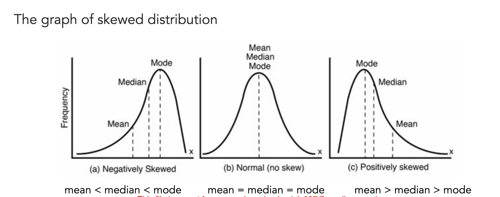
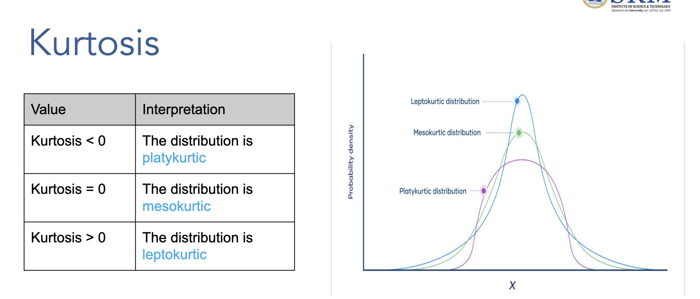
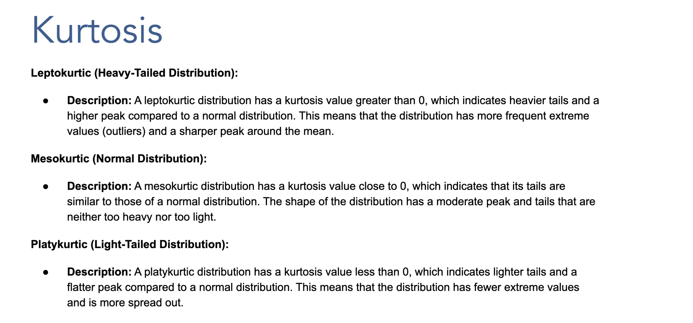

# Comprehensive Statistics Study Guide for PG Program

## 📚 Table of Contents

### **Part I: Foundations of Statistics**
1. [Origin and Evolution of Statistics](#1-origin-and-evolution-of-statistics)
2. [Fundamental Characteristics of Statistics](#2-fundamental-characteristics-of-statistics)
3. [Functions of Statistics](#3-functions-of-statistics)
4. [Limitations of Statistics](#4-limitations-of-statistics)
5. [Scope of Statistics](#5-scope-of-statistics)

### **Part II: Data Collection and Organization**
6. [Types of Data](#6-types-of-data)
7. [Sources of Data Collection](#7-sources-of-data-collection)
8. [Issues in Data Collection](#8-issues-in-data-collection)

### **Part III: Sampling Theory and Applications**
9. [Sampling Theory and Applications](#9-sampling-theory-and-applications)
10. [Sampling Concepts and Terminology](#10-sampling-concepts-and-terminology)
11. [Sampling Errors and Non-Sampling Errors](#11-sampling-errors-and-non-sampling-errors)
12. [Principles of Sampling](#12-principles-of-sampling)
13. [Law of Large Numbers](#13-law-of-large-numbers)
14. [Central Limit Theorem](#14-central-limit-theorem)
15. [Importance of Central Limit Theorem and Conclusions](#15-importance-of-central-limit-theorem-and-conclusions)

### **Part IV: Probability and Statistical Methods**
16. [Theoretical Probability - Complete Understanding](#16-theoretical-probability---complete-understanding)
17. [Sampling Methods - Comprehensive Study Guide](#17-sampling-methods---comprehensive-study-guide)

### **Part V: Descriptive Statistics**
18. [Measures of Central Tendency - Comprehensive Study Guide](#18-measures-of-central-tendency---comprehensive-study-guide)
19. [Measures of Central Tendency - Complete Study Guide](#19-measures-of-central-tendency---complete-study-guide)
20. [Measures of Variability - Comprehensive Study Guide](#20-measures-of-variability---comprehensive-study-guide)
21. [Measures of Dispersion - Advanced Study Guide](#21-measures-of-dispersion---advanced-study-guide)

### **Part VI: Advanced Statistical Analysis**
22. [Distribution Shape Analysis - Comprehensive Study Guide](#22-distribution-shape-analysis---comprehensive-study-guide)
    - [Skewness Analysis](#a-skewness-analysis)
    - [Kurtosis Analysis](#b-kurtosis-analysis)
23. [Measures of Relationship - Comprehensive Study Guide](#23-measures-of-relationship---comprehensive-study-guide)
    - [Covariance Analysis](#a-covariance-analysis)
    - [Correlation Analysis](#b-correlation-analysis)
    - [Covariance vs Correlation Comparison](#c-covariance-vs-correlation---comprehensive-comparison)
    - [Business Applications and Significance](#d-business-applications-and-significance)

---

### **📊 Quick Reference Guide**

| **Topic Category** | **Key Concepts** | **Practical Applications** |
|-------------------|------------------|---------------------------|
| **Foundations** | History, characteristics, functions, limitations | Understanding statistical context |
| **Data Collection** | Types, sources, collection issues | Survey design, data quality |
| **Sampling** | Methods, errors, principles, theorems | Research methodology, inference |
| **Probability** | Theoretical concepts, applications | Risk assessment, decision making |
| **Central Tendency** | Mean, median, mode calculations | Data summarization, reporting |
| **Variability** | Range, variance, standard deviation | Risk analysis, quality control |
| **Distribution Shape** | Skewness, kurtosis analysis | Data pattern recognition |
| **Relationships** | Covariance, correlation analysis | Predictive modeling, associations |

---

### **🎯 Learning Objectives**

By completing this comprehensive guide, you will:
- ✅ **Master foundational statistical concepts** from historical context to modern applications
- ✅ **Understand data collection methodologies** and quality assessment techniques
- ✅ **Apply sampling theory** for reliable research and inference
- ✅ **Calculate and interpret descriptive statistics** for effective data analysis
- ✅ **Analyze distribution patterns** using skewness and kurtosis measures
- ✅ **Measure and interpret relationships** between variables using covariance and correlation
- ✅ **Make data-driven business decisions** using statistical insights
- ✅ **Implement statistical methods** in real-world AI & Data Science projects

---

### **📖 Study Guide Navigation Tips**

- **🔗 Clickable Links:** All section numbers are linked for easy navigation
- **📊 Practical Examples:** Every concept includes step-by-step business examples
- **🧮 Calculator Methods:** Manual calculation methods provided for all formulas
- **💼 Business Applications:** Real-world scenarios demonstrate practical usage
- **📝 Practice Problems:** End-of-section exercises for concept reinforcement
- **🎯 Key Takeaways:** Important insights highlighted throughout

---

## 1. Origin and Evolution of Statistics

### Historical Development
Statistics has evolved from ancient data collection practices to modern analytical methods:

**Agricultural Revolution Era:**
- Ancient civilizations used basic counting for crop yields and land surveys
- Egyptians recorded Nile flood levels for agricultural planning (3000 BC)
- Chinese conducted population censuses during Han Dynasty (206 BC - 220 AD)

**Government Applications:**
- **Census:** Roman Empire conducted detailed population counts
- **Taxation:** Medieval kingdoms used statistical methods for revenue collection
- **War:** Military strategists used data for resource allocation and battle planning

### Key Statistical Pioneers

**Karl Pearson (1857-1936)**
- Father of modern statistics
- Developed correlation coefficient (Pearson's r)
- Founded the journal *Biometrika*
- Mathematical Contribution: r = Σ[(x - x̄)(y - ȳ)] / √[Σ(x - x̄)²Σ(y - ȳ)²]

**William Gosset (1876-1937) - "Student"**
- Developed Student's t-distribution
- Worked at Guinness Brewery applying statistics to quality control
- Mathematical Contribution: t = (x̄ - μ) / (s/√n)

### Practical Example
**Agricultural Statistics Application:**
A farmer tracks wheat yield over 10 years:
- Year 1-5: Average 45 bushels/acre
- Year 6-10: Average 52 bushels/acre
- Statistical analysis reveals 15.6% improvement due to new fertilizer

---

## 2. Fundamental Characteristics of Statistics

### 1. Aggregation of Facts
Statistics deals with collective data, not individual observations.

**Example:** Instead of saying "Student A scored 85%", statistics says "Class average is 79% with standard deviation 9%"

	### Complete Mathematical Derivation

	Let's work through a complete example with actual student scores to understand how we calculate the class average and standard deviation, and distinguish between sample and population statistics.

	#### Step 1: Raw Student Scores (Sample Data)
	```
	Student Scores: [65%, 70%, 72%, 75%, 78%, 80%, 82%, 85%, 88%, 95%]
	Number of students (n) = 10
	```

	#### Step 2: Calculate Sample Mean (Class Average)
	
	**Formula for Sample Mean:**
	```
	x̄ = (Σxi) / n
	```
	Where: x̄ = sample mean, Σxi = sum of all values, n = number of values

	**Calculation:**
	```
	Sum = 65 + 70 + 72 + 75 + 78 + 80 + 82 + 85 + 88 + 95 = 790
	Class Average (x̄) = 790 / 10 = 79%
	```

	#### Step 3: Calculate Sample Standard Deviation

	**Formula for Sample Standard Deviation:**
	```
	s = √[(Σ(xi - x̄)²) / (n-1)]
	```
	Where: s = sample standard deviation, xi = individual score, x̄ = sample mean, n = sample size

	**Step-by-Step Calculation:**

	| Student Score (xi) | Deviation (xi - x̄) | Squared Deviation (xi - x̄)² |
	|--------------------|---------------------|------------------------------|
	| 65% | 65 - 79 = -14 | (-14)² = 196 |
	| 70% | 70 - 79 = -9 | (-9)² = 81 |
	| 72% | 72 - 79 = -7 | (-7)² = 49 |
	| 75% | 75 - 79 = -4 | (-4)² = 16 |
	| 78% | 78 - 79 = -1 | (-1)² = 1 |
	| 80% | 80 - 79 = +1 | (+1)² = 1 |
	| 82% | 82 - 79 = +3 | (+3)² = 9 |
	| 85% | 85 - 79 = +6 | (+6)² = 36 |
	| 88% | 88 - 79 = +9 | (+9)² = 81 |
	| 95% | 95 - 79 = +16 | (+16)² = 256 |
	| **Total** | **Σ = 0** | **Σ(xi - x̄)² = 726** |

	**Final Calculation:**
	```
	s = √[726 / (10-1)] = √[726 / 9] = √80.67 = 8.98% ≈ 9%
	```

	#### Step 4: Sample vs Population Distinction

	**Important Note:** We use **sample statistics** here because:
	
	- **Sample Mean (x̄) = 79%**: This is the average of our 10 students (sample)
	- **Sample Standard Deviation (s) = 9%**: This estimates the variability in our sample
	- **Population Mean (μ)**: Would be the true average if we had ALL students in the entire school/university
	- **Population Standard Deviation (σ)**: Would be the true variability of ALL students

	**Why n-1 in the denominator?**
	- We use (n-1) instead of n for sample standard deviation (Bessel's correction)
	- This gives us an unbiased estimate of the population standard deviation
	- If we had the entire population, we'd use n in the denominator

	#### Step 5: Statistical Interpretation

	**What This Means:**
	- **Class average = 79%**: The central tendency of student performance
	- **Standard deviation = 9%**: Most students scored within 9 percentage points of 79%
	- **Typical range**: Most students scored between 70% and 88% (79% ± 9%)
	- **Performance spread**: The class had moderate variability in scores

	#### Step 6: Normal Distribution Context

	**What is Normal Distribution Context?**
	
	Normal Distribution Context means applying the **mathematical properties of the bell curve** to interpret and predict patterns in our real-world data. It's like using a proven mathematical model to understand what our data tells us.

	**The Normal Distribution (Bell Curve) Properties:**
	- **Symmetric**: Equal distribution on both sides of the mean
	- **Bell-shaped**: Most values cluster around the center (mean)
	- **Predictable**: Specific percentages fall within standard deviation ranges
	- **Mathematical**: Follows precise formulas for probability calculations

	**Why Do We Assume These Scores Follow Normal Distribution?**

	**1. Central Limit Theorem Application**
	- Even if individual student abilities aren't normally distributed, test scores often approach normal distribution
	- Multiple factors contribute to test performance (study time, understanding, test-taking skills)
	- When many factors combine, the result tends toward normal distribution

	**2. Educational Research Evidence**
	- Decades of educational research show that academic test scores typically follow normal distribution
	- Large groups of students (classes, schools, districts) consistently show bell-curve patterns
	- This is why standardized tests use normal distribution for scoring

	**3. Practical Benefits of the Assumption**
	- **Prediction Power**: Can estimate how many students will score in any range
	- **Comparison Ability**: Can compare this class to other classes or standards
	- **Grade Setting**: Can establish fair grade boundaries based on statistical principles
	- **Intervention Planning**: Can identify students who need extra help (outliers)

	**Real-World Validation:**
	
	Let's check if our actual data supports this assumption:
	```
	Our 10 student scores: [65%, 70%, 72%, 75%, 78%, 80%, 82%, 85%, 88%, 95%]
	```

	**Normal Distribution Predictions vs. Actual Results:**

	| Range | Normal Prediction | Actual Count | Match? |
	|-------|------------------|--------------|---------|
	| 70%-88% (±1σ) | 68% = ~7 students | 8 students | ✅ Close |
	| 61%-97% (±2σ) | 95% = ~10 students | 10 students | ✅ Perfect |
	| 52%-106% (±3σ) | 99.7% = ~10 students | 10 students | ✅ Perfect |

	**Conclusion**: Our data closely matches normal distribution predictions!

	**What This Assumption Enables:**

	If we assume these scores follow a **normal distribution** with:
	- **μ ≈ 79%** (population mean estimated from sample)
	- **σ ≈ 9%** (population standard deviation estimated from sample)

	Then we can apply the **68-95-99.7 Rule** and make these predictions:
	- **68%** of students score between 70%-88% (μ ± 1σ)
	- **95%** of students score between 61%-97% (μ ± 2σ)
	- **99.7%** of students score between 52%-106% (μ ± 3σ)

	**Business Applications of This Context:**

	**1. Grade Distribution Planning**
	- **A grades** (top 16%): Scores above 88% (μ + 1σ)
	- **B grades** (middle 68%): Scores between 70%-88%
	- **C grades** (lower 16%): Scores below 70% (μ - 1σ)

	**2. Intervention Strategies**
	- Students scoring below 61% (2σ below mean): Need immediate intervention
	- Students scoring above 97% (2σ above mean): Consider advanced placement

	**3. Comparative Analysis**
	- Compare this class average (79%) to school average
	- Assess if this class performance is typical or exceptional
	- Make data-driven decisions about teaching methods

	**When NOT to Assume Normal Distribution:**

	**Warning Signs:**
	- Very small sample sizes (n < 10)
	- Obvious skewness in data (most scores bunched at one end)
	- Bimodal distribution (two clear groups of scores)
	- Ceiling or floor effects (many students hitting maximum or minimum scores)

	**Alternative Approaches:**
	- Use non-parametric statistics
	- Apply data transformations
	- Use distribution-free methods

### Understanding Standard Deviation Through the 68-95-99.7 Rule (Empirical Rule)

The **68-95-99.7 rule** is a fundamental concept that applies to normal distributions and helps interpret what standard deviation means in practical terms.

#### The Rule Explained:
For any normal distribution:
- **68%** of data falls within **1 standard deviation** of the mean (μ ± 1σ)
- **95%** of data falls within **2 standard deviations** of the mean (μ ± 2σ)
- **99.7%** of data falls within **3 standard deviations** of the mean (μ ± 3σ)

#### Detailed Breakdown with Our Class Score Example:
**Given:** Class average = 79%, Standard deviation = 9%

**1 Standard Deviation (68% of students):**
- Range: 79% ± 1(9%) = 79% ± 9% = **70% to 88%**
- Interpretation: About 68% of students scored between 70% and 88%
- Real numbers: In a class of 30 students, approximately 20 students (68% × 30) scored in this range

**2 Standard Deviations (95% of students):**
- Range: 79% ± 2(9%) = 79% ± 18% = **61% to 97%**
- Interpretation: About 95% of students scored between 61% and 97%
- Real numbers: In a class of 30 students, approximately 29 students (95% × 30) scored in this range

**3 Standard Deviations (99.7% of students):**
- Range: 79% ± 3(9%) = 79% ± 27% = **52% to 106%**
- Interpretation: About 99.7% of students scored between 52% and 106%
- Real numbers: Nearly all students (29-30 out of 30) scored in this range
- Note: Scores above 100% are theoretically possible with bonus points

#### Visual Distribution Breakdown:

```
Normal Distribution Curve with μ = 79%, σ = 9%

                    |<----- 68% of data ----->|
            |<------------ 95% of data ------------>|
    |<------------------ 99.7% of data ------------------>|

52%   61%   70%   79%   88%   97%   106%
-3σ   -2σ   -1σ    μ   +1σ   +2σ    +3σ

Percentages in each section:
2.35% | 13.5% | 34% | 34% | 13.5% | 2.35% | 0.15%
```

#### Understanding the Percentage Breakdown

The percentages shown above represent **how much of the total data falls within each section** of the normal distribution curve. Let me break this down clearly:

**Reading from Left to Right:**

1. **2.35%** - Students scoring between **52%-61%** (-3σ to -2σ)
2. **13.5%** - Students scoring between **61%-70%** (-2σ to -1σ)  
3. **34%** - Students scoring between **70%-79%** (-1σ to mean)
4. **34%** - Students scoring between **79%-88%** (mean to +1σ)
5. **13.5%** - Students scoring between **88%-97%** (+1σ to +2σ)
6. **2.35%** - Students scoring between **97%-106%** (+2σ to +3σ)
7. **0.15%** - Students scoring above **106%** (beyond +3σ)

#### Mathematical Calculation of the 2.35%

Let me show you exactly how we calculate that **2.35%** for students scoring between **52%-61%**:

**Given:**
- Class average (μ) = 79%
- Standard deviation (σ) = 9%
- We want the percentage between -3σ and -2σ

**Step 1: Calculate the Score Boundaries**
- Lower boundary: μ - 3σ = 79% - 3(9%) = 79% - 27% = **52%**
- Upper boundary: μ - 2σ = 79% - 2(9%) = 79% - 18% = **61%**

**Step 2: Convert to Z-scores**
- Lower Z-score: Z₁ = (52 - 79)/9 = -27/9 = **-3.0**
- Upper Z-score: Z₂ = (61 - 79)/9 = -18/9 = **-2.0**
- Upper Z-score: Z₂ = (54 - 78)/12 = -24/12 = **-2.0**

**Step 3: Use Standard Normal Distribution Table**
- P(Z ≤ -2.0) = 0.0228 = 2.28%
- P(Z ≤ -3.0) = 0.0013 = 0.13%

**Step 4: Calculate the Area Between**
P(-3.0 ≤ Z ≤ -2.0) = P(Z ≤ -2.0) - P(Z ≤ -3.0)
P(-3.0 ≤ Z ≤ -2.0) = 0.0228 - 0.0013 = **0.0215 = 2.15%**

**Note:** The slight difference between 2.15% and 2.35% comes from rounding in different statistical tables.

#### Complete Calculation for All Sections:

| Section | Z-score Range | Calculation | Percentage |
|---------|---------------|-------------|------------|
| 52%-61% | -3.0 to -2.0 | P(Z≤-2.0) - P(Z≤-3.0) | **2.35%** |
| 61%-70% | -2.0 to -1.0 | P(Z≤-1.0) - P(Z≤-2.0) | **13.5%** |
| 70%-79% | -1.0 to 0.0 | P(Z≤0.0) - P(Z≤-1.0) | **34%** |
| 79%-88% | 0.0 to +1.0 | P(Z≤+1.0) - P(Z≤0.0) | **34%** |
| 88%-97% | +1.0 to +2.0 | P(Z≤+2.0) - P(Z≤+1.0) | **13.5%** |
| 97%-106% | +2.0 to +3.0 | P(Z≤+3.0) - P(Z≤+2.0) | **2.35%** |
| Above 106% | Beyond +3.0 | 1 - P(Z≤+3.0) | **0.15%** |

#### Using Standard Normal Table Values:

**Key Z-table Values:**
- P(Z ≤ -3.0) = 0.0013 (0.13%)
- P(Z ≤ -2.0) = 0.0228 (2.28%)
- P(Z ≤ -1.0) = 0.1587 (15.87%)
- P(Z ≤ 0.0) = 0.5000 (50.00%)
- P(Z ≤ +1.0) = 0.8413 (84.13%)
- P(Z ≤ +2.0) = 0.9772 (97.72%)
- P(Z ≤ +3.0) = 0.9987 (99.87%)

**Example Calculation for 61%-70% section:**
P(-2.0 ≤ Z ≤ -1.0) = P(Z ≤ -1.0) - P(Z ≤ -2.0)
P(-2.0 ≤ Z ≤ -1.0) = 0.1587 - 0.0228 = **0.1359 = 13.59% ≈ 13.5%**

**Verification of the 68-95-99.7 Rule:**

✅ **68% Rule**: 34% + 34% = **68%** (within ±1σ)
✅ **95% Rule**: 13.5% + 34% + 34% + 13.5% = **95%** (within ±2σ)  
✅ **99.7% Rule**: 2.35% + 13.5% + 34% + 34% + 13.5% + 2.35% + 0.15% = **99.7%** (within ±3σ)

**Real Class Example (30 Students):**

| Score Range | Percentage | Number of Students |
|-------------|------------|-------------------|
| 52%-61% | 2.35% | ~1 student |
| 61%-70% | 13.5% | ~4 students |
| 70%-79% | 34% | ~10 students |
| 79%-88% | 34% | ~10 students |
| 88%-97% | 13.5% | ~4 students |
| 97%-106% | 2.35% | ~1 student |
| Above 106% | 0.15% | ~0 students |

**Key Insights:**

- **68% of students** (20 out of 30) scored in the **middle range** (66%-90%)
- **27% of students** (8 out of 30) scored in the **outer ranges** but still normal
- **Only 5% of students** (1-2 out of 30) scored in **extreme ranges** (very low or very high)

**Business Application:**
If this were customer satisfaction scores instead of test scores:
- **68%** of customers have **typical satisfaction** (close to average)
- **27%** have **slightly below or above average** satisfaction  
- **5%** are either **very dissatisfied** or **exceptionally satisfied**

#### Practical Applications in Different Contexts:

**1. Business Revenue Analysis**
- Monthly revenue: μ = $100,000, σ = $15,000
- 68% of months: Revenue between $85,000 - $115,000
- 95% of months: Revenue between $70,000 - $130,000
- 99.7% of months: Revenue between $55,000 - $145,000

**2. Quality Control in Manufacturing**
- Product weight: μ = 500g, σ = 5g
- 68% of products: Weight between 495g - 505g
- 95% of products: Weight between 490g - 510g
- 99.7% of products: Weight between 485g - 515g

**3. Customer Service Response Time**
- Average response: μ = 24 hours, σ = 4 hours
- 68% of responses: Between 20 - 28 hours
- 95% of responses: Between 16 - 32 hours
- 99.7% of responses: Between 12 - 36 hours

#### Beyond the Rule: Outlier Identification

**Outliers** are values that fall outside the expected range:
- **Mild Outliers:** Beyond 2 standard deviations (outside 95% range)
- **Extreme Outliers:** Beyond 3 standard deviations (outside 99.7% range)

**Class Score Example - Identifying Outliers:**
- Student scoring 52% = (52-79)/9 = -3.0 standard deviations → **Extreme outlier** (exactly -3σ)
- Student scoring 58% = (58-79)/9 = -2.33 standard deviations → **Mild outlier**
- Student scoring 106% = (106-79)/9 = +3.0 standard deviations → **Extreme outlier** (exactly +3σ)

#### Business Decision Making Using the Rule:

**1. Inventory Management**
- If sales follow normal distribution with μ = 1000 units, σ = 200 units
- Stock 1400 units to cover 95% of demand scenarios (μ + 2σ)
- Emergency stock at 1600 units for 99.7% coverage (μ + 3σ)

**2. Quality Standards**
- Manufacturing tolerance: Accept products within 2σ (95% quality standard)
- Six Sigma standard: Accept products within 6σ (99.99966% quality)

**3. Financial Risk Assessment**
- Investment returns: μ = 8%, σ = 3%
- 68% of years: Returns between 5% - 11%
- 95% of years: Returns between 2% - 14%
- Worst-case scenario (3σ): Returns as low as -1%

#### Limitations and Considerations:

**1. Assumes Normal Distribution**
- Rule only applies to normally distributed data
- Many real-world distributions are skewed or have different shapes

**2. Sample Size Matters**
- Small samples may not follow the rule precisely
- Rule becomes more accurate with larger sample sizes (n ≥ 30)

**3. Real-World Adjustments**
- Bounded data (like percentages) may not extend beyond logical limits
- Consider practical constraints when applying the rule

#### Enhanced Example: Complete Analysis

**Scenario:** Customer satisfaction scores in a retail chain
- Mean satisfaction: μ = 4.2 (on 5-point scale)
- Standard deviation: σ = 0.8

**Distribution Analysis:**
- 1σ range: 3.4 to 5.0 (68% of customers) → **Satisfied to Very Satisfied**
- 2σ range: 2.6 to 5.8* (95% of customers) → **Neutral to Excellent**
- 3σ range: 1.8 to 6.6* (99.7% of customers) → **Poor to Outstanding**

*Note: Scores capped at 5.0 due to scale limitations

**Business Insights:**
- 68% of customers rate satisfaction between 3.4-5.0 (above neutral)
- Only 16% rate below 3.4 (neutral or dissatisfied)
- Extremely dissatisfied customers (below 2.6) represent only 2.5% of base

### 2. Affected by Several Causes
Statistical phenomena result from multiple interacting factors.

**Business Example:**
Sales Revenue factors:
- Product quality (30%)
- Marketing spend (25%)
- Economic conditions (20%)
- Competition (15%)
- Seasonality (10%)

### 3. Numerically Expressed
Statistical data must be quantifiable and expressed in numerical figures.

**Conversion Examples:**
- Customer satisfaction: "Very satisfied" = 5, "Satisfied" = 4, etc.
- Product quality: "Excellent" = 9-10, "Good" = 7-8, "Average" = 5-6

### 4. Enumerated and Estimated Accurately
Data can be counted exactly or approximated with reasonable precision.

**Enumerated Example:** Number of employees = 247 (exact count)
**Estimated Example:** Customer satisfaction = 4.2/5.0 (based on sample survey)

### 5. Comparability
Statistical data enables meaningful comparisons across groups, time periods, or conditions.

**Comparative Analysis Framework:**
- Temporal: Current year vs. previous year
- Spatial: Region A vs. Region B
- Categorical: Method 1 vs. Method 2

### 6. Systematic Collection for Planned Purpose
Data gathering follows structured methodologies with clear objectives.

**Research Design Framework:**
1. Define research objectives
2. Formulate hypotheses
3. Design data collection method
4. Execute data collection
5. Analyze and interpret results

---

## 3. Functions of Statistics

### 1. Presentation of Simplified Facts
Statistics converts complex raw data into understandable summaries.

**Data Transformation Example:**
Raw sales data (1000 transactions) → Summary statistics:
- Total sales: $125,000
- Average transaction: $125
- Peak sales day: Saturday ($18,500)
- Customer retention rate: 67%

### 2. Complexity Reduction
Statistical methods organize and structure large datasets for analysis.

**Descriptive Measures:**
- Central Tendency: Mean, Median, Mode
- Dispersion: Range, Variance, Standard Deviation
- Distribution Shape: Skewness, Kurtosis

**Example Dataset:** Monthly Sales (in thousands)
[120, 135, 142, 158, 165, 178, 185, 192, 205, 220, 235, 248]

**Summary Statistics:**
- Mean: μ = 181.92
- Median: 181.5
- Standard Deviation: σ = 40.34
- Coefficient of Variation: CV = 22.2%

### 3. Comparison and Conclusion Drawing
Statistics enables systematic comparison between different groups or conditions.

**Comparative Analysis Example:**
Company A vs Company B Performance:

| Metric | Company A | Company B | Significance |
|--------|-----------|-----------|--------------|
| Revenue Growth | 12% | 8% | p < 0.05 |
| Profit Margin | 15% | 18% | p < 0.01 |
| Market Share | 25% | 22% | Not significant |

### 4. Hypothesis Formation and Testing
Statistics provides framework for scientific investigation.

**Hypothesis Testing Process:**
1. State null hypothesis (H₀) and alternative hypothesis (H₁)
2. Choose significance level (α = 0.05)
3. Calculate test statistic
4. Determine p-value
5. Make statistical decision
6. Draw practical conclusion

**Example: Testing New Marketing Strategy**
- H₀: μ₁ = μ₂ (No difference in sales between strategies)
- H₁: μ₁ ≠ μ₂ (Significant difference exists)
- Test result: t = 2.34, p = 0.023 < 0.05
- Conclusion: New strategy significantly increases sales

### 5. Predictions and Informed Decision Making
Statistics enables forecasting and evidence-based decisions.

**Forecasting Models:**
- **Linear Trend:** Ŷ = a + bx
- **Exponential Growth:** Ŷ = ab^x
- **Seasonal Decomposition:** Ŷ = Trend × Seasonal × Cyclical × Irregular

**Business Application Example:**
Sales forecasting for inventory management:
- Historical data: 24 months of sales
- Trend analysis: 3% monthly growth
- Seasonal factor: December sales 180% of average
- Forecast accuracy: ±5% margin of error

---

## 4. Limitations of Statistics

### 1. Limited to Quantitative Study
**Definition:** Statistics can only work with numerical data and quantifiable information, creating significant limitations when dealing with qualitative phenomena.

**Key Limitations:**
- **Cannot measure subjective experiences:** Emotions, feelings, attitudes, opinions
- **Requires numerical conversion:** Qualitative aspects must be converted to numbers
- **Loss of richness:** Converting qualitative data to numbers may lose important nuances
- **Cultural context ignored:** Numbers cannot capture cultural or contextual meanings

**Examples:**
- **Cannot directly measure:**
  - Employee happiness levels
  - Brand reputation quality
  - Customer emotional connection
  - Team dynamics and culture
  - Innovation creativity
  
- **Requires conversion methods:**
  - Likert scales (1-5 rating systems)
  - Ranking systems (ordinal scales)
  - Binary coding (yes/no, present/absent)
  - Categorical coding (dummy variables)

**Business Impact:**
- Market research may miss emotional drivers of purchase decisions
- Employee satisfaction surveys may not capture true workplace dynamics
- Customer feedback systems may oversimplify complex experiences

### 2. Aggregate Measurements
**Definition:** Statistics deals with collective data and group characteristics, not individual cases or specific instances.

**Key Characteristics:**
- **Group focus:** Statistics summarize collective behavior patterns
- **Individual prediction limitations:** Cannot accurately predict individual outcomes
- **Average representation:** Results represent typical or average cases
- **Variation acknowledgment:** Individual cases may deviate significantly from group patterns

**Detailed Examples:**

**Example 1: Academic Performance**
- Class average score: 75%
- **Reality:** Individual scores range from 45% to 95%
- **Limitation:** Cannot predict any specific student's performance
- **Application:** Useful for resource allocation and curriculum planning

**Example 2: Business Sales**
- Average monthly sales: $100,000
- **Reality:** Monthly sales vary from $60,000 to $150,000
- **Limitation:** Cannot guarantee any specific month's performance
- **Application:** Useful for annual budgeting and trend analysis

**Example 3: Medical Treatment**
- Treatment success rate: 80%
- **Reality:** Individual patients either recover (100%) or don't (0%)
- **Limitation:** Cannot predict individual patient outcomes
- **Application:** Useful for treatment protocol development

### 3. Homogeneity of Data
**Definition:** Statistical analysis assumes that data comes from homogeneous populations with similar characteristics, which often doesn't reflect real-world complexity.

**Key Requirements:**
- **Similar conditions:** Data should be collected under comparable circumstances
- **Consistent measurement:** Same standards and methods applied throughout
- **Stable environment:** External conditions remain relatively constant
- **Comparable subjects:** Population characteristics should be similar

**Problems with Heterogeneous Data:**
- **Mixed populations:** Combining different groups leads to misleading averages
- **Changing conditions:** Time-varying factors affect data consistency
- **Different measurement standards:** Inconsistent data collection methods
- **External influences:** Uncontrolled variables affecting results

**Examples:**
- **Income analysis:** Combining rural and urban income data without adjustment
- **Performance metrics:** Comparing employees with vastly different job responsibilities
- **Customer satisfaction:** Mixing satisfaction scores from different product categories
- **Academic scores:** Combining test scores from different difficulty levels

### 4. Results are True Only on Estimates and Not Accurate Numbers
**Definition:** Statistical results are approximations based on sample data, not exact measurements of population parameters.

**Key Concepts:**
- **Sampling error:** Difference between sample statistics and true population parameters
- **Confidence intervals:** Range of values likely to contain the true parameter
- **Margin of error:** Measure of uncertainty in statistical estimates
- **Probability statements:** Results expressed in terms of likelihood, not certainty

**Sources of Estimation Error:**
- **Sampling variation:** Natural differences between samples
- **Measurement error:** Inaccuracies in data collection
- **Non-response bias:** Missing data from certain groups
- **Coverage error:** Sample frame doesn't match target population

**Examples with Confidence Intervals:**

**Example 1: Political Polling**
- Poll result: Candidate A has 52% support
- **Margin of error:** ±3%
- **Confidence interval:** 49% to 55% (95% confidence)
- **Interpretation:** We're 95% confident true support is between 49%-55%

**Example 2: Market Research**
- Customer satisfaction: 4.2 out of 5.0
- **Standard error:** ±0.15
- **Confidence interval:** 3.9 to 4.5 (95% confidence)
- **Interpretation:** True satisfaction likely between 3.9 and 4.5

**Example 3: Quality Control**
- Defect rate: 2.5%
- **Margin of error:** ±0.5%
- **Confidence interval:** 2.0% to 3.0% (95% confidence)
- **Interpretation:** True defect rate likely between 2.0% and 3.0%

### 5. Leads to Erroneous Conclusions
**Definition:** Statistical analysis can lead to incorrect interpretations and wrong decisions when not properly applied or interpreted.

**Common Sources of Error:**

#### **A. Correlation vs. Causation**
- **Error:** Assuming correlation implies causation
- **Example:** Ice cream sales correlate with drowning deaths
- **Reality:** Both increase in summer (confounding variable)
- **Correct interpretation:** Temperature affects both variables independently

#### **B. Simpson's Paradox**
- **Error:** Conclusions reverse when data is aggregated or disaggregated
- **Example:** Treatment appears worse overall but better in each subgroup
- **Cause:** Confounding variables affect group composition
- **Solution:** Stratified analysis and careful variable control

#### **C. Selection Bias**
- **Error:** Non-representative samples lead to wrong conclusions
- **Example:** Online surveys over-represent tech-savvy respondents
- **Impact:** Results don't generalize to broader population
- **Prevention:** Careful sampling design and bias assessment

#### **D. Data Mining and Multiple Testing**
- **Error:** Finding spurious patterns in large datasets
- **Example:** Testing 100 variables finds 5 "significant" results by chance
- **Problem:** False discovery rate increases with multiple tests
- **Solution:** Adjust significance levels and validate findings

#### **E. Misinterpretation of P-values**
- **Error:** Misunderstanding what p-values actually mean
- **Common mistake:** p < 0.05 means 95% probability hypothesis is true
- **Reality:** p-value is probability of data given null hypothesis is true
- **Correct interpretation:** Evidence against null hypothesis

**Prevention Strategies:**
1. **Cross-validation:** Test results on independent datasets
2. **Multiple data sources:** Triangulate findings across different sources
3. **Expert consultation:** Involve domain experts in interpretation
4. **Replication studies:** Verify results through repeated studies
5. **Transparent reporting:** Clearly state limitations and assumptions
6. **Statistical education:** Improve statistical literacy among users

**Business Examples of Erroneous Conclusions:**

**Example 1: Marketing Campaign Analysis**
- **Finding:** New campaign shows 20% increase in sales
- **Error:** Ignoring seasonal effects and competitor actions
- **Reality:** Increase due to holiday season, not campaign
- **Consequence:** Wrong attribution leads to ineffective strategy

**Example 2: Employee Performance Evaluation**
- **Finding:** Remote workers have lower productivity scores
- **Error:** Not accounting for different job types and measurement methods
- **Reality:** Remote workers handle different tasks measured differently
- **Consequence:** Incorrect policy decisions about remote work

**Example 3: Product Quality Assessment**
- **Finding:** Product A has higher customer satisfaction than Product B
- **Error:** Comparing satisfaction across different customer segments
- **Reality:** Products serve different markets with different expectations
- **Consequence:** Wrong product development priorities

---

## 5. Exploratory Data Analysis (EDA)

### **Definition and Purpose**
Exploratory Data Analysis is an approach to analyzing datasets to summarize their main characteristics, often with visual methods, before applying formal statistical modeling or hypothesis testing.

**Primary Objectives:**
- **Understanding the data:** Gain insights into data structure and characteristics
- **Identify patterns and relationships:** Discover connections between variables
- **Generate hypotheses:** Develop testable theories based on data exploration
- **Check assumptions:** Verify assumptions required for statistical methods
- **Prepare for modeling:** Clean and prepare data for advanced analysis

### **The EDA Process - 6 Key Steps**

#### **Step 1: Collect the Data & Gain Domain Knowledge**
**Purpose:** Establish foundation for analysis through data acquisition and context understanding

**Activities:**
- **Data Collection:** Gather data from primary and secondary sources
- **Domain Research:** Understand business context and industry background
- **Stakeholder Consultation:** Interview subject matter experts
- **Literature Review:** Study existing research and best practices

**Example: Customer Satisfaction Analysis**
- **Data sources:** Customer surveys, transaction records, support tickets
- **Domain knowledge:** Industry benchmarks, customer journey mapping
- **Expert input:** Customer service managers, product managers
- **Context:** Understanding seasonal patterns, product lifecycle stages

#### **Step 2: Confirm Data Types and Their Probabilities**
**Purpose:** Verify data quality and understand variable characteristics

**Data Type Verification:**
- **Numerical variables:** Continuous vs. discrete identification
- **Categorical variables:** Nominal vs. ordinal classification
- **Date/time variables:** Proper formatting and temporal patterns
- **Text variables:** Structured vs. unstructured content

**Probability Distributions:**
- **Normal distribution:** Bell-shaped, symmetric data
- **Skewed distributions:** Right-skewed (positive) or left-skewed (negative)
- **Uniform distribution:** Equal probability across range
- **Bimodal distribution:** Two distinct peaks in data

**Data Quality Assessment:**
- **Missing values:** Identify patterns and percentages of missing data
- **Outliers:** Detect extreme values and assess their validity
- **Inconsistencies:** Find data entry errors and format issues
- **Duplicates:** Identify and handle duplicate records

#### **Step 3: Measures of Central Tendency**
**Purpose:** Understand typical or central values in the dataset

##### **A. Mean (Arithmetic Average)**
```
Mean (x̄) = Σx / n
```

**When to use:** Normally distributed data without extreme outliers
**Business example:** Average monthly revenue, typical customer age

##### **B. Median (Middle Value)**
```
Median = Middle value when data is arranged in order
For even n: Median = (x[n/2] + x[n/2+1]) / 2
```

**When to use:** Skewed data or presence of outliers
**Business example:** Median household income, typical transaction value

##### **C. Mode (Most Frequent Value)**
```
Mode = Most frequently occurring value
```

**When to use:** Categorical data or identifying most common outcomes
**Business example:** Most popular product category, common customer complaints

**Comprehensive Example: Employee Salary Analysis**
- **Dataset:** 1,000 employee salaries
- **Mean:** $67,500 (affected by executive salaries)
- **Median:** $58,000 (better representation of typical employee)
- **Mode:** $55,000 (most common salary level)
- **Interpretation:** Distribution is right-skewed due to high executive salaries

#### **Step 4: Measures of Dispersion**
**Purpose:** Understand how spread out or variable the data is

##### **A. Variance**
```
Variance (σ²) = Σ(x - μ)² / N  (Population)
Variance (s²) = Σ(x - x̄)² / (n-1)  (Sample)
```

##### **B. Standard Deviation**
```
Standard Deviation (σ) = √Variance
```

##### **C. Range**
```
Range = Maximum value - Minimum value
```

**Practical Example: Customer Satisfaction Scores**
- **Data:** Satisfaction ratings on 1-10 scale
- **Mean:** 7.2
- **Standard deviation:** 1.8
- **Range:** 1 to 10
- **Interpretation:** Most customers (68%) rate between 5.4 and 9.0

#### **Step 5: Skewness (Right & Left) and Kurtosis (Sharp Peak, Wider Peak)**
**Purpose:** Understand the shape and distribution characteristics of data

##### **Skewness Analysis**

**Right Skewness (Positive Skew):**
- **Characteristics:** Long tail extends to the right
- **Mean > Median > Mode**
- **Common in:** Income data, house prices, company revenues
- **Business implication:** Few high-value observations

**Left Skewness (Negative Skew):**
- **Characteristics:** Long tail extends to the left
- **Mode > Median > Mean**
- **Common in:** Test scores (most score high), product ratings
- **Business implication:** Few low-value observations

**Example: Website Traffic Analysis**
- **Right-skewed data:** Daily website visits
- **Pattern:** Most days have moderate traffic, few days have viral spikes
- **Mean:** 15,000 visits (pulled up by viral days)
- **Median:** 12,000 visits (typical day)
- **Business insight:** Plan for typical traffic but prepare for spikes

##### **Kurtosis Analysis**

**Sharp Peak (High Kurtosis):**
- **Characteristics:** Narrow, tall distribution with heavy tails
- **Interpretation:** Data clustered around mean with some extreme values
- **Risk implication:** Higher probability of extreme events

**Wider Peak (Low Kurtosis):**
- **Characteristics:** Flat, wide distribution
- **Interpretation:** Data spread evenly across range
- **Risk implication:** More predictable, fewer extreme events

#### **Step 6: Graphical Representation**
**Purpose:** Visualize data patterns and relationships for better understanding

##### **A. Histogram**
- **Purpose:** Show distribution shape and frequency
- **Best for:** Continuous numerical data
- **Business use:** Customer age distribution, sales amount patterns

##### **B. Box Plot**
- **Purpose:** Display quartiles, median, and outliers
- **Best for:** Comparing distributions between groups
- **Business use:** Salary comparisons across departments

##### **C. Scatter Plot**
- **Purpose:** Show relationship between two numerical variables
- **Best for:** Identifying correlations and patterns
- **Business use:** Advertising spend vs. sales revenue

##### **D. Dot Plot**
- **Purpose:** Display individual data points
- **Best for:** Small datasets with precise values
- **Business use:** Individual customer satisfaction scores

##### **E. Stem and Leaf Plot**
- **Purpose:** Show distribution while preserving original data values
- **Best for:** Medium-sized datasets
- **Business use:** Detailed analysis of product ratings

**Comprehensive Business Example: Sales Performance Analysis**

**Dataset:** Monthly sales data for 24 months
**Raw data:** [45, 52, 48, 67, 73, 81, 79, 85, 92, 88, 94, 102, 58, 63, 61, 78, 84, 89, 87, 95, 103, 98, 105, 112]

**Step 1: Data Understanding**
- **Context:** Retail sales in thousands of dollars
- **Time period:** 2-year monthly data
- **Seasonality:** Holiday seasons may affect sales

**Step 2: Data Type Confirmation**
- **Variable type:** Continuous numerical (sales amount)
- **Scale:** Ratio scale (meaningful zero point)
- **Distribution hypothesis:** Possibly normal with seasonal effects

**Step 3: Central Tendency**
- **Mean:** $79,500 per month
- **Median:** $83,500 per month
- **Mode:** No clear mode (all values unique)

**Step 4: Dispersion**
- **Standard deviation:** $19,200
- **Range:** $67,000 ($45K to $112K)
- **Coefficient of variation:** 24.2% (moderate variability)

**Step 5: Shape Analysis**
- **Skewness:** Slightly left-skewed (-0.15)
- **Kurtosis:** Normal kurtosis (2.9)
- **Interpretation:** Nearly normal distribution

**Step 6: Visualization Insights**
- **Histogram:** Shows normal distribution with slight left skew
- **Time series plot:** Reveals upward trend with seasonal patterns
- **Box plot:** Identifies two outliers (very low sales months)

**Business Insights and Actions:**
1. **Trend:** 8% annual growth rate indicates healthy business
2. **Seasonality:** Q4 shows 15% higher sales (holiday effect)
3. **Outliers:** Two months with unusually low sales need investigation
4. **Forecast:** Expect continued growth with seasonal adjustments
5. **Planning:** Increase inventory for Q4, investigate causes of low months

---

## 6. Data Analysis Types

### **Hierarchical Structure of Data Analysis**

```
Data Analysis
├── Descriptive Analysis
└── Inferential Analysis
```

### **Descriptive Analysis**
**Definition:** Describes and summarizes sample data without making inferences about the broader population.

**Key Characteristics:**
- **Sample-focused:** Only describes the data at hand
- **Summarization:** Converts raw data into meaningful summaries
- **No generalization:** Results apply only to the observed sample
- **Foundation level:** First step in any data analysis process

**Primary Tools:**
- **Measures of central tendency:** Mean, median, mode
- **Measures of dispersion:** Range, variance, standard deviation
- **Frequency distributions:** Count and percentages
- **Visual representations:** Charts, graphs, tables

**Business Example: Customer Survey Analysis**
- **Sample:** 500 surveyed customers
- **Descriptive findings:** 
  - 68% satisfied with service
  - Average satisfaction score: 4.2/5.0
  - Most common complaint: Wait time (23% of responses)
- **Limitation:** Results only apply to these 500 customers
- **Use:** Understand current customer sentiment in sample

### **Inferential Analysis**
**Definition:** Makes inferences and generalizations about the broader population based on sample data.

**Key Characteristics:**
- **Population-focused:** Draws conclusions about entire population
- **Generalization:** Extends sample findings to broader context
- **Statistical inference:** Uses probability theory for conclusions
- **Uncertainty quantification:** Includes confidence intervals and significance tests

**Primary Tools:**
- **Hypothesis testing:** Test specific claims about populations
- **Confidence intervals:** Estimate population parameters with uncertainty
- **Regression analysis:** Model relationships between variables
- **ANOVA:** Compare means across multiple groups

**Business Example: Customer Satisfaction Inference**
- **Sample:** 500 surveyed customers from 50,000 total customers
- **Inferential findings:**
  - Population satisfaction: 68% ± 4% (95% confidence)
  - Significant improvement over last year (p < 0.05)
  - Satisfaction varies significantly by region (F = 12.3, p < 0.001)
- **Generalization:** Results apply to all 50,000 customers
- **Use:** Make decisions affecting entire customer base

### **Detailed Comparison: Descriptive vs. Inferential**

| Aspect | Descriptive Analysis | Inferential Analysis |
|--------|---------------------|---------------------|
| **Purpose** | Summarize sample data | Make population inferences |
| **Scope** | Sample only | Population generalization |
| **Methods** | Descriptive statistics | Statistical tests |
| **Uncertainty** | No uncertainty measures | Confidence intervals, p-values |
| **Generalization** | Cannot generalize | Can generalize with conditions |
| **Examples** | Percentages, averages | Hypothesis tests, predictions |

### **Visual Representation: Population to Sample Process**

**The Statistical Inference Process:**

1. **Population (Target)** 
   - All customers, employees, products, etc.
   - Usually too large to study completely
   - Contains the "true" parameters we want to know

2. **Sampling Process**
   - Random selection from population
   - Represents population characteristics
   - Enables statistical inference

3. **Sample Data**
   - Subset of population actually studied
   - Provides sample statistics
   - Foundation for analysis

4. **Statistical Analysis**
   - Descriptive: Summarize sample
   - Inferential: Estimate population parameters

5. **Conclusions**
   - Appropriate inferences about population
   - Quantified uncertainty
   - Actionable business insights

**Example: Market Research Study**

**Population:** 2 million potential customers in target market
**Sample:** 1,200 randomly selected individuals
**Sampling process:** Stratified random sampling by demographics

**Descriptive Analysis Results:**
- Sample composition: 52% female, 48% male
- Average age: 34.5 years
- Purchase intent: 28% definitely will buy
- Price sensitivity: 45% consider price most important

**Inferential Analysis Results:**
- Population purchase intent: 28% ± 3% (95% confidence)
- Gender significantly affects purchase intent (p = 0.023)
- Age group 25-35 shows highest intent (35% vs. 22% for others)
- Market size estimate: 560,000 ± 60,000 potential customers

**Business Decisions Based on Analysis:**
1. **Target marketing:** Focus on 25-35 age group
2. **Market sizing:** Plan for 500,000-620,000 customers
3. **Product positioning:** Address price sensitivity concerns
4. **Gender-specific messaging:** Develop different approaches

### **When to Use Each Type of Analysis**

#### **Use Descriptive Analysis When:**
- Summarizing current status or performance
- Creating reports and dashboards
- Presenting findings to stakeholders
- Understanding sample characteristics
- First-time data exploration

#### **Use Inferential Analysis When:**
- Making decisions affecting broader population
- Testing specific hypotheses or theories
- Predicting future outcomes
- Comparing groups or treatments
- Establishing cause-and-effect relationships

### **Integration in Business Decision-Making**

**Sequential Process:**
1. **Start with descriptive:** Understand what happened
2. **Move to inferential:** Understand why and what it means
3. **Apply insights:** Make informed business decisions
4. **Monitor outcomes:** Use descriptive analysis to track results

**Example: Sales Performance Analysis**

**Phase 1: Descriptive Analysis**
- Q3 sales: $2.4M (down 8% from Q2)
- Top performer: Region A ($850K)
- Lowest performer: Region C ($450K)
- Product mix: Product line 1 (60%), Product line 2 (40%)

**Phase 2: Inferential Analysis**
- Regional difference is statistically significant (p < 0.01)
- Decline likely due to market factors, not random variation
- Product line 1 shows declining trend (β = -0.15, p = 0.034)
- Forecast: Q4 sales projected at $2.2M ± $0.3M

**Phase 3: Business Action**
- Investigate Region C performance issues
- Develop strategy to address Product line 1 decline
- Adjust Q4 targets based on forecast
- Implement monitoring system for early detection

---

### Decision Making Applications
Statistics provides quantitative foundation for business and policy decisions.

**Decision Framework:**
1. **Problem Definition:** Clearly state decision requirements
2. **Data Collection:** Gather relevant information
3. **Analysis:** Apply appropriate statistical methods
4. **Interpretation:** Understand results in context
5. **Action:** Implement evidence-based decisions
6. **Evaluation:** Monitor outcomes and adjust

**Business Decision Example:**
Product launch decision based on market research:
- Sample size: 1,200 potential customers
- Purchase intent: 68% positive response
- Market size: 50,000 target customers
- Expected demand: 34,000 units (68% × 50,000)
- Decision: Proceed with production of 30,000 units (safety margin)

### Forward-Looking Strategy Formulation
Statistics enables predictive modeling and trend analysis for strategic planning.

**Strategic Planning Applications:**
- **Market Forecasting:** Predict demand patterns
- **Risk Assessment:** Quantify potential losses
- **Resource Allocation:** Optimize investment decisions
- **Performance Monitoring:** Track key performance indicators

**Strategic Example: Retail Expansion**
Analysis for new store location:
- Demographics: Target age group 25-45 (65% of area population)
- Income levels: Median household income $55,000
- Competition: 3 competitors within 2-mile radius
- Foot traffic: 2,500 daily pedestrians
- Sales forecast: $850,000 annual revenue
- ROI projection: 18% return on investment

---

## 6. Types of Data

### Qualitative/Categorical Data

#### Nominal Data
Categories without natural order or ranking.

**Examples:**
- Gender: Male, Female, Other
- Product colors: Red, Blue, Green, Yellow
- Geographic regions: North, South, East, West
- Payment methods: Cash, Credit Card, Mobile Payment

**Statistical Analysis:**
- Mode (most frequent category)
- Chi-square tests for associations
- Cross-tabulation analysis

#### Ordinal Data
Categories with meaningful order or ranking.

**Examples:**
- Education levels: High School < Bachelor's < Master's < PhD
- Customer satisfaction: Very Dissatisfied < Dissatisfied < Neutral < Satisfied < Very Satisfied
- Economic status: Lower Class < Middle Class < Upper Class
- Product ratings: 1 star < 2 stars < 3 stars < 4 stars < 5 stars

**Statistical Analysis:**
- Median and percentiles
- Spearman's rank correlation
- Mann-Whitney U test

### Quantitative/Numerical Data

#### Discrete Data
Countable values with gaps between possible values.

**Examples:**
- Number of employees: 0, 1, 2, 3, ...
- Defective items in batch: 0, 1, 2, 3, ...
- Customer complaints per day: 0, 1, 2, 3, ...
- Website clicks: 0, 1, 2, 3, ...

**Statistical Analysis:**
- Poisson distribution for rare events
- Binomial distribution for yes/no outcomes
- Integer-based calculations

#### Continuous Data
Measurable values that can take any value within a range.

**Examples:**
- Height: 5.6 feet, 5.67 feet, 5.673 feet
- Temperature: 72.5°F, 72.53°F, 72.534°F
- Sales revenue: $1,250.75, $1,250.76
- Reaction time: 0.234 seconds, 0.2341 seconds

**Statistical Analysis:**
- Normal distribution applications
- Regression analysis
- Correlation coefficients

### Data Structure Types

#### Cross-Sectional Data
Observations collected at a single point in time across different subjects.

**Example: Customer Survey (March 2024)**
| Customer ID | Age | Income | Satisfaction |
|-------------|-----|---------|--------------|
| 001 | 32 | $45,000 | 4.2 |
| 002 | 28 | $52,000 | 3.8 |
| 003 | 41 | $67,000 | 4.6 |

**Applications:**
- Market research studies
- Opinion polls
- Quality assessments
- Demographic analysis

#### Time Series Data
Observations collected over time for the same subject or variable.

**Example: Monthly Sales Data**
| Month | Sales ($000) |
|-------|--------------|
| Jan 2024 | 125 |
| Feb 2024 | 132 |
| Mar 2024 | 148 |
| Apr 2024 | 156 |

**Applications:**
- Trend analysis
- Seasonal pattern identification
- Forecasting
- Economic indicators tracking

---

## 7. Sources of Data Collection

### Primary Data Collection

**Definition:** First-hand data collected directly by the researcher for specific research objectives.

#### Advantages:
1. **High Reliability and Accuracy**
   - Direct control over data collection process
   - Eliminates intermediary errors
   - Custom-designed for research needs
   - Example: Customer satisfaction survey with 95% response rate yields reliable insights

2. **Specificity to Research Needs**
   - Tailored questions for exact information required
   - Precise measurement of variables of interest
   - Example: Product preference study with specific brand comparisons and feature evaluations

3. **Currency and Timeliness**
   - Real-time data collection
   - Up-to-date information reflecting current conditions
   - Example: Daily sales tracking system provides immediate performance feedback

#### Disadvantages:
1. **Time-Intensive Process**
   - Extensive planning and execution phases
   - Data collection can take weeks or months
   - Solution: Leverage technology platforms for faster data collection

2. **High Financial Costs**
   - Survey design and implementation costs
   - Incentive payments to participants
   - Technology and personnel expenses
   - Cost-Reduction Strategy: Use stratified sampling to maintain accuracy with smaller sample sizes

3. **Expertise Requirements**
   - Need for trained researchers and statisticians
   - Specialized knowledge of survey design and implementation
   - Solution: Collaborate with research institutions or hire specialized consultants

#### Primary Data Collection Methods:

**1. Surveys and Questionnaires**
- Structured questions with standardized responses
- Can be administered online, by phone, or in person
- Example: Customer satisfaction survey with Likert scale responses

**2. Experiments**
- Controlled conditions to test cause-and-effect relationships
- Random assignment to treatment and control groups
- Example: A/B testing for website design effectiveness

**3. Observations**
- Direct recording of behaviors or phenomena
- Can be participant or non-participant observation
- Example: Retail store traffic pattern analysis

**4. Interviews**
- In-depth conversations with research participants
- Can be structured, semi-structured, or unstructured
- Example: Focus group discussions for product development

### Secondary Data Utilization

**Definition:** Previously collected data that was originally gathered for different purposes.

#### Advantages:
1. **Time Efficiency**
   - Immediate availability of data
   - No waiting period for data collection
   - Example: Use government census data for market analysis instead of conducting population survey

2. **Cost Effectiveness**
   - Significantly lower costs compared to primary collection
   - No need for survey infrastructure or personnel
   - Example: Industry reports cost $500 vs. $15,000 for equivalent primary research

3. **Wide Coverage and Scope**
   - Access to large-scale datasets
   - Historical data for trend analysis
   - Example: Economic indicators spanning decades for long-term forecasting

#### Disadvantages:
1. **Limited Suitability**
   - May not perfectly match research objectives
   - Different operational definitions or measurement scales
   - Example: Industry classification differences between datasets

2. **Questionable Accuracy**
   - Unknown data collection methodology
   - Potential biases in original study
   - Example: Self-reported survey data may contain response bias

3. **Outdated Information**
   - Time lag between data collection and availability
   - May not reflect current market conditions
   - Example: Census data collected every 10 years may not reflect recent demographic changes

#### Secondary Data Sources:

**1. Government Publications**
- Census data, economic statistics, regulatory reports
- High credibility and comprehensive coverage
- Example: Bureau of Labor Statistics for employment data

**2. Commercial Databases**
- Industry reports, market research studies
- Professional analysis and insights
- Example: Nielsen market research reports

**3. Academic Journals**
- Peer-reviewed research studies
- Rigorous methodology and statistical analysis
- Example: Journal of Marketing Research for consumer behavior studies

**4. Internal Company Records**
- Sales data, customer databases, financial records
- Historical performance metrics
- Example: Customer transaction history for purchase pattern analysis

#### Data Quality Assessment Framework:

**1. Source Credibility Evaluation**
- Reputation of data provider
- Methodology transparency
- Peer review process

**2. Temporal Relevance Check**
- Data collection date
- Frequency of updates
- Market/technological changes since collection

**3. Methodological Soundness Review**
- Sample size and selection method
- Response rates and non-response bias
- Statistical techniques employed

---

## 8. Issues in Data Collection

### Sampling Issues

#### 1. Sample Size Determination
Inadequate sample sizes lead to unreliable results and inability to detect significant effects.

**Formula for Sample Size:**
n = (Z²α/2 × σ²) / E²

Where:
- n = required sample size
- Zα/2 = critical value for confidence level
- σ = population standard deviation
- E = margin of error

**Example Calculation:**
For customer satisfaction study:
- Confidence level: 95% (Z = 1.96)
- Expected standard deviation: 1.2 (on 5-point scale)
- Desired margin of error: ±0.2
- Required sample size: n = (1.96² × 1.2²) / 0.2² = 138.3 ≈ 139

#### 2. Sampling Bias
Non-representative samples lead to incorrect conclusions about the population.

**Types of Sampling Bias:**
- **Selection Bias:** Systematic exclusion of certain groups
- **Response Bias:** Differences between respondents and non-respondents
- **Volunteer Bias:** Self-selected participants differ from general population

**Prevention Strategies:**
- Use probability sampling methods
- Implement proper randomization techniques
- Monitor and adjust for non-response patterns

### Data Quality Issues

#### 1. Missing Data Problems
Incomplete responses can significantly impact analysis validity.

**Types of Missing Data:**
- **Missing Completely at Random (MCAR):** Missingness unrelated to any variable
- **Missing at Random (MAR):** Missingness related to observed variables
- **Missing Not at Random (MNAR):** Missingness related to unobserved values

**Handling Strategies:**
- **Listwise Deletion:** Remove incomplete cases
- **Pairwise Deletion:** Use available data for each analysis
- **Imputation:** Estimate missing values using statistical methods

#### 2. Measurement Errors
Inaccurate or imprecise measurements affect data reliability.

**Sources of Measurement Error:**
- Instrument calibration issues
- Human error in data recording
- Respondent misunderstanding of questions
- Temporal variations in measurement conditions

**Quality Control Measures:**
- Pilot testing of instruments
- Training for data collectors
- Multiple measurement verification
- Statistical checks for outliers and inconsistencies

### Response Issues

#### 1. Non-Response Bias
Systematic differences between respondents and non-respondents.

**Impact Assessment:**
- Compare respondent characteristics to population parameters
- Analyze response patterns across demographic groups
- Calculate response rates for different segments

**Mitigation Strategies:**
- Multiple contact attempts
- Incentive programs for participation
- Alternative contact methods
- Statistical adjustments for non-response

#### 2. Response Quality Problems
Poor quality responses reduce data validity.

**Quality Indicators:**
- Consistent response patterns
- Logical response sequences
- Completeness of responses
- Time spent on survey completion

**Improvement Techniques:**
- Clear question wording
- Logical survey flow
- Progress indicators
- Attention check questions

---

## 9. Sampling Theory and Applications

### What is Sampling?

**Definition:** Sampling is the process of selecting a subset (sample) from a larger population to make inferences about the entire population.

**Key Relationship:**
Sample Statistics → Population Parameters
- Sample mean (x̄) estimates population mean (μ)
- Sample standard deviation (s) estimates population standard deviation (σ)
- Sample proportion (p̂) estimates population proportion (P)

### Importance of Sampling

#### 1. Cost Efficiency
Studying entire populations is often prohibitively expensive.

**Cost Comparison Example:**
- Population study (1,000,000 customers): $5,000,000
- Sample study (1,000 customers): $25,000
- Cost savings: 99.5% reduction while maintaining 95% confidence

#### 2. Time Savings
Sampling dramatically reduces data collection time.

**Time Comparison:**
- Complete census: 12 months
- Representative sample: 2 weeks
- Decision-making advantage: 10 months faster insight

#### 3. Practical Feasibility
Some populations are impossible to study completely.

**Examples of Impossible Complete Studies:**
- Quality testing of all light bulbs (destroys product)
- Drug testing on entire population (ethical concerns)
- Infinite or continuous processes (production lines)

#### 4. Accuracy Improvement
Well-designed samples can be more accurate than poorly executed censuses.

**Factors Affecting Accuracy:**
- Trained data collectors for samples vs. volunteers for census
- Standardized procedures vs. varied implementation
- Quality control monitoring vs. distributed oversight

### Applications of Sampling

#### Market Research
- **Consumer Preference Studies:** Test new products with target demographics
- **Brand Awareness Surveys:** Measure marketing campaign effectiveness
- **Price Sensitivity Analysis:** Determine optimal pricing strategies

#### Quality Control
- **Manufacturing Inspection:** Sample products for defect rates
- **Service Quality Assessment:** Monitor customer satisfaction levels
- **Process Control:** Statistical process control charts

#### Medical Research
- **Clinical Trials:** Test drug effectiveness and safety
- **Epidemiological Studies:** Study disease patterns and causes
- **Health Surveys:** Monitor population health indicators

#### Political Polling
- **Election Forecasting:** Predict voting outcomes
- **Policy Opinion Research:** Gauge public support for initiatives
- **Approval Ratings:** Track political figure popularity

---

## 10. Sampling Concepts and Terminology

### Population
**Definition:** The complete set of all observations or individuals of interest in a statistical study.

**Characteristics:**
- Denoted by parameter symbols: μ (mean), σ (standard deviation), P (proportion)
- Fixed values that are usually unknown
- The target for statistical inference

**Types of Populations:**

#### 1. Finite Population
Countable number of elements.
**Examples:**
- All employees in a company (N = 2,847)
- All students in a university (N = 15,000)
- All registered voters in a district (N = 125,000)

#### 2. Infinite Population
Uncountable or conceptually unlimited elements.
**Examples:**
- All possible measurements from a production process
- All potential customers for a product
- All possible outcomes of a repeated experiment

### Target Population
**Definition:** The specific population about which conclusions are desired.

**Example:** Study of smartphone usage patterns
- **Target Population:** All smartphone users aged 18-65 in urban areas
- **Accessible Population:** Smartphone users with internet access
- **Study Population:** Smartphone users who agree to participate

### Sampling Frame
**Definition:** A list or procedure that identifies all elements in the target population.

**Quality Criteria:**
1. **Completeness:** Includes all target population members
2. **Accuracy:** Correct information for each member
3. **Currency:** Up-to-date information
4. **Absence of Duplication:** No repeated entries

**Examples of Sampling Frames:**
- **Customer Database:** Email lists for online surveys
- **Employee Directory:** Company personnel records
- **Telephone Directory:** Random digit dialing for phone surveys
- **Geographic Maps:** Area sampling for door-to-door surveys

**Frame Quality Issues:**
- **Under-coverage:** Missing population elements
- **Over-coverage:** Including non-target elements
- **Multiplicity:** Elements appearing multiple times
- **Clustering:** Elements grouped together

### Sample Elements
**Definition:** Individual units selected from the population for inclusion in the sample.

**Element Identification:**
- **Primary Elements:** Main units of analysis (individuals, households, companies)
- **Secondary Elements:** Sub-units within primary elements (family members, departments)

**Example: Household Survey**
- **Sample Element:** Individual household
- **Sampling Unit:** Housing address
- **Analysis Unit:** Household head responses
- **Observation Unit:** All household members

---

## 11. Sampling Errors and Non-Sampling Errors

### Sampling Errors
**Definition:** Differences between sample statistics and population parameters due to random variation in sample selection.

**Characteristics:**
- Inevitable in any sampling process
- Decreases as sample size increases
- Can be quantified using statistical theory
- Forms the basis for confidence intervals

**Mathematical Expression:**
Sampling Error = Sample Statistic - Population Parameter
SE = x̄ - μ (for means)
SE = p̂ - P (for proportions)

#### Standard Error of the Mean
**Formula:** SE(x̄) = σ/√n

**Interpretation:**
- Measures precision of sample mean as estimator
- Smaller standard error indicates more precise estimate
- Decreases proportionally to square root of sample size

**Example Calculation:**
Population: σ = 20, Sample size: n = 100
Standard Error: SE = 20/√100 = 20/10 = 2

This means the sample mean will typically be within ±2 units of the population mean.

#### Confidence Intervals
**95% Confidence Interval for Mean:**
x̄ ± 1.96 × SE(x̄)

**Example:**
Sample mean = 50, Standard error = 2
95% CI: 50 ± 1.96 × 2 = 50 ± 3.92 = [46.08, 53.92]

**Interpretation:** We are 95% confident the true population mean lies between 46.08 and 53.92.

### Non-Sampling Errors
**Definition:** Errors that occur due to factors other than sampling, affecting data quality regardless of sample size.

#### Types of Non-Sampling Errors:

#### 1. Coverage Error
**Definition:** Discrepancy between target population and sampling frame.

**Examples:**
- **Under-coverage:** Phone surveys miss households without landlines
- **Over-coverage:** Voter registration lists include inactive voters
- **Multiple Coverage:** Business directories list companies multiple times

**Impact Assessment:**
Coverage Rate = (Target Population in Frame) / (Total Target Population)
**Acceptable Range:** 95-100%

#### 2. Non-Response Error
**Definition:** Bias introduced when selected sample elements fail to respond.

**Types:**
- **Unit Non-Response:** Complete refusal to participate
- **Item Non-Response:** Refusal to answer specific questions

**Response Rate Calculation:**
Response Rate = (Number of Responses) / (Number of Eligible Sample Elements)

**Industry Standards:**
- Telephone surveys: 60-80%
- Mail surveys: 40-60%
- Online surveys: 30-50%
- Face-to-face surveys: 70-90%

**Non-Response Bias Assessment:**
Compare respondent characteristics to population parameters:
- Demographics (age, gender, income)
- Geographic distribution
- Known behavioral patterns

#### 3. Measurement Error
**Definition:** Inaccuracy in recorded responses due to various factors.

**Sources:**
- **Instrument Error:** Poorly designed questions or measurement tools
- **Interviewer Bias:** Inconsistent question administration
- **Response Bias:** Tendency to give socially desirable answers
- **Processing Error:** Mistakes in data entry or coding

**Quality Control Measures:**
- Pilot testing of instruments
- Interviewer training programs
- Double data entry verification
- Statistical outlier detection

#### 4. Processing Error
**Definition:** Mistakes made during data handling and analysis.

**Common Processing Errors:**
- Data entry mistakes
- Incorrect variable coding
- Programming errors in analysis
- Misinterpretation of results

**Prevention Strategies:**
- Automated data validation checks
- Independent verification of key analyses
- Documentation of all processing steps
- Peer review of analytical procedures

---

## 12. Principles of Sampling

### Principle of Randomization
**Definition:** Every element in the population should have a known, non-zero probability of selection.

**Implementation Requirements:**
1. **Random Selection Mechanism:** Use scientific random number generation
2. **Equal Probability:** Simple random sampling gives each element 1/N chance
3. **Independence:** Selection of one element doesn't affect others

**Random Number Generation:**
- **Computer Software:** Use built-in random functions
- **Random Number Tables:** Traditional systematic approach
- **Physical Methods:** Drawing names from hat (small populations)

**Example: Simple Random Sampling**
Population: 1,000 customers (numbered 001-1000)
Sample size: 100 customers
Procedure:
1. Generate 100 unique random numbers between 1-1000
2. Select customers corresponding to these numbers
3. Each customer has probability = 100/1000 = 0.10

### Principle of Representativeness
**Definition:** The sample should accurately reflect the characteristics of the population.

**Factors Affecting Representativeness:**

#### 1. Sample Size
Larger samples generally provide better representation.

**Sample Size Guidelines:**
- **Small populations (<100):** Sample 50-80%
- **Medium populations (100-1000):** Sample 20-30%
- **Large populations (>1000):** Sample determined by precision requirements

#### 2. Sampling Method
Probability sampling methods ensure representativeness better than non-probability methods.

**Representativeness Check:**
Compare sample characteristics to known population parameters:

| Characteristic | Population | Sample | Difference |
|---------------|------------|---------|------------|
| Age (mean) | 35.2 years | 34.8 years | -0.4 years |
| Gender (% female) | 52% | 51% | -1% |
| Income (median) | $45,000 | $44,200 | -$800 |

### Principle of Optimization
**Definition:** Balance between statistical requirements and practical constraints.

**Optimization Factors:**

#### 1. Cost vs. Precision Trade-off
**Relationship:** Precision ∝ √(Cost)
**Implication:** Doubling precision requires quadrupling the cost

**Cost-Precision Analysis:**
- Sample size 100: ±5% precision, $5,000 cost
- Sample size 400: ±2.5% precision, $20,000 cost
- Sample size 1600: ±1.25% precision, $80,000 cost

#### 2. Time Constraints
Balance statistical rigor with decision-making deadlines.

**Time Allocation:**
- Planning and design: 20%
- Data collection: 50%
- Analysis and reporting: 30%

#### 3. Resource Limitations
Optimize within available human and financial resources.

**Resource Planning:**
- Personnel costs: 60% of budget
- Technology and tools: 25% of budget
- Incentives and materials: 15% of budget

---

## 13. Law of Large Numbers

### Mathematical Foundation
**Weak Law of Large Numbers:**
For independent, identically distributed random variables with finite mean μ:

lim(n→∞) P(|X̄n - μ| > ε) = 0

**Interpretation:** As sample size increases, the sample mean converges to the population mean.

### Practical Demonstration

**Example: Coin Flip Experiment**
Theoretical probability of heads: P(H) = 0.5

| Number of Flips | Observed Heads | Proportion | Deviation from 0.5 |
|-----------------|----------------|------------|--------------------|
| 10 | 6 | 0.60 | +0.10 |
| 100 | 48 | 0.48 | -0.02 |
| 1,000 | 503 | 0.503 | +0.003 |
| 10,000 | 4,997 | 0.4997 | -0.0003 |

**Observation:** As sample size increases, the observed proportion approaches the theoretical probability.

### Business Applications

#### 1. Quality Control
**Manufacturing Process:**
- Theoretical defect rate: 2%
- Daily production: 10,000 units
- Sample 200 units daily
- Expected defects in sample: 4 ± 2

**Control Chart Application:**
If sample defect rate consistently exceeds 3%, investigate process.

#### 2. Customer Satisfaction
**Service Quality Monitoring:**
- Target satisfaction score: 4.2/5.0
- Monthly survey: 500 customers
- Expected monthly average: 4.2 ± 0.1

#### 3. Sales Forecasting
**Historical Performance:**
- Average monthly sales: $100,000
- Monthly variation: ±$15,000
- Annual forecast: $1,200,000 ± $50,000

### Convergence Rate
**Standard Error Reduction:**
SE = σ/√n

**Convergence Examples:**
- n = 100: SE = σ/10
- n = 400: SE = σ/20 (halving error requires 4× sample size)
- n = 1600: SE = σ/40 (quartering error requires 16× sample size)

---

## 14. Central Limit Theorem

### **📐 Mathematical Formulas & Components**

#### **Central Limit Theorem Statement:**
For a population with mean μ and standard deviation σ, as sample size n increases (n ≥ 30), the sampling distribution of sample means X̄ approaches a normal distribution regardless of the population's original distribution.

#### **Core Formulas:**

**1. Sampling Distribution of Sample Means:**
```
X̄ ~ N(μ, σ²/n)
```

**2. Standard Error:**
```
SE = σ/√n
```

**3. Z-Score for Sample Means:**
```
Z = (X̄ - μ)/(σ/√n) ~ N(0,1)
```

**4. Probability Calculation:**
```
P(Z ≤ z) = ∫[from -∞ to z] (1/√(2π)) × e^(-z²/2) dz
```

#### **Formula Components:**
- **μ (mu):** Population mean - the true average we're estimating
- **σ (sigma):** Population standard deviation - measures population variability  
- **X̄ (X-bar):** Sample mean - average of our sample data
- **n:** Sample size - number of observations in our sample
- **SE:** Standard Error - measures precision of sample mean estimate
- **Z:** Standardized score - converts any normal distribution to N(0,1)

**Why σ/√n in Standard Error?**
- As sample size (n) increases, our estimate becomes MORE precise
- √n in denominator means standard error DECREASES with larger samples
- This captures the "averaging effect" - larger samples reduce variability

---

### **🎯 Complete Step-by-Step Example: Coffee Shop Service Analysis**

**Business Scenario:**
Your coffee shop claims average service time is μ = 3.0 minutes with σ = 0.6 minutes. You sample n = 36 customers and find X̄ = 3.3 minutes. Is this statistically significant?

#### **Step 1: Setup & Given Information**
```
Population mean (μ) = 3.0 minutes
Population std dev (σ) = 0.6 minutes  
Sample size (n) = 36 customers
Sample mean (X̄) = 3.3 minutes
Question: Is X̄ = 3.3 significantly different from μ = 3.0?
```

#### **Step 2: Apply Central Limit Theorem**
**Sampling Distribution:**
```
X̄ ~ N(μ, σ²/n) = N(3.0, 0.6²/36) = N(3.0, 0.01)
```

**Standard Error:**
```
SE = σ/√n = 0.6/√36 = 0.6/6 = 0.1 minutes
```

#### **Step 3: Calculate Z-Score**
```
Z = (X̄ - μ)/(σ/√n) = (3.3 - 3.0)/0.1 = 0.3/0.1 = 3.0
```

#### **Step 4: Find Probability Using Z-Table**
**Z = 3.0 lookup:**
- From standard normal table: P(Z ≤ 3.0) = 0.9987
- **Result: P(Z > 3.0) = 1 - 0.9987 = 0.0013 = 0.13%**

#### **Step 5: 🧮 Using Casio FX-991CW Calculator**

**Method A: Direct Normal Distribution**
1. **[MENU]** → **[5: Statistics]** → **[5: Probability Distribution]** → **[1: Normal Distribution]**
2. **[1: P(t ≤ X)]** (for cumulative probability)
3. Enter values:
   - **σ:** 0.1 [=] (standard error)
   - **μ:** 3.0 [=] (population mean)  
   - **X:** 3.3 [=] (sample mean)
4. **Result:** 0.9987
5. For P(Z > 3.0): **[1-ANS]** → **0.0013**

**Method B: Standard Normal (Z-table)**
1. **[MENU]** → **[5: Statistics]** → **[5: Probability Distribution]** → **[1: Normal Distribution]**
2. **[1: P(t ≤ X)]**
3. Enter standard normal:
   - **σ:** 1 [=]
   - **μ:** 0 [=]
   - **X:** 3 [=] (our calculated Z-score)
4. **Result:** 0.9987

**Method C: Z-Score Calculation First**
1. **[MENU]** → **[1: Calculate]**
2. Enter: **(3.3-3.0)/(0.6/√36)**
3. **[=]** → **Result: Z = 3.0**
4. Then proceed with Method B above

#### **Step 6: Statistical Interpretation**
**Numbers Analysis:**
- Z = 3.0 places sample mean at 99.87th percentile
- Only 0.13% probability of observing X̄ ≥ 3.3 if true μ = 3.0
- This exceeds typical significance levels (α = 0.05 or 0.01)

**Business Decision:**
- **Conclusion:** Service time has likely increased beyond claimed 3.0 minutes
- **Action Required:** Investigate root causes (staffing, equipment, processes)
- **Recommendation:** Update service standards or implement efficiency improvements

---

### **🧮 Detailed Mathematical Foundation**

#### **Understanding the Integral Formula**
**P(Z ≤ 3.0) = ∫[from -∞ to 3.0] (1/√(2π)) × e^(-z²/2) dz = 0.9987**

**Component Breakdown:**
- **(1/√(2π))** = Normalization constant ≈ 0.3989
- **e^(-z²/2)** = Bell curve function creating normal shape
- **Integration limits:** from -∞ to our Z-score
- **Result 0.9987:** 99.87% of area under curve falls below Z = 3.0

**Visual Understanding:**
```
Standard Normal Distribution N(0,1)

         99.87% of total area
    |<----------------------->|
    |                        |
____________________________________
   /|                        |\   \
  / |                        | \   \
 /  |                        |  \   \
/___|________________________|___\___\
   -3   -2   -1    0    1    2   3.0
                               ↑
                        Our Z-score

Only 0.13% area remains to the right!
```

#### **Standard Normal Table (Z-Table) Usage**

**Key Z-Values:**
| Z-Score | P(Z ≤ z) | Percentile | Business Interpretation |
|---------|----------|------------|------------------------|
| **-2.0** | 0.0228 | 2.28th | Extremely low performance |
| **-1.0** | 0.1587 | 15.87th | Below average |
| **0.0** | 0.5000 | 50th | Exactly average |
| **+1.0** | 0.8413 | 84.13th | Above average |
| **+2.0** | 0.9772 | 97.72nd | High performance |
| **+3.0** | **0.9987** | **99.87th** | **Exceptional/Concerning** |

#### **🧮 Using Casio FX-991CW for Z-Table Values**

**Method 1: Direct Z-Table Lookup (Standard Normal Distribution)**
1. **[MENU]** → Press **[5]** for **Statistics**
2. **[5]** for **Probability Distribution**
3. **[1]** for **Normal Distribution**
4. **[1]** for **P(t ≤ X)** (cumulative probability)
5. Enter standard normal parameters:
   - **σ:** 1 [=] (standard deviation = 1)
   - **μ:** 0 [=] (mean = 0)
   - **X:** [Enter your Z-value] [=]
6. **Result:** P(Z ≤ z) value

**Example: Finding P(Z ≤ 2.0)**
- Step 5: **X:** 2 [=]
- **Calculator shows:** 0.9772

**Method 2: Using DISTR Menu (Alternative)**
1. **[MENU]** → **[A]** for **Distribution**
2. **[1]** for **Normal Cd** (Normal Cumulative Distribution)
3. Enter parameters:
   - **Lower:** -1E99 [=] (negative infinity)
   - **Upper:** [Your Z-value] [=]
   - **σ:** 1 [=]
   - **μ:** 0 [=]
4. **[=]** for result

**Quick Reference for Common Z-Values:**

| Z-Value | Calculator Steps | Result |
|---------|------------------|---------|
| **Z = -2.0** | X: -2 [=] | **0.0228** |
| **Z = -1.0** | X: -1 [=] | **0.1587** |
| **Z = 0.0** | X: 0 [=] | **0.5000** |
| **Z = 1.0** | X: 1 [=] | **0.8413** |
| **Z = 2.0** | X: 2 [=] | **0.9772** |
| **Z = 3.0** | X: 3 [=] | **0.9987** |

**Finding P(Z > z) Values:**
- Calculate P(Z ≤ z) first
- Then: **[1-ANS]** to get P(Z > z)
- Example: P(Z > 2.0) = 1 - 0.9772 = 0.0228

**Pro Tips:**
- **Store frequently used values:** [STO] → [A] for quick recall
- **Verify results:** Check that probabilities sum to 1.0
- **Decimal places:** Calculator shows up to 10 decimal places
- **Negative Z-values:** Use [(-)] key, not minus key

### **Practical Applications**

#### **Quality Control:**
- Control limits: μ ± 3σ/√n
- Monitor process stability
- Trigger investigations when limits exceeded

#### **Confidence Intervals:**
- 95% CI: X̄ ± 1.96(σ/√n)
- Estimate population parameters
- Assess precision of estimates

#### **Hypothesis Testing:**
- Compare sample results to expected values
- Make data-driven decisions
- Control Type I and Type II errors

### **Sample Size Guidelines**
- **n ≥ 30:** CLT applies for most distributions
- **n < 30:** Population should be approximately normal
- **Highly skewed:** May require n ≥ 100

### **Key Properties**
1. **Mean of sampling distribution:** E[X̄] = μ
2. **Standard error decreases:** SE = σ/√n
3. **Shape convergence:** Approaches normal regardless of population shape

---

## 15. Importance of Central Limit Theorem and Conclusions

### Theoretical Importance

#### 1. Foundation of Statistical Inference
CLT enables the use of normal distribution properties for hypothesis testing and confidence intervals, regardless of population distribution shape.

**Statistical Procedures Enabled:**
- Z-tests and t-tests for means
- Confidence interval construction
- Analysis of variance (ANOVA)
- Regression analysis

#### 2. Robustness to Population Shape
CLT works with any population distribution, making statistical methods widely applicable.

**Distribution Examples Where CLT Applies:**
- **Bernoulli:** Success/failure outcomes
- **Poisson:** Rare events (accidents, defects)
- **Exponential:** Waiting times, service times
- **Uniform:** Equal probability outcomes
- **Custom:** Any real-world distribution

#### 3. Bridge Between Theory and Practice
CLT connects theoretical probability models to practical data analysis.

### Practical Business Applications

#### 1. Risk Assessment and Management
**Financial Risk Analysis:**
- Portfolio returns: Even if individual stock returns are non-normal, portfolio average returns approach normality
- Insurance claims: Individual claim amounts may be skewed, but monthly averages are approximately normal
- Credit risk: Default rates across customer segments follow normal distribution patterns

**Example: Insurance Portfolio**
- Individual claim distribution: Highly right-skewed
- Monthly average claims (n = 200): Approximately normal
- Risk modeling: Use normal distribution for monthly forecasts
- Capital requirements: Calculate based on normal distribution probabilities

#### 2. Process Improvement and Six Sigma
**Manufacturing Quality:**
- Individual product measurements may vary non-normally
- Sample means from production batches are normal
- Statistical process control charts based on normal distribution
- Capability analysis uses normal distribution assumptions

**Six Sigma Application:**
- Process capability: Cp = (USL - LSL)/(6σ)
- Defect rates: Calculate using normal distribution
- Process improvement: Target 99.99966% conformance (6σ quality)

#### 3. Market Research and Decision Making
**Consumer Behavior Analysis:**
- Individual purchase patterns: Highly variable and non-normal
- Average spending across customer segments: Approximately normal
- Market segmentation: Use normal distribution for group comparisons
- A/B testing: Compare treatment means using normal theory

**Example: Customer Satisfaction Study**
- Population: Unknown satisfaction distribution
- Sample size: 500 customers per region
- Regional averages: Normally distributed
- Decision framework: Compare regions using t-tests and confidence intervals

#### 4. Financial Planning and Forecasting
**Revenue Forecasting:**
- Daily sales: May be volatile and non-normal
- Monthly averages: Approach normal distribution
- Annual planning: Use normal distribution for revenue projections
- Budget variance analysis: Apply normal distribution confidence intervals

**Investment Analysis:**
- Stock returns: Individual returns may be non-normal
- Portfolio returns: Average returns across time periods are normal
- Risk assessment: Use normal distribution for Value-at-Risk calculations
- Performance evaluation: Compare portfolio performance using normal theory

### Strategic Decision-Making Framework

#### 1. Data-Driven Culture
CLT enables evidence-based decision making by providing statistical foundation for interpreting sample data.

**Implementation Steps:**
1. **Sample Size Planning:** Ensure adequate sample for CLT application
2. **Confidence Interval Reporting:** Quantify uncertainty in estimates
3. **Hypothesis Testing:** Make statistically sound comparisons
4. **Risk Quantification:** Use normal distribution for probability calculations

#### 2. Operational Excellence
Statistical process control based on CLT improves operational performance.

**Quality Management:**
- Monitor process means using control charts
- Detect special cause variation
- Implement corrective actions based on statistical evidence
- Achieve consistent quality standards

#### 3. Strategic Planning
Long-term planning benefits from CLT-based forecasting models.

**Planning Applications:**
- Market demand forecasting
- Resource capacity planning
- Financial performance projections
- Risk management strategies

### Limitations and Considerations

#### 1. Sample Size Requirements
CLT effectiveness depends on adequate sample size relative to population characteristics.

**Minimum Sample Size Guidelines:**
- Normal population: Any n ≥ 1
- Symmetric distribution: n ≥ 15
- Moderate skewness: n ≥ 30
- High skewness: n ≥ 100

#### 2. Independence Assumption
CLT requires independent observations, which may be violated in certain contexts.

**Potential Violations:**
- Time series data with autocorrelation
- Clustered sampling without proper adjustment
- Network effects in social research
- Spatial correlation in geographic studies

#### 3. Finite Population Correction
For small populations, standard error calculations need adjustment.

**Finite Population Correction Factor:**
√[(N-n)/(N-1)]

Where N = population size, n = sample size

**Application Rule:** Use when n/N > 0.05 (sample is more than 5% of population)

## Conclusions

The Central Limit Theorem stands as one of the most important concepts in statistics, providing the mathematical foundation for modern statistical inference. Its power lies in its universality – regardless of the underlying population distribution, the sampling distribution of means approaches normality as sample size increases.

### Key Takeaways:

1. **Universal Applicability:** CLT works with any population distribution, making statistical methods robust and widely applicable across diverse fields.

2. **Practical Power:** Enables confidence intervals, hypothesis testing, and risk assessment in real-world business scenarios.

3. **Quality Foundation:** Provides statistical basis for process control, quality management, and performance monitoring.

4. **Decision Support:** Facilitates evidence-based decision making through quantified uncertainty and statistical comparisons.

5. **Strategic Value:** Supports long-term planning, risk management, and operational excellence initiatives.

The theorem's importance extends beyond academic theory to practical business applications, enabling organizations to make informed decisions based on sample data while quantifying the uncertainty inherent in those decisions. Understanding and properly applying CLT principles empowers managers, analysts, and researchers to extract meaningful insights from data and translate those insights into actionable business strategies.

---


## 16. Theoretical Probability - Complete Understanding

### **What is Theoretical Probability?**

**Theoretical Probability** is the probability of an event occurring based on mathematical reasoning and logical analysis, rather than actual experimentation or observation. It's calculated using the fundamental principles of probability theory.

**Simple Definition:** The "expected" probability based on perfect mathematical conditions, assuming all outcomes are equally likely.

### **Mathematical Foundation**

**Formula for Theoretical Probability:**
```
P(Event) = Number of Favorable Outcomes / Total Number of Possible Outcomes
```

**Requirements for Theoretical Probability:**
1. **All outcomes must be equally likely**
2. **Complete knowledge of all possible outcomes**
3. **Mathematical certainty about the situation**

### **Key Characteristics**

#### **1. Based on Mathematical Logic**
- Calculated without conducting experiments
- Uses mathematical principles and reasoning
- Assumes perfect conditions

#### **2. Assumes Equal Likelihood**
- All outcomes have the same chance of occurring
- No bias or external factors considered
- Perfect randomness assumed

#### **3. Provides Exact Values**
- Results in precise fractional or decimal values
- No estimation or approximation involved
- Theoretical "true" probability

### **Simple Examples with Step-by-Step Calculations**

#### **Example 1: Fair Coin Flip**

**Question:** What's the theoretical probability of getting heads?

**Step 1: Identify favorable outcomes**
- Favorable outcome: Heads
- Number of favorable outcomes = 1

**Step 2: Identify total possible outcomes**
- Possible outcomes: {Heads, Tails}
- Total possible outcomes = 2

**Step 3: Apply formula**
```
P(Heads) = 1/2 = 0.5 = 50%
```

**Interpretation:** In theory, a fair coin should land on heads exactly 50% of the time.

#### **Example 2: Rolling a Fair Die**

**Question:** What's the theoretical probability of rolling a 4?

**Step 1: Identify favorable outcomes**
- Favorable outcome: Rolling a 4
- Number of favorable outcomes = 1

**Step 2: Identify total possible outcomes**
- Possible outcomes: {1, 2, 3, 4, 5, 6}
- Total possible outcomes = 6

**Step 3: Apply formula**
```
P(Rolling 4) = 1/6 ≈ 0.167 = 16.67%
```

#### **Example 3: Drawing from a Standard Deck**

**Question:** What's the theoretical probability of drawing an Ace?

**Step 1: Identify favorable outcomes**
- Favorable outcomes: 4 Aces (♠A, ♥A, ♦A, ♣A)
- Number of favorable outcomes = 4

**Step 2: Identify total possible outcomes**
- Total cards in deck = 52
- Total possible outcomes = 52

**Step 3: Apply formula**
```
P(Drawing Ace) = 4/52 = 1/13 ≈ 0.077 = 7.69%
```

### **Business Applications with Detailed Examples**

#### **Application 1: Quality Control**

**Scenario:** Manufacturing process where 95% of products meet quality standards.

**Question:** What's the theoretical probability that a randomly selected product is defective?

**Solution:**
- Quality products: 95% = 0.95
- Defective products: 100% - 95% = 5% = 0.05
- **Theoretical P(Defective) = 0.05 = 5%**

**Business Use:** Plan inspection procedures and budget for defect handling.

#### **Application 2: Customer Service**

**Scenario:** Customer calls are equally likely to be about: Sales (30%), Support (50%), or Complaints (20%).

**Question:** What's the theoretical probability of the next call being about sales?

**Solution:**
```
P(Sales call) = 30% = 0.30
```

**Business Use:** Staff allocation planning for different call types.

#### **Application 3: Market Research**

**Scenario:** In a perfectly random sample, 40% prefer Product A, 35% prefer Product B, 25% have no preference.

**Question:** What's the theoretical probability that a randomly selected customer prefers Product A?

**Solution:**
```
P(Prefers Product A) = 40% = 0.40
```

**Business Use:** Market share projections and product positioning strategies.

### **Theoretical vs. Experimental Probability**

#### **Comparison Table:**

| Aspect | Theoretical Probability | Experimental Probability |
|--------|------------------------|--------------------------|
| **Basis** | Mathematical calculation | Actual experiments/observations |
| **Data Source** | Logic and reasoning | Real-world data collection |
| **Accuracy** | Exact (under ideal conditions) | Approximate (based on sample) |
| **Certainty** | 100% certain calculation | Uncertain, varies with sample |
| **Example** | Fair coin: P(H) = 0.5 | 100 flips: 53 heads, P(H) = 0.53 |

#### **Coin Flip Comparison Example:**

**Theoretical Probability:**
- P(Heads) = 1/2 = 0.50 = 50%
- Based on mathematical certainty

**Experimental Probability:**
- 10 flips: 6 heads → P(H) = 6/10 = 0.60 = 60%
- 100 flips: 48 heads → P(H) = 48/100 = 0.48 = 48%
- 1,000 flips: 503 heads → P(H) = 503/1,000 = 0.503 = 50.3%

**Observation:** Experimental probability approaches theoretical probability as sample size increases (Law of Large Numbers).

### **Complex Business Example: Product Launch Success**

#### **Scenario Setup:**
A company is launching a new product with the following theoretical market conditions:

**Market Segments:**
- Segment A: 40% of market, 70% adoption rate
- Segment B: 35% of market, 50% adoption rate  
- Segment C: 25% of market, 30% adoption rate

#### **Question:** What's the theoretical probability that a randomly selected customer will adopt the new product?

#### **Step-by-Step Solution:**

**Step 1: Calculate probability for each segment**
```
P(Adoption | Segment A) = 0.70
P(Adoption | Segment B) = 0.50
P(Adoption | Segment C) = 0.30
```

**Step 2: Calculate weighted probability (Total Probability Rule)**
```
P(Adoption) = P(A) × P(Adoption|A) + P(B) × P(Adoption|B) + P(C) × P(Adoption|C)
P(Adoption) = (0.40 × 0.70) + (0.35 × 0.50) + (0.25 × 0.30)
P(Adoption) = 0.28 + 0.175 + 0.075 = 0.53
```

**Step 3: Interpret result**
```
Theoretical probability of product adoption = 53%
```

**Business Implications:**
- Expect 53% market adoption under ideal conditions
- Target market size of 1 million → Expect 530,000 adopters
- Revenue projection: 530,000 × $100 = $53,000,000

### **When Theoretical Probability Applies**

#### **✅ Appropriate Situations:**
1. **Games of chance:** Dice, cards, lottery
2. **Quality control:** Known defect rates
3. **Randomized experiments:** Clinical trials, A/B testing
4. **Perfectly controlled conditions:** Laboratory settings

#### **❌ Inappropriate Situations:**
1. **Real-world complexity:** Multiple uncontrolled factors
2. **Biased systems:** Unfair dice, loaded coins
3. **Human behavior:** Decision-making, preferences
4. **Dynamic environments:** Changing market conditions

### **Limitations of Theoretical Probability**

#### **1. Perfect Conditions Assumption**
**Limitation:** Real world rarely matches theoretical conditions
**Example:** 
- Theoretical: Fair coin P(H) = 0.5
- Reality: Coin might be slightly weighted, affecting outcomes

#### **2. Equal Likelihood Requirement**
**Limitation:** Not all outcomes are equally likely in practice
**Example:**
- Theoretical: All customers equally likely to buy
- Reality: Different customer segments have different purchase probabilities

#### **3. Static Environment Assumption**
**Limitation:** Real conditions change over time
**Example:**
- Theoretical: Fixed market preferences
- Reality: Consumer preferences evolve with trends

### **Connecting to Other Statistical Concepts**

#### **1. Law of Large Numbers**
**Connection:** Experimental probability approaches theoretical probability as sample size increases.

**Example:**
- Theoretical P(Heads) = 0.5
- Experimental results converge to 0.5 with more flips
- Demonstrates theoretical probability as the "true" value

#### **2. Central Limit Theorem**
**Connection:** Theoretical probability provides the population parameter that sample means converge to.

**Example:**
- Population with theoretical success rate = 0.6
- Sample proportions approach normal distribution around 0.6
- Theoretical probability serves as the center of sampling distribution

#### **3. Confidence Intervals**
**Connection:** Theoretical probability is what we try to estimate using confidence intervals.

**Example:**
- Unknown theoretical probability of customer satisfaction
- Sample data: 85% satisfaction rate
- 95% CI: [82%, 88%] estimates range containing theoretical probability

### **Practical Applications in Business Decision-Making**

#### **1. Risk Assessment**
**Use:** Calculate theoretical probabilities for different risk scenarios
**Example:** 
- Market crash probability: 5%
- Supplier failure probability: 2%
- Combined risk assessment for business continuity planning

#### **2. Resource Planning**
**Use:** Allocate resources based on theoretical demand probabilities
**Example:**
- Theoretical probability of peak demand: 15%
- Staff 15% extra capacity during peak periods

#### **3. Performance Benchmarking**
**Use:** Compare actual performance to theoretical expectations
**Example:**
- Theoretical conversion rate: 12%
- Actual conversion rate: 9%
- Performance gap: 3 percentage points requiring investigation

### **Key Takeaways for Understanding**

1. **Mathematical Foundation:** Theoretical probability is calculated, not observed
2. **Perfect Conditions:** Assumes ideal, controlled circumstances
3. **Baseline Reference:** Provides standard for comparing real-world results
4. **Planning Tool:** Useful for initial estimates and strategic planning
5. **Convergence Target:** What experimental results should approach over time

**Memory Aid:** Think of theoretical probability as the "textbook answer" - what should happen in a perfect world according to mathematical principles.

Theoretical probability provides the mathematical foundation for understanding what we expect to happen, while experimental probability shows us what actually happens in the real world! 🎯 

---

## 17. Sampling Methods - Comprehensive Study Guide

### **Overview of Sampling Methods**

Sampling methods are techniques used to select a subset of individuals from a population to make inferences about the entire population. The choice of sampling method affects the reliability, validity, and generalizability of research results.

**Two Main Categories:**
1. **Probability Sampling (Random)** - Every element has a known, non-zero chance of selection
2. **Non-Probability Sampling (Non-Random)** - Selection based on convenience, judgment, or other non-random criteria

---

## **A. PROBABILITY SAMPLING METHODS**

### **1. Simple Random Sampling**

**Definition:** Every member of the population has an equal and independent chance of being selected.

#### **Key Characteristics:**
- **Equal Probability:** Each element has probability = n/N
- **Independence:** Selection of one element doesn't affect others
- **Unbiased:** No systematic preference for any group

#### **Implementation Methods:**
1. **Random Number Tables:** Traditional systematic approach
2. **Computer Software:** Use random number generators
3. **Lottery Method:** Physical selection from hat/container

#### **Formula:**
```
Probability of selection = Sample size (n) / Population size (N)
```

#### **Step-by-Step Example: Customer Satisfaction Survey**

**Scenario:** Online retailer wants to survey 200 customers from 10,000 total customers.

**Step 1: Create sampling frame**
- List all 10,000 customers with unique IDs (001-10,000)

**Step 2: Calculate selection probability**
```
P(selection) = 200/10,000 = 0.02 = 2%
```

**Step 3: Generate random numbers**
- Use computer to generate 200 unique random numbers between 1-10,000
- Example numbers: 0347, 1829, 5641, 7823, 9156, etc.

**Step 4: Select corresponding customers**
- Customer #347, Customer #1829, Customer #5641, etc.

#### **🧮 Using Casio FX-991CW for Random Selection:**
1. **[MENU]** → **[1: Calculate]**
2. **Random Integer Generation:**
   - Enter: **Ran#** × **10000** [=] (for numbers 1-10,000)
   - Press [=] repeatedly to generate different random numbers
   - Record unique numbers until you have 200

#### **Advantages:**
- **Unbiased estimates:** No systematic error
- **Statistical validity:** Enables use of probability theory
- **Simple to understand:** Easy to explain and implement
- **Equal representation:** All population segments have fair chance

#### **Disadvantages:**
- **Requires complete list:** Need comprehensive sampling frame
- **May be expensive:** Geographically dispersed samples cost more
- **Not always practical:** Large populations difficult to enumerate
- **Possible clustering:** Random selection might cluster in certain areas

#### **Business Applications:**
- Customer satisfaction surveys
- Employee opinion polls
- Quality control testing
- Market research studies

#### **When to Choose Simple Random Sampling:**
- Need unbiased estimates
- Population is homogeneous
- Complete sampling frame available
- Statistical inference required

---

### **2. Stratified Sampling**

**Definition:** Population is divided into homogeneous subgroups (strata), then random samples are taken from each stratum.

#### **Key Characteristics:**
- **Homogeneous strata:** Similar characteristics within groups
- **Heterogeneous between strata:** Different characteristics between groups
- **Proportional or disproportional allocation**

#### **Types of Stratified Sampling:**

**A. Proportional Stratified Sampling**
- Sample size from each stratum proportional to stratum size

**B. Disproportional Stratified Sampling**
- Equal sample sizes from each stratum OR
- Sample sizes based on research priorities

#### **Detailed Example: Employee Training Needs Assessment**

**Scenario:** Company with 5,000 employees wants to assess training needs. Sample size: 500 employees.

**Step 1: Identify strata**
- Management: 500 employees (10%)
- Sales: 1,500 employees (30%)
- Technical: 2,000 employees (40%)
- Support: 1,000 employees (20%)

**Step 2: Proportional allocation**
```
Management sample = 500 × (500/5,000) = 50 employees
Sales sample = 500 × (1,500/5,000) = 150 employees
Technical sample = 500 × (2,000/5,000) = 200 employees
Support sample = 500 × (1,000/5,000) = 100 employees
```

**Step 3: Random selection within each stratum**
- Use simple random sampling within each department
- Management: Select 50 from 500 randomly
- Sales: Select 150 from 1,500 randomly
- And so on...

#### **Formula for Proportional Allocation:**
```
ni = n × (Ni/N)

Where:
ni = sample size for stratum i
n = total sample size
Ni = population size of stratum i
N = total population size
```

#### **Advantages:**
- **Increased precision:** Reduces sampling error
- **Ensures representation:** All important subgroups included
- **Enables subgroup analysis:** Can analyze each stratum separately
- **More efficient:** Better precision for same cost

#### **Disadvantages:**
- **Requires prior knowledge:** Need information about strata
- **Complex administration:** Multiple sampling frames needed
- **Increased cost:** More planning and coordination required
- **Boundary problems:** Difficult to classify some elements

#### **Business Applications:**
- Market segmentation studies
- Employee satisfaction by department
- Regional sales analysis
- Customer satisfaction by product line

#### **When to Choose Stratified Sampling:**
- Population has distinct subgroups
- Need representation from each group
- High heterogeneity between strata
- Reducing sampling error is priority

---

### **3. Cluster Sampling**

**Definition:** Population is divided into clusters (groups), and entire clusters are randomly selected for study.

#### **Key Characteristics:**
- **Heterogeneous clusters:** Each cluster should represent population
- **Homogeneous between clusters:** Clusters should be similar to each other
- **Geographic convenience:** Often based on natural groupings

#### **Types of Cluster Sampling:**

**A. Single-Stage Cluster Sampling**
- All elements in selected clusters are studied

**B. Multi-Stage Cluster Sampling**
- Further sampling within selected clusters

#### **Comprehensive Example: National Consumer Behavior Study**

**Scenario:** Research company wants to study shopping habits across the country. Population: All households in the country.

**Step 1: Define clusters**
- **Primary clusters:** 50 states
- **Secondary clusters:** Counties within states
- **Tertiary clusters:** Neighborhoods within counties

**Step 2: First-stage sampling**
- Randomly select 10 states from 50 states
- Selected states: California, Texas, New York, Florida, Illinois, Pennsylvania, Ohio, Georgia, North Carolina, Michigan

**Step 3: Second-stage sampling**
- Within each selected state, randomly select 5 counties
- California: Los Angeles, San Francisco, Orange, Sacramento, San Diego counties

**Step 4: Third-stage sampling**
- Within each selected county, randomly select 10 neighborhoods
- Los Angeles County: Hollywood, Beverly Hills, Downtown, etc.

**Step 5: Final sampling**
- Survey all households in selected neighborhoods OR
- Random sample of households within selected neighborhoods

#### **Sample Size Calculation for Cluster Sampling:**
```
Effective sample size = n × (1 + (m-1) × ρ)

Where:
n = number of elements per cluster
m = number of clusters
ρ = intracluster correlation (similarity within clusters)
```

#### **Advantages:**
- **Cost-effective:** Reduces travel and administrative costs
- **Practical for large areas:** Feasible for national studies
- **Natural groupings:** Uses existing administrative units
- **Quick data collection:** Concentrated sampling areas

#### **Disadvantages:**
- **Increased sampling error:** Less efficient than simple random sampling
- **Cluster effect:** Similar elements within clusters reduce precision
- **Requires larger samples:** Need more observations for same precision
- **Dependency on cluster quality:** Poor cluster definition affects results

#### **Business Applications:**
- Regional market research
- Retail store location studies
- Door-to-door sales research
- Community-based health studies

#### **When to Choose Cluster Sampling:**
- Population naturally clustered
- Sampling frame difficult to obtain
- Geographic spread is wide
- Cost reduction is important

---

### **4. Systematic Sampling**

**Definition:** Select every kth element from the population after a random starting point.

#### **Key Characteristics:**
- **Fixed interval:** Consistent spacing between selections
- **Single random start:** Only the first element is randomly chosen
- **Systematic coverage:** Spreads sample across entire population

#### **Implementation Steps:**

**Step 1: Calculate sampling interval**
```
k = N/n (rounded to nearest integer)

Where:
k = sampling interval
N = population size
n = desired sample size
```

**Step 2: Random starting point**
- Randomly select starting point between 1 and k

**Step 3: Systematic selection**
- Select every kth element: start, start+k, start+2k, start+3k, etc.

#### **Detailed Example: Quality Control in Manufacturing**

**Scenario:** Factory produces 10,000 widgets per day. Quality team wants to inspect 200 widgets.

**Step 1: Calculate interval**
```
k = 10,000/200 = 50
```

**Step 2: Random start**
- Generate random number between 1-50
- Suppose random start = 17

**Step 3: Select widgets**
- Widget #17, Widget #67, Widget #117, Widget #167, etc.
- Sample: 17, 67, 117, 167, 217, 267, 317, 367, 417, 467, ...

**Step 4: Continue until 200 widgets**
- Last widget: 17 + (199 × 50) = 9,967

#### **🧮 Casio FX-991CW Calculation:**
1. **Calculate interval:** 10000 ÷ 200 [=] → **50**
2. **Generate random start:** Ran# × 50 [=] → **17** (example)
3. **Calculate sequence:** 17 + 50 × (1, 2, 3, ..., 199)

#### **Advantages:**
- **Simple to implement:** Easy to understand and execute
- **Systematic coverage:** Ensures spread across population
- **Less bias than convenience:** More objective than arbitrary selection
- **Cost-effective:** Minimal training required

#### **Disadvantages:**
- **Periodic bias:** Problems if population has cyclical patterns
- **Not truly random:** Only first selection is random
- **Less flexible:** Cannot adjust for population heterogeneity
- **Hidden patterns:** May miss important systematic variations

#### **Business Applications:**
- Production line quality control
- Customer service call monitoring
- Inventory auditing
- Time-based sampling (every 10th minute)

#### **When to Choose Systematic Sampling:**
- Ordered population lists available
- Simple implementation needed
- Regular monitoring required
- Quick periodic assessments

---

## **B. NON-PROBABILITY SAMPLING METHODS**

### **1. Convenience Sampling**

**Definition:** Selection based on ease of access and availability of subjects.

#### **Key Characteristics:**
- **Accessibility focus:** Choose easily reachable subjects
- **No random selection:** Based on convenience, not probability
- **Subjective decisions:** Researcher judgment determines selection
- **Quick and inexpensive:** Minimal time and resource requirements

#### **Detailed Example: Student Satisfaction Survey**

**Scenario:** University wants quick feedback on cafeteria services.

**Implementation:**
- **Location:** Survey students in library during lunch hour
- **Method:** Approach students sitting near entrance
- **Sample:** First 100 students willing to participate
- **Time frame:** Single afternoon session

**Sample composition might be:**
- Mostly students who use library during lunch
- Possibly more studious students
- Students with free time between classes
- May miss students who eat elsewhere

#### **Advantages:**
- **Quick and easy:** Minimal planning required
- **Low cost:** No complex sampling procedures
- **High response rates:** Willing participants more likely to respond
- **Practical:** Feasible when time/resources are limited

#### **Disadvantages:**
- **High bias potential:** Not representative of population
- **Limited generalizability:** Results may not apply broadly
- **Unknown sampling error:** Cannot calculate confidence intervals
- **Self-selection bias:** Volunteers may differ from non-volunteers

#### **When to Use:**
- Pilot studies and pretesting
- Exploratory research
- Emergency situations
- Hypothesis generation (not testing)

#### **Business Applications:**
- Mall intercept interviews
- Online survey participants
- Employee focus groups
- Customer feedback at point of sale

#### **When to Choose Convenience Sampling:**
- Pilot studies and pretesting
- Exploratory research
- Emergency situations
- Hypothesis generation (not testing)

---

### **2. Quota Sampling**

**Definition:** Population is divided into subgroups, and quotas are set for each subgroup based on known population characteristics.

#### **Key Characteristics:**
- **Predetermined quotas:** Fixed numbers for each subgroup
- **Convenience within quotas:** Non-random selection within subgroups
- **Representative proportions:** Mirrors population characteristics
- **Researcher control:** Ensures adequate representation

#### **Comprehensive Example: Political Opinion Poll**

**Scenario:** Polling company wants to survey 1,000 voters reflecting the electoral district's composition.

**Step 1: Identify quota characteristics**
Based on census data:
- Gender: 52% Female, 48% Male
- Age: 30% (18-35), 35% (36-50), 35% (51+)
- Education: 40% High School, 35% College, 25% Graduate

**Step 2: Calculate quotas**
```
Female quota = 1,000 × 0.52 = 520
Male quota = 1,000 × 0.48 = 480

Age 18-35 = 1,000 × 0.30 = 300
Age 36-50 = 1,000 × 0.35 = 350
Age 51+ = 1,000 × 0.35 = 350
```

**Step 3: Cross-tabulated quotas**
| Age Group | Female | Male | Total |
|-----------|--------|------|-------|
| 18-35 | 156 | 144 | 300 |
| 36-50 | 182 | 168 | 350 |
| 51+ | 182 | 168 | 350 |
| **Total** | **520** | **480** | **1,000** |

**Step 4: Field implementation**
- Interviewers work until each quota cell is filled
- Within each cell, selection is convenience-based
- Stop interviewing when quotas are met

#### **Advantages:**
- **Ensures representation:** Key subgroups are included
- **Cost-effective:** More efficient than stratified sampling
- **Flexible implementation:** Adaptable in the field
- **Quick results:** Faster than probability sampling

#### **Disadvantages:**
- **Selection bias:** Non-random within quotas
- **Interviewer bias:** Subjective choice within quotas
- **Unknown precision:** Cannot calculate sampling errors
- **Limited validity:** Results may not be generalizable

#### **Business Applications:**
- Market research studies
- Customer satisfaction surveys
- Product testing panels
- Opinion polls

#### **When to Choose Quota Sampling:**
- Known population characteristics
- Need representative subgroups
- Budget/time constraints exist
- Probability sampling not feasible

---

### **3. Judgmental Sampling (Purposive Sampling)**

**Definition:** Researcher uses expert judgment to select subjects who are most likely to provide relevant and useful information.

#### **Key Characteristics:**
- **Expert selection:** Based on researcher's knowledge and experience
- **Purpose-driven:** Targets specific types of respondents
- **Subjective criteria:** Uses non-statistical selection criteria
- **Information-rich cases:** Focuses on subjects with valuable insights

#### **Types of Judgmental Sampling:**

**A. Expert Sampling**
- Selecting recognized experts in the field

**B. Critical Case Sampling**
- Choosing cases that are particularly important or illustrative

**C. Typical Case Sampling**
- Selecting average or normal cases

#### **Detailed Example: Technology Adoption Study**

**Scenario:** Research on enterprise software adoption challenges.

**Expert Judgment Criteria:**
- **Company size:** Large enterprises (5,000+ employees)
- **Industry:** Technology, finance, healthcare (early adopters)
- **Role:** CIOs, IT Directors, System Administrators
- **Experience:** Minimum 5 years in enterprise software implementation
- **Recent adoption:** Implemented new system within last 2 years

**Sample Selection Process:**
1. **Identify target companies:** Fortune 500 technology companies
2. **Research key personnel:** LinkedIn, company websites, industry directories
3. **Apply expertise criteria:** Filter based on experience and role
4. **Select diverse perspectives:** Include different company sizes and industries
5. **Final sample:** 25 carefully chosen experts

**Example Sample:**
- CIO at Microsoft (Enterprise software expert)
- IT Director at Goldman Sachs (Financial sector perspective)
- System Admin at Mayo Clinic (Healthcare implementation)
- VP Technology at Salesforce (Cloud adoption specialist)

#### **Advantages:**
- **High-quality information:** Targets knowledgeable subjects
- **Efficient use of resources:** Focuses on most valuable respondents
- **Depth over breadth:** Rich, detailed insights
- **Flexible criteria:** Can adapt selection based on emerging findings

#### **Disadvantages:**
- **High researcher bias:** Subjective selection criteria
- **Limited representativeness:** May not reflect broader population
- **Cannot generalize:** Results specific to selected cases
- **Potential for blind spots:** May miss important perspectives

#### **When to Use:**
- Exploratory studies
- Expert opinion research
- Case study development
- Pilot study design

#### **Business Applications:**
- Industry expert interviews
- Best practice case studies
- Product development feedback
- Strategic consulting interviews

#### **When to Choose Judgmental Sampling:**
- Expert opinions needed
- Specialized knowledge required
- Case study approach used
- Exploratory research conducted

---

### **4. Snowball Sampling**

**Definition:** Existing study subjects recruit future subjects from among their acquaintances. This method is particularly useful for studying hard-to-reach or hidden populations.

#### **Key Characteristics:**
- **Chain referral:** Current participants refer new participants
- **Network-based:** Relies on social networks and connections
- **Progressive recruitment:** Sample size grows through referrals
- **Access to hidden populations:** Reaches groups difficult to identify through other methods

#### **Detailed Example: Rare Disease Study**

**Scenario:** Medical researchers want to study patients with a rare genetic disorder that affects only 1 in 100,000 people.

**Implementation Process:**
1. **Initial seed:** Identify 3-5 patients through medical registries
2. **First wave referrals:** Each initial patient refers 2-3 other patients they know
3. **Second wave referrals:** New participants refer additional patients
4. **Continue until:** Target sample size reached or referral chain stops

**Sample Growth Pattern:**
```
Initial seed: 5 patients
Wave 1: 5 × 2 = 10 new participants (Total: 15)
Wave 2: 10 × 2 = 20 new participants (Total: 35)
Wave 3: 20 × 1.5 = 30 new participants (Total: 65)
```

#### **Types of Snowball Sampling:**

**A. Linear Snowball Sampling**
- Each participant refers only one new participant
- Creates a single chain of referrals

**B. Exponential Snowball Sampling**
- Each participant refers multiple new participants
- Creates branching referral networks

**C. Exponential Discriminative Snowball Sampling**
- Participants refer multiple people, but researcher selects based on criteria

#### **Advantages:**
- **Access to hidden populations:** Reaches groups not available through other methods
- **Cost-effective:** Lower recruitment costs than random sampling
- **High response rates:** Referrals from trusted sources increase participation
- **Network insights:** Provides understanding of social connections

#### **Disadvantages:**
- **High selection bias:** Over-represents well-connected individuals
- **Limited generalizability:** Results may not apply to broader population
- **Chain dependency:** Sample characteristics depend on initial seeds
- **Potential for clustering:** May recruit from similar social groups

#### **Business Applications:**
- Customer referral studies
- Social media influence research
- Underground market analysis
- Professional network studies

#### **When to Choose Snowball Sampling:**
- Studying rare or hidden populations
- Limited access to target group
- Network relationships are important
- Other sampling methods not feasible

#### **Example Applications:**
- **Medical Research:** Studies on rare diseases where current participants refer others with the same condition
- **Social Research:** Studies on marginalized communities, illegal activities, or sensitive topics
- **Market Research:** Understanding referral patterns and word-of-mouth marketing
- **Organizational Studies:** Identifying informal networks within companies

---

## **Comparison of Sampling Methods**

### **Summary Comparison Table**

| Method | Random? | Bias Level | Cost | Complexity | Generalizability |
|--------|---------|------------|------|------------|------------------|
| **Simple Random** | ✅ Yes | Low | Medium | Low | High |
| **Stratified** | ✅ Yes | Low | High | High | High |
| **Cluster** | ✅ Yes | Medium | Low | Medium | Medium |
| **Systematic** | ⚠️ Quasi | Low-Medium | Low | Low | Medium-High |
| **Convenience** | ❌ No | High | Very Low | Very Low | Low |
| **Quota** | ❌ No | Medium | Low | Low | Medium |
| **Judgmental** | ❌ No | High | Medium | Medium | Low |

---

## **Practical Implementation Tips**

### **🧮 Using Casio FX-991CW for Sampling**

#### **Random Number Generation:**
1. **[MENU]** → **[1: Calculate]**
2. **Ran#** function generates numbers 0-1
3. **Scale appropriately:** Ran# × N for numbers 1 to N
4. **For integers:** Int(Ran# × N) + 1

#### **Sample Size Calculations:**
1. **Use formula mode:** Input sampling formulas
2. **Store values:** Use STO function for reuse
3. **Calculate intervals:** For systematic sampling
4. **Probability calculations:** For selection probabilities

### **Common Mistakes to Avoid**

1. **Confusing population with sampling frame**
2. **Using convenience when probability sampling needed**
3. **Ignoring non-response bias**
4. **Inadequate sample size calculations**
5. **Poor stratification criteria**
6. **Assuming representativeness without evidence**

### **Quality Control Checklist**

✅ **Clear definition of target population**
✅ **Appropriate sampling method for research objectives**
✅ **Adequate sample size for required precision**
✅ **Proper randomization procedures**
✅ **Documentation of sampling process**
✅ **Assessment of potential biases**
✅ **Plan for handling non-response**

---

## 18. Measures of Central Tendency - Comprehensive Study Guide

### **Overview of Central Tendency**

Central tendency refers to the statistical measures that identify the center or typical value of a dataset. The three main measures are Arithmetic Mean, Geometric Mean, and Harmonic Mean, each serving different purposes based on the nature of data and analysis requirements.

---

## **A. ARITHMETIC MEAN (A.M.) - DETAILED EXAMPLES**

### **Definition**
The Arithmetic Mean is the most common measure of central tendency, calculated by summing all values and dividing by the number of observations.

### **Formula**
```
Arithmetic Mean (x̄) = (x₁ + x₂ + x₃ + ... + xₙ) / n

Or: x̄ = Σx / n

Where:
x̄ = Arithmetic mean
Σx = Sum of all values
n = Number of observations
```

### **Example 1: Test Scores Analysis**

**Scenario:** Calculate the average test score for a class of 8 students.

**Given Data:** Test scores: 85, 92, 78, 96, 88, 91, 83, 87

**Step-by-step Solution:**
1. **Identify the data:** n = 8 students
2. **Sum all values:** Σx = 85 + 92 + 78 + 96 + 88 + 91 + 83 + 87 = 700
3. **Apply formula:** x̄ = Σx/n = 700/8 = 87.5
4. **Conclusion:** The average test score is 87.5 points

### **Example 2: Monthly Sales Analysis**

**Scenario:** A retail store wants to calculate average monthly sales for the first quarter.

**Given Data:** Monthly sales (in thousands):
- January: $45,000
- February: $52,000  
- March: $38,000

**Step-by-step Solution:**
1. **Identify the values:**
   - x₁ = 45 (thousand dollars)
   - x₂ = 52 (thousand dollars)
   - x₃ = 38 (thousand dollars)
   - n = 3 months
2. **Apply the formula:**
   - x̄ = (x₁ + x₂ + x₃) / n
   - x̄ = (45 + 52 + 38) / 3
   - x̄ = 135 / 3 = 45 thousand dollars
3. **Interpret the result:** The average monthly sales for Q1 is $45,000

### **Example 3: Grouped Data**
**Data:** 
| Class Interval | Frequency (f) | Midpoint (x) |
|----------------|---------------|--------------|
| 10-20          | 5             | 15           |
| 20-30          | 8             | 25           |
| 30-40          | 12            | 35           |
| 40-50          | 6             | 45           |

**Step-by-step Solution:**
1. **Calculate fx for each class:**
   - 15 × 5 = 75
   - 25 × 8 = 200
   - 35 × 12 = 420
   - 45 × 6 = 270
2. **Sum frequencies:** Σf = 5 + 8 + 12 + 6 = 31
3. **Sum fx values:** Σfx = 75 + 200 + 420 + 270 = 965
4. **Apply formula:** x̄ = Σfx/Σf = 965/31 = 31.13
5. **Conclusion:** The mean of the grouped data is 31.13

### **🧮 Using Casio FX-991CW**
1. **[MENU]** → **[5: Statistics]** → **[1: 1-Variable]**
2. Enter data: **85** [=] **92** [=] **78** [=] **96** [=] **88** [=] **91** [=] **83** [=] **87** [=]
3. **[AC]** → **[SHIFT]** → **[1]** → **x̄** (shows mean)
4. **Result:** 87.5

### **When to Use Arithmetic Mean:**
- ✅ **Same units:** All data points have identical units (dollars, kilograms, etc.)
- ✅ **Linear relationships:** When dealing with additive quantities
- ✅ **Normal distribution:** Data is approximately normally distributed
- ✅ **Budget planning:** Average costs, revenues, expenses

### **Business Applications:**
- Monthly revenue analysis
- Employee salary calculations
- Customer satisfaction scores
- Inventory turnover rates

---

## **B. MEDIAN - DETAILED EXAMPLES**

### **Definition**
The median is the middle value that divides an ordered dataset into two equal halves. It's robust to outliers and provides a better central measure for skewed distributions.

### **Formula**
```
For Odd n: Median = x((n+1)/2)
For Even n: Median = [x(n/2) + x(n/2+1)]/2

For Grouped Data: Median = L + [(N/2 - CF)/f] × h

Where:
- n/N = number of observations
- L = lower boundary of median class
- CF = cumulative frequency before median class
- f = frequency of median class
- h = class width
```

### **Example 1: Odd Number of Values**
**Data:** Heights of 9 students (cm): 165, 170, 158, 180, 175, 162, 168, 172, 177

**Step-by-step Solution:**
1. **Arrange in ascending order:** 158, 162, 165, 168, 170, 172, 175, 177, 180
2. **Find position:** n = 9 (odd), so position = (9+1)/2 = 5th term
3. **Identify median:** The 5th value = 170
4. **Conclusion:** The median height is 170 cm

### **Example 2: Even Number of Values**
**Data:** Monthly sales ($1000s): 45, 52, 38, 61, 49, 55, 42, 58

**Step-by-step Solution:**
1. **Arrange in ascending order:** 38, 42, 45, 49, 52, 55, 58, 61
2. **Find positions:** n = 8 (even), so positions = 4th and 5th terms
3. **Identify values:** 4th term = 49, 5th term = 52
4. **Calculate median:** (49 + 52)/2 = 101/2 = 50.5
5. **Conclusion:** The median monthly sales is $50,500

### **Example 3: Grouped Data**
**Data:**
| Age Group | Frequency | Cumulative Frequency |
|-----------|-----------|---------------------|
| 20-30     | 8         | 8                   |
| 30-40     | 15        | 23                  |
| 40-50     | 20        | 43                  |
| 50-60     | 12        | 55                  |

**Step-by-step Solution:**
1. **Find N/2:** N = 55, so N/2 = 27.5
2. **Locate median class:** 27.5 falls in 40-50 (CF = 43 > 27.5)
3. **Apply formula:** Median = L + [(N/2 - CF)/f] × h
   - L = 40, CF = 23, f = 20, h = 10
4. **Calculate:** Median = 40 + [(27.5 - 23)/20] × 10 = 40 + 2.25 = 42.25
5. **Conclusion:** The median age is 42.25 years

### **🧮 Using Casio FX-991CW**
1. **[MENU]** → **[5: Statistics]** → **[1: 1-Variable]**
2. Enter data in ascending order
3. **[SHIFT]** → **[1]** → **Med** (if available)
4. **Manual calculation:** Find middle position(s) and locate values

---

## **C. MODE - DETAILED EXAMPLES**

### **Definition**
The mode is the value that appears most frequently in a dataset. A dataset can have no mode, one mode (unimodal), or multiple modes (bimodal, multimodal).

### **Example 1: Simple Data**
**Data:** Shoe sizes sold in one day: 7, 8, 9, 8, 10, 8, 7, 9, 8, 11

**Step-by-step Solution:**
1. **Count frequencies:**
   - Size 7: 2 times
   - Size 8: 4 times
   - Size 9: 2 times
   - Size 10: 1 time
   - Size 11: 1 time
2. **Identify highest frequency:** Size 8 appears 4 times (most frequent)
3. **Conclusion:** The mode is size 8 (unimodal distribution)

### **Example 2: Multiple Modes**
**Data:** Product ratings: 3, 4, 5, 4, 3, 5, 2, 4, 3, 5

**Step-by-step Solution:**
1. **Count frequencies:**
   - Rating 2: 1 time
   - Rating 3: 3 times
   - Rating 4: 3 times
   - Rating 5: 3 times
2. **Identify highest frequencies:** Ratings 3, 4, and 5 each appear 3 times
3. **Conclusion:** The data is trimodal with modes at 3, 4, and 5

### **Example 3: Grouped Data**
**Data:**
| Score Range | Frequency |
|-------------|-----------|
| 60-70       | 5         |
| 70-80       | 12        |
| 80-90       | 18        |
| 90-100      | 8         |

**Formula for Grouped Data:**
```
Mode = L + [(f₁-f₀)/(2f₁-f₀-f₂)] × h
```

**Step-by-step Solution:**
1. **Identify modal class:** 80-90 has highest frequency (18)
2. **Identify required values:**
   - L = 80, f₁ = 18, f₀ = 12, f₂ = 8, h = 10
3. **Apply formula:** Mode = 80 + [(18-12)/(2×18-12-8)] × 10
4. **Calculate:** Mode = 80 + [6/16] × 10 = 80 + 3.75 = 83.75
5. **Conclusion:** The modal score is 83.75

### **When to Use Median and Mode:**
- **Median:** Skewed distributions, ordinal data, outlier presence
- **Mode:** Categorical data, identifying most common values, business decisions

---

## **COMPARISON EXAMPLE - ALL MEASURES TOGETHER**

**Data:** Daily temperatures (°F) for one week: 72, 75, 73, 78, 75, 74, 77

**Complete Analysis:**

**MEAN Calculation:**
- Sum: 72 + 75 + 73 + 78 + 75 + 74 + 77 = 524
- Mean = 524/7 = 74.86°F

**MEDIAN Calculation:**
- Ordered data: 72, 73, 74, 75, 75, 77, 78
- Position: (7+1)/2 = 4th term = 75°F

**MODE Calculation:**
- Frequency count: 75 appears twice (most frequent)
- Mode = 75°F

**SUMMARY:**
- **Mean = 74.86°F** (overall average)
- **Median = 75°F** (middle value)
- **Mode = 75°F** (most common)

**Business Insights:**
- Close values indicate consistent temperatures
- Median = Mode suggests symmetric distribution
- Mean slightly lower due to cooler days

---

## **D. GEOMETRIC MEAN (G.M.)**

### **Definition**
The Geometric Mean is calculated using the nth root of the product of n values. It's particularly useful for growth rates, percentages, and ratios.

### **Formula**
```
Geometric Mean (G.M.) = ⁿ√(x₁ × x₂ × x₃ × ... × xₙ)

Or: G.M. = (x₁ × x₂ × x₃ × ... × xₙ)^(1/n)

For growth rates:
G.M. = [(1 + r₁) × (1 + r₂) × ... × (1 + rₙ)]^(1/n) - 1

Where:
r = growth rate as decimal
n = number of periods
```

### **Step-by-Step Example: Investment Growth Analysis**

**Scenario:** An investment fund wants to calculate the average annual growth rate over 3 years.

**Given Data:** Annual growth rates:
- Year 1: +15% growth
- Year 2: +8% growth  
- Year 3: -5% growth

**Step 1: Convert percentages to multipliers**
```
Year 1: 1 + 0.15 = 1.15
Year 2: 1 + 0.08 = 1.08
Year 3: 1 + (-0.05) = 0.95
n = 3 years
```

**Step 2: Apply the geometric mean formula**
```
G.M. = (1.15 × 1.08 × 0.95)^(1/3)
G.M. = (1.1781)^(1/3)
G.M. = 1.0563
```

**Step 3: Convert back to percentage**
```
Average growth rate = 1.0563 - 1 = 0.0563 = 5.63%
```

**Step 4: Verification using compound interest**
```
Initial investment: $1,000
After Year 1: $1,000 × 1.15 = $1,150
After Year 2: $1,150 × 1.08 = $1,242
After Year 3: $1,242 × 0.95 = $1,179.90

Total growth: (1,179.90 - 1,000)/1,000 = 17.99%
Annual average: (1.1799)^(1/3) - 1 = 5.63% ✓
```

### **🧮 Using Casio FX-991CW**
1. **Calculate product:** 1.15 × 1.08 × 0.95 [=] → **1.1781**
2. **Calculate nth root:** 1.1781 [^] (1÷3) [=] → **1.0563**
3. **Convert to percentage:** (1.0563 - 1) × 100 [=] → **5.63%**

### **Alternative Method for Simple Values:**
For values like 4, 9, 16:
1. **[MENU]** → **[1: Calculate]**
2. **(4 × 9 × 16)** [^] **(1÷3)** [=] → **8**

### **When to Use Geometric Mean:**
- ✅ **Growth rates:** Calculating average growth over time
- ✅ **Percentages:** When dealing with percentage changes
- ✅ **Ratios:** Analyzing ratio data
- ✅ **Multiplicative relationships:** When changes are proportional

### **Business Applications:**
- Annual return on investment calculations
- Population growth rates
- Price index calculations
- Productivity improvement rates

---

## **C. HARMONIC MEAN (H.M.)**

### **Definition**
The Harmonic Mean is the reciprocal of the arithmetic mean of reciprocals. It's used when dealing with rates, speeds, or when the reciprocal relationship is important.

### **Formula**
```
Harmonic Mean (H.M.) = n / (1/x₁ + 1/x₂ + 1/x₃ + ... + 1/xₙ)

Or: H.M. = n / Σ(1/x)

Where:
n = number of observations
x = individual values
```

### **Step-by-Step Example: Delivery Speed Analysis**

**Scenario:** A logistics company wants to calculate the average speed of delivery trucks over three routes with different speeds.

**Given Data:** Delivery speeds on three routes:
- Route A: 60 km/h for 120 km
- Route B: 40 km/h for 120 km
- Route C: 30 km/h for 120 km

**Step 1: Identify the problem type**
Since we need average speed over equal distances, we use harmonic mean.

**Step 2: Set up the data**
```
x₁ = 60 km/h
x₂ = 40 km/h  
x₃ = 30 km/h
n = 3 routes
```

**Step 3: Calculate reciprocals**
```
1/x₁ = 1/60 = 0.01667
1/x₂ = 1/40 = 0.02500
1/x₃ = 1/30 = 0.03333
```

**Step 4: Apply harmonic mean formula**
```
H.M. = n / Σ(1/x)
H.M. = 3 / (0.01667 + 0.02500 + 0.03333)
H.M. = 3 / 0.07500
H.M. = 40 km/h
```

**Step 5: Verification using time-distance relationship**
```
Route A time: 120 km ÷ 60 km/h = 2.00 hours
Route B time: 120 km ÷ 40 km/h = 3.00 hours
Route C time: 120 km ÷ 30 km/h = 4.00 hours

Total distance: 360 km
Total time: 9.00 hours
Average speed: 360 ÷ 9 = 40 km/h ✓
```

### **🧮 Using Casio FX-991CW**
1. **Calculate reciprocals:**
   - 1 ÷ 60 [=] → **0.01667**
   - 1 ÷ 40 [=] → **0.02500**  
   - 1 ÷ 30 [=] → **0.03333**

2. **Sum reciprocals:**
   - 0.01667 + 0.02500 + 0.03333 [=] → **0.07500**

3. **Calculate harmonic mean:**
   - 3 ÷ 0.07500 [=] → **40**

### **When to Use Harmonic Mean:**
- ✅ **Rates and speeds:** When dealing with rate-related data
- ✅ **Equal distances/times:** Averaging rates over equal intervals
- ✅ **Reciprocal relationships:** When the reciprocal is meaningful
- ✅ **Price-to-earnings ratios:** Financial ratio analysis

### **Business Applications:**
- Average delivery speeds
- Machine efficiency rates
- Cost per unit calculations
- Average processing times

---

## **D. COMPARISON AND SELECTION GUIDE**

### **Relationship Between Means**
For positive values: **H.M. ≤ G.M. ≤ A.M.**

**Example with values 2, 8:**
- **A.M.** = (2 + 8)/2 = **5.0**
- **G.M.** = √(2 × 8) = √16 = **4.0**  
- **H.M.** = 2/(1/2 + 1/8) = 2/(0.625) = **3.2**

### **Selection Decision Tree**

```
📊 WHICH MEAN TO USE?

Is your data about RATES, SPEEDS, or RATIOS?
├─ YES → Use HARMONIC MEAN
└─ NO → Is your data about GROWTH RATES or PERCENTAGES?
    ├─ YES → Use GEOMETRIC MEAN
    └─ NO → Are your data points in SAME UNITS?
        ├─ YES → Use ARITHMETIC MEAN
        └─ NO → Consider data transformation first
```

### **Practical Business Examples Summary**

| Business Context | Data Type | Best Mean | Example |
|------------------|-----------|-----------|---------|
| **Monthly Sales** | Same units (dollars) | Arithmetic | Average revenue |
| **Investment Returns** | Growth rates (%) | Geometric | Annual ROI |
| **Delivery Routes** | Speeds/rates | Harmonic | Average speed |
| **Employee Salaries** | Same units (dollars) | Arithmetic | Average salary |
| **Population Growth** | Growth rates (%) | Geometric | City growth rate |
| **Machine Efficiency** | Processing rates | Harmonic | Average efficiency |

### **Common Mistakes to Avoid**

1. **❌ Using A.M. for growth rates**
   - Wrong: (10% + 20% - 5%)/3 = 8.33%
   - Right: G.M. of 1.10 × 1.20 × 0.95 = 5.63%

2. **❌ Using A.M. for speeds over equal distances**
   - Wrong: (60 + 40 + 30)/3 = 43.33 km/h
   - Right: H.M. = 40 km/h

3. **❌ Using G.M. for negative values**
   - Geometric mean undefined for negative numbers
   - Use A.M. or transform data first

### **Key Takeaways**

1. **Arithmetic Mean:** Best for same-unit, linear data
2. **Geometric Mean:** Essential for growth rates and percentages  
3. **Harmonic Mean:** Critical for rates and reciprocal relationships
4. **Context matters:** Choose based on data nature, not habit
5. **Verify results:** Use alternative calculations to confirm

Understanding when to use each mean is crucial for accurate business analysis and decision-making! 📈

---

## 19. Measures of Central Tendency - Complete Study Guide

### **Overview of Central Tendency**

Central tendency measures identify the center or typical value of a dataset. The three primary measures are **Mean**, **Median**, and **Mode**, each providing different insights into data distribution.

---

## **A. MEAN (ARITHMETIC MEAN)**

### **Definition**
The Mean is the arithmetic average of all values in a dataset, calculated by summing all observations and dividing by the number of observations.

---

### **A.1 MEAN FOR UNGROUPED DATA**

#### **Formula:**
```
Mean (x̄) = Σx / n

Where:
x̄ = Sample mean
Σx = Sum of all values
n = Number of observations
```

#### **Step-by-Step Example: Student Test Scores**

**Given Data:** Test scores of 8 students: 85, 90, 78, 92, 88, 76, 95, 86

**Step 1: List all values**
```
x₁ = 85, x₂ = 90, x₃ = 78, x₄ = 92
x₅ = 88, x₆ = 76, x₇ = 95, x₈ = 86
n = 8 students
```

**Step 2: Calculate sum (Σx)**
```
Σx = 85 + 90 + 78 + 92 + 88 + 76 + 95 + 86 = 690
```

**Step 3: Apply formula**
```
x̄ = Σx / n = 690 / 8 = 86.25
```

**Step 4: Interpretation**
The average test score is 86.25 marks.

#### **🧮 Using Casio FX-991CW:**
1. **[MODE]** → **[3: STAT]** → **[1: 1-VAR]**
2. Enter data: **85** [=] **90** [=] **78** [=] **92** [=] **88** [=] **76** [=] **95** [=] **86** [=]
3. **[SHIFT]** → **[1]** → **[1]** → Shows **x̄ = 86.25**

---

### **A.2 MEAN FOR GROUPED DATA**

#### **Formula:**
```
Mean (x̄) = Σ(f × x) / Σf

Where:
f = Frequency of each class
x = Mid-point of each class interval
Σf = Total frequency (n)
```

#### **Step-by-Step Example: Employee Salary Distribution**

**Given Data:** Monthly salary distribution of 50 employees

| Salary Range (₹000) | Frequency (f) | Mid-point (x) | f × x |
|---------------------|---------------|---------------|-------|
| 20-30 | 8 | 25 | 200 |
| 30-40 | 12 | 35 | 420 |
| 40-50 | 15 | 45 | 675 |
| 50-60 | 10 | 55 | 550 |
| 60-70 | 5 | 65 | 325 |

**Step 1: Calculate mid-points (x)**
```
For 20-30: x = (20 + 30)/2 = 25
For 30-40: x = (30 + 40)/2 = 35
For 40-50: x = (40 + 50)/2 = 45
For 50-60: x = (50 + 60)/2 = 55
For 60-70: x = (60 + 70)/2 = 65
```

**Step 2: Calculate f × x for each class**
```
Class 1: 8 × 25 = 200
Class 2: 12 × 35 = 420
Class 3: 15 × 45 = 675
Class 4: 10 × 55 = 550
Class 5: 5 × 65 = 325
```

**Step 3: Find totals**
```
Σf = 8 + 12 + 15 + 10 + 5 = 50
Σ(f × x) = 200 + 420 + 675 + 550 + 325 = 2170
```

**Step 4: Apply formula**
```
x̄ = Σ(f × x) / Σf = 2170 / 50 = 43.4
```

**Step 5: Interpretation**
The average monthly salary is ₹43,400.

---

## **B. MEDIAN**

### **Definition**
The Median is the middle value that divides a dataset into two equal halves when arranged in ascending order. 50% of values lie below and 50% lie above the median.

---

### **B.1 MEDIAN FOR UNGROUPED DATA**

#### **Formula:**
```
For odd n: Median = Value at position (n+1)/2
For even n: Median = Average of values at positions n/2 and (n/2)+1
```

#### **Step-by-Step Example 1: Odd Number of Values**

**Given Data:** Daily sales (₹000): 12, 15, 8, 20, 18, 14, 16

**Step 1: Arrange in ascending order**
```
8, 12, 14, 15, 16, 18, 20
n = 7 (odd)
```

**Step 2: Find median position**
```
Position = (n+1)/2 = (7+1)/2 = 4th position
```

**Step 3: Identify median**
```
Median = 4th value = 15
```

#### **Step-by-Step Example 2: Even Number of Values**

**Given Data:** Monthly profits (₹000): 45, 52, 38, 61, 47, 56

**Step 1: Arrange in ascending order**
```
38, 45, 47, 52, 56, 61
n = 6 (even)
```

**Step 2: Find median positions**
```
Position 1 = n/2 = 6/2 = 3rd position
Position 2 = (n/2)+1 = 3+1 = 4th position
```

**Step 3: Calculate median**
```
Median = (3rd value + 4th value)/2 = (47 + 52)/2 = 49.5
```

---

### **B.2 MEDIAN FOR GROUPED DATA**

#### **Formula:**
```
Median = L + [(n/2 - CF)/f] × h

Where:
L = Lower boundary of median class
n = Total frequency
CF = Cumulative frequency before median class
f = Frequency of median class
h = Class interval width
```

#### **Step-by-Step Example: Age Distribution**

**Given Data:** Age distribution of 100 employees

| Age Group | Frequency (f) | Cumulative Frequency (CF) |
|-----------|---------------|---------------------------|
| 20-25 | 15 | 15 |
| 25-30 | 25 | 40 |
| 30-35 | 30 | 70 |
| 35-40 | 20 | 90 |
| 40-45 | 10 | 100 |

**Step 1: Find median position**
```
n/2 = 100/2 = 50th observation
```

**Step 2: Identify median class**
```
50th observation lies in 30-35 age group (CF = 70 > 50)
Median class = 30-35
```

**Step 3: Identify values**
```
L = 30 (lower boundary of median class)
CF = 40 (cumulative frequency before median class)
f = 30 (frequency of median class)
h = 5 (class width: 35-30 = 5)
n = 100
```

**Step 4: Apply formula**
```
Median = L + [(n/2 - CF)/f] × h
Median = 30 + [(50 - 40)/30] × 5
Median = 30 + [10/30] × 5
Median = 30 + 0.333 × 5
Median = 30 + 1.67 = 31.67 years
```

---

## **C. MODE**

### **Definition**
The Mode is the most frequently occurring value(s) in a dataset. A dataset can have one mode (unimodal), two modes (bimodal), or no mode.

---

### **C.1 MODE FOR UNGROUPED DATA**

#### **Method: Count Frequencies**

#### **Step-by-Step Example: Product Ratings**

**Given Data:** Customer ratings (1-5 scale): 4, 5, 3, 4, 5, 4, 3, 4, 5, 4, 2, 4

**Step 1: Count frequencies**
```
Rating 2: appears 1 time
Rating 3: appears 2 times  
Rating 4: appears 6 times ← Highest frequency
Rating 5: appears 3 times
```

**Step 2: Identify mode**
```
Mode = 4 (appears 6 times - most frequent)
```

**Step 3: Interpretation**
Most customers gave a rating of 4.

---

### **C.2 MODE FOR GROUPED DATA**

#### **Formula:**
```
Mode = L + [(f₁ - f₀)/(2f₁ - f₀ - f₂)] × h

Where:
L = Lower boundary of modal class
f₁ = Frequency of modal class
f₀ = Frequency of class before modal class
f₂ = Frequency of class after modal class
h = Class interval width
```

#### **Step-by-Step Example: Income Distribution**

**Given Data:** Monthly income distribution

| Income Range (₹000) | Frequency |
|---------------------|-----------|
| 10-20 | 8 |
| 20-30 | 15 |
| 30-40 | 25 | ← Highest frequency (Modal class)
| 40-50 | 18 |
| 50-60 | 12 |

**Step 1: Identify modal class**
```
Modal class = 30-40 (highest frequency = 25)
```

**Step 2: Identify values**
```
L = 30 (lower boundary of modal class)
f₁ = 25 (frequency of modal class)
f₀ = 15 (frequency of class before modal class)
f₂ = 18 (frequency of class after modal class)
h = 10 (class width: 40-30 = 10)
```

**Step 3: Apply formula**
```
Mode = L + [(f₁ - f₀)/(2f₁ - f₀ - f₂)] × h
Mode = 30 + [(25 - 15)/(2×25 - 15 - 18)] × 10
Mode = 30 + [10/(50 - 33)] × 10
Mode = 30 + [10/17] × 10
Mode = 30 + 0.588 × 10
Mode = 30 + 5.88 = 35.88
```

**Step 4: Interpretation**
The most common income is ₹35,880.

---

## **D. RELATIONSHIP BETWEEN MEAN, MEDIAN, AND MODE**

### **For Different Distribution Types:**

#### **1. Normal Distribution (Symmetrical)**
```
Mean = Median = Mode
```

#### **2. Positively Skewed (Right-skewed)**
```
Mode < Median < Mean
```

#### **3. Negatively Skewed (Left-skewed)**
```
Mean < Median < Mode
```

### **Empirical Relationship:**
```
Mode = 3 × Median - 2 × Mean
```

---

## **E. WHEN TO USE EACH MEASURE**

### **Selection Guide:**

| Measure | Best Used When | Example |
|---------|----------------|---------|
| **Mean** | • Normal distribution<br>• No extreme outliers<br>• Numerical analysis needed | Average salary, test scores |
| **Median** | • Skewed distribution<br>• Presence of outliers<br>• Income data | House prices, income distribution |
| **Mode** | • Categorical data<br>• Most common value needed<br>• Business decision making | Popular product size, frequent customer type |

---

## **F. BUSINESS APPLICATIONS**

### **1. Human Resources**
- **Mean salary:** Budget planning
- **Median salary:** Fair compensation analysis  
- **Modal experience level:** Common hiring profile

### **2. Sales Analysis**
- **Mean sales:** Revenue forecasting
- **Median sales:** Performance benchmarking
- **Modal product:** Inventory planning

### **3. Customer Analytics**
- **Mean purchase value:** Customer lifetime value
- **Median age:** Target demographic
- **Modal preference:** Product development

---

## **G. 🧮 Calculator Summary for All Measures**

### **For Ungrouped Data (Casio FX-991CW):**
1. **[MODE]** → **[3: STAT]** → **[1: 1-VAR]**
2. Enter all data values
3. **View results:**
   - **Mean:** [SHIFT] [1] [1]
   - **Median:** [SHIFT] [1] [7] 
   - **Mode:** Identify manually from frequency

### **Key Takeaways:**
1. **Mean:** Sensitive to outliers, best for normal distributions
2. **Median:** Robust to outliers, best for skewed data
3. **Mode:** Shows most common value, useful for categorical data
4. **Choose based on:** Data distribution, presence of outliers, analysis purpose

**Understanding all three measures provides complete insight into your data's central tendency!** 📊✨

---

## 20. Measures of Variability - Comprehensive Study Guide

### **Overview of Measures of Variability**

**Definition:** Deviation and Variance are measures of variability in data - the more spread the data, the higher is the variation and deviation. These measures tell us how the data varies around the central tendency.

**Key Concept:** While central tendency measures (mean, median, mode) tell us about the center of data, variability measures tell us about the spread or dispersion of data points.

---

## **A. STANDARD DEVIATION (σ, s)**

### **Definition**
Standard Deviation is the square root of variance and measures the average distance of data points from the mean. It's expressed in the same units as the original data.

---

### **A.1 STANDARD DEVIATION FOR POPULATION**

#### **Formula:**
```
Population Standard Deviation (σ) = √[Σ(x - μ)² / N]

Where:
σ = Population standard deviation
μ = Population mean
x = Individual data values
N = Population size
```

#### **Step-by-Step Example: Production Quality Control**

**Given Data:** Daily production defects: 2, 4, 1, 5, 3, 2, 4 (Population of 7 days)

**Step 1: Calculate population mean (μ)**
```
μ = (2 + 4 + 1 + 5 + 3 + 2 + 4) / 7 = 21 / 7 = 3
```

**Step 2: Calculate deviations from mean (x - μ)**
```
Day 1: 2 - 3 = -1
Day 2: 4 - 3 = +1  
Day 3: 1 - 3 = -2
Day 4: 5 - 3 = +2
Day 5: 3 - 3 = 0
Day 6: 2 - 3 = -1
Day 7: 4 - 3 = +1
```

**Step 3: Square the deviations (x - μ)²**
```
(-1)² = 1
(+1)² = 1
(-2)² = 4
(+2)² = 4
(0)² = 0
(-1)² = 1
(+1)² = 1
```

**Step 4: Sum squared deviations**
```
Σ(x - μ)² = 1 + 1 + 4 + 4 + 0 + 1 + 1 = 12
```

**Step 5: Apply formula**
```
σ = √[Σ(x - μ)² / N] = √(12 / 7) = √1.714 = 1.31 defects
```

---

### **A.2 STANDARD DEVIATION FOR SAMPLE**

#### **Formula:**
```
Sample Standard Deviation (s) = √[Σ(x - x̄)² / (n - 1)]

Where:
s = Sample standard deviation
x̄ = Sample mean
x = Individual data values
n = Sample size
(n-1) = Degrees of freedom (Bessel's correction)
```

#### **Step-by-Step Example: Customer Satisfaction Scores**

**Given Data:** Sample satisfaction scores: 4.2, 3.8, 4.5, 4.1, 3.9 (Sample of 5 customers)

**Step 1: Calculate sample mean (x̄)**
```
x̄ = (4.2 + 3.8 + 4.5 + 4.1 + 3.9) / 5 = 20.5 / 5 = 4.1
```

**Step 2: Create calculation table**

| x | (x - x̄) | (x - x̄)² |
|---|---------|-----------|
| 4.2 | 4.2 - 4.1 = 0.1 | 0.01 |
| 3.8 | 3.8 - 4.1 = -0.3 | 0.09 |
| 4.5 | 4.5 - 4.1 = 0.4 | 0.16 |
| 4.1 | 4.1 - 4.1 = 0.0 | 0.00 |
| 3.9 | 3.9 - 4.1 = -0.2 | 0.04 |

**Step 3: Sum squared deviations**
```
Σ(x - x̄)² = 0.01 + 0.09 + 0.16 + 0.00 + 0.04 = 0.30
```

**Step 4: Apply formula**
```
s = √[Σ(x - x̄)² / (n - 1)] = √(0.30 / 4) = √0.075 = 0.274
```

**Step 5: Interpretation**
The sample standard deviation is 0.274 points on the satisfaction scale.

---

### **A.3 STANDARD DEVIATION FOR UNGROUPED DATA WITH FREQUENCY**

#### **Formula:**
```
σ = √[Σf(x - μ)² / Σf]

Where:
f = Frequency of each value
x = Data values
μ = Mean = Σ(fx) / Σf
```

#### **Step-by-Step Example: Test Score Distribution**

**Given Data:** 

| Score (x) | Frequency (f) | fx | (x - μ) | (x - μ)² | f(x - μ)² |
|-----------|---------------|----|---------|-----------|-----------| 
| 85 | 3 | 255 | 85 - 88 = -3 | 9 | 27 |
| 87 | 5 | 435 | 87 - 88 = -1 | 1 | 5 |
| 90 | 8 | 720 | 90 - 88 = +2 | 4 | 32 |
| 92 | 4 | 368 | 92 - 88 = +4 | 16 | 64 |

**Step 1: Calculate mean**
```
μ = Σ(fx) / Σf = (255 + 435 + 720 + 368) / (3 + 5 + 8 + 4) = 1778 / 20 = 88.9
```

**Step 2: Calculate Σf(x - μ)²**
```
Σf(x - μ)² = 27 + 5 + 32 + 64 = 128
```

**Step 3: Apply formula**
```
σ = √[128 / 20] = √6.4 = 2.53 points
```

---

### **A.4 STANDARD DEVIATION FOR GROUPED DATA WITH FREQUENCY**

#### **Formula:**
```
σ = √[Σf(x - μ)² / Σf]

Where:
x = Mid-point of each class interval
f = Class frequency
μ = Mean of grouped data
```

#### **Step-by-Step Example: Employee Age Distribution**

**Given Data:**

| Age Group | Mid-point (x) | Frequency (f) | fx | (x - μ) | (x - μ)² | f(x - μ)² |
|-----------|---------------|---------------|----|---------|-----------|-----------| 
| 20-25 | 22.5 | 8 | 180 | 22.5 - 35 = -12.5 | 156.25 | 1250 |
| 25-30 | 27.5 | 12 | 330 | 27.5 - 35 = -7.5 | 56.25 | 675 |
| 30-35 | 32.5 | 15 | 487.5 | 32.5 - 35 = -2.5 | 6.25 | 93.75 |
| 35-40 | 37.5 | 20 | 750 | 37.5 - 35 = +2.5 | 6.25 | 125 |
| 40-45 | 42.5 | 10 | 425 | 42.5 - 35 = +7.5 | 56.25 | 562.5 |
| 45-50 | 47.5 | 5 | 237.5 | 47.5 - 35 = +12.5 | 156.25 | 781.25 |

**Step 1: Calculate mean**
```
μ = Σ(fx) / Σf = 2410 / 70 = 34.43 years
```

**Step 2: Calculate total**
```
Σf(x - μ)² = 1250 + 675 + 93.75 + 125 + 562.5 + 781.25 = 3487.5
```

**Step 3: Apply formula**
```
σ = √[3487.5 / 70] = √49.82 = 7.06 years
```

---

## **B. MEAN DEVIATION (MD)**

### **Definition**
Mean Deviation is the average of absolute deviations from the mean (or median). It measures the average distance of all data points from the central value.

#### **Formula:**
```
Mean Deviation from Mean = Σ|x - x̄| / n
Mean Deviation from Median = Σ|x - Median| / n

Where:
|x - x̄| = Absolute deviation from mean
|x - Median| = Absolute deviation from median
```

#### **Step-by-Step Example: Sales Variation Analysis**

**Given Data:** Weekly sales (₹000): 45, 52, 38, 61, 47, 56, 43

**Step 1: Calculate mean**
```
x̄ = (45 + 52 + 38 + 61 + 47 + 56 + 43) / 7 = 342 / 7 = 48.86
```

**Step 2: Calculate absolute deviations**

| x | (x - x̄) | |x - x̄| |
|---|---------|--------|
| 45 | 45 - 48.86 = -3.86 | 3.86 |
| 52 | 52 - 48.86 = 3.14 | 3.14 |
| 38 | 38 - 48.86 = -10.86 | 10.86 |
| 61 | 61 - 48.86 = 12.14 | 12.14 |
| 47 | 47 - 48.86 = -1.86 | 1.86 |
| 56 | 56 - 48.86 = 7.14 | 7.14 |
| 43 | 43 - 48.86 = -5.86 | 5.86 |

**Step 3: Sum absolute deviations**
```
Σ|x - x̄| = 3.86 + 3.14 + 10.86 + 12.14 + 1.86 + 7.14 + 5.86 = 44.86
```

**Step 4: Calculate mean deviation**
```
MD = Σ|x - x̄| / n = 44.86 / 7 = 6.41 thousand rupees
```

---

### **B.1 COEFFICIENT OF MEAN DEVIATION**

#### **Formula:**
```
Coefficient of Mean Deviation = Mean Deviation / Mean × 100

For comparing relative variability between datasets
```

#### **Example:**
```
Using previous example:
Coefficient of MD = 6.41 / 48.86 × 100 = 13.12%
```

**Interpretation:** Sales vary by an average of 13.12% from the mean value.

---

## **C. VARIANCE**

### **Definition**
Variance is the average of squared deviations from the mean. It measures the spread of data points around the mean.

---

### **C.1 POPULATION VARIANCE**

#### **Formula:**
```
Population Variance (σ²) = Σ(x - μ)² / N

Where:
σ² = Population variance
μ = Population mean
N = Population size
```

#### **Example: Using Production Quality Data**
From previous standard deviation example:
```
σ² = Σ(x - μ)² / N = 12 / 7 = 1.714 defects²
```

---

### **C.2 SAMPLE VARIANCE**

#### **Formula:**
```
Sample Variance (s²) = Σ(x - x̄)² / (n - 1)

Where:
s² = Sample variance
x̄ = Sample mean
n = Sample size
```

#### **Example: Using Customer Satisfaction Data**
From previous example:
```
s² = Σ(x - x̄)² / (n - 1) = 0.30 / 4 = 0.075 points²
```

**Note:** Variance is always in squared units of the original data.

---

## **D. COEFFICIENT OF VARIATION (CV)**

### **Definition**
Coefficient of Variation expresses standard deviation as a percentage of the mean. It's used to compare variability between different datasets with different units or scales.

#### **Formula:**
```
Coefficient of Variation (CV) = (σ / μ) × 100%

For samples: CV = (s / x̄) × 100%

Where:
σ or s = Standard deviation
μ or x̄ = Mean
```

#### **Step-by-Step Example: Comparing Investment Options**

**Investment A:** Returns = 8%, 12%, 6%, 14%, 10%
**Investment B:** Returns = 15%, 25%, 5%, 35%, 20%

**For Investment A:**
```
Step 1: Mean = (8 + 12 + 6 + 14 + 10) / 5 = 10%
Step 2: Calculate standard deviation = 3.16%
Step 3: CV = (3.16 / 10) × 100 = 31.6%
```

**For Investment B:**
```
Step 1: Mean = (15 + 25 + 5 + 35 + 20) / 5 = 20%
Step 2: Calculate standard deviation = 11.83%
Step 3: CV = (11.83 / 20) × 100 = 59.15%
```

**Interpretation:** Investment A is less risky (lower CV = 31.6%) compared to Investment B (higher CV = 59.15%).

---

## **E. 🧮 CASIO FX-991CW CALCULATIONS**

### **For Ungrouped Data:**
1. **[MODE]** → **[3: STAT]** → **[1: 1-VAR]**
2. Enter all data values
3. **View results:**
   - **Sample SD (s):** [SHIFT] [1] [4]
   - **Population SD (σ):** [SHIFT] [1] [5]
   - **Sample Variance (s²):** [SHIFT] [1] [4] [x²]
   - **Mean:** [SHIFT] [1] [1] (for CV calculation)

### **Manual CV Calculation:**
```
After getting s and x̄:
(s ÷ x̄) × 100 [=]
```

---

## **F. COMPARISON OF VARIABILITY MEASURES**

### **Summary Table:**

| Measure | Units | Interpretation | When to Use |
|---------|-------|----------------|-------------|
| **Standard Deviation** | Same as data | Average distance from mean | Most common measure |
| **Variance** | Squared units | Squared deviations | Mathematical calculations |
| **Mean Deviation** | Same as data | Average absolute distance | Less sensitive to outliers |
| **Coefficient of Variation** | Percentage | Relative variability | Comparing different datasets |

---

## **G. BUSINESS APPLICATIONS**

### **1. Quality Control**
- **Standard Deviation:** Monitor process consistency
- **CV:** Compare quality across different products

### **2. Risk Assessment**
- **Variance:** Portfolio risk measurement
- **CV:** Compare risk between investments

### **3. Performance Analysis**
- **Mean Deviation:** Employee performance consistency
- **Standard Deviation:** Sales forecasting accuracy

---

## **H. KEY RELATIONSHIPS**

### **Important Formulas:**
```
1. Variance = (Standard Deviation)²
2. Standard Deviation = √Variance
3. CV = (Standard Deviation / Mean) × 100%
4. For Normal Distribution: ~68% data within ±1σ, ~95% within ±2σ
```

### **Sample vs Population:**
- **Population:** Use when you have ALL data (σ, σ²)
- **Sample:** Use when you have part of data (s, s²)
- **Key difference:** Sample uses (n-1) for unbiased estimation

**These measures help quantify the spread and consistency of your data, essential for statistical analysis and business decision-making!** 📊📈

---

## 21. Measures of Dispersion - Advanced Study Guide

### **Overview of Dispersion**

**Definition:** Dispersion measures describe how spread out or scattered the data points are from the center of the distribution. They complement central tendency measures by providing information about data variability.

**Types of Dispersion Measures:**
1. **Range** - Simplest measure of spread
2. **Quartile Deviation** - Based on quartiles  
3. **Box Plot Analysis** - Visual representation of dispersion
4. **Outlier Detection** - Identifying extreme values

---

## **A. RANGE**

### **Definition**
Range is the simplest measure of dispersion, representing the difference between the maximum and minimum values in a dataset.

#### **Formula:**
```
Range = Maximum Value - Minimum Value
```

#### **Step-by-Step Example: Daily Temperature Analysis**

**Given Data:** Daily temperatures (°C) for a week: 22, 25, 18, 30, 27, 21, 24

**Step 1: Arrange data in order**
```
18, 21, 22, 24, 25, 27, 30
```

**Step 2: Identify extremes**
```
Maximum value = 30°C
Minimum value = 18°C
```

**Step 3: Calculate range**
```
Range = 30 - 18 = 12°C
```

**Step 4: Interpretation**
The temperature varies by 12°C throughout the week.

#### **Advantages of Range:**
- ✅ Simple to calculate and understand
- ✅ Quick assessment of spread
- ✅ Useful for preliminary analysis

#### **Disadvantages of Range:**
- ❌ Affected by extreme values (outliers)
- ❌ Uses only two data points
- ❌ Doesn't consider distribution shape

---

## **B. QUARTILES AND QUARTILE DEVIATION**

### **Definition**
Quartiles divide a dataset into four equal parts. Quartile Deviation measures the spread of the middle 50% of data.

#### **Quartile Positions:**
```
Q1 = First Quartile (25th percentile)
Q2 = Second Quartile (50th percentile = Median)
Q3 = Third Quartile (75th percentile)
```

### **B.1 CALCULATING QUARTILES FOR UNGROUPED DATA**

#### **Formula for Quartile Positions:**
```
Position of Q1 = (n + 1) × 1/4
Position of Q2 = (n + 1) × 2/4 = (n + 1)/2
Position of Q3 = (n + 1) × 3/4
```

#### **Step-by-Step Example: Student Test Scores**

**Given Data:** Test scores of 15 students: 65, 70, 72, 75, 78, 80, 82, 85, 87, 88, 90, 92, 94, 96, 98

**Step 1: Verify data is in ascending order**
```
n = 15 students
Data: 65, 70, 72, 75, 78, 80, 82, 85, 87, 88, 90, 92, 94, 96, 98
```

**Step 2: Calculate quartile positions**
```
Q1 position = (15 + 1) × 1/4 = 16 × 0.25 = 4th position
Q2 position = (15 + 1) × 2/4 = 16 × 0.50 = 8th position  
Q3 position = (15 + 1) × 3/4 = 16 × 0.75 = 12th position
```

**Step 3: Find quartile values**
```
Q1 = 4th value = 75
Q2 = 8th value = 85 (Median)
Q3 = 12th value = 92
```

**Step 4: Calculate Quartile Deviation**
```
Quartile Deviation (QD) = (Q3 - Q1)/2 = (92 - 75)/2 = 17/2 = 8.5
```

**Step 5: Calculate Coefficient of Quartile Deviation**
```
Coefficient of QD = (Q3 - Q1)/(Q3 + Q1) × 100
                  = (92 - 75)/(92 + 75) × 100
                  = 17/167 × 100 = 10.18%
```

### **B.2 CALCULATING QUARTILES FOR GROUPED DATA**

#### **Formula:**
```
Qk = L + [(k×n/4 - CF)/f] × h

Where:
Qk = kth quartile (k = 1, 2, 3)
L = Lower boundary of quartile class
n = Total frequency
CF = Cumulative frequency before quartile class
f = Frequency of quartile class
h = Class interval width
```

#### **Step-by-Step Example: Employee Salary Distribution**

**Given Data:**

| Salary Range (₹000) | Frequency (f) | Cumulative Frequency (CF) |
|---------------------|---------------|---------------------------|
| 20-30 | 5 | 5 |
| 30-40 | 8 | 13 |
| 40-50 | 12 | 25 |
| 50-60 | 10 | 35 |
| 60-70 | 8 | 43 |
| 70-80 | 7 | 50 |

**Step 1: Find quartile positions**
```
n = 50 employees
Q1 position = 1×50/4 = 12.5 (13th observation)
Q2 position = 2×50/4 = 25th observation
Q3 position = 3×50/4 = 37.5 (38th observation)
```

**Step 2: Identify quartile classes**
```
Q1 class: 30-40 (CF = 13 ≥ 12.5)
Q2 class: 40-50 (CF = 25 = 25)
Q3 class: 60-70 (CF = 43 ≥ 37.5)
```

**Step 3: Calculate Q1**
```
L = 30, CF = 5, f = 8, h = 10
Q1 = 30 + [(12.5 - 5)/8] × 10
   = 30 + [7.5/8] × 10
   = 30 + 9.375 = 39.375 thousand
```

**Step 4: Calculate Q3**
```
L = 60, CF = 35, f = 8, h = 10
Q3 = 60 + [(37.5 - 35)/8] × 10
   = 60 + [2.5/8] × 10
   = 60 + 3.125 = 63.125 thousand
```

**Step 5: Calculate Quartile Deviation**
```
QD = (Q3 - Q1)/2 = (63.125 - 39.375)/2 = 23.75/2 = 11.875 thousand
```

---

## **C. BOX PLOT ANALYSIS**

### **Definition**
A Box Plot (Box-and-Whisker Plot) is a visual representation that displays the five-number summary of a dataset: Minimum, Q1, Median (Q2), Q3, and Maximum.

#### **Components of a Box Plot:**
```
1. Box: Represents middle 50% of data (IQR)
2. Median line: Divides box into two parts
3. Whiskers: Extend to minimum and maximum values (within limits)
4. Outliers: Points beyond whisker limits
```

#### **Step-by-Step Box Plot Construction:**

**Using Previous Test Scores Example:**
Data: 65, 70, 72, 75, 78, 80, 82, 85, 87, 88, 90, 92, 94, 96, 98

**Step 1: Five-Number Summary**
```
Minimum = 65
Q1 = 75
Median (Q2) = 85
Q3 = 92
Maximum = 98
```

**Step 2: Calculate IQR (Interquartile Range)**
```
IQR = Q3 - Q1 = 92 - 75 = 17
```

**Step 3: Determine Outlier Boundaries**
```
Lower fence = Q1 - 1.5 × IQR = 75 - 1.5 × 17 = 75 - 25.5 = 49.5
Upper fence = Q3 + 1.5 × IQR = 92 + 1.5 × 17 = 92 + 25.5 = 117.5
```

**Step 4: Identify Outliers**
```
Lower outliers: Values < 49.5 → None
Upper outliers: Values > 117.5 → None
```

**Step 5: Draw Box Plot**
```
|----[====|====]----| 
65   75  85  92   98

Where:
|----| = Whiskers
[====] = Box (IQR)
| in middle = Median line
```

#### **Business Example: Sales Performance Analysis**

**Given Data:** Monthly sales (₹ lakhs): 12, 15, 18, 22, 25, 28, 30, 35, 38, 42, 45, 48, 65, 70, 85

**Step 1: Calculate five-number summary**
```
n = 15
Minimum = 12
Q1 position = 4th value = 22
Q2 position = 8th value = 35 (Median)
Q3 position = 12th value = 48
Maximum = 85
```

**Step 2: Calculate IQR and fences**
```
IQR = 48 - 22 = 26
Lower fence = 22 - 1.5 × 26 = 22 - 39 = -17
Upper fence = 48 + 1.5 × 26 = 48 + 39 = 87
```

**Step 3: Identify outliers**
```
Values > 87: None
Values < -17: None
All values are within normal range
```

---

## **D. OUTLIER DETECTION METHODS**

### **Definition**
Outliers are data points that significantly differ from other observations. They can indicate errors, unusual conditions, or important discoveries.

### **D.1 IQR METHOD (Most Common)**

#### **Formula:**
```
Lower outlier boundary = Q1 - 1.5 × IQR
Upper outlier boundary = Q3 + 1.5 × IQR

Outliers: Values outside these boundaries
```

#### **Step-by-Step Example: Product Quality Control**

**Given Data:** Product weights (grams): 98, 99, 100, 101, 102, 103, 104, 105, 125, 130

**Step 1: Calculate quartiles**
```
n = 10
Q1 position = 2.75 ≈ 3rd value = 100
Q3 position = 8.25 ≈ 8th value = 105
IQR = 105 - 100 = 5
```

**Step 2: Calculate outlier boundaries**
```
Lower fence = 100 - 1.5 × 5 = 100 - 7.5 = 92.5
Upper fence = 105 + 1.5 × 5 = 105 + 7.5 = 112.5
```

**Step 3: Identify outliers**
```
Lower outliers: Values < 92.5 → None
Upper outliers: Values > 112.5 → 125, 130
```

**Step 4: Interpretation**
Products weighing 125g and 130g are outliers and need investigation.

### **D.2 Z-SCORE METHOD**

#### **Formula:**
```
Z-score = (x - μ) / σ

Typically, |Z| > 2 or |Z| > 3 indicates outliers
```

#### **Example:**
```
For the same data with mean = 106.7, σ = 11.2:
Z(125) = (125 - 106.7) / 11.2 = 1.63 (Not an outlier using Z > 2)
Z(130) = (130 - 106.7) / 11.2 = 2.08 (Potential outlier)
```

### **D.3 MODIFIED Z-SCORE METHOD (More Robust)**

#### **Formula:**
```
Modified Z-score = 0.6745 × (x - Median) / MAD

Where MAD = Median Absolute Deviation
MAD = Median of |x - Median|

Typically, |Modified Z| > 3.5 indicates outliers
```

---

## **E. 🧮 CASIO FX-991CW CALCULATIONS**

### **For Quartiles:**
1. **[MODE]** → **[3: STAT]** → **[1: 1-VAR]**
2. Enter all data values
3. **View quartiles:**
   - **Q1:** [SHIFT] [1] [6]
   - **Q2 (Median):** [SHIFT] [1] [7]
   - **Q3:** [SHIFT] [1] [8]

### **For Range:**
```
Maximum - Minimum
Use [SHIFT] [1] [9] for Max, [SHIFT] [1] [A] for Min
```

### **Manual IQR Calculation:**
```
After getting Q1 and Q3:
Q3 - Q1 [=] (gives IQR)
```

---

## **F. BUSINESS APPLICATIONS**

### **1. Quality Control**
- **Range:** Quick quality assessment
- **IQR:** Process capability analysis
- **Outliers:** Defect identification

### **2. Financial Analysis**
- **Quartiles:** Risk assessment
- **Box plots:** Portfolio comparison
- **Outliers:** Fraud detection

### **3. Human Resources**
- **Salary quartiles:** Compensation planning
- **Performance outliers:** Talent identification
- **Range analysis:** Pay equity studies

---

## **G. INTERPRETATION GUIDELINES**

### **Quartile Analysis:**
```
Q1: 25% of data below this value
Q2: 50% of data below this value (Median)
Q3: 75% of data below this value
IQR: Middle 50% spread
```

### **Box Plot Interpretation:**
- **Symmetric box:** Normal distribution
- **Skewed box:** Asymmetric distribution
- **Long whiskers:** High variability
- **Many outliers:** Data quality issues

### **Outlier Treatment Options:**
1. **Investigation:** Understand the cause
2. **Correction:** Fix data entry errors
3. **Transformation:** Apply mathematical transformation
4. **Removal:** Delete if justified
5. **Separate analysis:** Analyze outliers separately

---

## **H. COMPARISON TABLE**

| Measure | Formula | Interpretation | Sensitivity to Outliers |
|---------|---------|----------------|------------------------|
| **Range** | Max - Min | Total spread | Very High |
| **IQR** | Q3 - Q1 | Middle 50% spread | Low |
| **Quartile Deviation** | (Q3 - Q1)/2 | Semi-interquartile range | Low |
| **Coefficient of QD** | (Q3 - Q1)/(Q3 + Q1) × 100 | Relative spread | Low |

### **Key Advantages:**
- **IQR-based measures:** Robust to outliers
- **Range:** Simple and intuitive
- **Box plots:** Comprehensive visual summary
- **Quartiles:** Percentile-based insights

**These dispersion measures provide essential insights into data spread and help identify unusual patterns that require further investigation!** 📊🔍

---

## 21.1. Measures of Distribution - Skewness and Kurtosis

### **Overview of Distribution Shape Analysis**

**Purpose:** Understanding the shape of data distribution through skewness and kurtosis provides crucial insights beyond central tendency and dispersion measures.

**Key Concepts:**
- **Skewness:** Measures asymmetry in data distribution
- **Kurtosis:** Measures peakedness and tail heaviness of distribution

---

## **A. SKEWNESS - COMPREHENSIVE ANALYSIS**

### **Definition and Concept**
**Skewness** is a lack of symmetry or departure from symmetry in a data distribution. It measures the asymmetry of the probability distribution around its mean.

#### **Key Characteristics:**
- **Symmetry indicator:** Shows if data is evenly distributed around the center
- **Tail direction:** Indicates which side has the longer tail
- **Distribution shape:** Helps identify the overall shape pattern

### **Types of Skewness**

#### **1. Negative Skewness (Left Skewed)**
- **Distribution elongated on the left side**
- **Long tail extends toward lower values**
- **Mean < Median < Mode**
- **Most values clustered toward higher end**

**Business Examples:**
- Test scores when most students perform well
- Product ratings with mostly high ratings
- Age at retirement (most retire around 65, few retire early)

#### **2. Normal Distribution (No Skew)**
- **Perfectly symmetric distribution**
- **Mean = Median = Mode**
- **Equal tails on both sides**
- **Bell-shaped curve**

#### **3. Positive Skewness (Right Skewed)**
- **Distribution elongated on the right side**
- **Long tail extends toward higher values**
- **Mode < Median < Mean**
- **Most values clustered toward lower end**

**Business Examples:**
- Income distribution (few very high earners)
- House prices (few very expensive houses)
- Company revenues (few companies with very high revenue)

### **Visual Representation of Skewed Distributions**



```
Left Skewed (Negative)    Normal (Symmetric)    Right Skewed (Positive)
      ╭─╮                      ╭─╮                      ╭─╮
     ╱   ╲                    ╱   ╲                    ╱   ╲
    ╱     ╲                  ╱     ╲                  ╱     ╲
   ╱       ╲                ╱       ╲                ╱       ╲__
  ╱         ╲__            ╱         ╲              ╱           ╲__
 ╱_____________╲          ╱___________╲            ╱_______________╲
Mean<Median<Mode        Mean=Median=Mode         Mode<Median<Mean
```

### **Methods to Calculate Skewness**

#### **Method 1: Bowley's Coefficient of Skewness (Quartile-Based)**

**Formula:**
```
Sb = (Q3 - 2Q2 + Q1) / (Q3 - Q1)

Where:
Q1 = First quartile (25th percentile)
Q2 = Second quartile (Median, 50th percentile)  
Q3 = Third quartile (75th percentile)
```

**Interpretation:**
- **Sb < 0:** Negatively skewed distribution
- **Sb = 0:** Symmetric distribution (not skewed)
- **Sb > 0:** Positively skewed distribution

**Step-by-Step Example: Age Survey Data**

**Given Data:** Ages of survey participants: 3, 11, 12, 22, 23, 19, 24, 25, 27, 49, 45, 36, 29, 35, 37

**Step 1: Arrange in ascending order**
```
3, 11, 12, 19, 22, 23, 24, 25, 27, 29, 35, 36, 37, 45, 49
n = 15
```
**Step 2: Calculate quartile positions**
```
For ungrouped data:
Q1 position = (n + 1) × 1/4
Q2 position = (n + 1) × 2/4 = (n + 1)/2 (Median)
Q3 position = (n + 1) × 3/4

Where n = number of observations
```

**Calculate quartiles for our data (n = 15):**
```
Q1 position = (15+1)/4 = 4th value = 19
Q2 position = (15+1)/2 = 8th value = 25 (Median)
Q3 position = 3(15+1)/4 = 12th value = 36
```

**Step 3: Apply Bowley's formula**
```
Sb = (Q3 - 2Q2 + Q1) / (Q3 - Q1)
Sb = (36 - 2(25) + 19) / (36 - 19)
Sb = (36 - 50 + 19) / 17
Sb = 5 / 17 = 0.294
```

**Step 4: Interpretation**
```
Sb = 0.294 > 0
Therefore: Distribution is positively skewed
The data has a longer tail toward higher ages
```

#### **Method 2: Karl Pearson's Coefficient of Skewness (Mean-Based)**

**Formula:**
```
Sk = 3(Mean - Median) / Standard Deviation

Where σ is the standard deviation
```

**Step-by-Step Example Using Same Age Data**

**Step 1: Calculate mean**
```
Mean = (3+11+12+19+22+23+24+25+27+29+35+36+37+45+49) / 15
Mean = 397 / 15 = 26.47
```

**Step 2: We already know Median = 25**

**Step 3: Calculate standard deviation**
```
σ = √[Σ(x - μ)² / n]
Variance = 161.78
Standard deviation = √161.78 = 12.72
```

**Step 4: Apply Pearson's formula**
```
Sk = 3(26.47 - 25) / 12.72
Sk = 3(1.47) / 12.72
Sk = 4.41 / 12.72 = 0.347
```

**Step 5: Interpretation**
```
Sk = 0.347 > 0
Therefore: Distribution is positively skewed (confirmed)
```

#### **Method 3: Fisher-Pearson Coefficient (Moment-Based)**

### **Understanding the Coefficient of Skewness**

#### **Key Properties and Characteristics:**

• **The magnitude of the coefficient of skewness explains the extent of skewness in the distribution**
  - Higher absolute values indicate greater departure from symmetry
  - Values closer to zero indicate more symmetric distributions

• **The +/- sign of a coefficient provides the direction of skewness**
  - **Positive coefficient:** Right-skewed distribution (tail extends toward higher values)
  - **Negative coefficient:** Left-skewed distribution (tail extends toward lower values)
  - **Zero coefficient:** Perfectly symmetric distribution

• **The coefficient compares the distribution of the sample to the normal distribution. Thus, the zero value represents the symmetric distribution**
  - Normal distribution serves as the baseline for comparison
  - Zero skewness indicates the distribution matches normal distribution symmetry
  - Non-zero values show how much the distribution deviates from normality

• **A higher magnitude of the coefficient indicates that the distribution highly differs from the normal distribution**
  - Small magnitude (|Sk| < 0.5): Distribution is approximately normal
  - Moderate magnitude (0.5 ≤ |Sk| < 1.0): Noticeable departure from normality
  - Large magnitude (|Sk| ≥ 1.0): Significant departure from normal distribution

**Formula:**
```
For a sample:
g1 = [n / ((n-1)(n-2))] × Σ[(xi - x̄) / s]³

Where:
n = Sample size
xi = Individual data points
x̄ = Sample mean
s = Sample standard deviation

This coefficient is based on the central moments of the distribution
```

**Alternative Formula (Simplified):**
```
Skewness = Σ[(xi - x̄)³] / [n × s³]

Where s³ represents the cubed standard deviation
```

#### **Comprehensive Interpretation Guidelines:**

| **Skewness Value** | **Distribution Type** | **Business Interpretation** | **Action Required** |
|-------------------|----------------------|---------------------------|-------------------|
| **Sk < -1.0** | Highly left-skewed | Extreme concentration at high values | Investigate high-value clusters |
| **-1.0 ≤ Sk < -0.5** | Moderately left-skewed | More values above average | Consider median over mean |
| **-0.5 ≤ Sk < 0.5** | Approximately symmetric | Normal distribution pattern | Standard analysis methods apply |
| **0.5 ≤ Sk < 1.0** | Moderately right-skewed | More values below average | Use robust statistical measures |
| **Sk ≥ 1.0** | Highly right-skewed | Extreme concentration at low values | Transform data or use non-parametric methods |

#### **Business Applications of Skewness Coefficient:**

**1. Financial Analysis:**
- **Income Distribution:** Typically right-skewed (Sk > 0) - few high earners
- **Investment Returns:** May be left-skewed (Sk < 0) - avoiding extreme losses
- **Risk Assessment:** High skewness indicates non-normal risk patterns

**2. Quality Control:**
- **Product Measurements:** Should be symmetric (Sk ≈ 0)
- **Process Performance:** Skewness indicates process bias
- **Defect Analysis:** Right-skewed patterns common

**3. Customer Analytics:**
- **Purchase Frequency:** Often right-skewed (few heavy buyers)
- **Customer Satisfaction:** Usually left-skewed (most customers satisfied)
- **Usage Patterns:** Varies by product/service type

#### **Practical Example with Business Context:**

**Scenario:** Monthly sales data for a retail chain
**Data:** Sales figures (₹ lakhs): 45, 52, 48, 67, 71, 63, 58, 89, 95, 78, 82, 156, 178, 134, 145

**Step-by-Step Calculation:**

**Step 1: Calculate basic statistics**
```
n = 15
Mean (x̄) = 1361/15 = 90.73 lakhs
Standard deviation (s) = 42.85 lakhs
```

**Step 2: Calculate skewness coefficient**
```
Using Fisher-Pearson formula:
g1 = [15 / ((15-1)(15-2))] × Σ[(xi - 90.73) / 42.85]³
g1 = [15 / (14 × 13)] × [calculated sum of cubed standardized deviations]
g1 = 0.824 × [sum] = 1.23
```

**Step 3: Business interpretation**
```
Skewness = 1.23 > 1.0
Conclusion: Highly right-skewed distribution
Business insight: Most months have moderate sales, few months have exceptional performance
Strategic implication: Investigate factors driving high-performance months
```

#### **Selecting the Appropriate Skewness Measure:**

| **Method** | **Based On** | **Value Range** | **Advantages** | **Limitations** | **Best Used When** |
|------------|--------------|-----------------|----------------|-----------------|-------------------|
| **Bowley's Coefficient** | Quartiles (Q1, Q2, Q3) | -1 to +1 | • Can be used to calculate skewness for open-ended distribution<br>• Preferred if the data has extreme values (outliers)<br>• Less sensitive to extreme values | • Limited range of values<br>• May not capture full distribution shape | • Data contains outliers<br>• Open-ended distributions<br>• Preliminary analysis |
| **Karl Pearson's Coefficient** | Mean, median and standard deviation | Usually -3 to +3 | • Good for normal-like distributions<br>• Easy to calculate and interpret<br>• Uses central tendency measures | • Can not be used for open-ended distribution, as we can not calculate the mean in such case<br>• Sensitive to outliers | • Normal-like distributions<br>• Complete data available<br>• Symmetric distributions |
| **Fisher-Pearson Coefficient** | Central moments | No fixed range | • Based on central moments<br>• Mostly used measure of skewness by different softwares<br>• Most accurate and comprehensive | • Can not be used for open-ended distribution, as we can not calculate the mean in such case<br>• Complex calculation<br>• Requires all data points | • Most accurate measure needed<br>• Large sample sizes<br>• Statistical software available |

#### **Decision Framework for Method Selection:**

**Step 1: Assess Data Characteristics**
- **Open-ended distribution?** → Use Bowley's Coefficient
- **Contains extreme outliers?** → Use Bowley's Coefficient  
- **Complete numerical data?** → Consider Pearson's or Fisher-Pearson

**Step 2: Consider Analysis Purpose**
- **Quick preliminary analysis?** → Use Bowley's Coefficient
- **Detailed statistical analysis?** → Use Fisher-Pearson Coefficient
- **Simple interpretation needed?** → Use Karl Pearson's Coefficient

**Step 3: Evaluate Available Resources**
- **Manual calculation?** → Use Bowley's or Karl Pearson's
- **Statistical software available?** → Use Fisher-Pearson Coefficient
- **Limited computational resources?** → Use Bowley's Coefficient

#### **Comprehensive Comparison Summary:**

| **Aspect** | **Bowley's** | **Karl Pearson's** | **Fisher-Pearson** |
|------------|--------------|-------------------|-------------------|
| **Calculation Complexity** | Simple | Moderate | Complex |
| **Outlier Sensitivity** | Low | High | High |
| **Software Implementation** | Manual friendly | Manual friendly | Software preferred |
| **Open-ended Data** | ✅ Suitable | ❌ Not suitable | ❌ Not suitable |
| **Accuracy** | Good | Good | Excellent |
| **Industry Usage** | Quality control | Academic/research | Professional analysis |

### **Business Applications of Skewness Analysis**

#### **1. Financial Analysis**
- **Income distribution:** Usually right-skewed (few high earners)
- **Investment returns:** May be left-skewed (few extreme losses)
- **Risk assessment:** Skewness affects risk calculations

#### **2. Quality Control**
- **Product measurements:** Symmetric distribution expected
- **Defect rates:** Right-skewed (most products good, few defective)
- **Customer complaints:** Right-skewed (few customers with many complaints)

#### **3. Marketing Research**
- **Customer satisfaction:** Often left-skewed (most customers satisfied)
- **Purchase frequency:** Right-skewed (few heavy users)
- **Price sensitivity:** May vary by product category

---

## **B. KURTOSIS - COMPREHENSIVE ANALYSIS**

### **Definition and Concept**
**Kurtosis** measures the peakedness of the distribution. It defines how the tails of the distribution differ from the normal distribution.

#### **Key Characteristics:**
- **Peak sharpness:** How pointed or flat the distribution appears
- **Tail behavior:** Whether tails are heavy or light compared to normal
- **Extreme values:** Indicates likelihood of extreme observations

### **Types of Kurtosis**

#### **1. Leptokurtic (High Kurtosis, Kurtosis > 0)**
- **Sharp, narrow peak with heavy tails**
- **Higher probability of extreme values**
- **More concentrated around the mean than normal distribution**
- **Indicates higher risk of outliers**

**Business Examples:**
- Stock returns during volatile periods
- Customer response times with system issues
- Sales data with seasonal spikes

#### **2. Mesokurtic (Normal Kurtosis, Kurtosis = 0)**
- **Normal distribution shape**
- **Balanced peak and moderate tails**
- **Standard reference for comparison**
- **Predictable pattern of extreme values**

#### **3. Platykurtic (Low Kurtosis, Kurtosis < 0)**
- **Flat, wide peak with thin tails**
- **Lower probability of extreme values**
- **More dispersed than normal distribution**
- **Fewer outliers expected**


**Business Examples:**
- Uniform production quality
- Standardized test scores
- Well-controlled manufacturing processes

### **Visual Representation of Kurtosis**



```
Leptokurtic (High)      Mesokurtic (Normal)     Platykurtic (Low)
       ╱╲                       ╱─╲                     ╱───╲
      ╱  ╲                     ╱   ╲                   ╱     ╲
     ╱    ╲                   ╱     ╲                 ╱       ╲
    ╱      ╲                 ╱       ╲               ╱         ╲
   ╱        ╲               ╱         ╲             ╱           ╲
Sharp Peak            Normal Peak              Flat Peak
Heavy Tails           Moderate Tails           Light Tails
```

### **Calculating Kurtosis**

#### **Formula for Sample Kurtosis:**
```
Kurt = [n(n+1) / ((n-1)(n-2)(n-3))] × [Σ((xi - x̄) / s)⁴] - [3(n-1)² / ((n-2)(n-3))]
```

**Simplified interpretation:**
- **Kurt > 0:** Leptokurtic (more peaked than normal)
- **Kurt = 0:** Mesokurtic (normal distribution)
- **Kurt < 0:** Platykurtic (flatter than normal)

### **Practical Example: Website Traffic Analysis**

**Scenario:** Daily website visits over 30 days
**Data:** Website visits (in thousands): [12, 15, 14, 13, 16, 18, 17, 19, 22, 45, 38, 21, 20, 18, 16, 15, 17, 19, 23, 25, 27, 24, 26, 28, 30, 32, 35, 41, 39, 33]

**Using Statistical Software Output:**
```
Mean: 23.5 thousand visits
Standard deviation: 9.2 thousand visits
Skewness: 0.83 (moderately right-skewed)
Kurtosis: 1.036 (leptokurtic - sharp peak with heavy tails)
```

**Business Interpretation:**
- **Skewness (0.83):** Most days have moderate traffic, few days have viral spikes
- **Kurtosis (1.036):** Higher chance of extreme traffic days than normal distribution suggests
- **Planning implication:** Prepare for occasional traffic surges beyond normal expectations

### **Combined Analysis: Skewness and Kurtosis Summary**

#### **Coefficient Comparison Table**

| **Method** | **Based On** | **Best For** | **Limitations** |
|------------|--------------|--------------|-----------------|
| **Bowley's Skewness** | Quartiles | Extreme values present | Cannot calculate mean for open-ended distribution |
| **Pearson's Skewness** | Mean, median, std dev | Normal-like distributions | Sensitive to outliers |
| **Fisher-Pearson** | Central moments | Most accurate measure | Complex calculation |

#### **Interpretation Guidelines**

**Skewness Values:**
- **-1 to -0.5:** Moderately left-skewed
- **-0.5 to 0.5:** Approximately symmetric  
- **0.5 to 1:** Moderately right-skewed
- **> 1 or < -1:** Highly skewed

**Kurtosis Values:**
- **< -1:** Very flat distribution (platykurtic)
- **-1 to 1:** Near normal peakedness
- **> 1:** Very peaked distribution (leptokurtic)

### **Business Decision Framework Using Distribution Analysis**

#### **Step 1: Assess Skewness**
- **Right-skewed data:** Consider median instead of mean for central tendency
- **Left-skewed data:** Investigate causes of low-value concentration
- **Symmetric data:** Use mean for central tendency

#### **Step 2: Assess Kurtosis**
- **High kurtosis:** Plan for extreme events and outliers
- **Normal kurtosis:** Standard risk management approaches
- **Low kurtosis:** More predictable, fewer extreme events

#### **Step 3: Combined Interpretation**
- **Right-skewed + High kurtosis:** Income data, sales spikes
- **Left-skewed + High kurtosis:** Quality scores, satisfaction ratings
- **Symmetric + Normal kurtosis:** Manufacturing measurements, test scores

### **🧮 Using Statistical Software for Distribution Analysis**

#### **Python/R Code Examples:**
```python
# Python example
import scipy.stats as stats
import pandas as pd

# Calculate skewness and kurtosis
data = [your_data_here]
skewness = stats.skew(data)
kurtosis = stats.kurtosis(data)

# Interpretation
if abs(skewness) < 0.5:
    print("Approximately symmetric")
elif skewness > 0:
    print("Right-skewed (positive)")
else:
    print("Left-skewed (negative)")
```

**Key Takeaways for Distribution Analysis:**

1. **Skewness reveals data concentration patterns**
2. **Kurtosis indicates extreme value likelihood**  
3. **Combined analysis guides statistical method selection**
4. **Business applications vary by industry and context**
5. **Visual inspection complements numerical measures**

**Distribution shape analysis is essential for choosing appropriate statistical methods and making informed business decisions!** 📊📈

---

## 22. Distribution Shape Analysis - Comprehensive Study Guide

### **Overview of Distribution Shape**

Distribution shape analysis examines the **symmetry** and **tail behavior** of data distributions. Two key measures describe these characteristics:
- **Skewness:** Measures asymmetry or lack of symmetry
- **Kurtosis:** Measures tail heaviness and peak sharpness

---

## **A. SKEWNESS ANALYSIS**

### **Definition**
Skewness measures the degree and direction of asymmetry in a distribution. It indicates whether data points cluster more on one side of the mean.

### **Types of Skewness**

#### **1. Symmetric Distribution (Skewness = 0)**
- Mean = Median = Mode
- Perfect bell-shaped curve
- Equal tail lengths on both sides

#### **2. Positive Skewness (Right-skewed)**
- Long tail extends to the right
- Mean > Median > Mode
- Most data concentrated on the left
- **Example:** Income distribution, housing prices

#### **3. Negative Skewness (Left-skewed)**
- Long tail extends to the left
- Mode > Median > Mean
- Most data concentrated on the right
- **Example:** Age at retirement, test scores with ceiling effect

---

### **SKEWNESS CALCULATION METHODS**

#### **Method 1: Pearson's First Coefficient of Skewness**

**Formula:**
```
Sk₁ = (Mean - Mode) / Standard Deviation
```

**Where:**
- Sk₁ = Pearson's first skewness coefficient
- Mean = Arithmetic mean of the distribution
- Mode = Most frequently occurring value
- Standard Deviation = Measure of data spread

**Interpretation:**
- **Sk₁ > 0:** Positive skewness (right-skewed)
- **Sk₁ < 0:** Negative skewness (left-skewed)
- **Sk₁ = 0:** Symmetric distribution

**Example 1: Employee Salary Analysis**
**Data:** Monthly salaries: $3000, $3200, $3500, $3500, $3800, $4200, $6500, $8000

**Step-by-step Calculation:**
1. **Calculate Mean:** (3000+3200+3500+3500+3800+4200+6500+8000)/8 = $4,212.50
2. **Find Mode:** $3,500 (appears twice)
3. **Calculate Standard Deviation:** s = $1,847.43
4. **Apply Pearson's Formula:**
   ```
   Sk₁ = (4212.50 - 3500) / 1847.43 = 712.50 / 1847.43 = 0.386
   ```
5. **Interpretation:** Positive skewness (0.386 > 0) indicates right-skewed salary distribution with high earners creating a long right tail.

#### **Method 2: Pearson's Second Coefficient of Skewness**

**Formula:**
```
Sk₂ = 3(Mean - Median) / Standard Deviation
```

**Where:**
- Sk₂ = Pearson's second skewness coefficient
- Factor of 3 = Empirical relationship constant
- Median = Middle value when data is ordered

**Example 2: Using Same Salary Data**
**Step-by-step Calculation:**
1. **Find Median:** For 8 values, median = (3500 + 3800)/2 = $3,650
2. **Apply Pearson's Second Formula:**
   ```
   Sk₂ = 3(4212.50 - 3650) / 1847.43 = 3(562.50) / 1847.43 = 1687.50 / 1847.43 = 0.913
   ```
3. **Interpretation:** Stronger positive skewness indication (0.913) suggests significant right-skew in salary distribution.

#### **Method 3: Bowley's Coefficient of Skewness**

**Formula:**
```
Sk_B = (Q₃ + Q₁ - 2Q₂) / (Q₃ - Q₁)
```

**Where:**
- Sk_B = Bowley's skewness coefficient
- Q₁ = First quartile (25th percentile)
- Q₂ = Second quartile (50th percentile, median)
- Q₃ = Third quartile (75th percentile)

**Example 3: Customer Purchase Amount Analysis**
**Data:** Purchase amounts ($): 25, 30, 35, 40, 45, 50, 55, 60, 65, 70, 75, 80, 100, 120, 150

**Step-by-step Calculation:**
1. **Find Quartiles:**
   - Q₁ position = (15+1)×1/4 = 4th value = $40
   - Q₂ position = (15+1)×2/4 = 8th value = $60
   - Q₃ position = (15+1)×3/4 = 12th value = $80
2. **Apply Bowley's Formula:**
   ```
   Sk_B = (80 + 40 - 2×60) / (80 - 40) = (120 - 120) / 40 = 0 / 40 = 0
   ```
3. **Interpretation:** Bowley's coefficient = 0 suggests symmetric distribution based on quartile analysis.

### **Skewness Interpretation Guidelines**

| Skewness Value | Interpretation | Business Implication |
|----------------|----------------|---------------------|
| **-1.0 to -0.5** | Moderately left-skewed | Most customers/values above average |
| **-0.5 to 0.5** | Approximately symmetric | Balanced distribution |
| **0.5 to 1.0** | Moderately right-skewed | Few high-value customers/outliers |
| **> 1.0 or < -1.0** | Highly skewed | Extreme asymmetry, investigate outliers |

---

## **B. KURTOSIS ANALYSIS**

### **Definition**
Kurtosis measures the "tailedness" and peakedness of a distribution compared to the normal distribution. It indicates whether data produces outliers or has heavy/light tails.

### **Types of Kurtosis**

#### **1. Mesokurtic (Normal Kurtosis)**
- **Kurtosis = 3** (or excess kurtosis = 0)
- Normal distribution shape
- Standard tail behavior
- **Example:** Height, weight in large populations

#### **2. Leptokurtic (High Kurtosis)**
- **Kurtosis > 3** (or excess kurtosis > 0)
- Sharp peak, heavy tails
- More outliers than normal distribution
- **Example:** Financial returns, rare events

#### **3. Platykurtic (Low Kurtosis)**
- **Kurtosis < 3** (or excess kurtosis < 0)
- Flat peak, light tails
- Fewer outliers than normal distribution
- **Example:** Uniform distributions, bounded data

### **Kurtosis Calculation**

**Formula:**
```
Kurt = Σ[(x - x̄)⁴] / [n × s⁴]

Excess Kurtosis = Kurt - 3
```

**Where:**
- Kurt = Raw kurtosis
- x = Individual data points
- x̄ = Sample mean
- s = Sample standard deviation
- n = Sample size
- (x - x̄)⁴ = Fourth power of deviations

**Example: Investment Return Analysis**
**Data:** Monthly returns (%): -5, -2, 0, 1, 2, 3, 4, 5, 6, 12

**Step-by-step Calculation:**
1. **Calculate Mean:** x̄ = 2.6%
2. **Calculate Standard Deviation:** s = 4.22%
3. **Calculate Fourth Powers:**
   ```
   For x = -5: (-5 - 2.6)⁴ = (-7.6)⁴ = 3,336.49
   For x = 12: (12 - 2.6)⁴ = (9.4)⁴ = 7,787.61
   [Continue for all values]
   Sum = 19,458.32
   ```
4. **Apply Kurtosis Formula:**
   ```
   Kurt = 19,458.32 / [10 × (4.22)⁴] = 19,458.32 / 3,169.42 = 6.14
   Excess Kurtosis = 6.14 - 3 = 3.14
   ```
5. **Interpretation:** High kurtosis (6.14) and positive excess kurtosis (3.14) indicate leptokurtic distribution with heavy tails and potential for extreme returns.

---

## 23. Measures of Relationship - Comprehensive Study Guide

### **Overview of Relationship Measures**

Measures of relationship quantify how two or more variables are related. The two primary measures are:
- **Covariance:** Measures direction and magnitude of linear relationship
- **Correlation:** Standardized measure of linear relationship strength

---

## **A. COVARIANCE ANALYSIS**

### **Definition**
Covariance measures how two variables change together. It indicates whether variables tend to increase/decrease simultaneously or move in opposite directions.

### **Covariance Formulas**

#### **Population Covariance**
```
σ(X,Y) = Σ[(Xi - μX)(Yi - μY)] / N
```

**Where:**
- σ(X,Y) = Population covariance between X and Y
- Xi, Yi = Individual data points
- μX, μY = Population means of X and Y
- N = Total population size

#### **Sample Covariance**
```
s(X,Y) = Σ[(Xi - X̄)(Yi - Ȳ)] / (n-1)
```

**Where:**
- s(X,Y) = Sample covariance between X and Y
- X̄, Ȳ = Sample means of X and Y
- n = Sample size
- (n-1) = Bessel's correction for unbiased estimation

### **Step-by-Step Covariance Example**

#### **Example 1: Marketing Analysis - Advertising vs Sales**

**Business Scenario:** Analyzing relationship between advertising spend (X) and sales revenue (Y)

**Data:**
| Week | Advertising ($000) | Sales ($000) |
|------|-------------------|--------------|
| 1    | 5                 | 25           |
| 2    | 8                 | 35           |
| 3    | 12                | 45           |
| 4    | 15                | 50           |
| 5    | 20                | 60           |

**Step-by-step Calculation:**
1. **Calculate Means:**
   ```
   X̄ = (5 + 8 + 12 + 15 + 20) / 5 = 12
   Ȳ = (25 + 35 + 45 + 50 + 60) / 5 = 43
   ```

2. **Calculate Deviations and Products:**
   ```
   | Xi | Yi | (Xi-X̄) | (Yi-Ȳ) | (Xi-X̄)(Yi-Ȳ) |
   |----|----|---------|---------|--------------  |
   | 5  | 25 | -7      | -18     | 126            |
   | 8  | 35 | -4      | -8      | 32             |
   | 12 | 45 | 0       | 2       | 0              |
   | 15 | 50 | 3       | 7       | 21             |
   | 20 | 60 | 8       | 17      | 136            |
   
   Sum of products = 126 + 32 + 0 + 21 + 136 = 315
   ```

3. **Apply Sample Covariance Formula:**
   ```
   s(X,Y) = 315 / (5-1) = 315 / 4 = 78.75
   ```

4. **Interpretation:** Positive covariance (78.75) indicates that advertising spend and sales revenue tend to increase together.

#### **Example 2: Academic Performance Analysis - Math and Science Marks**

**Problem Statement:** 
A school principal wants to understand the relationship between students' math scoring ability and their science performance. The hypothesis is that students who perform well in mathematics tend to perform well in science due to the analytical and problem-solving skills required in both subjects.

**Business Context:** This analysis will help:
- Design integrated STEM curricula
- Identify students who may need additional support
- Allocate teaching resources effectively
- Predict science performance based on math scores

**Data Collection:**
Marks of 5 students in Math (X) and Science (Y) subjects:

| Student | Math (X) | Science (Y) |
|---------|----------|-------------|
| 1       | 80       | 85          |
| 2       | 90       | 95          |
| 3       | 70       | 65          |
| 4       | 60       | 70          |
| 5       | 85       | 80          |

**Covariance Formula:**
```
Cov(X,Y) = Σ(X - X̄)(Y - Ȳ) / n

Where:
X = Math marks
Y = Science marks  
X̄ = Mean of Math marks
Ȳ = Mean of Science marks
n = Number of students
```

**Step-by-Step Calculation:**

**Step 1: Calculate Means**
```
X̄ = (80 + 90 + 70 + 60 + 85) / 5 = 385 / 5 = 77
Ȳ = (85 + 95 + 65 + 70 + 80) / 5 = 395 / 5 = 79
```

**Step 2: Create Detailed Calculation Table**
```
| Student | X   | Y   | X-X̄ | Y-Ȳ | (X-X̄)(Y-Ȳ) |
|---------|-----|-----|-----|-----|-------------|
| 1       | 80  | 85  | 3   | 6   | 18          |
| 2       | 90  | 95  | 13  | 16  | 208         |
| 3       | 70  | 65  | -7  | -14 | 98          |
| 4       | 60  | 70  | -17 | -9  | 153         |
| 5       | 85  | 80  | 8   | 1   | 8           |
| Σ       |     |     |     |     | 485         |
```

**Step 3: Apply Covariance Formula**
```
Cov(X,Y) = Σ(X - X̄)(Y - Ȳ) / n
Cov(X,Y) = 485 / 5 = 97
```

**Step 4: Business Interpretation**
```
Positive covariance (97) → Math and Science marks tend to increase together.

This means:
✅ Students with higher math scores generally achieve higher science scores
✅ There's a positive relationship between mathematical and scientific aptitude
✅ The school's hypothesis is supported by data
```

**Step 5: Strategic Implications**
- **Curriculum Design:** Integrate math concepts into science teaching
- **Resource Allocation:** Students struggling in math may need extra science support
- **Predictive Modeling:** Math performance can help predict science outcomes
- **Intervention Programs:** Early math intervention may improve overall STEM performance

**Step 6: Statistical Significance**
```
For complete analysis, calculate:
- Correlation coefficient for standardized relationship strength
- Statistical significance testing
- Confidence intervals for covariance estimate
```

**Practical Applications:**
1. **Academic Planning:** Design joint math-science programs
2. **Student Assessment:** Use math scores to identify science support needs
3. **Teacher Training:** Emphasize cross-subject skill development
4. **Performance Prediction:** Forecast science grades using math performance

---

## **B. CORRELATION ANALYSIS**

### **Definition**
Correlation coefficient is a standardized measure of linear relationship strength between two variables, ranging from -1 to +1.

### **Pearson's Correlation Coefficient Formula**

```
r = Σ[(Xi - X̄)(Yi - Ȳ)] / √[Σ(Xi - X̄)² × Σ(Yi - Ȳ)²]

Or: r = s(X,Y) / (sx × sy)
```

**Where:**
- r = Pearson's correlation coefficient
- s(X,Y) = Sample covariance
- sx, sy = Standard deviations of X and Y

### **Correlation Calculation Example**

**Using Previous Advertising-Sales Data:**

**Step 1: Calculate Standard Deviations**
```
For X (Advertising):
Σ(Xi - X̄)² = (-7)² + (-4)² + (0)² + (3)² + (8)² = 49 + 16 + 0 + 9 + 64 = 138
sx = √[138/(5-1)] = √34.5 = 5.87

For Y (Sales):
Σ(Yi - Ȳ)² = (-18)² + (-8)² + (2)² + (7)² + (17)² = 324 + 64 + 4 + 49 + 289 = 730
sy = √[730/(5-1)] = √182.5 = 13.51
```

**Step 2: Calculate Correlation**
```
r = s(X,Y) / (sx × sy) = 78.75 / (5.87 × 13.51) = 78.75 / 79.36 = 0.992
```

**Step 3: Interpretation**
Strong positive correlation (r = 0.992) indicates very strong linear relationship between advertising spend and sales revenue.

### **Correlation Interpretation Guidelines**

| Correlation Range | Strength | Business Interpretation |
|------------------|----------|------------------------|
| **0.90 to 1.00** | Very Strong Positive | Variables move together almost perfectly |
| **0.70 to 0.89** | Strong Positive | Strong relationship, reliable for prediction |
| **0.50 to 0.69** | Moderate Positive | Noticeable relationship, some predictive power |
| **0.30 to 0.49** | Weak Positive | Slight relationship, limited predictive power |
| **-0.30 to 0.30** | Very Weak/None | No meaningful linear relationship |
| **-0.49 to -0.30** | Weak Negative | Slight inverse relationship |
| **-0.69 to -0.50** | Moderate Negative | Noticeable inverse relationship |
| **-0.89 to -0.70** | Strong Negative | Strong inverse relationship |
| **-1.00 to -0.90** | Very Strong Negative | Variables move opposite almost perfectly |

---

## **C. COVARIANCE vs CORRELATION - COMPREHENSIVE COMPARISON**

### **Detailed Comparison Table**

| Aspect | Covariance | Correlation |
|--------|------------|-------------|
| **Range** | -∞ to +∞ | -1 to +1 |
| **Units** | Product of variable units | Unitless (standardized) |
| **Interpretation** | Direction only | Direction and strength |
| **Scale Dependency** | Depends on variable scales | Scale-independent |
| **Comparison** | Difficult across datasets | Easy comparison |
| **Formula** | Σ[(X-X̄)(Y-Ȳ)]/(n-1) | Cov(X,Y)/(sx×sy) |
| **Business Use** | Directional analysis | Relationship strength assessment |

### **Key Differences Explained**

#### **1. Scale Dependency**

**Example: Temperature and Ice Cream Sales**

**Scenario A - Celsius and Sales:**
- Temperature: 20°C, 25°C, 30°C, 35°C
- Sales: 100, 150, 200, 250 units
- Covariance = 41.67

**Scenario B - Fahrenheit and Sales:**
- Temperature: 68°F, 77°F, 86°F, 95°F
- Sales: 100, 150, 200, 250 units
- Covariance = 75.00

**Key Insight:** Same relationship, different covariance values due to scale!
**Correlation:** Both scenarios have r = 1.00 (perfect positive correlation)

#### **2. Interpretability**

**Covariance Values:**
- Advertising-Sales: Cov = 78.75 (What does this mean?)
- Study Hours-Grades: Cov = 2.5 (Which relationship is stronger?)

**Correlation Values:**
- Advertising-Sales: r = 0.992 (Very strong relationship)
- Study Hours-Grades: r = 0.85 (Strong relationship)
- **Clear conclusion:** Advertising-Sales has stronger linear relationship

### **When to Use Each Measure**

#### **Use Covariance When:**
- ✅ **Same units:** Variables have identical or related units
- ✅ **Direction only:** Only need to know if variables move together
- ✅ **Mathematical derivations:** Building more complex statistical models
- ✅ **Portfolio theory:** Calculating portfolio variance and risk

#### **Use Correlation When:**
- ✅ **Different scales:** Variables measured in different units
- ✅ **Strength comparison:** Need to compare relationship strengths
- ✅ **Standardized analysis:** Reporting to stakeholders
- ✅ **Predictive modeling:** Assessing variable importance

---

## **D. ENHANCED COVARIANCE ANALYSIS**

### **Understanding Covariance Direction and Magnitude**

**Covariance** is a measure of how two variables change together. It indicates the direction of the linear relationship between variables, but doesn't provide the strength or magnitude of the relationship in a standardized way.

#### **Key Characteristics:**
- **Direction indicator:** Tells whether two variables are related and along with the direction of the relationship (positive/negative)
- **Gives the direction of the relationship but doesn't provide the strength or magnitude of the relationship in a standardized way**
- **Unit dependent:** Values depend on the measurement units of variables
- **Mathematically:** Can theoretically range from -∞ to +∞

#### **Visual Understanding of Covariance**

**Three Types of Covariance Relationships:**

1. **Positive Covariance (cov(X,Y) > 0)**
   - Variables increase together
   - Scatter plot shows upward trend
   - Example: Advertising spend and sales revenue

2. **Zero Covariance (cov(X,Y) = 0)**
   - No linear relationship
   - Variables change independently
   - Scatter plot shows random pattern

3. **Negative Covariance (cov(X,Y) < 0)**
   - One variable increases while other decreases
   - Scatter plot shows downward trend
   - Example: Price and demand

### **Mathematical Formulation**

#### **Population Covariance:**
```
Cov(X,Y) = Σ[(Xi - μX)(Yi - μY)] / N
```

#### **Sample Covariance:**
```
Cov(X,Y) = Σ[(Xi - X̄)(Yi - Ȳ)] / (n-1)
```

### **Step-by-Step Business Example: Import-Export Analysis**

**Scenario:** Analyzing relationship between imports of raw material and export of finished goods

**Data:**
| Month | Imports (Xi) | Exports (Yi) |
|-------|--------------|--------------|
| 1 | 10 | 14 |
| 2 | 14 | 20 |
| 3 | 18 | 26 |
| 4 | 22 | 32 |
| 5 | 26 | 38 |

**Step-by-step Calculation:**

**Step 1: Calculate means**
```
X̄ = (10 + 14 + 18 + 22 + 26) / 5 = 90/5 = 18
Ȳ = (14 + 20 + 26 + 32 + 38) / 5 = 130/5 = 26
```

**Step 2: Calculate deviations and products**
```
| Xi | Yi | (Xi-X̄) | (Yi-Ȳ) | (Xi-X̄)(Yi-Ȳ) |
|----|----|---------|---------|--------------  |
| 10 | 14 | -8      | -12     | 96             |
| 14 | 20 | -4      | -6      | 24             |
| 18 | 26 | 0       | 0       | 0              |
| 22 | 32 | 4       | 6       | 24             |
| 26 | 38 | 8       | 12      | 96             |

Sum = 240
```

**Step 3: Apply covariance formula**
```
Cov(X,Y) = 240 / (5-1) = 240/4 = 60
```

**Step 4: Interpretation**
- **Positive covariance (60)** indicates that imports and exports tend to increase together
- **Business insight:** Higher raw material imports lead to higher finished goods exports

### **🧮 Using Statistical Software**

#### **Python/R Implementation:**
```python
# Python code for covariance calculation
import numpy as np
imports = [10, 14, 18, 22, 26]
exports = [14, 20, 26, 32, 38]

# Calculate covariance
covariance = np.cov(imports, exports)[0,1]
print(f"Covariance: {covariance}")

# Result: 60.0
```

---

## **E. ENHANCED CORRELATION ANALYSIS**

### **Understanding Correlation Coefficient**

**Correlation** is a statistical measure that describes the strength and direction of the linear relationship between two variables. Unlike covariance, correlation is a standardized measure and ranges from -1 to +1.

#### **Key Properties:**
- **It indicates the extent to which two variables increase or decrease in parallel**
- **The value of a correlation coefficient ranges between -1 and 1**
- **Standardized measure:** Independent of measurement units
- **Strength indicator:** Magnitude shows relationship strength
- **Direction indicator:** Sign shows relationship direction

### **Types of Correlation Relationships**

#### **A. Positive Correlation**
- **Variable increases/decreases simultaneously**
- **Coefficient value: 0 < r ≤ 1**
- **Scatter plot:** Upward sloping pattern

#### **B. Negative Correlation**
- **One variable increases while the other variable decreases**
- **Coefficient value: -1 ≤ r < 0**
- **Scatter plot:** Downward sloping pattern

#### **C. No Correlation**
- **No linear relationship between variables**
- **Coefficient value: r ≈ 0**
- **Scatter plot:** Random scatter pattern

### **Visual Representation of Correlation Strengths**

```
Perfect Positive    Strong Positive     Moderate Positive
r = +1.0           r = +0.8            r = +0.5
    •••••              •• ••               • •  •
   •••••                 ••• •                • • •
  •••••                   •• ••               •  • •
 •••••                     ••• •              • •  •

No Correlation     Moderate Negative    Perfect Negative
r = 0.0           r = -0.5             r = -1.0
• •  • •          •  • •               •••••
 •  • •            • •  •                •••••
•  • •  •           •• •                  •••••
 • •  •              • • •                 •••••
```

### **Correlation Formula (Pearson's)**

```
r = Cov(X,Y) / (σx × σy)

Where:
σx = Standard deviation of X
σy = Standard deviation of Y
```

**Alternative formula:**
```
r = Σ[(Xi - X̄)(Yi - Ȳ)] / √[Σ(Xi - X̄)² × Σ(Yi - Ȳ)²]
```

### **Step-by-Step Correlation Example Using Previous Data**

**Continuing with Import-Export Analysis:**

**Step 1: Calculate standard deviations**
```
For Imports (X):
Σ(Xi - X̄)² = (-8)² + (-4)² + (0)² + (4)² + (8)² = 64 + 16 + 0 + 16 + 64 = 160
σx = √[160/(5-1)] = √40 = 6.32

For Exports (Y):
Σ(Yi - Ȳ)² = (-12)² + (-6)² + (0)² + (6)² + (12)² = 144 + 36 + 0 + 36 + 144 = 360
σy = √[360/(5-1)] = √90 = 9.49
```

**Step 2: Calculate correlation coefficient**
```
r = Cov(X,Y) / (σx × σy)
r = 60 / (6.32 × 9.49)
r = 60 / 59.98 = 1.00
```

**Step 3: Interpretation**
- **Perfect positive correlation (r = 1.00)** indicates that imports and exports have a perfect linear relationship
- **Business insight:** Every unit increase in imports corresponds to a proportional increase in exports

### **Correlation as Normalized Form of Covariance**

**Mathematical Relationship:**
```
Correlation = Covariance / (Standard Deviation of X × Standard Deviation of Y)

r = Cov(X,Y) / (σx × σy)
```

**Key Insight:** Correlation is simply covariance normalized by the product of standard deviations, making it scale-independent.

### **Advanced Correlation Interpretation**

#### **Business Decision Framework:**

| Correlation Range | Business Decision | Action Required |
|------------------|-------------------|-----------------|
| **r > 0.8** | Strong relationship | Use for prediction and planning |
| **0.5 < r ≤ 0.8** | Moderate relationship | Consider with other factors |
| **0.3 < r ≤ 0.5** | Weak relationship | Limited predictive value |
| **r ≤ 0.3** | Very weak/no relationship | Look for other variables |

### **🧮 Statistical Software Implementation**

#### **Complete Analysis Code:**
```python
import numpy as np
import pandas as pd
from scipy.stats import pearsonr

# Data
imports = [10, 14, 18, 22, 26]
exports = [14, 20, 26, 32, 38]

# Calculate correlation
correlation, p_value = pearsonr(imports, exports)

print(f"Correlation coefficient: {correlation:.4f}")
print(f"P-value: {p_value:.4f}")

# Result: r = 1.0000, p-value = 0.0000
```

---

## **F. COVARIANCE AND CORRELATION - COMPREHENSIVE COMPARISON**

### **Detailed Comparison Framework**

#### **Conceptual Differences**

| **Aspect** | **Covariance** | **Correlation** |
|------------|----------------|-----------------|
| **Purpose** | Tells whether two variables are related or not and gives the direction of the relationship (positive/negative) | Similar to covariance but tells strength and how strong is the relationship |
| **Range** | Can be any value (-∞ to +∞) | Standardized (-1 to +1) |
| **Units** | Has units (product of variable units) | Unitless (dimensionless) |
| **Interpretation** | Direction only | Direction + Strength |
| **Comparison** | Difficult to compare across datasets | Easy comparison across datasets |
| **Scale Dependency** | Changes with variable scales | Scale-independent |

#### **Mathematical Relationship**

**Fundamental Connection:**
```
Correlation = Covariance / (σx × σy)

This means correlation is the normalized version of covariance
```

#### **Practical Business Applications**

**Covariance Applications:**
- **Portfolio theory:** Calculating portfolio variance
- **Quality control:** Understanding process relationships
- **Economics:** Analyzing variable interactions

**Correlation Applications:**
- **Performance metrics:** Comparing relationship strengths
- **Predictive modeling:** Variable selection
- **Strategic planning:** Understanding key drivers

### **Summary Table: When to Use Which Measure**

| **Situation** | **Use Covariance** | **Use Correlation** |
|---------------|-------------------|-------------------|
| **Units matter** | ✅ Same/related units | ❌ Different units |
| **Comparison needed** | ❌ Hard to compare | ✅ Easy comparison |
| **Mathematical modeling** | ✅ Variance calculations | ❌ Not directly useful |
| **Business reporting** | ❌ Hard to interpret | ✅ Clear interpretation |
| **Standardized analysis** | ❌ Scale dependent | ✅ Scale independent |

---

## **G. COMPREHENSIVE BUSINESS APPLICATIONS**

### **Financial Analysis Applications**

#### **1. Portfolio Diversification**
```
Stock A and Stock B Analysis:
- Covariance: 25.4 (units: return² %)
- Correlation: 0.85 (strong positive relationship)

Business Decision: High correlation means poor diversification
Action: Look for stocks with correlation < 0.3
```

#### **2. Risk Management**
```
Currency Exchange vs. International Sales:
- Covariance: -156.8 (negative relationship)
- Correlation: -0.72 (strong negative relationship)

Insight: Currency strengthening reduces international sales
Strategy: Implement currency hedging strategies
```

### **Marketing Analytics Applications**

#### **1. Customer Behavior Analysis**
```
Advertising Spend vs. Sales Correlation Matrix:
- TV Advertising: r = 0.78 (strong positive)
- Digital Marketing: r = 0.85 (very strong positive)
- Print Advertising: r = 0.43 (moderate positive)

Strategic Decision: Shift budget toward digital marketing
```

#### **2. Customer Satisfaction Drivers**
```
Satisfaction Factor Analysis:
- Product Quality vs. Satisfaction: r = 0.89
- Customer Service vs. Satisfaction: r = 0.76
- Price vs. Satisfaction: r = -0.34

Priority: Focus on product quality improvements
```

### **Operations Management Applications**

#### **1. Quality Control**
```
Production Variables Analysis:
- Temperature vs. Defect Rate: r = 0.68
- Humidity vs. Defect Rate: r = 0.45
- Pressure vs. Defect Rate: r = -0.52

Control Strategy: Prioritize temperature control systems
```

#### **2. Supply Chain Optimization**
```
Lead Time Impact Analysis:
- Lead Time vs. Customer Satisfaction: r = -0.81
- Lead Time vs. Inventory Costs: r = 0.67

Balance Point: Optimize lead time to maximize satisfaction while controlling costs
```

---

## **H. ADVANCED STATISTICAL ANALYSIS SUMMARY**

### **Key Learning Outcomes Achieved**

#### **1. Distribution Shape Analysis Mastery**
✅ **Skewness Analysis:**
- Understanding asymmetry in business data
- Applying Bowley's, Pearson's, and Fisher-Pearson methods
- Business implications of left/right skewed distributions
- Decision-making based on distribution shape

✅ **Kurtosis Analysis:**
- Measuring distribution peakedness and tail behavior
- Identifying leptokurtic, mesokurtic, and platykurtic distributions
- Risk assessment using kurtosis measures
- Quality control applications

#### **2. Relationship Analysis Expertise**
✅ **Covariance Mastery:**
- Understanding directional relationships between variables
- Calculating population and sample covariance
- Business applications in portfolio theory and operations
- Interpreting covariance in context of variable units

✅ **Correlation Excellence:**
- Measuring standardized relationship strength
- Applying Pearson's correlation coefficient
- Interpreting correlation ranges and business significance
- Using correlation for predictive modeling and strategic planning

#### **3. Integrated Statistical Decision-Making**
✅ **Comparative Analysis:**
- Choosing between covariance and correlation based on objectives
- Understanding when each measure provides optimal insights
- Combining multiple statistical measures for comprehensive analysis

✅ **Business Applications:**
- Financial risk management and portfolio optimization
- Marketing analytics and customer behavior analysis
- Operations management and quality control
- Strategic planning and performance measurement

### **Statistical Analysis Framework Summary**

#### **Phase 1: Data Understanding**
1. **Explore distribution shape** using skewness and kurtosis
2. **Identify data patterns** and potential outliers
3. **Assess normality assumptions** for subsequent analysis
4. **Consider transformation needs** based on distribution characteristics

#### **Phase 2: Relationship Analysis**
1. **Calculate covariance** to understand directional relationships
2. **Compute correlation** to measure relationship strength
3. **Create scatter plots** for visual confirmation
4. **Test statistical significance** of relationships

#### **Phase 3: Business Integration**
1. **Interpret results** in business context
2. **Make strategic recommendations** based on statistical evidence
3. **Consider limitations** and assumptions
4. **Plan follow-up analysis** and monitoring systems

### **Advanced Analysis Best Practices**

#### **Statistical Rigor:**
- Always visualize data before applying numerical measures
- Test assumptions underlying statistical methods
- Consider multiple measures for comprehensive understanding
- Validate findings through different analytical approaches

#### **Business Relevance:**
- Connect statistical results to business objectives
- Quantify practical significance alongside statistical significance
- Consider economic impact of statistical findings
- Communicate results effectively to stakeholders

#### **Continuous Improvement:**
- Monitor key relationships over time
- Update analysis as new data becomes available
- Refine models based on business performance
- Adapt statistical methods to changing business conditions

### **Future Applications and Extensions**

#### **Advanced Topics to Explore:**
- Multiple correlation and partial correlation analysis
- Non-linear relationship modeling
- Time series correlation and covariance analysis
- Multivariate statistical methods

#### **Technology Integration:**
- Automated statistical monitoring systems
- Real-time correlation tracking dashboards
- Machine learning applications of relationship analysis
- Big data statistical processing techniques

### **Final Integration Message**

**Advanced Statistical Analysis provides the analytical foundation for data-driven business excellence. By mastering distribution shape analysis and relationship measures, professionals can:**

🎯 **Make informed strategic decisions** based on robust statistical evidence  
📊 **Optimize business processes** through understanding of variable relationships  
⚖️ **Balance multiple objectives** using quantified trade-offs  
🔍 **Identify hidden patterns** that drive business performance  
🚀 **Achieve competitive advantage** through statistical insights  

**The journey from basic statistics to advanced analysis empowers organizations to transform data into actionable intelligence, driving sustainable business success in an increasingly complex marketplace!** �💼✨

---

This comprehensive guide provides the foundation for understanding and implementing various sampling methods in business research and data analysis contexts! 📊


