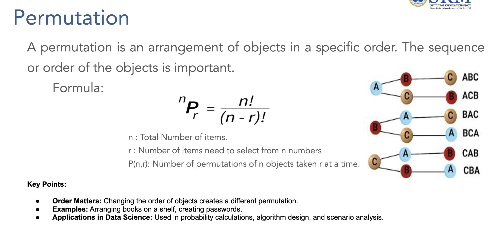

# Module 2: Comprehensive Probability Study Guide

## 📚 Table of Contents

### **Part I: Foundations of Probability**
1. [Probability Fundamentals](#1-probability-fundamentals)
   - [Definition and Basic Concepts](#definition-and-basic-concepts)
   - [Sample Space and Events](#sample-space-and-events)
   - [Probability Axioms](#probability-axioms)
2. [Types of Probability](#2-types-of-probability)
   - [Classical (Theoretical) Probability](#classical-theoretical-probability)
   - [Empirical (Statistical) Probability](#empirical-statistical-probability)
   - [Subjective Probability](#subjective-probability)

### **Part II: Counting Principles**
3. [Permutations and Combinations](#3-permutations-and-combinations)
   - [Fundamental Counting Principle](#fundamental-counting-principle)
   - [Permutations (nPr)](#permutations-npr)
   - [Combinations (nCr)](#combinations-ncr)
   - [Practical Applications](#practical-applications)

### **Part III: Probability Rules and Theorems**
4. [Basic Probability Rules](#4-basic-probability-rules)
   - [Addition Rule (OR Probability)](#addition-rule-or-probability)
   - [Multiplication Rule (AND Probability)](#multiplication-rule-and-probability)
   - [Complement Rule](#complement-rule)
5. [Independent and Mutually Exclusive Events](#5-independent-and-mutually-exclusive-events)
   - [Independent Events](#independent-events)
   - [Mutually Exclusive Events](#mutually-exclusive-events)
   - [Comparison and Examples](#comparison-and-examples)

### **Part IV: Advanced Probability Concepts**
6. [Marginal Probability](#6-marginal-probability)
   - [Definition and Calculation](#definition-and-calculation)
   - [Joint Probability Tables](#joint-probability-tables)
   - [Business Applications](#business-applications)
7. [Conditional Probability](#7-conditional-probability)
   - [Definition and Formula](#definition-and-formula)
   - [Conditional vs Joint vs Marginal](#conditional-vs-joint-vs-marginal)
   - [Real-world Examples](#real-world-examples)
8. [Bayes' Theorem](#8-bayes-theorem)
   - [Basic and Extended Forms](#basic-and-extended-forms)
   - [Multiple Hypotheses Analysis](#multiple-hypotheses-analysis)
   - [Practical Applications](#practical-applications-1)

### **Part V: Practice and Applications**
9. [Comprehensive Examples](#9-comprehensive-examples)
   - [Business Decision Making](#business-decision-making)
   - [Quality Control Applications](#quality-control-applications)
   - [Risk Assessment](#risk-assessment)
10. [Q&A Section](#10-qa-section)
    - [Frequently Asked Questions](#frequently-asked-questions)
      - [Probability Fundamentals FAQ](#probability-fundamentals-faq)
      - [Types of Probability FAQ](#types-of-probability-faq)
      - [Permutations and Combinations FAQ](#permutations-and-combinations-faq)
      - [Basic Probability Rules FAQ](#basic-probability-rules-faq)
      - [Independent and Mutually Exclusive Events FAQ](#independent-and-mutually-exclusive-events-faq)
      - [Marginal Probability FAQ](#marginal-probability-faq)
      - [Conditional Probability FAQ](#conditional-probability-faq)
      - [Bayes' Theorem FAQ](#bayes-theorem-faq)
      - [Business Applications FAQ](#business-applications-faq)
    - [Common Misconceptions](#common-misconceptions)
    - [Problem-Solving Tips](#problem-solving-tips)

---

### **🎯 Learning Objectives**

By completing this comprehensive guide, you will:
- ✅ **Master fundamental probability concepts** from basic definitions to advanced theorems
- ✅ **Apply counting principles** using permutations and combinations
- ✅ **Calculate probabilities** using addition and multiplication rules
- ✅ **Understand event relationships** (independent vs mutually exclusive)
- ✅ **Analyze conditional relationships** using marginal and conditional probability
- ✅ **Apply Bayes' theorem** for decision making under uncertainty
- ✅ **Solve real-world problems** in business and data science contexts

---

## 1. Probability Fundamentals

### Definition and Basic Concepts

**Probability** refers to the chance/likelihood of a particular event taking place. It's a mathematical measure that quantifies uncertainty and helps predict outcomes in random experiments.

**Mathematical Definition:**
```
P(Event) = Number of Favorable Outcomes / Total Number of Possible Outcomes
```

**Key Properties:**
- **Range:** 0 ≤ P(Event) ≤ 1
- **Impossible Event:** P(∅) = 0
    - The empty set (∅) is a set that contains no elements. Since it represents an event that cannot possibly occur, its probability is always zero.
- **Certain Event:** P(Ω) = 1
    - Ω = Sample space (universal set of all possible outcomes)
    - P(Ω) = Probability of the sample space (certain event)
    - The sample space (Ω) contains all possible outcomes of an experiment. Since one of these outcomes must occur, the probability of the sample space is always 1 (certainty).
- **All probabilities sum to 1:** ΣP(all possible events) = 1

### Sample Space and Events

#### **Sample Space (S)**
The set of all possible outcomes of an experiment.

**Example:** When rolling a die
```
S = {1, 2, 3, 4, 5, 6}
```

#### **Event (E)**
Any outcome or collection of outcomes from an experiment.

**Examples:**
- **Simple Event:** Rolling a 4 → E = {4}
- **Compound Event:** Rolling an even number → E = {2, 4, 6}

#### **Practical Example: Product Quality Control**

**Experiment:** Testing 3 products for defects
**Sample Space:** S = {DDD, DDG, DGD, GDD, DGG, GDG, GGD, GGG}
- D = Defective, G = Good
- Total outcomes = 2³ = 8

**Events:**
- **Event A:** Exactly 1 defective → A = {DGG, GDG, GGD}
- **Event B:** At least 2 good → B = {DGG, GDG, GGD, GGG}
- **Event C:** All same → C = {DDD, GGG}

### Probability Axioms

#### **Kolmogorov Axioms (Mathematical Foundation):**

1. **Non-negativity:** P(A) ≥ 0 for any event A
2. **Normalization:** P(S) = 1 (probability of entire sample space is 1)
3. **Countable Additivity:** For mutually exclusive events A₁, A₂, A₃:
   ```
   P(A₁ ∪ A₂ ∪ A₃) = P(A₁) + P(A₂) + P(A₃)
   ```

#### **Example: Quality Control Application**
```
P(All Good) = 1/8 = 0.125
P(At least 1 defective) = 1 - P(All Good) = 1 - 0.125 = 0.875
P(All Good) + P(At least 1 defective) = 0.125 + 0.875 = 1.0 ✓
```

---

## 2. Types of Probability

### Classical (Theoretical) Probability

**Definition:** Based on logical analysis of the situation without conducting experiments.

**Formula:**
```
P(Event) = Number of Favorable Outcomes / Total Number of Equally Likely Outcomes
```

**Conditions:**
- All outcomes must be equally likely
- Finite number of outcomes
- Known before conducting experiment

**Example: Card Drawing**
```
P(Drawing an Ace) = 4 Aces / 52 Total Cards = 4/52 = 1/13 ≈ 0.077 = 7.7%
P(Drawing a Heart) = 13 Hearts / 52 Total Cards = 13/52 = 1/4 = 0.25 = 25%
```

### Empirical (Statistical) Probability

**Definition:** Based on historical data or experimental results.

**Formula:**
```
P(Event) = Number of Times Event Occurred / Total Number of Trials
```

**Example: Manufacturing Quality**
```
Historical Data: Out of 10,000 products manufactured:
- 9,750 were good quality
- 250 were defective

P(Good Quality) = 9,750/10,000 = 0.975 = 97.5%
P(Defective) = 250/10,000 = 0.025 = 2.5%
```

### Subjective Probability

**Definition:** Based on personal judgment, experience, or belief.

**Characteristics:**
- No mathematical formula
- Varies from person to person
- Based on intuition and experience

**Example: Business Investment**
```
An experienced investor might say:
"I believe there's a 70% chance this startup will succeed"
P(Success) = 0.70 (based on expertise and market analysis)
```

---

## 3. Permutations and Combinations

### Fundamental Counting Principle

**Principle:** If there are m ways to do one thing and n ways to do another, then there are m × n ways to do both.

**Example: Password Creation**
```
Password Requirements: 2 letters followed by 3 digits
- Letters: 26 choices for first position, 26 for second = 26 × 26 = 676
- Digits: 10 choices for each position = 10 × 10 × 10 = 1,000
- Total passwords: 676 × 1,000 = 676,000
```

### Permutations (nPr)

**Definition:** Arrangements where order matters.



**Formula:**
```
nPr = n! / (n-r)!
```
Where:
- n = total number of items
- r = number of items being arranged
- ! = factorial (n! = n × (n-1) × (n-2) × ... × 1)

#### **Example 1: Employee Scheduling**
**Problem:** Select and arrange 3 employees from 8 for morning, afternoon, and night shifts.

**Solution:**
```
8P3 = 8! / (8-3)! = 8! / 5! = 8 × 7 × 6 = 336 ways
```

#### **Example 2: Product Display**
**Problem:** Arrange 5 different products in a display window.

**Solution:**
```
5P5 = 5! / (5-5)! = 5! / 0! = 5! = 5 × 4 × 3 × 2 × 1 = 120 ways
```

### Combinations (nCr)

**Definition:** Selections where order doesn't matter.

**Formula:**
```
nCr = n! / (r! × (n-r)!)
```

#### **Example 1: Committee Selection**
**Problem:** Select 4 people from 10 for a committee.

**Solution:**
```
10C4 = 10! / (4! × 6!) = (10 × 9 × 8 × 7) / (4 × 3 × 2 × 1) = 5,040 / 24 = 210 ways
```

#### **Example 2: Product Testing**
**Problem:** Choose 3 products from 8 for quality testing.

**Solution:**
```
8C3 = 8! / (3! × 5!) = (8 × 7 × 6) / (3 × 2 × 1) = 336 / 6 = 56 ways
```

### Practical Applications

#### **Business Decision Making**
```
Marketing Campaign: Choose 2 advertising channels from 5 available
5C2 = 5! / (2! × 3!) = (5 × 4) / (2 × 1) = 10 combinations
```

#### **Probability with Combinations**
```
Lottery Example: Choose 6 numbers from 49
Total combinations = 49C6 = 49! / (6! × 43!) = 13,983,816
P(Winning) = 1 / 13,983,816 ≈ 0.0000071%
```

---

## 3.1. Advanced Permutation and Combination Problems

### **Problem Set A: From Slide Examples**

#### **Problem 1: Password Security System**

**Problem Statement:** 
A website requires users to create a 4-character password using the digits 0-9. The digits cannot be repeated. How many different passwords can be generated?

**Analysis:**
- Order of digits matters because "1234" is a different password than "4321"
- This is a permutation problem where n=10 (total digits available) and r=4 (digits in the password)

**Formula:**
```
P(n,r) = n! / (n-r)!
P(10,4) = 10! / (10-4)! = 10! / 6!
```

**Step-by-Step Solution:**
```
Step 1: Identify the problem type
- Order matters → Permutation
- No repetition allowed
- n = 10 (digits 0-9), r = 4 (password length)

Step 2: Apply permutation formula
P(10,4) = 10! / 6!
        = (10 × 9 × 8 × 7 × 6!) / 6!
        = 10 × 9 × 8 × 7
        = 5,040

Step 3: Verification
- 1st position: 10 choices
- 2nd position: 9 choices (can't repeat 1st)
- 3rd position: 8 choices (can't repeat 1st or 2nd)
- 4th position: 7 choices (can't repeat previous 3)
- Total: 10 × 9 × 8 × 7 = 5,040 ✓
```

**Answer:** Total possible passwords: 5,040

---

#### **Problem 2: Project Management Task Scheduling**

**Problem Statement:** 
A project manager has 5 distinct tasks to assign to 5 time slots in a day. Each task must be completed in one of the slots, and the order of tasks is crucial. How many different ways can the tasks be scheduled?

**Analysis:**
- 5 distinct tasks need to be arranged in 5 positions
- Order matters because task sequence affects project flow
- This is a permutation of all items: P(5,5) = 5!

**Formula:**
```
P(n,n) = n! = 5!
```

**Step-by-Step Solution:**
```
Step 1: Identify the problem type
- Order matters → Permutation
- All tasks must be scheduled → P(5,5)

Step 2: Apply factorial formula
P(5,5) = 5! = 5 × 4 × 3 × 2 × 1 = 120

Step 3: Logical verification
- 1st time slot: 5 task choices
- 2nd time slot: 4 remaining choices
- 3rd time slot: 3 remaining choices
- 4th time slot: 2 remaining choices
- 5th time slot: 1 remaining choice
- Total: 5 × 4 × 3 × 2 × 1 = 120 ✓
```

**Answer:** There are 120 different ways to arrange the 5 tasks into the 5 available time slots.

---

#### **Problem 3: Machine Learning Feature Selection**

**Problem Statement:** 
You have 4 distinct features (F1, F2, F3, F4) that you want to use for training a machine learning model. You are interested in analyzing different ways to order these features and how their order might affect the model's performance. How many different permutations of these features are possible?

**Analysis:**
- Order of features matters for model training sequence
- All 4 features will be used in different arrangements
- This is a permutation problem: P(4,4) = 4!

**Formula:**
```
P(4,4) = 4!
```

**Step-by-Step Solution:**
```
Step 1: Identify the problem type
- Order matters → Permutation
- Using all features → P(4,4)

Step 2: Calculate permutations
P(4,4) = 4! = 4 × 3 × 2 × 1 = 24

Step 3: List some arrangements (verification)
F1,F2,F3,F4 | F1,F2,F4,F3 | F1,F3,F2,F4 | F1,F3,F4,F2
F1,F4,F2,F3 | F1,F4,F3,F2 | F2,F1,F3,F4 | F2,F1,F4,F3
... (24 total arrangements)
```

**Answer:** Total Permutations: 24 different ways to order the 4 features.

---

#### **Problem 4: Book Selection for Reading List**

**Problem Statement:** 
Imagine you have 5 distinct books (A, B, C, D, E) and you want to select 3 of them. The number of possible combinations is calculated as:

**Analysis:**
- Order doesn't matter for book selection (choosing A,B,C is same as C,A,B)
- This is a combination problem: C(5,3)

**Formula:**
```
C(n,r) = n! / (r! × (n-r)!)
C(5,3) = 5! / (3! × 2!)
```

**Step-by-Step Solution:**
```
Step 1: Identify the problem type
- Order doesn't matter → Combination
- Selecting 3 from 5 → C(5,3)

Step 2: Apply combination formula
C(5,3) = 5! / (3! × 2!)
       = (5 × 4 × 3!) / (3! × 2 × 1)
       = (5 × 4) / (2 × 1)
       = 20 / 2
       = 10

Step 3: List all combinations (verification)
{A,B,C}, {A,B,D}, {A,B,E}, {A,C,D}, {A,C,E}
{A,D,E}, {B,C,D}, {B,C,E}, {B,D,E}, {C,D,E}
Total: 10 combinations ✓
```

**Answer:** Total Combinations: 10 ways to choose 3 books from 5.

---

#### **Problem 5: Team Building Event Selection**

**Problem Statement:** 
You are organizing a team-building event and need to select 3 team members from a pool of 8 employees. The order in which the team members are selected does not matter.

**Analysis:**
- Order doesn't matter for team selection
- This is a combination problem: C(8,3)

**Formula:**
```
C(8,3) = 8! / (3! × 5!)
```

**Step-by-Step Solution:**
```
Step 1: Identify the problem type
- Order doesn't matter → Combination
- Selecting 3 from 8 → C(8,3)

Step 2: Apply combination formula
C(8,3) = 8! / (3! × 5!)
       = (8 × 7 × 6 × 5!) / (3! × 5!)
       = (8 × 7 × 6) / (3 × 2 × 1)
       = 336 / 6
       = 56

Step 3: Business interpretation
- 56 different team compositions possible
- Each team has unique skill combination
- Optimal for testing different group dynamics
```

**Answer:** Total Combinations: 56 ways to select 3 team members from 8 employees.

---

#### **Problem 6: Machine Learning Feature Subset Selection**

**Problem Statement:** 
You are working on a machine learning project and have 15 distinct features (variables) available in your dataset. You want to select a subset of 5 features to use in your model. The order in which the features are selected does not matter.

**Analysis:**
- Order doesn't matter for feature selection
- This is a combination problem: C(15,5)

**Formula:**
```
C(15,5) = 15! / (5! × 10!)
```

**Step-by-Step Solution:**
```
Step 1: Identify the problem type
- Order doesn't matter → Combination
- Selecting 5 from 15 → C(15,5)

Step 2: Apply combination formula
C(15,5) = 15! / (5! × 10!)
        = (15 × 14 × 13 × 12 × 11) / (5 × 4 × 3 × 2 × 1)
        = 360,360 / 120
        = 3,003

Step 3: Machine learning interpretation
- 3,003 different feature combinations to test
- Each combination may yield different model performance
- Feature selection optimization requires systematic approach
```

**Answer:** There are 3,003 different ways to select 5 features from the 15 available features for use in your machine learning model.

---

### **Problem Set B: Additional Challenging Problems (Medium to Hard)**

#### **Problem 7: Digital Marketing Campaign Optimization**

**Problem Statement:** 
A digital marketing team has 12 different advertising channels available (social media platforms, search engines, email, etc.). They want to create a comprehensive campaign using exactly 4 channels, and the order of implementation matters for budget allocation and timing. How many different campaign strategies can they create?

**Formula:** P(12,4) = 12! / (12-4)! = 12! / 8!

**Step-by-Step Solution:**
```
Step 1: Problem analysis
- Order matters (implementation sequence affects budget flow)
- Selecting and arranging 4 from 12 → Permutation

Step 2: Calculate
P(12,4) = 12 × 11 × 10 × 9 = 11,880

Step 3: Business insight
- 11,880 different campaign sequences possible
- Each sequence has different cost and impact profiles
```

**Answer:** 11,880 different campaign strategies.

---

#### **Problem 8: Software Development Team Formation**

**Problem Statement:** 
A tech company needs to form a cross-functional team of 6 people from a pool of 20 employees (5 frontend developers, 5 backend developers, 5 designers, 5 product managers). They must select exactly 2 people from each department. How many different team compositions are possible?

**Formula:** C(5,2) × C(5,2) × C(5,2) × C(5,2) = [C(5,2)]⁴

**Step-by-Step Solution:**
```
Step 1: Calculate selections per department
C(5,2) = 5! / (2! × 3!) = (5 × 4) / (2 × 1) = 10

Step 2: Apply multiplication principle
Total = C(5,2) × C(5,2) × C(5,2) × C(5,2)
      = 10 × 10 × 10 × 10 = 10,000

Step 3: Verification
- Frontend: 10 ways to choose 2 from 5
- Backend: 10 ways to choose 2 from 5  
- Design: 10 ways to choose 2 from 5
- Product: 10 ways to choose 2 from 5
- Total: 10⁴ = 10,000 ✓
```

**Answer:** 10,000 different team compositions.

---

#### **Problem 9: Restaurant Menu Optimization**

**Problem Statement:** 
A restaurant wants to create a "Chef's Special" tasting menu with 5 courses. They have 8 appetizers, 10 main dishes, 6 desserts, 7 beverages, and 4 bread types. Each course must be from a different category, and they want to select 1 appetizer, 2 main dishes, 1 dessert, and 1 beverage. The order of main dishes matters for the dining experience. How many different tasting menus can they create?

**Formula:** C(8,1) × P(10,2) × C(6,1) × C(7,1) × C(4,1)

**Step-by-Step Solution:**
```
Step 1: Analyze each course
- Appetizers: C(8,1) = 8
- Main dishes: P(10,2) = 10 × 9 = 90 (order matters)
- Desserts: C(6,1) = 6
- Beverages: C(7,1) = 7
- Bread: C(4,1) = 4

Step 2: Apply multiplication principle
Total = 8 × 90 × 6 × 7 × 4 = 120,960

Step 3: Business application
- 120,960 unique tasting menu combinations
- Enables seasonal rotation and customization
```

**Answer:** 120,960 different tasting menus.

---

#### **Problem 10: Quality Control Sampling Strategy**

**Problem Statement:** 
A manufacturing plant produces 100 products daily. The quality control team wants to implement a sampling strategy where they select 8 products for detailed inspection. Additionally, from these 8 products, they need to choose 3 for destructive testing (where order matters due to different test procedures). How many ways can they execute this quality control process?

**Formula:** C(100,8) × P(8,3)

**Step-by-Step Solution:**
```
Step 1: Calculate initial sampling
C(100,8) = 100! / (8! × 92!)
         = Very large number (requires calculator)
         ≈ 186,087,894,300

Step 2: Calculate destructive testing selection
P(8,3) = 8! / (8-3)! = 8 × 7 × 6 = 336

Step 3: Total combinations
Total = C(100,8) × P(8,3)
      ≈ 186,087,894,300 × 336
      ≈ 6.25 × 10¹³

Step 4: Practical interpretation
- Massive number of sampling strategies
- Ensures comprehensive quality coverage
```

**Answer:** Approximately 6.25 × 10¹³ different quality control processes.

---

#### **Problem 11: Investment Portfolio Diversification**

**Problem Statement:** 
An investment firm has access to 25 different stocks across various sectors. They want to create a diversified portfolio by selecting 10 stocks where the selection order doesn't matter. However, from these 10 stocks, they need to designate 3 as "high-priority" investments where the ranking order (1st, 2nd, 3rd priority) matters for fund allocation. How many different portfolio strategies can they create?

**Formula:** C(25,10) × P(10,3)

**Step-by-Step Solution:**
```
Step 1: Select 10 stocks from 25
C(25,10) = 25! / (10! × 15!) = 3,268,760

Step 2: Rank 3 from selected 10
P(10,3) = 10 × 9 × 8 = 720

Step 3: Total strategies
Total = 3,268,760 × 720 = 2,353,507,200

Step 4: Financial insight
- Over 2.35 billion portfolio strategies
- Enables sophisticated risk management
```

**Answer:** 2,353,507,200 different portfolio strategies.

---

#### **Problem 12: Event Planning Committee Structure**

**Problem Statement:** 
A university is organizing a major conference and needs to form multiple committees. From 30 faculty members, they need to:
1. Select 12 people for the main organizing committee
2. From these 12, choose 4 for the executive board where positions matter (Chair, Vice-Chair, Secretary, Treasurer)
3. From the remaining 8, select 3 for the technical committee

**Formula:** C(30,12) × P(12,4) × C(8,3)

**Step-by-Step Solution:**
```
Step 1: Select main organizing committee
C(30,12) = 30! / (12! × 18!) = 86,493,225

Step 2: Form executive board (positions matter)
P(12,4) = 12! / 8! = 12 × 11 × 10 × 9 = 11,880

Step 3: Select technical committee from remaining
C(8,3) = 8! / (3! × 5!) = 56

Step 4: Total committee structures
Total = 86,493,225 × 11,880 × 56
      ≈ 5.75 × 10¹³

Step 5: Organizational insight
- Astronomical number of committee structures
- Ensures optimal talent utilization
```

**Answer:** Approximately 5.75 × 10¹³ different committee structures.

---

#### **Problem 13: Data Science Model Ensemble Creation**

**Problem Statement:** 
A data science team has developed 15 different machine learning models for a prediction task. They want to create an ensemble by:
1. Selecting 7 models for the primary ensemble
2. From these 7, choosing 3 models for weighted voting where the weight order matters (highest weight, medium weight, lowest weight)
3. From the remaining 4, selecting 2 for final validation

**Formula:** C(15,7) × P(7,3) × C(4,2)

**Step-by-Step Solution:**
```
Step 1: Select 7 models from 15
C(15,7) = 15! / (7! × 8!) = 6,435

Step 2: Choose 3 for weighted voting (order matters)
P(7,3) = 7 × 6 × 5 = 210

Step 3: Select 2 from remaining 4 for validation
C(4,2) = 4! / (2! × 2!) = 6

Step 4: Total ensemble strategies
Total = 6,435 × 210 × 6 = 8,106,300

Step 5: ML interpretation
- Over 8 million ensemble configurations
- Enables optimal model combination testing
```

**Answer:** 8,106,300 different ensemble strategies.

---

#### **Problem 14: Supply Chain Route Optimization**

**Problem Statement:** 
A logistics company needs to establish delivery routes connecting 20 cities. They want to:
1. Select 8 cities for a priority delivery network
2. Among these 8 cities, establish a circular route visiting 5 cities where the order matters for fuel efficiency
3. From the remaining 3 cities, choose 2 as backup distribution centers

**Formula:** C(20,8) × P(8,5) × C(3,2)

**Step-by-Step Solution:**
```
Step 1: Select 8 cities from 20
C(20,8) = 20! / (8! × 12!) = 125,970

Step 2: Create circular route through 5 cities (order matters)
P(8,5) = 8! / 3! = 6,720

Step 3: Choose 2 backup centers from remaining 3
C(3,2) = 3

Step 4: Total route strategies
Total = 125,970 × 6,720 × 3 = 2,540,131,200

Step 5: Logistics insight
- Over 2.5 billion route configurations
- Enables comprehensive network optimization
```

**Answer:** 2,540,131,200 different supply chain strategies.

---

#### **Problem 15: Clinical Trial Design**

**Problem Statement:** 
A pharmaceutical company is designing a clinical trial with 50 potential participants. They need to:
1. Select 20 participants for the study
2. From these 20, assign 8 to the treatment group and 12 to the control group
3. From the treatment group, select 3 participants for intensive monitoring where the selection order determines monitoring priority

**Formula:** C(50,20) × C(20,8) × P(8,3)

**Step-by-Step Solution:**
```
Step 1: Select 20 participants from 50
C(50,20) = 50! / (20! × 30!) ≈ 1.126 × 10¹⁴

Step 2: Divide into treatment (8) and control (12) groups
C(20,8) = C(20,12) = 125,970

Step 3: Select 3 for priority monitoring (order matters)
P(8,3) = 8 × 7 × 6 = 336

Step 4: Total trial designs
Total = 1.126 × 10¹⁴ × 125,970 × 336
      ≈ 4.77 × 10²¹

Step 5: Medical research insight
- Quintillions of possible trial designs
- Ensures rigorous statistical validity
```

**Answer:** Approximately 4.77 × 10²¹ different clinical trial designs.

---

#### **Problem 16: Advanced Cybersecurity Protocol**

**Problem Statement:** 
A cybersecurity firm is designing a multi-layered security system. They have 18 different security protocols available. The system requires:
1. Selecting 10 protocols for the primary security layer
2. From these 10, implementing 4 protocols in a specific order for the authentication sequence
3. From the remaining 6, choosing 3 for the backup security layer
4. The final 3 protocols will be used for monitoring (order doesn't matter)

**Formula:** C(18,10) × P(10,4) × C(6,3) × C(3,3)

**Step-by-Step Solution:**
```
Step 1: Select 10 protocols from 18
C(18,10) = 18! / (10! × 8!) = 43,758

Step 2: Arrange 4 protocols for authentication (order matters)
P(10,4) = 10! / 6! = 5,040

Step 3: Select 3 from remaining 6 for backup
C(6,3) = 20

Step 4: Use all remaining 3 for monitoring
C(3,3) = 1

Step 5: Total security configurations
Total = 43,758 × 5,040 × 20 × 1 = 4,410,220,800

Step 6: Cybersecurity insight
- Over 4.4 billion security configurations
- Enables adaptive threat response
```

**Answer:** 4,410,220,800 different cybersecurity system configurations.

---

### **Summary: Problem-Solving Strategy Framework**

#### **Step 1: Identify the Problem Type**
- **Order matters** → Use **Permutations** (P)
- **Order doesn't matter** → Use **Combinations** (C)
- **Mixed requirements** → Combine both methods

#### **Step 2: Apply Appropriate Formulas**
- **Permutations:** P(n,r) = n! / (n-r)!
- **Combinations:** C(n,r) = n! / (r! × (n-r)!)
- **Multiple stages:** Use multiplication principle

#### **Step 3: Verify Reasonableness**
- Check if answer makes logical sense
- Permutations should be ≥ Combinations for same n,r
- Consider real-world constraints

#### **Step 4: Business Application**
- Interpret results in business context
- Consider practical limitations and resources
- Use results for optimization and decision-making

**These advanced problems demonstrate the power of counting principles in solving complex real-world scenarios across various industries and applications!** 🚀📊

---

## 4. Basic Probability Rules

### Addition Rule (OR Probability)

**Definition:** Calculates probability that at least one of two events occurs.

#### **General Addition Rule:**
```
P(A ∪ B) = P(A) + P(B) - P(A ∩ B)
```

#### **For Mutually Exclusive Events:**
```
P(A ∪ B) = P(A) + P(B)
```
(Since P(A ∩ B) = 0)

#### **Example: Customer Purchase Analysis**

**Data:** Market research with 1,000 customers
- 320 bought smartphones (32%)
- 190 bought laptops (19%)
- 50 bought both (5%)

**Question:** What's P(Smartphone OR Laptop)?

**Solution:**
```
P(Smartphone ∪ Laptop) = P(Smartphone) + P(Laptop) - P(Both)
P(Smartphone ∪ Laptop) = 0.32 + 0.19 - 0.05 = 0.46 = 46%
```

### Multiplication Rule (AND Probability)

**Definition:** Calculates probability that both events occur.

#### **General Multiplication Rule:**
```
P(A ∩ B) = P(A) × P(B|A) = P(B) × P(A|B)
```

#### **For Independent Events:**
```
P(A ∩ B) = P(A) × P(B)
```

#### **Example: Product Quality Testing**

**Scenario:** Testing two products independently
- P(Product 1 is good) = 0.95
- P(Product 2 is good) = 0.90

**Question:** What's P(Both products are good)?

**Solution:**
```
P(Both Good) = P(Product 1 Good) × P(Product 2 Good)
P(Both Good) = 0.95 × 0.90 = 0.855 = 85.5%
```

### Complement Rule

**Definition:** Probability of an event not occurring.

**Formula:**
```
P(A') = 1 - P(A)
```

#### **Example: Equipment Reliability**
```
P(Machine works properly) = 0.92
P(Machine breaks down) = 1 - 0.92 = 0.08 = 8%
```

#### **"At Least" Problems**
**Problem:** P(At least 1 success in 3 trials)

**Solution using complement:**
```
P(At least 1 success) = 1 - P(No successes)
P(At least 1 success) = 1 - P(Fail)³ = 1 - (0.2)³ = 1 - 0.008 = 0.992 = 99.2%
```

---

## 5. Independent and Mutually Exclusive Events

### Independent Events

**Definition:** Events where the outcome of one does not affect the outcome of another.

**Mathematical Criteria:**
```
P(A|B) = P(A) and P(B|A) = P(B)
P(A ∩ B) = P(A) × P(B)
```

#### **Example: Manufacturing Process**
```
Machine A: P(Defective) = 0.02
Machine B: P(Defective) = 0.03

P(Both defective) = 0.02 × 0.03 = 0.0006 = 0.06%
P(At least one defective) = 1 - P(Both good) = 1 - (0.98 × 0.97) = 1 - 0.9506 = 0.0494 = 4.94%
```

### Mutually Exclusive Events

**Definition:** Events that cannot occur at the same time.

**Mathematical Criteria:**
```
P(A ∩ B) = 0
P(A ∪ B) = P(A) + P(B)
```

#### **Example: Product Categories**
```
Single Purchase Decision:
- P(Buy smartphone) = 0.35
- P(Buy laptop) = 0.25
- P(Buy tablet) = 0.20

P(Buy smartphone OR laptop) = 0.35 + 0.25 = 0.60 = 60%
(Assuming customer buys only one product)
```

### Comparison and Examples

| Aspect | Independent Events | Mutually Exclusive Events |
|--------|-------------------|---------------------------|
| **Definition** | Outcome of one doesn't affect the other | Cannot happen simultaneously |
| **Intersection** | P(A ∩ B) = P(A) × P(B) | P(A ∩ B) = 0 |
| **Union** | P(A ∪ B) = P(A) + P(B) - P(A) × P(B) | P(A ∪ B) = P(A) + P(B) |
| **Example** | Weather today vs coin flip | Rolling 3 and 5 on single die |

---

## 6. Marginal Probability

### Definition and Calculation

**Marginal Probability** is the probability of an event occurring regardless of the outcome of other variables. It represents the probability of a single event without considering any conditions.

**Mathematical Definition:**
```
P(A) = Σ P(A ∩ B) for all possible values of B
```

### Joint Probability Tables

**Example: Customer Income and Purchase Behavior**

| Income Level | Bought Product | Did Not Buy | **Marginal P(Income)** |
|-------------|---------------|-------------|----------------------|
| **Low Income** | 0.12 (120) | 0.18 (180) | **0.30 (300)** |
| **Middle Income** | 0.28 (280) | 0.22 (220) | **0.50 (500)** |
| **High Income** | 0.15 (150) | 0.05 (50) | **0.20 (200)** |
| **Marginal P(Purchase)** | **0.55 (550)** | **0.45 (450)** | **1.00 (1,000)** |

#### **Calculation Methods:**

**Method 1: Row Summation (for Purchase Behavior)**
```
P(Bought Product) = P(Low∩Bought) + P(Middle∩Bought) + P(High∩Bought)
P(Bought Product) = 0.12 + 0.28 + 0.15 = 0.55 = 55%
```

**Method 2: Column Summation (for Income Levels)**
```
P(Low Income) = P(Low∩Bought) + P(Low∩NotBuy)
P(Low Income) = 0.12 + 0.18 = 0.30 = 30%
```

### Business Applications

#### **Market Segmentation**
```
Overall Purchase Rate = 55% (Marginal Probability)
- Useful for inventory planning
- Budget allocation for marketing campaigns
- Revenue forecasting
```

#### **Customer Profiling**
```
Income Distribution:
- Low Income: 30% of customer base
- Middle Income: 50% of customer base  
- High Income: 20% of customer base
```

---

## 7. Conditional Probability

### Definition and Formula

**Conditional Probability** is the probability of an event occurring given that another event has already occurred.

**Mathematical Definition:**
```
P(A|B) = P(A ∩ B) / P(B)
```

Where P(B) > 0

**Rearranged Form:**
```
P(A ∩ B) = P(A|B) × P(B)
```

### Conditional vs Joint vs Marginal

| Type | Formula | Example | Interpretation |
|------|---------|---------|----------------|
| **Marginal** | P(A) | P(High Income) = 0.20 | 20% of all customers |
| **Joint** | P(A ∩ B) | P(High Income ∩ Bought) = 0.15 | 15% of all customers |
| **Conditional** | P(A\|B) | P(Bought\|High Income) = 0.75 | 75% of high-income customers |

### Real-world Examples

#### **Example 1: Customer Purchase Analysis**

**Using the income-purchase data:**

**Question 1:** Given someone bought the product, what's P(High Income)?
```
P(High Income | Bought) = P(High Income ∩ Bought) / P(Bought)
P(High Income | Bought) = 0.15 / 0.55 = 0.273 = 27.3%
```

**Question 2:** Given someone is high income, what's P(Bought)?
```
P(Bought | High Income) = P(Bought ∩ High Income) / P(High Income)
P(Bought | High Income) = 0.15 / 0.20 = 0.75 = 75%
```

#### **Example 2: Medical Testing**

**Scenario:** Disease prevalence and test accuracy
- P(Disease) = 0.01 (1% of population has disease)
- P(Positive Test | Disease) = 0.95 (95% accuracy for sick patients)
- P(Positive Test | No Disease) = 0.05 (5% false positive rate)

**Question:** If test is positive, what's P(Actually has disease)?

---

### **🔬 Complete Step-by-Step Solution**

#### **Step 1: Calculate P(Positive Test) using Law of Total Probability**

**Formula:**
```
P(B) = P(B|A₁)×P(A₁) + P(B|A₂)×P(A₂) + ... + P(B|Aₙ)×P(Aₙ)
```

**Applied to Our Problem:**
```
P(Positive) = P(Positive|Disease)×P(Disease) + P(Positive|No Disease)×P(No Disease)
```

**Where:**
- P(Positive|Disease) = 0.95 (sensitivity - true positive rate)
- P(Disease) = 0.01 (prevalence of disease)
- P(Positive|No Disease) = 0.05 (false positive rate)
- P(No Disease) = 0.99 (probability of not having disease)

**Calculation:**
```
P(Positive) = 0.95 × 0.01 + 0.05 × 0.99
P(Positive) = 0.0095 + 0.0495
P(Positive) = 0.059 = 5.9%
```

**Interpretation:** 5.9% of all tests will be positive.

---

#### **Step 2: Apply Bayes' Theorem**

**Bayes' Theorem Formula:**
```
P(A|B) = P(B|A) × P(A) / P(B)
```

**Applied to Our Problem:**
```
P(Disease|Positive) = P(Positive|Disease) × P(Disease) / P(Positive)
```

**Where:**
- P(Disease|Positive) = Probability of having disease given positive test (posterior)
- P(Positive|Disease) = 0.95 (likelihood - sensitivity)
- P(Disease) = 0.01 (prior probability)
- P(Positive) = 0.059 (marginal probability from Step 1)

**Calculation:**
```
P(Disease|Positive) = 0.95 × 0.01 / 0.059
P(Disease|Positive) = 0.0095 / 0.059
P(Disease|Positive) = 0.161 = 16.1%
```

---

#### **Step 3: Complete Formula Breakdown (Expanded Bayes)**

**Expanded Bayes' Theorem:**
```
P(Disease|Positive) = P(Positive|Disease) × P(Disease) / [P(Positive|Disease) × P(Disease) + P(Positive|No Disease) × P(No Disease)]
```

**Substituting All Values:**
```
P(Disease|Positive) = (0.95 × 0.01) / [(0.95 × 0.01) + (0.05 × 0.99)]
P(Disease|Positive) = 0.0095 / [0.0095 + 0.0495]
P(Disease|Positive) = 0.0095 / 0.059 = 0.161 = 16.1%
```

---

### **🤔 Why Use Bayes' Theorem Instead of Basic Conditional Probability?**

#### **Problem with Basic Conditional Approach:**

**What We Want:** P(Disease | Positive Test)
**What We Have:** P(Positive Test | Disease)

**The information flows in the WRONG direction!**

#### **If We Tried Basic Conditional Probability:**
```
P(Disease | Positive) = P(Disease ∩ Positive) / P(Positive)
```

**Problem:** We don't directly know P(Disease ∩ Positive)!

#### **What We Actually Know:**
✅ P(Positive | Disease) = 0.95 (given)  
✅ P(Disease) = 0.01 (given)  
✅ P(Positive | No Disease) = 0.05 (given)  
❌ P(Disease | Positive) = ? (what we want to find)

#### **The "Flip" Problem:**
```
Given: P(Positive | Disease) = 95%
Want:  P(Disease | Positive) = ?

These are NOT the same!
```

#### **Real-World Analogy:**
- **We know:** "95% of people with disease test positive"
- **We want:** "What % of positive tests actually indicate disease?"
- **Different questions requiring Bayes' reversal!**

---

### **📊 Visual Demonstration (Population of 10,000)**

```
Total Population: 10,000 people
├── 100 have disease (1%)
│   ├── 95 test positive (95% sensitivity) ← TRUE POSITIVES
│   └── 5 test negative (5% false negatives)
└── 9,900 don't have disease (99%)
    ├── 495 test positive (5% false positive) ← FALSE POSITIVES
    └── 9,405 test negative (95% specificity)

Total Positive Tests: 95 + 495 = 590
Actually Have Disease: 95 out of 590 = 16.1%
```

#### **Why Counterintuitive Result?**
1. **Low Disease Prevalence:** Only 1% of population has disease
2. **High False Positive Rate:** 5% of healthy people test positive  
3. **Many False Positives:** 99% × 5% = 4.95% false positives vs 1% × 95% = 0.95% true positives

---

### **🎯 Key Insights:**

#### **When to Use Bayes vs Basic Conditional:**

| **Use Basic Conditional** | **Use Bayes' Theorem** |
|--------------------------|-------------------------|
| ✅ Direct information available | ✅ Information flows "backwards" |
| ✅ Can count directly | ✅ Have reverse conditional |
| ✅ Same direction as question | ✅ Need to "flip" the condition |

#### **Medical Testing Keywords for Bayes:**
- "Given a positive test, what's probability of disease?"
- "If test shows X, what's chance of condition Y?"
- "Diagnostic probability" problems
- When you have sensitivity/specificity but need predictive value

**Final Answer:** Even with a positive test, only 16.1% chance of actually having the disease - demonstrating why Bayes' Theorem is essential for proper medical interpretation!

---

## 8. Bayes' Theorem

### Basic and Extended Forms

#### **Basic Form (Two Events):**
```
P(A|B) = P(B|A) × P(A) / P(B)
```

#### **Extended Form (Multiple Hypotheses):**
```
P(Ai|B) = P(Ai) × P(B|Ai) / Σ(j=1 to n) P(Aj) × P(B|Aj)
```

### Multiple Hypotheses Analysis

#### **Component Breakdown:**

- **Posterior Probability** P(Ai|B): What we want to find
- **Prior Probability** P(Ai): Initial belief before evidence
- **Likelihood** P(B|Ai): How likely evidence is if hypothesis is true
- **Total Probability**: Normalizing constant ensuring probabilities sum to 1

### Practical Applications

#### **Example: Customer Segmentation with Purchase Behavior**

---

### **🛍️ Business Context and Problem Setup**

**Scenario:** An e-commerce company wants to implement targeted marketing strategies based on customer income levels. They have collected historical data about customer demographics and purchasing patterns. Now, when a customer makes a high-value purchase ($500+), the marketing team wants to predict their income level to customize future marketing campaigns.

**Business Challenge:** 
- **Traditional approach:** Survey every customer for income (expensive and low response rate)
- **Smart approach:** Use purchase behavior to infer income level using probability

**Why This Matters:**
- **High-income customers:** Premium product recommendations, luxury brand partnerships
- **Middle-income customers:** Value-for-money offers, seasonal promotions
- **Low-income customers:** Budget-friendly options, discount campaigns

---

### **📊 Historical Data Analysis**

**Data Source:** Analysis of 10,000 customers over 12 months

**Income Distribution (Prior Probabilities):**
```
P(Low Income) = 0.30 = 30% (3,000 customers)
P(Middle Income) = 0.50 = 50% (5,000 customers)  
P(High Income) = 0.20 = 20% (2,000 customers)
```

**Purchase Behavior Patterns (Likelihoods):**
Based on historical analysis of high-value purchases ($500+):
```
P(High-Value Purchase | Low Income) = 0.15 = 15%
  - Out of 3,000 low-income customers, 450 made high-value purchases
  
P(High-Value Purchase | Middle Income) = 0.35 = 35%
  - Out of 5,000 middle-income customers, 1,750 made high-value purchases
  
P(High-Value Purchase | High Income) = 0.80 = 80%
  - Out of 2,000 high-income customers, 1,600 made high-value purchases
```

---

### **🎯 The Probability Question**

**Immediate Problem:** A new customer just made a $650 purchase. Without asking for income information, what's the probability they belong to each income category?

**This is a Classic Bayes' Problem because:**
- We know P(High-Value Purchase | Income Level) from historical data
- We want P(Income Level | High-Value Purchase) for decision making
- Information flows in opposite direction to our question

---

### **🔍 Step-by-Step Bayes' Analysis**

#### **Step 1: Calculate Total Probability using Law of Total Probability**

**Formula:**
```
P(High-Value Purchase) = Σ P(High-Value Purchase | Income Level) × P(Income Level)
```

**Detailed Calculation:**
```
P(High-Value Purchase) = P(High-Value | Low) × P(Low) + P(High-Value | Middle) × P(Middle) + P(High-Value | High) × P(High)

P(High-Value Purchase) = 0.15 × 0.30 + 0.35 × 0.50 + 0.80 × 0.20
P(High-Value Purchase) = 0.045 + 0.175 + 0.160 = 0.38 = 38%
```

**Business Insight:** 38% of all customers make high-value purchases.

---

#### **Step 2: Apply Extended Bayes' Formula for Each Income Level**

**Extended Bayes' Formula:**
```
P(Ai|B) = [P(Ai) × P(B|Ai)] / [∑(j=1 to n) P(Aj) × P(B|Aj)]
```

**Applied to Our Business Problem:**
```
P(Income Level | High-Value Purchase) = P(Income Level) × P(High-Value Purchase | Income Level) / P(High-Value Purchase)
```

#### **For Low Income:**
```
P(Low Income | High-Value Purchase) = P(Low Income) × P(High-Value | Low Income) / P(High-Value Purchase)
P(Low Income | High-Value Purchase) = 0.30 × 0.15 / 0.38 = 0.045 / 0.38 = 0.118 = 11.8%
```

#### **For Middle Income:**
```
P(Middle Income | High-Value Purchase) = 0.50 × 0.35 / 0.38 = 0.175 / 0.38 = 0.461 = 46.1%
```

#### **For High Income:**
```
P(High Income | High-Value Purchase) = 0.20 × 0.80 / 0.38 = 0.160 / 0.38 = 0.421 = 42.1%
```

#### **Verification:**
```
11.8% + 46.1% + 42.1% = 100% ✓
```

---

### **📈 Business Decision Analysis**

#### **Results Summary:**
| Income Level      | Prior Probability | Posterior Probability | Change  |
| ----------------- | ----------------- | --------------------- | ------- |
| **Low Income**    | 30%               | **11.8%**             | ↓ 18.2% |
| **Middle Income** | 50%               | **46.1%**             | ↓ 3.9%  |
| **High Income**   | 20%               | **42.1%**             | ↑ 22.1% |

#### **Key Business Insights:**

1. **Most Likely Customer:** Middle Income (46.1% probability)
   - **Action:** Target with value-oriented premium products
   - **Marketing:** "Premium quality at competitive prices"

2. **Second Most Likely:** High Income (42.1% probability)
   - **Action:** Also target with luxury offerings
   - **Marketing:** "Exclusive premium collection"

3. **Least Likely:** Low Income (11.8% probability)
   - **Insight:** Low-income customers rarely make high-value purchases
   - **Action:** Minimal resources for this segment in high-value context

---

### **💼 Practical Marketing Applications**

#### **Immediate Actions for $650 Purchase Customer:**

**Primary Strategy (46.1% probability - Middle Income):**
- Email: "Premium products you'll love at great prices"
- Recommendations: High-quality items with competitive pricing
- Offers: Volume discounts, seasonal sales

**Secondary Strategy (42.1% probability - High Income):**
- Email: "Exclusive luxury collection just for you"
- Recommendations: Premium brands, limited editions
- Offers: VIP access, early product launches

#### **Resource Allocation:**
```
Marketing Budget Distribution:
- 50% Middle-income targeted campaigns
- 45% High-income luxury campaigns  
- 5% General audience campaigns
```

---

### **🔄 Comparison: Before vs After Bayes' Analysis**

#### **Before (Using Only Prior Probabilities):**
```
Marketing would target:
- 50% Middle Income campaigns
- 30% Low Income campaigns
- 20% High Income campaigns
```

#### **After (Using Bayes' Posterior Probabilities):**
```
Marketing should target:
- 46% Middle Income campaigns
- 42% High Income campaigns
- 12% Low Income campaigns
```

#### **Strategic Improvement:**
- **2x more focus** on high-income customers (20% → 42%)
- **Reduced wasted effort** on low-income customers (30% → 12%)
- **Better ROI** through targeted campaigns

---

### **📊 Extended Business Applications**

#### **1. Dynamic Pricing Strategy:**
```
If P(High Income | Purchase) > 40%:
  → Show premium product variants first
  → Reduce discount offers visibility
  → Highlight quality and exclusivity

If P(Middle Income | Purchase) > 40%:
  → Emphasize value propositions
  → Show comparative pricing
  → Highlight savings and deals
```

#### **2. Inventory Management:**
```
High-value purchase customers likely need:
- 46% probability: Quality-focused products
- 42% probability: Luxury/premium items
- 12% probability: Budget alternatives
```

#### **3. Customer Service Approach:**
```
High-value purchase customers should receive:
- Immediate priority support
- Personal shopping assistance
- Premium customer status
```

---

### **🎯 Why This is Superior to Traditional Methods**

#### **Traditional Approach Problems:**
- **Survey fatigue:** Customers don't want to share income
- **Privacy concerns:** Sensitive information
- **Low response rates:** 10-15% typical response
- **Delayed insights:** Weeks to collect data

#### **Bayes' Approach Advantages:**
- **Real-time predictions:** Instant after purchase
- **Privacy-friendly:** Uses only purchase behavior
- **Continuous learning:** Updates with new data
- **Cost-effective:** No survey costs

**Conclusion:** Customer most likely has middle income (46.1%), followed closely by high income (42.1%), enabling targeted marketing strategies that significantly improve campaign effectiveness and ROI.

#### **Example: Quality Control with Multiple Suppliers**

**Problem:** Defective product found. Which supplier is most likely responsible?

**Supplier Information:**
- Supplier A: 40% of products, 2% defect rate
- Supplier B: 35% of products, 3% defect rate  
- Supplier C: 25% of products, 1% defect rate

**Solution:**
```
P(Defective) = 0.40×0.02 + 0.35×0.03 + 0.25×0.01 = 0.008 + 0.0105 + 0.0025 = 0.021

P(A | Defective) = 0.40 × 0.02 / 0.021 = 0.008 / 0.021 = 0.381 = 38.1%
P(B | Defective) = 0.35 × 0.03 / 0.021 = 0.0105 / 0.021 = 0.500 = 50.0%
P(C | Defective) = 0.25 × 0.01 / 0.021 = 0.0025 / 0.021 = 0.119 = 11.9%
```

**Conclusion:** Supplier B is most likely responsible (50% probability).

---

## 9. Comprehensive Examples

### Business Decision Making

#### **Example: Product Launch Decision**

**Scenario:** Company considering launching new product. Market research provides:

**Market Conditions:**
- P(Favorable Market) = 0.6
- P(Unfavorable Market) = 0.4

**Product Success Rates:**
- P(Success | Favorable Market) = 0.8
- P(Success | Unfavorable Market) = 0.3

**Question 1:** What's overall P(Product Success)?
```
P(Success) = P(Success | Favorable) × P(Favorable) + P(Success | Unfavorable) × P(Unfavorable)
P(Success) = 0.8 × 0.6 + 0.3 × 0.4 = 0.48 + 0.12 = 0.60 = 60%
```

**Question 2:** If product succeeds, what's P(Market was Favorable)?
```
P(Favorable | Success) = P(Success | Favorable) × P(Favorable) / P(Success)
P(Favorable | Success) = 0.8 × 0.6 / 0.60 = 0.48 / 0.60 = 0.80 = 80%
```

### Quality Control Applications

#### **Example: Multi-Stage Production Process**

**Process:** 3 independent quality checks
- Stage 1: P(Pass) = 0.95
- Stage 2: P(Pass) = 0.92
- Stage 3: P(Pass) = 0.98

**Question 1:** P(Product passes all stages)?
```
P(Pass All) = 0.95 × 0.92 × 0.98 = 0.857 = 85.7%
```

**Question 2:** P(Product fails at least one stage)?
```
P(Fail at least one) = 1 - P(Pass All) = 1 - 0.857 = 0.143 = 14.3%
```

**Question 3:** P(Fail exactly at Stage 2)?
```
P(Fail exactly at Stage 2) = P(Pass Stage 1) × P(Fail Stage 2) × P(Pass Stage 3)
P(Fail exactly at Stage 2) = 0.95 × 0.08 × 0.98 = 0.074 = 7.4%
```

### Risk Assessment

#### **Example: Investment Portfolio Risk**

**Portfolio:** 3 independent investments
- Investment A: P(Loss) = 0.1, Expected Loss = $10,000
- Investment B: P(Loss) = 0.15, Expected Loss = $8,000  
- Investment C: P(Loss) = 0.05, Expected Loss = $15,000

**Question 1:** P(No losses in portfolio)?
```
P(No Losses) = P(A no loss) × P(B no loss) × P(C no loss)
P(No Losses) = 0.9 × 0.85 × 0.95 = 0.727 = 72.7%
```

**Question 2:** P(At least one loss)?
```
P(At least one loss) = 1 - P(No Losses) = 1 - 0.727 = 0.273 = 27.3%
```

**Question 3:** P(Exactly two investments have losses)?
```
P(Exactly 2 losses) = P(A loss, B loss, C no loss) + P(A loss, B no loss, C loss) + P(A no loss, B loss, C loss)
P(Exactly 2 losses) = (0.1×0.15×0.95) + (0.1×0.85×0.05) + (0.9×0.15×0.05)
P(Exactly 2 losses) = 0.01425 + 0.00425 + 0.00675 = 0.02525 = 2.525%
```

---

## **📊 Summary of Key Formulas**

### **Basic Probability**
```
P(Event) = Favorable Outcomes / Total Outcomes
P(A') = 1 - P(A)
0 ≤ P(Event) ≤ 1
```

### **Counting Principles**
```
Permutations: nPr = n! / (n-r)!
Combinations: nCr = n! / (r! × (n-r)!)
```

### **Probability Rules**
```
Addition Rule: P(A ∪ B) = P(A) + P(B) - P(A ∩ B)
Multiplication Rule: P(A ∩ B) = P(A) × P(B|A)
```

### **Independence and Mutual Exclusivity**
```
Independent: P(A ∩ B) = P(A) × P(B)
Mutually Exclusive: P(A ∩ B) = 0
```

### **Advanced Concepts**
```
Conditional Probability: P(A|B) = P(A ∩ B) / P(B)
Bayes' Theorem: P(A|B) = P(B|A) × P(A) / P(B)
Total Probability: P(B) = Σ P(B|Ai) × P(Ai)
```

---

## **🎯 Practice Problems and Solutions**

### **Problem 1: Permutation/Combination**
**Question:** A committee of 5 people is to be selected from 12 people. In how many ways can this be done if 2 specific people must be included?

**Solution:**
```
If 2 specific people must be included, we need to select 3 more from remaining 10 people.
Answer = 10C3 = 10! / (3! × 7!) = (10 × 9 × 8) / (3 × 2 × 1) = 720 / 6 = 120 ways
```

### **Problem 2: Conditional Probability**
**Question:** In a class, 60% students are boys. 80% of boys and 70% of girls passed the exam. If a randomly selected student passed, what's the probability the student is a boy?

**Solution:**
```
Given: P(Boy) = 0.6, P(Girl) = 0.4
P(Pass | Boy) = 0.8, P(Pass | Girl) = 0.7

Step 1: P(Pass) = P(Pass | Boy) × P(Boy) + P(Pass | Girl) × P(Girl)
P(Pass) = 0.8 × 0.6 + 0.7 × 0.4 = 0.48 + 0.28 = 0.76

Step 2: P(Boy | Pass) = P(Pass | Boy) × P(Boy) / P(Pass)
P(Boy | Pass) = 0.8 × 0.6 / 0.76 = 0.48 / 0.76 = 0.632 = 63.2%
```

### **Problem 3: Independence**
**Question:** Two machines work independently. Machine A has 95% reliability, Machine B has 90% reliability. What's the probability that at least one machine works?

**Solution:**
```
P(A works) = 0.95, P(B works) = 0.90

Method 1 - Direct calculation:
P(At least one works) = P(A works) + P(B works) - P(Both work)
P(At least one works) = 0.95 + 0.90 - (0.95 × 0.90) = 1.85 - 0.855 = 0.995

Method 2 - Complement:
P(At least one works) = 1 - P(Both fail) = 1 - (0.05 × 0.10) = 1 - 0.005 = 0.995 = 99.5%
```

---

## 10. Q&A Section

### Frequently Asked Questions

#### Probability Fundamentals FAQ

**Q1: What's the difference between probability and odds?**
A: Probability expresses the chance as a fraction/decimal between 0 and 1, while odds express the ratio of favorable to unfavorable outcomes. If P(A) = 0.6, then odds = 0.6/0.4 = 3:2.

**Q2: Can probability be greater than 1?**
A: No, probability is always between 0 and 1 (inclusive). If you get a value > 1, check your calculations.

**Q3: What does P(A) = 0.5 mean in practical terms?**
A: It means the event A has a 50% chance of occurring - equally likely to happen or not happen.

**Q4: What is a sample space?**
A: The sample space (Ω) is the set of all possible outcomes of an experiment. For a coin flip: Ω = {H, T}. For a die roll: Ω = {1, 2, 3, 4, 5, 6}.

**Q5: What's the difference between an event and an outcome?**
A: An outcome is a single result of an experiment. An event is a collection of one or more outcomes. Rolling a 3 is an outcome; rolling an odd number is an event {1, 3, 5}.

**Q6: What are the three axioms of probability?**
A: 1) P(A) ≥ 0 for any event A, 2) P(Ω) = 1, 3) For mutually exclusive events: P(A₁ ∪ A₂ ∪ ...) = P(A₁) + P(A₂) + ...

**Q7: How do you interpret P(A) = 0?**
A: The event A is impossible and will never occur. Example: P(rolling 7 on a standard die) = 0.

**Q8: What does it mean when P(A) = 1?**
A: The event A is certain and will always occur. Example: P(rolling 1-6 on a standard die) = 1.

**Q9: What is an elementary event?**
A: An elementary event is a single outcome that cannot be broken down further. It's the simplest possible event in the sample space.

**Q10: What's the difference between discrete and continuous probability?**
A: Discrete probability deals with countable outcomes (dice, cards), while continuous probability deals with infinite possibilities (height, weight, time).

**Q11: What is a random experiment?**
A: An experiment whose outcome cannot be predicted with certainty, even when performed under identical conditions. Examples: coin flips, die rolls, stock prices.

**Q12: What does "equally likely outcomes" mean?**
A: All outcomes have the same probability of occurring. In a fair die, each number has probability 1/6.

**Q13: How do you calculate probability for equally likely outcomes?**
A: P(Event) = Number of favorable outcomes / Total number of possible outcomes.

**Q14: What is the complement of an event?**
A: The complement A' (or Aᶜ) includes all outcomes in the sample space that are NOT in event A. P(A') = 1 - P(A).

**Q15: Can the probability of an event change?**
A: Yes, probability can change based on new information (conditional probability) or if the conditions of the experiment change.

**Q16: What's the difference between theoretical and experimental probability?**
A: Theoretical probability is calculated using mathematical formulas, while experimental probability is based on actual trial results.

**Q17: What is a probability distribution?**
A: A function that assigns probabilities to all possible outcomes or events in a sample space, ensuring all probabilities sum to 1.

**Q18: What does "random" really mean in probability?**
A: Random means unpredictable and following no discernible pattern, where each outcome has a known probability but the specific result cannot be determined in advance.

**Q19: How is probability related to frequency?**
A: As the number of trials increases, the experimental probability approaches the theoretical probability (Law of Large Numbers).

**Q20: What is a probability model?**
A: A mathematical description of a random phenomenon consisting of a sample space and a probability assignment to events.

**Q21: What's the difference between probability and statistics?**
A: Probability predicts future outcomes based on known parameters; statistics infers unknown parameters from observed data.

**Q22: Can probability be negative?**
A: No, probability is always non-negative. Negative values indicate calculation errors.

**Q23: What is a fair game in probability?**
A: A game where each player has an equal chance of winning, making the expected value zero for all participants.

**Q24: What does "without replacement" mean?**
A: Once an item is selected, it's not returned to the population, affecting subsequent selection probabilities.

**Q25: What does "with replacement" mean?**
A: Selected items are returned to the population, keeping probabilities constant for subsequent selections.

**Q26: What is a probability tree?**
A: A branching diagram showing all possible outcomes and their probabilities, especially useful for sequential events.

**Q27: What is the addition principle in probability?**
A: The probability of event A or B occurring: P(A ∪ B) = P(A) + P(B) - P(A ∩ B).

**Q28: What is the multiplication principle in probability?**
A: The probability of event A and B both occurring: P(A ∩ B) = P(A) × P(B|A) = P(B) × P(A|B).

**Q29: What is the difference between union and intersection of events?**
A: Union (A ∪ B) means A OR B occurs; intersection (A ∩ B) means A AND B both occur.

**Q30: How do you verify if your probability calculations are correct?**
A: Check that all probabilities are between 0 and 1, mutually exclusive events sum to ≤1, and the total probability of all possible outcomes equals 1.

**MCQ Questions - Probability Fundamentals:**

**1. What is the probability of an impossible event?**
a) 0.5  b) 1  c) 0  d) -1
*Answer: c) 0*
*Explanation: An impossible event can never occur, so its probability is 0. This is a fundamental axiom of probability.*

**2. The sum of probabilities of all possible outcomes in a sample space is:**
a) 0  b) 0.5  c) 1  d) Infinite
*Answer: c) 1*
*Explanation: By the second axiom of probability, P(Ω) = 1, where Ω is the sample space containing all possible outcomes.*

**3. If P(A) = 0.3, what is P(A')?**
a) 0.3  b) 0.7  c) 1  d) 1.3
*Answer: b) 0.7*
*Explanation: By the complement rule, P(A) + P(A') = 1, so P(A') = 1 - P(A) = 1 - 0.3 = 0.7.*

**4. Which of the following is NOT a valid probability value?**
a) 0  b) 0.5  c) 1  d) 1.5
*Answer: d) 1.5*
*Explanation: Probability values must be between 0 and 1 inclusive. 1.5 > 1, so it's not a valid probability.*

**5. The sample space for rolling two dice contains how many outcomes?**
a) 6  b) 12  c) 36  d) 2
*Answer: c) 36*
*Explanation: Each die has 6 outcomes, so two dice have 6 × 6 = 36 possible combinations.*

**6. In a fair coin toss, what is P(Heads)?**
a) 0  b) 0.25  c) 0.5  d) 1
*Answer: c) 0.5*
*Explanation: A fair coin has two equally likely outcomes (H, T), so P(H) = 1/2 = 0.5.*

**7. If an event A has probability 0.8, it means:**
a) A will definitely occur  b) A has 80% chance of occurring  c) A is impossible  d) A has 20% chance of occurring
*Answer: b) A has 80% chance of occurring*
*Explanation: 0.8 = 80/100 = 80%, indicating an 80% chance of occurrence.*

**8. The probability of drawing an ace from a standard deck is:**
a) 1/52  b) 4/52  c) 1/13  d) Both b and c
*Answer: d) Both b and c*
*Explanation: There are 4 aces in 52 cards, so P(Ace) = 4/52 = 1/13. Both expressions are correct.*

**9. If two events are mutually exclusive, their intersection is:**
a) 1  b) 0  c) 0.5  d) Undefined
*Answer: b) 0*
*Explanation: Mutually exclusive events cannot occur together, so P(A ∩ B) = 0.*

**10. The complement of event A is denoted as:**
a) A⁻¹  b) A'  c) 1-A  d) ~A
*Answer: b) A'*
*Explanation: A' (A prime) is the standard notation for the complement of event A.*

**11. In probability notation, Ω represents:**
a) An event  b) Sample space  c) Probability  d) Complement
*Answer: b) Sample space*
*Explanation: Ω (omega) is the standard symbol for the sample space containing all possible outcomes.*

**12. If P(A ∪ B) = 0.7, P(A) = 0.4, P(B) = 0.5, then P(A ∩ B) = ?**
a) 0.2  b) 0.3  c) 0.6  d) 0.9
*Answer: a) 0.2*
*Explanation: Using the addition rule: P(A ∪ B) = P(A) + P(B) - P(A ∩ B), so 0.7 = 0.4 + 0.5 - P(A ∩ B), giving P(A ∩ B) = 0.2.*

**13. The probability of getting an even number on a fair die is:**
a) 1/6  b) 1/3  c) 1/2  d) 2/3
*Answer: c) 1/2*
*Explanation: Even numbers on a die are {2, 4, 6}, so P(even) = 3/6 = 1/2.*

**14. Which axiom states that probability is non-negative?**
a) First axiom  b) Second axiom  c) Third axiom  d) None
*Answer: a) First axiom*
*Explanation: The first axiom states P(A) ≥ 0 for any event A, ensuring probabilities are non-negative.*

**15. If outcomes are equally likely, probability is calculated as:**
a) Favorable/Total  b) Total/Favorable  c) Favorable × Total  d) Favorable - Total
*Answer: a) Favorable/Total*
*Explanation: Classical probability formula: P(A) = Number of favorable outcomes / Total number of possible outcomes.*

**16. The probability of drawing a red card from a standard deck is:**
a) 1/4  b) 1/3  c) 1/2  d) 2/3
*Answer: c) 1/2*
*Explanation: There are 26 red cards (hearts + diamonds) out of 52 total, so P(red) = 26/52 = 1/2.*

**17. In a random experiment, the outcome is:**
a) Always predictable  b) Never predictable  c) Predictable with certainty  d) Unpredictable individually
*Answer: d) Unpredictable individually*
*Explanation: Random experiments have outcomes that cannot be predicted for individual trials, though patterns emerge over many trials.*

**18. The Law of Large Numbers states that:**
a) Probability increases with sample size  b) Experimental probability approaches theoretical probability  c) Large numbers are more probable  d) Probability is always large
*Answer: b) Experimental probability approaches theoretical probability*
*Explanation: As the number of trials increases, the relative frequency approaches the true probability.*

**19. If P(A) = 0.6 and P(B) = 0.4, what is the minimum value of P(A ∪ B)?**
a) 0.4  b) 0.6  c) 0.76  d) 1.0
*Answer: b) 0.6*
*Explanation: The minimum occurs when B ⊆ A, so P(A ∪ B) = P(A) = 0.6.*

**20. The probability of getting at least one head in two coin tosses is:**
a) 1/4  b) 1/2  c) 3/4  d) 1
*Answer: c) 3/4*
*Explanation: P(at least 1 head) = 1 - P(no heads) = 1 - P(TT) = 1 - 1/4 = 3/4.*

**Tricky MCQ Questions - Probability Fundamentals:**

**1. A box contains 5 red and 3 blue balls. If you draw 2 balls without replacement, what's P(both red)?**
a) 25/64  b) 5/14  c) 10/28  d) 20/56
*Answer: b) 5/14*
*Explanation: P(1st red) = 5/8, P(2nd red | 1st red) = 4/7. So P(both red) = (5/8) × (4/7) = 20/56 = 5/14.*

**2. If P(A|B) = P(A), then events A and B are:**
a) Mutually exclusive  b) Independent  c) Dependent  d) Impossible
*Answer: b) Independent*
*Explanation: When P(A|B) = P(A), knowing that B occurred doesn't change the probability of A, which is the definition of independence.*

**3. In a game, P(Win) = 0.3, P(Draw) = 0.5. What's P(Not lose)?**
a) 0.3  b) 0.5  c) 0.8  d) 0.2
*Answer: c) 0.8*
*Explanation: Not losing means either winning or drawing. P(Not lose) = P(Win) + P(Draw) = 0.3 + 0.5 = 0.8.*

**4. A die is rolled twice. What's the probability that the sum is 11?**
a) 1/36  b) 2/36  c) 3/36  d) 1/18
*Answer: b) 2/36*
*Explanation: Sum = 11 can occur with (5,6) or (6,5). That's 2 outcomes out of 36 possible, so P = 2/36 = 1/18.*

**5. If P(A ∩ B) = 0.2, P(A) = 0.5, P(B) = 0.6, what is P(A ∪ B)?**
a) 0.7  b) 0.9  c) 1.1  d) 0.3
*Answer: b) 0.9*
*Explanation: Using addition rule: P(A ∪ B) = P(A) + P(B) - P(A ∩ B) = 0.5 + 0.6 - 0.2 = 0.9.*

**6. Three coins are tossed. What's the probability of getting exactly 2 heads?**
a) 1/8  b) 2/8  c) 3/8  d) 4/8
*Answer: c) 3/8*
*Explanation: Exactly 2 heads can occur in C(3,2) = 3 ways: HHT, HTH, THH. Each has probability 1/8, so total = 3/8.*

**7. A card is drawn from a deck. What's P(King | Face card)?**
a) 4/52  b) 4/12  c) 1/3  d) 1/13
*Answer: c) 1/3*
*Explanation: There are 12 face cards (J,Q,K in 4 suits) and 4 kings. P(King | Face card) = 4/12 = 1/3.*

**8. If events A and B are independent with P(A) = 0.4, P(B) = 0.6, what is P(A' ∩ B')?**
a) 0.24  b) 0.24  c) 0.6  d) 0.4
*Answer: a) 0.24*
*Explanation: For independent events, P(A' ∩ B') = P(A') × P(B') = (1-0.4) × (1-0.6) = 0.6 × 0.4 = 0.24.*

**9. A bag has 4 red, 3 blue, 2 green balls. What's P(not blue) when drawing one ball?**
a) 1/3  b) 2/3  c) 6/9  d) 3/9
*Answer: c) 6/9*
*Explanation: Total balls = 9, non-blue balls = 4 + 2 = 6. P(not blue) = 6/9 = 2/3. Both c) and b) are correct.*

**10. In a family with 3 children, what's the probability of having at least one boy? (Assume P(Boy) = P(Girl) = 0.5)**
a) 1/8  b) 3/8  c) 7/8  d) 1/2
*Answer: c) 7/8*
*Explanation: P(at least 1 boy) = 1 - P(all girls) = 1 - (1/2)³ = 1 - 1/8 = 7/8.*

#### Types of Probability FAQ

**Q4: When should I use classical vs empirical probability?**
A: Use classical when all outcomes are equally likely (coin flips, dice). Use empirical when based on historical data or experiments.

**Q5: Is subjective probability reliable for business decisions?**
A: It can be useful when combined with other methods, especially when historical data is limited. Expert opinions provide valuable insights.

**Q6: What is classical (theoretical) probability?**
A: Probability calculated using mathematical reasoning when all outcomes are equally likely. Formula: P(A) = Number of favorable outcomes / Total possible outcomes.

**Q7: What is empirical (experimental) probability?**
A: Probability based on observed data from experiments or historical records. Formula: P(A) = Number of times A occurred / Total number of trials.

**Q8: What is subjective probability?**
A: Probability based on personal judgment, intuition, or experience rather than mathematical calculation or experimental data.

**Q9: When is classical probability most appropriate?**
A: When dealing with well-defined systems with equally likely outcomes: dice, cards, lottery numbers, fair coins.

**Q10: Give an example of empirical probability in business.**
A: Calculating the probability of product defects based on historical quality control data: P(Defect) = Defective items found / Total items inspected.

**Q11: What are the limitations of classical probability?**
A: Requires equally likely outcomes and complete knowledge of the system. Real-world scenarios often don't meet these conditions.

**Q12: How does sample size affect empirical probability?**
A: Larger sample sizes generally provide more accurate probability estimates due to the Law of Large Numbers.

**Q13: Can subjective probability be quantified?**
A: Yes, through expert opinion surveys, betting odds, or probability elicitation techniques, often expressed as confidence intervals.

**Q14: What is frequentist probability?**
A: Another term for empirical probability; the long-run frequency of an event occurring in repeated trials.

**Q15: What is Bayesian probability?**
A: A approach that treats probability as a degree of belief that can be updated with new evidence using Bayes' theorem.

**Q16: How do you choose between different types of probability?**
A: Consider available data: use classical for theoretical scenarios, empirical for historical data, and subjective when data is limited.

**Q17: What is the difference between objective and subjective probability?**
A: Objective probability (classical/empirical) is based on mathematical calculation or data; subjective probability is based on personal belief.

**Q18: Can different types of probability give different answers for the same event?**
A: Yes, especially when theoretical assumptions don't match real-world conditions or when personal estimates differ from data.

**Q19: What is geometric probability?**
A: A type of classical probability involving geometric shapes and areas, used for continuous sample spaces.

**Q20: How is probability used in risk assessment?**
A: Combines historical data (empirical), theoretical models (classical), and expert judgment (subjective) to evaluate potential risks.

**Q21: What is the Monte Carlo method in probability?**
A: A computational technique using random sampling to estimate probabilities, especially useful for complex systems.

**Q22: How does bias affect subjective probability?**
A: Personal biases can lead to over- or under-estimation of probabilities, making subjective estimates less reliable.

**Q23: What is relative frequency?**
A: The ratio of the number of times an event occurs to the total number of trials; forms the basis of empirical probability.

**Q24: Can classical probability be used for infinite sample spaces?**
A: Yes, but requires advanced mathematical techniques involving limits and calculus for continuous distributions.

**Q25: What is the principle of indifference in classical probability?**
A: When no reason exists to expect one outcome over another, all outcomes are assigned equal probability.

**Q26: How do insurance companies use different types of probability?**
A: They use empirical probability (claims data), subjective probability (expert assessment), and classical probability (mathematical models).

**Q27: What is conditional probability in relation to probability types?**
A: Can be calculated using any type: classical (card problems), empirical (medical diagnosis), or subjective (expert opinion given conditions).

**Q28: How does quantum mechanics relate to probability types?**
A: Quantum probability is fundamentally different, involving inherent randomness rather than incomplete information.

**Q29: What is the role of assumptions in classical probability?**
A: Classical probability requires strong assumptions (equally likely outcomes, independence) that may not hold in practice.

**Q30: How do you validate empirical probability estimates?**
A: Through cross-validation, confidence intervals, hypothesis testing, and comparison with theoretical predictions.

**Q31: What is logical probability?**
A: Probability based on logical relationships and constraints, related to classical probability but emphasizing logical consistency.

**Q32: How does machine learning use different probability types?**
A: Uses empirical probability (training data), subjective probability (prior beliefs), and classical probability (theoretical foundations).

**Q33: What is propensity theory in probability?**
A: The view that probability represents the inherent tendency or propensity of a system to produce certain outcomes.

**Q34: Can probability types be combined?**
A: Yes, Bayesian updating combines prior beliefs (subjective) with observed data (empirical) to produce posterior probabilities.

**MCQ Questions - Types of Probability:**

**1. Classical probability assumes:**
a) Historical data availability  b) Equally likely outcomes  c) Expert opinions  d) Random sampling
*Answer: b) Equally likely outcomes*
*Explanation: Classical probability requires that all outcomes have equal likelihood of occurrence, like fair coins or dice.*

**2. Empirical probability is based on:**
a) Mathematical theory  b) Personal judgment  c) Observed data  d) Logical reasoning
*Answer: c) Observed data*
*Explanation: Empirical probability is calculated from actual experimental results or historical data observations.*

**3. The probability of getting heads on a fair coin using classical approach is:**
a) 0.48  b) 0.50  c) 0.52  d) Cannot be determined
*Answer: b) 0.50*
*Explanation: Classical approach: 1 favorable outcome (heads) ÷ 2 total outcomes = 1/2 = 0.50.*

**4. If a machine produces 5 defects in 100 items, the empirical probability of defect is:**
a) 0.05  b) 0.5  c) 5  d) 100
*Answer: a) 0.05*
*Explanation: Empirical probability = observed defects/total observations = 5/100 = 0.05.*

**5. Subjective probability is most useful when:**
a) Data is abundant  b) Outcomes are equally likely  c) Data is limited  d) Mathematical formulas exist
*Answer: c) Data is limited*
*Explanation: When historical data is scarce or unavailable, expert judgment (subjective probability) becomes valuable.*

**6. The Law of Large Numbers applies to:**
a) Classical probability only  b) Empirical probability only  c) Subjective probability only  d) All types
*Answer: b) Empirical probability only*
*Explanation: The Law of Large Numbers states that empirical probability approaches theoretical probability as sample size increases.*

**7. Weather forecasting primarily uses:**
a) Classical probability  b) Empirical probability  c) Subjective probability  d) Geometric probability
*Answer: b) Empirical probability*
*Explanation: Weather predictions are based on historical weather patterns and observational data.*

**8. The probability of drawing an ace from a deck (classical approach) is:**
a) 1/13  b) 4/52  c) 1/52  d) Both a and b
*Answer: d) Both a and b*
*Explanation: There are 4 aces in 52 cards, so P = 4/52 = 1/13. Both expressions are mathematically equivalent.*

**9. Bayesian probability updating combines:**
a) Classical and empirical  b) Subjective and empirical  c) Classical and subjective  d) All three types
*Answer: b) Subjective and empirical*
*Explanation: Bayesian updating uses prior beliefs (subjective) and observed evidence (empirical) to calculate posterior probability.*

**10. Geometric probability deals with:**
a) Discrete outcomes  b) Continuous sample spaces  c) Finite outcomes  d) Countable outcomes
*Answer: b) Continuous sample spaces*
*Explanation: Geometric probability involves continuous regions like areas, volumes, or lengths rather than discrete countable outcomes.*

**11. In a survey, 60% support a policy. This represents:**
a) Classical probability  b) Empirical probability  c) Subjective probability  d) Geometric probability
*Answer: b) Empirical probability*
*Explanation: Survey results are based on observed data from actual respondents, making this empirical probability.*

**12. Monte Carlo simulation primarily uses:**
a) Classical methods  b) Empirical data  c) Random sampling  d) Expert opinion
*Answer: c) Random sampling*
*Explanation: Monte Carlo methods use random number generation to simulate many possible outcomes and estimate probabilities.*

**13. The probability of rain based on meteorologist's experience is:**
a) Classical  b) Empirical  c) Subjective  d) Geometric
*Answer: c) Subjective*
*Explanation: When based purely on personal experience without data analysis, this represents subjective probability.*

**14. Frequentist probability is equivalent to:**
a) Classical probability  b) Empirical probability  c) Subjective probability  d) Bayesian probability
*Answer: b) Empirical probability*
*Explanation: Frequentist probability is based on long-run frequency of events, which is the same as empirical probability.*

**15. The principle of indifference applies to:**
a) Empirical probability  b) Classical probability  c) Subjective probability  d) All types
*Answer: b) Classical probability*
*Explanation: When no reason exists to favor one outcome over another, classical probability assigns equal probabilities.*

**16. Insurance premium calculations use:**
a) Only empirical data  b) Only classical methods  c) Only subjective judgment  d) All three types
*Answer: d) All three types*
*Explanation: Insurance uses historical claims data (empirical), actuarial models (classical), and expert risk assessment (subjective).*

**17. The probability of getting 7 when rolling two dice (classical) is:**
a) 1/36  b) 6/36  c) 7/36  d) 1/6
*Answer: b) 6/36*
*Explanation: Sum = 7 can occur in 6 ways: (1,6), (2,5), (3,4), (4,3), (5,2), (6,1) out of 36 total outcomes.*

**18. Historical stock returns represent:**
a) Classical probability  b) Empirical probability  c) Subjective probability  d) Theoretical probability
*Answer: b) Empirical probability*
*Explanation: Stock return analysis is based on historical market data, making it empirical probability.*

**19. Expert opinion on project success probability is:**
a) Classical  b) Empirical  c) Subjective  d) Geometric
*Answer: c) Subjective*
*Explanation: Expert opinions are based on personal judgment and experience, representing subjective probability.*

**20. Relative frequency forms the basis of:**
a) Classical probability  b) Empirical probability  c) Subjective probability  d) Logical probability
**20. Relative frequency forms the basis of:**
a) Classical probability  b) Empirical probability  c) Subjective probability  d) Logical probability
*Answer: b) Empirical probability*
*Explanation: Relative frequency (observed frequency/total trials) is the foundation of empirical probability calculation.*

**Tricky MCQ Questions - Types of Probability:**

**1. A coin is flipped 1000 times, landing heads 503 times. The empirical probability of heads is:**
a) 0.500  b) 0.503  c) 0.497  d) Cannot determine
*Answer: b) 0.503*
*Explanation: Empirical probability = observed occurrences/total trials = 503/1000 = 0.503.*

**2. If classical probability of an event is 0.2 but empirical probability is 0.25, this suggests:**
a) Calculation error  b) Biased system  c) Normal variation  d) All could be correct
*Answer: d) All could be correct*
*Explanation: Differences can result from calculation errors, system bias, or natural sampling variation in small samples.*

**3. A die shows results: 1(15), 2(18), 3(16), 4(12), 5(20), 6(19) in 100 rolls. The empirical P(even) is:**
a) 0.49  b) 0.50  c) 0.51  d) 0.48
*Answer: a) 0.49*
*Explanation: Even numbers: 2(18) + 4(12) + 6(19) = 49 occurrences. P(even) = 49/100 = 0.49.*

**4. Two experts estimate event probability as 0.3 and 0.7. The average subjective probability is:**
a) 0.3  b) 0.5  c) 0.7  d) Invalid approach
*Answer: d) Invalid approach*
*Explanation: Simply averaging subjective probabilities ignores expert credibility and can lead to inaccurate estimates.*

**5. A random number generator should have empirical probability closest to:**
a) Classical probability  b) Subjective estimates  c) Historical averages  d) Expert opinions
*Answer: a) Classical probability*
*Explanation: A proper random generator should produce results matching theoretical (classical) probabilities.*

**6. In Bayesian updating, the prior probability is typically:**
a) Classical  b) Empirical  c) Subjective  d) Geometric
*Answer: c) Subjective*
*Explanation: Prior probability represents initial belief before seeing evidence, often based on subjective judgment.*

**7. A quality control system uses 95% confidence interval [0.02, 0.04] for defect rate. This represents:**
a) Classical probability  b) Empirical probability  c) Subjective probability  d) Point estimate
*Answer: b) Empirical probability*
*Explanation: Confidence intervals are calculated from sample data, representing empirical probability with uncertainty.*

**8. The probability of exactly 50 heads in 100 fair coin flips is:**
a) Higher using classical approach  b) Higher using empirical approach  c) Same for both  d) Cannot compare
*Answer: c) Same for both*
*Explanation: Both approaches should give the same probability for a well-defined theoretical scenario like fair coin flips.*

**9. A meteorologist says "30% chance of rain" based on similar conditions. This combines:**
a) Classical and empirical  b) Empirical and subjective  c) Classical and subjective  d) All three
*Answer: b) Empirical and subjective*
*Explanation: Uses historical weather data (empirical) and expert interpretation of current conditions (subjective).*

**10. In a geometric probability problem, a point is randomly selected in a unit circle. The probability it's in the upper half is:**
a) 0.25  b) 0.33  c) 0.50  d) 0.67
*Answer: c) 0.50*
*Explanation: The upper half has area π/2, and total circle has area π. Probability = (π/2)/π = 1/2 = 0.50.*

#### Permutations and Combinations FAQ

**Q6: How do I know when to use permutations vs combinations?**
A: Use permutations when order matters (passwords, rankings), combinations when order doesn't matter (committees, teams).

**Q7: What's the formula for circular permutations?**
A: For arranging n objects in a circle: (n-1)! (we fix one position to eliminate rotational duplicates).

**Q8: What is the fundamental counting principle?**
A: If one event can occur in m ways and another in n ways, together they can occur in m × n ways. Extends to multiple events.

**Q9: What's the difference between nPr and nCr?**
A: nPr = n!/(n-r)! counts arrangements where order matters. nCr = n!/(r!(n-r)!) counts selections where order doesn't matter.

**Q10: When do we use the multiplication principle?**
A: When we have a sequence of independent choices. Example: 3 shirts × 4 pants = 12 outfit combinations.

**Q11: What are permutations with repetition?**
A: Arrangements where some objects are identical. Formula: n!/(n₁! × n₂! × ... × nₖ!) where nᵢ is the frequency of object i.

**Q12: What are combinations with repetition?**
A: Selecting r objects from n types where repetition is allowed. Formula: C(n+r-1, r) = (n+r-1)!/(r!(n-1)!).

**Q13: How do you solve problems with restrictions?**
A: Use complementary counting (total - restricted) or direct counting with cases. Example: arrangements with certain people together/apart.

**Q14: What is the binomial coefficient?**
A: ᶜn = nCr = n!/(r!(n-r)!), represents ways to choose r objects from n objects. Appears in binomial theorem.

**Q15: How do you arrange objects in a line with restrictions?**
A: Treat restricted groups as single units, arrange the units, then arrange within each unit.

**Q16: What are derangements?**
A: Permutations where no object appears in its original position. Formula: D(n) = n! × Σ(-1)ᵏ/k! for k=0 to n.

**Q17: How do you solve "at least" or "at most" problems?**
A: Use complementary counting. "At least 1" = Total - "exactly 0". "At most 3" = "0 or 1 or 2 or 3".

**Q18: What are conditional permutations?**
A: Arrangements subject to conditions like "A must be before B" or "certain positions must be filled by specific objects".

**Q19: How do you count arrangements with identical objects?**
A: Divide by factorial of identical objects. Example: arrangements of MISSISSIPPI = 11!/(4!4!2!1!).

**Q20: What's the difference between linear and circular arrangements?**
A: Linear: n! arrangements. Circular: (n-1)! arrangements (rotation doesn't create new arrangements).

**Q21: How do you solve star and bars problems?**
A: For distributing r identical objects into n distinct groups: C(r+n-1, n-1) ways.

**Q22: What are permutations of multisets?**
A: Arrangements of collections where elements can repeat. Each element type contributes its frequency factorial to the denominator.

**Q23: How do you count surjective functions (onto functions)?**
A: Use inclusion-exclusion principle: ways to map n objects to r positions such that each position gets at least one object.

**Q24: What is the pigeonhole principle in counting?**
A: If n objects are placed in m containers with n > m, at least one container must contain more than one object.

**Q25: How do you solve partition problems?**
A: Dividing n objects into groups. Use Stirling numbers of the second kind for equal-sized unlabeled groups.

**Q26: What are the applications of Pascal's triangle?**
A: Each entry C(n,r) represents combinations. Rows give binomial coefficients for (a+b)ⁿ expansions.

**Q27: How do you handle problems with "exactly k" conditions?**
A: Direct counting by considering cases, or using generating functions for complex scenarios.

**Q28: What's the multinomial coefficient?**
A: Extension of binomial coefficient: n!/(n₁!n₂!...nₖ!) for dividing n objects into k groups of sizes n₁, n₂, ..., nₖ.

**Q29: How do you count labeled vs unlabeled objects?**
A: Labeled objects are distinguishable (people in line). Unlabeled objects are indistinguishable (identical balls in boxes).

**Q30: What are Catalan numbers used for?**
A: Counting structures like balanced parentheses, binary trees, paths that don't cross diagonals. Formula: Cₙ = (2n)!/(n!(n+1)!).

**Q31: How do you solve problems with both permutations and combinations?**
A: Break into stages: first choose objects (combination), then arrange them (permutation).

**Q32: What's the inclusion-exclusion principle?**
A: |A ∪ B ∪ C| = |A| + |B| + |C| - |A ∩ B| - |A ∩ C| - |B ∩ C| + |A ∩ B ∩ C|. Generalizes to more sets.

**Q33: How do you count arrangements on a circle with fixed orientations?**
A: When objects have fixed orientations (like people facing center), use n!/n = (n-1)! arrangements.

**Q34: What are generating functions in combinatorics?**
A: Power series where coefficients represent counts. Useful for complex counting problems with constraints.

**Q35: How do you verify your counting answers?**
A: Check small cases manually, use symmetry arguments, verify with alternative counting methods.

**MCQ Questions - Permutations and Combinations:**

**1. The value of 5P3 is:**
a) 60  b) 10  c) 15  d) 125
*Answer: a) 60*

**2. The value of 6C2 is:**
a) 12  b) 15  c) 30  d) 36
*Answer: b) 15*

**3. In how many ways can 4 people sit in a row?**
a) 16  b) 12  c) 24  d) 4
*Answer: c) 24*

**4. How many ways can you choose 3 books from 8 books?**
a) 24  b) 56  c) 336  d) 512
*Answer: b) 56*

**5. The number of arrangements of letters in "BOOK" is:**
a) 24  b) 12  c) 6  d) 4
*Answer: b) 12*

**6. How many ways can 5 people sit around a circular table?**
a) 120  b) 60  c) 24  d) 5
*Answer: c) 24*

**7. The fundamental counting principle states that for m and n independent events:**
a) m + n  b) m × n  c) m^n  d) n^m
*Answer: b) m × n*

**8. How many 3-digit numbers can be formed using digits 1,2,3,4,5 without repetition?**
a) 60  b) 125  c) 15  d) 10
*Answer: a) 60*

**9. The number of ways to arrange letters in "MATHEMATICS" is:**
a) 11!  b) 11!/2!2!  c) 11!/2!  d) 11!/4!
*Answer: b) 11!/2!2!*

**10. In how many ways can you select 2 items from 5 items?**
a) 10  b) 25  c) 20  d) 32
*Answer: a) 10*

**11. The value of 0! is:**
a) 0  b) 1  c) Undefined  d) Infinity
*Answer: b) 1*

**12. How many ways can 6 people be divided into 2 teams of 3 each?**
a) 20  b) 10  c) 40  d) 720
*Answer: b) 10*

**13. The number of diagonals in a hexagon is:**
a) 6  b) 9  c) 12  d) 15
*Answer: b) 9*

**14. How many ways can you arrange 4 red and 3 blue balls in a line?**
a) 35  b) 70  c) 140  d) 5040
*Answer: a) 35*

**15. The coefficient of x³ in (1+x)⁵ is:**
a) 5  b) 10  c) 15  d) 20
*Answer: b) 10*

**16. How many ways can you place 4 identical balls in 3 distinct boxes?**
a) 12  b) 15  c) 20  d) 81
*Answer: b) 15*

**17. The number of ways to select at least 2 items from 5 items is:**
a) 26  b) 25  c) 31  d) 30
*Answer: a) 26*

**18. How many 4-letter words can be formed from "COMPUTER"?**
a) 1680  b) 840  c) 2520  d) 5040
*Answer: a) 1680*

**19. The number of ways 8 people can shake hands (each pair once) is:**
a) 16  b) 28  c) 56  d) 64
*Answer: b) 28*

**20. In how many ways can you arrange the word "BANANA"?**
a) 720  b) 360  c) 60  d) 30
*Answer: c) 60*

**Tricky MCQ Questions - Permutations and Combinations:**

**1. How many ways can 5 boys and 4 girls sit in a row if no two girls are adjacent?**
a) 2880  b) 1440  c) 720  d) 14400
*Answer: a) 2880*

**2. A committee of 5 is to be formed from 6 men and 4 women. How many ways if at least 2 women must be included?**
a) 186  b) 246  c) 196  d) 216
*Answer: c) 196*

**3. How many 5-digit numbers greater than 50000 can be formed using digits 1,2,3,4,5,6 without repetition?**
a) 240  b) 480  c) 360  d) 600
*Answer: b) 480*

**4. In how many ways can 12 people be arranged around 3 circular tables of 4 people each?**
a) 12!/(3!)³  b) 12!/(4!)³ × 3!  c) 12!/3! × (3!)³  d) 12! × 3!/((3!)³)
*Answer: c) 12!/3! × (3!)³*

**5. How many ways can you distribute 10 identical apples among 4 children such that each gets at least 1?**
a) 84  b) 126  c) 210  d) 286
*Answer: a) 84*

**6. The number of ways to select 4 cards from a deck such that all suits are represented is:**
a) 2197  b) 2744  c) 2856  d) 3016
*Answer: c) 2856*

**7. How many integers from 1 to 1000 contain the digit 5?**
a) 271  b) 300  c) 252  d) 280
*Answer: a) 271*

**8. In how many ways can 8 rooks be placed on a chessboard so they don't attack each other?**
a) 8!  b) 64!/(8!×56!)  c) 8! × 8!  d) 40320
*Answer: d) 40320*

**9. How many ways can you arrange the letters of "PERMUTATION" such that vowels are in alphabetical order?**
a) 11!/4!  b) 11!/5!  c) 11!/120  d) 11!/(4!×5!)
*Answer: a) 11!/4!*

**10. A lock has 4 rings with 10 digits each. How many attempts are needed to guarantee opening if you know exactly 2 digits are correct?**
a) 100  b) 5005  c) 4950  d) 9901
*Answer: d) 9901*

#### Basic Probability Rules FAQ

**Q8: When can I use the addition rule P(A ∪ B) = P(A) + P(B)?**
A: Only when events A and B are mutually exclusive (cannot happen simultaneously). Otherwise, use P(A ∪ B) = P(A) + P(B) - P(A ∩ B).

**Q9: How do I interpret P(A') = 1 - P(A)?**
A: P(A') is the probability that event A does NOT occur. The complement rule states that the probability of an event plus the probability of its complement equals 1.

**Q10: What is the general addition rule for probability?**
A: P(A ∪ B) = P(A) + P(B) - P(A ∩ B). This accounts for the overlap between events A and B.

**Q11: What is the multiplication rule for independent events?**
A: For independent events: P(A ∩ B) = P(A) × P(B). The occurrence of one event doesn't affect the other.

**Q12: What is the multiplication rule for dependent events?**
A: For dependent events: P(A ∩ B) = P(A) × P(B|A) = P(B) × P(A|B).

**Q13: When do I use the complement rule?**
A: Use when calculating "at least one" problems or when P(A') is easier to find than P(A). Very useful for "not all" scenarios.

**Q14: What's the difference between P(A ∪ B) and P(A ∩ B)?**
A: P(A ∪ B) is the probability of A OR B occurring; P(A ∩ B) is the probability of A AND B both occurring.

**Q15: How do I handle three or more events in addition rule?**
A: P(A ∪ B ∪ C) = P(A) + P(B) + P(C) - P(A ∩ B) - P(A ∩ C) - P(B ∩ C) + P(A ∩ B ∩ C).

**Q16: What does P(A|B) mean in the context of multiplication rule?**
A: P(A|B) is the conditional probability of A given that B has occurred. Used in P(A ∩ B) = P(B) × P(A|B).

**Q17: Can P(A ∪ B) be greater than 1?**
A: No, probability values must be between 0 and 1. If your calculation gives > 1, check for errors.

**Q18: What is the law of total probability?**
A: P(A) = P(A|B₁)P(B₁) + P(A|B₂)P(B₂) + ... + P(A|Bₙ)P(Bₙ) where B₁, B₂, ..., Bₙ form a partition of the sample space.

**Q19: How do I verify if events are mutually exclusive?**
A: Check if P(A ∩ B) = 0. If the intersection is empty, the events are mutually exclusive.

**Q20: What's the difference between exhaustive and mutually exclusive events?**
A: Mutually exclusive: events cannot occur together. Exhaustive: events cover all possibilities, P(A₁ ∪ A₂ ∪ ... ∪ Aₙ) = 1.

**Q21: When can I multiply probabilities directly?**
A: Only when events are independent. For dependent events, you need conditional probabilities.

**Q22: What is the inclusion-exclusion principle?**
A: A generalization of the addition rule that systematically adds individual probabilities and subtracts overlaps.

**Q23: How do I handle "at least one" problems?**
A: Use complement: P(at least one) = 1 - P(none) = 1 - P(all fail).

**Q24: What's the difference between joint and marginal probability?**
A: Joint probability P(A ∩ B) involves multiple events; marginal probability P(A) involves a single event.

**Q25: How do I apply probability rules to card problems?**
A: Identify if sampling is with/without replacement, determine if events are independent, then apply appropriate rules.

**Q26: What is conditional independence?**
A: P(A ∩ B|C) = P(A|C) × P(B|C). Events A and B are independent given that C has occurred.

**Q27: How do I solve problems with "exactly k successes"?**
A: Often involves binomial probability: P(X = k) = C(n,k) × pᵏ × (1-p)ⁿ⁻ᵏ.

**Q28: What's the probability that none of n independent events occur?**
A: If each event has probability p, then P(none occur) = (1-p)ⁿ.

**Q29: How do I handle problems with replacement vs without replacement?**
A: With replacement: probabilities stay constant (independence). Without replacement: probabilities change (dependence).

**Q30: What is the multiplication rule for three events?**
A: P(A ∩ B ∩ C) = P(A) × P(B|A) × P(C|A ∩ B).

**Q31: How do I use probability rules in quality control?**
A: Apply rules to calculate defect rates, acceptance probabilities, and control limits for manufacturing processes.

**Q32: What's the difference between union and intersection in practical terms?**
A: Union ("or"): either event can happen. Intersection ("and"): both events must happen.

**Q33: How do I solve problems involving both combinations and probability?**
A: First use combinations to count favorable outcomes, then apply classical probability formula.

**Q34: What is the probability of exactly one of two events occurring?**
A: P(A ⊕ B) = P(A) + P(B) - 2P(A ∩ B) = P(A ∪ B) - P(A ∩ B).

**Q35: How do I apply De Morgan's laws in probability?**
A: (A ∪ B)' = A' ∩ B' and (A ∩ B)' = A' ∪ B'. Useful for complement problems.

**Q36: What's the probability that at least k of n events occur?**
A: Sum probabilities from exactly k to exactly n occurrences, or use complement if easier.

**Q37: How do I handle conditional probability with multiple conditions?**
A: Use P(A|B ∩ C) = P(A ∩ B ∩ C)/P(B ∩ C), building up from simpler conditionals.

**MCQ Questions - Basic Probability Rules:**

**1. If P(A) = 0.6 and P(B) = 0.4, and A and B are mutually exclusive, what is P(A ∪ B)?**
a) 0.24  b) 0.76  c) 1.0  d) 0.2
*Answer: c) 1.0*

**2. For independent events A and B with P(A) = 0.3 and P(B) = 0.7, what is P(A ∩ B)?**
a) 0.21  b) 0.4  c) 1.0  d) 0.58
*Answer: a) 0.21*

**3. If P(A) = 0.8, what is P(A')?**
a) 0.8  b) 0.2  c) 1.8  d) -0.2
*Answer: b) 0.2*

**4. Which rule applies when events can occur together?**
a) P(A ∪ B) = P(A) + P(B)  b) P(A ∪ B) = P(A) + P(B) - P(A ∩ B)  c) P(A ∪ B) = P(A) × P(B)  d) P(A ∪ B) = P(A) - P(B)
*Answer: b) P(A ∪ B) = P(A) + P(B) - P(A ∩ B)*

**5. For mutually exclusive events, P(A ∩ B) equals:**
a) P(A) + P(B)  b) P(A) × P(B)  c) 0  d) 1
*Answer: c) 0*

**6. The complement rule states that P(A) + P(A') equals:**
a) 0  b) 1  c) P(A)  d) 2P(A)
*Answer: b) 1*

**7. If P(A ∪ B) = 0.9, P(A) = 0.6, P(B) = 0.5, then P(A ∩ B) = ?**
a) 0.2  b) 0.3  c) 0.4  d) 1.1
*Answer: a) 0.2*

**8. For independent events, P(A|B) equals:**
a) P(A)  b) P(B)  c) P(A ∩ B)  d) 0
*Answer: a) P(A)*

**9. The probability of at least one success in n independent trials is:**
a) 1 - (1-p)ⁿ  b) np  c) pⁿ  d) 1 + p
*Answer: a) 1 - (1-p)ⁿ*

**10. Which of the following represents the multiplication rule for dependent events?**
a) P(A ∩ B) = P(A) × P(B)  b) P(A ∩ B) = P(A) + P(B)  c) P(A ∩ B) = P(A) × P(B|A)  d) P(A ∩ B) = P(A) - P(B)
*Answer: c) P(A ∩ B) = P(A) × P(B|A)*

**11. If events A and B are independent, then P(A' ∩ B') = ?**
a) P(A') × P(B')  b) P(A) × P(B)  c) 1 - P(A ∪ B)  d) Both a and c
*Answer: d) Both a and c*

**12. The law of total probability is used when:**
a) Events are independent  b) Events form a partition  c) Events are mutually exclusive  d) All events are certain
*Answer: b) Events form a partition*

**13. De Morgan's law states that (A ∪ B)' = ?**
a) A' ∪ B'  b) A' ∩ B'  c) A ∩ B  d) A ∪ B
*Answer: b) A' ∩ B'*

**14. If P(A) = 0.4, P(B) = 0.6, and P(A ∩ B) = 0.2, then P(A' ∩ B) = ?**
a) 0.4  b) 0.6  c) 0.2  d) 0.8
*Answer: a) 0.4*

**15. The inclusion-exclusion principle for three events includes:**
a) Only individual probabilities  b) Individual and pairwise intersections  c) Individual, pairwise, and triple intersections  d) Only intersections
*Answer: c) Individual, pairwise, and triple intersections*

**16. For sampling without replacement, successive draws are:**
a) Independent  b) Dependent  c) Mutually exclusive  d) Exhaustive
*Answer: b) Dependent*

**17. P(exactly one of A or B) = ?**
a) P(A) + P(B)  b) P(A ∪ B) - P(A ∩ B)  c) P(A) + P(B) - 2P(A ∩ B)  d) P(A ∩ B)
*Answer: c) P(A) + P(B) - 2P(A ∩ B)*

**18. If A and B are exhaustive and mutually exclusive, then P(A ∪ B) = ?**
a) 0  b) 1  c) P(A) + P(B)  d) Both b and c
*Answer: d) Both b and c*

**19. The conditional probability P(A|B) is undefined when:**
a) P(A) = 0  b) P(B) = 0  c) P(A ∩ B) = 0  d) P(A) = 1
*Answer: b) P(B) = 0*

**20. For three independent events A, B, C, P(A ∩ B ∩ C) = ?**
a) P(A) + P(B) + P(C)  b) P(A) × P(B) × P(C)  c) P(A ∪ B ∪ C)  d) 1 - P(A' ∪ B' ∪ C')
*Answer: b) P(A) × P(B) × P(C)*

**Tricky MCQ Questions - Basic Probability Rules:**

**1. A coin is flipped 3 times. What's the probability of getting at least 2 heads?**
a) 1/2  b) 1/4  c) 1/8  d) 4/8
*Answer: d) 4/8*

**2. If P(A|B) = 0.8, P(B) = 0.6, and P(A|B') = 0.3, what is P(A)?**
a) 0.48  b) 0.60  c) 0.72  d) 0.90
*Answer: b) 0.60*

**3. Two dice are rolled. What's P(sum = 7 | at least one die shows 3)?**
a) 1/6  b) 2/11  c) 1/11  d) 2/6
*Answer: b) 2/11*

**4. If P(A ∪ B ∪ C) = 0.9, P(A) = P(B) = P(C) = 0.5, and events are pairwise mutually exclusive, what is P(A ∩ B ∩ C)?**
a) 0  b) 0.1  c) 0.5  d) Impossible scenario
*Answer: d) Impossible scenario*

**5. A bag contains 5 red and 3 blue balls. Two balls are drawn without replacement. What's P(different colors)?**
a) 15/28  b) 15/32  c) 30/64  d) 15/56
*Answer: a) 15/28*

**6. If P(A) = 0.6, P(B) = 0.7, and P(A ∪ B) = 0.8, are A and B independent?**
a) Yes  b) No  c) Cannot determine  d) Sometimes
*Answer: b) No*

**7. Three events A, B, C are mutually independent with P(A) = P(B) = P(C) = 0.4. What's P(exactly two occur)?**
a) 0.288  b) 0.144  c) 0.432  d) 0.216
*Answer: a) 0.288*

**8. If A and B are independent, P(A) = 0.3, P(B) = 0.4, what is P(A ∪ B | A ∩ B)?**
a) 0.58  b) 0.70  c) 1.00  d) 0.12
*Answer: c) 1.00*

**9. A system has 3 components with reliabilities 0.9, 0.8, 0.7. What's the probability that exactly 2 work?**
a) 0.398  b) 0.504  c) 0.092  d) 0.294
*Answer: a) 0.398*

**10. If P(A|B) = P(A|B'), then:**
a) A and B are independent  b) A and B are dependent  c) A and B are mutually exclusive  d) Cannot determine
*Answer: a) A and B are independent*

**20 Detailed Probability Problems with Step-by-Step Solutions:**

**Problem 1: Vaccine Testing (Similar to your example)**
**Question:** A new vaccine is tested on patients. There are 5 diabetic patients with the same type of diabetes, 9 non-diabetic patients with the same heart condition, and 11 non-diabetic patients with the same liver condition. One patient is randomly chosen. What is the probability that the patient randomly picked is diabetic?

**Problem Statement Analysis:**
- Total patients = 5 (diabetic) + 9 (non-diabetic heart) + 11 (non-diabetic liver) = 25 patients
- We want P(diabetic patient selected)
- This is a classical probability problem with equally likely outcomes

**Formula:** P(Event) = Number of favorable outcomes / Total number of possible outcomes

**Step-by-Step Solution:**
1. **Identify favorable outcomes:** Number of diabetic patients = 5
2. **Identify total outcomes:** Total number of patients = 25
3. **Apply formula:** P(Diabetic) = 5/25 = 1/5 = 0.2 = 20%

**Answer:** The probability is 1/5 or 0.2 or 20%.

**Problem 2: Quality Control in Manufacturing**
**Question:** A factory produces electronic components. Historical data shows that 3% of components are defective. If 4 components are randomly selected for testing, what is the probability that exactly 2 are defective?

**Problem Statement Analysis:**
- P(defective) = 0.03, P(good) = 0.97
- Sample size n = 4, we want exactly k = 2 defective
- This is a binomial probability problem

**Formula:** P(X = k) = C(n,k) × p^k × (1-p)^(n-k)

**Step-by-Step Solution:**
1. **Identify parameters:** n = 4, k = 2, p = 0.03
2. **Calculate combination:** C(4,2) = 4!/(2!×2!) = 6
3. **Apply binomial formula:** P(X = 2) = 6 × (0.03)² × (0.97)²
4. **Calculate:** P(X = 2) = 6 × 0.0009 × 0.9409 = 0.00508

**Answer:** The probability is approximately 0.51%.

**Problem 3: Card Drawing Without Replacement**
**Question:** From a standard deck of 52 cards, 2 cards are drawn without replacement. What is the probability that both are kings?

**Problem Statement Analysis:**
- Initial: 4 kings out of 52 cards
- After first king: 3 kings out of 51 cards
- Events are dependent (without replacement)

**Formula:** P(A ∩ B) = P(A) × P(B|A)

**Step-by-Step Solution:**
1. **First king:** P(1st king) = 4/52
2. **Second king given first was king:** P(2nd king | 1st king) = 3/51
3. **Apply multiplication rule:** P(both kings) = (4/52) × (3/51)
4. **Calculate:** P(both kings) = 12/2652 = 1/221 ≈ 0.0045

**Answer:** The probability is 1/221 or approximately 0.45%.

**Problem 4: Insurance Claims**
**Question:** An insurance company knows that 8% of policyholders file claims each year. If 3 policyholders are selected randomly, what is the probability that at least one files a claim?

**Problem Statement Analysis:**
- P(files claim) = 0.08, P(no claim) = 0.92
- We want P(at least 1 files claim)
- Use complement: P(at least 1) = 1 - P(none)

**Formula:** P(at least 1) = 1 - P(none) = 1 - (1-p)^n

**Step-by-Step Solution:**
1. **Calculate P(none file claims):** P(none) = (0.92)³
2. **Calculate:** P(none) = 0.778688
3. **Apply complement rule:** P(at least 1) = 1 - 0.778688
4. **Final answer:** P(at least 1) = 0.221312

**Answer:** The probability is approximately 22.13%.

**Problem 5: Network Reliability**
**Question:** A computer network has 3 servers with reliability rates of 95%, 90%, and 85% respectively. What is the probability that exactly 2 servers are working?

**Problem Statement Analysis:**
- Server reliabilities: 0.95, 0.90, 0.85
- Want exactly 2 working (3 different combinations)
- Servers work independently

**Formula:** P(exactly 2) = P(AB'C) + P(A'BC) + P(ABC')

**Step-by-Step Solution:**
1. **Case 1 (A and B work, C fails):** P(AB'C) = 0.95 × 0.90 × 0.15 = 0.12825
2. **Case 2 (A and C work, B fails):** P(A'BC) = 0.05 × 0.90 × 0.85 = 0.03825
3. **Case 3 (B and C work, A fails):** P(ABC') = 0.95 × 0.10 × 0.85 = 0.08075
4. **Sum all cases:** P(exactly 2) = 0.12825 + 0.03825 + 0.08075 = 0.24725

**Answer:** The probability is approximately 24.73%.

**Problem 6: Medical Diagnosis**
**Question:** A diagnostic test for a disease is 90% accurate for positive cases and 95% accurate for negative cases. If 2% of the population has the disease, what is the probability that a person who tests positive actually has the disease?

**Problem Statement Analysis:**
- P(Disease) = 0.02, P(No Disease) = 0.98
- P(Test+ | Disease) = 0.90, P(Test- | No Disease) = 0.95
- Want P(Disease | Test+) - use Bayes' theorem

**Formula:** P(Disease | Test+) = P(Test+ | Disease) × P(Disease) / P(Test+)

**Step-by-Step Solution:**
1. **Calculate P(Test+):** P(Test+) = P(Test+ | Disease) × P(Disease) + P(Test+ | No Disease) × P(No Disease)
2. **P(Test+ | No Disease) = 1 - 0.95 = 0.05**
3. **P(Test+) = 0.90 × 0.02 + 0.05 × 0.98 = 0.018 + 0.049 = 0.067**
4. **Apply Bayes:** P(Disease | Test+) = (0.90 × 0.02) / 0.067 = 0.018 / 0.067 ≈ 0.269

**Answer:** The probability is approximately 26.9%.

**Problem 7: Production Line Quality**
**Question:** Three production lines produce 40%, 35%, and 25% of total output respectively. Their defect rates are 2%, 3%, and 4%. If a randomly selected item is defective, what is the probability it came from line 1?

**Problem Statement Analysis:**
- P(Line 1) = 0.40, P(Line 2) = 0.35, P(Line 3) = 0.25
- P(Defect | Line 1) = 0.02, P(Defect | Line 2) = 0.03, P(Defect | Line 3) = 0.04
- Want P(Line 1 | Defect)

**Formula:** P(Line 1 | Defect) = P(Defect | Line 1) × P(Line 1) / P(Defect)

**Step-by-Step Solution:**
1. **Calculate P(Defect):** P(Defect) = 0.02×0.40 + 0.03×0.35 + 0.04×0.25 = 0.008 + 0.0105 + 0.01 = 0.0285
2. **Apply Bayes:** P(Line 1 | Defect) = (0.02 × 0.40) / 0.0285 = 0.008 / 0.0285 ≈ 0.281

**Answer:** The probability is approximately 28.1%.

**Problem 8: Tournament Bracket**
**Question:** In a tennis tournament, player A has a 60% chance of beating player B, and player B has a 70% chance of beating player C. If A and C play directly, A has an 80% chance of winning. What is the probability that A wins the tournament if the bracket is A vs B, winner vs C?

**Problem Statement Analysis:**
- P(A beats B) = 0.60, P(B beats C) = 0.70, P(A beats C) = 0.80
- A wins tournament if: A beats B AND A beats C

**Formula:** P(A wins tournament) = P(A beats B) × P(A beats C)

**Step-by-Step Solution:**
1. **A must first beat B:** P(A beats B) = 0.60
2. **Then A must beat C:** P(A beats C) = 0.80
3. **Apply multiplication rule:** P(A wins tournament) = 0.60 × 0.80 = 0.48

**Answer:** The probability is 48%.

**Problem 9: Survey Sampling**
**Question:** A survey company calls people randomly. 30% answer the phone, and of those who answer, 60% agree to participate. If they need 100 participants and call 500 people, what is the probability they get exactly 100 participants?

**Problem Statement Analysis:**
- P(participation) = P(answer) × P(participate | answer) = 0.30 × 0.60 = 0.18
- n = 500 calls, want exactly k = 100 participants
- This is binomial with n = 500, p = 0.18, k = 100

**Formula:** P(X = k) = C(n,k) × p^k × (1-p)^(n-k) (use normal approximation)

**Step-by-Step Solution:**
1. **Expected participants:** μ = np = 500 × 0.18 = 90
2. **Standard deviation:** σ = √(np(1-p)) = √(500 × 0.18 × 0.82) = √73.8 ≈ 8.59
3. **Normal approximation:** P(X = 100) ≈ P(99.5 < X < 100.5) using continuity correction
4. **Standardize:** Z = (100.5 - 90)/8.59 ≈ 1.22
5. **Using normal table:** P(X = 100) ≈ 0.0217

**Answer:** The probability is approximately 2.17%.

**Problem 10: Reliability Engineering**
**Question:** A system requires at least 2 out of 3 components to function. Each component has 90% reliability. What is the probability the system works?

**Problem Statement Analysis:**
- Component reliability = 0.90, failure rate = 0.10
- System works if: exactly 2 work OR all 3 work
- Components are independent

**Formula:** P(system works) = P(exactly 2) + P(exactly 3)

**Step-by-Step Solution:**
1. **P(exactly 2 work):** C(3,2) × (0.90)² × (0.10)¹ = 3 × 0.81 × 0.10 = 0.243
2. **P(all 3 work):** C(3,3) × (0.90)³ × (0.10)⁰ = 1 × 0.729 × 1 = 0.729
3. **Total probability:** P(system works) = 0.243 + 0.729 = 0.972

**Answer:** The probability is 97.2%.

**Problem 11: Marketing Campaign**
**Question:** A company sends emails to 1000 customers. The open rate is 25%, and the click-through rate given opening is 40%. What is the probability that exactly 80 customers click through?

**Problem Statement Analysis:**
- P(click-through) = P(open) × P(click | open) = 0.25 × 0.40 = 0.10
- n = 1000, want exactly k = 80 click-throughs
- Use normal approximation to binomial

**Formula:** Normal approximation with μ = np, σ = √(np(1-p))

**Step-by-Step Solution:**
1. **Expected click-throughs:** μ = 1000 × 0.10 = 100
2. **Standard deviation:** σ = √(1000 × 0.10 × 0.90) = √90 ≈ 9.49
3. **Standardize:** Z = (80.5 - 100)/9.49 ≈ -2.05
4. **Using normal approximation:** P(X = 80) ≈ 0.0102

**Answer:** The probability is approximately 1.02%.

**Problem 12: Game Show Strategy**
**Question:** In a game show, there are 3 doors. Behind one is a car, behind the others are goats. You pick door 1. The host opens door 3 (revealing a goat) and offers you a chance to switch to door 2. What's the probability of winning if you switch?

**Problem Statement Analysis:**
- Initially: P(car behind door 1) = 1/3, P(car behind doors 2 or 3) = 2/3
- Host reveals door 3 has goat
- If you switch, you win if car was originally behind door 2 or 3

**Formula:** P(win if switch) = P(car originally behind door 2 or 3)

**Step-by-Step Solution:**
1. **Initial probability car behind door 1:** 1/3
2. **Initial probability car behind door 2 or 3:** 2/3
3. **Host eliminates door 3, so all 2/3 probability transfers to door 2**
4. **P(win if switch) = P(car behind door 2) = 2/3**

**Answer:** The probability of winning if you switch is 2/3 or approximately 66.7%.

**Problem 13: Blood Type Genetics**
**Question:** If both parents have blood type AB, what is the probability that their child has blood type A?

**Problem Statement Analysis:**
- AB parent genotype: AB
- Possible offspring genotypes: AA, AB, AB, BB (from A×A, A×B, B×A, B×B)
- Type A blood: genotype AA or AO (but since parents are AB, only AA possible)

**Formula:** Use Punnett square analysis

**Step-by-Step Solution:**
1. **Parent 1 alleles:** A, B
2. **Parent 2 alleles:** A, B  
3. **Possible combinations:** AA, AB, BA, BB
4. **Simplify:** AA (type A), AB (type AB), AB (type AB), BB (type B)
5. **P(type A) = P(AA) = 1/4**

**Answer:** The probability is 1/4 or 25%.

**Problem 14: Quality Assurance Sampling**
**Question:** A batch of 100 items contains 8 defective units. If 5 items are randomly selected without replacement, what is the probability that exactly 2 are defective?

**Problem Statement Analysis:**
- Population: 100 items (92 good, 8 defective)
- Sample: 5 items without replacement
- Want exactly 2 defective
- Use hypergeometric distribution

**Formula:** P(X = k) = C(D,k) × C(N-D,n-k) / C(N,n)

**Step-by-Step Solution:**
1. **Identify parameters:** N = 100, D = 8, n = 5, k = 2
2. **Ways to choose 2 defective from 8:** C(8,2) = 28
3. **Ways to choose 3 good from 92:** C(92,3) = 125,580
4. **Total ways to choose 5 from 100:** C(100,5) = 75,287,520
5. **Calculate:** P(X = 2) = (28 × 125,580) / 75,287,520 = 0.0467

**Answer:** The probability is approximately 4.67%.

**Problem 15: Weather Prediction**
**Question:** The probability of rain on any given day is 0.3. What is the probability that it rains on exactly 3 days out of a 7-day week?

**Problem Statement Analysis:**
- P(rain) = 0.3, P(no rain) = 0.7
- n = 7 days, want exactly k = 3 rainy days
- Days are independent - use binomial distribution

**Formula:** P(X = k) = C(n,k) × p^k × (1-p)^(n-k)

**Step-by-Step Solution:**
1. **Calculate combination:** C(7,3) = 35
2. **Calculate probability:** P(X = 3) = 35 × (0.3)³ × (0.7)⁴
3. **Compute:** P(X = 3) = 35 × 0.027 × 0.2401 = 0.227

**Answer:** The probability is approximately 22.7%.

**Problem 16: Investment Portfolio**
**Question:** An investor has 3 stocks. The probability that each increases in value is 0.6, 0.5, and 0.7 respectively. What is the probability that exactly 2 stocks increase in value?

**Problem Statement Analysis:**
- Stock probabilities: 0.6, 0.5, 0.7
- Want exactly 2 to increase
- Three possible scenarios: AB'C, A'BC, ABC'

**Formula:** P(exactly 2) = P(ABC') + P(AB'C) + P(A'BC)

**Step-by-Step Solution:**
1. **Case 1 (A and B increase, C doesn't):** P(ABC') = 0.6 × 0.5 × 0.3 = 0.09
2. **Case 2 (A and C increase, B doesn't):** P(AB'C) = 0.6 × 0.5 × 0.7 = 0.21
3. **Case 3 (B and C increase, A doesn't):** P(A'BC) = 0.4 × 0.5 × 0.7 = 0.14
4. **Sum all cases:** P(exactly 2) = 0.09 + 0.21 + 0.14 = 0.44

**Answer:** The probability is 44%.

**Problem 17: Customer Service**
**Question:** A call center receives calls at random intervals. On average, 20% of calls result in a sale. If 15 calls are received in an hour, what is the probability that at least 5 result in sales?

**Problem Statement Analysis:**
- P(sale) = 0.20, n = 15 calls
- Want P(X ≥ 5) = 1 - P(X ≤ 4)
- Use binomial distribution

**Formula:** P(X ≥ 5) = 1 - Σ[k=0 to 4] C(15,k) × (0.2)^k × (0.8)^(15-k)

**Step-by-Step Solution:**
1. **Calculate P(X = 0):** C(15,0) × (0.2)⁰ × (0.8)¹⁵ = 0.0352
2. **Calculate P(X = 1):** C(15,1) × (0.2)¹ × (0.8)¹⁴ = 0.1319
3. **Calculate P(X = 2):** C(15,2) × (0.2)² × (0.8)¹³ = 0.2309
4. **Calculate P(X = 3):** C(15,3) × (0.2)³ × (0.8)¹² = 0.2501
5. **Calculate P(X = 4):** C(15,4) × (0.2)⁴ × (0.8)¹¹ = 0.1876
6. **Sum:** P(X ≤ 4) = 0.8357
7. **Answer:** P(X ≥ 5) = 1 - 0.8357 = 0.1643

**Answer:** The probability is approximately 16.43%.

**Problem 18: Sports Tournament**
**Question:** In a basketball tournament, team A has a 70% chance of beating team B in any single game. What is the probability that A wins a best-of-5 series (first to win 3 games)?

**Problem Statement Analysis:**
- P(A wins game) = 0.7, P(B wins game) = 0.3
- A wins series if they win 3, 4, or 5 games
- Series ends as soon as one team gets 3 wins

**Formula:** Consider all possible series outcomes where A gets 3 wins first

**Step-by-Step Solution:**
1. **A wins 3-0:** (0.7)³ = 0.343
2. **A wins 3-1:** C(3,2) × (0.7)³ × (0.3)¹ = 3 × 0.343 × 0.3 = 0.309
3. **A wins 3-2:** C(4,2) × (0.7)³ × (0.3)² = 6 × 0.343 × 0.09 = 0.185
4. **Total:** P(A wins series) = 0.343 + 0.309 + 0.185 = 0.837

**Answer:** The probability is approximately 83.7%.

**Problem 19: Drug Testing**
**Question:** A drug test has a 95% accuracy rate for detecting drug use and a 98% accuracy rate for confirming no drug use. If 3% of the population uses drugs, what is the probability that someone who tests positive actually uses drugs?

**Problem Statement Analysis:**
- P(Drug Use) = 0.03, P(No Drug Use) = 0.97
- P(Test+ | Drug Use) = 0.95, P(Test- | No Drug Use) = 0.98
- Want P(Drug Use | Test+)

**Formula:** P(Drug Use | Test+) = P(Test+ | Drug Use) × P(Drug Use) / P(Test+)

**Step-by-Step Solution:**
1. **Calculate P(Test+):**
   P(Test+) = P(Test+ | Drug Use) × P(Drug Use) + P(Test+ | No Drug Use) × P(No Drug Use)
2. **P(Test+ | No Drug Use) = 1 - 0.98 = 0.02**
3. **P(Test+) = 0.95 × 0.03 + 0.02 × 0.97 = 0.0285 + 0.0194 = 0.0479**
4. **Apply Bayes:** P(Drug Use | Test+) = (0.95 × 0.03) / 0.0479 = 0.0285 / 0.0479 = 0.595

**Answer:** The probability is approximately 59.5%.

**Problem 20: Manufacturing Defects**
**Question:** A manufacturing process produces items in batches of 50. The probability of any single item being defective is 0.04. What is the probability that a batch contains more than 3 defective items?

**Problem Statement Analysis:**
- n = 50, p = 0.04 (defective rate)
- Want P(X > 3) = 1 - P(X ≤ 3)
- Use normal approximation since np = 2 and n(1-p) = 48

**Formula:** P(X > 3) = 1 - P(X ≤ 3) using normal approximation

**Step-by-Step Solution:**
1. **Expected defects:** μ = np = 50 × 0.04 = 2
2. **Standard deviation:** σ = √(np(1-p)) = √(50 × 0.04 × 0.96) = √1.92 ≈ 1.386
3. **Continuity correction:** P(X ≤ 3) = P(X ≤ 3.5)
4. **Standardize:** Z = (3.5 - 2)/1.386 ≈ 1.08
5. **From normal table:** P(Z ≤ 1.08) ≈ 0.8599
6. **Answer:** P(X > 3) = 1 - 0.8599 = 0.1401

**Answer:** The probability is approximately 14.01%.

#### Independent and Mutually Exclusive Events FAQ

**Q10: Can two events be both independent and mutually exclusive?**
A: Only if at least one event has probability 0. For non-trivial events, independence and mutual exclusivity are contradictory concepts.

**Q11: How do I test if events are independent?**
A: Check if P(A ∩ B) = P(A) × P(B). If this equality holds, the events are independent.

### Independent Events Problems

**Problem 1: Rolling Two Dice**
**Question:** When rolling two fair dice, what is the probability that the first die shows 4 and the second die shows an even number?

**Problem Statement Analysis:**
- Event A: First die shows 4, P(A) = 1/6
- Event B: Second die shows even (2,4,6), P(B) = 3/6 = 1/2
- Events are independent since dice don't influence each other

**Formula:** P(A ∩ B) = P(A) × P(B) for independent events

**Step-by-Step Solution:**
1. **Calculate P(A):** P(first die = 4) = 1/6
2. **Calculate P(B):** P(second die = even) = 3/6 = 1/2
3. **Apply independence:** P(A ∩ B) = 1/6 × 1/2 = 1/12

**Answer:** The probability is 1/12 ≈ 8.33%.

**Problem 2: Card Drawing with Replacement**
**Question:** Drawing a card from a deck, replacing it, then drawing again. What's the probability of getting a King first and an Ace second?

**Problem Statement Analysis:**
- Event A: First card is King, P(A) = 4/52 = 1/13
- Event B: Second card is Ace, P(B) = 4/52 = 1/13
- Replacement makes events independent

**Formula:** P(A ∩ B) = P(A) × P(B)

**Step-by-Step Solution:**
1. **Calculate P(A):** P(King) = 4/52 = 1/13
2. **Calculate P(B):** P(Ace) = 4/52 = 1/13
3. **Apply independence:** P(A ∩ B) = 1/13 × 1/13 = 1/169

**Answer:** The probability is 1/169 ≈ 0.59%.

**Problem 3: Weather and Traffic**
**Question:** Probability of rain is 0.3, probability of heavy traffic is 0.4. If these events are independent, what's the probability of both occurring?

**Problem Statement Analysis:**
- Event A: Rain occurs, P(A) = 0.3
- Event B: Heavy traffic, P(B) = 0.4
- Given that events are independent

**Formula:** P(A ∩ B) = P(A) × P(B)

**Step-by-Step Solution:**
1. **Given probabilities:** P(Rain) = 0.3, P(Traffic) = 0.4
2. **Apply independence:** P(Rain ∩ Traffic) = 0.3 × 0.4 = 0.12

**Answer:** The probability is 0.12 or 12%.

**Problem 4: Two Coin Flips**
**Question:** What's the probability of getting Heads on the first flip and Tails on the second flip?

**Problem Statement Analysis:**
- Event A: First flip = Heads, P(A) = 1/2
- Event B: Second flip = Tails, P(B) = 1/2
- Coin flips are independent events

**Formula:** P(A ∩ B) = P(A) × P(B)

**Step-by-Step Solution:**
1. **Calculate P(A):** P(Heads) = 1/2
2. **Calculate P(B):** P(Tails) = 1/2
3. **Apply independence:** P(A ∩ B) = 1/2 × 1/2 = 1/4

**Answer:** The probability is 1/4 = 25%.

**Problem 5: Student Performance**
**Question:** Probability a student passes Math is 0.8, passes English is 0.7. If performances are independent, what's the probability of passing both?

**Problem Statement Analysis:**
- Event A: Pass Math, P(A) = 0.8
- Event B: Pass English, P(B) = 0.7
- Academic performances assumed independent

**Formula:** P(A ∩ B) = P(A) × P(B)

**Step-by-Step Solution:**
1. **Given probabilities:** P(Math) = 0.8, P(English) = 0.7
2. **Apply independence:** P(Both) = 0.8 × 0.7 = 0.56

**Answer:** The probability is 0.56 or 56%.

**Problem 6: Manufacturing Quality**
**Question:** Two machines work independently. Machine A produces 95% good parts, Machine B produces 92% good parts. What's the probability both produce good parts?

**Problem Statement Analysis:**
- Event A: Machine A produces good part, P(A) = 0.95
- Event B: Machine B produces good part, P(B) = 0.92
- Machines work independently

**Formula:** P(A ∩ B) = P(A) × P(B)

**Step-by-Step Solution:**
1. **Given probabilities:** P(A good) = 0.95, P(B good) = 0.92
2. **Apply independence:** P(Both good) = 0.95 × 0.92 = 0.874

**Answer:** The probability is 0.874 or 87.4%.

**Problem 7: Internet and Phone Service**
**Question:** Internet works 98% of time, phone service works 96% of time independently. What's the probability both work when needed?

**Problem Statement Analysis:**
- Event A: Internet works, P(A) = 0.98
- Event B: Phone works, P(B) = 0.96
- Services operate independently

**Formula:** P(A ∩ B) = P(A) × P(B)

**Step-by-Step Solution:**
1. **Given probabilities:** P(Internet) = 0.98, P(Phone) = 0.96
2. **Apply independence:** P(Both work) = 0.98 × 0.96 = 0.9408

**Answer:** The probability is 0.9408 or 94.08%.

**Problem 8: Lottery Tickets**
**Question:** Each lottery ticket has a 1 in 1000 chance of winning. If you buy 2 tickets for different drawings, what's the probability both win?

**Problem Statement Analysis:**
- Event A: First ticket wins, P(A) = 1/1000 = 0.001
- Event B: Second ticket wins, P(B) = 1/1000 = 0.001
- Different drawings make events independent

**Formula:** P(A ∩ B) = P(A) × P(B)

**Step-by-Step Solution:**
1. **Given probabilities:** P(Win) = 1/1000 = 0.001 for each ticket
2. **Apply independence:** P(Both win) = 0.001 × 0.001 = 0.000001

**Answer:** The probability is 0.000001 or 0.0001% or 1 in 1,000,000.

**Problem 9: Fire Alarms**
**Question:** Two independent fire alarm systems. System A detects 99% of fires, System B detects 97% of fires. What's the probability both detect a fire?

**Problem Statement Analysis:**
- Event A: System A detects fire, P(A) = 0.99
- Event B: System B detects fire, P(B) = 0.97
- Systems operate independently

**Formula:** P(A ∩ B) = P(A) × P(B)

**Step-by-Step Solution:**
1. **Given probabilities:** P(A detects) = 0.99, P(B detects) = 0.97
2. **Apply independence:** P(Both detect) = 0.99 × 0.97 = 0.9603

**Answer:** The probability is 0.9603 or 96.03%.

**Problem 10: Computer Backup**
**Question:** Local backup succeeds 90% of time, cloud backup succeeds 85% of time independently. What's the probability both backups succeed?

**Problem Statement Analysis:**
- Event A: Local backup succeeds, P(A) = 0.90
- Event B: Cloud backup succeeds, P(B) = 0.85
- Backup systems work independently

**Formula:** P(A ∩ B) = P(A) × P(B)

**Step-by-Step Solution:**
1. **Given probabilities:** P(Local) = 0.90, P(Cloud) = 0.85
2. **Apply independence:** P(Both succeed) = 0.90 × 0.85 = 0.765

**Answer:** The probability is 0.765 or 76.5%.

### Mutually Exclusive Events Problems

**Problem 1: Single Die Roll**
**Question:** When rolling a die, what's the probability of getting either a 2 OR a 5?

**Problem Statement Analysis:**
- Event A: Rolling a 2, P(A) = 1/6
- Event B: Rolling a 5, P(B) = 1/6
- Events are mutually exclusive (can't roll both)

**Formula:** P(A ∪ B) = P(A) + P(B) for mutually exclusive events

**Step-by-Step Solution:**
1. **Calculate P(A):** P(roll 2) = 1/6
2. **Calculate P(B):** P(roll 5) = 1/6
3. **Apply mutual exclusivity:** P(A ∪ B) = 1/6 + 1/6 = 2/6 = 1/3

**Answer:** The probability is 1/3 ≈ 33.33%.

**Problem 2: Card Color**
**Question:** Drawing one card from a deck, what's the probability it's either a red card OR a black card?

**Problem Statement Analysis:**
- Event A: Red card, P(A) = 26/52 = 1/2
- Event B: Black card, P(B) = 26/52 = 1/2
- Events are mutually exclusive (card can't be both)

**Formula:** P(A ∪ B) = P(A) + P(B)

**Step-by-Step Solution:**
1. **Calculate P(A):** P(red) = 26/52 = 1/2
2. **Calculate P(B):** P(black) = 26/52 = 1/2
3. **Apply mutual exclusivity:** P(A ∪ B) = 1/2 + 1/2 = 1

**Answer:** The probability is 1 or 100% (certain event).

**Problem 3: Age Groups**
**Question:** In a survey, 30% are teenagers, 40% are adults, 30% are seniors. What's the probability a randomly selected person is either a teenager OR a senior?

**Problem Statement Analysis:**
- Event A: Teenager, P(A) = 0.30
- Event B: Senior, P(B) = 0.30
- Events are mutually exclusive (person can't be both)

**Formula:** P(A ∪ B) = P(A) + P(B)

**Step-by-Step Solution:**
1. **Given probabilities:** P(Teenager) = 0.30, P(Senior) = 0.30
2. **Apply mutual exclusivity:** P(Teenager ∪ Senior) = 0.30 + 0.30 = 0.60

**Answer:** The probability is 0.60 or 60%.

**Problem 4: Product Defects**
**Question:** In a batch, 5% have electrical defects, 3% have mechanical defects, defects don't overlap. What's the probability of any defect?

**Problem Statement Analysis:**
- Event A: Electrical defect, P(A) = 0.05
- Event B: Mechanical defect, P(B) = 0.03
- Events are mutually exclusive (no overlap)

**Formula:** P(A ∪ B) = P(A) + P(B)

**Step-by-Step Solution:**
1. **Given probabilities:** P(Electrical) = 0.05, P(Mechanical) = 0.03
2. **Apply mutual exclusivity:** P(Any defect) = 0.05 + 0.03 = 0.08

**Answer:** The probability is 0.08 or 8%.

**Problem 5: Transportation Mode**
**Question:** Students travel by bus (45%), car (30%), or bike (25%). What's the probability a student uses bus OR bike?

**Problem Statement Analysis:**
- Event A: Travel by bus, P(A) = 0.45
- Event B: Travel by bike, P(B) = 0.25
- Events are mutually exclusive (one mode per trip)

**Formula:** P(A ∪ B) = P(A) + P(B)

**Step-by-Step Solution:**
1. **Given probabilities:** P(Bus) = 0.45, P(Bike) = 0.25
2. **Apply mutual exclusivity:** P(Bus ∪ Bike) = 0.45 + 0.25 = 0.70

**Answer:** The probability is 0.70 or 70%.

**Problem 6: Exam Grades**
**Question:** Students receive grades: A (15%), B (25%), C (35%), D (15%), F (10%). What's the probability of getting A OR F?

**Problem Statement Analysis:**
- Event A: Grade A, P(A) = 0.15
- Event B: Grade F, P(B) = 0.10
- Events are mutually exclusive (one grade per student)

**Formula:** P(A ∪ B) = P(A) + P(B)

**Step-by-Step Solution:**
1. **Given probabilities:** P(A) = 0.15, P(F) = 0.10
2. **Apply mutual exclusivity:** P(A ∪ F) = 0.15 + 0.10 = 0.25

**Answer:** The probability is 0.25 or 25%.

**Problem 7: Weather Conditions**
**Question:** Tomorrow's weather: sunny (60%), rainy (25%), snowy (15%). What's the probability of sunny OR snowy weather?

**Problem Statement Analysis:**
- Event A: Sunny, P(A) = 0.60
- Event B: Snowy, P(B) = 0.15
- Events are mutually exclusive (one weather condition)

**Formula:** P(A ∪ B) = P(A) + P(B)

**Step-by-Step Solution:**
1. **Given probabilities:** P(Sunny) = 0.60, P(Snowy) = 0.15
2. **Apply mutual exclusivity:** P(Sunny ∪ Snowy) = 0.60 + 0.15 = 0.75

**Answer:** The probability is 0.75 or 75%.

**Problem 8: Customer Type**
**Question:** Customers are new (20%), returning (65%), or premium (15%). What's the probability of new OR premium customer?

**Problem Statement Analysis:**
- Event A: New customer, P(A) = 0.20
- Event B: Premium customer, P(B) = 0.15
- Events are mutually exclusive (one type per customer)

**Formula:** P(A ∪ B) = P(A) + P(B)

**Step-by-Step Solution:**
1. **Given probabilities:** P(New) = 0.20, P(Premium) = 0.15
2. **Apply mutual exclusivity:** P(New ∪ Premium) = 0.20 + 0.15 = 0.35

**Answer:** The probability is 0.35 or 35%.

**Problem 9: Project Outcome**
**Question:** Project can be completed early (30%), on time (50%), or late (20%). What's the probability of early OR late completion?

**Problem Statement Analysis:**
- Event A: Early completion, P(A) = 0.30
- Event B: Late completion, P(B) = 0.20
- Events are mutually exclusive (one outcome per project)

**Formula:** P(A ∪ B) = P(A) + P(B)

**Step-by-Step Solution:**
1. **Given probabilities:** P(Early) = 0.30, P(Late) = 0.20
2. **Apply mutual exclusivity:** P(Early ∪ Late) = 0.30 + 0.20 = 0.50

**Answer:** The probability is 0.50 or 50%.

**Problem 10: Blood Type**
**Question:** Blood types: O (45%), A (40%), B (11%), AB (4%). What's the probability of type A OR type AB?

**Problem Statement Analysis:**
- Event A: Blood type A, P(A) = 0.40
- Event B: Blood type AB, P(B) = 0.04
- Events are mutually exclusive (one blood type per person)

**Formula:** P(A ∪ B) = P(A) + P(B)

**Step-by-Step Solution:**
1. **Given probabilities:** P(Type A) = 0.40, P(Type AB) = 0.04
2. **Apply mutual exclusivity:** P(A ∪ AB) = 0.40 + 0.04 = 0.44

**Answer:** The probability is 0.44 or 44%.

### Union (A ∪ B) Problems

**Problem 1: Students' Hobbies**
**Question:** In a class, 60% like music, 40% like sports, 25% like both. What's the probability a student likes music OR sports?

**Problem Statement Analysis:**
- Event A: Likes music, P(A) = 0.60
- Event B: Likes sports, P(B) = 0.40
- P(A ∩ B) = 0.25 (likes both)

**Formula:** P(A ∪ B) = P(A) + P(B) - P(A ∩ B)

**Step-by-Step Solution:**
1. **Given:** P(Music) = 0.60, P(Sports) = 0.40, P(Both) = 0.25
2. **Apply union formula:** P(Music ∪ Sports) = 0.60 + 0.40 - 0.25 = 0.75

**Answer:** The probability is 0.75 or 75%.

**Problem 2: Card Drawing**
**Question:** Drawing a card, what's the probability of getting a Heart OR a King?

**Problem Statement Analysis:**
- Event A: Heart, P(A) = 13/52 = 1/4
- Event B: King, P(B) = 4/52 = 1/13
- P(A ∩ B) = 1/52 (King of Hearts)

**Formula:** P(A ∪ B) = P(A) + P(B) - P(A ∩ B)

**Step-by-Step Solution:**
1. **Calculate:** P(Heart) = 13/52, P(King) = 4/52, P(King of Hearts) = 1/52
2. **Apply union formula:** P(Heart ∪ King) = 13/52 + 4/52 - 1/52 = 16/52 = 4/13

**Answer:** The probability is 4/13 ≈ 30.77%.

**Problem 3: Employee Skills**
**Question:** 70% of employees know Excel, 50% know PowerPoint, 30% know both. What's the probability an employee knows Excel OR PowerPoint?

**Problem Statement Analysis:**
- Event A: Knows Excel, P(A) = 0.70
- Event B: Knows PowerPoint, P(B) = 0.50
- P(A ∩ B) = 0.30 (knows both)

**Formula:** P(A ∪ B) = P(A) + P(B) - P(A ∩ B)

**Step-by-Step Solution:**
1. **Given:** P(Excel) = 0.70, P(PowerPoint) = 0.50, P(Both) = 0.30
2. **Apply union formula:** P(Excel ∪ PowerPoint) = 0.70 + 0.50 - 0.30 = 0.90

**Answer:** The probability is 0.90 or 90%.

### Intersection (A ∩ B) Problems

**Problem 1: Rolling Two Dice (Sum Analysis)**
**Question:** Rolling two dice, what's the probability of getting an even number on the first die AND a sum greater than 8?

**Problem Statement Analysis:**
- Event A: First die is even (2,4,6), P(A) = 3/6 = 1/2
- Event B: Sum > 8 (sums of 9,10,11,12)
- Need P(A ∩ B)

**Formula:** P(A ∩ B) = favorable outcomes / total outcomes

**Step-by-Step Solution:**
1. **Total outcomes:** 36 (6×6)
2. **Favorable outcomes (even first die AND sum >8):**
   - (2,6)→8: not >8
   - (4,5)→9, (4,6)→10: 2 outcomes
   - (6,3)→9, (6,4)→10, (6,5)→11, (6,6)→12: 4 outcomes
3. **Total favorable:** 6 outcomes
4. **Calculate:** P(A ∩ B) = 6/36 = 1/6

**Answer:** The probability is 1/6 ≈ 16.67%.

**Problem 2: Student Performance**
**Question:** Probability a student passes Math is 0.8, passes Physics is 0.7, passes both is 0.6. Verify this scenario and find the probability of passing both.

**Problem Statement Analysis:**
- Event A: Pass Math, P(A) = 0.8
- Event B: Pass Physics, P(B) = 0.7
- P(A ∩ B) = 0.6 (given)

**Formula:** Verify using P(A ∩ B) ≤ min(P(A), P(B))

**Step-by-Step Solution:**
1. **Check validity:** P(A ∩ B) = 0.6 ≤ min(0.8, 0.7) = 0.7 ✓
2. **The probability of passing both is given:** P(A ∩ B) = 0.6

**Answer:** The probability is 0.6 or 60%.

**Problem 3: Product Quality**
**Question:** Products are tested for durability (90% pass) and appearance (85% pass). If tests are independent, what's the probability a product passes both?

**Problem Statement Analysis:**
- Event A: Pass durability, P(A) = 0.90
- Event B: Pass appearance, P(B) = 0.85
- Tests are independent

**Formula:** P(A ∩ B) = P(A) × P(B) for independent events

**Step-by-Step Solution:**
1. **Given:** P(Durability) = 0.90, P(Appearance) = 0.85
2. **Apply independence:** P(Both pass) = 0.90 × 0.85 = 0.765

**Answer:** The probability is 0.765 or 76.5%.

### "At Least" Problems

**Problem 1: Rolling Dice**
**Question:** Rolling a die twice, what's the probability of getting at least one 5?

**Problem Statement Analysis:**
- "At least one 5" means 1 or 2 fives
- Easier to calculate: 1 - P(no fives)
- P(no 5 on single roll) = 5/6

**Formula:** P(at least one) = 1 - P(none)

**Step-by-Step Solution:**
1. **Calculate P(no fives):** P(no 5 on first) × P(no 5 on second) = (5/6) × (5/6) = 25/36
2. **Apply complement:** P(at least one 5) = 1 - 25/36 = 11/36

**Answer:** The probability is 11/36 ≈ 30.56%.

**Problem 2: Manufacturing**
**Question:** A machine produces 5 items with 10% defect rate. What's the probability of at least 1 defective item?

**Problem Statement Analysis:**
- Each item: P(defective) = 0.1, P(good) = 0.9
- "At least 1 defective" = 1 - P(all good)
- Items are independent

**Formula:** P(at least one defective) = 1 - P(all good)

**Step-by-Step Solution:**
1. **Calculate P(all good):** (0.9)⁵ = 0.59049
2. **Apply complement:** P(at least 1 defective) = 1 - 0.59049 = 0.40951

**Answer:** The probability is 0.40951 or 40.95%.

**Problem 3: Test Results**
**Question:** Taking 3 tests, each with 80% pass rate independently. What's the probability of passing at least 2 tests?

**Problem Statement Analysis:**
- P(pass each test) = 0.8, P(fail each test) = 0.2
- "At least 2" means exactly 2 or exactly 3
- Use binomial distribution

**Formula:** P(X ≥ 2) = P(X = 2) + P(X = 3)

**Step-by-Step Solution:**
1. **P(exactly 2 pass):** C(3,2) × (0.8)² × (0.2)¹ = 3 × 0.64 × 0.2 = 0.384
2. **P(exactly 3 pass):** C(3,3) × (0.8)³ × (0.2)⁰ = 1 × 0.512 × 1 = 0.512
3. **Sum:** P(at least 2) = 0.384 + 0.512 = 0.896

**Answer:** The probability is 0.896 or 89.6%.

### "At Most" Problems

**Problem 1: Coin Flipping**
**Question:** Flipping a coin 4 times, what's the probability of getting at most 2 heads?

**Problem Statement Analysis:**
- "At most 2" means 0, 1, or 2 heads
- P(heads) = 0.5 for each flip
- Use binomial distribution

**Formula:** P(X ≤ 2) = P(X = 0) + P(X = 1) + P(X = 2)

**Step-by-Step Solution:**
1. **P(0 heads):** C(4,0) × (0.5)⁰ × (0.5)⁴ = 1 × 1 × 0.0625 = 0.0625
2. **P(1 head):** C(4,1) × (0.5)¹ × (0.5)³ = 4 × 0.5 × 0.125 = 0.25
3. **P(2 heads):** C(4,2) × (0.5)² × (0.5)² = 6 × 0.25 × 0.25 = 0.375
4. **Sum:** P(at most 2) = 0.0625 + 0.25 + 0.375 = 0.6875

**Answer:** The probability is 0.6875 or 68.75%.

**Problem 2: Customer Service**
**Question:** A call center receives an average of 3 calls per hour. What's the probability of receiving at most 2 calls in the next hour?

**Problem Statement Analysis:**
- Poisson distribution with λ = 3
- Want P(X ≤ 2) = P(X = 0) + P(X = 1) + P(X = 2)

**Formula:** P(X = k) = (λᵏ × e⁻λ) / k!

**Step-by-Step Solution:**
1. **P(0 calls):** (3⁰ × e⁻³) / 0! = e⁻³ ≈ 0.0498
2. **P(1 call):** (3¹ × e⁻³) / 1! = 3e⁻³ ≈ 0.1494
3. **P(2 calls):** (3² × e⁻³) / 2! = 9e⁻³ / 2 ≈ 0.2240
4. **Sum:** P(at most 2) = 0.0498 + 0.1494 + 0.2240 = 0.4232

**Answer:** The probability is 0.4232 or 42.32%.

**Problem 3: Basketball Free Throws**
**Question:** A player makes 70% of free throws. Taking 5 shots, what's the probability of making at most 3 shots?

**Problem Statement Analysis:**
- P(make shot) = 0.7, P(miss shot) = 0.3
- Want P(X ≤ 3) = P(X = 0) + P(X = 1) + P(X = 2) + P(X = 3)

**Formula:** Use binomial distribution

**Step-by-Step Solution:**
1. **P(0 makes):** C(5,0) × (0.7)⁰ × (0.3)⁵ = 0.00243
2. **P(1 make):** C(5,1) × (0.7)¹ × (0.3)⁴ = 0.02835
3. **P(2 makes):** C(5,2) × (0.7)² × (0.3)³ = 0.1323
4. **P(3 makes):** C(5,3) × (0.7)³ × (0.3)² = 0.3087
5. **Sum:** P(at most 3) = 0.00243 + 0.02835 + 0.1323 + 0.3087 = 0.47178

**Answer:** The probability is 0.47178 or 47.18%.

### "Only" Problems

**Problem 1: Card Selection**
**Question:** Drawing one card from a deck, what's the probability of getting only a Heart (and not any other suit)?

**Problem Statement Analysis:**
- "Only a Heart" means exactly a Heart
- This is straightforward - just P(Heart)
- Total hearts = 13, total cards = 52

**Formula:** P(only Heart) = P(Heart)

**Step-by-Step Solution:**
1. **Count hearts:** 13 hearts in deck
2. **Total cards:** 52 cards
3. **Calculate:** P(only Heart) = 13/52 = 1/4

**Answer:** The probability is 1/4 = 25%.

**Problem 2: Student Achievement**
**Question:** In a class, students can win awards for Math, Science, or both. 30% win Math only, 25% win Science only, 15% win both. What's the probability a student wins only Math?

**Problem Statement Analysis:**
- "Only Math" means Math but not Science
- Given directly as 30%
- This excludes students who win both

**Formula:** P(only Math) = P(Math and not Science)

**Step-by-Step Solution:**
1. **Given directly:** P(Math only) = 0.30
2. **This excludes those who win both awards**

**Answer:** The probability is 0.30 or 30%.

**Problem 3: Computer Network**
**Question:** In a network, computers can be connected to Server A, Server B, or both. If 40% connect only to A, 30% connect only to B, and 20% connect to both, what's the probability a computer connects only to Server B?

**Problem Statement Analysis:**
- "Only Server B" means B but not A
- Given directly as 30%
- This excludes computers connected to both

**Formula:** P(only B) = P(B and not A)

**Step-by-Step Solution:**
1. **Given directly:** P(only Server B) = 0.30
2. **This excludes computers connected to both servers**

**Answer:** The probability is 0.30 or 30%.

### Additional "At Least" and "At Most" Practice Problems

**Problem 1: Rolling Two Dice - At Least**
**Question:** You roll two standard six-sided dice and add their numbers together. What is the probability of getting a sum of at least 10?

**Problem Statement Analysis:**
- Two dice: total outcomes = 6 × 6 = 36
- "At least 10" means sums of 10, 11, or 12
- Need to count favorable outcomes for each sum

**Formula:** P(at least 10) = P(sum = 10) + P(sum = 11) + P(sum = 12)

**Step-by-Step Solution:**
1. **Sum of 10:** (4,6), (5,5), (6,4) → 3 outcomes
2. **Sum of 11:** (5,6), (6,5) → 2 outcomes  
3. **Sum of 12:** (6,6) → 1 outcome
4. **Total favorable outcomes:** 3 + 2 + 1 = 6
5. **Calculate probability:** P(at least 10) = 6/36 = 1/6

**Answer:** The probability is 1/6 ≈ 16.67%.

**Problem 2: Marble Selection - At Most**
**Question:** A jar contains 5 red, 4 blue, and 1 green marble. You randomly select three marbles from the jar. What is the probability of selecting at most one red marble?

**Problem Statement Analysis:**
- Total marbles: 5 red + 4 blue + 1 green = 10 marbles
- "At most one red" means 0 red or exactly 1 red
- Selection without replacement - use hypergeometric distribution

**Formula:** P(at most 1 red) = P(0 red) + P(1 red)

**Step-by-Step Solution:**
1. **P(0 red marbles):** All 3 from non-red (5 non-red marbles)
   - Ways to choose 3 from 5 non-red: C(5,3) = 10
   - Total ways to choose 3 from 10: C(10,3) = 120
   - P(0 red) = 10/120 = 1/12

2. **P(exactly 1 red marble):**
   - Ways to choose 1 red from 5: C(5,1) = 5
   - Ways to choose 2 non-red from 5: C(5,2) = 10  
   - P(1 red) = (5 × 10)/120 = 50/120 = 5/12

3. **P(at most 1 red) = 1/12 + 5/12 = 6/12 = 1/2**

**Answer:** The probability is 1/2 = 50%.

### Independent and Mutually Exclusive Events MCQs

**MCQ 1:** Two events A and B are independent. If P(A) = 0.3 and P(B) = 0.4, what is P(A ∩ B)?
a) 0.7
b) 0.1
c) 0.12
d) 0.0

**Answer: c) 0.12**
**Explanation:** For independent events, P(A ∩ B) = P(A) × P(B) = 0.3 × 0.4 = 0.12.

**MCQ 2:** Two events are mutually exclusive. If P(A) = 0.2 and P(B) = 0.3, what is P(A ∪ B)?
a) 0.5
b) 0.06
c) 0.44
d) Cannot be determined

**Answer: a) 0.5**
**Explanation:** For mutually exclusive events, P(A ∪ B) = P(A) + P(B) = 0.2 + 0.3 = 0.5.

**MCQ 3:** If P(A) = 0.6, P(B) = 0.5, and P(A ∩ B) = 0.3, are events A and B independent?
a) Yes
b) No
c) Cannot be determined
d) Only if they are mutually exclusive

**Answer: a) Yes**
**Explanation:** For independence, P(A ∩ B) should equal P(A) × P(B) = 0.6 × 0.5 = 0.3. Since P(A ∩ B) = 0.3 equals this product, they are independent.

**MCQ 4:** Rolling two dice, what's the probability of getting a sum of 7?
a) 1/6
b) 1/36
c) 6/36
d) 7/36

**Answer: a) 1/6**
**Explanation:** There are 6 ways to get sum 7: (1,6), (2,5), (3,4), (4,3), (5,2), (6,1). Probability = 6/36 = 1/6.

**MCQ 5:** In a deck of cards, what's the probability of drawing a King OR a Queen?
a) 8/52
b) 4/52
c) 2/52
d) 16/52

**Answer: a) 8/52**
**Explanation:** There are 4 Kings and 4 Queens. Since these are mutually exclusive, P(King or Queen) = 4/52 + 4/52 = 8/52.

**MCQ 6:** If events A and B are both independent and mutually exclusive, and P(A) = 0.2, what is P(B)?
a) 0.8
b) 0.2
c) 0.0
d) Cannot be determined

**Answer: c) 0.0**
**Explanation:** For non-trivial events, independence and mutual exclusivity are contradictory. The only way both can be true is if one event has probability 0.

**MCQ 7:** P(A) = 0.4, P(B) = 0.6, P(A ∩ B) = 0.1. What is P(A ∪ B)?
a) 1.0
b) 0.9
c) 0.24
d) 0.1

**Answer: b) 0.9**
**Explanation:** Using the addition rule: P(A ∪ B) = P(A) + P(B) - P(A ∩ B) = 0.4 + 0.6 - 0.1 = 0.9.

**MCQ 8:** A coin is flipped 3 times. What's the probability of getting at least one head?
a) 3/8
b) 1/8
c) 7/8
d) 1/2

**Answer: c) 7/8**
**Explanation:** P(at least one head) = 1 - P(all tails) = 1 - (1/2)³ = 1 - 1/8 = 7/8.

**MCQ 9:** Two events A and B have P(A) = 0.3, P(B|A) = 0.4. What is P(A ∩ B)?
a) 0.7
b) 0.12
c) 0.1
d) 0.4

**Answer: b) 0.12**
**Explanation:** Using conditional probability: P(A ∩ B) = P(B|A) × P(A) = 0.4 × 0.3 = 0.12.

**MCQ 10:** In rolling a die, what's the probability of getting an even number OR a number greater than 4?
a) 1/2
b) 2/3
c) 5/6
d) 1/3

**Answer: b) 2/3**
**Explanation:** Even numbers: {2,4,6}, Numbers >4: {5,6}. Union: {2,4,5,6}. P = 4/6 = 2/3.

**MCQ 11:** If P(A) = 0.7 and P(A ∩ B) = 0.2, what is the maximum possible value of P(B)?
a) 0.2
b) 0.3
c) 0.7
d) 1.0

**Answer: d) 1.0**
**Explanation:** Since P(A ∩ B) ≤ P(B), we have 0.2 ≤ P(B). The maximum value of any probability is 1.0.

**MCQ 12:** Two machines work independently. Machine A fails 10% of the time, Machine B fails 15% of the time. What's the probability both work?
a) 0.765
b) 0.25
c) 0.85
d) 0.015

**Answer: a) 0.765**
**Explanation:** P(A works) = 0.9, P(B works) = 0.85. P(both work) = 0.9 × 0.85 = 0.765.

**MCQ 13:** In a class, 40% like math, 50% like science, 20% like both. What percentage like neither?
a) 10%
b) 30%
c) 70%
d) 90%

**Answer: b) 30%**
**Explanation:** P(Math ∪ Science) = 0.4 + 0.5 - 0.2 = 0.7. P(neither) = 1 - 0.7 = 0.3 or 30%.

**MCQ 14:** Cards are drawn without replacement. First card is Ace. What's the probability the second card is also an Ace?
a) 4/52
b) 3/51
c) 4/51
d) 3/52

**Answer: b) 3/51**
**Explanation:** After drawing one Ace, there are 3 Aces left in 51 remaining cards. P = 3/51.

**MCQ 15:** A test has 80% accuracy for positive cases and 90% accuracy for negative cases. If 5% of population is positive, what's P(positive | test positive)?
a) 0.8
b) 0.29
c) 0.05
d) 0.9

**Answer: b) 0.29**
**Explanation:** Using Bayes: P(pos|test+) = (0.8×0.05)/(0.8×0.05 + 0.1×0.95) = 0.04/0.135 ≈ 0.29.

**MCQ 16:** Rolling a die 4 times, what's the probability of getting exactly 2 sixes?
a) C(4,2) × (1/6)² × (5/6)²
b) (1/6)²
c) 2/6
d) (1/6)⁴

**Answer: a) C(4,2) × (1/6)² × (5/6)²**
**Explanation:** This is a binomial probability: n=4, k=2, p=1/6. The formula is C(n,k) × p^k × (1-p)^(n-k).

**MCQ 17:** Two events cannot be:
a) Independent and having positive probability
b) Mutually exclusive and exhaustive
c) Independent and mutually exclusive (with positive probabilities)
d) Conditional and independent

**Answer: c) Independent and mutually exclusive (with positive probabilities)**
**Explanation:** For non-trivial events (positive probability), independence and mutual exclusivity are contradictory.

**MCQ 18:** P(A|B) = 0.6, P(B) = 0.3. What is P(A ∩ B)?
a) 0.18
b) 0.9
c) 0.3
d) 0.6

**Answer: a) 0.18**
**Explanation:** P(A ∩ B) = P(A|B) × P(B) = 0.6 × 0.3 = 0.18.

**MCQ 19:** In a bag: 5 red, 3 blue, 2 green balls. Drawing without replacement, what's P(first red, second blue)?
a) 5/10 × 3/10
b) 5/10 × 3/9
c) 8/10
d) 15/100

**Answer: b) 5/10 × 3/9**
**Explanation:** P(first red) = 5/10, then P(second blue | first red) = 3/9. P(both) = 5/10 × 3/9.

**MCQ 20:** Which statement is always true for any events A and B?
a) P(A ∪ B) = P(A) + P(B)
b) P(A ∩ B) ≤ min(P(A), P(B))
c) P(A|B) = P(A)
d) P(A ∩ B) = P(A) × P(B)

**Answer: b) P(A ∩ B) ≤ min(P(A), P(B))**
**Explanation:** The intersection cannot have higher probability than either individual event. This is always true regardless of relationship between A and B.

#### Marginal Probability FAQ

**Q12: What's the relationship between marginal and joint probability?**
A: Marginal probability is derived from joint probability by summing across all possible values of other variables. P(A) = Σ P(A, B) for all possible B values.

**Q13: When do I need to calculate marginal probability?**
A: When you want the probability of one event regardless of what happens with other events. Common in contingency tables and market research.

### Marginal Probability Problems

**Problem 1: Product Purchase Analysis**
**Question:** A company analyzes customer purchasing behavior based on income levels. Given the contingency table below, find the marginal probability of purchasing a product regardless of income level.

| Product Bought | High Income | Low Income | Total (Marginal) |
|----------------|-------------|------------|------------------|
| Yes            | 0.3         | 0.2        | 0.5              |
| No             | 0.1         | 0.4        | 0.5              |

**Problem Statement Analysis:**
- Need to find P(Product Bought = Yes) considering all income levels
- Marginal probability sums across all categories of the other variable
- Already provided in the table

**Formula:** P(A) = Σ P(A, B) for all values of B

**Step-by-Step Solution:**
1. **Identify joint probabilities:** P(Yes, High) = 0.3, P(Yes, Low) = 0.2
2. **Apply marginal probability formula:** P(Yes) = P(Yes, High) + P(Yes, Low)
3. **Calculate:** P(Yes) = 0.3 + 0.2 = 0.5

**Answer:** The marginal probability of purchasing a product is 0.5 or 50%.

**Problem 2: Employee Performance Survey**
**Question:** A company surveys 300 employees about performance and job satisfaction. Given the data below, find the marginal probability that a randomly selected employee has High Performance.

- High Performance: 100 employees (70 Satisfied, 20 Neutral, 10 Dissatisfied)
- Medium Performance: 150 employees (80 Satisfied, 40 Neutral, 30 Dissatisfied)  
- Low Performance: 50 employees (10 Satisfied, 15 Neutral, 25 Dissatisfied)

**Problem Statement Analysis:**
- Total employees = 300
- Need P(High Performance) regardless of satisfaction level
- Sum all High Performance employees across satisfaction categories

**Formula:** P(High Performance) = Number of High Performance employees / Total employees

**Step-by-Step Solution:**
1. **Count High Performance employees:** 70 + 20 + 10 = 100
2. **Total employees:** 300
3. **Calculate marginal probability:** P(High Performance) = 100/300 = 1/3

**Answer:** The marginal probability of High Performance is 1/3 ≈ 33.33%.

### Joint Probability Problems

**Problem 3: Customer Demographics**
**Question:** In a store, 40% of customers are high income and 60% are low income. Among high income customers, 75% buy premium products. Among low income customers, 25% buy premium products. What is the joint probability of a customer being high income AND buying premium products?

**Problem Statement Analysis:**
- P(High Income) = 0.40
- P(Premium | High Income) = 0.75
- Need P(High Income ∩ Premium)

**Formula:** P(A ∩ B) = P(A) × P(B|A)

**Step-by-Step Solution:**
1. **Given probabilities:** P(High Income) = 0.40, P(Premium | High Income) = 0.75
2. **Apply multiplication rule:** P(High Income ∩ Premium) = P(High Income) × P(Premium | High Income)
3. **Calculate:** P(High Income ∩ Premium) = 0.40 × 0.75 = 0.30

**Answer:** The joint probability is 0.30 or 30%.

### Conditional Probability Problems

**Problem 4: Dice Product Conditional**
**Question:** A pair of fair dice is rolled. If the product of numbers that appear is 6, find the probability that the second die shows an even number.

**Problem Statement Analysis:**
- Event A: Product of dice = 6
- Event B: Second die shows even number (2, 4, 6)
- Need P(B|A) = P(A ∩ B) / P(A)

**Formula:** P(B|A) = P(A ∩ B) / P(A)

**Step-by-Step Solution:**
1. **Find outcomes where product = 6:** (1,6), (2,3), (3,2), (6,1) → 4 outcomes
2. **Find outcomes where product = 6 AND second die is even:** (1,6), (3,2) → 2 outcomes
3. **Calculate P(A):** P(product = 6) = 4/36 = 1/9
4. **Calculate P(A ∩ B):** P(product = 6 ∩ second even) = 2/36 = 1/18
5. **Apply conditional formula:** P(B|A) = (1/18) / (1/9) = (1/18) × (9/1) = 1/2

**Answer:** The probability is 1/2 = 50%.

### Marginal, Joint, and Conditional Probability MCQs

**MCQ 1:** In a contingency table, if P(A,B) = 0.2, P(A,B') = 0.3, what is P(A)?
a) 0.2
b) 0.3
c) 0.5
d) 0.1

**Answer: c) 0.5**
**Explanation:** Marginal probability P(A) = P(A,B) + P(A,B') = 0.2 + 0.3 = 0.5.

**MCQ 2:** If P(A) = 0.6, P(B) = 0.4, and P(A∩B) = 0.3, what is P(A|B)?
a) 0.5
b) 0.75
c) 0.3
d) 0.6

**Answer: b) 0.75**
**Explanation:** P(A|B) = P(A∩B)/P(B) = 0.3/0.4 = 0.75.

**MCQ 3:** If P(A|B) = 0.8 and P(B) = 0.3, what is P(A∩B)?
a) 0.8
b) 0.3
c) 0.24
d) 1.1

**Answer: c) 0.24**
**Explanation:** P(A∩B) = P(A|B) × P(B) = 0.8 × 0.3 = 0.24.

**MCQ 4:** In a two-way table, marginal probabilities are found by:
a) Multiplying row and column totals
b) Summing across rows or columns
c) Dividing joint probabilities
d) Finding conditional probabilities

**Answer: b) Summing across rows or columns**
**Explanation:** Marginal probabilities are obtained by summing joint probabilities across all categories of the other variable.

**MCQ 5:** If events A and B are independent, then P(A|B) equals:
a) P(B)
b) P(A∩B)
c) P(A)
d) P(B|A)

**Answer: c) P(A)**
**Explanation:** For independent events, knowing B occurred doesn't change the probability of A, so P(A|B) = P(A).

**MCQ 6:** A card is drawn from a deck. P(King|Face card) = ?
a) 4/52
b) 4/12
c) 12/52
d) 1/3

**Answer: d) 1/3**
**Explanation:** There are 12 face cards (J,Q,K) and 4 Kings. P(King|Face card) = 4/12 = 1/3.

**MCQ 7:** If P(A∩B) = 0 and P(A) > 0, P(B) > 0, then P(A|B) = ?
a) 0
b) P(A)
c) P(B)
d) Undefined

**Answer: a) 0**
**Explanation:** If A and B are mutually exclusive (P(A∩B) = 0), then P(A|B) = 0/P(B) = 0.

**MCQ 8:** In a joint probability table, all probabilities must sum to:
a) The number of variables
b) 1
c) The number of outcomes
d) 0

**Answer: b) 1**
**Explanation:** The sum of all joint probabilities in a complete probability distribution equals 1.

**MCQ 9:** If P(A∪B) = 0.8, P(A) = 0.5, P(B) = 0.6, what is P(A∩B)?
a) 0.3
b) 0.1
c) 0.8
d) 1.1

**Answer: a) 0.3**
**Explanation:** Using P(A∪B) = P(A) + P(B) - P(A∩B): 0.8 = 0.5 + 0.6 - P(A∩B), so P(A∩B) = 0.3.

**MCQ 10:** Which statement about conditional probability is correct?
a) P(A|B) = P(B|A) always
b) P(A|B) = P(A∩B)/P(B)
c) P(A|B) = P(A) + P(B)
d) P(A|B) > 1 is possible

**Answer: b) P(A|B) = P(A∩B)/P(B)**
**Explanation:** This is the definition of conditional probability.

**MCQ 11:** If P(A) = 0.4, P(B|A) = 0.7, and P(B|A') = 0.2, what is P(B)?
a) 0.28
b) 0.4
c) 0.7
d) 0.4

**Answer: d) 0.4**
**Explanation:** P(B) = P(B|A)×P(A) + P(B|A')×P(A') = 0.7×0.4 + 0.2×0.6 = 0.28 + 0.12 = 0.40.

**MCQ 12:** Two dice are rolled. P(sum = 7 | first die = 3) = ?
a) 1/6
b) 1/36
c) 6/36
d) 1/4

**Answer: a) 1/6**
**Explanation:** If first die = 3, second die must = 4 for sum = 7. P(second = 4) = 1/6.

**MCQ 13:** In a population, 60% are employed, 30% are students. If 10% are both employed and students, what's P(employed | student)?
a) 0.1
b) 0.3
c) 1/3
d) 0.6

**Answer: c) 1/3**
**Explanation:** P(employed|student) = P(employed ∩ student)/P(student) = 0.1/0.3 = 1/3.

**MCQ 14:** If A and B partition the sample space, then P(A) + P(B) = ?
a) 0
b) 1
c) P(A∩B)
d) Cannot be determined

**Answer: b) 1**
**Explanation:** If A and B partition the sample space, they are mutually exclusive and exhaustive, so P(A) + P(B) = 1.

**MCQ 15:** What does P(A|A) equal?
a) 0
b) 1
c) P(A)
d) P(A²)

**Answer: b) 1**
**Explanation:** P(A|A) = P(A∩A)/P(A) = P(A)/P(A) = 1 (given A has occurred, A certainly occurred).

**MCQ 16:** If P(A|B) > P(A), then events A and B are:
a) Independent
b) Mutually exclusive
c) Positively associated
d) Negatively associated

**Answer: c) Positively associated**
**Explanation:** When P(A|B) > P(A), knowing B occurred increases the probability of A, indicating positive association.

**MCQ 17:** A box has 3 red, 4 blue balls. Two balls drawn without replacement. P(second red | first red) = ?
a) 3/7
b) 2/6
c) 3/6
d) 2/7

**Answer: b) 2/6**
**Explanation:** After drawing first red ball, 2 red balls remain out of 6 total balls. P = 2/6 = 1/3.

**MCQ 18:** In Bayes' theorem, P(B|A) = P(A|B) × P(B) / ?
a) P(A)
b) P(A∩B)
c) P(A∪B)
d) P(A')

**Answer: a) P(A)**
**Explanation:** Bayes' theorem: P(B|A) = P(A|B) × P(B) / P(A).

**MCQ 19:** If P(A∩B∩C) = P(A) × P(B) × P(C), then A, B, C are:
a) Mutually exclusive
b) Exhaustive
c) Mutually independent
d) Conditionally dependent

**Answer: c) Mutually independent**
**Explanation:** This is the condition for mutual independence of three events.

**MCQ 20:** Joint probability P(A∩B) can never exceed:
a) P(A) + P(B)
b) min(P(A), P(B))
c) max(P(A), P(B))
d) P(A) × P(B)

**Answer: b) min(P(A), P(B))**
**Explanation:** The intersection cannot have higher probability than either individual event.

### Additional Marginal, Joint, and Conditional Probability FAQs

**Q50: What is the difference between marginal and conditional probability?**
A: Marginal probability considers all possible scenarios, while conditional probability restricts to cases where a specific condition has occurred. P(A) vs P(A|B).

**Q51: How do you construct a joint probability table?**
A: List all combinations of outcomes from different variables, assign probabilities to each combination ensuring they sum to 1, then calculate marginal probabilities by summing rows/columns.

**Q52: What does it mean when P(A|B) = P(A|B')?**
A: It means A is independent of B. The probability of A is the same whether B occurs or not, indicating no association between the events.

**Q53: How is conditional probability used in medical diagnosis?**
A: P(Disease|Test+) uses Bayes' theorem with P(Test+|Disease), P(Disease), and P(Test+) to determine the probability of having a disease given a positive test result.

**Q54: What's the relationship between joint and marginal probability in contingency tables?**
A: Marginal probabilities are the row and column totals, while joint probabilities are the cell values. Each marginal equals the sum of its corresponding joint probabilities.

**Q55: When is P(A∩B) = P(A) × P(B)?**
A: Only when events A and B are independent. This is the multiplication rule for independent events.

**Q56: What does P(A|B) = 1 indicate?**
A: It means that whenever B occurs, A always occurs. B is a subset of A or B implies A.

**Q57: How do you interpret P(A|B) = 0?**
A: It means A never occurs when B occurs. Events A and B are mutually exclusive given the condition.

**Q58: What is the law of total probability for conditional probability?**
A: P(A) = P(A|B₁)P(B₁) + P(A|B₂)P(B₂) + ... + P(A|Bₙ)P(Bₙ) where B₁, B₂, ..., Bₙ partition the sample space.

**Q59: How do you find P(A∩B∩C) using conditional probability?**
A: P(A∩B∩C) = P(A) × P(B|A) × P(C|A∩B), using the chain rule of probability.

**Q60: What's the difference between P(A|B) and P(B|A)?**
A: These are generally different unless A and B are independent. P(A|B) is probability of A given B, while P(B|A) is probability of B given A.

**Q61: How do you verify if events are independent using conditional probability?**
A: Check if P(A|B) = P(A) and P(B|A) = P(B). If both conditions hold, the events are independent.

**Q62: What is conditional independence?**
A: Events A and B are conditionally independent given C if P(A∩B|C) = P(A|C) × P(B|C). They may be dependent unconditionally but independent given C.

**Q63: How do you handle P(A|B) when P(B) = 0?**
A: P(A|B) is undefined when P(B) = 0 because we cannot condition on an impossible event.

**Q64: What is the multiplication rule for dependent events?**
A: P(A∩B) = P(A) × P(B|A) = P(B) × P(A|B). Use whichever conditional probability is known or easier to calculate.

**Q65: How do joint probabilities help in decision making?**
A: They show the likelihood of multiple conditions occurring simultaneously, helping assess combined risks and make informed decisions about complex scenarios.

**Q66: What's the relationship between correlation and conditional probability?**
A: If P(A|B) ≠ P(A), events are associated. Positive association: P(A|B) > P(A), Negative association: P(A|B) < P(A).

**Q67: How do you use contingency tables in probability?**
A: Convert frequencies to probabilities by dividing by the total. Use for calculating marginal, joint, and conditional probabilities from observed data.

**Q68: What is posterior probability in Bayesian analysis?**
A: It's P(Hypothesis|Evidence), the updated probability of a hypothesis after observing evidence, calculated using Bayes' theorem.

**Q69: How do you interpret very small conditional probabilities?**
A: P(A|B) ≈ 0 suggests A rarely occurs when B is true. Useful in identifying rare events or anomalies in data analysis.

**Q70: What's the difference between P(A∪B|C) and P(A|C)∪P(B|C)?**
A: P(A∪B|C) = P((A∪B)∩C)/P(C) is a conditional probability. P(A|C)∪P(B|C) is not a probability but a set operation on probability values.

**Q71: How do you handle multiple conditions in conditional probability?**
A: Use P(A|B∩C) = P(A∩B∩C)/P(B∩C), or build step by step using the chain rule and given information.

**Q72: What does it mean when marginal and conditional probabilities are equal?**
A: When P(A) = P(A|B), it indicates independence. The occurrence of B doesn't affect the probability of A.

**Q73: How do you calculate expected value using conditional probability?**
A: E[X] = Σ P(Bᵢ) × E[X|Bᵢ] where the Bᵢ partition the sample space. Use law of total expectation.

**Q74: What is the relationship between joint probability and covariance?**
A: For discrete variables, Cov(X,Y) involves joint probabilities: Cov(X,Y) = Σ Σ (x-μₓ)(y-μᵧ)P(X=x,Y=y).

**Q75: How do you interpret conditional probability in terms of reduced sample space?**
A: P(A|B) considers only outcomes where B occurs, treating this as the new reduced sample space for calculating A's probability.

**Q76: What's the role of joint probability in machine learning?**
A: Joint probabilities model relationships between features and labels, used in naive Bayes classifiers and probabilistic graphical models.

**Q77: How do you verify probability calculations in contingency tables?**
A: Check that all joint probabilities sum to 1, marginal probabilities equal their respective sums, and conditional probabilities are consistent.

**Q78: What is the chain rule of probability?**
A: P(A₁∩A₂∩...∩Aₙ) = P(A₁) × P(A₂|A₁) × P(A₃|A₁∩A₂) × ... × P(Aₙ|A₁∩A₂∩...∩Aₙ₋₁).

**Q79: How do you handle conditional probability with continuous variables?**
A: Use conditional density functions f(x|y) = f(x,y)/f(y) and integrate over appropriate intervals to find probabilities.

#### Conditional Probability FAQ

**Q14: What does P(A|B) = P(A) mean?**
A: It means events A and B are independent - knowing that B occurred doesn't change the probability of A.

**Q15: How is conditional probability different from joint probability?**
A: Conditional probability P(A|B) assumes B has occurred; joint probability P(A ∩ B) is the probability both occur together.

#### Bayes' Theorem FAQ

### **Practice Problems**

#### **Problem 1: Armament Production Station Explosion Analysis**

**Question:**
In an armament production station, the explosion can occur due to short circuit, fault in the machinery, negligence of workers. From experience, the chances of these causes are 0.1, 0.3, 0.6 respectively. The chief engineer feels that an explosion can occur with probability:
• 0.3 if there is a short circuit
• 0.2 if there is a fault in the machinery  
• 0.25 if the workers are negligent

Given that an explosion has occurred, determine the most likely cause of it?

**Solution:**
Let the events be defined as:
- A₁: the explosion can occur due to short circuit
- A₂: the explosion can occur due to fault in the machinery
- A₃: the explosion can occur due to negligence of workers

The prior probabilities are:
P(A₁) = 0.1, P(A₂) = 0.3, P(A₃) = 0.6

Let B be the event there is an explosion.

The conditional probabilities are:
P(B|A₁) = 0.3, P(B|A₂) = 0.2, P(B|A₃) = 0.25

Using Bayes' theorem to find the posterior probabilities:

**Step 1:** Calculate P(B) using law of total probability
P(B) = P(A₁)×P(B|A₁) + P(A₂)×P(B|A₂) + P(A₃)×P(B|A₃)
P(B) = 0.1×0.3 + 0.3×0.2 + 0.6×0.25 = 0.03 + 0.06 + 0.15 = 0.24

**Step 2:** Calculate posterior probabilities using Bayes' theorem

P(A₁|B) = P(A₁)×P(B|A₁)/P(B) = (0.1×0.3)/0.24 = 0.03/0.24 = 1/8 = 0.125

P(A₂|B) = P(A₂)×P(B|A₂)/P(B) = (0.3×0.2)/0.24 = 0.06/0.24 = 1/4 = 0.25

P(A₃|B) = P(A₃)×P(B|A₃)/P(B) = (0.6×0.25)/0.24 = 0.15/0.24 = 5/8 = 0.625

**Conclusion:**
Comparing the posterior probabilities:
- P(A₁|B) = 0.125 (Short circuit given explosion)
- P(A₂|B) = 0.25 (Machinery fault given explosion)  
- P(A₃|B) = 0.625 (Worker negligence given explosion)

**P(A₃|B) has the highest probability (0.625), so worker negligence is the most likely cause of the explosion.**

#### **Problem 2: Medical Diagnostic Testing**

**Question:**
A new medical test for a rare disease has been developed. The disease affects 0.2% of the population. The test has:
• 95% accuracy for detecting the disease when present (sensitivity)
• 98% accuracy for correctly identifying healthy individuals (specificity)

If a person tests positive, what is the probability they actually have the disease?

**Solution:**
Let:
- D = person has the disease
- T⁺ = person tests positive

Given information:
- P(D) = 0.002 (0.2% prevalence)
- P(D') = 0.998 (99.8% healthy)
- P(T⁺|D) = 0.95 (sensitivity)
- P(T⁻|D') = 0.98 (specificity), so P(T⁺|D') = 0.02

**Step 1:** Calculate P(T⁺) using law of total probability
P(T⁺) = P(T⁺|D)×P(D) + P(T⁺|D')×P(D')
P(T⁺) = 0.95×0.002 + 0.02×0.998 = 0.0019 + 0.01996 = 0.02186

**Step 2:** Apply Bayes' theorem
P(D|T⁺) = P(T⁺|D)×P(D)/P(T⁺) = (0.95×0.002)/0.02186 = 0.0019/0.02186 ≈ 0.0869

**Answer:** Only about 8.69% chance the person actually has the disease despite testing positive!

This demonstrates the importance of considering base rates in diagnostic testing.

#### **Problem 3: Email Spam Filtering**

**Question:**
An email spam filter uses the following statistics:
• 60% of emails are spam
• When an email is spam, it contains the word "FREE" 80% of the time
• When an email is legitimate, it contains the word "FREE" 5% of the time

If an email contains the word "FREE", what's the probability it's spam?

**Solution:**
Let:
- S = email is spam
- F = email contains "FREE"

Given:
- P(S) = 0.6, P(S') = 0.4
- P(F|S) = 0.8
- P(F|S') = 0.05

**Step 1:** Calculate P(F)
P(F) = P(F|S)×P(S) + P(F|S')×P(S')
P(F) = 0.8×0.6 + 0.05×0.4 = 0.48 + 0.02 = 0.50

**Step 2:** Apply Bayes' theorem
P(S|F) = P(F|S)×P(S)/P(F) = (0.8×0.6)/0.50 = 0.48/0.50 = 0.96

**Answer:** 96% probability the email is spam if it contains "FREE".

### **Bayes' Theorem MCQs**

**MCQ 1:** In Bayes' theorem P(A|B) = P(B|A)×P(A)/P(B), what does P(A) represent?
a) Posterior probability
b) Likelihood
c) Prior probability
d) Evidence

**Answer: c) Prior probability**
**Explanation:** P(A) is the prior probability - our initial belief about event A before observing evidence B.

**MCQ 2:** If P(Disease) = 0.01 and P(Test⁺|Disease) = 0.9, P(Test⁺|No Disease) = 0.05, what is P(Test⁺)?
a) 0.0585
b) 0.0495
c) 0.009
d) 0.05

**Answer: a) 0.0585**
**Explanation:** P(Test⁺) = P(Test⁺|Disease)×P(Disease) + P(Test⁺|No Disease)×P(No Disease)
= 0.9×0.01 + 0.05×0.99 = 0.009 + 0.0495 = 0.0585

**MCQ 3:** When using Bayes' theorem for medical diagnosis, a high specificity means:
a) Good at detecting disease when present
b) Good at identifying healthy people as healthy
c) High disease prevalence
d) Low false positive rate

**Answer: b) Good at identifying healthy people as healthy**
**Explanation:** Specificity = P(Test⁻|No Disease), the ability to correctly identify healthy individuals.

**MCQ 4:** In P(A|B) = P(B|A)×P(A)/P(B), if P(B) is very small, then P(A|B) will be:
a) Always large
b) Always small
c) Amplified compared to P(A)
d) Equal to P(A)

**Answer: c) Amplified compared to P(A)**
**Explanation:** When P(B) is small in the denominator, it amplifies the ratio, making P(A|B) larger than P(A).

**MCQ 5:** The law of total probability is used in Bayes' theorem to calculate:
a) Prior probability
b) Likelihood
c) Evidence probability P(B)
d) Posterior probability

**Answer: c) Evidence probability P(B)**
**Explanation:** P(B) = Σ P(B|Aᵢ)×P(Aᵢ) for all possible causes Aᵢ.

**MCQ 6:** If P(A|B) = P(A), then using Bayes' theorem, P(B|A) equals:
a) P(B)
b) P(A)
c) 1
d) 0

**Answer: a) P(B)**
**Explanation:** When events are independent, P(A|B) = P(A) and P(B|A) = P(B).

**MCQ 7:** In spam filtering, if P(Spam|"FREE") = 0.9, this means:
a) 90% of emails contain "FREE"
b) 90% of spam emails contain "FREE"
c) 90% of emails with "FREE" are spam
d) 10% of legitimate emails contain "FREE"

**Answer: c) 90% of emails with "FREE" are spam**
**Explanation:** P(Spam|"FREE") is the posterior probability of spam given the word "FREE" appears.

**MCQ 8:** Which statement about prior probability is correct?
a) It's always 0.5 for binary events
b) It's based on new evidence
c) It represents initial belief before evidence
d) It's always equal to posterior probability

**Answer: c) It represents initial belief before evidence**
**Explanation:** Prior probability is our initial assessment before considering new evidence.

**MCQ 9:** In Bayes' theorem, the term P(B|A) is called:
a) Prior
b) Posterior
c) Evidence
d) Likelihood

**Answer: d) Likelihood**
**Explanation:** P(B|A) represents the likelihood of observing evidence B given hypothesis A.

**MCQ 10:** If a test has 90% sensitivity and 95% specificity for a 1% prevalence disease, the positive predictive value is approximately:
a) 90%
b) 15%
c) 95%
d) 1%

**Answer: b) 15%**
**Explanation:** Using Bayes' theorem: PPV = (0.9×0.01)/(0.9×0.01 + 0.05×0.99) ≈ 0.154 ≈ 15%

**MCQ 11:** When P(B|A₁) > P(B|A₂) and P(A₁) = P(A₂), then P(A₁|B) compared to P(A₂|B) is:
a) Smaller
b) Larger
c) Equal
d) Cannot determine

**Answer: b) Larger**
**Explanation:** Higher likelihood P(B|A₁) with equal priors leads to higher posterior P(A₁|B).

**MCQ 12:** Bayes' theorem is particularly useful for:
a) Calculating joint probabilities
b) Finding marginal probabilities
c) Updating probabilities with new evidence
d) Determining independence

**Answer: c) Updating probabilities with new evidence**
**Explanation:** Bayes' theorem allows us to update our beliefs (prior) with new evidence to get posterior probabilities.

**MCQ 13:** If P(A) = 0.3, P(B|A) = 0.8, and P(B|A') = 0.2, then P(A|B) equals:
a) 0.6
b) 0.55
c) 0.67
d) 0.75

**Answer: a) 0.6**
**Explanation:** P(B) = 0.8×0.3 + 0.2×0.7 = 0.38; P(A|B) = (0.8×0.3)/0.38 = 0.6

**MCQ 14:** In medical testing, a low positive predictive value indicates:
a) Test is very accurate
b) Many false positives
c) Disease is common
d) Test has high sensitivity

**Answer: b) Many false positives**
**Explanation:** Low PPV means many positive tests are actually false positives.

**MCQ 15:** The posterior probability is always:
a) Less than prior probability
b) Greater than prior probability
c) Between 0 and 1
d) Equal to likelihood

**Answer: c) Between 0 and 1**
**Explanation:** All probabilities, including posterior probabilities, must be between 0 and 1.

**MCQ 16:** If we have three mutually exclusive hypotheses with equal priors, and their likelihoods are 0.1, 0.3, 0.6, the posterior probabilities are:
a) 0.1, 0.3, 0.6
b) 0.33, 0.33, 0.33
c) Proportional to likelihoods
d) Cannot be determined

**Answer: c) Proportional to likelihoods**
**Explanation:** With equal priors, posterior probabilities are proportional to likelihoods: 0.1, 0.3, 0.6.

**MCQ 17:** In Naive Bayes classification, the "naive" assumption is:
a) All features are equally important
b) Features are independent given the class
c) Classes are equally likely
d) Data is normally distributed

**Answer: b) Features are independent given the class**
**Explanation:** Naive Bayes assumes conditional independence of features given the class label.

**MCQ 18:** When applying Bayes' theorem to update beliefs, the new evidence should be:
a) Independent of the hypothesis
b) Observed after forming the hypothesis
c) Related to the hypothesis
d) Always positive

**Answer: c) Related to the hypothesis**
**Explanation:** Evidence should be relevant to the hypothesis for meaningful probability updates.

**MCQ 19:** If P(H₁|E) = 0.7 and P(H₂|E) = 0.3 for mutually exclusive hypotheses, then:
a) P(H₁) = 0.7
b) P(E|H₁) = 0.7
c) H₁ is more likely given evidence E
d) P(E) = 1.0

**Answer: c) H₁ is more likely given evidence E**
**Explanation:** Higher posterior probability P(H₁|E) = 0.7 makes H₁ more likely than H₂.

**MCQ 20:** The denominator in Bayes' theorem P(B) can be calculated using:
a) Only prior probabilities
b) Only likelihoods
c) Law of total probability
d) Joint probability directly

**Answer: c) Law of total probability**
**Explanation:** P(B) = Σ P(B|Aᵢ)×P(Aᵢ) using the law of total probability.

### **Extended Bayes' Theorem FAQ**

**Q16: When should I use Bayes' theorem?**
A: When you want to update probability estimates based on new evidence, especially in diagnostic testing, spam filtering, and decision making.

**Q17: What's the difference between prior and posterior probability?**
A: Prior probability is your initial belief before seeing evidence; posterior probability is your updated belief after considering the evidence.

**Q18: What is the difference between sensitivity and specificity in medical testing?**
A: Sensitivity is P(Test⁺|Disease) - the probability of testing positive when the disease is present. Specificity is P(Test⁻|No Disease) - the probability of testing negative when healthy.

**Q19: Why do rare diseases often have low positive predictive values even with accurate tests?**
A: Because the prior probability P(Disease) is very low, most positive tests are false positives, even with high sensitivity and specificity.

**Q20: How does Bayes' theorem help in spam email filtering?**
A: It updates the probability that an email is spam based on the presence of certain words or features, combining prior spam rates with word-specific likelihoods.

**Q21: What is the relationship between Bayes' theorem and the law of total probability?**
A: The law of total probability is used to calculate the denominator P(B) in Bayes' theorem: P(B) = Σ P(B|Aᵢ)P(Aᵢ).

**Q22: Can Bayes' theorem give counterintuitive results?**
A: Yes, especially with rare events. A highly accurate test for a rare disease can still have a low positive predictive value due to the low prior probability.

**Q23: What is the naive assumption in Naive Bayes classification?**
A: It assumes that all features are conditionally independent given the class, which simplifies calculations but may not reflect reality.

**Q24: How do you interpret very high or very low likelihood ratios?**
A: High likelihood ratios strongly support the hypothesis; low ratios strongly argue against it. They indicate how much the evidence changes our belief.

**Q25: What happens to posterior probability when the evidence is equally likely under all hypotheses?**
A: The posterior probabilities remain equal to the prior probabilities - the evidence provides no discriminating information.

**Q26: How does sample size affect Bayesian inference?**
A: Larger samples provide more evidence, making posterior probabilities converge toward the true values and reducing the influence of prior beliefs.

**Q27: What is the difference between P(A|B) and P(B|A) in practical terms?**
A: P(A|B) is often what we want to know (probability of disease given symptoms), while P(B|A) is often what we can measure (probability of symptoms given disease).

**Q28: How do you handle multiple pieces of evidence in Bayes' theorem?**
A: You can update sequentially (use first evidence to get posterior, then use that as prior for second evidence) or use the naive Bayes assumption of independence.

**Q29: What is a conjugate prior in Bayesian analysis?**
A: A prior distribution that, when combined with the likelihood, gives a posterior distribution of the same family, making calculations easier.

**Q30: How does Bayes' theorem relate to hypothesis testing?**
A: Bayesian hypothesis testing uses Bayes' factors to compare the relative evidence for competing hypotheses, providing probabilistic rather than binary conclusions.

**Q31: What is the base rate fallacy and how does Bayes' theorem prevent it?**
A: The base rate fallacy ignores prior probabilities. Bayes' theorem explicitly incorporates base rates (priors) to avoid this error.

**Q32: How do you choose appropriate prior probabilities?**
A: Use historical data, expert knowledge, or uniform distributions when no information is available. The choice becomes less important with more data.

**Q33: What is the difference between Bayesian and frequentist probability?**
A: Bayesian probability represents degrees of belief that can be updated with evidence, while frequentist probability represents long-run frequencies of events.

**Q34: How is Bayes' theorem used in machine learning?**
A: In Bayesian networks, naive Bayes classifiers, Bayesian optimization, and updating model parameters based on observed data.

**Q35: What are the limitations of Bayes' theorem?**
A: Requires accurate prior probabilities and likelihoods, can be computationally intensive for complex problems, and assumes the evidence is reliable.

**Q36: How do you handle missing or uncertain evidence in Bayesian analysis?**
A: Use probability distributions over the missing values, marginalize over uncertainties, or use techniques like multiple imputation.

**Q37: What is Bayesian updating and why is it powerful?**
A: The process of revising probabilities as new evidence arrives. It's powerful because it provides a principled way to learn from data and handle uncertainty.

**Q38: How does Bayes' theorem apply to A/B testing?**
A: It can provide probabilistic statements about which variant is better and quantify uncertainty in the results, going beyond simple significance testing.

**Q39: What is the role of likelihood in Bayes' theorem?**
A: Likelihood P(Evidence|Hypothesis) quantifies how well each hypothesis explains the observed evidence, determining how much to update our beliefs.

**Q40: How do you validate Bayesian models?**
A: Use techniques like cross-validation, posterior predictive checks, comparing to held-out data, and checking calibration of probability predictions.

**Q41: What is the difference between Maximum Likelihood and Maximum A Posteriori estimation?**
A: ML finds parameters that maximize P(Data|Parameters), while MAP includes prior information by maximizing P(Parameters|Data) ∝ P(Data|Parameters)×P(Parameters).

**Q42: How does Bayes' theorem handle conflicting evidence?**
A: It weighs all evidence according to its reliability (likelihood) and combines it mathematically, with stronger evidence having more influence.

**Q43: What is the role of normalization in Bayes' theorem?**
A: The denominator P(Evidence) normalizes the result to ensure posterior probabilities sum to 1 across all hypotheses.

**Q44: How do you communicate Bayesian results to non-technical audiences?**
A: Focus on practical implications, use natural frequencies instead of probabilities, and emphasize how new evidence changes our confidence.

**Q45: What are some common mistakes when applying Bayes' theorem?**
A: Ignoring base rates, using incorrect priors, assuming independence when it doesn't hold, and misinterpreting conditional probabilities.

#### Business Applications FAQ

**Q18: How is probability used in quality control?**
A: To determine defect rates, set inspection standards, and calculate the probability of meeting quality targets.

**Q19: What role does probability play in risk management?**
A: It helps quantify the likelihood of various risk scenarios and their potential impacts, enabling better decision-making and resource allocation.

### Extended FAQ Collection

**Q20: What is the difference between classical and empirical probability?**
A: Classical probability is calculated theoretically using equally likely outcomes (like dice or cards), while empirical probability is based on observed data from experiments or real-world events.

**Q21: How do you interpret a probability of 0.85?**
A: A probability of 0.85 means there's an 85% chance the event will occur, or if the experiment is repeated many times, the event would occur about 85% of the time.

**Q22: Can probability ever be negative or greater than 1?**
A: No, probability values must always be between 0 and 1 (inclusive). Negative probabilities or values greater than 1 indicate an error in calculation.

**Q23: What does it mean when events are exhaustive?**
A: Exhaustive events cover all possible outcomes of an experiment. The sum of probabilities of all exhaustive events equals 1.

**Q24: How do you handle probability problems with replacement vs. without replacement?**
A: With replacement: probabilities remain constant for each draw. Without replacement: probabilities change after each draw as the sample space decreases.

**Q25: What is the law of total probability and when is it used?**
A: The law states that P(A) = Σ P(A|Bi) × P(Bi) for a partition B1, B2, ..., Bn. It's used when event A can occur through several mutually exclusive pathways.

**Q26: How do you solve probability problems involving "or" statements?**
A: Use the addition rule: P(A ∪ B) = P(A) + P(B) - P(A ∩ B). For mutually exclusive events, P(A ∩ B) = 0, so P(A ∪ B) = P(A) + P(B).

**Q27: What's the difference between P(A|B) and P(B|A)?**
A: P(A|B) is the probability of A given B has occurred, while P(B|A) is the probability of B given A has occurred. These are generally not equal unless the events are independent.

**Q28: How do you calculate the probability of getting exactly k successes in n trials?**
A: Use the binomial formula: P(X = k) = C(n,k) × p^k × (1-p)^(n-k), where p is the probability of success on each trial.

**Q29: What is Simpson's Paradox in probability?**
A: A phenomenon where a trend appears in different groups of data but disappears or reverses when the groups are combined. It highlights the importance of considering confounding variables.

**Q30: How do you interpret odds vs. probability?**
A: Odds are the ratio of favorable to unfavorable outcomes (e.g., 3:1), while probability is the ratio of favorable to total outcomes (e.g., 3/4 = 0.75). Odds of a:b correspond to probability a/(a+b).

**Q31: What is the multiplication principle in probability?**
A: If an experiment consists of k steps with n1, n2, ..., nk possible outcomes at each step, the total number of possible outcomes is n1 × n2 × ... × nk.

**Q32: How do you solve problems involving conditional independence?**
A: Events A and B are conditionally independent given C if P(A ∩ B|C) = P(A|C) × P(B|C). This is different from unconditional independence.

**Q33: What's the difference between Type I and Type II errors in hypothesis testing?**
A: Type I error: rejecting a true null hypothesis (false positive). Type II error: accepting a false null hypothesis (false negative). Their probabilities are α and β respectively.

**Q34: How do you handle probability problems with geometric distributions?**
A: For the probability of first success on trial k: P(X = k) = (1-p)^(k-1) × p, where p is the probability of success on each trial.

**Q35: What is the central limit theorem and its practical importance?**
A: As sample size increases, the sampling distribution of the mean approaches a normal distribution regardless of the population distribution. This allows us to make probability statements about sample means.

**Q36: How do you solve probability problems involving hypergeometric distributions?**
A: Used for sampling without replacement: P(X = k) = C(K,k) × C(N-K,n-k) / C(N,n), where N is population size, K is number of success states, n is sample size.

**Q37: What's the difference between discrete and continuous probability distributions?**
A: Discrete distributions have countable outcomes (like rolling dice), while continuous distributions have uncountable outcomes (like measuring height). Use probability mass functions for discrete, probability density functions for continuous.

**Q38: How do you calculate expected value and why is it important?**
A: Expected value E(X) = Σ x × P(x) for discrete variables. It represents the long-run average value and is crucial for decision-making under uncertainty.

**Q39: What is variance in probability and how do you calculate it?**
A: Variance measures the spread of a distribution: Var(X) = E(X²) - [E(X)]². It quantifies how much individual values deviate from the expected value.

**Q40: How do you solve problems involving Poisson distributions?**
A: For events occurring at a constant rate: P(X = k) = (λ^k × e^(-λ)) / k!, where λ is the average rate of occurrence over the time period.

**Q41: What is the concept of statistical independence vs. causal independence?**
A: Statistical independence means P(A|B) = P(A), while causal independence means A doesn't cause B. Events can be statistically dependent but causally independent due to confounding factors.

**Q42: How do you handle probability problems with multiple random variables?**
A: Use joint probability distributions P(X,Y), marginal distributions P(X) = Σ P(X,Y), and conditional distributions P(X|Y). Check for independence using P(X,Y) = P(X) × P(Y).

**Q43: What is the law of large numbers and its practical implications?**
A: As the number of trials increases, the relative frequency of an event approaches its theoretical probability. This justifies using probability models for real-world predictions.

**Q44: How do you solve probability problems involving normal distributions?**
A: Standardize using Z = (X - μ)/σ, then use standard normal tables or calculators. For probability between two values, find P(a < X < b) = Φ((b-μ)/σ) - Φ((a-μ)/σ).

**Q45: What are the assumptions required for binomial distribution?**
A: Fixed number of trials, constant probability of success, independent trials, and exactly two possible outcomes (success/failure) for each trial.

**Q46: How do you interpret confidence intervals in terms of probability?**
A: A 95% confidence interval means that if we repeated the sampling process many times, 95% of the intervals would contain the true parameter value. It's not the probability that the true value lies in a specific interval.

**Q47: What is the difference between frequentist and Bayesian probability?**
A: Frequentist probability is based on long-run frequencies of events, while Bayesian probability represents degrees of belief that can be updated with new evidence using Bayes' theorem.

**Q48: How do you solve probability problems involving order statistics?**
A: For the kth order statistic from n observations, use the formula involving beta distributions or combinatorial methods depending on the underlying distribution.

**Q49: What is probability generating functions and when are they useful?**
A: Generating functions G(s) = E(s^X) are useful for finding moments and probabilities of discrete random variables, especially in queueing theory and branching processes.

### Common Misconceptions

1. **Gambler's Fallacy**: Past independent events don't influence future ones. A coin landing heads 5 times doesn't make tails more likely on the 6th flip.

2. **Correlation vs Causation**: High correlation doesn't imply causation. Ice cream sales and drowning rates correlate, but ice cream doesn't cause drowning.

3. **Base Rate Neglect**: Always consider the overall frequency of events when interpreting test results or conditional probabilities.

4. **Conjunction Fallacy**: P(A and B) cannot be greater than P(A) or P(B) individually.

### Problem-Solving Tips

1. **Draw Diagrams**: Use tree diagrams for sequential events, Venn diagrams for set relationships, and tables for organizing information.

2. **Define Events Clearly**: Write out what each event represents before calculating probabilities.

3. **Check Your Answer**: Probabilities should be between 0 and 1, and related probabilities should be consistent.

4. **Use Complement Rule**: Sometimes P(A') = 1 - P(A) is easier to calculate than P(A) directly.

5. **Break Complex Problems Down**: Use the law of total probability to break complex scenarios into simpler parts.

6. **Verify Independence**: Don't assume independence - test it using P(A ∩ B) = P(A) × P(B).

### 📋 **MCQ Answer Explanations Guide**

This comprehensive guide provides detailed explanations for solving different types of probability MCQs:

#### **Probability Fundamentals - Solution Methods:**

**Basic Probability Calculations:**
- For impossible events: P = 0 (cannot occur)
- For certain events: P = 1 (must occur)  
- For equally likely outcomes: P = Favorable outcomes / Total outcomes
- Sample space for two dice: 6 × 6 = 36 outcomes
- Complement rule: P(A') = 1 - P(A)

**Key Formulas:**
- Addition rule: P(A ∪ B) = P(A) + P(B) - P(A ∩ B)
- For mutually exclusive: P(A ∪ B) = P(A) + P(B)
- For independent events: P(A ∩ B) = P(A) × P(B)

**Example Calculations:**
- P(at least one) = 1 - P(none)
- P(red card) = 26/52 = 1/2
- P(face card) = 12/52, so P(King|Face) = 4/12 = 1/3

#### **Types of Probability - Solution Methods:**

**Classical Probability:**
- Requires equally likely outcomes
- Formula: P = Number of favorable / Total possible
- Example: Fair coin P(Heads) = 1/2

**Empirical Probability:**
- Based on observed data
- Formula: P = Observed occurrences / Total trials
- Example: 5 defects in 100 items → P = 5/100 = 0.05

**Subjective Probability:**
- Based on expert judgment or personal belief
- Used when data is limited
- Cannot be averaged across experts without considering credibility

**Application Rules:**
- Weather forecasting → Empirical (historical data)
- Insurance calculations → All three types combined
- Monte Carlo simulation → Random sampling
- Confidence intervals → Empirical with uncertainty measures

#### **Permutations and Combinations - Solution Methods:**

**Key Formulas:**
- Permutations: nPr = n!/(n-r)! (order matters)
- Combinations: nCr = n!/(r!(n-r)!) (order doesn't matter)
- Circular arrangements: (n-1)!
- With identical objects: n!/(n₁!×n₂!×...×nₖ!)

**Decision Framework:**
- Order matters → Use permutations
- Order doesn't matter → Use combinations
- Restrictions present → Use case analysis or complement

**Example Solutions:**
- 5P3 = 5!/(5-3)! = 5!/2! = 120/2 = 60
- 6C2 = 6!/(2!×4!) = (6×5)/(2×1) = 15
- Arrangements of "BOOK" = 4!/2! = 12 (two O's are identical)
- Circular table for n people = (n-1)!

**Complex Problems:**
- At least/at most → Use complement or sum cases
- Restrictions → Treat groups as units, then arrange within
- Multiple conditions → Break into mutually exclusive cases

#### **Basic Probability Rules - Solution Methods:**

**Addition Rule Applications:**
- P(A ∪ B) = P(A) + P(B) - P(A ∩ B)
- For mutually exclusive: P(A ∩ B) = 0
- For exhaustive events: P(A ∪ B ∪ ...) = 1

**Multiplication Rule Applications:**
- Independent events: P(A ∩ B) = P(A) × P(B)
- Dependent events: P(A ∩ B) = P(A) × P(B|A)
- Three events: P(A ∩ B ∩ C) = P(A) × P(B|A) × P(C|A ∩ B)

**Conditional Probability:**
- P(A|B) = P(A ∩ B) / P(B)
- Independence test: P(A|B) = P(A)
- Bayes' theorem: P(A|B) = P(B|A) × P(A) / P(B)

**Sampling Considerations:**
- With replacement → Probabilities constant (independent)
- Without replacement → Probabilities change (dependent)
- Small populations → Use hypergeometric distribution

**Complex Scenarios:**
- At least one success = 1 - P(all failures)
- Exactly k successes → Binomial: C(n,k) × p^k × (1-p)^(n-k)
- System reliability → Consider series vs parallel arrangements

#### **General Problem-Solving Strategy:**

1. **Identify the type of probability problem**
2. **List given information and what you need to find**
3. **Choose appropriate formula or method**
4. **Set up the calculation step by step**
5. **Check if answer is reasonable (0 ≤ P ≤ 1)**
6. **Verify using alternative method if possible**

#### **Common Error Prevention:**

- **Always check if events are independent before multiplying probabilities**
- **Use complement rule for "at least" problems**
- **Consider whether sampling is with or without replacement**
- **For combinations, ensure order truly doesn't matter**
- **Verify that mutually exclusive events sum to ≤ 1**
- **Use tree diagrams for complex conditional scenarios**

This guide provides the foundational understanding needed to solve any probability MCQ by identifying the problem type and applying the appropriate method.

---

## 📋 **Rules for Computing Probability - Quick Reference**

### **Basic Probability Rules**

#### **1. Fundamental Rules**
- **Range Rule:** 0 ≤ P(A) ≤ 1 for any event A
- **Certainty Rule:** P(S) = 1 (where S is the sample space)
- **Impossibility Rule:** P(∅) = 0 (where ∅ is the empty set)
- **Complement Rule:** P(A') = 1 - P(A)

#### **2. Addition Rules**
- **Mutually Exclusive Events:** P(A ∪ B) = P(A) + P(B)
- **General Addition Rule:** P(A ∪ B) = P(A) + P(B) - P(A ∩ B)
- **Three Events:** P(A ∪ B ∪ C) = P(A) + P(B) + P(C) - P(A ∩ B) - P(A ∩ C) - P(B ∩ C) + P(A ∩ B ∩ C)

#### **3. Multiplication Rules**
- **Independent Events:** P(A ∩ B) = P(A) × P(B)
- **Dependent Events:** P(A ∩ B) = P(A) × P(B|A) = P(B) × P(A|B)
- **Three Independent Events:** P(A ∩ B ∩ C) = P(A) × P(B) × P(C)

#### **4. Conditional Probability Rules**
- **Definition:** P(A|B) = P(A ∩ B) / P(B), provided P(B) > 0
- **Independence Test:** Events A and B are independent if P(A|B) = P(A)
- **Chain Rule:** P(A ∩ B ∩ C) = P(A) × P(B|A) × P(C|A ∩ B)

#### **5. Law of Total Probability**
- **Two Events:** P(A) = P(A|B) × P(B) + P(A|B') × P(B')
- **Multiple Events:** P(A) = Σ P(A|Bᵢ) × P(Bᵢ) where {Bᵢ} partitions the sample space

#### **6. Bayes' Theorem**
- **Basic Form:** P(B|A) = [P(A|B) × P(B)] / P(A)
- **Extended Form:** P(Bᵢ|A) = [P(A|Bᵢ) × P(Bᵢ)] / [Σ P(A|Bⱼ) × P(Bⱼ)]

### **Special Cases and Applications**

#### **7. Sampling Rules**
- **With Replacement:** Probabilities remain constant for each draw
- **Without Replacement:** Probabilities change after each draw
- **Hypergeometric:** P(X = k) = [C(K,k) × C(N-K,n-k)] / C(N,n)

#### **8. Combinatorial Probability**
- **Basic Probability:** P(E) = Number of favorable outcomes / Total number of outcomes
- **Permutations:** P(n,r) = n! / (n-r)! (order matters)
- **Combinations:** C(n,r) = n! / [r!(n-r)!] (order doesn't matter)

#### **9. "At Least" and "At Most" Problems**
- **At Least One:** P(at least one) = 1 - P(none)
- **At Most k:** P(X ≤ k) = P(X = 0) + P(X = 1) + ... + P(X = k)
- **At Least k:** P(X ≥ k) = 1 - P(X ≤ k-1)

#### **10. Independence vs. Mutual Exclusivity**
- **Independence:** P(A ∩ B) = P(A) × P(B)
- **Mutual Exclusivity:** P(A ∩ B) = 0
- **Key Point:** Non-trivial events cannot be both independent and mutually exclusive

### **Problem-Solving Strategy**

#### **Step 1: Identify the Problem Type**
- Single event, multiple events, conditional, or Bayes' problem?
- Independent or dependent events?
- With or without replacement?

#### **Step 2: Choose the Appropriate Rule**
- Use addition rules for "OR" problems
- Use multiplication rules for "AND" problems
- Use conditional probability for "given" problems
- Use Bayes' theorem for "reverse" conditional problems

#### **Step 3: Apply and Verify**
- Set up the calculation using the chosen rule
- Check that the result is between 0 and 1
- Verify using alternative methods if possible

### **Common Formulas Summary**

| **Concept** | **Formula** | **When to Use** |
|-------------|-------------|-----------------|
| Complement | P(A') = 1 - P(A) | Finding probability of "not A" |
| Addition (Exclusive) | P(A ∪ B) = P(A) + P(B) | Events cannot occur together |
| Addition (General) | P(A ∪ B) = P(A) + P(B) - P(A ∩ B) | Events can occur together |
| Multiplication (Independent) | P(A ∩ B) = P(A) × P(B) | Events don't affect each other |
| Multiplication (Dependent) | P(A ∩ B) = P(A) × P(B\|A) | Events affect each other |
| Conditional | P(A\|B) = P(A ∩ B) / P(B) | Probability given a condition |
| Bayes' | P(B\|A) = P(A\|B) × P(B) / P(A) | Updating probability with evidence |

**This comprehensive guide provides the foundation for understanding and applying probability concepts in business and data science contexts!** 📊🎯
