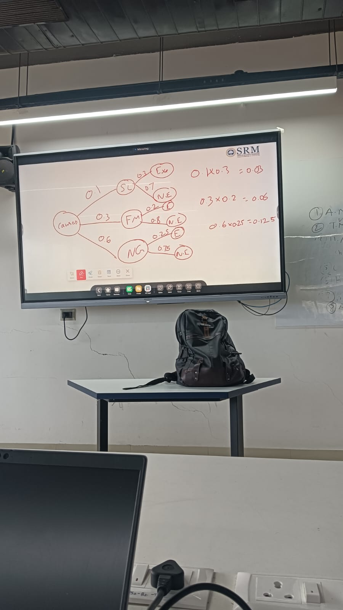

# Bayes' Theorem: Multiple Hypotheses Analysis

## Definition

**Bayes' Theorem** is a fundamental principle in probability theory that describes how to update the probability of hypotheses based on new evidence. It provides a mathematical framework for revising beliefs when presented with additional information, particularly powerful when dealing with **multiple competing hypotheses**.

## Core Formulas

### **Basic Form (Two Events)**
```
P(A|B) = P(B|A) × P(A) / P(B)
```

### **Extended Form for Multiple Hypotheses** ⭐

```
P(Ai|B) = P(Ai) × P(B|Ai) / Σ(j=1 to n) P(Aj) × P(B|Aj)
```

**This is the most powerful form** used when you have multiple mutually exclusive hypotheses A₁, A₂, ..., Aₙ, and you want to find the probability of a specific hypothesis Ai given evidence B.

### **Component Breakdown:**

#### **Posterior Probability:** `P(Ai|B)`
- **What we want to find** - Updated probability of hypothesis Ai after observing evidence B
- **"Given the evidence, what's the probability this hypothesis is true?"**

#### **Prior Probability:** `P(Ai)`
- **Initial belief** about hypothesis Ai before seeing evidence
- **"What did we think before the evidence?"**

#### **Likelihood:** `P(B|Ai)`
- **How likely the evidence is** if hypothesis Ai is true
- **"If this hypothesis were true, how likely would we see this evidence?"**

#### **Total Probability (Normalizing Constant):** `Σ(j=1 to n) P(Aj) × P(B|Aj)`
- **Sum across all hypotheses** - ensures probabilities add to 1
- **Law of Total Probability** applied to all competing hypotheses

---

## 


## 🛒 **Customer Analysis Example: Multiple Income Hypotheses**

### **Problem Setup**
Building on your marginal and conditional probability examples, let's use Bayes' theorem with multiple income hypotheses.

**Background:** A customer made a high-value purchase ($500+). We want to determine their most likely income level.

### **Initial Data (Prior Probabilities)**
From your marginal probability notes:
```
P(Low Income) = 0.30 = 30%
P(Middle Income) = 0.50 = 50%  
P(High Income) = 0.20 = 20%
```

### **Evidence Likelihoods**
Probability of high-value purchase by income level:
```
P(High-Value Purchase | Low Income) = 0.15 = 15%
P(High-Value Purchase | Middle Income) = 0.35 = 35%
P(High-Value Purchase | High Income) = 0.80 = 80%
```

### **Step-by-Step Bayes' Calculation**

#### **Step 1: Calculate Total Probability P(High-Value Purchase)**
```
P(High-Value Purchase) = Σ P(Income Level) × P(High-Value Purchase | Income Level)

P(High-Value Purchase) = P(Low) × P(Purchase|Low) + P(Middle) × P(Purchase|Middle) + P(High) × P(Purchase|High)

P(High-Value Purchase) = 0.30 × 0.15 + 0.50 × 0.35 + 0.20 × 0.80
P(High-Value Purchase) = 0.045 + 0.175 + 0.160 = 0.38 = 38%
```

#### **Step 2: Apply Extended Bayes' Formula for Each Hypothesis**

**For Low Income:**
```
P(Low Income | High-Value Purchase) = P(Low Income) × P(Purchase | Low Income) / P(High-Value Purchase)
P(Low Income | High-Value Purchase) = 0.30 × 0.15 / 0.38 = 0.045 / 0.38 = 0.118 = 11.8%
```

**For Middle Income:**
```
P(Middle Income | High-Value Purchase) = 0.50 × 0.35 / 0.38 = 0.175 / 0.38 = 0.461 = 46.1%
```

**For High Income:**
```
P(High Income | High-Value Purchase) = 0.20 × 0.80 / 0.38 = 0.160 / 0.38 = 0.421 = 42.1%
```

#### **Step 3: Verification**
```
11.8% + 46.1% + 42.1% = 100% ✓
```

### **Business Insights**

#### **Before Evidence (Prior):**
- Most customers are middle income (50%)
- Fewest customers are high income (20%)

#### **After Evidence (Posterior):**
- **Middle income most likely** (46.1%) - remains highest but reduced
- **High income very likely** (42.1%) - dramatically increased from 20%
- **Low income unlikely** (11.8%) - significantly reduced from 30%

#### **Strategic Implications:**
1. **High-value purchases shift probability** toward higher income levels
2. **Middle income customers** still represent largest segment of high-value buyers
3. **Marketing strategy** should target both middle and high income for premium products

---

## 🏥 **Medical Diagnosis Example: Multiple Disease Hypotheses**

### **Problem Setup**
Patient presents with symptom S. Three possible diseases with different base rates and symptom probabilities.

### **Prior Probabilities (Disease Prevalence)**
```
P(Disease A) = 0.01 = 1%     (rare disease)
P(Disease B) = 0.05 = 5%     (uncommon disease)  
P(Disease C) = 0.10 = 10%    (common disease)
P(No Disease) = 0.84 = 84%   (healthy)
```

### **Likelihoods (Symptom Probability Given Disease)**
```
P(Symptom | Disease A) = 0.90 = 90%
P(Symptom | Disease B) = 0.70 = 70%
P(Symptom | Disease C) = 0.30 = 30%
P(Symptom | No Disease) = 0.05 = 5%
```

### **Extended Bayes' Calculation**

#### **Step 1: Total Probability of Symptom**
```
P(Symptom) = Σ P(Disease) × P(Symptom | Disease)

P(Symptom) = 0.01×0.90 + 0.05×0.70 + 0.10×0.30 + 0.84×0.05
P(Symptom) = 0.009 + 0.035 + 0.030 + 0.042 = 0.116 = 11.6%
```

#### **Step 2: Posterior Probabilities Given Symptom**

**Disease A:**
```
P(Disease A | Symptom) = 0.01 × 0.90 / 0.116 = 0.009 / 0.116 = 0.078 = 7.8%
```

**Disease B:**
```
P(Disease B | Symptom) = 0.05 × 0.70 / 0.116 = 0.035 / 0.116 = 0.302 = 30.2%
```

**Disease C:**
```
P(Disease C | Symptom) = 0.10 × 0.30 / 0.116 = 0.030 / 0.116 = 0.259 = 25.9%
```

**No Disease:**
```
P(No Disease | Symptom) = 0.84 × 0.05 / 0.116 = 0.042 / 0.116 = 0.362 = 36.2%
```

### **Medical Decision Analysis**

#### **Probability Ranking:**
1. **No Disease: 36.2%** - Still most likely despite symptom
2. **Disease B: 30.2%** - Most likely actual disease
3. **Disease C: 25.9%** - Second most likely disease  
4. **Disease A: 7.8%** - Least likely despite high symptom rate

#### **Clinical Insights:**
- **Symptom presence** significantly increases disease probabilities
- **Disease B becomes most likely** among actual diseases (30.2% vs 5% prior)
- **No disease still possible** (36.2%) - symptom could be false positive
- **Further testing recommended** to distinguish between Disease B and C

---

## 🎯 **Marketing Campaign Example: Multiple Channel Attribution**

### **Problem Setup**
Customer made a purchase. Want to determine which marketing channel was most influential using multiple channel hypotheses.

### **Prior Probabilities (Channel Exposure Rates)**
```
P(Email Only) = 0.25 = 25%
P(Social Media Only) = 0.20 = 20%
P(Direct Mail Only) = 0.15 = 15%
P(Multiple Channels) = 0.30 = 30%
P(No Marketing) = 0.10 = 10%
```

### **Likelihoods (Purchase Rate by Channel)**
```
P(Purchase | Email Only) = 0.12 = 12%
P(Purchase | Social Media Only) = 0.08 = 8%
P(Purchase | Direct Mail Only) = 0.15 = 15%
P(Purchase | Multiple Channels) = 0.35 = 35%
P(Purchase | No Marketing) = 0.02 = 2%
```

### **Bayes' Analysis**

#### **Step 1: Total Purchase Probability**
```
P(Purchase) = 0.25×0.12 + 0.20×0.08 + 0.15×0.15 + 0.30×0.35 + 0.10×0.02
P(Purchase) = 0.030 + 0.016 + 0.0225 + 0.105 + 0.002 = 0.1755 = 17.55%
```

#### **Step 2: Channel Attribution Given Purchase**

**Email Only:**
```
P(Email Only | Purchase) = 0.25 × 0.12 / 0.1755 = 0.030 / 0.1755 = 0.171 = 17.1%
```

**Social Media Only:**
```
P(Social Media Only | Purchase) = 0.20 × 0.08 / 0.1755 = 0.016 / 0.1755 = 0.091 = 9.1%
```

**Direct Mail Only:**
```
P(Direct Mail Only | Purchase) = 0.15 × 0.15 / 0.1755 = 0.0225 / 0.1755 = 0.128 = 12.8%
```

**Multiple Channels:**
```
P(Multiple Channels | Purchase) = 0.30 × 0.35 / 0.1755 = 0.105 / 0.1755 = 0.598 = 59.8%
```

**No Marketing:**
```
P(No Marketing | Purchase) = 0.10 × 0.02 / 0.1755 = 0.002 / 0.1755 = 0.011 = 1.1%
```

### **Marketing Attribution Insights**

#### **Channel Effectiveness Ranking:**
1. **Multiple Channels: 59.8%** - Multi-touch attribution most effective
2. **Email Only: 17.1%** - Single-channel leader
3. **Direct Mail Only: 12.8%** - Traditional channel effectiveness
4. **Social Media Only: 9.1%** - Lower attribution despite reach
5. **No Marketing: 1.1%** - Minimal organic purchases

#### **Strategic Implications:**
- **Multi-channel campaigns are most effective** (59.8% attribution)
- **Coordinate marketing efforts** across channels rather than single-channel focus
- **Email remains strongest single channel** for purchase attribution
- **Social media needs optimization** - high reach, low conversion attribution

---

## 🧮 **Computational Framework for Multiple Hypotheses**

### **General Algorithm**

#### **Input:**
- **Hypotheses:** H₁, H₂, ..., Hₙ (mutually exclusive and exhaustive)
- **Prior probabilities:** P(H₁), P(H₂), ..., P(Hₙ)
- **Evidence:** E
- **Likelihoods:** P(E|H₁), P(E|H₂), ..., P(E|Hₙ)

#### **Step 1: Calculate Total Probability**
```
P(E) = Σ(i=1 to n) P(Hi) × P(E|Hi)
```

#### **Step 2: Calculate Each Posterior**
```
For each i from 1 to n:
    P(Hi|E) = P(Hi) × P(E|Hi) / P(E)
```

#### **Step 3: Verification**
```
Σ(i=1 to n) P(Hi|E) = 1
```

### **Matrix Representation**

For computational efficiency, organize as:

```
Prior Vector: [P(H₁), P(H₂), ..., P(Hₙ)]
Likelihood Vector: [P(E|H₁), P(E|H₂), ..., P(E|Hₙ)]
Numerator Vector: Prior × Likelihood (element-wise)
Total Probability: Sum(Numerator Vector)
Posterior Vector: Numerator Vector / Total Probability
```

### **Python Implementation Framework**

```python
import numpy as np

def bayes_multiple_hypotheses(priors, likelihoods):
    """
    Calculate posterior probabilities for multiple hypotheses
    
    Args:
        priors: array of prior probabilities [P(H1), P(H2), ..., P(Hn)]
        likelihoods: array of likelihoods [P(E|H1), P(E|H2), ..., P(E|Hn)]
    
    Returns:
        posteriors: array of posterior probabilities [P(H1|E), P(H2|E), ..., P(Hn|E)]
    """
    
    # Calculate numerators for each hypothesis
    numerators = priors * likelihoods
    
    # Calculate total probability (normalizing constant)
    total_probability = np.sum(numerators)
    
    # Calculate posterior probabilities
    posteriors = numerators / total_probability
    
    return posteriors, total_probability

# Example usage with customer income analysis
priors = np.array([0.30, 0.50, 0.20])  # [Low, Middle, High]
likelihoods = np.array([0.15, 0.35, 0.80])  # Purchase rates

posteriors, evidence_prob = bayes_multiple_hypotheses(priors, likelihoods)
print(f"Posterior probabilities: {posteriors}")
print(f"Evidence probability: {evidence_prob}")
```

---

## 🔄 **Sequential Bayesian Updates**

### **Concept**
When multiple pieces of evidence arrive sequentially, the posterior from one analysis becomes the prior for the next.

### **Formula Sequence**
```
Initial Prior: P(Hi)
After Evidence E₁: P(Hi|E₁) = P(Hi) × P(E₁|Hi) / P(E₁)
After Evidence E₂: P(Hi|E₁,E₂) = P(Hi|E₁) × P(E₂|Hi,E₁) / P(E₂|E₁)
```

### **Customer Behavior Example**

#### **Initial Scenario:**
Customer income hypotheses with purchase behavior evidence:

**After High-Value Purchase (E₁):**
```
Prior: [30%, 50%, 20%] → Posterior: [11.8%, 46.1%, 42.1%]
```

#### **Second Evidence: Premium Service Subscription (E₂)**

**New Likelihoods:**
```
P(Premium Service | Low Income) = 0.05 = 5%
P(Premium Service | Middle Income) = 0.25 = 25%  
P(Premium Service | High Income) = 0.70 = 70%
```

**Update Calculation:**
Using previous posteriors as new priors:
```
New Prior: [11.8%, 46.1%, 42.1%]

P(Premium Service) = 0.118×0.05 + 0.461×0.25 + 0.421×0.70
P(Premium Service) = 0.0059 + 0.115 + 0.295 = 0.416 = 41.6%

Updated Posteriors:
P(Low Income | Both Evidence) = 0.118 × 0.05 / 0.416 = 0.0142 = 1.4%
P(Middle Income | Both Evidence) = 0.461 × 0.25 / 0.416 = 0.277 = 27.7%
P(High Income | Both Evidence) = 0.421 × 0.70 / 0.416 = 0.709 = 70.9%
```

### **Progressive Learning Insights**

#### **Evidence Accumulation:**
```
Initial: Low(30%) > Middle(50%) > High(20%)
After Purchase: Middle(46.1%) > High(42.1%) > Low(11.8%)
After Service: High(70.9%) > Middle(27.7%) > Low(1.4%)
```

#### **Business Intelligence:**
- **Sequential evidence dramatically refines customer profiling**
- **High-income probability increases from 20% to 70.9%**
- **Marketing strategy can adapt** as more evidence accumulates
- **Personalization improves** with each customer interaction

---

## 📊 **Practical Applications and Case Studies**

### **1. Fraud Detection System**

#### **Multiple Risk Hypotheses:**
```
H₁: Low Risk (90% of customers)
H₂: Medium Risk (8% of customers)
H₃: High Risk (2% of customers)
```

#### **Evidence: Unusual Transaction Pattern**
```
P(Unusual Pattern | Low Risk) = 0.01 = 1%
P(Unusual Pattern | Medium Risk) = 0.15 = 15%
P(Unusual Pattern | High Risk) = 0.80 = 80%
```

#### **Bayes' Analysis:**
```
P(Unusual Pattern) = 0.90×0.01 + 0.08×0.15 + 0.02×0.80 = 0.037 = 3.7%

P(Low Risk | Unusual) = 0.90 × 0.01 / 0.037 = 24.3%
P(Medium Risk | Unusual) = 0.08 × 0.15 / 0.037 = 32.4%
P(High Risk | Unusual) = 0.02 × 0.80 / 0.037 = 43.2%
```

**Result:** Unusual pattern shifts highest probability to high-risk category (43.2%).

### **2. Product Quality Assessment**

#### **Multiple Supplier Hypotheses:**
```
Supplier A: 60% market share, 2% defect rate
Supplier B: 30% market share, 5% defect rate
Supplier C: 10% market share, 8% defect rate
```

#### **Evidence: Defective Product Found**
```
P(Defect | Supplier A) = 0.02
P(Defect | Supplier B) = 0.05
P(Defect | Supplier C) = 0.08

P(Defect) = 0.60×0.02 + 0.30×0.05 + 0.10×0.08 = 0.035 = 3.5%

P(Supplier A | Defect) = 0.60 × 0.02 / 0.035 = 34.3%
P(Supplier B | Defect) = 0.30 × 0.05 / 0.035 = 42.9%
P(Supplier C | Defect) = 0.10 × 0.08 / 0.035 = 22.9%
```

**Result:** Defective product most likely from Supplier B despite lower market share.

### **3. Customer Lifetime Value Prediction**

#### **Multiple Value Hypotheses:**
```
Low Value (<$100): 50% of customers
Medium Value ($100-$500): 35% of customers  
High Value (>$500): 15% of customers
```

#### **Evidence: Early Engagement Metrics**
High engagement score in first month:
```
P(High Engagement | Low Value) = 0.20
P(High Engagement | Medium Value) = 0.45
P(High Engagement | High Value) = 0.85

P(High Engagement) = 0.50×0.20 + 0.35×0.45 + 0.15×0.85 = 0.385

P(Low Value | High Engagement) = 0.50 × 0.20 / 0.385 = 26.0%
P(Medium Value | High Engagement) = 0.35 × 0.45 / 0.385 = 40.9%
P(High Value | High Engagement) = 0.15 × 0.85 / 0.385 = 33.1%
```

**Result:** High engagement shifts probability toward higher value customers.

---

## 💡 **Advanced Concepts and Extensions**

### **1. Hierarchical Bayes**

When hypotheses themselves have sub-hypotheses:
```
H₁: Customer Type A
    H₁ₐ: Subtype A1 (60% of Type A)
    H₁ᵦ: Subtype A2 (40% of Type A)
H₂: Customer Type B
    H₂ₐ: Subtype B1 (70% of Type B)
    H₂ᵦ: Subtype B2 (30% of Type B)
```

### **2. Continuous Hypothesis Spaces**

Extension to continuous parameter estimation:
```
P(θ|Data) ∝ P(Data|θ) × P(θ)
```

Where θ is a continuous parameter rather than discrete hypotheses.

### **3. Bayesian Networks**

Multiple interconnected hypotheses with conditional dependencies:
```
Income Level → Purchase Behavior → Loyalty Status
     ↓               ↓                ↓
Geographic Region → Product Preference → Recommendation Score
```

### **4. Model Comparison**

Using Bayes' theorem to compare different models:
```
P(Model i | Data) = P(Data | Model i) × P(Model i) / P(Data)
```

---

## 🎯 **Key Takeaways for Multiple Hypotheses**

### **Essential Concepts:**

#### **1. Exhaustive and Exclusive Hypotheses**
- **Must cover all possibilities** - Σ P(Hi) = 1
- **Cannot overlap** - P(Hi ∩ Hj) = 0 for i ≠ j
- **Complete partitioning** of the hypothesis space

#### **2. Prior Knowledge Integration**
- **Domain expertise** informs prior probabilities
- **Historical data** provides empirical priors
- **Objective vs subjective** prior specification

#### **3. Evidence Evaluation**
- **Likelihood assessment** crucial for accurate updates
- **Independent vs dependent** evidence consideration
- **Quality of evidence** affects reliability

#### **4. Posterior Interpretation**
- **Relative probabilities** more important than absolute values
- **Decision thresholds** depend on consequences
- **Uncertainty quantification** through probability distributions

### **Business Applications:**

#### **Strategic Decision Making:**
- **Market segmentation** with multiple customer types
- **Risk assessment** across multiple scenarios
- **Product development** with competing hypotheses
- **Investment decisions** under uncertainty

#### **Operational Excellence:**
- **Quality control** with multiple failure modes
- **Fraud detection** across risk categories
- **Demand forecasting** with multiple influencing factors
- **Supply chain optimization** under various disruption scenarios

### **Computational Considerations:**

#### **Scalability:**
- **Efficient algorithms** for large hypothesis spaces
- **Approximate methods** for complex calculations  
- **Parallel processing** for independent updates
- **Memory management** for sequential updates

#### **Validation:**
- **Cross-validation** of posterior predictions
- **Sensitivity analysis** to prior assumptions
- **Model comparison** using validation data
- **Calibration assessment** of probability estimates

---

## 🔗 **Integration with Your Probability Study Framework**

### **Building on Previous Concepts:**

#### **From Marginal Probability:**
- **Prior probabilities** often come from marginal distributions
- **Your income level data** provides natural priors for customer analysis
- **Market share information** serves as hypothesis priors

#### **From Conditional Probability:**
- **Likelihoods are conditional probabilities** P(Evidence|Hypothesis)
- **Your purchase behavior analysis** provides likelihood estimates
- **Customer segmentation data** informs conditional relationships

#### **From Addition/Multiplication Rules:**
- **Total probability calculation** uses addition rule across hypotheses
- **Joint evidence handling** requires multiplication rule
- **Complex scenario modeling** combines multiple probability rules

### **Complete Bayesian Workflow:**

#### **1. Problem Formulation:**
- Define mutually exclusive, exhaustive hypotheses
- Gather prior probability estimates
- Identify relevant evidence types

#### **2. Data Integration:**
- Use marginal probabilities for priors
- Calculate conditional probabilities for likelihoods
- Apply probability rules for complex evidence

#### **3. Bayesian Analysis:**
- Implement multiple hypothesis framework
- Calculate posterior probabilities
- Interpret results in business context

#### **4. Decision Making:**
- Set decision thresholds based on consequences
- Consider uncertainty in probability estimates
- Plan for sequential evidence incorporation

This comprehensive framework transforms your probability knowledge into a powerful tool for data-driven decision making under uncertainty! 🎯

---

## 📦 **Supply Chain Quality Analysis: Multiple Supplier Assessment**

### **Problem Statement**
A company receives products from three suppliers with different delivery volumes and quality rates. We need to determine which supplier is most likely responsible when a **good quality product** is received.

**Given Information:**
- **S1 delivers 40%** of total stock (90% good, 10% bad)
- **S2 delivers 35%** of total stock (85% good, 15% bad)  
- **S3 delivers 25%** of total stock (95% good, 5% bad)

**Question:** When a good quality product is received, which supplier most likely supplied it?

### **Multiple Hypotheses Setup**

#### **Step 1: Define Hypotheses (Mutually Exclusive and Exhaustive)**
```
H₁: Product came from Supplier S1
H₂: Product came from Supplier S2
H₃: Product came from Supplier S3
```

#### **Step 2: Identify Prior Probabilities (Market Share)**
```
P(H₁) = P(Supplier S1) = 0.40 = 40%
P(H₂) = P(Supplier S2) = 0.35 = 35%
P(H₃) = P(Supplier S3) = 0.25 = 25%
```

**Verification:** 0.40 + 0.35 + 0.25 = 1.00 ✓ (Complete probability space)

#### **Step 3: Identify Likelihoods (Good Product Rate by Supplier)**
```
P(G|H₁) = P(Good Product | Supplier S1) = 0.90 = 90%
P(G|H₂) = P(Good Product | Supplier S2) = 0.85 = 85%
P(G|H₃) = P(Good Product | Supplier S3) = 0.95 = 95%
```

Where G = Good Product (the observed evidence)

### **Extended Bayes' Formula Application**

#### **Formula:**
```
P(Hᵢ|G) = P(Hᵢ) × P(G|Hᵢ) / Σ(j=1 to 3) P(Hⱼ) × P(G|Hⱼ)
```

#### **Step 4: Calculate Total Probability of Good Product P(G)**
```
P(G) = Σ P(Hᵢ) × P(G|Hᵢ) for i = 1,2,3

P(G) = P(H₁) × P(G|H₁) + P(H₂) × P(G|H₂) + P(H₃) × P(G|H₃)
P(G) = 0.40 × 0.90 + 0.35 × 0.85 + 0.25 × 0.95
P(G) = 0.36 + 0.2975 + 0.2375 = 0.895 = 89.5%
```

**Interpretation:** Overall probability of receiving a good product is 89.5%.

#### **Step 5: Calculate Posterior Probabilities Using Extended Bayes' Formula**

**For Supplier S1:**
```
P(H₁|G) = P(Supplier S1 | Good Product) = P(H₁) × P(G|H₁) / P(G)
P(H₁|G) = 0.40 × 0.90 / 0.895 = 0.36 / 0.895 = 0.402 = 40.2%
```

**For Supplier S2:**
```
P(H₂|G) = P(Supplier S2 | Good Product) = P(H₂) × P(G|H₂) / P(G)
P(H₂|G) = 0.35 × 0.85 / 0.895 = 0.2975 / 0.895 = 0.332 = 33.2%
```

**For Supplier S3:**
```
P(H₃|G) = P(Supplier S3 | Good Product) = P(H₃) × P(G|H₃) / P(G)
P(H₃|G) = 0.25 × 0.95 / 0.895 = 0.2375 / 0.895 = 0.265 = 26.5%
```

#### **Step 6: Verification**
```
Sum of all posterior probabilities:
40.2% + 33.2% + 26.5% = 99.9% ≈ 100% ✓ (rounding difference)
```

### **Solution and Analysis**

#### **Probability Ranking (Most to Least Likely for Good Products):**
1. **Supplier S1: 40.2%** ⭐ **MOST LIKELY SOURCE OF GOOD PRODUCTS**
2. **Supplier S2: 33.2%**
3. **Supplier S3: 26.5%** - Least likely despite highest quality rate

#### **Answer:** **Supplier S1 is most likely to supply good quality products** with 40.2% probability.

### **Detailed Analysis**

#### **Before Evidence (Prior Market Share):**
```
Supplier S1: 40% (largest market share)
Supplier S2: 35% (moderate market share)
Supplier S3: 25% (smallest market share)
```

#### **Quality Rates by Supplier:**
```
Supplier S1: 90% good quality (moderate quality)
Supplier S2: 85% good quality (lowest quality)
Supplier S3: 95% good quality (highest quality)
```

#### **After Evidence - Good Product Received (Posterior Probabilities):**
```
Supplier S1: 40.2% ↑ (slightly increased from 40%)
Supplier S2: 33.2% ↓ (decreased from 35%)
Supplier S3: 26.5% ↑ (increased from 25%)
```

#### **Key Insights:**

**1. Market Share Dominates Over Quality Rate:**
- **S1 wins** despite having moderate quality (90%) due to large market share (40%)
- **Volume effect** outweighs quality differences in this scenario
- **40% market share** provides strong prior probability foundation

**2. S3 Penalized by Low Market Share:**
- **Highest quality rate (95%)** but lowest probability (26.5%)
- **Small market share (25%)** limits its contribution to good products
- **Quality excellence** insufficient to overcome volume disadvantage

**3. S2 Shows Largest Decrease:**
- **Drops from 35% to 33.2%** (-1.8 percentage points)
- **Lowest quality rate (85%)** reduces its likelihood when good product observed
- **Moderate market share** cannot compensate for poor quality

**4. Evidence Impact Analysis:**
- **Good product evidence** slightly favors suppliers with higher quality rates
- **Market share** remains the dominant factor in final probabilities
- **Quality differences** create modest shifts in posterior probabilities

### **Business Decision Implications**

#### **Supply Chain Strategy (Priority Order):**

**1. Supplier S1 - Primary Good Product Source (40.2%)**
- **Strengths:** Largest market share, decent quality rate
- **Action:** Maintain strong relationship, consider quality improvement incentives
- **Risk:** Moderate quality rate could be improved

**2. Supplier S2 - Secondary Source with Quality Concerns (33.2%)**
- **Strengths:** Significant market share
- **Action:** Implement quality improvement programs, consider reducing dependency
- **Risk:** Lowest quality rate (85%) affecting overall product quality

**3. Supplier S3 - Premium Quality, Limited Volume (26.5%)**
- **Strengths:** Highest quality rate (95%)
- **Action:** Consider increasing order volume, leverage quality expertise
- **Opportunity:** Could become primary supplier with volume increase

#### **Resource Allocation for Quality Management:**
- **40% of quality assurance resources** → Monitor and improve S1 processes
- **35% of quality assurance resources** → Intensive S2 quality improvement
- **25% of quality assurance resources** → Maintain S3 excellence and explore expansion

### **Mathematical Summary Table**

| Supplier | Market Share P(Hᵢ) | Quality Rate P(G\|Hᵢ) | Numerator P(Hᵢ)×P(G\|Hᵢ) | Posterior P(Hᵢ\|G) | Rank |
|----------|-------------------|---------------------|---------------------------|-------------------|------|
| **S1** | 40% | 90% | 0.36 | **40.2%** | **1st** ⭐ |
| **S2** | 35% | 85% | 0.2975 | **33.2%** | **2nd** |
| **S3** | 25% | 95% | 0.2375 | **26.5%** | **3rd** |
| **Total** | 100% | - | 0.895 | **100%** | - |

### **Strategic Insights**

#### **Volume vs Quality Trade-off:**
- **S1 demonstrates** that large volume with good quality beats small volume with excellent quality
- **Market positioning** matters as much as product quality in supply chain impact
- **Balanced approach** of volume and quality provides competitive advantage

#### **Quality Improvement Opportunities:**
1. **S2 Quality Enhancement:** Biggest impact potential (large volume + quality gap)
2. **S1 Volume Maintenance:** Protect largest contributor while improving quality
3. **S3 Volume Expansion:** Leverage highest quality for larger market impact

#### **Risk Management:**
- **Diversified supplier base** reduces dependency risk
- **Quality monitoring** essential for suppliers with larger market share
- **Continuous improvement** programs for all suppliers based on their contribution levels

### **Extended Bayes' Application Demonstration**

This problem perfectly illustrates how the **Extended Bayes' Formula for Multiple Hypotheses** handles complex business scenarios:

```
P(Supplier|Good Product) = P(Supplier) × P(Good Product|Supplier) / P(Good Product)
```

**Key Learning Points:**
- **Prior probabilities** (market share) significantly influence final results
- **Evidence** (good product) provides moderate adjustment based on quality rates
- **Business decisions** require balancing multiple factors through probabilistic analysis
- **Optimal strategies** emerge from quantitative analysis rather than intuitive assumptions

This supply chain analysis demonstrates practical application of Bayesian reasoning in business decision-making! 📊

short cut to know what supplier has delivered good product use the below diagram 

S1 = 0.4 * 0.9 = 0.36 
s2 = 0.35 * 0.85 = 0.29
s3 = 0.25 * 0.05 = 0.237

based on the above we can determine that the s1 delivered good product but we have to use the formula to identify the % of good product delivered 



---

## 🏭 **Classroom Problem: Armament Production Station Explosion**

### **Problem Statement**
In an armament production station, an explosion can occur due to short circuit, fault in the machinery, or negligence of workers. From experience, the chances of these causes are 0.1, 0.3, 0.6 respectively. The chief engineer feels that an explosion can occur with probability:
- **0.3 if there is a short circuit**
- **0.2 if there is a fault in the machinery** 
- **0.25 if the workers are negligent**

**Given that an explosion has occurred, determine the most likely cause of it?**

### **Multiple Hypotheses Setup**

#### **Step 1: Define Hypotheses (Mutually Exclusive and Exhaustive)**
```
H₁: Short Circuit (Prior probability)
H₂: Fault in Machinery (Prior probability)  
H₃: Worker Negligence (Prior probability)
```

#### **Step 2: Identify Prior Probabilities**
```
P(H₁) = P(Short Circuit) = 0.1 = 10%
P(H₂) = P(Fault in Machinery) = 0.3 = 30%
P(H₃) = P(Worker Negligence) = 0.6 = 60%
```

**Verification:** 0.1 + 0.3 + 0.6 = 1.0 ✓ (Complete probability space)

#### **Step 3: Identify Likelihoods (Evidence Given Each Hypothesis)**
```
P(E|H₁) = P(Explosion | Short Circuit) = 0.3 = 30%
P(E|H₂) = P(Explosion | Fault in Machinery) = 0.2 = 20%
P(E|H₃) = P(Explosion | Worker Negligence) = 0.25 = 25%
```

Where E = Explosion (the observed evidence)

### **Extended Bayes' Formula Application**

#### **Formula:**
```
P(Hᵢ|E) = P(Hᵢ) × P(E|Hᵢ) / Σ(j=1 to 3) P(Hⱼ) × P(E|Hⱼ)
```

#### **Step 4: Calculate Total Probability of Explosion P(E)**
```
P(E) = Σ P(Hᵢ) × P(E|Hᵢ) for i = 1,2,3

P(E) = P(H₁) × P(E|H₁) + P(H₂) × P(E|H₂) + P(H₃) × P(E|H₃)
P(E) = 0.1 × 0.3 + 0.3 × 0.2 + 0.6 × 0.25
P(E) = 0.03 + 0.06 + 0.15 = 0.24 = 24%
```

**Interpretation:** Overall probability of explosion occurring is 24%.

#### **Step 5: Calculate Posterior Probabilities Using Extended Bayes' Formula**

**For Short Circuit (H₁):**
```
P(H₁|E) = P(Short Circuit | Explosion) = P(H₁) × P(E|H₁) / P(E)
P(H₁|E) = 0.1 × 0.3 / 0.24 = 0.03 / 0.24 = 0.125 = 12.5%
```

**For Fault in Machinery (H₂):**
```
P(H₂|E) = P(Fault in Machinery | Explosion) = P(H₂) × P(E|H₂) / P(E)
P(H₂|E) = 0.3 × 0.2 / 0.24 = 0.06 / 0.24 = 0.25 = 25.0%
```

**For Worker Negligence (H₃):**
```
P(H₃|E) = P(Worker Negligence | Explosion) = P(H₃) × P(E|H₃) / P(E)
P(H₃|E) = 0.6 × 0.25 / 0.24 = 0.15 / 0.24 = 0.625 = 62.5%
```

#### **Step 6: Verification**
```
Sum of all posterior probabilities:
12.5% + 25.0% + 62.5% = 100% ✓
```

### **Solution and Analysis**

#### **Probability Ranking (Most to Least Likely):**
1. **Worker Negligence: 62.5%** ⭐ **MOST LIKELY CAUSE**
2. **Fault in Machinery: 25.0%**
3. **Short Circuit: 12.5%** - Least likely

#### **Answer:** **Worker Negligence is the most likely cause** of the explosion with 62.5% probability.

### **Detailed Analysis**

#### **Before Evidence (Prior Probabilities):**
```
Worker Negligence: 60% (highest prior)
Fault in Machinery: 30% 
Short Circuit: 10% (lowest prior)
```

#### **After Evidence - Explosion Occurred (Posterior Probabilities):**
```
Worker Negligence: 62.5% ↑ (increased from 60%)
Fault in Machinery: 25.0% ↓ (decreased from 30%)
Short Circuit: 12.5% ↑ (increased from 10%)
```

#### **Key Insights:**

**1. Worker Negligence Still Most Likely:**
- **Prior:** 60% → **Posterior:** 62.5% (+2.5 percentage points)
- **Reason:** High prior probability combined with moderate explosion rate (25%)
- **Remains the dominant cause** but with smaller increase than before

**2. Short Circuit Probability Increased Significantly:**
- **Prior:** 10% → **Posterior:** 12.5% (+2.5 percentage points)
- **Reason:** Higher likelihood of explosion given short circuit (30% vs 25% for negligence, 20% for machinery)
- **25% relative increase** (from 10% to 12.5%)

**3. Machinery Fault Became Less Likely:**
- **Prior:** 30% → **Posterior:** 25.0% (-5.0 percentage points)
- **Reason:** Lowest explosion likelihood (20%) among all causes
- **Significant decrease** despite moderate prior probability

**4. Evidence Impact Analysis:**
- **Higher short circuit likelihood (30%)** makes it more probable when explosion occurs
- **Worker negligence maintains dominance** due to very high prior (60%)
- **Machinery fault penalized** by lowest explosion rate (20%)

### **Engineering Decision Implications**

#### **Immediate Actions (Priority Order):**
1. **Focus on Worker Training and Safety Protocols** (62.5% probability)
   - Review safety procedures
   - Enhance worker supervision
   - Implement additional safety checks

2. **Machinery Inspection and Maintenance** (25.0% probability)
   - Check equipment condition
   - Review maintenance schedules
   - Update machinery protocols

3. **Electrical System Review** (12.5% probability)
   - Inspect circuit systems
   - Check electrical safety measures
   - Update electrical protocols

#### **Resource Allocation:**
- **62.5% of prevention resources** → Worker safety and training
- **25% of prevention resources** → Machinery maintenance
- **12.5% of prevention resources** → Electrical system improvements

### **Mathematical Summary Table**

| Cause | Prior P(Hᵢ) | Likelihood P(E\|Hᵢ) | Numerator P(Hᵢ)×P(E\|Hᵢ) | Posterior P(Hᵢ\|E) | Rank |
|-------|-------------|---------------------|---------------------------|-------------------|------|
| **Short Circuit** | 0.10 | 0.30 | 0.03 | **12.5%** | 3rd |
| **Machinery Fault** | 0.30 | 0.20 | 0.06 | **25.0%** | 2nd |
| **Worker Negligence** | 0.60 | 0.25 | 0.15 | **62.5%** | **1st** ⭐ |
| **Total** | 1.00 | - | 0.24 | **100%** | - |

### **Extended Bayes' Formula Application**

This problem perfectly demonstrates the **Extended Bayes' Formula for Multiple Hypotheses**:

```
P(Hᵢ|E) = P(Hᵢ) × P(E|Hᵢ) / Σ(j=1 to n) P(Hⱼ) × P(E|Hⱼ)
```

**Where each component serves a specific purpose:**

#### **Prior Probabilities P(Hᵢ):**
- **Incorporate historical experience** (10%, 30%, 60% base rates)
- **Reflect domain knowledge** about typical cause frequencies
- **Foundation for updating** when new evidence arrives

#### **Likelihoods P(E|Hᵢ):**
- **Model how evidence manifests** under each hypothesis
- **Engineering assessment** of explosion probability given each cause
- **Critical for evidence evaluation**

#### **Normalizing Constant Σ P(Hⱼ) × P(E|Hⱼ):**
- **Ensures probabilities sum to 1** across all hypotheses
- **Law of Total Probability** application
- **Makes probabilities interpretable** as relative likelihoods

#### **Posterior Probabilities P(Hᵢ|E):**
- **Updated beliefs** after observing explosion
- **Optimal decision-making information** for resource allocation
- **Quantified uncertainty** for risk management

### **Practical Implementation:**

Your study notes now provide a complete progression:
1. **Marginal Probability** → Understanding base rates and distributions
2. **Conditional Probability** → Modeling dependencies and relationships
3. **Addition/Multiplication Rules** → Combining multiple events and scenarios
4. **Bayes' Theorem (Multiple Hypotheses)** → Updating beliefs with evidence and making optimal decisions

Together, these concepts form the mathematical foundation for modern data science, machine learning, and business analytics! 📊