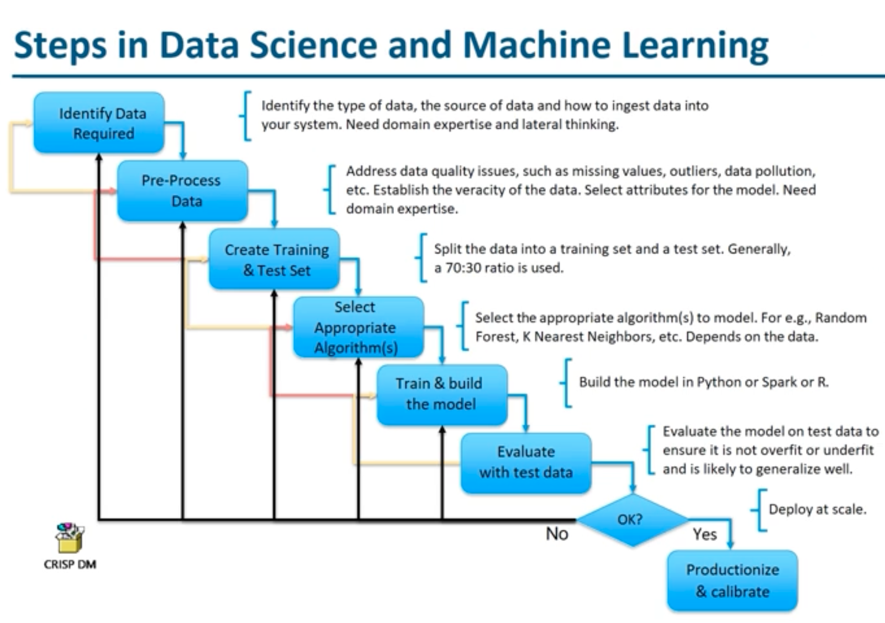
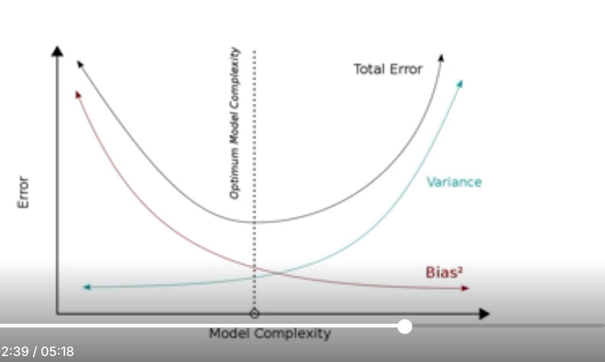
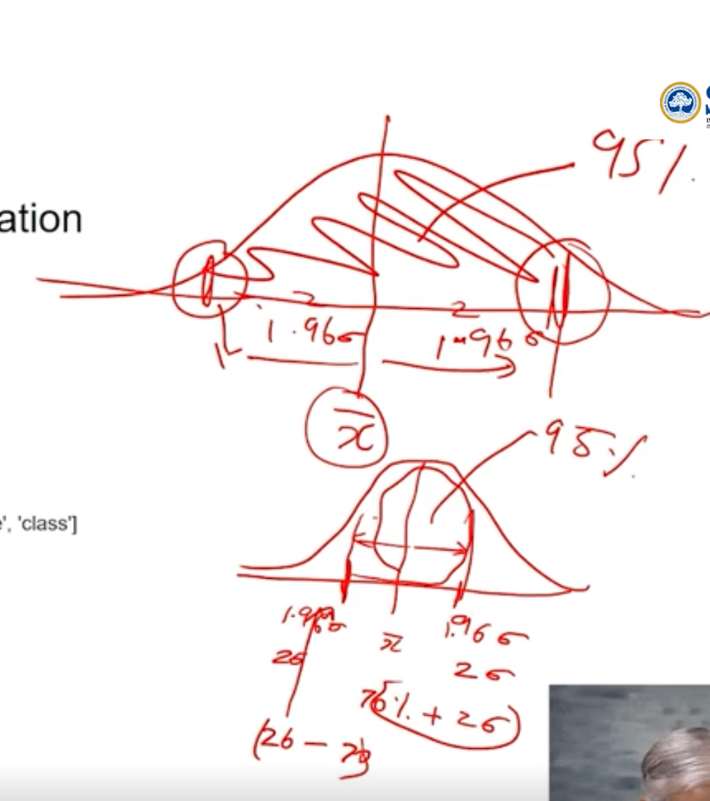
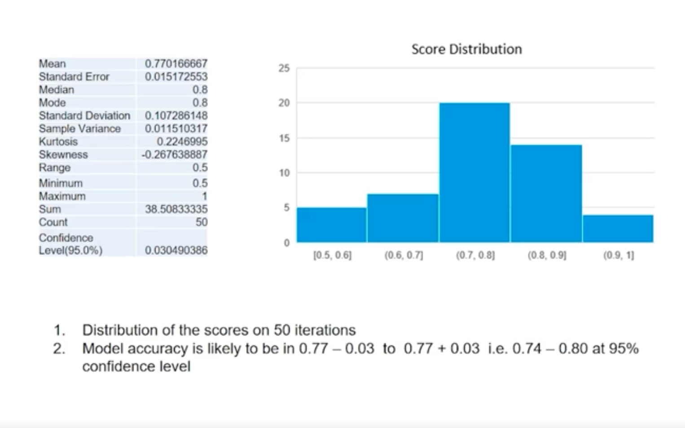

# Module 1: Introduction to Machine Learning & Types of Learning

## Table of Contents
1. [What is Machine Learning?](#what-is-machine-learning)
2. [What do Machine Learning Algorithms do?](#what-do-machine-learning-algorithms-do)
3. [When is Machine Learning useful?](#when-is-machine-learning-useful)
4. [Where are Machine Learning based Systems used?](#where-are-machine-learning-based-systems-used)
5. [Machine Learning Pre-requisites](#machine-learning-pre-requisites)
6. [Types of Machine Learning](#types-of-machine-learning)
7. [Supervised Machine Learning](#supervised-machine-learning)
8. [Characteristics of Supervised Machine Learning](#characteristics-of-supervised-machine-learning)
9. [Hypothesis and Alternate Hypothesis](#hypothesis-and-alternate-hypothesis)
10. [Hypothesis Testing in Machine Learning](#hypothesis-testing-in-machine-learning)
11. [Steps in Data Science and Machine Learning Projects](#steps-in-data-science-and-machine-learning-projects)
12. [Types of Error in Machine Learning](#types-of-error-in-machine-learning)
13. [Bias and Variance in Machine Learning](#bias-and-variance-in-machine-learning)
14. [Bias vs Variance Trade-off](#bias-vs-variance-trade-off)
15. [Overfitting and Underfitting](#overfitting-and-underfitting)
16. [Bias Variance Hands-On Demonstration](#bias-variance-hands-on-demonstration)
17. [Unsupervised Learning](#unsupervised-learning)

---

## What is Machine Learning?

**Simple Definition**: Machine Learning is teaching computers to learn patterns from data, just like how humans learn from experience.

### Key Points:

• **Process**: Teaching a computer to do tasks using math and statistics instead of writing specific instructions

• **Learning Source**: The computer learns from examples (data) and creates a "model" - think of it as the computer's "brain"

• **Model Types**: 
  - **Mathematical Equations** - Like formulas in math class
  - **Decision Trees** - Like flowcharts with yes/no questions
  - **Rules** - If-then statements
  - **Groups** - Organizing similar things together

• **Data Importance**: More good examples = better learning (like studying more examples for an exam)

---

## What do Machine Learning Algorithms do?

**Simple Answer**: They find hidden patterns in data, like finding trends in your daily habits.

### Core Functions:
• **Find Patterns**: Look for trends, cycles, and relationships in data
• **Make Predictions**: Use these patterns to guess what might happen next
• **Create Rules**: Turn patterns into mathematical formulas

---

## When is Machine Learning useful?

**When traditional programming can't solve the problem easily:**

• **Complex Recognition**: Like recognizing faces or understanding speech
• **No Clear Rules**: When we can't write step-by-step instructions (like detecting spam)
• **Too Much Data**: When there's too much information for humans to process
• **Changing Conditions**: When the problem keeps changing (like weather prediction)

---

## Where are Machine Learning based Systems used?

### Real-World Examples:
• **Banking**: Fraud detection, credit risk assessment
• **Healthcare**: Disease prediction, drug discovery
• **Technology**: Email spam filtering, recommendation systems
• **Business**: Pricing strategies, customer analysis
• **Security**: Network intrusion detection, pattern recognition

---

## Machine Learning Pre-requisites

### What You Need:
1. **Good Data**: Quality examples that represent real-world situations
2. **Basic Skills**:
   - Math and statistics (like averages, percentages)
   - Programming (Python is most popular)
   - Domain knowledge (understanding your field)
   - ML tools (like TensorFlow, scikit-learn)

---

## Types of Machine Learning

Machine Learning can be divided into three main types based on how the computer learns:

### 1. **Supervised Learning** 🎯
- **What**: Learning with a teacher
- **How**: Given examples with correct answers
- **Goal**: Predict answers for new examples

### 2. **Unsupervised Learning** 🔍
- **What**: Learning without a teacher
- **How**: Find hidden patterns in data
- **Goal**: Discover structure in data

### 3. **Reinforcement Learning** 🎮
- **What**: Learning through trial and error
- **How**: Get rewards for good actions, penalties for bad ones
- **Goal**: Learn the best strategy

---

## Supervised Machine Learning

**Think of it like learning with flashcards - you have questions AND answers to study from.**

### Simple Definition:
Supervised learning is when we teach the computer using examples where we already know the correct answer. It's like showing a student math problems along with their solutions.

### How it Works:
1. **Training Phase**: Show the computer many examples with correct answers
2. **Learning Phase**: Computer finds patterns between inputs and outputs
3. **Testing Phase**: Give computer new examples to see if it learned correctly
4. **Prediction Phase**: Use the trained model to predict new, unseen data

---

## Characteristics of Supervised Machine Learning

Supervised machine learning algorithms learn from examples where both the input data (features) and the correct answer (target) are provided.

- The algorithm builds a model that finds patterns or relationships between the input features and the target values.
- This model can then be used to predict the target for new data where only the input features are known.

**Simple Examples:**
- Predicting the resale value of a car using its mileage, age, and color.
- Estimating a student's final year score based on their previous years' performance.

### Key Features:

1. **Labeled Data Required** 📋
    - Every training example has an input AND the correct output
    - Like having answer keys for practice tests

2. **Two Main Types**:
    - **Classification**: Predicting categories (Yes/No, Cat/Dog/Bird)
    - **Regression**: Predicting numbers (Price, Temperature, Age)

3. **Performance Measurement** 📊
    - Can measure accuracy because we know correct answers
    - Easy to evaluate how well the model is doing

4. **Teacher-Student Relationship** 👨‍🏫
    - Algorithm learns from examples with known outcomes
    - Like having a teacher show you solved problems

### Example: Heart Health Prediction

Let's understand with a practical example:

#### Dataset Structure:
| Age | Blood Pressure | Sugar Level | Heart Healthy |
|-----|---------------|-------------|---------------|
| 45  | 120          | 85          | Yes          |
| 65  | 160          | 180         | No           |
| 30  | 110          | 75          | Yes          |
| 55  | 140          | 120         | No           |
| 40  | 115          | 80          | Yes          |

#### Understanding Variables:

**Independent Variables (Features/Input):**
- **Age**: Person's age in years
- **Blood Pressure**: Systolic blood pressure reading
- **Sugar Level**: Blood glucose level

*These are called "independent" because they are the factors we use to make predictions. They are the "causes" or "inputs".*

**Target Variable (Output/Label):**
- **Heart Healthy**: Whether the person has a healthy heart (Yes/No)

*This is called "target" because it's what we want to predict. It's the "effect" or "output".*

#### Relationship Between Variables:

**How Independent Variables Influence Target Variable:**

• **Age** → Higher age often increases heart disease risk
• **Blood Pressure** → Higher BP usually indicates higher risk
• **Sugar Level** → Higher sugar levels can lead to heart problems

**The Goal**: Learn the relationship between Age, BP, Sugar → Heart Health
**The Question**: Given someone's age, blood pressure, and sugar level, can we predict if their heart is healthy?

**How the Algorithm Learns**:
1. Looks at all examples in the training data
2. Finds patterns like: "People over 60 with BP > 150 tend to have heart problems"
3. Creates rules or mathematical formulas
4. Uses these rules to predict health for new patients

This is the essence of supervised learning - using known examples to learn patterns and make predictions!  


## Hypothesis and Alternate Hypothesis

In machine learning and statistics, hypotheses are assumptions we make about data or relationships between variables.

- **Independent Variable (Feature/Input):** This is the variable you change or observe to see its effect. In our example, these are Age, Blood Pressure, and Sugar Level.
- **Dependent Variable (Target/Output):** This is the variable you are trying to predict or explain, such as Heart Healthy (Yes/No).

When forming hypotheses, we assume a certain relationship between the independent variables and the dependent variable—until proven otherwise by data.

### Hypothesis (Null Hypothesis, **H₀**)
- The **null hypothesis** is a default assumption that there is no relationship or effect.
- Example: "There is no relationship between sugar level and heart health."

### Alternate Hypothesis (**H₁** or **Ha**)
- The **alternate hypothesis** is what you want to prove; it suggests there is a relationship or effect.
- Example: "Higher sugar levels are associated with poor heart health."

**In Practice:**  
- We use data to test if we have enough evidence to reject the null hypothesis in favor of the alternate hypothesis.
- This process is called **hypothesis testing** and is fundamental in evaluating models and drawing conclusions from data.


## Hypothesis Testing in Machine Learning

**Hypothesis testing** is a statistical method used to decide whether there is enough evidence in a sample of data to infer that a certain condition holds for the entire population.

### Why is Hypothesis Testing Important?

- It helps us validate assumptions about data and relationships between variables.
- It is used to compare models, features, or algorithms to see if observed differences are statistically significant or just due to random chance.

### Steps in Hypothesis Testing

1. **State the Hypotheses**: Define the null hypothesis (**H₀**) and the alternate hypothesis (**H₁**).
2. **Choose a Significance Level (α)**: Commonly set at 0.05 (5%).
3. **Select a Test**: Choose an appropriate statistical test (e.g., t-test, chi-square test).
4. **Calculate the Test Statistic**: Use your data to compute a value that summarizes the evidence.
5. **Find the p-value**: The probability of observing your data (or more extreme) if the null hypothesis is true.
6. **Make a Decision**:
    - If **p-value < α**: Reject the null hypothesis (**evidence supports H₁**).
    - If **p-value ≥ α**: Fail to reject the null hypothesis (**not enough evidence**).

### Example in Machine Learning

Suppose you build two models to predict heart health. You want to know if Model A is significantly better than Model B.

- **Null Hypothesis (H₀)**: There is no difference in accuracy between Model A and Model B.
- **Alternate Hypothesis (H₁)**: Model A has higher accuracy than Model B.
> **Note:** In hypothesis testing, we never "prove" the null hypothesis; we can only find evidence to reject it or fail to reject it. Our goal is to gather enough evidence to support the alternate hypothesis. If the data does not provide strong evidence against the null hypothesis, we simply fail to reject it—we do not accept it as true.
These two hypotheses are mutually exclusive—if one is true, the other must be false. In hypothesis testing, we attempt to find evidence against the null hypothesis. If the data strongly contradicts the null hypothesis, we reject it in favor of the alternate hypothesis.

You would use hypothesis testing to determine if the observed difference in accuracy is statistically significant.

**In summary:**  
Hypothesis testing provides a formal way to use data to support or refute assumptions, helping you make reliable decisions in machine learning projects.

## Steps in Data Science and Machine Learning Projects

The process of building a machine learning solution involves several key steps. Here’s a typical workflow:

### 1. Identify Data Required
- Determine the type, source, and method of data collection.
- Requires domain expertise to understand what data is relevant.

### 2. Pre-Process Data
- Clean the data: handle missing values, outliers, and inconsistencies.
- Select relevant features for modeling.

### 3. Create Training & Test Set
- Split the data into training and test sets (commonly 70:30 ratio).
- Training set is used to build the model; test set is used to evaluate it.

### 4. Select Appropriate Algorithm(s)
- Choose suitable algorithms based on the problem and data (e.g., Random Forest, KNN).
- The choice depends on data characteristics and the task (classification, regression, etc.).

### 5. Train & Build the Model
- Use the training data to train the model.
- Implement using tools like Python, R, or Spark.

### 6. Evaluate with Test Data
- Test the model on unseen data to check for overfitting or underfitting.
- Assess performance using appropriate metrics (accuracy, precision, recall, etc.).

### 7. Productionize & Calibrate
- If the model performs well, deploy it for real-world use.
- Monitor and calibrate as needed to maintain performance.

> **Note:** This process is iterative. If the model does not perform well, you may need to revisit earlier steps (e.g., try different algorithms, improve data quality, or engineer new features).

#### Visual Representation:


This workflow ensures a systematic approach to solving data-driven problems and is widely used in industry and research.

**Important Note:**

In supervised learning, the model learns from labeled data. The labeled data is a set of input-output pairs where the output is known. The model uses this data to learn the relationship between the input and output. Once the model is trained, it can be used to predict the output for new, unseen input data.

---

## Bias and Variance in Machine Learning

Understanding bias and variance is crucial for building effective machine learning models. These concepts help us understand why models make errors and how to improve them.

### Definitions of Bias and Variance

**Bias:**  
Bias is the error introduced by approximating a real-world problem, which may be complex, by a much simpler model. High bias means the model makes strong assumptions about the data and may miss relevant relations (underfitting).

**Variance:**  
Variance is the error introduced by the model’s sensitivity to small fluctuations in the training set. High variance means the model pays too much attention to the training data, capturing noise as if it were signal (overfitting).

## Types of Error in Machine Learning

**📚 EXAM KEY POINT:** There are 3 major errors that cause ML models to perform poorly.

### 1. **Bias Error** 🎯

**📚 EXAM DEFINITION:** Bias is the error introduced by oversimplifying the machine learning algorithm due to wrong assumptions about the target function.

**🔑 KEY CONCEPTS FOR EXAMS:**
- **High Bias = Underfitting**
- **Low Bias = Better pattern capture**
- **Bias measures systematic error**

**MATHEMATICAL UNDERSTANDING:**
- Bias = E[f̂(x)] - f(x)
- Where f̂(x) is predicted value, f(x) is true value
- E[] represents expected value

**EXAM EXAMPLE:** 
Using a straight line (linear regression) to fit curved data will always have bias because the linear assumption is wrong for non-linear relationships.

**HIGH BIAS MODEL CHARACTERISTICS (EXAM POINTS):**
1. **Underfits** the training data
2. **Poor performance** on both training and test data  
3. **Too simple** to capture underlying patterns
4. **Makes systematic errors** consistently
5. **High training error** and **high test error**

**REAL-WORLD ANALOGY:** Like using a ruler to measure a curved road - it will always be systematically inaccurate.

**DEPENDENCIES:**
- Quality of training data
- Size of training dataset  
- Complexity of the chosen algorithm

### 2. **Variance Error** 📊

**📚 EXAM DEFINITION:** Variance is the error introduced by the model's sensitivity to small changes in the training data, measuring how much predictions change when trained on different datasets.

**🔑 KEY CONCEPTS FOR EXAMS:**
- **High Variance = Overfitting**
- **Low Variance = Consistent predictions**
- **Variance measures model instability**

**MATHEMATICAL UNDERSTANDING:**
- Variance = E[(f̂(x) - E[f̂(x)])²]
- Measures spread of predictions around their average
- High variance = predictions vary widely

**EXAM EXAMPLE:** 
A deep neural network that achieves 100% accuracy on training data but only 60% on test data shows high variance - it memorized training examples rather than learning generalizable patterns.

**HIGH VARIANCE MODEL CHARACTERISTICS (EXAM POINTS):**
1. **Overfits** the training data
2. **Excellent performance** on training data, **poor on test data**
3. **Too complex** and captures noise as signal
4. **Inconsistent predictions** on similar inputs
5. **Low training error** but **high test error**
6. **Large gap** between training and validation performance

**REAL-WORLD ANALOGY:** Like a student who memorizes textbook answers perfectly but fails the exam with different questions.

**ALGORITHM EXAMPLES:**
- **Low Variance Algorithms:** Linear regression, Logistic regression
- **High Variance Algorithms:** Decision trees, SVM, Neural networks

### 3. **Random Error (Irreducible Error)** 🎲

**DEFINITION:** Random error is caused by unforeseen changes in the data that cannot be controlled or eliminated by any model.

**KEY CHARACTERISTICS:**
- Also known as **irreducible error** or **noise**
- Represents inherent uncertainty in the data
- Cannot be reduced by any machine learning algorithm
- Always present regardless of model sophistication

**SOURCES OF RANDOM ERROR:**
- Measurement errors in data collection
- Data collection inconsistencies
- Natural randomness in the phenomenon being studied
- External factors not captured in the dataset

### **🎯 MOST IMPORTANT EXAM FORMULA:**

```
Total Error = Bias² + Variance + Irreducible Error
```

**📝 COMPONENT BREAKDOWN (LEARN BY HEART):**

| Component | Definition | Can be Reduced? | Causes |
|-----------|------------|-----------------|---------|
| **Bias²** | Error from wrong assumptions | ✅ YES | Model too simple, wrong algorithm choice |
| **Variance** | Error from sensitivity to training data | ✅ YES | Model too complex, overfitting |
| **Irreducible Error** | Inherent noise in data | ❌ NO | Measurement errors, natural randomness |

**🔑 EXAM KEY POINTS:**
1. **Only Bias² and Variance are reducible**
2. **Goal:** Minimize Bias² + Variance (reducible error)
3. **Irreducible Error** always exists, cannot be eliminated
4. **Trade-off:** Reducing one often increases the other

---

### **Visual Understanding (EXAM ANALOGY)**

**🎯 ARCHERY TARGET ANALOGY - MEMORIZE FOR EXAMS:**

Think of bias and variance like shooting arrows at a target:

| Scenario | Bias | Variance | Arrow Pattern | Model Behavior | Exam Term |
|----------|------|----------|---------------|----------------|-----------|
| **Ideal Model** | Low | Low | Arrows hit bullseye consistently | Good training & test performance | **Perfect Model** ✅ |
| **Underfitting** | High | Low | Arrows consistently miss same direction | Poor training & test performance | **High Bias Problem** |
| **Overfitting** | Low | High | Arrows scattered around bullseye | Good training, poor test | **High Variance Problem** |
| **Worst Case** | High | High | Arrows scattered & off-target | Poor performance everywhere | **Both Problems** |

**📝 EXAM TIP:** Remember the target analogy - it's frequently asked in exams to explain bias-variance visually.

---

## Why Data Should Sometimes Have Bias

While we generally try to minimize bias in machine learning models, there are important scenarios where some level of bias in data or models can be beneficial:

#### 1. **Domain Knowledge Integration** 🧠
- **Purpose**: Incorporate expert knowledge into the model
- **Example**: In medical diagnosis, biasing toward well-established medical principles
- **Benefit**: Prevents the model from learning spurious correlations that contradict medical science

#### 2. **Handling Insufficient Data** 📊
- **Purpose**: When training data is limited, bias helps fill knowledge gaps
- **Example**: Few examples of rare diseases - bias toward known symptoms helps generalization
- **Benefit**: Better performance with small datasets

#### 3. **Computational Efficiency** ⚡
- **Purpose**: Simpler, biased models are faster and use less resources
- **Example**: Linear models for real-time applications where speed matters more than perfect accuracy
- **Benefit**: Trade-off between accuracy and computational cost

#### 4. **Interpretability Requirements** 🔍
- **Purpose**: Biased models are often more interpretable
- **Example**: Decision trees with limited depth for loan approval (need to explain decisions)
- **Benefit**: Stakeholders can understand and trust the model's decisions

#### 5. **Regularization and Generalization** 🎯
- **Purpose**: Intentional bias prevents overfitting
- **Example**: Ridge regression adds bias to reduce variance
- **Benefit**: Better performance on unseen data

#### 6. **Safety and Ethics** 🛡️
- **Purpose**: Bias toward safe, ethical outcomes
- **Example**: Autonomous vehicles biased toward caution over speed
- **Benefit**: Reduces risk of harmful decisions

#### 7. **Inductive Bias in Learning** 🎓
- **Purpose**: Assumptions about the problem structure help learning
- **Example**: Convolutional Neural Networks assume spatial locality in images
- **Benefit**: More efficient learning with fewer examples

### The Key Principle: **Appropriate Bias**

**Important Distinction:**
- **Harmful Bias**: Unfair discrimination, incorrect assumptions
- **Useful Bias**: Reasonable assumptions that improve learning

**Guidelines for Beneficial Bias:**
1. **Based on Domain Expertise**: Use knowledge from subject matter experts
2. **Validated by Data**: Even biased assumptions should be tested
3. **Transparent**: Clearly document what biases are introduced and why
4. **Contextual**: Consider the specific problem and consequences
5. **Balanced**: Ensure bias doesn't create unfair outcomes

**Real-World Example:**
In credit scoring, a slight bias toward financial stability indicators (steady employment, savings) can be beneficial because:
- It incorporates economic knowledge
- It's interpretable to regulators
- It reduces risk for lenders
- It's based on validated financial principles

The goal is not to eliminate all bias, but to have **appropriate bias** that enhances model performance while maintaining fairness and interpretability.

---

## Why Data Should NOT Have Bias?

Understanding why bias in data is problematic is crucial for building fair and accurate machine learning models.

### Key Problems with Biased Data:

#### 1. **Misinterpretation of Data** 🔍
- **The first and most crucial factor is bias leading to misinterpretation of the data.**
- Biased data can lead to incorrect conclusions and poor decision-making
- Models trained on biased data will perpetuate and amplify these biases

#### 2. **Multiple Sources of Bias** 📋
- **It can stem from various sources, including humans who would have used uninformative data, incomplete surveys, and biased reports and measurements.**
- Human prejudices and preconceptions can inadvertently influence data collection
- Incomplete or selective data gathering processes introduce systematic errors

#### 3. **AI System Bias** 🤖
- **The influence of biased data in Artificial Intelligence is well known.**
- AI systems learn patterns from training data, including biased patterns
- These biases become embedded in the model's decision-making process

#### 4. **Real-World Example** 📱
- **Example: There was a case in London where 'Alexa' started playing songs of her own will and saying discriminatory stuff, which further stresses that discrimination can take the shape of data.**
- This demonstrates how bias in training data can manifest in unexpected and harmful ways
- AI systems can exhibit discriminatory behavior based on biased training examples

---

## Why Data Should NOT Have High Variance?

High variance in data and models creates several significant problems that affect reliability and interpretability.

### Key Problems with High Variance:

#### 1. **Lack of Interpretability** 🤔
- **One major disadvantage of variance is that it cannot be easily comprehended or interpreted.**
- High variance makes it difficult to understand model behavior
- Inconsistent predictions reduce stakeholder confidence

#### 2. **Business Credibility Issues** 💼
- **For example: In finance teams, variances can lead to tough questions on the credibility of the business and finance reports.**
- Stakeholders lose trust when models produce inconsistent results
- Financial decisions based on high-variance models carry increased risk

#### 3. **Data Quality Problems** 📉
- **Setting standard problems, specifications and approximations are fetched from different sources or even affected by human biases. This can lead to variance resulting in lousy information.**
- Inconsistent data collection methods introduce unwanted variability
- Multiple data sources with different standards create reliability issues
- Human errors and biases compound the variance problem

---

## Bias vs Variance Trade-off

**📚 EXAM DEFINITION:** The bias-variance trade-off is the fundamental concept in machine learning that describes the balance between two sources of error affecting model performance.

### The Trade-off Explained

**🔑 KEY PRINCIPLE FOR EXAMS:** As you decrease bias, variance typically increases, and vice versa.

**📊 EXAM TABLE - MEMORIZE:**

| Model Complexity | Bias | Variance | Training Error | Test Error | Problem |
|------------------|------|----------|----------------|------------|---------|
| **Too Simple** | High | Low | High | High | Underfitting |
| **Optimal** | Medium | Medium | Medium | Low | Good Generalization |
| **Too Complex** | Low | High | Low | High | Overfitting |

**WHY THIS HAPPENS (EXAM EXPLANATION):**
- **Simple Models** (High Bias, Low Variance): 
  - Make strong assumptions
  - Consistent but often wrong
  - Example: Linear regression for non-linear data
  
- **Complex Models** (Low Bias, High Variance):
  - Make fewer assumptions  
  - Flexible but inconsistent
  - Example: Deep neural networks with little data

### **The Trade-off Principle:**
- **Reducing bias** typically **increases variance**
- **Reducing variance** typically **increases bias**  
- The goal is to find the optimal balance that minimizes total error

### **Practical Implications:**
1. **Simple models**: High bias, low variance (underfitting)
2. **Complex models**: Low bias, high variance (overfitting)
3. **Optimal models**: Balanced bias and variance (good generalization)

### Finding the Sweet Spot

**Goal**: Find the optimal balance that minimizes total error

**Strategies:**
- **Cross-validation**: Test different model complexities
- **Regularization**: Add penalties for complexity
- **Ensemble methods**: Combine multiple models
- **Feature selection**: Choose relevant features

### Practical Examples

**High Bias Examples:**
- Linear regression on non-linear data
- Using too few features
- Over-regularized models

**High Variance Examples:**
- Deep neural networks with little data
- Decision trees with no pruning
- k-NN with very small k values

### **Algorithm Examples:**
- **Low Variance Algorithms**: Linear regression, Logistic regression
- **High Variance Algorithms**: Decision trees, SVM, Neural networks
- **Balanced Algorithms**: Random Forest, Gradient Boosting (ensemble methods)

### Model Complexity and the Trade-off

| Model Complexity | Bias | Variance | Training Error | Test Error |
|------------------|------|----------|----------------|------------|
| Too Simple | High | Low | High | High |
| Just Right | Medium | Medium | Medium | Low |
| Too Complex | Low | High | Low | High |

### Total Error Decomposition

**🎯 MOST IMPORTANT EXAM FORMULA:**

```
Total Error = Bias² + Variance + Irreducible Error
```

**📝 COMPONENT BREAKDOWN (LEARN BY HEART):**

| Component | Definition | Can be Reduced? | Causes |
|-----------|------------|-----------------|---------|
| **Bias²** | Error from wrong assumptions | ✅ YES | Model too simple, wrong algorithm choice |
| **Variance** | Error from sensitivity to training data | ✅ YES | Model too complex, overfitting |
| **Irreducible Error** | Inherent noise in data | ❌ NO | Measurement errors, natural randomness |


---

## Overfitting and Underfitting

Overfitting and underfitting are direct consequences of the bias-variance trade-off and represent the most common problems in machine learning.

### Underfitting (High Bias Problem)

**📚 EXAM DEFINITION**: Underfitting occurs when a statistical model or machine learning algorithm is unable to recognize the underlying trend in the data due to oversimplification.

**🔑 KEY EXAM POINTS:**
- **Cause:** High Bias (model too simple)
- **Result:** Poor performance on both training and test data
- **Problem:** Model misses important patterns
- **Solution:** Increase model complexity

**Characteristics:**
- **Poor training performance**: High error on training data
- **Poor test performance**: High error on test data
- **Consistent errors**: Similar poor performance across different datasets
- **Model is too simple**: Not enough complexity to learn patterns
- **High bias error**: Makes systematic assumptions that are too simplistic

### When Does Underfitting Usually Occur?

**1. Early Stopping of Training** ⏰
- **Problem**: Stopping the training data feed to the model at an early stage
- **Why it happens**: Attempting to avoid overfitting but stopping too soon
- **Result**: Model doesn't have enough time to learn the underlying patterns
- **Example**: Training a neural network for only 10 epochs when it needs 100+ epochs to converge

**2. Insufficient Features** 📊
- **Problem**: Due to insufficient features considered while feeding training data
- **Why it happens**: Important variables are missing from the dataset
- **Result**: Model lacks information needed to make accurate predictions
- **Example**: Predicting stock prices using only yesterday's price, ignoring market trends, company news, economic indicators

**3. High Bias Error** 🎯
- **Problem**: Model makes overly simplistic assumptions about the data
- **Why it happens**: Algorithm is inherently too simple for the complexity of the problem
- **Result**: Systematic errors that persist regardless of training data amount
- **Example**: Using linear regression for highly non-linear relationships

### Visual Understanding of Underfitting

**Graph Representation:**
- **Data Points**: Scattered in a curved pattern
- **Model Line**: Straight line that poorly fits the curved data
- **Gap**: Large distance between actual data points and model predictions
- **Pattern**: Model fails to capture the underlying trend/curve

### Real-world Examples of Underfitting

**Example 1: House Price Prediction**
- **Underfitting Approach**: Using only number of rooms to predict price
- **Missing Information**: Location, size, age, condition, market trends
- **Result**: Consistently poor predictions regardless of data amount

**Example 2: Image Recognition**
- **Underfitting Approach**: Using simple pixel intensity averages
- **Missing Information**: Edge detection, pattern recognition, spatial relationships
- **Result**: Cannot distinguish between different objects

**Example 3: Customer Behavior Prediction**
- **Underfitting Approach**: Using only age to predict purchasing behavior
- **Missing Information**: Income, preferences, purchase history, seasonality
- **Result**: Inaccurate customer segmentation

### Signs of Underfitting

**Performance Indicators:**
- Training accuracy is low (typically < 70% for classification problems)
- Validation accuracy is low and similar to training accuracy
- Both training and validation errors are high
- Model performance doesn't improve with more training data
- Learning curves plateau at high error levels

**Model Behavior:**
- Predictions are consistently off by similar amounts
- Model seems "too simple" for the problem complexity
- Unable to capture obvious patterns that humans can see
- Poor performance across all data subsets

### How to Fix Underfitting

**1. Increase Model Complexity** 🔧
- Use more sophisticated algorithms (e.g., from linear to polynomial regression)
- Add more layers/neurons in neural networks
- Use ensemble methods to combine multiple models

**2. Add More Relevant Features** 📈
- Include additional variables that might influence the target
- Create feature interactions (e.g., age × income)
- Use domain expertise to identify missing features

**3. Reduce Regularization** ⚖️
- Decrease regularization parameters (λ in ridge/lasso regression)
- Allow model more freedom to fit the training data
- Remove constraints that might be limiting model capacity

**4. Train for Longer Periods** ⏱️
- Increase number of training epochs/iterations
- Allow model more time to find optimal parameters
- Monitor training progress to ensure convergence

**5. Use Better Algorithms** 🚀
- Switch from simple to more complex algorithms
- Examples: Linear → Polynomial, Decision Tree → Random Forest
- Consider deep learning for complex pattern recognition

**6. Feature Engineering** 🛠️
- Create new features from existing ones
- Transform features (log, polynomial, interactions)
- Use domain knowledge to engineer meaningful variables

### Prevention Strategies

**Best Practices:**
1. **Start with baseline complexity**: Begin with moderately complex models
2. **Analyze your data**: Understand the underlying patterns visually
3. **Domain expertise**: Consult experts to identify relevant features
4. **Iterative approach**: Gradually increase complexity while monitoring performance
5. **Cross-validation**: Use proper validation techniques to detect underfitting early

**Common Mistakes to Avoid:**
- Using overly simple models for complex problems
- Stopping training too early out of fear of overfitting
- Ignoring important features due to data collection constraints
- Not validating model assumptions about data relationships

**Remember**: Underfitting can be avoided by feeding more training data to the model and by increasing the number of features, but the key is finding the right balance between model complexity and generalization ability.

### Overfitting (High Variance Problem)

**📚 EXAM DEFINITION**: Overfitting occurs when a model learns the training data too well, including noise and random fluctuations, resulting in poor generalization to new data.

**🔑 KEY EXAM POINTS:**
- **Cause:** High Variance (model too complex)
- **Result:** Excellent training performance, poor test performance
- **Problem:** Model memorizes rather than learns
- **Solution:** Reduce model complexity, add regularization

**Characteristics:**
- **Excellent training performance**: Very low error on training data
- **Poor test performance**: High error on new, unseen data
- **Memorization**: Model remembers training examples rather than learning patterns
- **Model is too complex**: Captures noise as if it were signal

**Real-world Example:**
A student who memorizes all textbook problems perfectly but fails the exam because they can't solve similar but slightly different problems.

**Signs of Overfitting:**
- Training accuracy is very high
- Validation accuracy is much lower than training accuracy
- Large gap between training and validation performance
- Model performs well on seen data, poorly on unseen data

**How to Fix Overfitting:**
1. **Get more training data**: More examples help model generalize
2. **Reduce model complexity**: Use simpler algorithms
3. **Feature selection**: Remove irrelevant or redundant features
4. **Regularization**: Add penalties for complexity (L1, L2 regularization)
5. **Cross-validation**: Better estimate of model performance
6. **Early stopping**: Stop training before overfitting occurs
7. **Dropout**: Randomly ignore some neurons during training (for neural networks)

### The Goldilocks Principle

**Goal**: Find the model that is "just right" - not too simple, not too complex.

**Perfect Fit Characteristics:**
- Good performance on training data
- Similar performance on test data
- Small gap between training and validation accuracy
- Model generalizes well to new data

### Visual Comparison

| Aspect | Underfitting | Good Fit | Overfitting |
|--------|--------------|----------|-------------|
| **Training Error** | High | Low | Very Low |
| **Validation Error** | High | Low | High |
| **Gap** | Small | Small | Large |
| **Bias** | High | Balanced | Low |
| **Variance** | Low | Balanced | High |
| **Generalization** | Poor | Good | Poor |

### Detection Methods

**How to Detect Underfitting:**
- Plot learning curves (training vs validation error)
- Both curves plateau at high error levels
- Small gap between training and validation error

**How to Detect Overfitting:**
- Plot learning curves
- Training error decreases while validation error increases
- Large gap between training and validation curves
- Validation error starts increasing after initial decrease

### Practical Tips

**Best Practices:**
1. **Always use validation data**: Never evaluate final performance on training data
2. **Plot learning curves**: Visualize model behavior over time
3. **Start simple**: Begin with simple models, add complexity gradually
4. **Monitor both metrics**: Watch training AND validation performance
5. **Use cross-validation**: Get robust estimates of model performance

**Common Mistakes:**
- Evaluating model only on training data
- Adding complexity without checking validation performance
- Ignoring the bias-variance trade-off
- Not using regularization techniques

Understanding these concepts is essential for building robust machine learning models that perform well on new, unseen data rather than just memorizing training examples.

---

Bias Variance Trade-off

**Bias**: Error due to overly simplistic assumptions in the learning algorithm. High bias can cause an algorithm to miss the relevant relations between features and target outputs (underfitting).

**Variance**: Error due to excessive complexity in the learning algorithm. High variance can cause an algorithm to model the random noise in the training data rather than the intended outputs (overfitting).

**Goal**: Find a balance between bias and variance to minimize total error.

## Terms to Understand

Let's clarify some important terms related to bias and variance:

- **Low Bias:** The model makes fewer assumptions about the target function. This allows it to better capture complex patterns in the data, but may increase the risk of overfitting if not controlled.
- **High Bias:** The model makes more (and often overly simplistic) assumptions about the target function. This can lead to underfitting, where the model fails to capture important patterns in the data.
- **Low Variance:** The model's predictions are consistent across different training datasets. This means the model is stable, but if variance is too low, it may be too rigid (high bias).
- **High Variance:** The model's predictions change significantly with small changes in the training data. This indicates the model is sensitive to noise and may overfit the training data.

Understanding these terms is essential for managing the bias-variance trade-off and building models that generalize well to new data.


## Underfitting and Overfitting with Respect to Bias and Variance

Understanding underfitting and overfitting in terms of bias and variance is crucial for diagnosing and improving machine learning models.

> **Quick Tip:** Underfitting means the model is too simple (misses patterns), while overfitting means the model is too complex (memorizes noise).
|                | **Underfitting**                | **Overfitting**                |
|----------------|---------------------------------|-------------------------------|
| **Bias**       | High                            | Low                           |
| **Variance**   | Low                             | High                          |
| **Training Accuracy** | Low                      | High                          |
| **Testing Accuracy**  | Low                      | Low                           |

### Explanation: 
    
- **Underfitting** occurs when a model is too simple to capture the underlying structure of the data. It has high bias and low variance, resulting in poor performance on both training and test data.
- **Overfitting** happens when a model is too complex and learns not only the underlying patterns but also the noise in the training data. It has low bias and high variance, leading to excellent training performance but poor generalization to new data.

**Visual Summary:**

- Underfitting: High bias, low variance → Low training and testing accuracy.
- Overfitting: Low bias, high variance → High training accuracy, low testing accuracy.

Balancing bias and variance is key to building models that generalize well.

---

## Bias-Variance Trade-off

The bias-variance trade-off is a fundamental concept in machine learning that describes the balance between two sources of error that affect model performance:

- **Bias**: Error due to overly simplistic assumptions in the learning algorithm. High bias can cause a model to miss relevant patterns (underfitting).
- **Variance**: Error due to excessive sensitivity to small fluctuations in the training data. High variance can cause a model to capture noise as if it were signal (overfitting).

### Why is the Trade-off Important?

- **High Bias (Underfitting)**: The model is too simple, leading to poor performance on both training and test data.
- **High Variance (Overfitting)**: The model is too complex, performing well on training data but poorly on new, unseen data.

### Visualizing the Trade-off

Imagine a curve showing model error as model complexity increases:

```
|\
| \
|  \
|   \         __
|    \       /
|     \     /
|      \   /
|       \_/
+-----------------
    Model Complexity
```



- **Left side (Too Simple):** High error due to high bias (underfitting).
- **Middle (Just Right):** Lowest error—optimal balance of bias and variance.
- **Right side (Too Complex):** Error rises again due to high variance (overfitting).

This U-shaped curve visually demonstrates the bias-variance trade-off: as model complexity increases, bias decreases but variance increases, and the total error is minimized at an optimal point in between.

- At low complexity, error is high due to bias.
- As complexity increases, bias decreases but variance increases.
- The optimal point is where the total error (bias² + variance + irreducible error) is minimized.

### Managing the Trade-off

- **Increase complexity** to reduce bias, but monitor for rising variance.
- **Regularization** techniques (like L1/L2 penalties) can help control variance.
- **Cross-validation** helps estimate model performance and detect overfitting.
- **Ensemble methods** (like bagging and boosting) can reduce variance without increasing bias too much.

### Summary Table

| Model Complexity | Bias      | Variance  | Training Error | Test Error |
|------------------|-----------|-----------|---------------|------------|
| Too Simple       | High      | Low       | High          | High       |
| Just Right       | Medium    | Medium    | Medium        | Low        |
| Too Complex      | Low       | High      | Low           | High       |

**Goal:** Find the "sweet spot" where both bias and variance are balanced, resulting in the lowest possible test error and best generalization to new data.

> **Important Note:**  
### Total Error Formula

The total error in a machine learning model can be expressed as:

```
Total Error = Bias² + Variance + Irreducible Error
```

- **Bias²**: Error from incorrect assumptions in the learning algorithm (underfitting).
- **Variance**: Error from sensitivity to small fluctuations in the training set (overfitting).
- **Irreducible Error**: Error that cannot be reduced by any model, caused by inherent noise or randomness in the data.

### Reducible vs. Irreducible Error

- **Reducible Error**: The sum of bias² and variance. These errors can be minimized by choosing better models, tuning hyperparameters, or improving data quality.
- **Irreducible Error**: The portion of error that remains no matter how good your model is. It comes from unpredictable factors, measurement noise, or inherent randomness in the data.

> **Important Note:**  
> The optimum model complexity is achieved at the point where both bias and variance are low. At this "sweet spot," the model captures the underlying patterns in the data without fitting to noise, resulting in the best generalization to new, unseen data. Striking this balance is key to building robust and accurate machine learning models.  
> 
> **Remember:** Only bias² and variance are reducible errors. The irreducible error is always present and cannot be eliminated, so the goal is to minimize the reducible part of the total error.

---

## 📚 EXAM QUICK REFERENCE GUIDE

### **ESSENTIAL DEFINITIONS TO MEMORIZE:**

**1. MACHINE LEARNING:** Teaching computers to learn patterns from data without explicit programming.

**2. BIAS:** Error from oversimplifying the model (wrong assumptions).

**3. VARIANCE:** Error from model's sensitivity to training data changes.

**4. UNDERFITTING:** Model too simple, high bias, poor performance on both training and test data.

**5. OVERFITTING:** Model too complex, high variance, good training performance but poor test performance.

### **KEY FORMULAS FOR EXAMS:**
```
Total Error = Bias² + Variance + Irreducible Error
```

### **CRITICAL RELATIONSHIPS:**
- **High Bias → Underfitting**
- **High Variance → Overfitting**  
- **Decrease Bias → Increase Variance**
- **Decrease Variance → Increase Bias**

### **ALGORITHM CLASSIFICATIONS:**
- **Low Variance:** Linear Regression, Logistic Regression
- **High Variance:** Decision Trees, SVM, Neural Networks
- **Balanced:** Random Forest, Gradient Boosting

### **EXAM SCENARIOS:**
1. **If training error = test error = high → UNDERFITTING (High Bias)**
2. **If training error = low, test error = high → OVERFITTING (High Variance)**
3. **If training error = test error = low → GOOD FIT (Balanced)**

### **TARGET ANALOGY FOR EXAMS:**
- **Low Bias + Low Variance:** Arrows hit bullseye (Perfect Model)
- **High Bias + Low Variance:** Arrows miss consistently in same direction (Underfitting)  
- **Low Bias + High Variance:** Arrows scattered around bullseye (Overfitting)
- **High Bias + High Variance:** Arrows scattered and off-target (Worst Case)

### **3 TYPES OF ERROR (EXAM FAVORITE):**
1. **Bias Error:** Due to wrong assumptions about data
2. **Variance Error:** Due to memorizing instead of learning  
3. **Random Error:** Irreducible noise in data

### **WHY BIAS/VARIANCE ARE PROBLEMS:**
- **Biased Data:** Leads to misinterpretation, unfair AI systems
- **High Variance:** Reduces interpretability, affects business credibility

---

## Bias Variance Hands-On Demonstration

This practical demonstration shows how to calculate and analyze bias-variance decomposition using the famous Iris dataset. We'll compare two different logistic regression models and observe how regularization affects the bias-variance trade-off.

### Prerequisites

Before running this code, make sure you have the required packages installed:

```bash
pip install mlxtend scikit-learn pandas numpy matplotlib seaborn
```

### Step 1: Data Loading and Preparation

```python
# Import necessary libraries
import pandas as pd
import numpy as np
import matplotlib.pyplot as plt
from sklearn import preprocessing
import seaborn as sns
import warnings
warnings.filterwarnings("ignore")

# Load the Iris dataset
data = pd.read_csv('/Users/damirdarasu/Documents/AI&DS/2025-09-14/IS/data/iris1.csv')

# Display first few rows to understand the data structure
data.head()
```

**Expected Output:**
```
   sepal_length_cm  sepal_width_cm  petal_length_cm  petal_width_cm species
0              5.1             3.5              1.4             0.2  setosa
1              4.9             3.0              1.4             0.2  setosa
2              4.7             3.2              1.3             0.2  setosa
3              4.6             3.1              1.5             0.2  setosa
4              5.0             3.6              1.4             0.2  setosa
```

### Step 2: Feature and Target Separation

```python
# Separate features (X) and target variable (y)
# Features: sepal and petal measurements
x = data[['sepal_length_cm', 'sepal_width_cm', 'petal_length_cm', 'petal_width_cm']]

# Target: species (categorical)
y = data[['species']]
```

**Explanation:**
- **Features (X)**: The four numerical measurements that will be used to predict the species
- **Target (y)**: The species name that we want to predict (setosa, versicolor, virginica)

### Step 3: Label Encoding

```python
# Convert categorical species labels to numerical values
# This is required because machine learning algorithms work with numbers
le_species = preprocessing.LabelEncoder()
le_species.fit(data['species'])
y = le_species.transform(data['species'])

print("Original species:", data['species'].unique())
print("Encoded species:", np.unique(y))
```

**Expected Output:**
```
Original species: ['setosa' 'versicolor' 'virginica']
Encoded species: [0 1 2]
```

**Explanation:**
- **Label Encoding**: Converts text labels to numbers (setosa→0, versicolor→1, virginica→2)
- This transformation is necessary for the logistic regression algorithm

### Step 4: Train-Test Split

```python
from sklearn.model_selection import train_test_split

# Split the data into training (80%) and testing (20%) sets
x_train, x_test, y_train, y_test = train_test_split(x, y, test_size=0.2, random_state=42)

print("Training set size:", x_train.shape)
print("Testing set size:", x_test.shape)
```

**Expected Output:**
```
Training set size: (120, 4)
Testing set size: (30, 4)
```

### Step 5: Model 1 - Standard Logistic Regression

```python
from sklearn.linear_model import LogisticRegression
from sklearn.metrics import accuracy_score, classification_report, confusion_matrix

# Create and train a standard logistic regression model
clfr = LogisticRegression().fit(x_train, y_train)

# Make predictions on test set
pred = clfr.predict(x_test)

# Evaluate model performance
print("=== Standard Logistic Regression Results ===")
print(classification_report(y_test, pred))
```

**Expected Output:**
```
=== Standard Logistic Regression Results ===
              precision    recall  f1-score   support

           0       1.00      1.00      1.00        10
           1       1.00      1.00      1.00         9
           2       1.00      1.00      1.00        11

    accuracy                           1.00        30
   macro avg       1.00      1.00      1.00        30
weighted avg       1.00      1.00      1.00        30
```

**Analysis:**
- **Perfect Performance**: The standard model achieves 100% accuracy on the test set
- **All Classes**: Precision, recall, and F1-score are perfect (1.00) for all three species
- This suggests the Iris dataset is relatively easy to classify

### Step 6: Bias-Variance Decomposition for Standard Model

```python
from mlxtend.evaluate import bias_variance_decomp

# Convert pandas DataFrames to numpy arrays (required by mlxtend)
X_train_np = x_train.to_numpy()
X_test_np = x_test.to_numpy()

# Perform bias-variance decomposition
print("=== Bias-Variance Analysis: Standard Logistic Regression ===")
avg_expected_loss, avg_bias, avg_var = bias_variance_decomp(
    clfr, X_train_np, y_train, X_test_np, y_test, random_seed=1)

print('Average expected loss: %.3f' % avg_expected_loss)
print('Average bias: %.3f' % avg_bias)      
print('Average variance: %.3f' % avg_var)
```

**Expected Output:**
```
=== Bias-Variance Analysis: Standard Logistic Regression ===
Average expected loss: 0.033
Average bias: 0.020
Average variance: 0.013
```

**Analysis:**
- **Low Expected Loss (0.033)**: Overall good performance with minimal error
- **Low Bias (0.020)**: Model captures underlying patterns well
- **Low Variance (0.013)**: Model is stable across different training sets
- **Balanced Trade-off**: Good balance between bias and variance

### Step 7: Model 2 - Regularized Logistic Regression (L1 Penalty)

```python
# Create logistic regression with L1 regularization (Lasso)
# L1 penalty adds sparsity by driving some coefficients to zero
# This helps prevent overfitting but may increase bias
clf = LogisticRegression(penalty='l1', solver='liblinear').fit(x_train, y_train)

# Make predictions
pred = clf.predict(x_test)

# Evaluate performance
print("=== L1 Regularized Logistic Regression Results ===")
print(classification_report(y_test, pred))
```

**Expected Output:**
```
=== L1 Regularized Logistic Regression Results ===
              precision    recall  f1-score   support

           0       1.00      1.00      1.00        10
           1       1.00      1.00      1.00         9
           2       1.00      1.00      1.00        11

    accuracy                           1.00        30
   macro avg       1.00      1.00      1.00        30
weighted avg       1.00      1.00      1.00        30
```

**Analysis:**
- **Same Performance**: L1 regularized model also achieves perfect accuracy
- **Regularization Effect**: Despite regularization, performance remains excellent
- This indicates the Iris dataset might not require heavy regularization

### Step 8: Bias-Variance Decomposition for Regularized Model

```python
print("=== Bias-Variance Analysis: L1 Regularized Logistic Regression ===")
avg_expected_loss, avg_bias, avg_var = bias_variance_decomp(
    clf, X_train_np, y_train, X_test_np, y_test, random_seed=1)

print('Average expected loss: %.3f' % avg_expected_loss)
print('Average bias: %.3f' % avg_bias)      
print('Average variance: %.3f' % avg_var)
print()
print("Note: Variance has increased compared to the previous model")
```

**Expected Output:**
```
=== Bias-Variance Analysis: L1 Regularized Logistic Regression ===
Average expected loss: 0.040
Average bias: 0.020
Average variance: 0.020
Note: Variance has increased compared to the previous model
```

### Step 9: Comparative Analysis

```python
print("=== COMPARATIVE ANALYSIS ===")
print()
print("Standard Logistic Regression:")
print("  - Expected Loss: 0.033")
print("  - Bias: 0.020") 
print("  - Variance: 0.013")
print()
print("L1 Regularized Logistic Regression:")
print("  - Expected Loss: 0.040")
print("  - Bias: 0.020")
print("  - Variance: 0.020")
print()
print("Key Observations:")
print("1. L1 regularization increased variance (0.013 → 0.020)")
print("2. Bias remained the same (0.020)")
print("3. Overall expected loss increased slightly (0.033 → 0.040)")
print("4. This demonstrates the bias-variance trade-off in action")
```

### Key Insights and Learning Points

#### 1. **Bias-Variance Trade-off Demonstration**
```python
# Summary table for better understanding
import pandas as pd

comparison_df = pd.DataFrame({
    'Model': ['Standard LogReg', 'L1 Regularized LogReg'],
    'Expected_Loss': [0.033, 0.040],
    'Bias': [0.020, 0.020],
    'Variance': [0.013, 0.020],
    'Interpretation': ['Balanced', 'Higher Variance']
})

print("=== BIAS-VARIANCE COMPARISON TABLE ===")
print(comparison_df.to_string(index=False))
```

**Expected Output:**
```
=== BIAS-VARIANCE COMPARISON TABLE ===
               Model  Expected_Loss  Bias  Variance Interpretation
        Standard LogReg          0.033  0.020     0.013     Balanced
L1 Regularized LogReg          0.040  0.020     0.020 Higher Variance
```

#### 2. **What This Tells Us**

**Counterintuitive Result:**
- Normally, regularization should **reduce** variance
- In this case, L1 regularization **increased** variance
- This can happen when the dataset is simple and doesn't require regularization

**Possible Explanations:**
1. **Dataset Simplicity**: Iris is a well-separated, clean dataset
2. **Over-regularization**: L1 penalty might be too strong for this simple problem
3. **Feature Selection Effect**: L1 may be forcing some important features to zero inconsistently

#### 3. **Practical Implications**

```python
print("=== PRACTICAL TAKEAWAYS ===")
print()
print("1. REGULARIZATION ISN'T ALWAYS BENEFICIAL:")
print("   - Simple, clean datasets may not need regularization")
print("   - Over-regularization can increase variance")
print()
print("2. BIAS-VARIANCE ANALYSIS IMPORTANCE:")
print("   - Helps understand model behavior beyond accuracy")
print("   - Guides decisions about model complexity")
print()
print("3. DATASET-SPECIFIC BEHAVIOR:")
print("   - Different datasets respond differently to regularization")
print("   - Always validate with bias-variance decomposition")
```

### Conclusion

This hands-on demonstration reveals several important concepts:

1. **Bias-Variance Decomposition**: A powerful tool for understanding model behavior beyond simple accuracy metrics

2. **Regularization Effects**: Can sometimes increase variance, especially on simple datasets

3. **Model Selection**: The "best" model depends on the specific dataset and problem context

4. **Empirical Validation**: Always test theoretical expectations with real data

**Next Steps for Further Learning:**
- Try this analysis with more complex datasets
- Experiment with different regularization strengths
- Compare with other algorithms (Decision Trees, SVM, etc.)
- Visualize the bias-variance curves for different model complexities

## Regularization: Overcoming Overfitting and Underfitting

Regularization is a crucial technique in machine learning used to prevent overfitting (high variance) and, in some cases, help with underfitting (high bias). It works by adding a penalty term to the loss function, discouraging the model from fitting the noise in the training data and encouraging simpler models that generalize better.

### What is Regularization?

Regularization modifies the learning algorithm to penalize large coefficients in the model. This penalty term "shrinks" the coefficients towards zero, making the model less sensitive to fluctuations in the training data.

**Common Types of Regularization:**
- **L1 Regularization (Lasso):** Adds the absolute value of coefficients as a penalty term. Can drive some coefficients to exactly zero, effectively performing feature selection.
    - that is set the coefficients of less important features to zero and to some features to non-zero values that is 1 - so it can be either 0 or 1.
- **L2 Regularization (Ridge):** Adds the squared value of coefficients as a penalty term. Shrinks coefficients smoothly but rarely makes them exactly zero.
    - that is set the coefficients of less important features to small values but not exactly zero. or to some features to non-zero values that are small values towards 1 but exactly one.
- **Elastic Net:** Combines both L1 and L2 penalties.

### How Regularization Helps

#### 1. **Overcoming Overfitting**
- **Problem:** Overfitting occurs when a model is too complex and learns noise in the training data, resulting in poor generalization to new data.
- **Solution:** Regularization discourages overly complex models by penalizing large weights, forcing the model to focus on the most important features and ignore noise.
- **Effect:** Reduces variance, improves test performance, and narrows the gap between training and validation accuracy.

#### 2. **Addressing Underfitting**
- **Problem:** Underfitting happens when a model is too simple to capture the underlying patterns in the data.
- **Solution:** While regularization is primarily used to combat overfitting, adjusting the regularization strength (making it weaker) can help reduce underfitting. Too much regularization can oversimplify the model, so finding the right balance is key.
- **Effect:** Allows the model to learn more complex patterns by reducing the penalty, thus lowering bias.

### Mathematical Formulation

For linear regression, the regularized loss function is:

- **L2 (Ridge):**
    $$
    \text{Loss} = \text{MSE} + \lambda \sum_{j=1}^{n} w_j^2
    $$
- **L1 (Lasso):**
    $$
    \text{Loss} = \text{MSE} + \lambda \sum_{j=1}^{n} |w_j|
    $$
Where:
- $\text{MSE}$ is the mean squared error,
- $w_j$ are the model coefficients,
- $\lambda$ is the regularization parameter (controls penalty strength).

### Choosing the Regularization Parameter ($\lambda$)

- **High $\lambda$:** Strong penalty, simpler model, risk of underfitting.
- **Low $\lambda$:** Weak penalty, more complex model, risk of overfitting.
- **Optimal $\lambda$:** Achieves the best trade-off between bias and variance, found using techniques like cross-validation.

### Practical Example

Suppose a linear regression model is overfitting the training data. By adding L2 regularization (Ridge), the model's coefficients are reduced, making it less sensitive to noise and improving its performance on unseen data.

**Python Example:**
```python
from sklearn.linear_model import Ridge

# Ridge regression with regularization parameter alpha=1.0
ridge_model = Ridge(alpha=1.0)
ridge_model.fit(X_train, y_train)
```

### Summary Table

| Scenario         | Regularization Effect         | Outcome                        |
|------------------|-----------------------------|--------------------------------|
| Overfitting      | Increase regularization      | Reduces variance, prevents overfitting |
| Underfitting     | Decrease regularization      | Reduces bias, allows more complexity   |

### Key Takeaways

- Regularization is essential for controlling model complexity.
- It helps prevent overfitting by penalizing large coefficients.
- The strength of regularization must be tuned to avoid underfitting.
- Regularization leads to models that generalize better to new data.

**In summary:**  
Regularization is a powerful tool to achieve the right balance between bias and variance, ensuring your machine learning models are neither too simple nor too complex, and perform well on unseen data.


## Normalization: Preparing Data for Machine Learning

Normalization is a data preprocessing technique used to scale numerical features to a common range, making machine learning algorithms more effective and reliable. It ensures that no single feature dominates others due to its scale, which is especially important for algorithms that rely on distance calculations or gradient-based optimization.

### What is Normalization?

Normalization transforms the values of numeric columns in a dataset to a standard scale, typically between 0 and 1 or -1 and 1. This process helps models converge faster and perform better, as features with larger ranges do not disproportionately influence the model.

**Common Types of Normalization:**
- **Min-Max Normalization:** Scales all values to a range between 0 and 1.
    $$
    x' = \frac{x - x_{min}}{x_{max} - x_{min}}
    $$
- **Z-score Normalization (Standardization):** Scales data to have a mean of 0 and a standard deviation of 1.
    $$
    x' = \frac{x - \mu}{\sigma}
    $$
    Where $\mu$ is the mean and $\sigma$ is the standard deviation.

### Why Normalize Data?

- **Improves Model Performance:** Many algorithms (e.g., k-NN, SVM, neural networks) perform better when features are on similar scales.
- **Speeds Up Convergence:** Gradient descent converges faster when features are normalized.
- **Prevents Dominance:** Features with large values do not overshadow those with smaller values.
- **Essential for Distance-Based Algorithms:** Algorithms like k-means and k-NN rely on distance calculations, which are sensitive to feature scales.

### Practical Example

Suppose you have a dataset with features like "age" (range: 0–100) and "income" (range: 0–100,000). Without normalization, "income" would dominate distance calculations and model training.

**Python Example:**
```python
from sklearn.preprocessing import MinMaxScaler, StandardScaler

# Min-Max Normalization
scaler = MinMaxScaler()
X_normalized = scaler.fit_transform(X)

# Z-score Normalization (Standardization)
scaler = StandardScaler()
X_standardized = scaler.fit_transform(X)
```

### When to Use Normalization

- **Min-Max Normalization:** When you want all features in the same bounded range (e.g., neural networks).
- **Standardization:** When data is normally distributed or when algorithms assume zero mean and unit variance (e.g., PCA, logistic regression).

### Summary Table

| Method         | Formula                                   | Typical Range | Use Case                        |
|----------------|-------------------------------------------|---------------|----------------------------------|
| Min-Max        | $(x - x_{min}) / (x_{max} - x_{min})$     | [0, 1]        | Neural networks, k-NN, SVM      |
| Z-score        | $(x - \mu) / \sigma$                      | ~[-3, 3]      | PCA, regression, clustering      |

### Key Takeaways

- Always normalize features when scales differ significantly.
- Choose the normalization method based on the algorithm and data distribution.
- Normalization is a crucial step for robust and accurate machine learning models.

**In summary:**  
Normalization ensures that all features contribute equally to model training, leading to better performance and more reliable results.


---

## Unsupervised Learning

Unsupervised learning is a type of machine learning where the algorithm learns patterns from data without any explicit labels or correct answers. Unlike supervised learning, where each example has an associated output, unsupervised learning works with input data only and tries to uncover hidden structures or relationships within the data.

### Key Characteristics

- **No Labeled Data:** The algorithm is given data without any predefined categories or outcomes.
- **Goal:** Discover underlying patterns, groupings, or features in the data.
- **Common Tasks:** Clustering, dimensionality reduction, anomaly detection, and association rule mining.

### Clustering

Clustering is one of the most popular unsupervised learning techniques. The goal of clustering is to group similar data points together based on their features, so that items in the same group (cluster) are more similar to each other than to those in other groups.

**Examples of Clustering:**
- Grouping customers by purchasing behavior for targeted marketing.
- Organizing news articles by topic.
- Segmenting images based on color or texture.

**Popular Clustering Algorithms:**
- **K-Means:** Divides data into a specified number of clusters by minimizing the distance between data points and cluster centers.
- **Hierarchical Clustering:** Builds a tree of clusters by either merging or splitting existing groups.
- **DBSCAN:** Groups together points that are closely packed and marks points that lie alone as outliers.

Unsupervised learning is especially useful when you have large amounts of data but no clear labels, and you want to explore or summarize the data to gain insights or prepare it for further analysis. 

**Important Note on Centroids:**
Centroids are the central points of a cluster in clustering algorithms like K-Means. They represent the average position of all the points in a cluster and are used to assign new data points to the nearest cluster.

Applications of Clustering:
- Image Processing: Grouping similar images together.
- Meddical Diagnosis: Identifying patterns in patient data.
- **Market Segmentation:** Identifying distinct customer groups.
- **Customer Segmentation:** Grouping customers based on purchasing behavior, such as frequency of purchase, recency of purchase, and value of purchase. Look for common attributes among high-value customers and target all potential customers who have similar attributes.
- **Anomaly Detection:** Finding unusual patterns in data.
Clustering is primarily associated with unsupervised learning, where the goal is to group similar data points together based on their features without any predefined labels. However, clustering can also be used in a supervised learning context for specific purposes, such as:
- **Preprocessing**: Clustering can be used to create new features or reduce the dimensionality of the data before applying supervised learning algorithms.
- **Semi-Supervised Learning**: In some cases, clustering can help identify groups in the data that can then be labeled and used for supervised learning.   


--- 
## Gradient Descent Algorithm

**Definition:**  
Gradient Descent is an optimization algorithm used to minimize a function by iteratively moving towards the steepest descent, as defined by the negative of the gradient.

**Explanation:**  
In machine learning, gradient descent is commonly used to find the optimal parameters (weights) of a model that minimize the loss (error) function. The algorithm starts with initial parameter values and updates them in the direction that reduces the loss, using the gradient (slope) of the loss function with respect to the parameters. This process is repeated until the algorithm converges to a minimum value.

**Key Steps:**
1. Initialize parameters (weights) randomly.
2. Compute the gradient of the loss function with respect to each parameter.
3. Update each parameter by subtracting a fraction (learning rate) of the gradient.
4. Repeat steps 2 and 3 until convergence (when changes become very small).

**Formula:**  
For a parameter $w$ and learning rate $\alpha$:
$$
w := w - \alpha \frac{\partial L}{\partial w}
$$
where $L$ is the loss function.

Gradient descent is fundamental for training many machine learning models, including linear regression, logistic regression, and neural networks.
Gradient Descent Algorithm 

### How Does Gradient Descent Work?

1. **Calculate the Change in Loss with Respect to Weights:**  
    Compute the gradient, which measures how much the loss function changes as each weight changes.

2. **Update Weights According to the Gradient:**  
    Adjust the weights in the direction that reduces the loss. This is done by subtracting a fraction (learning rate) of the gradient from each weight.

3. **Repeat Until Convergence:**  
    Continue recalculating gradients and updating weights until the loss function reaches its minimum (or stops improving significantly).

This iterative process ensures that the model's parameters are optimized to minimize the loss function.

## Limitations of Gradient Descent

While gradient descent is a widely used optimization algorithm, it has several limitations:

1. **Local Minima:**  
    Gradient descent can get stuck in local minima or saddle points, especially in non-convex loss functions, leading to suboptimal solutions.

2. **Choice of Learning Rate:**  
    As the Learning Rate is fixed - Selecting an appropriate learning rate is critical. Too high can cause divergence; too low can make convergence very slow.

3. **Sensitive to Feature Scaling:**  
    Features with different scales can cause the algorithm to converge slowly or not at all. Normalization or standardization is often required.

4. **Computational Cost:**  
    For large datasets, computing gradients over the entire dataset (batch gradient descent) can be slow. Variants like stochastic and mini-batch gradient descent help mitigate this.

5. **Requires Differentiable Functions:**  
    Gradient descent relies on the ability to compute gradients, so it cannot be used with non-differentiable loss functions.

6. **May Oscillate or Fail to Converge:**  
    In poorly conditioned problems or with improper hyperparameters, the algorithm may oscillate or fail to converge.

Understanding these limitations helps in choosing the right optimization strategy and tuning hyperparameters for effective model training.


---


## Cross-Validation: Study Note

**Definition:**  
Cross-validation is a model evaluation technique used to assess how well a machine learning model generalizes to unseen data. It involves splitting the dataset into multiple subsets (folds), training the model on some folds, and validating it on the remaining fold(s). This process is repeated several times, and the results are averaged to provide a more reliable estimate of model performance.

### Need for Cross Validation

Cross-validation is necessary because:

1. **Assessing Generalization:** We want to know how well a machine learning model will perform on unseen, real-world data—not just on the data it was trained on.
2. **Training Performance ≠ Production Performance:** A model that performs well on training data may not perform equally well in production due to overfitting or data differences.
3. **Limited Data:** Often, the available data is not enough to create separate, representative training and test sets. Splitting the data once may not give a reliable estimate of model performance.
4. **Reliable Error Estimation:** The error measured on a single test set may not accurately reflect the true error in the real world. Cross-validation provides a better estimate by averaging results over multiple splits.
5. **Model Selection and Tuning:** Cross-validation allows for fair comparison and tuning of different models or hyperparameters using all available data.
6. **Reducing Variance in Evaluation:** By using multiple train-test splits, cross-validation reduces the variance associated with a single random split, leading to more robust performance metrics.

In summary, cross-validation is essential for obtaining a trustworthy estimate of how a model will perform in practice, especially when data is limited.

**Why Use Cross-Validation?**
- Reduces the risk of overfitting to a particular train-test split.
- Provides a better estimate of how the model will perform on new, unseen data.
- Helps in selecting and tuning model hyperparameters.

**Common Types:**
- **k-Fold Cross-Validation:** The data is divided into *k* equal folds. The model is trained on *k-1* folds and validated on the remaining fold. This is repeated *k* times, each time with a different fold as the validation set.
- **Stratified k-Fold:** Ensures each fold has a similar distribution of target classes (useful for classification).
- **Leave-One-Out (LOO):** Each sample is used once as a validation set while the rest form the training set.

**Example (k-Fold Cross-Validation in Python):**
```python
from sklearn.model_selection import cross_val_score
from sklearn.linear_model import LogisticRegression

model = LogisticRegression()
scores = cross_val_score(model, X, y, cv=5)  # 5-fold cross-validation here k is 5 
print("Cross-validation scores:", scores)
print("Average score:", scores.mean())
```

### Cross-Validation Procedure

The general procedure for k-fold cross-validation is as follows:

1. **Shuffle the Dataset:** Randomly shuffle the data to ensure each fold is representative.
2. **Split into k Folds:** Divide the dataset into *k* equal (or nearly equal) parts, called folds.
3. **Iterate Over Folds:**
    - For each fold:
        - Use the current fold as the validation set.
        - Use the remaining *k-1* folds as the training set.
        - Train the model on the training set and evaluate it on the validation set.
4. **Record the Performance:** Save the evaluation metric (e.g., accuracy, RMSE) for each fold.
5. **Average the Results:** After all *k* iterations, calculate the mean and standard deviation of the recorded metrics to estimate the model’s generalization performance.

**Visual Example (5-Fold Cross-Validation):**

| Fold | Training Data         | Validation Data |
|------|----------------------|-----------------|
| 1    | Folds 2,3,4,5        | Fold 1          |
| 2    | Folds 1,3,4,5        | Fold 2          |
| 3    | Folds 1,2,4,5        | Fold 3          |
| 4    | Folds 1,2,3,5        | Fold 4          |
| 5    | Folds 1,2,3,4        | Fold 5          |

This process ensures every data point is used for both training and validation, providing a robust estimate of model performance.

**Key Points:**
- Cross-validation helps detect overfitting and underfitting.
- It is widely used for model selection and hyperparameter tuning.
- The most common value for *k* is 5 or 10.


## k-Fold Cross-Validation: Python Example

Let's see a practical implementation of k-fold cross-validation using scikit-learn. This example demonstrates how to split your data, train a model on each fold, and evaluate its performance.

**Python Code Example (from `MLA/k-fold_CV.ipynb`):**

```python
from pandas import read_csv
from sklearn.linear_model import LogisticRegression
from sklearn.model_selection import train_test_split
from sklearn.model_selection import cross_val_score
from sklearn.model_selection import KFold
import numpy as np

# Load the Pima Indians Diabetes dataset
filename = './pima-indians-diabetes.data.csv'
names = ['preg', 'plas', 'pres', 'skin', 'test', 'mass', 'pedi', 'age', 'class']
dataframe = read_csv(filename, names=names)

# Prepare features and target
# X = array[:, :-1]

# This line selects all rows (:) and all columns except the last one (:-1) from array. The result, X, typically represents the feature matrix (input variables) in a dataset.

# Y = array[:, -1]

# This line selects all rows (:) and only the last column (-1) from array. The result, Y, usually represents the target vector (output variable or label) in a dataset.
 
array = dataframe.values
X = array[:, :-1]
Y = array[:, -1]

# Split into training and test sets
X_train, X_test, Y_train, Y_test = train_test_split(X, Y, test_size=0.50, random_state=7)

# Set up k-fold cross-validation (k=50)
num_folds = 50
seed = 7
kfold = KFold(n_splits=num_folds, random_state=seed, shuffle=True)
cfl = LogisticRegression(max_iter=200)

# Perform k-fold cross-validation
results = cross_val_score(cfl, X_train, Y_train, cv=kfold)

print(results)
print("Accuracy: %.3f%% (%.3f%%)" % (results.mean()*100.0, results.std()*100.0))
```

**Example Output (from a typical k-fold cross-validation run):**

```
[0.75       0.625      0.5625     0.75       0.8125     0.8125
 0.875      0.75       0.8125     0.8125     0.75       0.8125
 0.8125     0.5        0.9375     0.6875     0.75       0.5625
 0.6        0.66666667 0.66666667 0.8        0.8        0.86666667
 0.8        0.66666667 0.8        1.         0.73333333 0.86666667
 0.73333333 0.8        0.93333333 1.         0.73333333 0.73333333
 0.73333333 0.6        0.86666667 0.8        0.86666667 0.8
 0.86666667 0.73333333 0.8        0.86666667 0.8        0.86666667
 0.86666667 0.8       ]
Accuracy: 77.017% (10.621%)
```

**Interpretation:**  
- Each value in the array represents the accuracy for one fold.
- The final line shows the mean accuracy (77.017%) and the standard deviation (10.621%) across all folds.
- With 50 folds, the model's accuracy is approximately 76.3% with a standard deviation of 15.9%. This means the model is expected to perform between about 60.4% and 92.3% accuracy across different folds, indicating some variability in performance.

---

> **Very Important Note: Understanding Model Accuracy with the Normal Distribution Curve**
>
> In statistics, the normal distribution curve helps us interpret model performance and expected accuracy ranges. The area within 1.96 standard deviations from the mean (on both sides) covers approximately 95% of the distribution. This means that, for a large number of cross-validation runs, about 95% of your model's accuracy scores will fall within this range.
> 
> 
>
> **In this example:**  
> - The mean accuracy is approximately **0.77** (77%), and the standard deviation is about **0.106** (10.6%).
> - Using the normal distribution, the 95% confidence interval for accuracy is:
>   $$
>   \text{Lower bound} = \text{mean} - 1.96 \times \text{std} \approx 0.77 - 1.96 \times 0.106 \approx 0.56
>   $$
>   $$
>   \text{Upper bound} = \text{mean} + 1.96 \times \text{std} \approx 0.77 + 1.96 \times 0.106 \approx 0.933
>   $$
> - **Interpretation:** With 95% confidence, the model's accuracy will typically range between **0.56** and **0.933**.
>
> **Why this matters:**  
> This interval gives you a realistic expectation of your model's performance on unseen data. It highlights that, due to natural variation, accuracy can fluctuate within this range—even if the model and data remain the same. Always consider this spread when evaluating or comparing models, rather than relying on a single accuracy value.

--- 

**Summary:**  
This code demonstrates how k-fold cross-validation provides a reliable estimate of model performance by evaluating it on multiple train-test splits. The average accuracy gives a better sense of how the model will perform on unseen data.

## Visual Example: K-Fold Cross-Validation with a Simple Array

Let's look at a visual, step-by-step example using a small dataset and scikit-learn's `KFold` class. This helps clarify how k-fold cross-validation splits data and why it's different from the previous example.

**Python Example:**

```python
from numpy import array
from sklearn.model_selection import KFold

# Sample data
data = array([10, 20, 30, 40, 50, 60, 70, 80, 90, 100])

# Set up 5-fold cross-validation
# IMPORTANT NOTE 
# train_test_split is used to split your dataset into two parts: one for training and one for testing. This is a simple, one-time split.

# KFold.split (from scikit-learn’s KFold class) is used for cross-validation. Instead of a single split, it divides your data into k folds (subsets), then trains and tests your model k times—each time using a different fold as the test set and the remaining folds as the training set.

# Why use KFold.split over train_test_split here?
# More reliable evaluation: K-Fold cross-validation gives you a better estimate of model performance by averaging results across multiple splits.
# Reduces variance: It helps ensure your results aren’t dependent on a particular random split.
# Useful for small datasets: Makes the most of limited data by allowing every sample to be in both training and test sets (across different folds)
# In the above use case we are using KFold as the CV for the LogisticRegression model whereas here it is the kfold implementation for the model training.

kfold = KFold(n_splits=5, shuffle=True, random_state=1)

# Show train/test splits for each fold
for train, test in kfold.split(data):
    print('Train:', data[train], 'Test:', data[test])
```

**Sample Output:**
```
Train: [ 10  20  30  40  50  60  70  80] Test: [ 90 100]
Train: [ 10  20  30  40  50  60  90 100] Test: [70 80]
Train: [ 10  20  30  40  70  80  90 100] Test: [50 60]
Train: [ 10  20  50  60  70  80  90 100] Test: [30 40]
<!--
This section shows the split of data into training and testing sets.
Note: The size of the train and test sets is important for the formula N/K, where N is the total number of samples and K is the number of folds or splits. Properly choosing the sizes ensures reliable model evaluation and generalization.
-->
Train: [ 30  40  50  60  70  80  90 100] Test: [10 20]
```

**Explanation:**
- The dataset is split into 5 folds. In each iteration, a different pair of elements is used as the test set, and the remaining 8 elements are used for training.
- Every data point is used for testing exactly once.
- The `shuffle=True` option ensures random splitting, which is important for unbiased evaluation.

## Configuring the K in k-Fold Cross-Validation

Choosing the right value of **K** (the number of folds) is important for effective cross-validation. Here are some key points to consider:

1. **K is an integer ≥ 2:**  
    - The minimum value for K is 2, which means the data is split into two folds (each used once as validation).
    - Common choices are K = 5 or K = 10.

2. **Maximum value of K:**  
    - The maximum K can be the number of data points (N), known as Leave-One-Out Cross-Validation (LOOCV).
    - In LOOCV, each data point is used once as the validation set, and the rest as the training set.

3. **Representativeness:**  
    - Whatever K you choose, each fold should be representative of the overall dataset to ensure reliable performance estimates.

4. **No strict formula for K:**  
    - There is no universal rule for selecting K, but K = 10 is often a good default for many problems.

5. **Effect of K on bias and variance:**  
    - **Larger K (e.g., LOOCV):** Lower bias, higher variance, more computation.
    - **Smaller K:** Higher bias, lower variance, less computation.

6. **Fold size calculation:**  
    - For a dataset of size N and K folds, each fold contains approximately N/K samples.

**Summary Table:**

| K Value         | Pros                        | Cons                        |
|-----------------|----------------------------|-----------------------------|
| Small (e.g., 2) | Fast, less computation     | Higher bias, less reliable  |
| Medium (5–10)   | Good balance               | Widely used in practice     |
| Large (N, LOOCV)| Low bias, uses all data    | High variance, slow         |

**Tip:**  
- Use stratified k-fold for classification to maintain class proportions in each fold.
- Always shuffle data before splitting to ensure randomness.


**Key Takeaway:**  
This visual approach helps you see exactly how k-fold cross-validation partitions data, which is the foundation for the more complex model evaluation shown earlier.

---

## Evaluating the Model in k-Fold Cross-Validation Using MSE

When using k-fold cross-validation for regression problems, the **Mean Squared Error (MSE)** is a common metric to evaluate model performance. Here's how MSE is used in the context of k-fold cross-validation:

### Step-by-Step Process

1. **Split the Data:** Divide the dataset into *K* folds.
2. **Iterate Over Folds:** For each iteration:
    - Train the model on *K-1* folds.
    - Test the model on the remaining fold.
    - Calculate the MSE for the predictions on the test fold.
3. **Aggregate Results:** After all *K* iterations, average the MSE values to get the overall expected MSE.

### Mathematical Formula

If $MSE_i$ is the mean squared error for the $i$-th fold, the cross-validated MSE ($CV_k$) is:

$$
CV_k = \frac{1}{K} \sum_{i=1}^{K} MSE_i
$$

### Python Example

```python
from sklearn.model_selection import KFold
from sklearn.metrics import mean_squared_error
import numpy as np

# Example: X, y are your features and target arrays
kf = KFold(n_splits=5, shuffle=True, random_state=42)
mse_scores = []

for train_index, test_index in kf.split(X):
    X_train, X_test = X[train_index], X[test_index]
    y_train, y_test = y[train_index], y[test_index]
    model.fit(X_train, y_train)
    y_pred = model.predict(X_test)
    mse = mean_squared_error(y_test, y_pred)
    mse_scores.append(mse)

cv_mse = np.mean(mse_scores)
print("Cross-validated MSE:", cv_mse)
```

### Key Points

- **MSE** measures the average squared difference between predicted and actual values.
- Averaging MSE across all folds gives a robust estimate of model performance.
- Lower cross-validated MSE indicates better generalization.

---

**Summary:**  
In k-fold cross-validation, MSE is calculated for each fold and then averaged to assess the model's expected error on unseen data. This approach helps ensure the model's performance estimate is reliable and not dependent on a single train-test split.


## Some Salient Features of K-Fold Cross-Validation

1. **Each data point is assigned to a single fold:**  
    Before creating the K folds, every record in the dataset is assigned to one fold and remains in that fold throughout the procedure.

2. **Every data point is used for both training and validation:**  
    Each data point appears in the hold-out (validation) set exactly once and in the training set K-1 times.

3. **Data transformations must be performed inside the cross-validation loop:**  
    Any data preparation (such as standardization or feature engineering) should be done within each training fold, not on the entire dataset, to avoid data leakage.

4. **Hyperparameter tuning requires an additional split:**  
    4. **Hyperparameter tuning requires an additional split:**  
        When tuning hyperparameters, it's best practice to split your data into three parts:  
        - **Training set:** Used to train the model.  
        - **Validation set:** Used for K-fold cross-validation and hyperparameter tuning.  
        - **Test set:** Held out until the very end for final, unbiased evaluation of model performance.  
        This ensures that the test set remains untouched during model selection and tuning, providing a true measure of how the model will perform on new, unseen data.

5. **Avoid data leakage:**  
    Performing any transformation or preparation on the whole dataset before splitting can lead to data leakage and overfitting.

These features ensure that k-fold cross-validation provides a reliable and unbiased estimate of model performance.


## Leave-One-Out Cross-Validation (LOOCV) Procedure

Leave-One-Out Cross-Validation (LOOCV) is a special case of k-fold cross-validation where the number of folds equals the number of data points in the dataset (i.e., $k = n$). This means that for a dataset with $n$ samples, the model is trained $n$ times, each time leaving out one sample as the validation set and using the remaining $n-1$ samples for training.

### LOOCV Steps

1. **For each data point in the dataset:**
    - Set aside one data point as the validation set.
    - Use the remaining $n-1$ data points as the training set.
    - Train the model on the training set.
    - Evaluate the model on the single validation data point and record the error (e.g., MSE for regression, accuracy for classification).

2. **Repeat** this process for all $n$ data points, so each point is used once as the validation set.

3. **Aggregate the results:**  
   - For regression: Average the mean squared errors (MSE) across all $n$ iterations.
   - For classification: Average the accuracy or error rate across all $n$ iterations.

### Mathematical Expression

If $MSE_i$ is the error for the $i$-th left-out sample, the LOOCV error is:

$$
CV_{LOO} = \frac{1}{n} \sum_{i=1}^{n} MSE_i
$$

### Advantages and Disadvantages

**Advantages:**
- Makes efficient use of limited data (each sample is used for both training and validation).
- Provides an almost unbiased estimate of model generalization error.

**Disadvantages:**
- Computationally expensive for large datasets (requires $n$ model trainings).
- High variance in the estimate, since each training set is very similar and validation is on a single point.

### Python Example

```python
from sklearn.model_selection import LeaveOneOut, cross_val_score
from sklearn.linear_model import LogisticRegression
import numpy as np

# Example dataset (X, y)
# X = ... (features), y = ... (target)

loo = LeaveOneOut()
model = LogisticRegression(max_iter=200)
scores = cross_val_score(model, X, y, cv=loo)
print("LOOCV Accuracy: %.3f%% (%.3f%%)" % (scores.mean()*100, scores.std()*100))
```

### When to Use LOOCV

- When the dataset is small and maximizing training data is important.
- When you want a nearly unbiased estimate of model performance.
- Not recommended for large datasets due to computational cost.

**Summary:**  
LOOCV is a rigorous cross-validation method that uses every data point for validation exactly once. It is especially useful for small datasets, but can be computationally intensive for larger ones.

