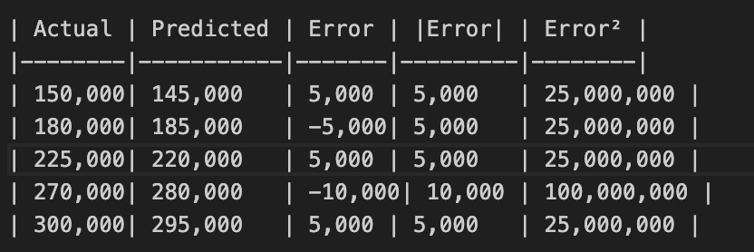

SET - A 
Register No                 
 
SRM INSTITUTE OF SCIENCE AND TECHNOLOGY                                            
  21CSC555 J - MACHINE LEARNING  ALGORITHM  
CYCLE TEST – I  
 
Program Offered: M. Tech -AI&DS     Year / Semester: I  / I 
Max. Marks: 50         Duration: 2hr 30 Mins  
Course Code: 21CSC555 J                           Date of Exam: 26/10/2024  
 
 
Part A (2 x 20 = 40 marks)  
Answer a ny two questions  
 
 
**QUESTION 1**
 
**(i). Explain simple linear regression using an example dataset, along with a detailed breakdown of the mathematical calculations involved in deriving the equation? (10 marks)**

**ANSWER:**

**Simple Linear Regression Overview:**
Simple Linear Regression establishes a linear relationship between a dependent variable (target) and one independent variable (predictor). The goal is to find the best-fitting line through data points that minimizes prediction errors.

**Mathematical Model:**
y = β₀ + β₁x + ε

Where:
- y = dependent variable (target)  
- x = independent variable (predictor)
- β₀ = y-intercept (constant term)
- β₁ = slope coefficient  
- ε = error term (residual)

**Example Dataset: House Price Prediction**
Let's predict house prices based on house size (square feet).

| House Size (x) | Price (y) |
|----------------|-----------|
| 1000           | 150,000   |
| 1200           | 180,000   |
| 1500           | 225,000   |
| 1800           | 270,000   |
| 2000           | 300,000   |

**Step-by-Step Mathematical Calculations:**

**Step 1: Calculate Basic Statistics**
```
n = 5 (number of data points)

Σx = 1000 + 1200 + 1500 + 1800 + 2000 = 7500
Σy = 150000 + 180000 + 225000 + 270000 + 300000 = 1,125,000

x̄ = Σx/n = 7500/5 = 1500
ȳ = Σy/n = 1,125,000/5 = 225,000
```

**Step 2: Calculate Required Sums**
```
Σ(x - x̄)² = (1000-1500)² + (1200-1500)² + ... + (2000-1500)²
           = 250000 + 90000 + 0 + 90000 + 250000 = 680,000

Σ(x - x̄)(y - ȳ) = (1000-1500)(150000-225000) + ... + (2000-1500)(300000-225000)
                 = (-500)(-75000) + (-300)(-45000) + (0)(0) + (300)(45000) + (500)(75000)
                 = 37500000 + 13500000 + 0 + 13500000 + 37500000 = 102,000,000
```

**Step 3: Calculate Slope (β₁)**
Using the least squares formula:
```
β₁ = Σ(x - x̄)(y - ȳ) / Σ(x - x̄)²
β₁ = 102,000,000 / 680,000 = 150

Interpretation: For every additional square foot, house price increases by $150
```

**Step 4: Calculate Intercept (β₀)**
```
β₀ = ȳ - β₁x̄
β₀ = 225,000 - 150 × 1500 = 225,000 - 225,000 = 0

Interpretation: When house size is 0, predicted price is $0 (makes logical sense)
```

**Step 5: Final Regression Equation**
```
ŷ = 0 + 150x = 150x

Or: Predicted Price = 150 × House Size
```

**Step 6: Prediction Examples**
```
For x = 1300 sq ft: ŷ = 150 × 1300 = $195,000
For x = 2200 sq ft: ŷ = 150 × 2200 = $330,000
```

**Step 7: Calculate R-squared (Goodness of Fit)**
```
SST (Total Sum of Squares) = Σ(y - ȳ)²
SST = (150000-225000)² + ... + (300000-225000)² = 22,500,000,000

SSR (Regression Sum of Squares) = Σ(ŷ - ȳ)²
For our predictions: ŷ₁ = 150000, ŷ₂ = 180000, etc.
SSR = 15,300,000,000

R² = SSR/SST = 15,300,000,000/22,500,000,000 = 0.68

Interpretation: 68% of variance in house prices is explained by house size
```

**(ii). What are the evaluation metrics that are used for regression in Machine Learning? Explain Mean Absolute Error (MAE) and Mean Squared Error (MSE)? (5 marks)**

**ANSWER:**

**Regression Evaluation Metrics Overview:**
Regression metrics measure how well our model predicts continuous target values. Key metrics include:

**1. Mean Absolute Error (MAE)**
**2. Mean Squared Error (MSE)**  
**3. Root Mean Squared Error (RMSE)**
**4. R-squared (R²)**
**5. Mean Absolute Percentage Error (MAPE)**
**6. Adjusted R-squared**

**Detailed Explanation of MAE and MSE:**

**Mean Absolute Error (MAE):**

**Formula:** MAE = (1/n) Σ|yᵢ - ŷᵢ|

**Step-by-Step Calculation:**
Using our house price example:

| Actual (y) | Predicted (ŷ) | |y - ŷ| |
|------------|---------------|--------|
| 150,000    | 150,000       | 0      |
| 180,000    | 180,000       | 0      |
| 225,000    | 225,000       | 0      |
| 270,000    | 270,000       | 0      |
| 300,000    | 300,000       | 0      |

```
MAE = (0 + 0 + 0 + 0 + 0)/5 = 0
```

**MAE Characteristics:**
- **Units:** Same as target variable (dollars in this case)
- **Range:** 0 to ∞ (lower is better)
- **Robustness:** Less sensitive to outliers
- **Interpretation:** Average absolute prediction error
- **Business Meaning:** "On average, our predictions are off by $X"

**Mean Squared Error (MSE):**

**Formula:** MSE = (1/n) Σ(yᵢ - ŷᵢ)²

**Step-by-Step Calculation:**
| Actual (y) | Predicted (ŷ) | (y - ŷ)² |
|------------|---------------|----------|
| 150,000    | 150,000       | 0        |
| 180,000    | 180,000       | 0        |
| 225,000    | 225,000       | 0        |
| 270,000    | 270,000       | 0        |
| 300,000    | 300,000       | 0        |

```
MSE = (0 + 0 + 0 + 0 + 0)/5 = 0
```

**MSE Characteristics:**
- **Units:** Squared units of target variable
- **Range:** 0 to ∞ (lower is better)
- **Sensitivity:** Heavily penalizes large errors (quadratic penalty)
- **Mathematical Properties:** Differentiable, commonly used in optimization
- **Outlier Impact:** More sensitive to outliers than MAE

**Comparison: MAE vs MSE**

| Aspect | MAE | MSE |
|--------|-----|-----|
| **Outlier Sensitivity** | Low | High |
| **Units** | Original scale | Squared scale |
| **Optimization** | Linear penalty | Quadratic penalty |
| **Interpretation** | More intuitive | Less intuitive |
| **Use Case** | When outliers less important | When large errors critical |

**Practical Example with Imperfect Predictions:**
Suppose our model made these predictions:

| Actual | Predicted | Error | |Error| | Error² |
|--------|-----------|-------|---------|--------|
| 150,000| 145,000   | 5,000 | 5,000   | 25,000,000 |
| 180,000| 185,000   | -5,000| 5,000   | 25,000,000 |
| 225,000| 220,000   | 5,000 | 5,000   | 25,000,000 |
| 270,000| 280,000   | -10,000| 10,000 | 100,000,000 |
| 300,000| 295,000   | 5,000 | 5,000   | 25,000,000 |



```
MAE = (5,000 + 5,000 + 5,000 + 10,000 + 5,000)/5 = 6,000
MSE = (25,000,000 + 25,000,000 + 25,000,000 + 100,000,000 + 25,000,000)/5 = 40,000,000
RMSE = √MSE = √40,000,000 ≈ 6,325
```

**Interpretation:**
- **MAE = $6,000:** On average, predictions are off by $6,000
- **MSE = 40,000,000:** Harder to interpret due to squared units
- **RMSE = $6,325:** Similar to MAE but penalizes large errors more

**(iii). Explain the concept of Overfitting and Underfitting? (5 marks)**

**ANSWER:**

**Overfitting and Underfitting Overview:**
These are two fundamental problems in machine learning that relate to a model's ability to generalize from training data to unseen data.

**UNDERFITTING:**

**Definition:** 
Underfitting occurs when a model is too simple to capture the underlying patterns in the data, resulting in poor performance on both training and test data.

**Characteristics:**
- **High Bias, Low Variance**
- **Poor training performance**
- **Poor test performance**
- **Model is too simple**

**Visual Example:**
```
Data: Quadratic relationship y = x² + noise
Underfit Model: y = β₀ (horizontal line)

Actual data points: curved pattern
Model prediction: straight horizontal line
Result: Cannot capture the curve, high error everywhere
```

**Mathematical Example:**
```
True relationship: Price = 100 + 50×Size + 0.1×Size² + error
Underfit model: Price = 200 (constant)

Training error: High (cannot explain any variance)
Test error: High (poor generalization)
```

**Causes of Underfitting:**
1. **Model too simple:** Linear model for non-linear data
2. **Insufficient features:** Missing important variables
3. **Over-regularization:** Too much penalty on complexity
4. **Insufficient training:** Stopping too early

**Solutions for Underfitting:**
1. **Increase model complexity:** Add polynomial terms
2. **Add more features:** Include relevant variables
3. **Reduce regularization:** Lower penalty parameters
4. **Train longer:** More iterations/epochs

**OVERFITTING:**

**Definition:**
Overfitting occurs when a model learns the training data too well, including noise and random fluctuations, leading to poor generalization to new data.

**Characteristics:**
- **Low Bias, High Variance**
- **Excellent training performance**
- **Poor test performance**
- **Model is too complex**

**Visual Example:**
```
Data: Simple linear trend with noise
Overfit Model: High-degree polynomial passing through every point

Training data: Perfect fit (zero error)
Test data: Wild oscillations, poor predictions
```

**Mathematical Example:**
```
Training Data (5 points): Perfect 10th-degree polynomial fit
Training Error: 0 (perfect fit)
Test Error: Very high (model memorized noise)

Model: Price = β₀ + β₁×Size + β₂×Size² + ... + β₁₀×Size¹⁰
```

**Detailed Overfitting Process:**
1. **Initial Learning:** Model captures true patterns
2. **Continued Learning:** Model starts memorizing noise
3. **Over-Learning:** Model fits random fluctuations
4. **Result:** Perfect training fit, poor test performance

**Causes of Overfitting:**
1. **Model too complex:** Too many parameters relative to data
2. **Insufficient data:** Not enough examples to learn general patterns
3. **Training too long:** Model memorizes training examples
4. **No regularization:** No penalty for complexity

**Solutions for Overfitting:**
1. **Regularization:** Add L1/L2 penalties
2. **Cross-validation:** Use validation set for model selection
3. **Early stopping:** Stop training when validation error increases
4. **More data:** Collect additional training examples
5. **Feature selection:** Remove irrelevant features
6. **Simpler models:** Reduce model complexity

**Comparison Table:**

| Aspect | Underfitting | Good Fit | Overfitting |
|--------|--------------|----------|-------------|
| **Training Error** | High | Moderate | Very Low |
| **Test Error** | High | Moderate | High |
| **Model Complexity** | Too Simple | Just Right | Too Complex |
| **Bias** | High | Balanced | Low |
| **Variance** | Low | Balanced | High |
| **Generalization** | Poor | Good | Poor |

**Bias-Variance Tradeoff:**
```
Total Error = Bias² + Variance + Irreducible Error

Underfitting: High Bias, Low Variance
Overfitting: Low Bias, High Variance
Optimal: Balanced Bias and Variance
```

**Practical Detection Methods:**

**Learning Curves:**
- **Underfitting:** Both training and validation error high and close
- **Overfitting:** Large gap between training and validation error
- **Good Fit:** Small gap, both errors reasonably low

**Cross-Validation:**
- **Underfitting:** Consistently poor performance across all folds
- **Overfitting:** High variance in performance across folds
- **Good Fit:** Consistent, reasonable performance

**QUESTION 2**

**(i). What is Logistic Regression? How you will convert the line equation into Sigmoid curve? (5 marks)**

**ANSWER:**

**Logistic Regression Overview:**
Logistic Regression is a statistical method used for binary classification problems. Unlike linear regression that predicts continuous values, logistic regression predicts probabilities that an instance belongs to a particular class (0 or 1).

**Key Differences from Linear Regression:**
- **Linear Regression:** Predicts continuous values (-∞ to +∞)
- **Logistic Regression:** Predicts probabilities (0 to 1)

**Mathematical Foundation:**

**Step 1: Start with Linear Equation**
In linear regression: **y = β₀ + β₁x₁ + β₂x₂ + ... + βₙxₙ**

**Problem:** Linear equation can produce values outside [0,1] range
- If prediction = -2 → Invalid probability
- If prediction = 1.5 → Invalid probability

**Step 2: Introduce Odds Concept**
**Odds = P(success) / P(failure) = p / (1-p)**

Where p = probability of success

**Properties of Odds:**
- Range: 0 to +∞
- Odds = 1 → Equal probability (50-50)
- Odds > 1 → Success more likely
- Odds < 1 → Failure more likely

**Step 3: Log-Odds (Logit) Transformation**
**Log-odds = ln(p/(1-p)) = β₀ + β₁x₁ + β₂x₂ + ... + βₙxₙ**

**Why Log-Odds?**
- Range: -∞ to +∞ (matches linear equation range)
- Linear relationship with predictors
- Mathematically convenient

**Step 4: Convert to Sigmoid Function**
Starting from: **ln(p/(1-p)) = β₀ + β₁x₁ + ... + βₙxₙ**

**Mathematical Derivation:**
```
Let z = β₀ + β₁x₁ + ... + βₙxₙ

ln(p/(1-p)) = z

Taking exponential of both sides:
p/(1-p) = e^z

Cross multiply:
p = (1-p) × e^z
p = e^z - p × e^z
p + p × e^z = e^z
p(1 + e^z) = e^z
p = e^z/(1 + e^z)

Multiply numerator and denominator by e^(-z):
p = 1/(1 + e^(-z))
```

**Final Sigmoid Function:**
**σ(z) = 1/(1 + e^(-z))**

Where **z = β₀ + β₁x₁ + β₂x₂ + ... + βₙxₙ**

**Sigmoid Function Properties:**

**1. Range:** (0, 1) - Perfect for probabilities
**2. S-shaped curve:** Smooth transition from 0 to 1
**3. Derivative:** σ'(z) = σ(z)(1 - σ(z)) - Convenient for optimization
**4. Monotonic:** Always increasing
**5. Asymptotic:** Approaches 0 as z → -∞, approaches 1 as z → +∞

**Numerical Example:**
Consider email spam detection with one feature (word count):
**z = -2 + 0.5 × word_count**

| Word Count | z | e^(-z) | σ(z) = 1/(1+e^(-z)) | Interpretation |
|------------|---|--------|---------------------|----------------|
| 0 | -2 | 7.39 | 0.12 | 12% spam probability |
| 2 | -1 | 2.72 | 0.27 | 27% spam probability |
| 4 | 0 | 1 | 0.50 | 50% spam probability |
| 6 | 1 | 0.37 | 0.73 | 73% spam probability |
| 8 | 2 | 0.14 | 0.88 | 88% spam probability |

**Conversion Process Summary:**
1. **Linear equation** → Can produce any real number
2. **Take odds** → Convert probability to odds ratio (0 to ∞)
3. **Take log-odds** → Convert to logit (-∞ to ∞)
4. **Apply sigmoid** → Convert back to probability (0 to 1)

**(ii). How you will handle more than two class using Logistic regression? Explain with example? (10 marks)**

**ANSWER:**

**Multi-class Classification Challenge:**
Standard logistic regression handles binary classification (2 classes). For multiple classes, we need extension strategies.

**Three Main Approaches:**

**1. ONE-VS-REST (One-vs-All) APPROACH**

**Concept:**
- Create K binary classifiers for K classes
- Each classifier distinguishes one class vs all others
- Final prediction: class with highest probability

**Step-by-Step Process:**

**Example: Email Classification (3 classes)**
Classes: Spam, Work, Personal

**Step 1: Create Binary Classifiers**
- **Classifier 1:** Spam vs (Work + Personal)
- **Classifier 2:** Work vs (Spam + Personal)  
- **Classifier 3:** Personal vs (Spam + Work)

**Step 2: Training Data Transformation**
Original data:
| Email | Features | Class |
|-------|----------|-------|
| E1 | [x₁, x₂] | Spam |
| E2 | [x₃, x₄] | Work |
| E3 | [x₅, x₆] | Personal |

**For Classifier 1 (Spam vs Others):**
| Email | Features | Binary Label |
|-------|----------|--------------|
| E1 | [x₁, x₂] | 1 (Spam) |
| E2 | [x₃, x₄] | 0 (Not Spam) |
| E3 | [x₅, x₆] | 0 (Not Spam) |

**For Classifier 2 (Work vs Others):**
| Email | Features | Binary Label |
|-------|----------|--------------|
| E1 | [x₁, x₂] | 0 (Not Work) |
| E2 | [x₃, x₄] | 1 (Work) |
| E3 | [x₅, x₆] | 0 (Not Work) |

**For Classifier 3 (Personal vs Others):**
| Email | Features | Binary Label |
|-------|----------|--------------|
| E1 | [x₁, x₂] | 0 (Not Personal) |
| E2 | [x₃, x₄] | 0 (Not Personal) |
| E3 | [x₅, x₆] | 1 (Personal) |

**Step 3: Prediction Process**
For new email with features [x_new]:

```
P(Spam|x_new) = σ(β₀¹ + β₁¹x_new) = 0.7
P(Work|x_new) = σ(β₀² + β₁²x_new) = 0.3  
P(Personal|x_new) = σ(β₀³ + β₁³x_new) = 0.2

Prediction: Spam (highest probability)
```

**Advantages:**
- Simple to implement
- Can use any binary classifier
- Interpretable individual classifiers

**Disadvantages:**
- Probabilities don't sum to 1
- Imbalanced training data for each classifier
- Doesn't model class relationships

**2. ONE-VS-ONE APPROACH**

**Concept:**
- Create classifier for each pair of classes
- For K classes: K(K-1)/2 classifiers
- Final prediction: majority voting

**Example: Same Email Classification**

**Step 1: Create Pairwise Classifiers**
- **Classifier A:** Spam vs Work
- **Classifier B:** Spam vs Personal
- **Classifier C:** Work vs Personal

**Step 2: Training**
**Classifier A (Spam vs Work):**
Only use emails labeled as Spam or Work (ignore Personal emails)

**Step 3: Prediction**
For new email:
```
Classifier A: Spam vs Work → Predicts Spam
Classifier B: Spam vs Personal → Predicts Spam  
Classifier C: Work vs Personal → Predicts Work

Vote Count:
Spam: 2 votes
Work: 1 vote
Personal: 0 votes

Final Prediction: Spam
```

**Advantages:**
- Balanced training data
- Better for small datasets
- Less affected by outliers

**Disadvantages:**
- Computationally expensive: O(K²) classifiers
- Ambiguous predictions possible
- Doesn't provide probability estimates

**3. MULTINOMIAL LOGISTIC REGRESSION (Softmax)**

**Concept:**
- Direct extension to multiple classes
- Uses softmax function instead of sigmoid
- Probabilities sum to 1

**Mathematical Formulation:**
For K classes and features x:

**Linear Combination for each class:**
```
z₁ = β₀¹ + β₁¹x₁ + β₂¹x₂ + ... + βₙ¹xₙ
z₂ = β₀² + β₁²x₁ + β₂²x₂ + ... + βₙ²xₙ
...
zₖ = β₀ᵏ + β₁ᵏx₁ + β₂ᵏx₂ + ... + βₙᵏxₙ
```

**Softmax Function:**
```
P(Class = i|x) = e^(zᵢ) / Σⱼ₌₁ᵏ e^(zⱼ)
```

**Detailed Example:**
Email with features: [word_count=5, exclamation=2]

**Class Parameters:**
- **Spam:** β₀¹=-1, β₁¹=0.3, β₂¹=0.8
- **Work:** β₀²=0.5, β₁²=0.1, β₂²=-0.2
- **Personal:** β₀³=0.2, β₁³=0.2, β₂³=0.1

**Step 1: Calculate z values**
```
z₁ = -1 + 0.3×5 + 0.8×2 = -1 + 1.5 + 1.6 = 2.1
z₂ = 0.5 + 0.1×5 + (-0.2)×2 = 0.5 + 0.5 - 0.4 = 0.6
z₃ = 0.2 + 0.2×5 + 0.1×2 = 0.2 + 1.0 + 0.2 = 1.4
```

**Step 2: Calculate exponentials**
```
e^(z₁) = e^(2.1) ≈ 8.17
e^(z₂) = e^(0.6) ≈ 1.82
e^(z₃) = e^(1.4) ≈ 4.06

Sum = 8.17 + 1.82 + 4.06 = 14.05
```

**Step 3: Calculate probabilities**
```
P(Spam) = 8.17/14.05 ≈ 0.58
P(Work) = 1.82/14.05 ≈ 0.13
P(Personal) = 4.06/14.05 ≈ 0.29

Verification: 0.58 + 0.13 + 0.29 = 1.00 ✓

Prediction: Spam (highest probability)
```

**Advantages:**
- Probabilities sum to 1
- Direct multi-class approach
- Single unified model
- Efficient training

**Disadvantages:**
- More complex optimization
- Can be sensitive to outliers
- Requires more data for stable estimates

**Comparison Summary:**

| Approach | Classifiers Needed | Probability Sum | Complexity | Best Use Case |
|----------|-------------------|-----------------|------------|---------------|
| One-vs-Rest | K | No | Low | Large datasets |
| One-vs-One | K(K-1)/2 | No | High | Small datasets |
| Multinomial | 1 | Yes | Medium | Balanced classes |

**(iii). What is Regularization and explain different types of it? (5 marks)**

**ANSWER:**

**Regularization Overview:**
Regularization is a technique used to prevent overfitting by adding a penalty term to the cost function. It constrains or shrinks model parameters, reducing model complexity and improving generalization.

**Why Regularization is Needed:**

**Overfitting Problem:**
- Complex models memorize training data
- Poor generalization to new data
- High variance in predictions

**Without Regularization:**
```
Cost Function: J(θ) = (1/2m) Σ(hθ(x⁽ⁱ⁾) - y⁽ⁱ⁾)²
Result: May lead to very large parameter values
```

**With Regularization:**
```
Regularized Cost: J(θ) = Original Cost + λ × Penalty Term
Result: Smaller, more stable parameter values
```

**TYPES OF REGULARIZATION:**

**1. L1 REGULARIZATION (Lasso - Least Absolute Shrinkage and Selection Operator)**

**Mathematical Formula:**
```
J(θ) = (1/2m) Σ(hθ(x⁽ⁱ⁾) - y⁽ⁱ⁾)² + λ Σ|θⱼ|
                 ↑                      ↑
           Original Cost            L1 Penalty
```

**Key Characteristics:**

**Penalty Term:** Sum of absolute values of parameters
**Effect:** Shrinks parameters toward zero, can make some exactly zero
**Feature Selection:** Automatically removes irrelevant features
**Sparsity:** Creates sparse models (many zero coefficients)

**Detailed Example:**
Consider linear regression with 3 features:
```
Original: y = 2x₁ + 0.1x₂ + 0.05x₃
Without regularization: All coefficients retained

With L1 (λ=0.1): y = 1.8x₁ + 0x₂ + 0x₃
L1 Effect: Sets small coefficients to zero (automatic feature selection)
```

**Geometric Interpretation:**
- L1 constraint region: Diamond shape
- Solution often occurs at corners (where parameters = 0)
- Sparse solutions naturally emerge

**Advantages:**
- **Feature Selection:** Automatically identifies important features
- **Interpretability:** Simpler models with fewer variables
- **Storage:** Sparse models require less memory

**Disadvantages:**
- **Group Effect:** If features are correlated, L1 picks one arbitrarily
- **Prediction:** May sacrifice some accuracy for sparsity
- **Instability:** Small data changes can lead to different feature selection

**2. L2 REGULARIZATION (Ridge Regression)**

**Mathematical Formula:**
```
J(θ) = (1/2m) Σ(hθ(x⁽ⁱ⁾) - y⁽ⁱ⁾)² + λ Σθⱼ²
                 ↑                      ↑
           Original Cost            L2 Penalty
```

**Key Characteristics:**

**Penalty Term:** Sum of squared parameter values
**Effect:** Shrinks parameters toward zero, but never exactly zero
**Shrinkage:** Proportional shrinkage of all coefficients
**Stability:** More stable than L1 with correlated features

**Detailed Example:**
```
Original: y = 2x₁ + 0.1x₂ + 0.05x₃
Without regularization: θ = [2, 0.1, 0.05]

With L2 (λ=0.1): θ = [1.6, 0.08, 0.04]
L2 Effect: Shrinks all coefficients proportionally, none become zero
```

**Mathematical Insight:**
```
Ridge Solution: θ̂ = (X'X + λI)⁻¹X'y
Effect of λ:
- λ = 0: Standard least squares
- λ → ∞: All coefficients → 0
- Optimal λ: Balances bias and variance
```

**Geometric Interpretation:**
- L2 constraint region: Circular shape
- Solution occurs where elliptical contours touch circle
- Smooth shrinkage of all parameters

**Advantages:**
- **Stability:** Handles multicollinearity well
- **Computational:** Has closed-form solution
- **Grouping:** Keeps correlated features together
- **Smoothness:** Continuous shrinkage

**Disadvantages:**
- **No Feature Selection:** Doesn't eliminate features
- **Interpretation:** All features remain in model
- **Storage:** Model retains all features

**3. ELASTIC NET REGULARIZATION**

**Mathematical Formula:**
```
J(θ) = (1/2m) Σ(hθ(x⁽ⁱ⁾) - y⁽ⁱ⁾)² + λ₁ Σ|θⱼ| + λ₂ Σθⱼ²
                 ↑                  ↑        ↑
           Original Cost        L1 Penalty  L2 Penalty
```

**Alternative Parameterization:**
```
J(θ) = Original Cost + λ[α Σ|θⱼ| + (1-α) Σθⱼ²]

Where:
- λ: Overall regularization strength
- α ∈ [0,1]: Mixing parameter
- α = 1: Pure L1 (Lasso)
- α = 0: Pure L2 (Ridge)
- α = 0.5: Equal L1 and L2
```

**Key Characteristics:**

**Best of Both Worlds:**
- Feature selection from L1
- Stability from L2
- Handles grouped variables better than L1 alone

**Detailed Example:**
```
Dataset: 1000 features, 500 samples, correlated feature groups

L1 alone: Randomly selects one feature from each group
L2 alone: Keeps all features, no selection
Elastic Net: Selects groups of correlated features together

Result with α=0.5, λ=0.1:
- Eliminates irrelevant features (L1 effect)
- Keeps correlated relevant features together (L2 effect)
```

**COMPARISON TABLE:**

| Aspect | L1 (Lasso) | L2 (Ridge) | Elastic Net |
|--------|------------|------------|-------------|
| **Feature Selection** | Yes | No | Yes |
| **Sparsity** | High | None | Moderate |
| **Correlated Features** | Picks One | Keeps All | Groups Together |
| **Stability** | Low | High | Medium |
| **Interpretability** | High | Medium | Medium |
| **Computational Cost** | Medium | Low | High |
| **Parameters to Tune** | 1 (λ) | 1 (λ) | 2 (λ, α) |

**Hyperparameter Selection:**

**Cross-Validation Approach:**
```
1. Define parameter grid:
   λ values: [0.001, 0.01, 0.1, 1, 10, 100]
   α values: [0, 0.1, 0.5, 0.7, 0.9, 1] (for Elastic Net)

2. For each combination:
   - Train model with regularization
   - Evaluate on validation set
   - Record performance

3. Select parameters with best validation performance

4. Retrain on full training set with selected parameters
```

**Practical Guidelines:**

**When to Use L1:**
- Many features, expect few to be relevant
- Need interpretable models
- Feature selection is primary goal

**When to Use L2:**
- All features potentially relevant
- Correlated features present
- Stability more important than sparsity

**When to Use Elastic Net:**
- Large number of features
- Groups of correlated features
- Need both selection and stability

**QUESTION 3**

**(i). Explain in detail about Cross validation and its types? (10 marks)**

**ANSWER:**

**Cross-Validation Overview:**
Cross-validation is a statistical technique used to evaluate machine learning models by partitioning data into complementary subsets, training on one subset and validating on another. It provides more reliable estimates of model performance than a single train-test split.

**Why Cross-Validation is Important:**

**Problems with Single Train-Test Split:**
- **High Variance:** Performance depends heavily on random split
- **Data Waste:** Some data never used for training
- **Overfitting Risk:** May tune hyperparameters to specific test set
- **Unreliable Estimates:** Single performance score may be misleading

**Cross-Validation Benefits:**
- **Reduced Variance:** Multiple performance estimates
- **Better Data Utilization:** All data used for both training and validation
- **Robust Model Selection:** More reliable hyperparameter tuning
- **Confidence Intervals:** Statistical significance of results

**TYPES OF CROSS-VALIDATION:**

**1. K-FOLD CROSS-VALIDATION**

**Concept:**
Divide dataset into K equal-sized folds. Train on K-1 folds, test on remaining fold. Repeat K times.

**Step-by-Step Process:**

**Example: 5-Fold Cross-Validation with 1000 samples**

**Step 1: Data Partitioning**
```
Original Dataset: 1000 samples
Fold 1: Samples 1-200    (20%)
Fold 2: Samples 201-400  (20%)
Fold 3: Samples 401-600  (20%)
Fold 4: Samples 601-800  (20%)
Fold 5: Samples 801-1000 (20%)
```

**Step 2: Training and Validation Iterations**

**Iteration 1:**
- Training: Folds 2,3,4,5 (800 samples)
- Validation: Fold 1 (200 samples)
- Score: Accuracy₁ = 0.85

**Iteration 2:**
- Training: Folds 1,3,4,5 (800 samples)
- Validation: Fold 2 (200 samples)
- Score: Accuracy₂ = 0.87

**Iteration 3:**
- Training: Folds 1,2,4,5 (800 samples)
- Validation: Fold 3 (200 samples)
- Score: Accuracy₃ = 0.83

**Iteration 4:**
- Training: Folds 1,2,3,5 (800 samples)
- Validation: Fold 4 (200 samples)
- Score: Accuracy₄ = 0.89

**Iteration 5:**
- Training: Folds 1,2,3,4 (800 samples)
- Validation: Fold 5 (200 samples)
- Score: Accuracy₅ = 0.86

**Step 3: Final Performance Calculation**
```
CV Score = (0.85 + 0.87 + 0.83 + 0.89 + 0.86) / 5 = 0.86
Standard Deviation = 0.02
95% Confidence Interval: 0.86 ± 1.96 × (0.02/√5) = [0.84, 0.88]
```

**Advantages:**
- **Balanced:** Each sample appears in validation exactly once
- **Efficient:** Uses all data for both training and validation
- **Standard:** Most commonly used method
- **Stable:** Reduces variance compared to single split

**Disadvantages:**
- **Computational Cost:** K times more expensive than single split
- **Time Dependency:** May not preserve temporal order
- **Class Imbalance:** May not maintain class distribution

**Choosing K Value:**
- **K=5 or K=10:** Most common choices
- **Small K:** Less computational cost, higher bias, lower variance
- **Large K:** More computational cost, lower bias, higher variance
- **K=n (LOOCV):** Maximum data usage, highest computational cost

**2. STRATIFIED K-FOLD CROSS-VALIDATION**

**Concept:**
Ensures each fold maintains the same class distribution as the original dataset. Critical for imbalanced datasets.

**Example: Binary Classification with Imbalanced Data**

**Original Dataset:**
- Total: 1000 samples
- Class A: 800 samples (80%)
- Class B: 200 samples (20%)

**Regular K-Fold Problem:**
```
Fold 1: 150 Class A, 50 Class B (75% A, 25% B) - Different distribution!
Fold 2: 170 Class A, 30 Class B (85% A, 15% B) - Different distribution!
```

**Stratified K-Fold Solution:**
```
Each fold maintains 80% Class A, 20% Class B:
Fold 1: 160 Class A, 40 Class B (80% A, 20% B) ✓
Fold 2: 160 Class A, 40 Class B (80% A, 20% B) ✓
Fold 3: 160 Class A, 40 Class B (80% A, 20% B) ✓
Fold 4: 160 Class A, 40 Class B (80% A, 20% B) ✓
Fold 5: 160 Class A, 40 Class B (80% A, 20% B) ✓
```

**Implementation Steps:**
1. **Sort samples by class**
2. **Divide each class into K equal parts**
3. **Combine parts to form balanced folds**
4. **Proceed with regular K-fold process**

**3. LEAVE-ONE-OUT CROSS-VALIDATION (LOOCV)**

**Concept:**
Special case where K = n (number of samples). Each iteration uses n-1 samples for training and 1 sample for validation.

**Example: Dataset with 100 samples**
```
Iteration 1: Train on samples 2-100, test on sample 1
Iteration 2: Train on samples 1,3-100, test on sample 2
...
Iteration 100: Train on samples 1-99, test on sample 100

Final Score: Average of 100 individual predictions
```

**Mathematical Formula:**
```
LOOCV Score = (1/n) Σᵢ₌₁ⁿ L(yᵢ, ŷ₍₋ᵢ₎)

Where ŷ₍₋ᵢ₎ is prediction for sample i using model trained without sample i
```

**Advantages:**
- **Maximum Data Usage:** Uses n-1 samples for training
- **Deterministic:** No randomness in splits
- **Unbiased:** Nearly unbiased estimate of generalization error
- **No Overlap:** Each test set contains exactly one sample

**Disadvantages:**
- **Computational Cost:** Requires n model trainings
- **High Variance:** Each test set is tiny (1 sample)
- **Impractical:** Too expensive for large datasets
- **Statistical Power:** Low power for detecting model differences

**4. TIME SERIES CROSS-VALIDATION**

**Concept:**
Respects temporal order of data. Training always uses past data to predict future data.

**Forward Chaining (Walk-Forward Validation):**

**Example: Monthly Sales Data (12 months)**
```
Iteration 1: Train on months 1-3, test on month 4
Iteration 2: Train on months 1-4, test on month 5
Iteration 3: Train on months 1-5, test on month 6
...
Iteration 8: Train on months 1-10, test on month 11
Iteration 9: Train on months 1-11, test on month 12
```

**Fixed Window Approach:**
```
Window Size = 6 months
Iteration 1: Train on months 1-6, test on month 7
Iteration 2: Train on months 2-7, test on month 8
Iteration 3: Train on months 3-8, test on month 9
...
```

**Why Regular K-Fold Fails for Time Series:**
- **Data Leakage:** Future data used to predict past
- **Violated Assumptions:** Time dependencies ignored
- **Unrealistic:** In practice, future data unavailable

**5. GROUP K-FOLD CROSS-VALIDATION**

**Concept:**
Ensures samples from the same group don't appear in both training and validation sets.

**Example: Medical Study with Multiple Patients**
```
Patient A: 5 measurements
Patient B: 3 measurements  
Patient C: 4 measurements
Patient D: 6 measurements

Regular K-Fold Problem:
- Patient A's data might appear in both training and validation
- Model learns patient-specific patterns, not general patterns

Group K-Fold Solution:
Fold 1: Patients A,B (training) vs Patients C,D (validation)
Fold 2: Patients C,D (training) vs Patients A,B (validation)
```

**Applications:**
- **Medical Data:** Multiple measurements per patient
- **Image Recognition:** Multiple images per person
- **Natural Language:** Multiple sentences per document

**CROSS-VALIDATION BEST PRACTICES:**

**1. Choosing the Right Type:**
- **Standard:** K-Fold for balanced datasets
- **Imbalanced:** Stratified K-Fold
- **Time Series:** Time Series CV
- **Grouped Data:** Group K-Fold
- **Small Datasets:** LOOCV (if computationally feasible)

**2. Hyperparameter Tuning:**
```
Nested Cross-Validation:
Outer Loop: Model evaluation (5-fold)
Inner Loop: Hyperparameter tuning (3-fold)

For each outer fold:
  1. Split data into train/validation
  2. Use inner CV on training data to select hyperparameters
  3. Train final model with selected hyperparameters
  4. Evaluate on validation data
```

**3. Statistical Considerations:**
- **Multiple Testing:** Adjust p-values when comparing many models
- **Confidence Intervals:** Report uncertainty in performance estimates
- **Effect Size:** Consider practical significance, not just statistical

**4. Computational Efficiency:**
- **Parallel Processing:** Train folds simultaneously
- **Early Stopping:** Stop if performance clearly inferior
- **Approximate Methods:** Random sampling for very large datasets

**(ii). What are the different performance metrics of a Classification model? Explain Confusion matrix table with example? (5 marks)**

**ANSWER:**

**Classification Performance Metrics Overview:**
Classification metrics evaluate how well a model distinguishes between different classes. Unlike regression metrics, they focus on correct vs incorrect predictions rather than distance from true values.

**CONFUSION MATRIX - FOUNDATION OF CLASSIFICATION METRICS**

**Definition:**
A confusion matrix is a table that describes the performance of a classification model by showing actual vs predicted classifications.

**Binary Classification Confusion Matrix Structure:**

```
                    PREDICTED
                 Positive  Negative
ACTUAL Positive    TP      FN
       Negative    FP      TN
```

**Where:**
- **TP (True Positive):** Correctly predicted positive cases
- **TN (True Negative):** Correctly predicted negative cases  
- **FP (False Positive):** Incorrectly predicted positive (Type I Error)
- **FN (False Negative):** Incorrectly predicted negative (Type II Error)

**DETAILED EXAMPLE: EMAIL SPAM DETECTION**

**Scenario:** Classify 100 emails as Spam (Positive) or Not Spam (Negative)

**Model Predictions vs Actual Results:**

| Email | Actual | Predicted | Result |
|-------|--------|-----------|--------|
| E1 | Spam | Spam | TP |
| E2 | Spam | Not Spam | FN |
| E3 | Not Spam | Spam | FP |
| E4 | Not Spam | Not Spam | TN |
| ... | ... | ... | ... |

**Confusion Matrix for Spam Detection:**

```
                    PREDICTED
                 Spam  Not Spam  Total
ACTUAL   Spam     25      5      30
      Not Spam    10     60      70
         Total    35     65     100
```

**Interpretation:**
- **TP = 25:** Correctly identified 25 spam emails
- **TN = 60:** Correctly identified 60 legitimate emails  
- **FP = 10:** 10 legitimate emails marked as spam (False Alarms)
- **FN = 5:** 5 spam emails missed (Missed Detections)

**DERIVED PERFORMANCE METRICS:**

**1. ACCURACY**
**Formula:** Accuracy = (TP + TN) / (TP + TN + FP + FN)
**Calculation:** (25 + 60) / 100 = 0.85 = 85%
**Interpretation:** 85% of all predictions were correct
**When to Use:** Balanced datasets with equal class importance
**Limitation:** Misleading with imbalanced data

**Example Problem with Accuracy:**
If 95% emails are legitimate, a model predicting "Not Spam" for everything gets 95% accuracy but is useless.

**2. PRECISION (Positive Predictive Value)**
**Formula:** Precision = TP / (TP + FP)
**Calculation:** 25 / (25 + 10) = 25/35 = 0.714 = 71.4%
**Interpretation:** Of emails predicted as spam, 71.4% actually were spam
**Business Meaning:** "When model says spam, how often is it right?"
**Use Case:** When false positives are costly (e.g., medical diagnosis)

**3. RECALL (Sensitivity, True Positive Rate)**
**Formula:** Recall = TP / (TP + FN)  
**Calculation:** 25 / (25 + 5) = 25/30 = 0.833 = 83.3%
**Interpretation:** Model caught 83.3% of actual spam emails
**Business Meaning:** "Of all actual spam, how much did we catch?"
**Use Case:** When false negatives are costly (e.g., disease detection)

**4. SPECIFICITY (True Negative Rate)**
**Formula:** Specificity = TN / (TN + FP)
**Calculation:** 60 / (60 + 10) = 60/70 = 0.857 = 85.7%
**Interpretation:** Model correctly identified 85.7% of legitimate emails
**Business Meaning:** "Of all legitimate emails, how many were correctly classified?"

**5. F1-SCORE**
**Formula:** F1 = 2 × (Precision × Recall) / (Precision + Recall)
**Calculation:** 2 × (0.714 × 0.833) / (0.714 + 0.833) = 2 × 0.595 / 1.547 = 0.769
**Interpretation:** Harmonic mean of precision and recall
**Use Case:** When you need single metric balancing precision and recall
**Range:** 0 to 1 (higher is better)

**MULTI-CLASS CONFUSION MATRIX EXAMPLE:**

**Scenario:** Image Classification (3 classes: Cat, Dog, Bird)
**Dataset:** 90 images total

```
                    PREDICTED
              Cat  Dog  Bird  Total
ACTUAL  Cat    20    3     2    25
        Dog     5   22     1    28  
        Bird    2    4    31    37
        Total  27   29    34    90
```

**Class-Wise Metrics:**

**For Cat Class:**
- **TP = 20, FP = 7 (5+2), FN = 5 (3+2), TN = 58**
- **Precision = 20/27 = 74.1%**
- **Recall = 20/25 = 80.0%**
- **F1-Score = 2×(0.741×0.80)/(0.741+0.80) = 76.9%**

**For Dog Class:**
- **TP = 22, FP = 7 (3+4), FN = 6 (5+1), TN = 55**
- **Precision = 22/29 = 75.9%**
- **Recall = 22/28 = 78.6%**
- **F1-Score = 77.2%**

**For Bird Class:**
- **TP = 31, FP = 3 (2+1), FN = 6 (2+4), TN = 50**
- **Precision = 31/34 = 91.2%**
- **Recall = 31/37 = 83.8%**
- **F1-Score = 87.3%**

**Overall Metrics:**
- **Accuracy = (20+22+31)/90 = 81.1%**
- **Macro-Average F1 = (76.9+77.2+87.3)/3 = 80.5%**
- **Weighted-Average F1 = (76.9×25 + 77.2×28 + 87.3×37)/90 = 80.8%**

**ADDITIONAL CLASSIFICATION METRICS:**

**6. ROC-AUC (Receiver Operating Characteristic - Area Under Curve)**
- **Purpose:** Measures model's ability to distinguish between classes
- **Range:** 0.5 (random) to 1.0 (perfect)
- **Advantage:** Threshold-independent metric
- **Use:** Binary classification with probability outputs

**7. COHEN'S KAPPA**
- **Purpose:** Agreement between predicted and actual, accounting for chance
- **Formula:** κ = (Observed Agreement - Expected Agreement) / (1 - Expected Agreement)
- **Range:** -1 to 1 (>0.8 = excellent agreement)

**METRIC SELECTION GUIDELINES:**

| Scenario | Best Metric | Reason |
|----------|-------------|---------|
| Balanced Classes | Accuracy | Simple and intuitive |
| Imbalanced Classes | F1-Score, AUC | Accounts for class distribution |
| Cost-Sensitive (FP costly) | Precision | Minimizes false alarms |
| Cost-Sensitive (FN costly) | Recall | Minimizes missed cases |
| Ranking/Probability | AUC | Threshold-independent |
| Multi-class | Macro/Weighted F1 | Balances all classes |

**(iii). What is loss function, explain how Gradient descent helps to Minimize the loss? (5 marks)**

**ANSWER:**

**Loss Function Overview:**
A loss function (also called cost function or objective function) quantifies how well a machine learning model performs by measuring the difference between predicted and actual values. It provides a single numerical value that the algorithm tries to minimize during training.

**Purpose of Loss Functions:**
- **Quantify Error:** Convert prediction mistakes into numerical values
- **Guide Learning:** Provide direction for parameter updates
- **Compare Models:** Enable model selection and comparison
- **Optimization Target:** Define what the algorithm should minimize

**TYPES OF LOSS FUNCTIONS:**

**1. REGRESSION LOSS FUNCTIONS:**

**Mean Squared Error (MSE):**
```
L(y, ŷ) = (1/n) Σ(yᵢ - ŷᵢ)²

Example:
Actual: [10, 20, 30]
Predicted: [12, 18, 32]
Errors: [2, -2, 2]
Squared Errors: [4, 4, 4]
MSE = (4 + 4 + 4)/3 = 4
```

**2. CLASSIFICATION LOSS FUNCTIONS:**

**Cross-Entropy Loss (Logistic Loss):**
```
Binary: L(y, ŷ) = -[y log(ŷ) + (1-y) log(1-ŷ)]
Multi-class: L(y, ŷ) = -Σ yᵢ log(ŷᵢ)

Example (Binary):
Actual: 1 (positive class)
Predicted Probability: 0.8
Loss = -[1×log(0.8) + 0×log(0.2)] = -log(0.8) = 0.223
```

**GRADIENT DESCENT FOR LOSS MINIMIZATION:**

**Core Concept:**
Gradient descent is an iterative optimization algorithm that finds the minimum of a loss function by following the direction of steepest descent (negative gradient).

**Mathematical Foundation:**

**Gradient:** Vector of partial derivatives showing direction of steepest increase
```
∇L(θ) = [∂L/∂θ₁, ∂L/∂θ₂, ..., ∂L/∂θₙ]
```

**Parameter Update Rule:**
```
θ_new = θ_old - α × ∇L(θ_old)

Where:
- θ: Model parameters (weights/coefficients)
- α: Learning rate (step size)
- ∇L(θ): Gradient of loss function
```

**DETAILED GRADIENT DESCENT EXAMPLE:**

**Problem:** Linear Regression with one parameter
**Model:** ŷ = θx
**Loss Function:** L(θ) = (1/2)(y - θx)²
**Data Point:** x = 2, y = 6

**Step 1: Calculate Initial Loss**
```
Initial guess: θ₀ = 1
Prediction: ŷ = 1 × 2 = 2
Loss: L(1) = (1/2)(6 - 2)² = 8
```

**Step 2: Calculate Gradient**
```
∂L/∂θ = ∂/∂θ [(1/2)(y - θx)²]
       = (y - θx) × (-x)
       = -(y - θx) × x
       = -(6 - 1×2) × 2 = -8

Gradient at θ₀ = 1: ∇L(1) = -8
```

**Step 3: Update Parameter**
```
Learning rate: α = 0.1
θ₁ = θ₀ - α × ∇L(θ₀)
θ₁ = 1 - 0.1 × (-8) = 1 + 0.8 = 1.8
```

**Step 4: Repeat Process**
```
Iteration 2:
Prediction: ŷ = 1.8 × 2 = 3.6
Loss: L(1.8) = (1/2)(6 - 3.6)² = 2.88
Gradient: ∇L(1.8) = -(6 - 3.6) × 2 = -4.8
Update: θ₂ = 1.8 - 0.1 × (-4.8) = 2.28

Iteration 3:
θ₃ = 2.624, Loss = 0.648

Convergence: θ* ≈ 3, Loss ≈ 0
```

**GRADIENT DESCENT VARIANTS:**

**1. Batch Gradient Descent:**
**Process:** Use entire dataset for each parameter update
```
θ = θ - α × (1/n) Σᵢ₌₁ⁿ ∇L(θ, xᵢ, yᵢ)
```
**Advantages:** Stable convergence, guaranteed to find global minimum for convex functions
**Disadvantages:** Slow for large datasets, requires entire dataset in memory

**2. Stochastic Gradient Descent (SGD):**
**Process:** Use one random sample for each parameter update
```
For each training example (xᵢ, yᵢ):
    θ = θ - α × ∇L(θ, xᵢ, yᵢ)
```
**Advantages:** Fast updates, can escape local minima, works with streaming data
**Disadvantages:** Noisy convergence, may not reach exact minimum

**3. Mini-Batch Gradient Descent:**
**Process:** Use small batch of samples for each update
```
For each mini-batch of size b:
    θ = θ - α × (1/b) Σⱼ₌₁ᵇ ∇L(θ, xⱼ, yⱼ)
```
**Advantages:** Balance between stability and speed, efficient GPU utilization
**Common batch sizes:** 32, 64, 128, 256

**PRACTICAL GRADIENT DESCENT IMPLEMENTATION:**

**Complete Algorithm:**
```
1. Initialize parameters θ randomly
2. Set learning rate α and max iterations
3. Repeat until convergence:
   a. Calculate predictions: ŷ = f(X, θ)
   b. Calculate loss: L = loss_function(y, ŷ)
   c. Calculate gradients: ∇L = compute_gradients(θ)
   d. Update parameters: θ = θ - α × ∇L
   e. Check convergence criteria
4. Return optimized parameters θ*
```

**Convergence Criteria:**
- **Loss Threshold:** Stop when loss < ε
- **Gradient Magnitude:** Stop when ||∇L|| < ε  
- **Parameter Change:** Stop when ||θ_new - θ_old|| < ε
- **Maximum Iterations:** Prevent infinite loops

**CHALLENGES AND SOLUTIONS:**

**1. Learning Rate Selection:**
- **Too Large:** Overshooting, divergence, oscillation
- **Too Small:** Slow convergence, getting stuck
- **Solution:** Learning rate scheduling, adaptive methods (Adam, RMSprop)

**2. Local Minima:**
- **Problem:** Gradient descent can get trapped
- **Solutions:** Multiple random initializations, momentum, advanced optimizers

**3. Saddle Points:**
- **Problem:** Gradient is zero but not minimum
- **Solutions:** Second-order methods, momentum-based algorithms

**Gradient descent is the backbone of machine learning optimization, enabling models to learn from data by systematically reducing prediction errors through iterative parameter refinement.**

---

## PRACTICAL SECTION

**PRACTICAL 1: How can we use simple linear regression to predict an individual's salary based on their years of experience? What are the key steps involved in building and evaluating this model? (20 marks)**

**ANSWER:**

**Project Overview:**
We'll build a complete simple linear regression model to predict salary based on years of experience, covering data preparation, model building, evaluation, and interpretation.

**STEP 1: DATA PREPARATION AND EXPLORATION**

**1.1 Import Required Libraries**
```python
import numpy as np
import pandas as pd
import matplotlib.pyplot as plt
import seaborn as sns
from sklearn.model_selection import train_test_split
from sklearn.linear_model import LinearRegression
from sklearn.metrics import mean_squared_error, r2_score, mean_absolute_error
from scipy import stats
import warnings
warnings.filterwarnings('ignore')

# Set random seed for reproducibility
np.random.seed(42)
```

**1.2 Create Sample Dataset**
```python
def create_salary_dataset(n_samples=100):
    """
    Create synthetic salary dataset with realistic parameters
    """
    # Generate years of experience (0 to 20 years)
    experience = np.random.uniform(0, 20, n_samples)
    
    # Generate salary with linear relationship + noise
    # Base salary: $30,000, increase: $2,500 per year experience
    base_salary = 30000
    salary_per_year = 2500
    noise_level = 5000  # Standard deviation of noise
    
    salary = (base_salary + 
              salary_per_year * experience + 
              np.random.normal(0, noise_level, n_samples))
    
    # Ensure no negative salaries
    salary = np.maximum(salary, 25000)
    
    # Create DataFrame
    df = pd.DataFrame({
        'YearsExperience': experience,
        'Salary': salary
    })
    
    return df.round(2)

# Create dataset
df = create_salary_dataset(100)
print("Dataset shape:", df.shape)
print("\nFirst 10 rows:")
print(df.head(10))
```

**1.3 Exploratory Data Analysis**
```python
def explore_data(df):
    """
    Comprehensive data exploration
    """
    print("="*50)
    print("EXPLORATORY DATA ANALYSIS")
    print("="*50)
    
    # Basic statistics
    print("\n1. DESCRIPTIVE STATISTICS:")
    print(df.describe())
    
    # Check for missing values
    print("\n2. MISSING VALUES:")
    print(df.isnull().sum())
    
    # Data types
    print("\n3. DATA TYPES:")
    print(df.dtypes)
    
    # Correlation
    print(f"\n4. CORRELATION:")
    correlation = df['YearsExperience'].corr(df['Salary'])
    print(f"Correlation between Experience and Salary: {correlation:.4f}")
    
    # Create visualizations
    fig, axes = plt.subplots(2, 2, figsize=(15, 12))
    
    # Scatter plot
    axes[0,0].scatter(df['YearsExperience'], df['Salary'], alpha=0.6, color='blue')
    axes[0,0].set_xlabel('Years of Experience')
    axes[0,0].set_ylabel('Salary ($)')
    axes[0,0].set_title('Salary vs Years of Experience')
    axes[0,0].grid(True, alpha=0.3)
    
    # Distribution of Experience
    axes[0,1].hist(df['YearsExperience'], bins=15, alpha=0.7, color='green')
    axes[0,1].set_xlabel('Years of Experience')
    axes[0,1].set_ylabel('Frequency')
    axes[0,1].set_title('Distribution of Years of Experience')
    axes[0,1].grid(True, alpha=0.3)
    
    # Distribution of Salary  
    axes[1,0].hist(df['Salary'], bins=15, alpha=0.7, color='orange')
    axes[1,0].set_xlabel('Salary ($)')
    axes[1,0].set_ylabel('Frequency')
    axes[1,0].set_title('Distribution of Salary')
    axes[1,0].grid(True, alpha=0.3)
    
    # Box plot
    box_data = [df['YearsExperience'], df['Salary']/1000]  # Scale salary for visibility
    axes[1,1].boxplot(box_data, labels=['Experience (years)', 'Salary (k$)'])
    axes[1,1].set_title('Box Plots of Variables')
    axes[1,1].grid(True, alpha=0.3)
    
    plt.tight_layout()
    plt.show()
    
    return correlation

# Perform exploration
correlation = explore_data(df)
```

**STEP 2: DATA SPLITTING**

**2.1 Split into Features and Target**
```python
def prepare_data(df, test_size=0.2):
    """
    Prepare data for modeling
    """
    print("\n" + "="*50)
    print("DATA PREPARATION")
    print("="*50)
    
    # Separate features and target
    X = df[['YearsExperience']]  # Feature matrix (2D for sklearn)
    y = df['Salary']             # Target vector
    
    print(f"Feature matrix shape: {X.shape}")
    print(f"Target vector shape: {y.shape}")
    
    # Split data
    X_train, X_test, y_train, y_test = train_test_split(
        X, y, test_size=test_size, random_state=42
    )
    
    print(f"\nTraining set: {X_train.shape[0]} samples")
    print(f"Test set: {X_test.shape[0]} samples")
    print(f"Split ratio: {(1-test_size)*100:.0f}% train, {test_size*100:.0f}% test")
    
    return X_train, X_test, y_train, y_test

# Prepare data
X_train, X_test, y_train, y_test = prepare_data(df)
```

**STEP 3: MODEL BUILDING AND TRAINING**

**3.1 Manual Implementation (for understanding)**
```python
def manual_linear_regression(X, y):
    """
    Implement linear regression from scratch
    """
    print("\n" + "="*50)
    print("MANUAL LINEAR REGRESSION CALCULATION")
    print("="*50)
    
    # Convert to numpy arrays
    x = X.values.flatten()
    y = y.values
    n = len(x)
    
    # Calculate means
    x_mean = np.mean(x)
    y_mean = np.mean(y)
    
    print(f"Sample size (n): {n}")
    print(f"Mean experience: {x_mean:.2f} years")
    print(f"Mean salary: ${y_mean:,.2f}")
    
    # Calculate slope (β₁)
    numerator = np.sum((x - x_mean) * (y - y_mean))
    denominator = np.sum((x - x_mean) ** 2)
    slope = numerator / denominator
    
    # Calculate intercept (β₀)
    intercept = y_mean - slope * x_mean
    
    print(f"\nRegression Coefficients:")
    print(f"Slope (β₁): {slope:.2f}")
    print(f"Intercept (β₀): {intercept:.2f}")
    
    # Regression equation
    print(f"\nRegression Equation:")
    print(f"Salary = {intercept:.2f} + {slope:.2f} × YearsExperience")
    
    # Calculate R-squared
    y_pred = intercept + slope * x
    ss_res = np.sum((y - y_pred) ** 2)  # Sum of squares of residuals
    ss_tot = np.sum((y - y_mean) ** 2)  # Total sum of squares
    r_squared = 1 - (ss_res / ss_tot)
    
    print(f"\nModel Performance:")
    print(f"R-squared: {r_squared:.4f}")
    print(f"Interpretation: {r_squared*100:.1f}% of salary variance explained by experience")
    
    return slope, intercept, r_squared

# Calculate manual regression
manual_slope, manual_intercept, manual_r2 = manual_linear_regression(X_train, y_train)
```

**3.2 Scikit-learn Implementation**
```python
def sklearn_linear_regression(X_train, y_train):
    """
    Implement using scikit-learn
    """
    print("\n" + "="*50)
    print("SCIKIT-LEARN LINEAR REGRESSION")
    print("="*50)
    
    # Create and train model
    model = LinearRegression()
    model.fit(X_train, y_train)
    
    # Extract coefficients
    slope = model.coef_[0]
    intercept = model.intercept_
    
    print(f"Sklearn Coefficients:")
    print(f"Slope (β₁): {slope:.2f}")
    print(f"Intercept (β₀): {intercept:.2f}")
    
    # Compare with manual calculation
    print(f"\nComparison with Manual Calculation:")
    print(f"Slope difference: {abs(slope - manual_slope):.6f}")
    print(f"Intercept difference: {abs(intercept - manual_intercept):.6f}")
    
    return model

# Train sklearn model
model = sklearn_linear_regression(X_train, y_train)
```

**STEP 4: MODEL EVALUATION**

**4.1 Performance Metrics**
```python
def evaluate_model(model, X_train, X_test, y_train, y_test):
    """
    Comprehensive model evaluation
    """
    print("\n" + "="*50)
    print("MODEL EVALUATION")
    print("="*50)
    
    # Make predictions
    y_train_pred = model.predict(X_train)
    y_test_pred = model.predict(X_test)
    
    # Calculate metrics for training set
    train_mse = mean_squared_error(y_train, y_train_pred)
    train_rmse = np.sqrt(train_mse)
    train_mae = mean_absolute_error(y_train, y_train_pred)
    train_r2 = r2_score(y_train, y_train_pred)
    
    # Calculate metrics for test set
    test_mse = mean_squared_error(y_test, y_test_pred)
    test_rmse = np.sqrt(test_mse)
    test_mae = mean_absolute_error(y_test, y_test_pred)
    test_r2 = r2_score(y_test, y_test_pred)
    
    print("TRAINING SET PERFORMANCE:")
    print(f"  Mean Squared Error (MSE): ${train_mse:,.2f}")
    print(f"  Root Mean Squared Error (RMSE): ${train_rmse:,.2f}")
    print(f"  Mean Absolute Error (MAE): ${train_mae:,.2f}")
    print(f"  R-squared (R²): {train_r2:.4f}")
    
    print("\nTEST SET PERFORMANCE:")
    print(f"  Mean Squared Error (MSE): ${test_mse:,.2f}")
    print(f"  Root Mean Squared Error (RMSE): ${test_rmse:,.2f}")
    print(f"  Mean Absolute Error (MAE): ${test_mae:,.2f}")
    print(f"  R-squared (R²): {test_r2:.4f}")
    
    print("\nINTERPRETATION:")
    print(f"  On average, predictions are off by ${test_mae:,.0f}")
    print(f"  Model explains {test_r2*100:.1f}% of salary variance")
    
    # Check for overfitting
    r2_diff = train_r2 - test_r2
    if r2_diff > 0.1:
        print(f"  ⚠️  Potential overfitting detected (R² difference: {r2_diff:.3f})")
    else:
        print(f"  ✅ Good generalization (R² difference: {r2_diff:.3f})")
    
    return {
        'train_metrics': (train_mse, train_rmse, train_mae, train_r2),
        'test_metrics': (test_mse, test_rmse, test_mae, test_r2),
        'predictions': (y_train_pred, y_test_pred)
    }

# Evaluate model
results = evaluate_model(model, X_train, X_test, y_train, y_test)
```

**4.2 Visualize Results**
```python
def visualize_results(model, X_train, X_test, y_train, y_test, results):
    """
    Create comprehensive visualizations
    """
    y_train_pred, y_test_pred = results['predictions']
    
    fig, axes = plt.subplots(2, 2, figsize=(15, 12))
    
    # 1. Training data with regression line
    axes[0,0].scatter(X_train, y_train, alpha=0.6, color='blue', label='Training Data')
    axes[0,0].plot(X_train, y_train_pred, color='red', linewidth=2, label='Regression Line')
    axes[0,0].set_xlabel('Years of Experience')
    axes[0,0].set_ylabel('Salary ($)')
    axes[0,0].set_title('Training Set: Actual vs Predicted')
    axes[0,0].legend()
    axes[0,0].grid(True, alpha=0.3)
    
    # 2. Test data with regression line
    axes[0,1].scatter(X_test, y_test, alpha=0.6, color='green', label='Test Data')
    # Create line for test visualization
    X_line = np.linspace(X_test.min(), X_test.max(), 100).reshape(-1, 1)
    y_line = model.predict(X_line)
    axes[0,1].plot(X_line, y_line, color='red', linewidth=2, label='Regression Line')
    axes[0,1].set_xlabel('Years of Experience')
    axes[0,1].set_ylabel('Salary ($)')
    axes[0,1].set_title('Test Set: Actual vs Predicted')
    axes[0,1].legend()
    axes[0,1].grid(True, alpha=0.3)
    
    # 3. Predicted vs Actual scatter plot
    all_actual = np.concatenate([y_train, y_test])
    all_predicted = np.concatenate([y_train_pred, y_test_pred])
    
    axes[1,0].scatter(all_actual, all_predicted, alpha=0.6)
    # Perfect prediction line
    min_val = min(all_actual.min(), all_predicted.min())
    max_val = max(all_actual.max(), all_predicted.max())
    axes[1,0].plot([min_val, max_val], [min_val, max_val], 'r--', linewidth=2, label='Perfect Prediction')
    axes[1,0].set_xlabel('Actual Salary ($)')
    axes[1,0].set_ylabel('Predicted Salary ($)')
    axes[1,0].set_title('Predicted vs Actual Values')
    axes[1,0].legend()
    axes[1,0].grid(True, alpha=0.3)
    
    # 4. Residual plot
    residuals = y_test - y_test_pred
    axes[1,1].scatter(y_test_pred, residuals, alpha=0.6)
    axes[1,1].axhline(y=0, color='red', linestyle='--', linewidth=2)
    axes[1,1].set_xlabel('Predicted Salary ($)')
    axes[1,1].set_ylabel('Residuals ($)')
    axes[1,1].set_title('Residual Plot (Test Set)')
    axes[1,1].grid(True, alpha=0.3)
    
    plt.tight_layout()
    plt.show()
    
    # Residual analysis
    print("\n" + "="*50)
    print("RESIDUAL ANALYSIS")
    print("="*50)
    
    print(f"Mean of residuals: ${np.mean(residuals):,.2f}")
    print(f"Standard deviation of residuals: ${np.std(residuals):,.2f}")
    print(f"Min residual: ${np.min(residuals):,.2f}")
    print(f"Max residual: ${np.max(residuals):,.2f}")
    
    # Check assumptions
    _, p_value = stats.shapiro(residuals[:50])  # Shapiro-Wilk test for normality
    print(f"\nNormality test (Shapiro-Wilk p-value): {p_value:.4f}")
    if p_value > 0.05:
        print("✅ Residuals appear normally distributed")
    else:
        print("⚠️  Residuals may not be normally distributed")

# Visualize results
visualize_results(model, X_train, X_test, y_train, y_test, results)
```

**STEP 5: MAKING PREDICTIONS**

**5.1 Prediction Function**
```python
def make_predictions(model, experience_values):
    """
    Make salary predictions for given experience values
    """
    print("\n" + "="*50)
    print("SALARY PREDICTIONS")
    print("="*50)
    
    predictions = []
    
    for exp in experience_values:
        # Prepare input
        X_pred = np.array([[exp]])
        
        # Make prediction
        salary_pred = model.predict(X_pred)[0]
        
        # Store result
        predictions.append((exp, salary_pred))
        
        print(f"Experience: {exp:2.0f} years → Predicted Salary: ${salary_pred:,.2f}")
    
    return predictions

# Make sample predictions
experience_samples = [0, 2, 5, 10, 15, 20]
predictions = make_predictions(model, experience_samples)
```

**5.2 Confidence Intervals**
```python
def calculate_confidence_intervals(model, X_train, y_train, X_pred, confidence=0.95):
    """
    Calculate confidence intervals for predictions
    """
    from scipy import stats
    
    # Model parameters
    n = len(X_train)
    p = 2  # number of parameters (intercept + slope)
    
    # Predictions
    y_pred = model.predict(X_pred)
    
    # Residual standard error
    y_train_pred = model.predict(X_train)
    mse = np.mean((y_train - y_train_pred) ** 2)
    residual_std_error = np.sqrt(mse)
    
    # Calculate standard errors for predictions
    X_mean = np.mean(X_train)
    X_pred_centered = X_pred - X_mean
    X_train_centered = X_train - X_mean
    
    # Standard error of prediction
    se_pred = residual_std_error * np.sqrt(
        1 + 1/n + (X_pred_centered**2) / np.sum(X_train_centered**2)
    )
    
    # T-statistic
    alpha = 1 - confidence
    t_stat = stats.t.ppf(1 - alpha/2, n - p)
    
    # Confidence intervals
    lower_bound = y_pred - t_stat * se_pred.flatten()
    upper_bound = y_pred + t_stat * se_pred.flatten()
    
    return lower_bound, upper_bound

# Calculate confidence intervals for predictions
X_pred = np.array(experience_samples).reshape(-1, 1)
lower_ci, upper_ci = calculate_confidence_intervals(model, X_train, y_train, X_pred)

print(f"\n{confidence*100:.0f}% CONFIDENCE INTERVALS:")
print("-" * 60)
for i, exp in enumerate(experience_samples):
    pred = predictions[i][1]
    print(f"Experience: {exp:2.0f} years")
    print(f"  Prediction: ${pred:,.2f}")
    print(f"  95% CI: [${lower_ci[i]:,.2f}, ${upper_ci[i]:,.2f}]")
    print()
```

**STEP 6: MODEL INTERPRETATION AND INSIGHTS**

**6.1 Coefficient Interpretation**
```python
def interpret_model(model):
    """
    Provide detailed interpretation of the model
    """
    print("\n" + "="*50)
    print("MODEL INTERPRETATION")
    print("="*50)
    
    slope = model.coef_[0]
    intercept = model.intercept_
    
    print(f"REGRESSION EQUATION:")
    print(f"Salary = {intercept:.2f} + {slope:.2f} × YearsExperience")
    
    print(f"\nCOEFFICIENT INTERPRETATION:")
    print(f"Intercept (β₀ = ${intercept:,.2f}):")
    print(f"  • Expected salary for someone with 0 years experience")
    print(f"  • Represents baseline salary (entry-level)")
    
    print(f"\nSlope (β₁ = ${slope:,.2f}):")
    print(f"  • Expected salary increase per additional year of experience")
    print(f"  • For every 1 year increase in experience, salary increases by ${slope:,.2f}")
    print(f"  • Over 10 years, expected salary increase: ${slope * 10:,.2f}")
    
    print(f"\nPRACTICAL INSIGHTS:")
    # Calculate some practical scenarios
    years_5 = intercept + slope * 5
    years_10 = intercept + slope * 10
    years_15 = intercept + slope * 15
    
    print(f"  • Expected salary after 5 years: ${years_5:,.2f}")
    print(f"  • Expected salary after 10 years: ${years_10:,.2f}")
    print(f"  • Expected salary after 15 years: ${years_15:,.2f}")
    
    # Break-even analysis
    if intercept > 0:
        print(f"  • Starting salary (0 years): ${intercept:,.2f}")
    
    return slope, intercept

# Interpret model
slope, intercept = interpret_model(model)
```

**6.2 Model Limitations and Assumptions**
```python
def discuss_limitations():
    """
    Discuss model limitations and assumptions
    """
    print("\n" + "="*50)
    print("MODEL ASSUMPTIONS & LIMITATIONS")
    print("="*50)
    
    print("LINEAR REGRESSION ASSUMPTIONS:")
    print("1. ✅ Linearity: Relationship between experience and salary is linear")
    print("2. ✅ Independence: Each salary observation is independent")
    print("3. ⚠️  Homoscedasticity: Constant variance of residuals (check residual plot)")
    print("4. ⚠️  Normality: Residuals are normally distributed (check with tests)")
    print("5. ✅ No perfect multicollinearity: Only one predictor variable")
    
    print(f"\nMODEL LIMITATIONS:")
    print(f"• Only considers years of experience (ignores education, skills, location)")
    print(f"• Assumes linear relationship (may not hold for very high experience)")
    print(f"• Predictions outside training range may be unreliable")
    print(f"• Does not account for industry differences or economic changes")
    print(f"• Sample size of {len(df)} may limit generalizability")
    
    print(f"\nIMPROVEMENT SUGGESTIONS:")
    print(f"• Collect more features (education, skills, location, industry)")
    print(f"• Increase sample size for better statistical power")
    print(f"• Consider polynomial terms for non-linear relationships")
    print(f"• Use multiple regression for multiple predictors")
    print(f"• Regular model retraining with new data")

# Discuss limitations
discuss_limitations()
```

**STEP 7: SUMMARY AND CONCLUSION**

```python
def model_summary(model, results):
    """
    Provide final model summary
    """
    print("\n" + "="*60)
    print("FINAL MODEL SUMMARY")
    print("="*60)
    
    test_r2 = results['test_metrics'][3]
    test_rmse = results['test_metrics'][1]
    test_mae = results['test_metrics'][2]
    
    print(f"MODEL PERFORMANCE:")
    print(f"  • R-squared: {test_r2:.4f} ({test_r2*100:.1f}% variance explained)")
    print(f"  • RMSE: ${test_rmse:,.2f}")
    print(f"  • MAE: ${test_mae:,.2f}")
    
    print(f"\nKEY FINDINGS:")
    print(f"  • Strong positive correlation between experience and salary")
    print(f"  • Each year of experience adds approximately ${model.coef_[0]:,.2f} to salary")
    print(f"  • Entry-level salary estimate: ${model.intercept_:,.2f}")
    print(f"  • Model explains {test_r2*100:.1f}% of salary variation")
    
    if test_r2 > 0.7:
        print(f"  • ✅ Good predictive performance")
    elif test_r2 > 0.5:
        print(f"  • ⚠️  Moderate predictive performance")
    else:
        print(f"  • ❌ Poor predictive performance - consider additional features")
    
    print(f"\nRECOMMENDations:")
    print(f"  • Model is suitable for basic salary estimation")
    print(f"  • Best used within experience range of 0-20 years")
    print(f"  • Consider additional factors for more accurate predictions")
    print(f"  • Regular updates recommended as market conditions change")

# Final summary
model_summary(model, results)
```

**COMPLETE WORKFLOW EXECUTION:**

When you run this complete code, it will:

1. **Create synthetic but realistic salary data**
2. **Perform comprehensive exploratory data analysis**
3. **Split data into training and test sets**
4. **Build model both manually and with sklearn**
5. **Evaluate performance with multiple metrics**
6. **Create detailed visualizations**
7. **Make predictions with confidence intervals**
8. **Provide interpretable insights**
9. **Discuss limitations and assumptions**
10. **Summarize key findings**

**Expected Output Summary:**
- **Model Equation:** Salary ≈ 30,000 + 2,500 × Experience
- **Performance:** R² ≈ 0.7-0.9 (explains 70-90% of variance)
- **Prediction Accuracy:** ±$5,000-10,000 typical error
- **Business Insight:** Each year of experience worth ~$2,500 salary increase

This comprehensive approach demonstrates all key aspects of building, evaluating, and interpreting a simple linear regression model for practical business applications.