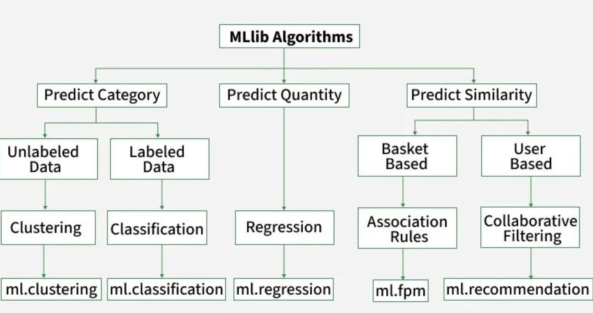

# Unit 3 – Big Data Study Notes
### Spark MLlib | PySpark | Spark Structured Streaming

> **Syllabus:** Spark MLlib – PySpark – Spark Structured Streaming – Basic Concepts, Programming Model, APIs using Streaming DataFrames, Creating Streaming DataFrames, Operations on Streaming DataFrames

---

## 1. Spark MLlib

### Key Concepts

**MLlib** is Apache Spark's built-in scalable machine learning library built on top of Spark. It provides common ML algorithms and utilities that run in a distributed manner across a cluster, making it suitable for large-scale data.

> **Analogy:** Spark = Engine | MLlib = Machine learning tools inside the engine | Scala/Python = Steering wheel

**MLlib provides algorithms like:**
- Logistic Regression
- Random Forest
- K-Means
- Decision Trees
- Recommendation Systems (ALS)



**Use Cases of MLlib / Spark:**

| Use Case | Description |
|----------|-------------|
| **Data Processing & ETL** | Efficient large-scale data processing and transformation |
| **Stream Processing** | Real-time analytics of continuous data streams |
| **Machine Learning & AI** | Distributed training and deployment of ML models |
| **Data Analytics** | In-memory analytics for structured and unstructured data |
| **Log Processing** | Real-time and batch analysis of system logs |
| **Fog Computing** | Edge-level processing for IoT and localized analytics |
| **Recommendation Systems** | Personalized content and product recommendations |
| **Real-time Advertising** | Instant ad analytics and targeting |
| **Financial Data Analysis** | Fraud detection and risk modeling |
| **IoT Analytics** | Monitoring and anomaly detection for IoT devices |


**Why MLlib?**
- Traditional ML libraries (like scikit-learn) run on a single machine and cannot handle big data.
- MLlib distributes computation across nodes, so training on terabytes of data becomes feasible.
- It integrates natively with Spark's data processing pipeline.

### What MLlib Provides

MLlib offers two main APIs:

- **RDD-based API (spark.mllib)** — the older, lower-level API built on Resilient Distributed Datasets.
- **DataFrame-based API (spark.ml)** — the modern, recommended API built on DataFrames. Also called the **Spark ML Pipeline API**.

> **Exam Tip:** The modern API is `spark.ml`. MLlib (`spark.mllib`) is the legacy one.

### Core Components of MLlib

The core workflow in MLlib involves:
1. **Data Ingestion** — loading data into Spark DataFrames.
2. **Data Preprocessing** — cleaning, transforming, and feature engineering.
3. **Model Selection** — choosing the right algorithm for the task.
4. **Model Training** — fitting the model to the training data.
5. **Prediction** — using the trained model to make predictions on new data.
6. **Evaluation** — assessing model performance using metrics.
7. **Pipeline Creation** — chaining multiple stages (preprocessing + model) into a single pipeline for easier management and deployment.
8. **Model Tuning** — optimizing hyperparameters for better performance.
9. **Model Persistence** — saving and loading trained models for future use.
10. **Deployment** — deploying models in production environments for real-time inference.


### ML Pipeline Concept

A **Pipeline** in MLlib is a sequence of stages where each stage is either a **Transformer** or an **Estimator**. Pipelines allow you to chain multiple data processing and model training steps into a single, reproducible workflow — making it easy to apply the exact same transformations during both training and prediction.

#### Two Types of Pipeline Stages

**1. Transformer**
A Transformer takes a DataFrame as input, applies some transformation, and returns a **new DataFrame** with an added or modified column. Transformers do not learn from data — they just apply a fixed operation.

Examples of Transformers:
- `Tokenizer` — splits a sentence string into a list of words
- `HashingTF` — converts a list of words into a fixed-length feature vector (term frequencies)
- `VectorAssembler` — combines multiple numeric columns into a single feature vector
- `StandardScaler` — normalizes feature values to zero mean and unit variance
- A trained `LogisticRegressionModel` — applies learned weights to produce a prediction column

**2. Estimator**
An Estimator is an algorithm that **learns from data**. When you call `.fit(df)` on an Estimator, it trains on the DataFrame and returns a **trained Transformer** (the model).

Examples of Estimators:
- `LogisticRegression` → after `.fit()` → `LogisticRegressionModel` (Transformer)
- `KMeans` → after `.fit()` → `KMeansModel`
- `StandardScaler` → after `.fit()` → `StandardScalerModel`

> **Key insight:** Before training, `LogisticRegression` is an Estimator. After training (`.fit()`), it becomes a `LogisticRegressionModel` — a Transformer that can be applied to new data.

#### How a Pipeline Works

A `Pipeline` itself is also an **Estimator**. When you call `.fit()` on a Pipeline:
1. It runs each stage **sequentially**, passing the output DataFrame of one stage as the input to the next.
2. When it encounters a Transformer, it just calls `.transform()`.
3. When it encounters an Estimator, it calls `.fit()` to train it, then `.transform()` using the resulting model.
4. The result is a **`PipelineModel`** — a fitted pipeline that acts as a Transformer for prediction.

**Pipeline Stages (Typical NLP Flow):**

```
Raw Text Data
    │
    ▼
Tokenizer           (Transformer) → splits "Hello world" into ["Hello", "world"]
    │
    ▼
HashingTF           (Transformer) → converts word list to feature vector [0, 1, 0, 2, ...]
    │
    ▼
IDF                 (Estimator)   → learns term importance across all documents
    │
    ▼
LogisticRegression  (Estimator)   → trains the classifier on feature vectors + labels
    │
    ▼
Prediction Column   (output)      → label: spam / not-spam
```

**Pipeline Stages (Typical Numeric Data Flow):**

```
Raw DataFrame (age, income, credit_score)
    │
    ▼
VectorAssembler     (Transformer) → combines columns into features vector
    │
    ▼
StandardScaler      (Estimator)   → normalizes the feature vector
    │
    ▼
RandomForestClassifier (Estimator) → trains a classifier
    │
    ▼
PipelineModel       → ready for predictions on new data
```

#### Code Example

```python
from pyspark.ml import Pipeline
from pyspark.ml.feature import Tokenizer, HashingTF, IDF
from pyspark.ml.classification import LogisticRegression

# Define stages
tokenizer = Tokenizer(inputCol="text", outputCol="words")
hashing_tf = HashingTF(inputCol="words", outputCol="raw_features", numFeatures=10000)
idf = IDF(inputCol="raw_features", outputCol="features")
lr = LogisticRegression(featuresCol="features", labelCol="label")

# Build pipeline
pipeline = Pipeline(stages=[tokenizer, hashing_tf, idf, lr])

# Train (fits IDF and LogisticRegression on training data)
model = pipeline.fit(train_df)

# Predict (applies all stages to new data)
predictions = model.transform(test_df)
predictions.select("text", "label", "prediction").show()
```

#### Why Use Pipelines?

| Without Pipeline | With Pipeline |
|-----------------|---------------|
| Must manually apply each step in correct order | Single `.fit()` and `.transform()` call |
| Easy to accidentally apply different transforms during training vs prediction | Guarantees same steps are applied consistently |
| Hard to save and reload multi-step workflows | `PipelineModel.save()` saves all stages together |
| Cross-validation is complex to set up | `CrossValidator` integrates directly with Pipeline |

> **Exam Tip:** A `Pipeline` is itself an Estimator. Calling `.fit()` on it produces a `PipelineModel` (a Transformer). This is the most important design pattern in Spark MLlib.

### Important MLlib Algorithms

**Classification:**
- Logistic Regression
- Decision Tree
- Random Forest
- Naive Bayes

**Regression:**
- Linear Regression
- Decision Tree Regressor

**Clustering:**
- K-Means
- Bisecting K-Means

**Recommendation:**
- ALS (Alternating Least Squares) – used in collaborative filtering

### Key Classes

#### Pipeline & Model Classes

| Class | Type | Description |
|-------|------|-------------|
| `Pipeline` | Estimator | Chains multiple Transformer/Estimator stages into a single workflow |
| `PipelineModel` | Transformer | The fitted result of a `Pipeline`; used for predictions on new data |
| `CrossValidator` | Estimator | Performs k-fold cross-validation for hyperparameter tuning |
| `TrainValidationSplit` | Estimator | Simpler alternative to `CrossValidator`; single train/validation split |
| `ParamGridBuilder` | Utility | Builds a grid of hyperparameter combinations for tuning |

#### Feature Engineering Classes

| Class | Type | Description | Use Case |
|-------|------|-------------|----------|
| `VectorAssembler` | Transformer | Combines multiple numeric columns into a single feature vector column — **most commonly used** | Combine `age`, `income`, `credit_score` into one `features` column for a loan default classifier |
| `StringIndexer` | Estimator | Encodes a string label column into numeric indices (e.g., "cat" → 0, "dog" → 1) | Convert the `gender` column ("Male"/"Female") to 0/1 before feeding into a model |
| `OneHotEncoder` | Transformer | Converts indexed categorical values into binary one-hot vectors | Encode `city_index` (0=Mumbai, 1=Delhi, 2=Chennai) into separate binary columns so the model doesn't assume any ordering |
| `StandardScaler` | Estimator | Normalizes features to zero mean and unit standard deviation | Normalize salary (₹10k–₹200k) and age (18–65) so neither dominates the model due to scale difference |
| `MinMaxScaler` | Estimator | Scales features to a given range, typically [0, 1] | Scale pixel intensity values (0–255) to [0,1] before training an image classification model |
| `Tokenizer` | Transformer | Splits a text string into a list of words (lowercase) | Split email body "Buy now cheap!" into `["buy", "now", "cheap!"]` for spam detection |
| `RegexTokenizer` | Transformer | Splits text using a regex pattern — more flexible than `Tokenizer` | Split tweets by non-word characters to strip punctuation before NLP processing |
| `HashingTF` *(Term Frequency)* | Transformer | Converts a list of tokens into a fixed-size term frequency vector | Convert tokenized words in a news article into a numeric vector for topic classification |
| `IDF` *(Inverse Document Frequency)* | Estimator | Computes Inverse Document Frequency weights; downweights common words | Downweight the word "the" across 10,000 documents so rare keywords like "fraud" get higher importance |
| `Word2Vec` *(Word to Vector)* | Estimator | Learns a vector representation for each word from a corpus | Learn word embeddings from product reviews so similar words ("great", "excellent") cluster together |
| `PCA` *(Principal Component Analysis)* | Estimator | Reduces the dimensionality of a feature vector using Principal Component Analysis | Reduce a 500-feature gene expression dataset to 20 principal components before clustering patients |
| `Binarizer` | Transformer | Converts numeric values to binary (0 or 1) based on a threshold | Convert a probability score (e.g., 0.82) to 1 ("fraud") or 0 ("not fraud") using a 0.5 threshold |
| `Bucketizer` | Transformer | Maps continuous numeric values into discrete buckets | Bucket customer ages into groups: 0–18, 19–35, 36–60, 60+ for segment-based marketing analysis |
| `IndexToString` | Transformer | Reverses `StringIndexer` — converts numeric index back to original string label | Convert model prediction `2` back to the original label `"Setosa"` for readable output |

#### Quick Reference — When to Use Which

| Scenario | Use This Class |
|----------|---------------|
| Multiple numeric columns → one features column | `VectorAssembler` |
| String category column → numeric index | `StringIndexer` |
| Numeric index → one-hot vector | `OneHotEncoder` |
| Normalize feature magnitudes | `StandardScaler` or `MinMaxScaler` |
| Text → word list | `Tokenizer` |
| Word list → numeric vector | `HashingTF` + `IDF` |
| Reduce number of features | `PCA` |
| Tune model hyperparameters | `CrossValidator` + `ParamGridBuilder` |
| Predicted index → readable label | `IndexToString` |

### Example / Use Case

**Real-World Use Case:** Predicting customer churn — given customer data (age, income, num_purchases, gender), predict whether a customer will leave (label = 1) or stay (label = 0).

The full workflow below mirrors the **Core Components of MLlib** listed above, step by step.

```python
# ─────────────────────────────────────────────────────────────
# STEP 0 — Imports
# ─────────────────────────────────────────────────────────────
from pyspark.sql import SparkSession
from pyspark.sql.functions import col
from pyspark.ml import Pipeline
from pyspark.ml.feature import StringIndexer, VectorAssembler, StandardScaler
from pyspark.ml.classification import RandomForestClassifier
from pyspark.ml.evaluation import BinaryClassificationEvaluator, MulticlassClassificationEvaluator
from pyspark.ml.tuning import ParamGridBuilder, CrossValidator

# ─────────────────────────────────────────────────────────────
# STEP 1 — Data Ingestion
# Load raw data into a Spark DataFrame
# ─────────────────────────────────────────────────────────────
spark = SparkSession.builder \
    .appName("CustomerChurnPrediction") \
    .master("local[*]") \
    .getOrCreate()

# Load CSV with header row; infer column data types automatically
df = spark.read.csv("customer_data.csv", header=True, inferSchema=True)
df.show(5)
df.printSchema()

# ─────────────────────────────────────────────────────────────
# STEP 2 — Data Preprocessing / Feature Engineering
# Clean nulls, encode strings, assemble feature vector
# ─────────────────────────────────────────────────────────────

# 2a. Drop rows with missing values in key columns
df = df.dropna(subset=["age", "income", "num_purchases", "gender", "churn"])

# 2b. Rename target column to "label" (required by MLlib)
df = df.withColumnRenamed("churn", "label")

# 2c. Encode the string column "gender" → numeric index
#     "Male" → 0.0, "Female" → 1.0  (StringIndexer learns this from data)
gender_indexer = StringIndexer(inputCol="gender", outputCol="gender_index")

# 2d. Combine all numeric feature columns into one vector column
assembler = VectorAssembler(
    inputCols=["age", "income", "num_purchases", "gender_index"],
    outputCol="raw_features"
)

# 2e. Normalize the feature vector (zero mean, unit std)
scaler = StandardScaler(inputCol="raw_features", outputCol="features")

# ─────────────────────────────────────────────────────────────
# STEP 3 — Train / Test Split
# ─────────────────────────────────────────────────────────────
train_df, test_df = df.randomSplit([0.8, 0.2], seed=42)
print(f"Training rows: {train_df.count()} | Test rows: {test_df.count()}")

# ─────────────────────────────────────────────────────────────
# STEP 4 — Model Selection
# Choose RandomForestClassifier for tabular classification
# ─────────────────────────────────────────────────────────────
rf = RandomForestClassifier(
    featuresCol="features",
    labelCol="label",
    numTrees=100,
    maxDepth=5
)

# ─────────────────────────────────────────────────────────────
# STEP 5 — Pipeline Creation
# Chain preprocessing stages + model into one pipeline
# ─────────────────────────────────────────────────────────────
pipeline = Pipeline(stages=[
    gender_indexer,   # Stage 1: StringIndexer  (Estimator → learns encoding)
    assembler,        # Stage 2: VectorAssembler (Transformer)
    scaler,           # Stage 3: StandardScaler  (Estimator → learns mean/std)
    rf                # Stage 4: RandomForest    (Estimator → trains model)
])

# ─────────────────────────────────────────────────────────────
# STEP 6 — Model Training
# .fit() runs all stages sequentially on training data
# ─────────────────────────────────────────────────────────────
model = pipeline.fit(train_df)
# 'model' is now a PipelineModel — a Transformer ready for prediction

# ─────────────────────────────────────────────────────────────
# STEP 7 — Prediction
# .transform() applies all fitted stages to new data
# ─────────────────────────────────────────────────────────────
predictions = model.transform(test_df)
predictions.select("age", "income", "gender", "label", "prediction", "probability").show(10)

# ─────────────────────────────────────────────────────────────
# STEP 8 — Evaluation
# Measure how well the model performed
# ─────────────────────────────────────────────────────────────

# AUC-ROC: measures ability to distinguish classes (1.0 = perfect)
auc_evaluator = BinaryClassificationEvaluator(
    labelCol="label",
    metricName="areaUnderROC"
)
auc = auc_evaluator.evaluate(predictions)
print(f"AUC-ROC: {auc:.4f}")

# Accuracy: fraction of correctly predicted rows
acc_evaluator = MulticlassClassificationEvaluator(
    labelCol="label",
    predictionCol="prediction",
    metricName="accuracy"
)
accuracy = acc_evaluator.evaluate(predictions)
print(f"Accuracy: {accuracy:.4f}")

# ─────────────────────────────────────────────────────────────
# STEP 9 — Model Tuning (Hyperparameter Search)
# Try different numTrees and maxDepth combinations
# ─────────────────────────────────────────────────────────────
param_grid = ParamGridBuilder() \
    .addGrid(rf.numTrees, [50, 100, 200]) \
    .addGrid(rf.maxDepth, [3, 5, 10]) \
    .build()

# CrossValidator tries every combination with 3-fold CV
cv = CrossValidator(
    estimator=pipeline,
    estimatorParamMaps=param_grid,
    evaluator=auc_evaluator,
    numFolds=3
)

cv_model = cv.fit(train_df)
best_predictions = cv_model.transform(test_df)
print(f"Best AUC after tuning: {auc_evaluator.evaluate(best_predictions):.4f}")

# ─────────────────────────────────────────────────────────────
# STEP 10 — Model Persistence
# Save the best model to disk; reload later for inference
# ─────────────────────────────────────────────────────────────
cv_model.bestModel.save("hdfs:///models/churn_pipeline_model")

# Load and use later (no retraining needed)
from pyspark.ml import PipelineModel
loaded_model = PipelineModel.load("hdfs:///models/churn_pipeline_model")
new_predictions = loaded_model.transform(test_df)

spark.stop()
```

**Flow Summary:**

```
CSV File
  │
  ▼  STEP 1 — Data Ingestion        spark.read.csv()
  │
  ▼  STEP 2 — Preprocessing         StringIndexer → VectorAssembler → StandardScaler
  │
  ▼  STEP 3 — Train/Test Split      randomSplit([0.8, 0.2])
  │
  ▼  STEP 4 — Model Selection       RandomForestClassifier
  │
  ▼  STEP 5 — Pipeline              Pipeline(stages=[...])
  │
  ▼  STEP 6 — Training              pipeline.fit(train_df)  →  PipelineModel
  │
  ▼  STEP 7 — Prediction            model.transform(test_df)
  │
  ▼  STEP 8 — Evaluation            AUC-ROC, Accuracy
  │
  ▼  STEP 9 — Tuning                CrossValidator + ParamGridBuilder
  │
  ▼  STEP 10 — Persistence          model.save() / PipelineModel.load()
```

### Important Points

- MLlib works best with the **DataFrame API** (spark.ml).
- Feature vectors must be assembled into a **single vector column** before passing to an algorithm.
- Models can be saved and reloaded using `.save()` and `PipelineModel.load()`.
- MLlib supports **cross-validation** and **train-validation split** for model tuning.

---

## 2. PySpark

### Key Concepts

**PySpark** is the Python API for Apache Spark. It allows Python developers to write Spark applications using Python syntax while leveraging Spark's distributed computing engine under the hood.

**Why PySpark?**
- Python is popular for data science; PySpark bridges Python with Spark's power.
- Enables processing of large datasets using familiar Python code.
- Supports Spark SQL, DataFrames, MLlib, and Streaming.

### SparkSession — The Entry Point

`SparkSession` is the unified entry point for all Spark functionality. Every PySpark application starts by creating a `SparkSession`.

```python
from pyspark.sql import SparkSession

spark = SparkSession.builder \
    .appName("MyApp") \
    .master("local[*]") \
    .getOrCreate()
```

- `appName` — name of the application
- `master` — where to run (`local` for local machine, `yarn` for cluster)
- `getOrCreate()` — returns existing session or creates a new one

### Core Data Abstractions in PySpark

| Abstraction | Description |
|---|---|
| **RDD** (Resilient Distributed Dataset) | Low-level, fault-tolerant, distributed collection of objects |
| **DataFrame** | Distributed table with named columns; like a SQL table |
| **Dataset** | Strongly-typed version of DataFrame (not in Python) |

> **Exam Tip:** In Python (PySpark), we primarily use **DataFrames**, not Datasets (Datasets are JVM-only).

### RDD — Resilient Distributed Dataset

- **Resilient** — fault-tolerant; can recover from node failures.
- **Distributed** — data is split across multiple nodes.
- **Dataset** — a collection of data items.

**Creating RDDs:**
```python
rdd = spark.sparkContext.parallelize([1, 2, 3, 4, 5])
rdd2 = spark.sparkContext.textFile("hdfs://path/to/file.txt")
```

**RDD Operations:**
- **Transformations** (lazy, return new RDD): `map()`, `filter()`, `flatMap()`, `reduceByKey()`
- **Actions** (trigger execution): `collect()`, `count()`, `take()`, `saveAsTextFile()`

### DataFrame in PySpark

DataFrames are the primary way to work with structured data in PySpark. They support SQL-like operations and are optimized by Spark's **Catalyst optimizer**.

**Creating DataFrames:**
```python
# From a list
df = spark.createDataFrame([(1, "Alice"), (2, "Bob")], ["id", "name"])

# From a CSV file
df = spark.read.csv("data.csv", header=True, inferSchema=True)

# From JSON
df = spark.read.json("data.json")
```

**Common DataFrame Operations:**
```python
df.show()               # Display rows
df.printSchema()        # Show schema
df.select("name")       # Select columns
df.filter(df.age > 21)  # Filter rows
df.groupBy("dept").count()  # Group and aggregate
df.orderBy("age")       # Sort
df.withColumn("salary_k", df.salary / 1000)  # Add new column
df.drop("column_name")  # Drop a column
```

### Spark SQL

PySpark supports running SQL queries directly on DataFrames by registering them as **temporary views**.

```python
df.createOrReplaceTempView("employees")
result = spark.sql("SELECT name, salary FROM employees WHERE salary > 50000")
result.show()
```

### Lazy Evaluation

Spark uses **lazy evaluation** — transformations are not executed immediately. They build up a **DAG (Directed Acyclic Graph)** of operations. Execution only begins when an **action** is called.

- This allows Spark to **optimize** the entire computation plan before running it.

### Important Points

- `SparkContext` is the old entry point (used with RDDs). `SparkSession` is the modern entry point.
- DataFrames are **immutable** — operations return new DataFrames.
- Spark processes data in **partitions** distributed across the cluster.
- PySpark DataFrames use **columnar storage** format internally for efficiency.
- Always call `.stop()` on `SparkSession` at the end of a program to release resources.

---

## 3. Spark Structured Streaming

### Key Concepts

**Spark Structured Streaming** is a scalable and fault-tolerant stream processing engine built on top of the Spark SQL engine. It allows you to write streaming queries the same way you write batch queries on static DataFrames — the engine handles the continuous processing.

**Core Idea — Treat a Stream as an Unbounded Table:**
> Structured Streaming treats a live data stream as a table that keeps growing continuously. You query it like a regular table, and Spark continuously appends new results as new data arrives.

**Why Structured Streaming?**
- Unifies batch and stream processing with the same API.
- Provides end-to-end **exactly-once** fault tolerance.
- Supports event-time processing and late data handling.
- Simpler programming model compared to lower-level streaming (Spark Streaming / DStream API).

### Basic Concepts

#### Stream vs Batch

| Feature | Batch Processing | Stream Processing |
|---|---|---|
| Data | Finite, stored | Infinite, live |
| Latency | High (minutes/hours) | Low (milliseconds/seconds) |
| Use Case | Reports, ETL | Real-time alerts, dashboards |

#### Micro-Batch Processing

By default, Structured Streaming runs in **micro-batch** mode. It collects incoming data into small batches at fixed intervals (trigger intervals) and processes each batch. This gives low latency while maintaining the simplicity of batch logic.

There is also a **Continuous Processing** mode for sub-millisecond latency (experimental).

#### Event Time vs Processing Time

- **Event Time** — the time when the event actually occurred (embedded in the data).
- **Processing Time** — the time when Spark receives and processes the event.
- Structured Streaming supports event-time processing and can handle **late-arriving data** using **watermarks**.

### Programming Model

The programming model for Structured Streaming is simple and mirrors the static DataFrame API:

1. **Define input** — create a streaming DataFrame from a source.
2. **Apply transformations** — filter, aggregate, join, etc.
3. **Define output** — write results to a sink with a specified output mode.
4. **Start the query** — call `.start()` to begin streaming.

**Conceptual flow:**

```
Source (Kafka / Socket / File) 
    → Streaming DataFrame 
        → Transformations 
            → Sink (Console / File / Kafka / Memory)
```

#### Output Modes

Output mode defines **what data gets written to the sink** after each trigger:

| Output Mode | Description | When to Use |
|---|---|---|
| **Append** | Only newly added rows are written | No aggregations; default for simple streams |
| **Complete** | The entire result table is written each time | Aggregations (e.g., counts) |
| **Update** | Only rows that have changed since last trigger | Aggregations with updates |

> **Exam Tip:** `Append` is the default. `Complete` is used when the full aggregated result is needed. `Update` is the most efficient for aggregations.

#### Triggers

A **trigger** defines how often a streaming query checks for new data and processes it.

| Trigger Type | Description |
|---|---|
| Default (unspecified) | Runs next micro-batch as soon as previous one finishes |
| Fixed Interval | Process data at a fixed time interval (`processingTime="10 seconds"`) |
| One-time | Processes all available data and stops |
| Continuous | Experimental; very low latency (~1ms) |

### APIs using Streaming DataFrames

Structured Streaming uses the same **DataFrame/Dataset API** as static Spark. The key difference is in the **source** (streaming source instead of a file) and the **sink** (write stream instead of write).

**Key API methods for streaming:**

| Method | Description |
|---|---|
| `spark.readStream` | Entry point for creating a streaming DataFrame |
| `df.isStreaming` | Returns `True` if the DataFrame is streaming |
| `df.writeStream` | Entry point for writing streaming output |
| `.format()` | Specifies source/sink format (kafka, socket, console, parquet, etc.) |
| `.option()` | Sets source/sink specific options |
| `.outputMode()` | Sets how results are output (append/complete/update) |
| `.trigger()` | Sets how often to process data |
| `.start()` | Starts the streaming query |
| `.awaitTermination()` | Blocks until the query is stopped |

### Creating Streaming DataFrames

A **Streaming DataFrame** is created using `spark.readStream` instead of `spark.read`.

#### Source Types

| Source | Description |
|---|---|
| **Socket** | Reads text from a TCP socket (for testing only) |
| **File** | Watches a directory for new files (CSV, JSON, Parquet, etc.) |
| **Kafka** | Reads messages from Apache Kafka topics |
| **Rate** | Generates rows at a fixed rate (for benchmarking/testing) |

#### Example 1: Socket Source (Testing)

```python
from pyspark.sql import SparkSession

spark = SparkSession.builder.appName("StreamingExample").getOrCreate()

# Create a streaming DataFrame from a socket
lines = spark.readStream \
    .format("socket") \
    .option("host", "localhost") \
    .option("port", 9999) \
    .load()

lines.printSchema()
# lines.isStreaming → True
```

> Run `nc -lk 9999` in a terminal to simulate a socket server.

#### Example 2: File Source (CSV Directory)

```python
schema = "name STRING, age INT, salary DOUBLE"

streaming_df = spark.readStream \
    .format("csv") \
    .option("header", True) \
    .schema(schema) \
    .load("/path/to/input/directory/")
```

Spark watches the directory and processes any new files dropped into it.

#### Example 3: Kafka Source

```python
kafka_df = spark.readStream \
    .format("kafka") \
    .option("kafka.bootstrap.servers", "localhost:9092") \
    .option("subscribe", "my-topic") \
    .load()

# Kafka gives key and value as binary; cast to string
messages = kafka_df.selectExpr("CAST(key AS STRING)", "CAST(value AS STRING)")
```

> **Exam Tip:** Kafka is the most important real-world streaming source. Kafka messages are delivered as key-value pairs in binary format.

### Operations on Streaming DataFrames

Once a streaming DataFrame is created, you can apply **most of the same operations** as on static DataFrames. However, some operations have restrictions.

#### Supported Operations

**Selection and Filtering:**
```python
# Word count from socket stream
from pyspark.sql.functions import explode, split

words = lines.select(
    explode(split(lines.value, " ")).alias("word")
)

word_counts = words.groupBy("word").count()
```

**Aggregations:**
```python
# Count of events per category
agg_df = streaming_df.groupBy("category").count()
```

**Joins:**
- Stream-to-static DataFrame joins are supported.
- Stream-to-stream joins are supported with watermarks.

```python
# Stream joined with a static lookup table
enriched = streaming_df.join(static_lookup_df, "user_id")
```

**Windowed Aggregations (Event Time):**

Windowed operations group events into time windows for aggregation.

```python
from pyspark.sql.functions import window

windowed_counts = words \
    .groupBy(window(words.timestamp, "10 minutes", "5 minutes"), words.word) \
    .count()
```

- `"10 minutes"` — window duration
- `"5 minutes"` — slide interval (how often a new window starts)

**Watermarking (Late Data Handling):**

A **watermark** tells Spark how long to wait for late-arriving data before closing a window.

```python
words.withWatermark("timestamp", "10 minutes") \
     .groupBy(window(words.timestamp, "10 minutes"), words.word) \
     .count()
```

> **Exam Tip:** Watermark = maximum tolerated delay for late data. Events arriving later than the watermark threshold are dropped.

#### Writing the Output (Sink)

After transformations, write the streaming result using `writeStream`:

```python
query = word_counts.writeStream \
    .outputMode("complete") \
    .format("console") \
    .trigger(processingTime="5 seconds") \
    .start()

query.awaitTermination()
```

**Common Sink Formats:**

| Sink | Description |
|---|---|
| `console` | Prints output to terminal (for testing) |
| `memory` | Stores output in an in-memory table (for debugging) |
| `parquet` / `csv` / `json` | Writes to files in a directory |
| `kafka` | Publishes results back to a Kafka topic |
| `foreach` / `foreachBatch` | Custom output logic per row or per batch |

#### `foreachBatch` — Custom Sink

`foreachBatch` lets you apply any batch DataFrame operation to each micro-batch, giving maximum flexibility:

```python
def process_batch(batch_df, batch_id):
    batch_df.write.mode("append").parquet("/output/path")

query = streaming_df.writeStream \
    .foreachBatch(process_batch) \
    .start()
```

#### Unsupported Operations on Streaming DataFrames

Some operations that work on static DataFrames are **not supported** on streaming DataFrames:
- Multiple aggregations chained (unless using `foreachBatch`)
- `limit()` and `take()`
- `distinct()` without aggregation
- Sorting without aggregation (except in complete output mode)
- `count()` alone (must use `groupBy().count()`)

### Fault Tolerance and Checkpointing

Structured Streaming provides **end-to-end exactly-once** guarantees through:

- **Checkpointing** — saves the progress of each query (offsets processed) to a reliable storage (like HDFS or S3).
- **Idempotent sinks** — writing the same data twice does not cause duplication.

```python
query = word_counts.writeStream \
    .outputMode("complete") \
    .format("console") \
    .option("checkpointLocation", "/checkpoint/path") \
    .start()
```

> **Exam Tip:** Always set `checkpointLocation` for production streaming queries. Without it, the stream cannot recover from failures.

### End-to-End Example — Word Count from Socket

```python
from pyspark.sql import SparkSession
from pyspark.sql.functions import explode, split

spark = SparkSession.builder.appName("WordCount").getOrCreate()

# 1. Create streaming DataFrame
lines = spark.readStream \
    .format("socket") \
    .option("host", "localhost") \
    .option("port", 9999) \
    .load()

# 2. Apply transformations
words = lines.select(explode(split(lines.value, " ")).alias("word"))
word_counts = words.groupBy("word").count()

# 3. Write output
query = word_counts.writeStream \
    .outputMode("complete") \
    .format("console") \
    .start()

query.awaitTermination()
```

### Real-World Use Cases

| Use Case | Streaming Source | What is Streamed |
|---|---|---|
| Real-time fraud detection | Kafka | Bank transaction events |
| Live dashboard / monitoring | Kafka | Server logs, metrics |
| IoT sensor data processing | Kafka / File | Temperature, pressure readings |
| Social media trending topics | Twitter API → Kafka | Tweets |
| E-commerce real-time analytics | Kafka | Click-stream, purchase events |

---

## Quick Revision Summary

### MLlib
- Spark's built-in ML library; use `spark.ml` (DataFrame API), not `spark.mllib` (legacy).
- Key concepts: **Pipeline**, **Transformer**, **Estimator**, **VectorAssembler**.
- Supports classification, regression, clustering, and recommendation (ALS).

### PySpark
- Python API for Spark; entry point is `SparkSession`.
- Key abstractions: **RDD** (distributed collection), **DataFrame** (structured table).
- Transformations are **lazy**; actions trigger execution.
- Supports Spark SQL via temporary views.

### Spark Structured Streaming
- Treats a live stream as an **unbounded table**.
- Uses `spark.readStream` to create a Streaming DataFrame.
- Runs in **micro-batch** mode by default.
- Output modes: **Append**, **Complete**, **Update**.
- Sources: Socket, File, Kafka, Rate.
- Sinks: Console, File, Kafka, Memory, foreachBatch.
- **Watermarking** handles late-arriving data.
- **Checkpointing** ensures fault tolerance and exactly-once semantics.
- Call `.start()` to begin and `.awaitTermination()` to keep the query running.

---

*End of Unit 3 Notes*

