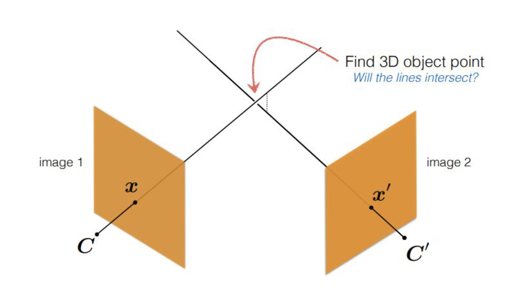
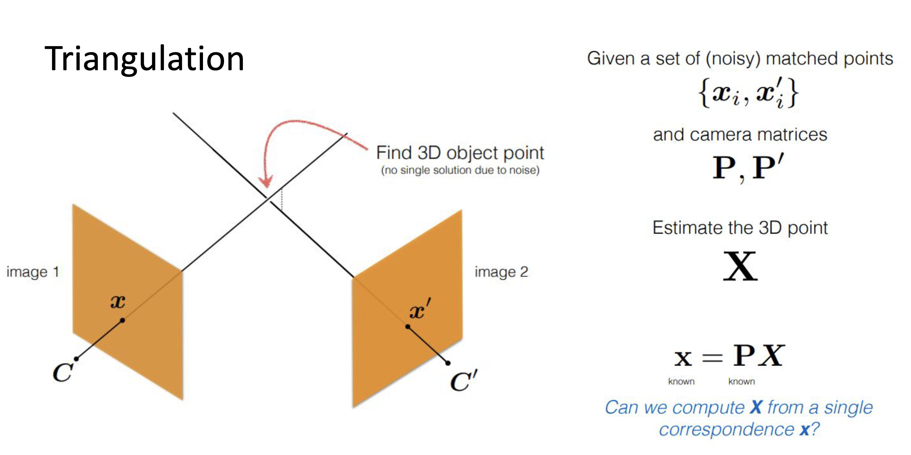
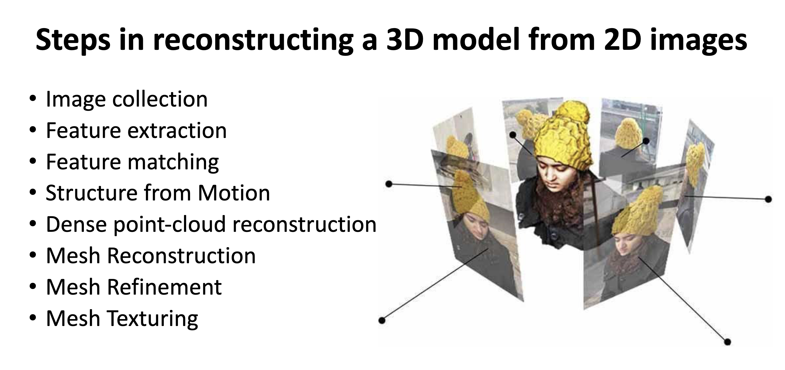

# CVT Unit 4 - Semester Answers

## a) Two-Frame Structure from Motion (SfM) and Triangulation (8 Marks)

Triangulation is the process of estimating 3D point positions from their 2D projections in multiple images. In the context of two-frame SfM, we have two images of the same scene taken from different viewpoints, and we want to recover the 3D structure of the scene as well as the relative motion between the two camera views.




concept:
- Given the two images, we first detect feature points (like corners or blobs) in both images using algorithms such as SIFT or ORB.
- This requires camera calibration to know the intrinsic parameters (focal length, principal point, etc.) for accurate reconstruction.
- Next, we match the detected features between the two images to find correspondences.
- With the matched points, we can compute the Fundamental Matrix $F$ that encodes the epipolar geometry between the two views.
- If camera intrinsics are known, we can compute the Essential Matrix $E$ and recover the relative rotation $R$ and translation $t$ between the two camera views.
- Finally, we use triangulation to estimate the 3D coordinates of the matched points by finding the best 3D point that projects to the observed 2D points in both images.

If P1 and P2 are the camera projection matrices for the two views, and x1 and x2 are the corresponding 2D points in the images, triangulation finds the 3D point X that satisfies:
    $$x_1 \sim P_1 X, \quad x_2 \sim P_2 X$$

where,
- $P_1$ and $P_2$ are the projection matrices for the first and second camera, respectively.
- $X$ is the homogeneous coordinate of the 3D point we want to estimate.





there are three methods for triangulation:

Method : 1
- Linear triangulation: This method formulates the triangulation problem as a linear system of equations and solves it using techniques like Singular Value Decomposition (SVD). It is computationally efficient but can be sensitive to noise.
it is mathematically expressed as:
$$\begin{bmatrix}P_1 - x_1 P_1 \\
P_2 - x_2 P_2\end{bmatrix} X = 0$$

where,
- $P_1$ and $P_2$ are the projection matrices for the first and second camera, respectively.
- $x_1$ and $x_2$ are the homogeneous coordinates of the corresponding 2D points in the first and second images, respectively.
- $X$ is the homogeneous coordinate of the 3D point we want to estimate.


Method : 2
- Iterative triangulation: This method iteratively refines the estimate of the 3D point by minimizing the reprojection error, which is the difference between the observed 2D points and the projected 3D point. It is more robust to noise but can be computationally expensive.
The reprojection error can be expressed as:
$$\text{Error} = \|x_1 - P_1 X\|^2 + \|x_2 - P_2 X\|^2$$

where,
- $P_1$ and $P_2$ are the projection matrices for the first and second camera, respectively.
- $x_1$ and $x_2$ are the homogeneous coordinates of the corresponding 2D points in the first and second images, respectively.
- $X$ is the homogeneous coordinate of the 3D point we want to estimate.

Method : 3
- Midpoint triangulation: This method finds the midpoint of the line segment connecting the two rays defined by the camera centers and the corresponding 2D points. It is a simple and efficient method but can be less accurate than the other methods, especially in cases of large baseline or significant noise.
The midpoint triangulation can be expressed as:
$$X = \frac{1}{2} (C_1 + C_2)$$

where,
- $C_1$ and $C_2$ are the camera centers for the first and second camera, respectively.
- The rays are defined by the lines connecting the camera centers to the corresponding 2D points in the images.


>Structure from Motion (SfM) - a technique in computer vision that uses multiple overlapping images to reconstruct 3D structure and camera motion from a sequence of images. It involves detecting and matching features across images, estimating camera parameters, and triangulating 3D points.

Two Frame Structure from Motion (SfM) is a fundamental problem in computer vision where the goal is to recover the 3D structure of a scene and the relative motion between two camera views using only two images. This process involves several key steps, including feature detection, matching, and triangulation.

Process of Structure from Motion (SfM) with Two Frames:
1. **Feature Detection**: The first step is to detect distinctive features in both images. Common algorithms for feature detection include SIFT (Scale-Invariant Feature Transform), SURF (Speeded-Up Robust Features), and ORB (Oriented FAST and Rotated BRIEF). These algorithms identify key points in the images that are invariant to scale, rotation, and illumination changes.
2. **Feature Matching**: After detecting features, the next step is to match these features between the two images. This can be done using descriptor matching techniques, where each detected feature is described by a vector (descriptor) that captures its local appearance. The descriptors from the first image are compared to those from the second image to find correspondences.
3. **Estimating Camera Motion**: With the matched features, we can estimate the relative camera motion (rotation and translation) between the two views. This is typically done by computing the Essential Matrix (E) or the Fundamental Matrix (F) from the matched points, and then decomposing it to obtain the rotation (R) and translation (t) between the cameras.
4. **Triangulation**: Finally, with the estimated camera motion and the matched feature points, we can perform triangulation to recover the 3D coordinates of the matched points. Triangulation involves finding the 3D point that best explains the observed 2D projections in both images, given the camera parameters and the relative motion.
5. **Bundle Adjustment**: After triangulation, a global optimization step called bundle adjustment is often performed to refine the estimates of camera parameters and 3D point positions by minimizing the reprojection error across all observations.
6. **Dense Reconstruction**: In some cases, after obtaining a sparse set of 3D points from triangulation, additional techniques can be applied to generate a dense 3D reconstruction of the scene.
7. **Surface Reconstruction and Texturing (Optional)**: Once a dense point cloud is obtained, surface reconstruction algorithms can be used to create a mesh representation of the scene, and texturing can be applied to enhance the visual appearance of the reconstructed model.



---

## b) Role of Self-Calibration and Removing Projective Distortion (6 Marks)

When camera intrinsics (focal length, principal point, skew) are unknown, SfM can still rebuild the scene, but only in a **projective form**. In a projective reconstruction, the scene may look visually correct, but its geometry is not physically reliable. So you can recognize the object, but you cannot trust measurements.

In simple words: **shape looks okay, measurement is wrong**. Distances can change, angles are not preserved, and even parallel lines may not stay parallel.

Self-calibration solves this problem by estimating camera intrinsics directly from multiple images, without using a separate calibration object. Once intrinsics are estimated, we upgrade the reconstruction from projective to metric.

After this upgrade, the 3D model becomes geometrically meaningful: camera motion is more realistic, and measurements (angles, relative lengths, and parallel structure) become usable, up to one global scale factor.

Easy 3-step memory:
1. Unknown intrinsics -> projective reconstruction (looks right, measures wrong)
2. Estimate intrinsics from images -> self-calibration
3. Upgrade to metric reconstruction -> usable geometry

### Why it is important

1. Removes projective ambiguity.
2. Recovers physically meaningful camera motion.
3. Makes 3D model usable for measurement and AR.

### Core idea

Projective model is related to metric model by a 3D homography $H$:
$$X_m = H X_p, \quad P_m = P_p H^{-1}$$

Self-calibration estimates constraints on $H$ (via intrinsic parameter constraints), then applies this upgrade to remove projective distortion.

Easy memory line:
**No calibration -> projective world; self-calibration -> metric world**.

### Role of Removing Projective Distortion

Projective distortion is the geometric error introduced into a 3D reconstruction when camera calibration is unknown. In a projective reconstruction, parallel lines may no longer appear parallel, angles between surfaces are not preserved, and distances between points are unreliable. The scene topology (what connects to what) is correct, but the actual shape and size of objects is warped.

**Why it must be removed:**

Projective distortion makes a reconstruction geometrically unusable for any real-world task. For example, if you are trying to measure the length of a road in a reconstructed scene, the projective model might give you a number that is completely wrong because the scale and shape are distorted. Similarly, in robotics, a robot navigating using a projectively distorted map would misjudge distances and crash. In AR, virtual objects would not align correctly with physical surfaces because the recovered camera pose would be based on incorrect geometry.

**How it is removed:**

Once self-calibration estimates the camera intrinsics $K$, a corrective 3D homography $H$ can be computed and applied to upgrade the reconstruction. Every projective camera matrix $P_p$ and every projective 3D point $X_p$ is transformed:

$$P_m = P_p H^{-1}, \quad X_m = H X_p$$

After this upgrade:
- Angles and parallel lines are restored
- Length ratios become meaningful
- Camera motion reflects actual rotation and translation (up to a global scale)
- The reconstruction is metric, ready for measurement and physical use

**What "up to scale" means:**

Even after upgrading to metric, the absolute size of the scene cannot be recovered from images alone (because a small object close to the camera looks the same as a large object far away). So the metric reconstruction is correct in shape but not in absolute scale. This is normal and expected — scale is usually fixed by one known distance in the scene or by a calibration target.

**Applications that require this step:**

- **Augmented Reality (AR):** Virtual objects must be placed at correct angles and distances on real surfaces. Projective distortion would cause misalignment.
- **Robotics and Autonomous Navigation:** Robots use reconstructed maps for motion planning. Distorted geometry leads to wrong path decisions.
- **Industrial Inspection:** Measuring dimensions of parts from camera images requires a metric model; projective data is useless for tolerances.
- **Medical Imaging:** 3D models from endoscope or surgical camera footage must be metric for measuring tissue size and organ position.
- **Urban Mapping and Surveying:** Building footprints and road widths must be accurate; projective reconstruction alone cannot provide this.

Easy memory line:
**Projective distortion = wrong shape. Remove it via self-calibration + homography upgrade = correct, usable geometry.**

---

## c) Perspective Factorization Algorithm / Pseudo-code (6 Marks)

Perspective Factorization is a method to simultaneously recover the camera projection matrices P1, P2, ..., Pm and the 3D structure (points X1, X2, ..., Xn) from a set of 2D image observations. Unlike affine factorization (Tomasi-Kanade), it handles the full perspective projection model and requires iterative refinement. 

Given a m cameras and n 3D points, the observation model is given by:
$$x_{ij} \sim P_i X_j$$

where
- $x_{ij}$ is the homogeneous coordinate of the 2D point observed in camera $i$ corresponding to 3D point $j$.
- $P_i$ is the 3x4 projection matrix for camera $i$.

the goal is to find the set of projection matrices $\{P_i\}$ and 3D points $\{X_j\}$ that best explain the observed 2D points. This is typically formulated as a non-linear optimization problem that minimizes the reprojection error:
$$\min_{\{P_i\}, \{X_j\}} \sum_{i=1}^m \sum_{j=1}^n \| x_{ij} - P_i X_j \|^2$$
where
- $m$ is the number of cameras
- $n$ is the number of 3D points
The perspective factorization algorithm can be outlined in the following pseudo-code:

```text
Input:
    Tracked image points x_ij for camera i and point j
Output:
    Camera motion {P_i} and 3D points {X_j}
1. Normalize image points in every frame.
2. Initialize projective depths lambda_ij = 1.
3. Repeat until convergence:
     a) Build scaled measurement matrix W using lambda_ij * x_ij.
     b) Compute rank-4 SVD factorization: W ≈ M S.
         - M contains camera motion terms
         - S contains homogeneous 3D structure
     c) Update lambda_ij from current reprojection model.
     d) Normalize scale to avoid drift.
4. Extract projective camera matrices P_i from M.
5. Extract projective 3D points X_j from S.
6. (Optional) Apply self-calibration for metric upgrade.
7. Run bundle adjustment for final refinement.
``` 

Key Notes:
- The algorithm iteratively refines the estimates of camera motion and 3D structure by alternating between factorization and depth update steps.
- Normalization of image points is crucial for numerical stability.
- The final output is a projective reconstruction that can be upgraded to metric if camera intrinsics are estimated.
- Bundle adjustment is often used at the end to minimize reprojection error and improve accuracy.           


---

## d) Image Formation in Computer Vision: Light, Surface, Camera (20 Marks)

Image formation is the fundamental process by which a 3D physical scene is converted into a 2D digital image. It involves the interaction of three key elements: light (the energy source and carrier of information), the surface (the object whose appearance is being captured), and the camera (the device that samples and records the light). Understanding this pipeline is essential for designing computer vision systems that interpret images correctly


### 1) Role of light

Without illumination, no image can be formed. Light from a source (sun, lamp, flash) reaches scene surfaces. Light properties such as intensity, direction, wavelength, and color affect how bright and what color the final image appears.

- **Intensity:** determines brightness; more light = brighter image.
- **Direction:** creates shadows and highlights, giving cues about shape.
- **Wavelength/Color:** affects the color of the image; different materials reflect different wavelengths differently, creating color variations.


### 2) Role of surface

The surface of objects in the scene interacts with incoming light through reflection, absorption, and transmission. The way a surface reflects light determines its appearance in the image.

The main factors affecting surface appearance are:
- **Diffuse reflection (Lambertian):** appears similar from different viewpoints.
- **Specular reflection:** shiny highlights depend on viewing direction.
- **Texture and material:** affect local brightness and color changes.

A simple diffuse model is:
$$I \propto \rho \,(n \cdot l)$$
where 
- $\rho$ is albedo, that is how much light the surface reflects,
- $n$ is surface normal vector, which is the direction perpendicular to the surface,
- $l$ is light direction.

### 3) Role of camera

Think of the camera as a translator — it takes a 3D world and converts it to a 2D picture. It does this in two stages: positioning (where is the camera and which way is it pointing?) and optics (how does it compress 3D into 2D?).

**Extrinsics — where the camera is:**
- Rotation $R$ — which direction the camera is facing.
- Translation $t$ — where the camera is in the world.
- Together, $[R \mid t]$ moves the world into the camera's coordinate frame.

**Intrinsics — how the camera maps 3D to 2D:**
- **Focal length $f$:** how zoomed in the camera is. Longer focal length = narrower field of view.
- **Principal point $(c_x, c_y)$:** the pixel at the center of the image, where the optical axis hits the sensor.
- **Skew:** rarely non-zero; accounts for non-rectangular pixels.
- All of these are packed into the intrinsic matrix $K$.

**Projection model — the full formula:**
$$x \sim K [R \mid t] X$$

In plain English: take a 3D point $X$, rotate and translate it into camera space using $[R \mid t]$, then project it onto the image plane using $K$, and you get the 2D pixel $x$.

Memory: **World → Camera frame ($[R|t]$) → Image plane ($K$) → Pixel ($x$)**

### 4) Sensor and digitization

Once light passes through the lens and lands on the sensor, the sensor's job is to turn light into numbers. This happens in four steps:

1. **Photon capture:** The sensor (CCD or CMOS chip) has millions of tiny wells called pixels. Each well collects photons that fall on it during the exposure time. More photons = stronger signal.

2. **Analog to digital (ADC):** Each well produces a small voltage proportional to the light it collected. An Analog-to-Digital Converter (ADC) turns this continuous voltage into a discrete integer (e.g., 0–255 for 8-bit).

3. **Sampling and quantization:** Sampling means dividing the sensor into a grid of pixels (spatial resolution). Quantization means rounding intensity to the nearest discrete level (bit depth). More pixels = finer spatial detail. More bits = finer brightness levels.

4. **Color formation:** Most cameras use a **Bayer filter** — a grid of red, green, and blue micro-filters over the sensor pixels. Each pixel captures only one color. A demosaicing algorithm then estimates the full RGB value at every pixel by interpolating from neighbors.

Memory: **Photons → Voltage → ADC → Pixel grid → Color demosaic → Digital image**

### 5) What affects final image quality

Even with a perfect scene, many factors can degrade the final image. Knowing these helps in designing better vision systems.

- **Illumination changes and shadows:** Sudden changes in brightness (e.g., moving from shade to sunlight) cause some regions to be overexposed (too white) or underexposed (too dark), losing detail. Shadows create dark patches that can confuse detectors.

- **Surface reflectance and texture:** Shiny surfaces cause specular highlights — bright spots that move when the camera moves. Flat, textureless surfaces give almost no features to detect or match.

- **Lens blur and focus:** Objects outside the depth of field appear blurry. Wide aperture = shallow focus = more background blur. Lens aberrations (chromatic, spherical) distort edges and colors at the periphery.

- **Exposure and motion blur:** Long exposure captures more light but blurs moving objects. Short exposure freezes motion but increases noise in low light.

- **Sensor noise:** Electronic noise from the sensor itself adds random variation to pixel values. This is more visible in dark areas (low signal-to-noise ratio).

Memory: **Light quality → Surface type → Lens optics → Exposure time → Sensor noise = all affect what the pixel records**

### Final summary

Image formation is the complete pipeline that turns a physical 3D scene into a 2D digital image. Every image you see is the result of a chain of events: light leaves a source, hits a surface, reflects into a camera lens, gets focused onto a sensor, and is finally converted into pixel values. Each stage in this chain shapes what the final image looks like, and an error or poor condition at any stage degrades the output.

The three central players are light, surface, and camera. Light provides the energy that makes imaging possible. The surface controls how that energy is reflected — matte surfaces scatter light evenly (diffuse), while shiny surfaces create directional highlights (specular). The camera then captures this reflected light through its lens and maps 3D positions to 2D pixel coordinates using the projection equation $x \sim K [R \mid t] X$. The intrinsic matrix $K$ handles the camera's internal geometry (focal length, principal point), and the extrinsic matrix $[R \mid t]$ handles its position and orientation in the world.

After projection, the sensor converts incoming light into digital numbers. The sensor grid samples the image spatially (pixels) and the ADC quantizes intensity into discrete levels (bit depth). Color is recovered via the Bayer filter and demosaicing. The quality of this digitization step determines how much fine detail, color accuracy, and dynamic range the final image retains.

In practice, image quality is always a trade-off. You cannot eliminate noise, blur, and lighting effects entirely — but understanding where they come from allows computer vision systems to compensate. Algorithms like histogram equalization, noise filters, lens distortion correction, and exposure correction all target specific stages of this pipeline. 

**Chain to remember:**
**Light source → Surface reflection → Lens focusing → Sensor capture → ADC digitization → Color demosaic → Digital image**

---

## e) Projective Reconstruction vs Metric (Euclidean) Reconstruction (20 Marks)

### What is projective reconstruction?

Projective reconstruction is a 3D reconstruction recovered from image correspondences when the camera calibration (intrinsics) is unknown. It gives you the shape and structure of a scene, but the geometry is not physically accurate — it is only correct up to a projective transform.

Think of it this way: the reconstruction looks like the real scene, but it is as if you are looking at it through a warped glass. Distances, angles, and parallel lines may be wrong, even though the overall structure of the scene is preserved.

This happens because, without knowing the camera's intrinsics, we can only use the Fundamental Matrix $F$ to describe the relationship between the two images. $F$ gives us geometry, but not metric geometry.

Mathematically, if $(P, X)$ is one valid reconstruction, then for any invertible $4 \times 4$ matrix $H$, the pair $(P H^{-1}, H X)$ produces exactly the same 2D image projections. This means there is no unique answer — infinitely many 3D shapes can explain the same pair of images, all related by this projective ambiguity $H$.

To break this ambiguity and get a physically correct reconstruction, we need additional information — either known camera intrinsics, or self-calibration constraints that let us estimate them from the images themselves.

### Why it arises in uncalibrated SfM

With unknown intrinsics, epipolar constraints (via $F$) are enough to recover only projective geometry first. There is not enough information to directly recover true Euclidean shape.

### What projective reconstruction preserves

- Incidence (which point lies on which line/plane)
- Collinearity (points on a straight line remain collinear)
- Cross-ratio of four collinear points

### What it does NOT preserve

- True lengths and distances
- Angles
- Parallelism
- Absolute scale

So the object may look correct topologically but is geometrically distorted.

### Metric (Euclidean) Reconstruction

Metric reconstruction is the "correct" version of 3D reconstruction. Once we know the camera intrinsics (either from calibration or self-calibration), we can upgrade the projective reconstruction to a metric one. The result is a 3D model that behaves like the real world — angles are correct, parallel lines stay parallel, and length ratios are preserved.

**What it recovers:**

Metric reconstruction recovers the scene up to a global **similarity transform**, meaning the shape is fully correct but the absolute scale is still unknown (you cannot tell if the building is 10 metres or 10 kilometres tall from images alone). Everything else — proportions, angles, camera motion direction — is physically accurate.

**What it preserves:**

- **Angles:** A 90° corner in the real world stays 90° in the reconstruction.
- **Length ratios:** If wall A is twice as long as wall B in reality, it will be twice as long in the reconstruction.
- **Parallel lines:** Lines that are parallel in the scene remain parallel in the model.
- **Realistic camera motion:** The recovered rotation $R$ and translation $t$ match the actual camera movement, not a projectively distorted version of it.

**How it is obtained:**

Starting from a projective reconstruction $(P_p, X_p)$, we apply a corrective homography $H$ (estimated via self-calibration):

$$P_m = P_p H^{-1}, \quad X_m = H X_p$$

This removes the projective warping and produces a geometrically valid model.

**Why the scale is still unknown:**

Even in metric reconstruction, we cannot determine the absolute size of the scene from images alone. A coffee cup and a building can produce identical image projections if the building is far enough away. Scale is recovered by including one known real-world measurement (like a ruler in the scene) or by using GPS/IMU data.

**Applications that specifically need metric reconstruction:**

- **AR:** Placing virtual furniture in a room at the correct size and angle requires metric geometry.
- **Autonomous vehicles:** Path planning and obstacle avoidance need real distances, not projective ones.
- **Industrial measurement:** Checking if a manufactured part meets dimensional tolerances requires metric-level accuracy.
- **Photogrammetry and surveying:** Generating accurate maps from aerial images requires metric reconstruction.

### Main difference in one line

Projective reconstruction gives you the right connections but wrong geometry. Metric reconstruction gives you the right geometry — and that is what every real-world application actually needs.

Easy memory line:
**Projective = correct connections, distorted geometry. Metric = correct geometry, unknown scale.**

---

## f) AR Marker-Based Pose Estimation Pipeline (20 Marks)

Goal: overlay a virtual 3D object on a known marker in live video, with correct position and orientation.

Think of it like this — you print a special square pattern (a marker) on paper and place it on a table. The camera sees this marker in every video frame. Because we know exactly what the marker looks like and how big it is in real life, we can figure out where the camera is relative to the marker. Once we know that, we can draw a virtual 3D object (like a spinning cube or a character) directly on top of the marker, and it will stay perfectly stuck to it as the camera moves around.

The key challenge is pose estimation — figuring out the exact rotation and translation of the marker relative to the camera, in every single frame, fast enough for live video. This is done by matching the marker's known 3D corner positions to their detected 2D positions in the image, and then solving for the camera pose using the PnP (Perspective-n-Point) algorithm.

### Step 1: Camera calibration (offline)

Calibrate camera once using a checkerboard to get intrinsic matrix $K$ and lens distortion coefficients. This improves pose accuracy.

### Step 2: Marker detection (per frame)

Every time a new video frame arrives, we need to find the marker in it. The camera sees a full color scene, so we first simplify it by converting to grayscale — color is not needed for finding a black-and-white marker. Then we threshold the image so the dark marker stands out clearly from the background. We look for square-shaped contours (four straight edges, four corners), check if the pattern inside matches a known marker ID, and then refine the corner locations to get very precise pixel positions.

1. Convert frame to grayscale.
2. Threshold/adaptive threshold to isolate high-contrast marker region.
3. Detect contours and find quadrilateral candidates.
4. Check marker pattern/ID and corner order.
5. Refine corner positions to subpixel accuracy.

### Step 3: Build correspondences

Now we have four corner points in 2D (from the image). We also know exactly where those four corners are in 3D (in the real world), because we defined the marker size ourselves. For example, if the marker is a 10cm × 10cm square lying flat on a table, its four corners in 3D space are simply:

- $(-w/2, -h/2, 0)$
- $(w/2, -h/2, 0)$
- $(w/2, h/2, 0)$
- $(-w/2, h/2, 0)$

We pair each 3D corner with its matching 2D corner in the image. This gives us four 3D→2D point pairs, which is exactly what the PnP algorithm needs to compute pose.

### Step 4: Solve pose (PnP)

PnP (Perspective-n-Point) is the algorithm that answers: "Given that I see these 2D points in my image, and I know their real 3D positions, where must my camera be?" It finds the rotation $R$ (which way the camera is tilted) and translation $t$ (where the camera is) that best explains the observed 2D projections.

$$x \sim K [R|t] X$$

In practice, RANSAC-PnP is used to handle any bad corner detections — it tries many random subsets and picks the pose that most corners agree with. The output is the camera pose relative to the marker.

### Step 5: Render virtual object

Now that we know exactly where the camera is relative to the marker, we can draw a virtual 3D object so it appears to sit on top of the marker. We place the virtual object in the marker's coordinate system (so it is always attached to the marker), then use the camera projection matrix $K[R|t]$ to figure out exactly which pixels each part of the object should appear at. The 3D engine then draws the object at those pixels, in the correct size and orientation, with proper depth (objects farther away are drawn smaller and behind closer objects).

1. Build virtual object model matrix in marker coordinates.
2. Use estimated $R, t$ and camera intrinsics to project virtual 3D vertices.
3. Draw object with correct depth, scale, and orientation so it stays fixed to marker.

### Step 6: Temporal stabilization

If we run the full pipeline independently for every frame, small errors in corner detection will cause the pose to jump slightly between frames — making the virtual object jitter or shake even when the real marker is perfectly still. To fix this, we track the marker across frames using optical flow (which finds where each corner moved to in the next frame without re-running full detection). We also smooth the pose over the last few frames using a Kalman filter or moving average, which removes sudden jumps. If the marker goes out of view, we restart full detection.

- Track marker across frames (optical flow/KLT).
- Smooth pose using filtering (moving average or Kalman filter).
- Re-run full detection if marker is lost.

### Practical notes

- Handle occlusion and partial marker visibility.
- Use good lighting and strong marker contrast.
- Use robust outlier rejection (RANSAC) for stable AR.

Easy memory line:
**Detect -> Match corners -> Solve PnP -> Render -> Stabilize**.

---

## g) Bundle Adjustment: Role, Cost, and Sparsity (20 Marks)

Bundle Adjustment (BA) is the final global optimization step that jointly refines:

1. Camera parameters (pose and sometimes intrinsics)
2. 3D point positions

to minimize total reprojection error over all images.

Think of Bundle Adjustment as a "global clean-up" pass. When you build a 3D reconstruction by processing image pairs one by one, small errors accumulate — the first camera pair may be off by a tiny bit, and by the time you have processed 100 images, the error has piled up into a visible drift. Bundle Adjustment takes all cameras and all 3D points at once and asks: "What positions for every camera and every 3D point make all the 2D projections as accurate as possible?" It then adjusts everything simultaneously to get the best global answer.

### Objective function

The goal of BA is to minimize the total reprojection error — the difference between where a 3D point is predicted to appear in an image (using the current camera estimate) and where it actually appeared (the detected feature point). If the camera positions and 3D points are accurate, the predicted and detected positions should match perfectly. BA moves all variables until that mismatch is as small as possible across every point in every image.

$$\min_{\{R_i,t_i,K_i,X_j\}} \sum_{(i,j) \in \mathcal{O}} \left\|x_{ij} - \pi(K_i, R_i, t_i, X_j)\right\|^2$$

where $\mathcal{O}$ is the set of observed point-camera pairs.

### Role in SfM and panoramic stitching

In Structure from Motion (SfM), each pair of images gives a rough estimate of camera positions and 3D structure. These estimates are good locally but drift globally — the 100th camera may be significantly off from where it should be. BA corrects this by pulling all estimates into global agreement at once. In panoramic stitching, the same drift happens across overlapping image tiles, and BA aligns them all so seams disappear.

- Removes accumulated drift from pairwise estimation
- Enforces global consistency across all views
- Produces accurate camera trajectories and cleaner 3D structure
- In stitching, aligns all images to reduce seam/ghosting artifacts

### Why BA is non-linear and expensive

BA is powerful but slow, because the problem is fundamentally difficult:

1. Projection function $\pi(\cdot)$ is non-linear (division by depth).
2. Number of unknowns is huge (many cameras + many 3D points).
3. Number of residuals is very large (every observed feature in every image).
4. Needs iterative solvers (Levenberg-Marquardt / Gauss-Newton), each requiring linear system solves.

In plain terms: you cannot solve BA with a single formula. You have to guess, check how wrong you are, adjust a little, and repeat — and each "adjust" step requires solving a large system of equations. For a scene with 500 cameras and 100,000 3D points, this is an enormous computation.

### How Jacobian sparsity helps

The Jacobian is the matrix that describes how the error changes when you move each variable. In BA, this matrix would normally be enormous — but it has a special structure: each 2D observation depends only on one camera and one 3D point, not on all cameras and all points. This makes the Jacobian very sparse (mostly zeros), and we can exploit that to solve the system much faster.

Key sparsity fact: each observation depends only on:

- one camera parameters block
- one 3D point block

So Jacobian is block-sparse, not dense.

The Schur complement trick further speeds this up: instead of solving for all cameras and all 3D points together, we first eliminate all 3D point variables algebraically (they are local — each point is seen by only a few cameras), leaving a much smaller system involving only cameras. We solve that smaller system first, then substitute back to find the 3D point updates.

Efficient BA uses:

1. Sparse matrix storage
2. Schur complement to eliminate point variables first
3. Solve a smaller reduced system for cameras
4. Back-substitute to recover point updates

This reduces memory and runtime drastically, making large-scale SfM practical.

Easy memory line:
**BA = global reprojection error minimization, made practical by sparse Jacobians + Schur complement**.
