# Image Rendering: 
Image Based Rendering (IBR) is a technique in computer graphics that generates new images from existing ones. It uses the information from the input images to create new views or perspectives of a scene. IBR can be used for various applications, such as virtual reality, video games, and film production.

It lies between traditional 3D rendering and image-based techniques. It combines the advantages of both approaches, allowing for realistic rendering while also being computationally efficient.

In Image-based rendering, 3D reconstruction techniques from computer vision are used to create a 3D model of the scene from the input images. This model can then be used to generate new views of the scene from different angles or perspectives. The process typically involves several steps, including feature extraction, matching, and interpolation.

At its core the IBR process involves the following steps:
1. **Capture Multiple Images**: Multiple images of a scene are captured from different viewpoints. These images can be taken using cameras or other imaging devices.
2. **Feature Extraction**: Key features are extracted from the input images, such as edges, corners, and textures. These features are used to identify corresponding points between the images.
3. **Matching**: The corresponding points between the images are matched to establish a relationship between the different views. This step is crucial for creating a coherent 3D model of the scene.
4. **3D Reconstruction**: Using the matched points, a 3D model of the scene is reconstructed. This can be done using techniques such as triangulation or depth estimation.
5. **Rendering**: The reconstructed 3D model is then rendered to generate new images from different viewpoints. This can be done using traditional rendering techniques or by using machine learning models to enhance the quality of the generated images.

### Image Stitching
Image stitching is a technique used in image-based rendering to combine multiple images into a single panoramic image. It involves aligning and blending the images together to create a seamless panorama. This technique is commonly used in applications such as virtual tours, landscape photography, and 360-degree videos.

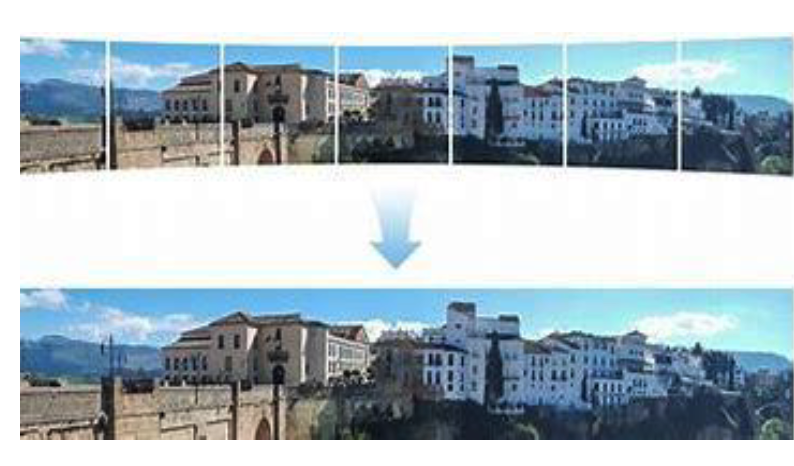
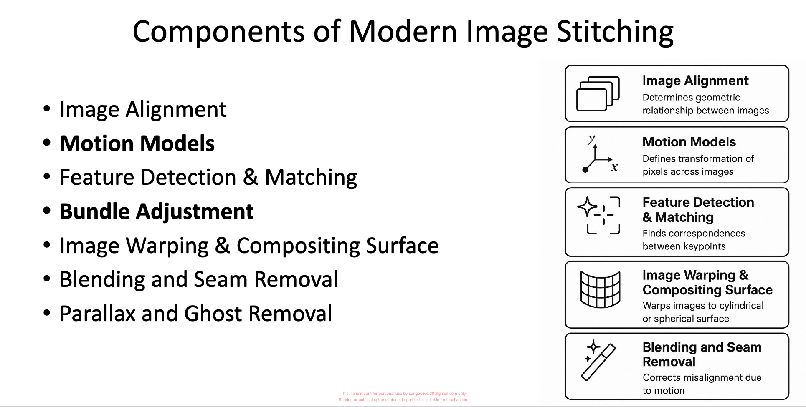

### Motion Models

Motion models defines how pixels from one image correspond to pixels in another image. They are used to describe the transformation between two images, such as translation, rotation, scaling, or more complex transformations. Motion models are essential for tasks like image stitching, where the goal is to align and blend multiple images together.

Types of Motion Models:
1. **Translation**: This model describes a simple shift of the image in the x and y directions. It is represented by a 2D vector that indicates the amount of shift in each direction.
2. **Rotation**: This model describes the rotation of the image around a specific point. It is represented by an angle of rotation and a center of rotation.
3. **Scaling**: This model describes the resizing of the image. It is represented by a scaling factor that indicates how much the image should be scaled in the x and y directions.
4. ### **Affine Transformation**: This model describes a combination of translation, rotation, and scaling. It is represented by a 3x3 matrix that defines the transformation between the two images.
5. ### **Homography**: This model describes a more complex transformation that can include perspective distortion. It is represented by a 3x3 matrix that defines the transformation between the two images, allowing for changes in perspective.

## Planar Perspective Motion Model (Homography)
The planar perspective motion model is a specific type of motion model that describes the transformation between two images when the scene is planar (i.e., all points lie on a single plane). This model is commonly used in image stitching and panorama creation, where the goal is to align and blend multiple images together.

The planar perspective motion model is represented by a homography matrix, which defines the transformation between the two images, allowing for changes in perspective. This model is particularly useful when the images being stitched together are taken from different viewpoints, as it can account for the perspective distortion that may occur in such cases

This is especially useful for:
- Image stitching of flat scenes like walls, documents, aerial maps.
- Photo mosaics with slight motion or rotation between shots.
- Panography or artistic collages where perspective changes are desired.

It relies on 2D transformation techniques to align the images, making it computationally efficient for planar scenes. However, it may not be suitable for scenes with significant depth variations or non-planar structures, where more complex motion models may be required.

Applications of the planar perspective motion model include:

- **Wall or Document Scanning**: When scanning flat surfaces like walls or documents, the planar perspective motion model can be used to correct for perspective distortion and create a seamless image.
- **Aerial Mapping**: In aerial mapping, images taken from different angles can be stitched together using the planar perspective motion model to create a comprehensive map of the area.
- **Photo Mosaics**: When creating photo mosaics, the planar perspective motion model can be used to align and blend multiple images together, even if there is slight motion or rotation between the shots.
- **Panography and Artistic Collages**: The planar perspective motion model can be used to create artistic collages or panography, where perspective changes are desired to create a visually interesting composition.

## Panorama 

Panorama is a wide-angle view of a scene that is created by stitching together multiple images. It allows for a broader perspective and can capture more of the scene than a single image. Panoramas are commonly used in photography, virtual tours, and immersive experiences.

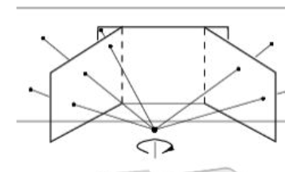

### How to strich a panorama?
1. **Capture Multiple Images**: Take multiple overlapping images of the scene from different angles.
2. **Feature Extraction**: Extract key features from the images, such as edges, corners, and textures.
3. **Matching**: Match the corresponding features between the images to establish a relationship between the different views.
4. **Homography Estimation**: Estimate the homography matrix that defines the transformation between the images, allowing for changes in perspective.
5. **Image Warping**: Warp the images based on the estimated homography to align them together.
6. **Blending**: Blend the aligned images together to create a seamless panorama. This can be done using techniques such as feathering, multi-band blending, or gradient domain blending to ensure smooth transitions between the images
7. **Output the Panorama**: The final output is a single panoramic image that captures the wide-angle view of the scene.

### Rotational Panoramas
Rotational panoramas are a specific type of panorama that is created by rotating the camera around a fixed point while capturing images. This technique allows for a 360-degree view of the scene, providing an immersive experience. Rotational panoramas are commonly used in virtual tours, real estate photography, and immersive experiences.

When the camera undergoes pure rotation, the transformation between the images can be modeled using a homography. This is because the scene is effectively planar from the perspective of the camera, and the transformation can be described by a 3x3 matrix that accounts for the rotation and perspective changes.

In practice, the camera should ideally rotate about its **optical center** or **nodal point**. This reduces **parallax error**, which means nearby and far objects remain aligned more accurately when the images are stitched together.

### Why Homography Works in Rotational Panoramas
If the camera only rotates and does not translate, the mapping between two images can be represented by a homography matrix $H$. The relationship is written as:

$$
x' \sim Hx
$$

For a calibrated camera, this homography can be expressed as:

$$
H = KRK^{-1}
$$

where:
1. $K$ is the camera intrinsic matrix,
2. $R$ is the rotation matrix,
3. $H$ is the homography matrix.

This shows that in rotational panoramas, the image transformation depends mainly on camera rotation and internal camera parameters.

### Steps in Creating a Rotational Panorama
1. **Fix the Camera Position**: Keep the camera at one position and rotate it horizontally or vertically.
2. **Capture Overlapping Images**: Take multiple images with sufficient overlap, usually 30% to 50%.
3. **Extract Features**: Detect important points such as corners or edges in the overlapping images.
4. **Match Features**: Find corresponding feature points between adjacent images.
5. **Estimate Homography**: Compute the homography matrix for aligning the images.
6. **Warp the Images**: Transform the images into a common coordinate system.
7. **Blend the Images**: Smoothly combine the warped images to remove visible seams.
8. **Generate Final Panorama**: Produce the complete wide-angle or 360-degree panoramic image.

### Advantages of Rotational Panoramas
1. They can cover a very wide field of view.
2. They are ideal for creating 360-degree panoramas.
3. Pure rotation makes image alignment easier using homography.
4. They are widely used in virtual tours, indoor mapping, and immersive media.

### Limitations of Rotational Panoramas
1. If the camera does not rotate about the correct center, parallax may occur.
2. Moving objects in the scene can create ghosting artifacts.
3. Large exposure differences between images may cause blending problems.
4. They are less suitable when the camera also translates significantly.

### Applications of Rotational Panoramas
1. **Virtual Tours**: Used in museums, campuses, hotels, and real estate websites.
2. **Street and Landscape Photography**: Used to capture wide outdoor scenes.
3. **Surveillance and Robotics**: Used to create a wider field of view of the environment.
4. **Immersive Media**: Used in VR and 360-degree visualization systems.

In summary, rotational panoramas are formed when the camera rotates about a fixed point, and the relation between the images can be described by a homography. Because only rotation is involved, this method is especially effective for wide-view and 360-degree panorama generation.

## Gap Closing 
Gap closing is a technique used in image-based rendering to fill in missing or occluded parts of an image. It is often used in applications such as virtual reality, where the goal is to create a seamless and immersive experience. Gap closing can be achieved using various methods, including interpolation, inpainting, and machine learning techniques.

what causes the gaps in the first place? Gaps can occur due to several reasons, such as:
1. **Occlusion**: When objects in the scene block the view of other objects, creating gaps in the image.
2. **Limited Field of View**: When the camera has a limited field of view, it may not capture the entire scene, resulting in gaps in the image.
3. **Motion Blur**: When the camera or objects in the scene are moving quickly, it can cause motion blur, which can create gaps in the image.
4. **Low Resolution**: When the resolution of the input images is low, it can result in gaps in the output image due to insufficient detail.
5. **Parallax**: When the camera moves between shots, objects at different depths may not align properly, creating gaps in the stitched image.
6. **Exposure Differences**: When there are significant differences in exposure between the input images, it can lead to visible seams or gaps in the blended panorama.
7. **Dynamic Scenes**: When the scene contains moving objects, they may appear in some images but not others, leading to gaps in the final panorama.
8. **Inaccurate Feature Matching**: If the feature matching process fails to find correct correspondences between images, it can result in misalignment and gaps in the stitched image.
9. **Camera Shake**: Unintentional camera movement during image capture can cause misalignment and gaps in the final panorama.
10. **Lens Distortion**: Distortion from the camera lens can cause misalignment between images, leading to gaps in the stitched panorama.
11. **Parallax Error**: When the camera does not rotate about its optical center, nearby and far objects may not align properly, creating gaps in the stitched image.
12. **Insufficient Overlap**: If the input images do not have enough overlap, it can be difficult to find enough corresponding features for accurate stitching, resulting in gaps in the final panorama.

### Methods for Gap Closing
1. **Interpolation**: This method estimates the missing pixel values based on the surrounding pixel values. It can be done using techniques such as linear interpolation, cubic interpolation, or more advanced methods like spline interpolation.
2. **Inpainting**: This technique fills in the missing areas of an image by using information from the surrounding pixels. It can be done using methods such as patch-based inpainting, where patches of the image are copied and blended to fill in the gaps.
3. **Machine Learning Techniques**: Deep learning models, such as convolutional neural networks (CNNs), can be trained to learn the patterns and structures in images, allowing them to generate plausible content for the missing areas. These models can be particularly effective for filling in large gaps or complex scenes where traditional methods may struggle

we can also use a combination of these methods to achieve better results. For example, interpolation can be used for small gaps, while inpainting or machine learning techniques can be used for larger gaps or more complex scenes.

## Cylindrical and Spherical coordinates
An Alternative to using  homography for panorama stitching is to use cylindrical or spherical coordinates. This approach can help to reduce distortion and improve the quality of the stitched panorama, especially when dealing with wide-angle images.

In cylindrical coordinates, the images are projected onto a cylinder, which can help to reduce distortion and improve the quality of the stitched panorama. This approach is particularly useful when dealing with wide-angle images, as it can help to preserve the straight lines in the scene. 

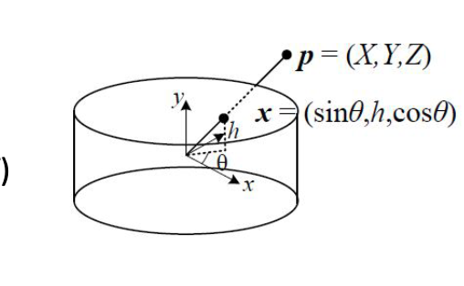

In spherical coordinates, the images are projected onto a sphere, which can help to reduce distortion and improve the quality of the stitched panorama. This approach is particularly useful when dealing with 360-degree panoramas, as it can help to preserve the overall shape of the scene.

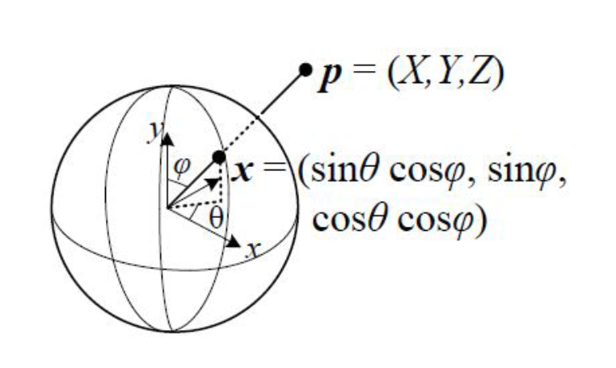

# Global Alignment
Global alignment means adjusting **all panorama images together** so that the final stitched panorama looks smooth and correct.

Think of it like joining many pieces of a belt into one circle. If each join is a little wrong, then at the end the two ends will not meet properly. The same thing happens in a **360-degree panorama**.

If we stitch images **one by one**, small errors keep adding up. After many images, this accumulated error can create a visible **gap** or mismatch at the end of the panorama.

One simple fix is called **gap closing**. In gap closing, the error is spread across all the images so that no single place has a big mismatch.

A better fix is to adjust **all the images at the same time**. This is called **global alignment**. Here, the system slightly changes the camera position or rotation values of all overlapping images together so that the whole panorama becomes more balanced.

This full adjustment is usually done using a math optimization method called **bundle adjustment**. Bundle adjustment was first used in **Structure from Motion (SfM)** and later became very useful in **panoramic image stitching**.

### Easy to Remember
1. Stitching one by one causes small errors.
2. Small errors add up and create a gap.
3. Gap closing spreads the error.
4. Bundle adjustment fixes all images together.

In summary, global alignment improves panorama stitching by correcting all images as one group instead of correcting them separately. This reduces error and gives a more seamless final panorama.

Global alignment means aligning many images in one consistent way so the full panorama looks smooth, without drift, visible seams, or mismatch at the ends.

In many systems, this is done by choosing a common reference and optimizing all image poses together. The main tool used for this is **bundle adjustment**.

### Steps in Global Alignment
1. **Initial Pairwise Alignment**: Start by aligning pairs of images using feature matching and homography estimation to get an initial estimate of the transformations between images.
2. **Construct a Global Graph**: Create a graph where each node represents an image and edges represent the transformations (homographies) between pairs of images.
3. **Bundle Adjustment**: Use bundle adjustment to optimize the camera parameters and the transformations between all images simultaneously. This step minimizes the overall reprojection error across all images, ensuring that the entire panorama is aligned consistently.
4. **Warp and Blend**: After optimization, warp all images according to the optimized transformations and blend them together to create the final panorama.

## Bundle Adjustment

### Why is it called Bundle Adjustment?
It is called **bundle adjustment** because the method adjusts many related image measurements together.

1. **Bundle** means a group of images and the points seen in them.
2. **Adjustment** means slightly correcting the camera parameters so the images fit together better.

So, the name simply means: **adjusting a bundle of images together**.

### Simple Meaning
Bundle adjustment is a method used to improve the alignment of many images by correcting camera settings such as:

1. position,
2. rotation,
3. focal length.

In 3D reconstruction problems, it can also adjust the 3D point positions. In panorama stitching, the main focus is usually on improving camera alignment across all images.

### Main Goal
The main goal of bundle adjustment is to reduce **reprojection error**.

Reprojection error means the difference between:

1. where a point is actually seen in the image, and
2. where the model says that point should appear.

If this difference is small, the alignment is good. If it is large, the alignment is poor.

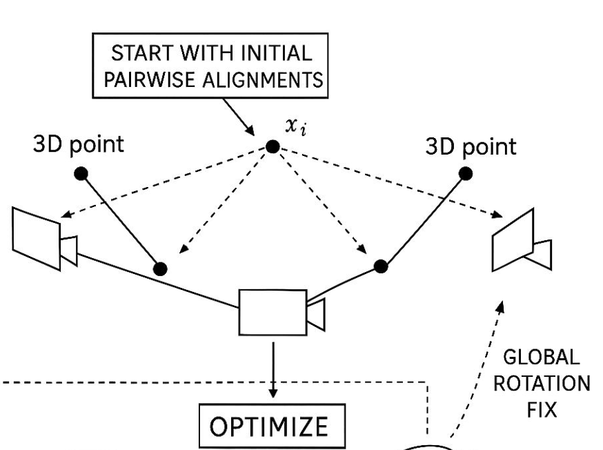

### Steps in Bundle Adjustment
1. **Start with an Initial Estimate**: Begin with an approximate alignment of the images.
2. **Project the Points**: Estimate where the matched points should appear in each image.
3. **Measure the Error**: Compare the predicted point positions with the actual detected positions.
4. **Adjust the Parameters**: Slightly change the camera parameters to reduce the error.
5. **Repeat**: Continue until the total error becomes as small as possible.
6. **Get the Final Result**: The images become globally better aligned.

### Where It Is Used
1. **Structure from Motion (SfM)**
2. **Panoramic Image Stitching**
3. **3D Reconstruction**
4. **Photogrammetry**

### Easy to Remember
1. Many images are stitched together.
2. Small errors appear in alignment.
3. Bundle adjustment corrects all images together.
4. The goal is to reduce reprojection error.

In summary, bundle adjustment is a refinement step that improves the overall alignment of many images at once. It is one of the most important tools for creating accurate panoramas and 3D reconstructions.

### Real Time example of Bundle Adjustment

In real time self driving car uses cameras to navigate. The car captures multiple images of the environment from different angles. Initially, the car's system may have an approximate understanding of where objects are based on these images. However, due to factors like camera noise, movement, and changing lighting conditions, the initial estimates of object positions may not be accurate.

This process is know as **Simultaneous Localization and Mapping (SLAM)**. In SLAM, the car needs to build a map of the environment while also keeping track of its own position within that map. Bundle adjustment is used in SLAM to refine the estimates of both the car's position and the positions of objects in the environment.

The Bundel adjustment process in SLAM involves:
1. **Capturing Images**: The car captures images from its cameras as it moves through the environment.
2. **Feature Extraction**: The system extracts features from the images, such as edges, corners, and textures.
3. **Matching Features**: The system matches these features across multiple images to establish correspondences between them. which helps in understanding how the car is moving and how objects are positioned relative to each other.
4. **Initial Estimation**: The system makes an initial estimate of the car's position and the positions of objects based on the matched features. with these initial estimates, the car can navigate and make decisions about its path.
5. **Bundle Adjustment**: The system uses bundle adjustment to refine these estimates by minimizing the reprojection error across all the images. This involves adjusting the camera parameters and the estimated positions of objects to achieve a more accurate representation of the environment. The optimization process takes into account the relationships between all the images and the features they contain, allowing for a more consistent and accurate map of the environment.
6. **Updated Map and Position**: After bundle adjustment, the car has a more accurate map of the environment and a better understanding of its own position within that map.

## Parallax Removal: 

Parallax is the visual effect where the position or direction of an objects appears to change when viewed from different viewpoints. In the context of image stitching and panorama creation, parallax can cause misalignment and distortion when images are taken from different angles or when the camera moves between shots. This can lead to visible seams, ghosting, or gaps in the final stitched image.

Parallax removal is a technique used in image-based rendering to eliminate the parallax effect, which occurs when objects at different depths appear to shift relative to each other as the viewpoint changes. This can create a sense of depth and realism in the rendered images, but it can also cause distortion and misalignment when stitching images together. Parallax removal aims to correct for this effect by adjusting the positions of objects in the images to create a more consistent and seamless panorama. This can be achieved using various methods, such as depth estimation, feature matching, and machine learning techniques. Parallax removal is particularly important in applications such as virtual reality and immersive experiences, where the goal is to create a seamless and realistic environment for the user.

This is generally caused by the fact that the camera is not rotating about its optical center, which leads to misalignment of nearby and far objects in the stitched image. Parallax removal techniques can help to correct for this misalignment and create a more seamless panorama.

The outcome of parallax removal is a more accurate and visually appealing panorama, with reduced distortion and improved alignment of objects at different depths. This can enhance the overall quality of the stitched image and provide a more immersive experience for the viewer.

Why parallac happens in the first place? Parallax occurs when the camera moves between shots, causing objects at different depths to shift relative to each other. This can lead to misalignment and distortion in the stitched image, especially when the camera does not rotate about its optical center. Parallax can also be caused by moving objects in the scene, which may appear in some images but not others, leading to gaps or ghosting in the final panorama. Additionally, parallax can occur when there are significant differences in exposure between the input images, which can create visible seams or gaps in the blended panorama. Parallax can also be caused by inaccurate feature matching, where the system fails to find correct correspondences between images, resulting in misalignment and gaps in the stitched image. Camera shake during image capture can also lead to parallax, as unintentional camera movement can cause misalignment between images. Finally, lens distortion from the camera can cause misalignment between images, leading to parallax in the stitched panorama.

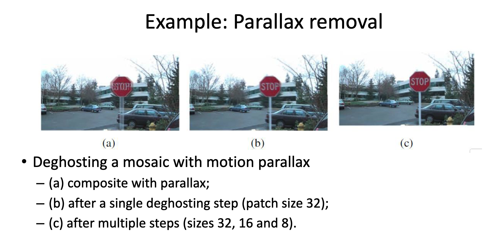

## Recognizing Panoramas

Recognizing panoramas means automatically finding **which images belong to the same panorama** and **in what order they should be stitched**.

This is important because users do not always capture images in a neat left-to-right order. In real life, people may:

1. take images in a non-linear order,
2. move forward or backward during capture,
3. start a new row at any position,
4. capture a 360-degree panorama where the first and last images also overlap.

So, before stitching starts, the system must first answer two questions:

1. Which images belong together?
2. What is the correct stitching order?

### Why Recognizing Panoramas Is Needed
For fully automatic panorama stitching, it is not enough to align only one pair of images. The system must automatically separate a large image collection into correct panorama groups.

For example, if a person captures many photos during travel, some photos may belong to one panorama, some to another, and some may not belong to any panorama at all. A good panorama system should identify these groups automatically.

### Brown and Lowe's Approach (2007)
One well-known approach for recognizing panoramas was proposed by **Brown and Lowe (2007)**. Their method works in several steps.

#### Step 1: Feature Extraction
Extract distinctive feature points from every image using **SIFT (Scale-Invariant Feature Transform)**.

SIFT is useful because its features are:

1. robust to scale changes,
2. robust to rotation,
3. good for matching the same scene across different images.

These features describe important image structures such as corners, edges, and blobs.

#### Step 2: Match Features Between All Image Pairs
Compare each image with other images and find matching feature points.

This is usually done using:

1. nearest-neighbor search in descriptor space,
2. **RANSAC** to remove wrong matches,
3. a geometric model such as homography or rotation.

If two images have enough correct matches, they are likely to overlap.

#### Step 3: Build an Overlap Graph
Create a graph in which:

1. **nodes = images**
2. **edges = valid overlaps between images**

This graph helps us understand which images are connected to each other.

If image A overlaps with B, and B overlaps with C, then A, B, and C may belong to the same panorama.

These connected groups are called **connected components**, and each connected component usually represents one panorama.

#### Step 4: Validate the Panorama Groups
After grouping, the system checks whether the images truly belong to the same scene.

This can be done by:

1. pixel-based comparison,
2. geometric verification,
3. heuristics to avoid false matches caused by repeated structures such as windows, tiles, or similar textures.

This step is important because sometimes two different images may look similar even though they are not part of the same panorama.

#### Step 5: Register and Blend Each Panorama
Once the panorama groups are found, each group is stitched separately.

The output becomes:

1. input images with pairwise matches,
2. images grouped into connected components,
3. each group registered and blended into a final stitched panorama.

### Simple Example
Suppose a user takes 12 images.

1. Images 1 to 5 belong to a mountain panorama.
2. Images 6 to 9 belong to a beach panorama.
3. Images 10 to 12 are unrelated photos.

The recognizing panoramas step will:

1. group images 1 to 5 together,
2. group images 6 to 9 together,
3. leave images 10 to 12 out or treat them separately.

### Easy to Remember
1. Extract features from all images.
2. Match features between image pairs.
3. Build a graph of overlapping images.
4. Find connected groups.
5. Stitch each group separately.

### Key Idea
The key idea of recognizing panoramas is to automatically discover which photos overlap and belong together, even when the user captures them in an unordered way.

In summary, recognizing panoramas is the step that makes fully automatic panorama stitching possible. It groups related images, finds the correct stitching order, and prepares each image set for final alignment and blending.

## Compositing:
Compositing is the process of combining multiple images into a single, seamless image. In the context of panorama stitching, compositing involves blending the aligned images together to create a final panoramic image that appears smooth and cohesive. This step is crucial for removing visible seams, correcting exposure differences, and ensuring that the final panorama looks natural.

Compositing  is  the  process  of  merging  aligned  images  into  a  single 
seamless mosaic or panorama. Once the images are registered (aligned 
in space), compositing decides:
– Where to place the final image on a surface (flat, cylindrical, spherical)
– Which pixels to take from each image in overlapping regions
– How to blend those pixels to make transitions smooth and natural

### Why Compositing Is Needed
After the images are aligned, they may still have visible seams where they overlap. This can be caused by differences in exposure, lighting, or slight misalignments. Compositing helps to blend these overlapping regions together to create a seamless final image. It also helps to correct for any color or brightness differences between the images, ensuring that the final panorama looks consistent and natural.

### Steps in Compositing
1. **Choose a Projection Surface**: Decide whether to project the images onto a flat plane, a cylinder, or a sphere. This choice depends on the type of panorama being created and the desired field of view.
2. **Determine Pixel Contributions**: For each pixel in the overlapping regions, determine which image(s) contribute to that pixel. This can be done using techniques such as alpha blending, where each pixel's contribution is weighted based on factors like distance from the seam or exposure differences.
3. **Blend the Pixels**: Use blending techniques to combine the pixel values from the contributing images. Common blending methods include:
   - **Feathering**: A simple method that weights pixels based on their distance from the seam, giving more weight to pixels farther from the seam.
   - **Multi-band Blending**: A more advanced method that blends images at multiple frequency bands, allowing for better handling of exposure differences and reducing visible seams.
   - **Gradient Domain Blending**: A technique that blends images based on the gradients of pixel values, which can help to preserve details and reduce artifacts in the blended image.
4. **Output the Final Panorama**: After blending, the final output is a single panoramic image that combines all the aligned images into a seamless mosaic.

### Choosing a compositing surface 
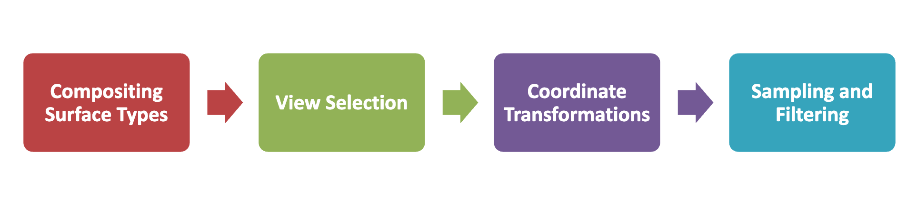

It is important to choose the right compositing surface based on the type of panorama being created. For example, a flat plane may be suitable for a narrow panorama, while a cylindrical or spherical surface may be better for wide-angle or 360-degree panoramas. The choice of surface can affect the appearance of the final panorama and help to reduce distortion in certain cases.

* Flat (Planar) Surface:
– Best for small fields of view (FOV).
– Uses a perspective projection: straight lines remain straight.
– One input image is selected as the reference, and others are warped to its coordinate system.
– Distortion becomes significant if FOV exceeds ~90°.
* Cylindrical or Spherical Surfaces:
– Better suited for large or 360° panoramas.
– Prevents extreme pixel stretching near image borders.
– Common in VR and full-scene visualization.
* Cube Maps and Other Polyhedra:
– Often used in environment mapping (as in graphics/gaming).
– Provide a structured way to cover the full viewing sphere using cube faces.
* Cartographic Projections:
– Alternative mappings developed in geography to represent the globe.

**Tradeoff**: There's a balance between local geometric accuracy (e.g., keeping lines straight) and even spatial sampling

### Pixel Selection and Weighting
It delves into how to determine which pixels from overlapping images  contribute to each part of a panorama and how to blend them to create seamless results—especially in the presence of real-world artifacts like  exposure variation, ghosting, or misalignment.

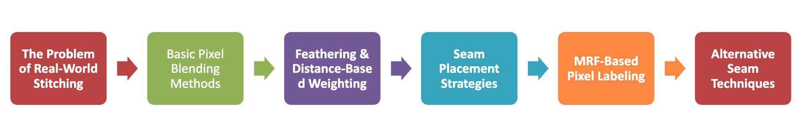

The Problem of Real-World Stitching
– Even when images are geometrically aligned (registered), blending them is non-trivial due to:
– Exposure mismatches → visible seams.
– Slight misalignments → blur.
– Moving objects → ghosting.

### Blending Techniques
This  final  part  of  the  image  stitching  pipeline  focuses  on  blending  techniques, which aim to produce a  visually seamless panorama despite challenges such as  exposure variations, slight misalignments, and moving objects

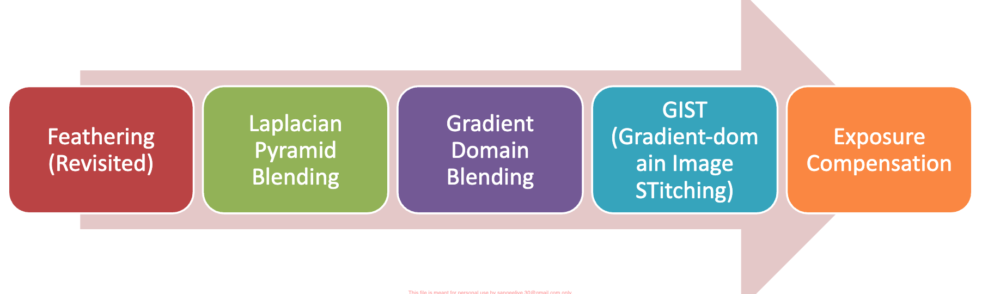

#### 1. Feathering (Revisited)
Feathering is the simplest blending method. In this method, pixels in the overlap area are combined using smooth weights.

The main idea is:
1. give higher weight to pixels far from the seam,
2. give lower weight to pixels close to the seam,
3. combine the two images gradually.

This creates a soft transition between the images.

**Advantages**:
1. easy to implement,
2. fast,
3. works well when images are already well aligned.

**Limitation**:
If there are exposure differences or misalignment, feathering may still leave visible blur or seams.

#### 2. Laplacian Pyramid Blending
Laplacian pyramid blending is a more advanced version of blending. It blends images at multiple scales or frequency levels.

The main idea is:
1. split the image into different levels of detail,
2. blend the low-frequency parts smoothly,
3. blend the high-frequency details carefully,
4. combine all levels back into the final image.

This method is also called **multi-band blending**.

It is useful because:
1. smooth brightness changes are handled in coarse levels,
2. edges and details are handled in fine levels,
3. seams become much less visible.

**Advantage**:
Better than simple feathering for handling exposure changes.

#### 3. Gradient Domain Blending
Gradient domain blending works on **image gradients** instead of directly blending pixel colors.

The main idea is:
1. preserve the important edge information from the images,
2. blend the gradient field smoothly,
3. reconstruct the final image from the blended gradients.

This helps to reduce visible seams and keeps structures more natural.

It is especially useful when:
1. there are lighting differences,
2. we want smoother transitions,
3. edges should remain sharp.

#### 4. GIST (Gradient-Domain Image Stitching)
GIST stands for **Gradient-Domain Image Stitching**. It is a stitching approach that uses gradient-domain blending ideas to make panoramas look more natural.

In simple words, instead of only averaging colors, GIST tries to preserve the structure of the scene while hiding seams.

It helps when:
1. there are strong exposure differences,
2. color changes are visible between images,
3. ordinary blending leaves noticeable artifacts.

So, GIST is like an improved blending strategy for difficult stitching cases.

#### 5. Exposure Compensation
Exposure compensation is used when input images have different brightness or color levels.

This can happen because:
1. lighting changes during capture,
2. camera auto-exposure changes from one image to another,
3. some parts of the scene are brighter or darker.

Exposure compensation adjusts the images before or during blending so that their brightness becomes more consistent.

**Benefit**:
It reduces visible seams caused by brightness mismatch.

### Easy Comparison of Blending Methods
1. **Feathering**: Simple and fast, but weak for big differences.
2. **Laplacian Pyramid Blending**: Better seam hiding using multiple scales.
3. **Gradient Domain Blending**: Preserves edges and handles color changes better.
4. **GIST**: Uses gradient-domain ideas for better panorama stitching.
5. **Exposure Compensation**: Fixes brightness mismatch before final blending.

### Key Idea
The purpose of blending is to make the stitched panorama look like **one single image**, not many separate images joined together.

In summary, blending techniques are used after image alignment to hide seams, reduce exposure differences, preserve details, and create a visually smooth panorama.

The Final Composites computed by variety of algorithms 

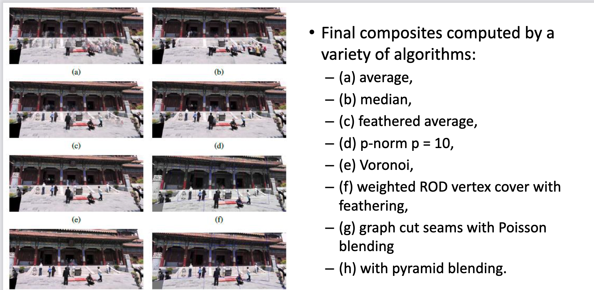