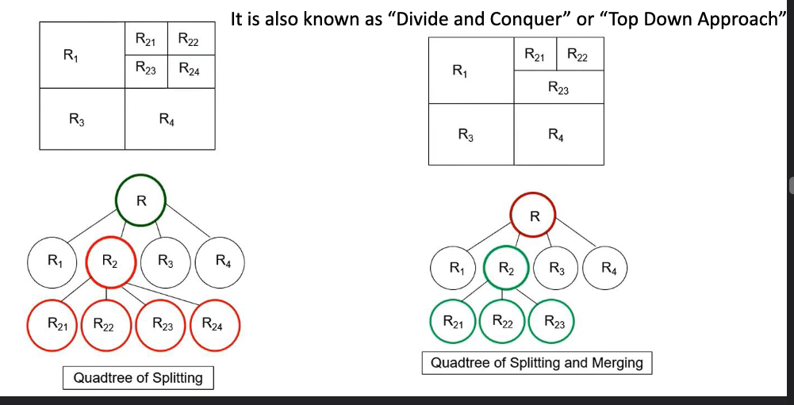
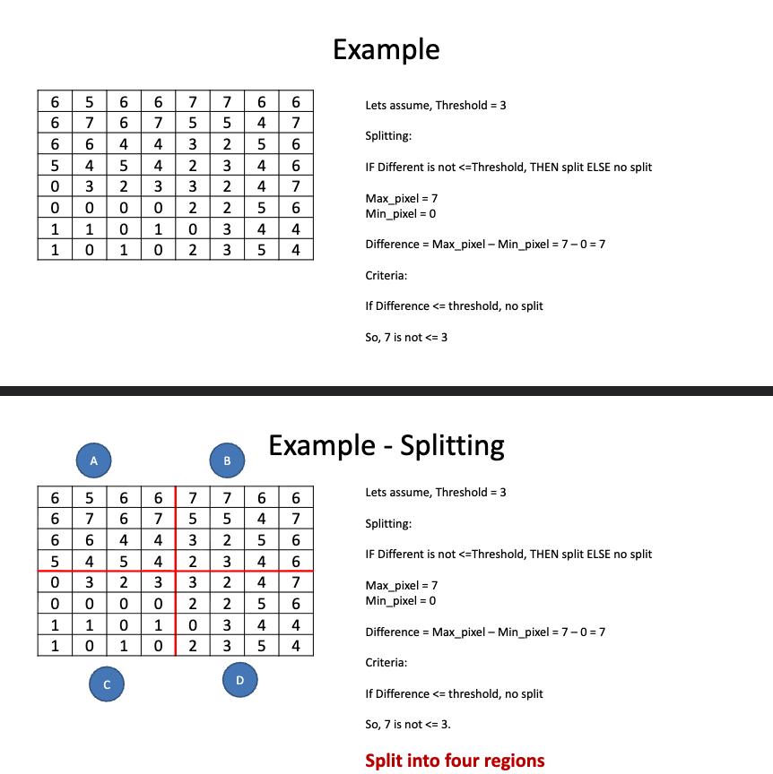
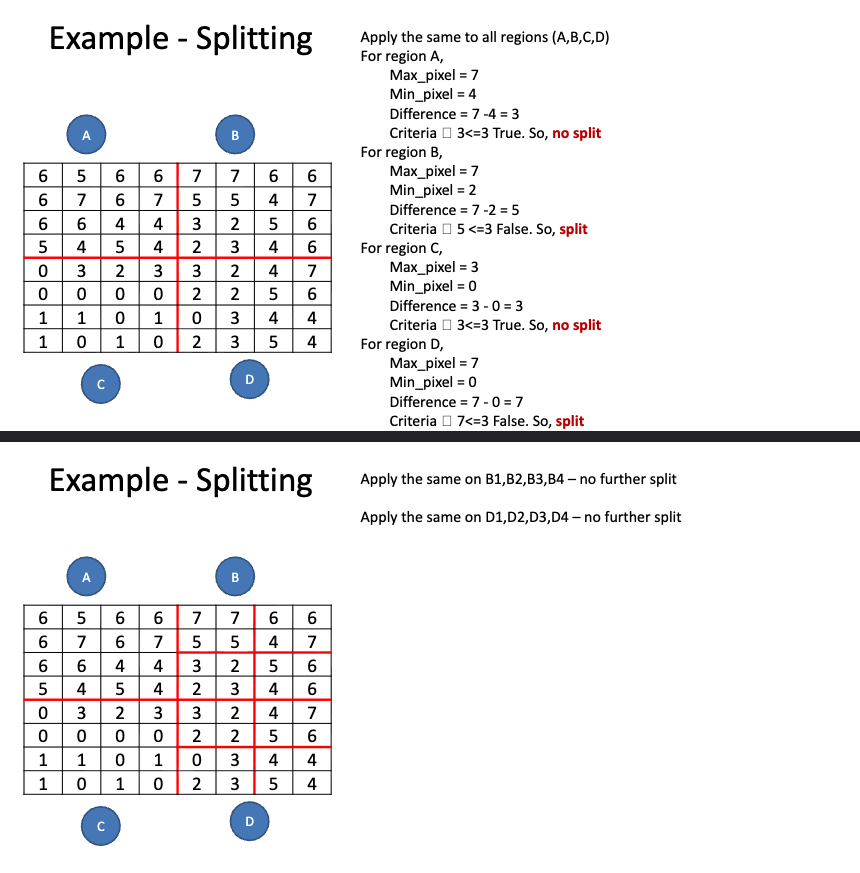
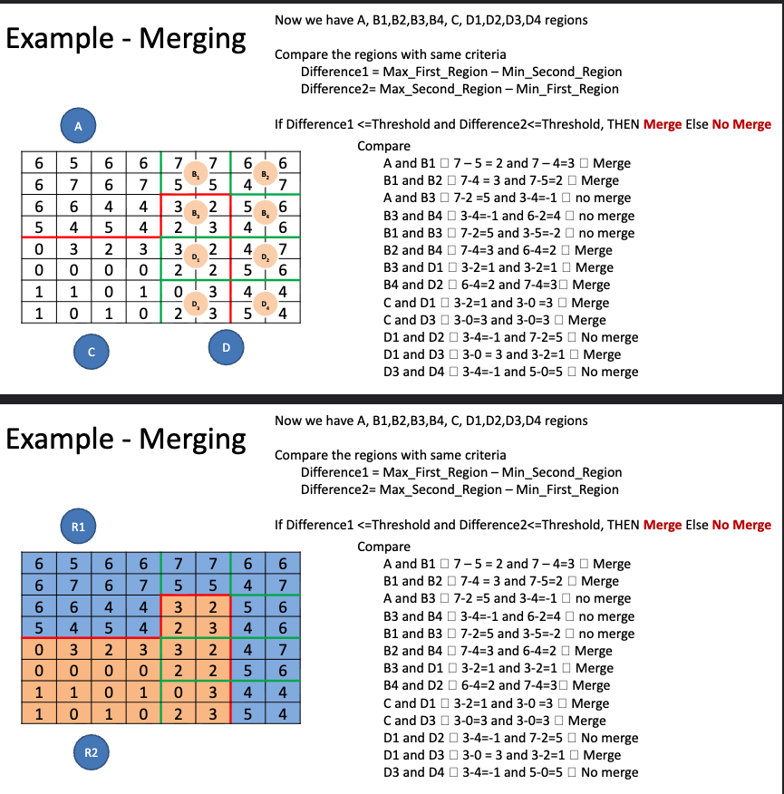
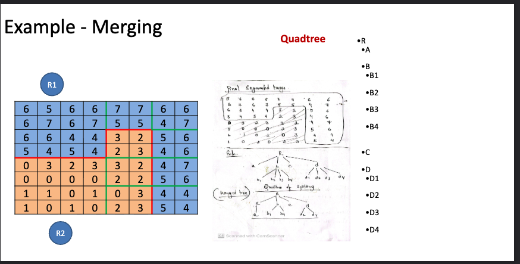
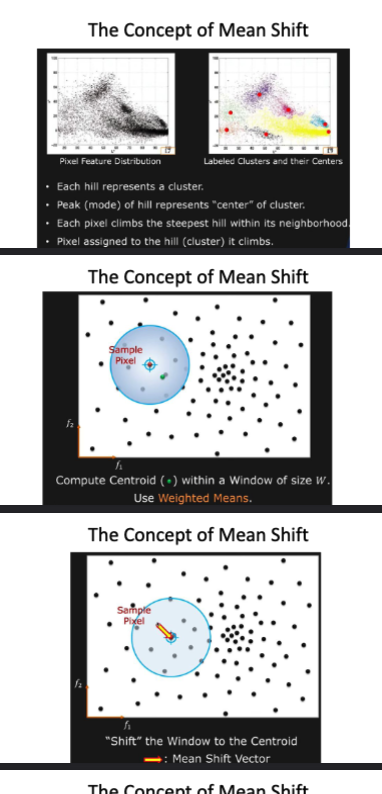
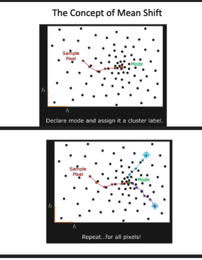

> **Active contours -Snakes -Dynamic snakes and Condensation -Scissors, Level Sets -Split and merge -Mean shift and mode finding -Normalized cuts -Graph cuts and energy-based methods -2D and 3D feature-based alignment -Pose estimation**


# Active Contours - Snakes

Active contours, also known as snakes, are a powerful tool in image processing and computer vision for object detection and segmentation. They are used to find the boundaries of objects in images by evolving a curve (the snake) towards the desired features.

Type of Active Contours:
1. **Parametric Snakes**: The contour is represented explicitly as $\mathbf{v}(s) = (x(s), y(s))$, where $s$ is the arc-length parameter. Control points move under internal (smoothness) and external (edge) forces.
2. **Geometric Snakes**: The contour is represented implicitly using level set methods, allowing it to handle topological changes like splitting and merging naturally.

the three main forces that influence the movement of the snake:
1. **Internal Forces**: These forces maintain the smoothness and continuity of the snake. They include tension (which keeps the snake tight) and rigidity (which prevents it from bending too much).
2. **External Forces**: These forces attract the snake towards the edges of the object in the image. They are typically derived from the image gradient, which highlights areas of high intensity change (edges).
3. **Constraint Forces**: These forces can be added to guide the snake towards specific features or to prevent it from moving in certain directions.

---

### Internal Bending Energy of the Contour

The internal energy is split into two constraints — both measure how much the contour position $\mathbf{v}$ changes on every iteration:

$$E_{contour} = \alpha \cdot \text{Elastic} + \beta \cdot \text{Smooth}$$

**Elastic** (first-order / first derivative of the contour vector):

$$\text{Elastic} = \left\| \frac{\partial \mathbf{v}}{\partial t} \right\|^2 = \sum_{i=1}^{n} \left[ (x_{i+1} - x_i)^2 + (y_{i+1} - y_i)^2 \right]$$

> Measures how much adjacent points stretch — penalizes long gaps between control points.

**Smooth** (second-order / second derivative of the contour vector):

$$\text{Smooth} = \left\| \frac{\partial^2 \mathbf{v}}{\partial t^2} \right\|^2 = \sum_{i=1}^{n} \left[ (x_{i+1} - 2x_i + x_{i-1})^2 + (y_{i+1} - 2y_i + y_{i-1})^2 \right]$$

> Measures how much the contour bends — penalizes sharp corners (uses finite differences).

Both are computed using **finite differences** at each iteration.

---

### Total Energy

$$E_{Total} = E_{contour} + E_{image}$$

where $E_{image} = -\text{(Sum of Gradient Magnitude Squared)}$

> The negative sign means the snake is attracted to **strong edges** (high gradient = low energy).

**Goal: minimize $E_{Total}$** — the snake settles where the contour is smooth AND sits on strong edges.

---

### Mathematical Formulation

The contour is represented as a parametric curve:

$$C(s) = (x(s),\ y(s)), \quad s \in [0, 1]$$

where $s$ is the contour parameter.

**Energy Function** — the snake moves to minimize:

$$E_{snake} = E_{internal} + E_{external}$$

**Internal Energy** ($E_{internal}$) — ensures smoothness:

$$E_{internal} = \alpha \left\| C'(s) \right\|^2 + \beta \left\| C''(s) \right\|^2$$

- $\alpha$ controls **elasticity** (resistance to stretching / length preservation)
- $\beta$ controls **rigidity** (resistance to bending / curvature smoothness)

**External Energy** ($E_{external}$) — attracts the snake to object boundaries:

$$E_{external} = -\nabla I(x, y)^2$$

where $\nabla I(x, y)$ is the image gradient. Higher gradient values pull the snake towards edges.

---

### Numerical Example

**Setup:** A simple 3-point contour with two control points:

$$C = \{(2, 3),\ (5, 7),\ (8, 5)\}$$

Parameters: $\alpha = 0.5$ (elasticity), $\beta = 0.2$ (smoothness).  
Image gradient values: $\nabla I(2,3) = 4$, $\nabla I(5,7) = 5$, $\nabla I(8,5) = -1$.  
Weighted total energy: $\mathbf{-4.7}$.

**Step 1: Compute Internal Energy**

*Elasticity term* (first derivative):

$$E_{elastic} = 0.5 \times \sum |C_i - C_{i-1}|$$

$$= 0.5 \times \left(\sqrt{(5-2)^2 + (7-3)^2} + \sqrt{(8-5)^2 + (5-7)^2}\right)$$

$$= 0.5 \times \left(\sqrt{9+16} + \sqrt{9+4}\right) = 0.5 \times (5 + \sqrt{13})$$

$$= 0.5 \times 8.60 \approx \mathbf{3.04}$$

*Curvature term* (second derivative):

$$E_{curvature} = 0.2 \times \sum |C_{i+1} - 2C_i + C_{i-1}|$$

$$= 0.2 \times |(8,5) - 2(5,7) + (2,3)|$$

$$= 0.2 \times |(8 - 10 + 2,\ 5 - 14 + 3)|$$

$$= 0.2 \times |(0, -6)| = 0.2 \times 6 = \mathbf{0.2}$$

**Step 2: Compute External Energy**

$$E_{external} = -\sum |\nabla I(C_i)|$$

$$= -( |4| + |-5| + |-1|) \times (-0.1) = \mathbf{-10.5}\ \text{(weighted)}$$

**Step 3: Compute Total Energy**

$$E_{snake} = E_{internal} + E_{external} = (3.04 + 0.2) + (-10.5) = 3.24 - 10.5 = \mathbf{-7.66}$$

> A **lower (more negative) total energy** means the snake is well-positioned on strong edges with a smooth shape.

---

### Problems with Basic Active Contours

- **Never sees strong edges that are far away**
  - Fixed by: creating a gradient vector field (GVF) over the entire image
- **Noisy images create many local gradients** (snake gets stuck in wrong minima)
  - Fixed by: smoothing the image before applying the snake
- **Cannot wrap around multiple closed objects**
- **Cannot detect holes** (single contour topology)

> These limitations motivated modern methods like **Level Sets**, which handle topology changes naturally.

---

## Contour-Based Image Segmentation Methods

Three methods to find object boundaries in images — each uses a different approach to evolve or compute a contour along edges.


## 1. Snakes — Energy Minimization

The snake evolves by minimizing a total energy function $E_{snake}$ that balances internal shape regularity against external image-driven attraction:

$$E_{snake} = E_{internal} + E_{external} + E_{constraint}$$

- **Internal Energy** ($E_{int}$): Penalizes deviations from smoothness and continuity. It has two sub-terms:
  - *Elasticity* (first-order): keeps the curve taut, resisting stretching.
  - *Rigidity* (second-order): resists bending, maintaining curvature regularity.
- **External Energy** ($E_{ext}$): Attracts the snake toward strong image edges. Derived from the image gradient magnitude $|\nabla I|$; the snake is pulled to regions of high intensity change.
- **Constraint Energy** ($E_{con}$): Optional user-defined term that encodes prior knowledge or interactive constraints (e.g., attraction toward user-clicked points or repulsion from irrelevant regions).

The minimization is typically solved iteratively using dynamic programming, finite differences, or variational calculus (Euler-Lagrange equations).

---

## 2. Intelligent Scissors (Live-Wire)

Intelligent scissors is an **interactive** segmentation technique in which the user clicks seed points along an object's boundary and the algorithm automatically computes the optimal connecting path.

**Key idea:** The boundary-finding problem is cast as a shortest-path problem on a graph derived from the image:
- Each pixel is a node; edge weights encode the likelihood of being on a boundary (low gradient → high cost; strong edge → low cost).
- Dijkstra's algorithm finds the minimum-cost path from the seed to the cursor in real time, causing the path to "snap" to nearby edges.

**Strengths:**
- Handles complex or irregular shapes with minimal user effort.
- Works well when edges are partially weak or noisy, since the user guides the overall direction.
- Real-time feedback lets the user correct the path interactively.

### How It Works — Step by Step

**Step 1: Convert the Image to Grayscale**

Edge detection works on a single-channel image, so RGB is converted first:

$$I_{gray}(x, y) = 0.299R + 0.587G + 0.114B$$

**Step 2: Compute Edge Features (Gradient Calculation)**

Edges are detected using the gradient magnitude from the Sobel operator:

$$G_x = \frac{\partial I}{\partial x} * S_x, \qquad G_y = \frac{\partial I}{\partial y} * S_y$$

where $S_x$ and $S_y$ are the Sobel kernels:

$$S_x = \begin{bmatrix} -1 & 0 & +1 \\ -2 & 0 & +2 \\ -1 & 0 & +1 \end{bmatrix}, \qquad S_y = \begin{bmatrix} -1 & -2 & -1 \\ 0 & 0 & 0 \\ +1 & +2 & +1 \end{bmatrix}$$

**Step 3: Compute the Cost Function**

Paths should follow strong edges, so high gradient = low cost:

$$C(x, y) = 255 - \left(\frac{G(x,y) - G_{min}}{G_{max} - G_{min}} \times 255\right)$$

- High gradient → **Low cost** (preferred by the algorithm)
- Low gradient → **High cost** (avoided)

**Step 4: Graph Representation & Neighbouring Pixels**

The image is a graph — each pixel is a node connected to its 8 neighbours:

$$N(p) = \{(x \pm 1,\ y),\ (x,\ y \pm 1),\ (x \pm 1,\ y \pm 1)\}$$

Edge weight between neighbouring pixels $p$ and $q$:

$$w(p, q) = C(q)$$

**Step 5: Compute Shortest Path using Dijkstra's Algorithm**

Once a seed point is placed, Dijkstra's algorithm finds the shortest (minimum cost) path to every pixel.

1. **Initialise:** Set all distances to $\infty$; set seed distance $D(x_s, y_s) = 0$
2. **Priority Queue (Min-Heap):** Always process the pixel with lowest cost next: $(x, y) = \text{argmin}(D)$
3. **Update Neighbours:** For each neighbour $q$ of current pixel $p$: $D(q) = \min(D(q),\ D(p) + w(p, q))$
4. **Repeat** until all pixels are processed

The path "snaps" to edges because edge pixels have the lowest cost.

---

### Case Study: Tumor Segmentation in MRI Scans

**Problem:** Doctors need to extract tumor boundaries from MRI scans for diagnosis and treatment planning.

**Challenges:**
- Irregular tumor shapes
- Low contrast between tumor and surrounding tissue
- Manual annotation is slow and subjective

**Solution using Intelligent Scissors:**
1. Doctor places a seed point at the tumor edge
2. Intelligent Scissors automatically finds the best path along the tumor boundary
3. Additional points refine the segmentation
4. Final contour is extracted

**Results:**
- Improved tumor segmentation accuracy vs. manual tracing
- Reduced annotation time by 40%
- Enhanced treatment planning with precise boundaries

**Impact:**
- Enabled automated tumor volume measurement
- Improved radiotherapy planning accuracy

---

## 3. Level Set Methods

Instead of tracking a contour directly (like snakes), level set methods **embed** the contour inside a higher-dimensional function $\phi(\mathbf{x}, t)$ and track it as the zero crossing:

$$\text{Contour} = \{ \mathbf{x} \mid \phi(\mathbf{x}, t) = 0 \}$$

**Intuition:** Think of $\phi$ as a terrain — the contour is where the terrain is exactly at sea level (zero). Regions inside the object have $\phi > 0$, outside have $\phi < 0$ (or vice versa).

### How it evolves

$\phi$ is updated over time using a PDE (Partial Differential Equation):

$$\underbrace{\frac{\partial \phi}{\partial t}}_{\text{change over time}} + F \underbrace{|\nabla \phi|}_{\text{change over space}} = 0$$

- $\frac{\partial \phi}{\partial t}$ — how $\phi$ changes over **time**
- $|\nabla \phi|$ — how $\phi$ changes over **space** (the gradient magnitude)
- $F$ is the **speed function** — controls how fast and in which direction the contour moves, based on image features like edge strength or region intensity.
- When $F > 0$, the contour expands; when $F < 0$, it shrinks.

### Why it's better than parametric snakes

| Problem with Snakes | How Level Sets Fix It |
|---|---|
| Can't split/merge contours | Handles topology changes automatically |
| Parameterization breaks for complex shapes | No explicit parameterization needed |
| Hard to extend to 3D | Naturally generalizes to 3D surfaces |


| Method | Style | Topology Change | Interaction |
|---|---|---|---|
| Snakes (Energy Min.) | Parametric | No | Semi-auto |
| Intelligent Scissors | Graph / Shortest Path | N/A | Interactive |
| Level Sets | Implicit / PDE | Yes | Semi-auto |


---


# Applications of Active Contours
- **Medical Imaging**: Segmenting organs, tumors, blood vessels in MRI/CT scans.
  - Case Study: 
    * lung nodule detection in CT scans using level sets to capture irregular shapes.
    * Segmentation of tumors in MRI using snakes to delineate boundaries for treatment planning.
- **Object Tracking**: Following moving objects in video sequences.
  - Case Study:
    * Tracking a soccer ball in a video using snakes that adapt to the ball's changing position and shape.
- **Shape Analysis**: Extracting shape features for classification or recognition.
  - Case Study:
    * Analyzing leaf shapes in botanical images using level sets to capture complex contours for species identification.
- **Image Editing**: Interactive segmentation for photo editing applications.
  - Case Study:
    * Using intelligent scissors in Photoshop to quickly select and cut out objects from a background for compositing.

# Dynamic Snakes and Condensation
Dynamic snakes are an extension of the traditional snake model that incorporates temporal dynamics, allowing the contour to evolve over time in response to changing image data. This is particularly useful for tracking moving objects in video sequences.

The condensation algorithm, also known as the particle filter, is a probabilistic method used to estimate the state of a system over time. In the context of active contours, it can be used to track the contour's position and shape as it evolves in response to changing image data. The algorithm works by maintaining a set of particles that represent possible states of the contour, and updating these particles based on the observed image data and a motion model.

Key features:
- **Temporal Evolution**: Contour updates itself frame by frame — tracks moving objects over time.
- **Probabilistic Tracking**: Keeps multiple guesses about where the contour is — handles occlusions and noise gracefully.
- **Flexibility**: Works with different motion types and image features — general purpose tracker.

Dynamic snakes introduces a temporal component to the energy minimization framework, allowing the contour to adapt to changes in the image over time. It is mathematically represented as:

$$E_{snake}(t) = E_{internal}(t) + E_{external}(t) + E_{constraint}(t)$$

where,
- $E_{internal}(t)$: Time-varying internal energy that maintains contour smoothness and continuity.
- $E_{external}(t)$: Time-varying external energy that attracts the contour to image features (edges) that may change over time.
- $E_{constraint}(t)$: Time-varying constraint energy that can incorporate user input or prior knowledge to guide the contour's evolution.

The condensation algorithm is used to estimate the contour's state at each time step by maintaining a set of particles that represent possible configurations of the contour. Each particle is assigned a weight based on how well it matches the observed image data, and the particles are resampled to focus on the most likely configurations.

How the condensation algorithm works is that:
1. **Initialization**: A set of particles is generated to represent possible states of the contour.
2. **Prediction**: Each particle is propagated forward in time based on a motion model that describes how the contour is expected to move.
3. **Update**: The weights of the particles are updated based on how well they match the observed image data, typically using a likelihood function that measures the similarity between the predicted contour and the actual image features.
4. **Resampling**: Particles are resampled based on their weights to focus on the most likely configurations of the contour, allowing the algorithm to adapt to changes in the image over time.

Applications of dynamic snakes and condensation include:
- **Object Tracking in Video**: Tracking moving objects such as vehicles, people, or animals in video sequences, even in the presence of occlusions or noise.
- **Medical Imaging**: Tracking the movement of organs or tumors in dynamic imaging modalities like ultrasound or real-time MRI.
- **Robotics**: Tracking the position and shape of objects in a robot's environment for navigation and manipulation.
- **Augmented Reality**: Tracking objects in real-time to overlay virtual content accurately in a dynamic scene.


# Scissors
Scissors, also known as intelligent scissors or live-wire, is an interactive image segmentation technique that allows users to quickly and accurately delineate object boundaries in images. The method is based on the concept of finding the optimal path between user-defined seed points along the edges of an object.

The key idea behind scissors is to treat the image as a graph, where each pixel is a node and edges between nodes are weighted based on the likelihood of being part of an object boundary. The user clicks on seed points along the desired boundary, and the algorithm computes the optimal path connecting these points by minimizing a cost function that incorporates edge strength and continuity.

The cost function typically includes:
- **Edge Strength**: The cost is lower for pixels that are likely to be on an edge, which can be determined by the gradient magnitude of the image.
- **Continuity**: The cost is also influenced by the distance between pixels, encouraging smoother paths that follow the natural contours of the object.

Step by step, the algorithm works as follows:
1. **Preprocessing**: The image is converted to grayscale and processed to compute edge strength, often using a gradient operator like Sobel or Canny.
2. **Graph Construction**: A graph is constructed where each pixel is a node, and edges between nodes are weighted based on the computed edge strength and spatial distance.
3. **User Interaction**: The user clicks on seed points along the desired boundary of the object.
4. **Path Finding**: The algorithm uses a shortest path algorithm (like Dijkstra's algorithm) to find the optimal path between the seed points, which corresponds to the object boundary.


# Level Sets 
Level set methods are a powerful mathematical framework for tracking the evolution of contours and surfaces in image processing and computer vision. The key idea is to represent the contour as the zero level set of a higher-dimensional function, typically denoted as $\phi(\mathbf{x}, t)$, where $\mathbf{x}$ is the spatial coordinate and $t$ is time. The contour is implicitly defined as the set of points where $\phi$ equals zero:    

$$\text{Contour} = \{ \mathbf{x} \mid \phi(\mathbf{x}, t) = 0 \}$$

where,
- $\phi(\mathbf{x}, t)$ is the level set function that evolves over time.
- The contour is represented as the zero level set of $\phi$, meaning that points where $\phi$ is positive are inside the contour, and points where $\phi$ is negative are outside the contour.

Types of level set methods include:
- Binary level sets: The function $\phi$ takes on only two values (e.g., +1 inside the contour and -1 outside).
- Enchanted level sets: The function $\phi$ can take on a range of values, allowing for more complex contour shapes and topological changes.

The evolution of the level set function $\phi$ is governed by a partial differential equation (PDE) that describes how the contour moves over time. The PDE typically takes the form:
$$\frac{\partial \phi}{\partial t} + F |\nabla \phi| = 0$$

where,
- $\frac{\partial \phi}{\partial t}$ represents the change of the level set function over time.
- $|\nabla \phi|$ is the magnitude of the spatial gradient of $\phi$, which indicates how the level set function changes in space.
- $F$ is the speed function that controls the evolution of the contour, which can depend on image features such as edge strength, curvature, or region-based statistics.

The level set method allows for the natural handling of topological changes, such as splitting and merging of contours, without the need for explicit parameterization. This makes it particularly useful for applications like image segmentation, where the shape and topology of the object of interest may be complex and may change over time.

Applications of level set methods include:
- **Image Segmentation**: Segmenting objects in images, especially when the objects have complex shapes or when the boundaries are not well-defined.
- **Shape Analysis**: Analyzing and comparing shapes in images, such as in medical imaging for organ or tumor analysis.
- **Motion Tracking**: Tracking the movement of objects in video sequences, where the shape and position of the object may change over time.
- **3D Surface Reconstruction**: Reconstructing 3D surfaces from 2D image data, such as in medical imaging or computer graphics.

# Split and Merge
Split and merge is a hierarchical image segmentation technique that recursively divides an image into smaller regions (split) and then merges adjacent regions based on similarity criteria (merge). The process continues until a stopping condition is met, such as a minimum region size or a maximum number of regions.

This method is useful for scene analysis, object detection, and medical imaging. 

Steps involved in split and merge:
1. **Initialization**: Start with the entire image as a single region.
2. **Split**: If a region does not meet a homogeneity criterion (e.g., variance of pixel intensities is above a threshold), split it into smaller sub-regions (e.g., quadrants).
3. **Merge**: After splitting, adjacent regions are compared based on a similarity measure (e.g., mean intensity, texture) and merged if they are similar enough.
4. **Termination**: The process continues until all regions meet the homogeneity criterion or a predefined number of regions is reached.

It is also know as "Divide and Conquer" approach to image segmentation, where the image is recursively divided and then combined based on similarity. This method is particularly effective for segmenting images with varying textures and intensities, as it allows for adaptive region sizes based on local image characteristics.

### Quadtree Representation

Split and Merge is implemented using a **quadtree** — a tree data structure where each internal node represents a region that was split into exactly **4 quadrants**.

```
         [Entire Image]
               |
     ┌────┬────┬────┐
    [Q1] [Q2] [Q3] [Q4]
               |
          ┌────┬────┬────┐
         [Q3a][Q3b][Q3c][Q3d]
```

- **Root** = the whole image
- Each **internal node** = a region that failed the homogeneity test → split into 4 children
- Each **leaf node** = a uniform region (passed the test) → no further splitting
- **Merge step** = after the tree is built, adjacent leaf nodes with similar properties are merged



> The image above shows the spatial partition of the image at each level of the quadtree.



> Regions that are too heterogeneous (high variance) get subdivided further.



> After splitting, adjacent similar regions are merged — reducing over-segmentation.



> The final segmentation result after all split and merge passes.

### Quadtree Split Example

Given a region $R$ with pixel intensities, the **split condition** is:

$$\text{Split if: } \text{Var}(R) > \theta$$

where $\theta$ is a threshold. If variance exceeds $\theta$, the region is divided into four equal quadrants $R_1, R_2, R_3, R_4$.

The **merge condition** for two adjacent regions $R_i$ and $R_j$:

$$\text{Merge if: } |\bar{I}(R_i) - \bar{I}(R_j)| < \delta$$

where $\bar{I}$ is the mean intensity and $\delta$ is the merge threshold.



> The quadtree structure maps directly to the spatial hierarchy of the segmented image — deeper levels = finer detail.


# Mean Shift and Mode Finding

**One-line idea:** Keep sliding a window toward the densest cluster of points until it stops — that peak is the "mode" (cluster center).

Mean shift is a **non-parametric** clustering technique — it doesn't need you to specify the number of clusters. It finds clusters by locating the **modes** (peaks) of the data distribution.

> **Mode** = the region with the highest density of data points.

---

## The Core Concept

Imagine placing a circle (window) on a point in feature space:
1. Compute the **centroid** of all points inside the window
2. **Shift** the window to that centroid (the "mean shift" vector)
3. Repeat until the window stops moving → it has found a **mode** (peak/cluster center)

Each pixel "climbs the hill" toward the nearest peak. Pixels that converge to the same peak belong to the same cluster.

```
Start → Compute centroid in window → Shift window → Repeat → Converge at Mode
```

---

## Mean Shift Algorithm

**Given:** $N$ pixels in feature space  
**Goal:** Find modes (cluster centers) of the distribution

**Steps:**
1. Set $m_i = f_i$ (initial mean for pixel $i$)
2. For each mean $m_i$, repeat:
   - a. Place window of size $W$ around $m_i$
   - b. Compute centroid $m$ of all points within the window → set $m_i = m$
   - c. Stop when the shift in $m_i$ is less than threshold $\varepsilon$ → $m_i$ is the **mode**
3. Label all pixels with the same mode as the same cluster

**Full algorithm:**
- Choose kernel and bandwidth $W$
- For each point:
  - a. Centre a window on that point
  - b. Compute the mean of data in the window
  - c. Re-centre the window at the new mean
  - d. Repeat (b, c) until convergence
- Assign points that converge to nearby modes → same cluster




---

## Segmentation by Mean Shift

For image segmentation, features per pixel include: **color, gradients, texture, position**.

Steps:
1. Compute features for each pixel (color, gradients, texture, etc.)
2. Set kernel size for features $K_s$ and position $K_r$
3. Initialise windows at individual pixel locations
4. Perform mean shift for each window until convergence
5. Merge windows that are within width of $K_s$ and $K_r$

---

## Mean Shift vs K-Means

| | K-Means | Mean Shift |
|---|---|---|
| Number of clusters | Must specify $k$ | Found automatically |
| Cluster shape | Assumes spherical | Any shape |
| Sensitive to init | Yes | No |
| Speed | Fast | Slower |

> Mean Shift finds natural clusters in the data — no need to guess $k$ upfront.

---

## Key Terms to Remember

| Term | Meaning |
|---|---|
| **Mode** | Peak of the density — the cluster center |
| **Window / Bandwidth** | The search radius $W$ around each point |
| **Mean Shift Vector** | Direction from current point → centroid of window |
| **Convergence** | When the shift becomes smaller than threshold $\varepsilon$ |
| **Feature Space** | Color + position space where clustering happens |

---

# Normalized Cuts

The normalized cut method is a graph-based image segmentation technique that partitions an image into segments by treating the image as a graph and cutting it into segments based on edge weights that represent pixel similarity. The key idea is to find a partition of the graph that minimizes the normalized cut criterion, which balances the cut cost with the association of the segments to the entire graph.


**One-line idea:** Treat the image as a graph, then cut it into segments by removing edges — but penalize cuts that are too small or unbalanced.

## Core Idea

- Each **pixel = node** in a graph
- Edge weight between two pixels = their **similarity** (brightness, color, distance)
- **Goal:** Partition pixels into groups (segments) by cutting edges with low weight

The graph $G = (V, E)$ where:
- $V$ = all pixels (can be a subset like interest points)
- $E$ = edges between pixels, weighted by similarity (brightness, intensity, distance)

## Why "Normalized"?

A plain **min-cut** tends to just cut off tiny isolated nodes (bad segments).  
The **normalized cut** fixes this by penalizing cuts that produce small or unbalanced partitions:

$$\text{Ncut}(A, B) = \frac{\text{cut}(A,B)}{\text{assoc}(A,V)} + \frac{\text{cut}(A,B)}{\text{assoc}(B,V)}$$

- $\text{cut}(A, B)$ = sum of weights of edges crossing the partition
- $\text{assoc}(A, V)$ = total edge weight from $A$ to all nodes
- A good cut has **low Ncut** — balanced segments with weak connections between them

---

# Graph Cuts and Energy-Based Methods

> **Definition:** A method that separates an image into foreground and background by modelling it as a graph and finding the optimal cut — the split that best respects both what each pixel looks like and how it relates to its neighbours.

**One-line idea:** Label every pixel as foreground or background by finding the cut in a graph that maximizes the quality score (or minimizes energy).

## Setup

Each pixel $i$ gets two scores:
- $a_i$ = likelihood pixel $i$ is **foreground**
- $b_i$ = likelihood pixel $i$ is **background**

The image is encoded as an undirected graph $G = (V, E)$:
- $V$ = one vertex per pixel
- $E$ = edge between pixels $i$ and $j$ if they are neighbours

## Image Segmentation as Optimization

For every neighbouring pair $\{i, j\}$, a penalty $p_{ij}$ is paid if one pixel goes to foreground and the other to background.

**Partition pixels into sets $A$ (foreground) and $B$ (background) to maximize:**

$$q(A, B) = \sum_{i \in A} a_i + \sum_{j \in B} b_j - \sum_{\substack{(i,j) \in E \\ i,j \text{ sep}}} p_{ij}$$

- Reward pixels for being in their likely label ($a_i$ or $b_j$)
- Penalize breaking neighbouring pixels apart ($p_{ij}$)

## Converting to Min Cut

Image segmentation (maximize $q$) ↔ **Minimum Cut** (minimize edge weights crossing A→B).

To make this work, add:
- A **source node $s$** (represents foreground) with edge $(s, u)$ for every pixel $u$, weight = $a_u$
- A **sink node $t$** (represents background) with edge $(u, t)$ for every pixel $u$, weight = $b_u$

Then finding the **min cut** (s-side = foreground, t-side = background) solves segmentation.

```
s (foreground)
 ↓ a_i edges to all pixels
[pixel grid with p_ij edges between neighbours]
 ↓ b_i edges from all pixels
t (background)
```

## Key Differences: Image Segmentation vs Min Cut

| | Image Segmentation | Standard Min Cut |
|---|---|---|
| Direction | Undirected graph | Directed graph |
| Goal | Maximize $q(A,B)$ | Minimize cut weight |
| Source/sink | Added artificially ($s$, $t$) | Already present |
| Node weights | Yes ($a_i$, $b_j$) | No |

## Key Terms

| Term | Meaning |
|---|---|
| **Source $s$** | Represents foreground — connected to all pixels |
| **Sink $t$** | Represents background — connected to all pixels |
| **$a_i$** | Foreground likelihood of pixel $i$ |
| **$b_i$** | Background likelihood of pixel $i$ |
| **$p_{ij}$** | Penalty for separating neighbouring pixels $i$ and $j$ |
| **Min Cut** | Remove minimum-weight edges to disconnect $s$ from $t$ |


