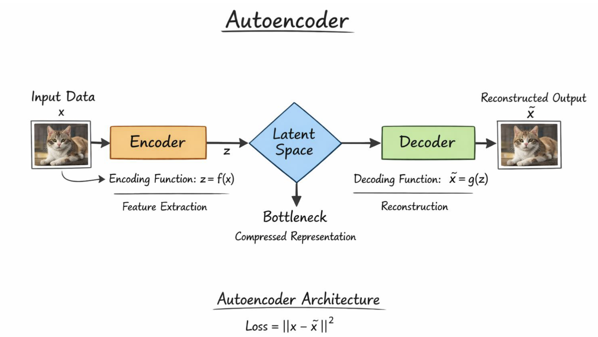
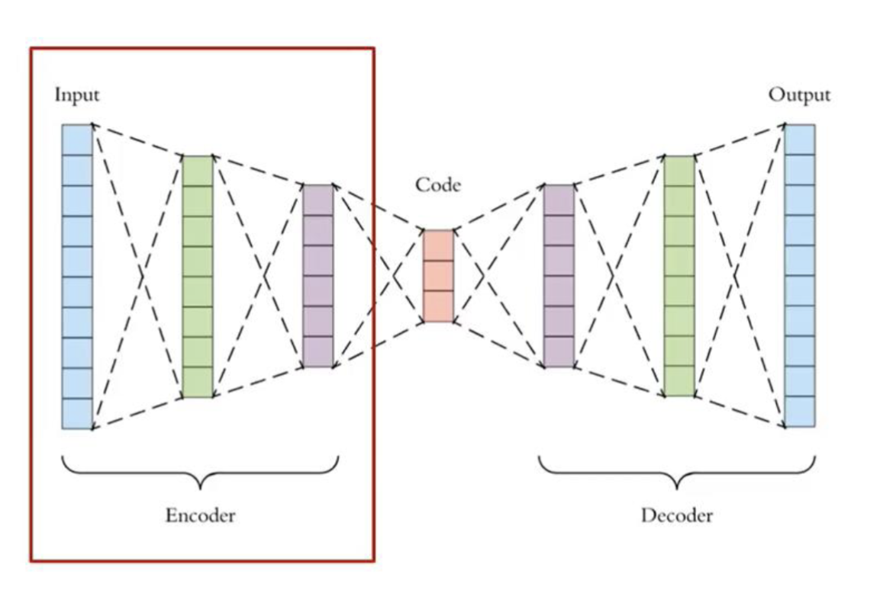
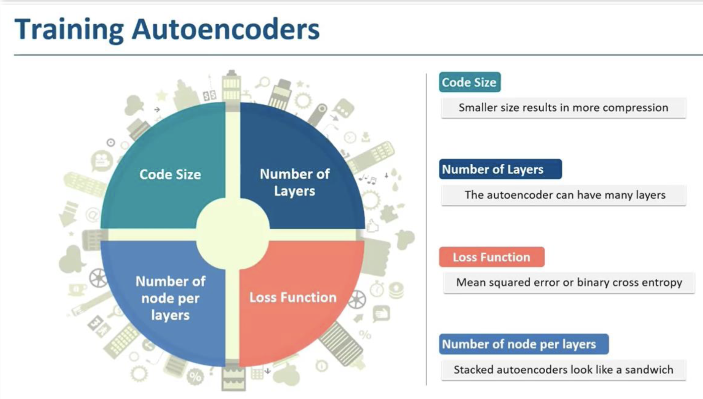
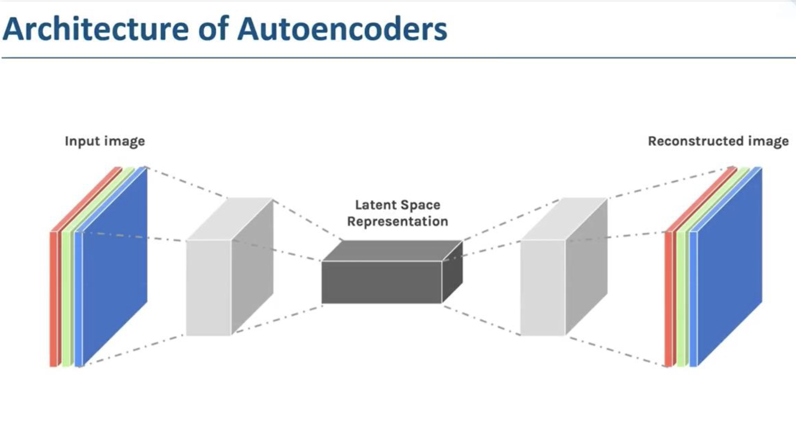
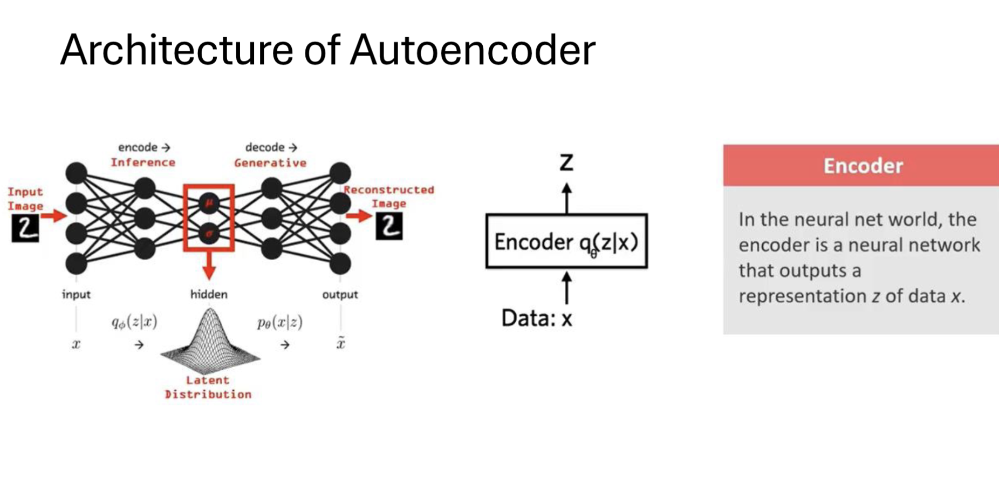
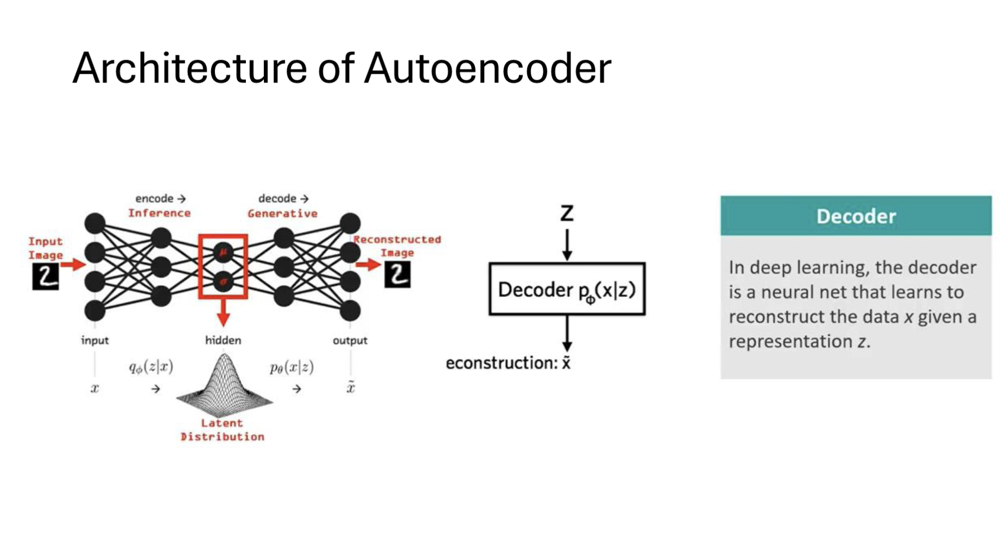
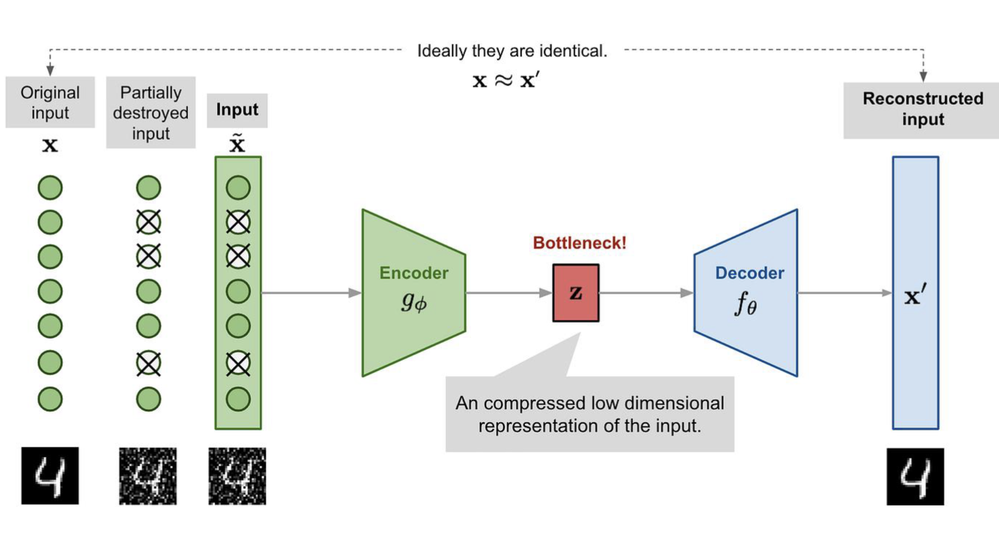
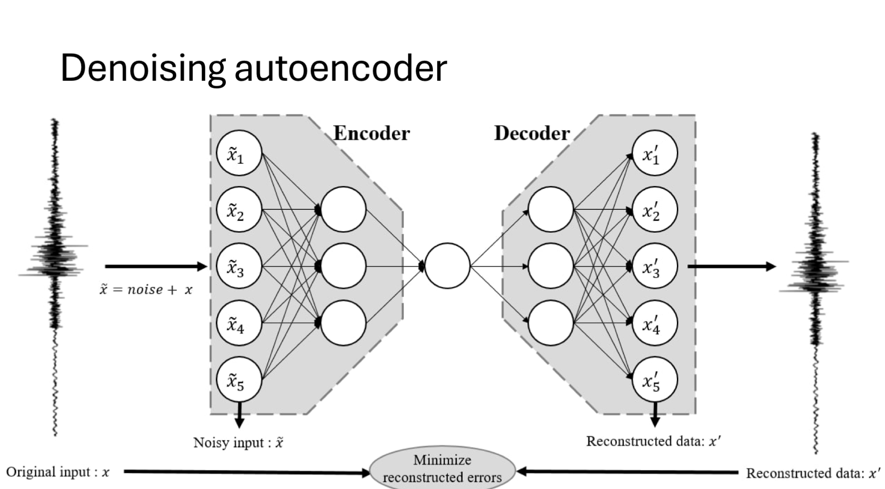
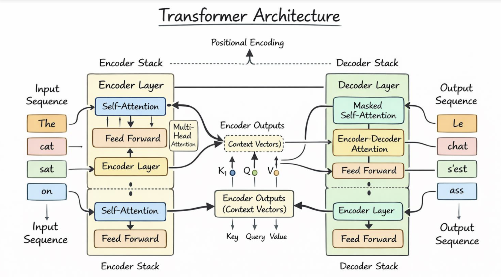
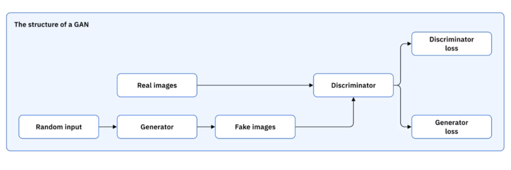

# Auto Encoder 
An autoencoder is a type of neural network architecture that is designed to learn efficient compressed representations of data, typically for the purpose of dimensionality reduction or feature learning. It consists of two main components: an encoder and a decoder.

It tries to reconstruct the input data from a compressed representation, which is often referred to as the "latent space" or "bottleneck". The encoder maps the input data to this latent space, while the decoder maps it back to the original input space. The goal of training an autoencoder is to minimize the difference between the input and the reconstructed output, often using a loss function such as mean squared error.



An Auto-Encoder neural network typically consists of three main layers:



1. **Input Layer**: This layer receives the original data that we want to compress and reconstruct. The number of neurons in this layer corresponds to the dimensionality of the input data.
2. **Hidden Layer (Latent Space)**: This layer is where the compressed representation of the input data is created. The number of neurons in this layer is usually less than the number of neurons in the input layer, which forces the network to learn a more compact representation of the data. The activation function used in this layer can vary, but common choices include ReLU or sigmoid.
3. **Output Layer**: This layer attempts to reconstruct the original input data from the compressed representation. The number of neurons in this layer is the same as the number of neurons in the input layer, and the activation function is often linear or sigmoid, depending on the nature of the input data.

## key Facts about the Auto-Encoder
- Autoencoders are unsupervised learning models, meaning they do not require labeled data for training. They learn to encode and decode the input data based solely on the structure of the data itself.
- The latent space in an autoencoder can capture important features and patterns in the data, making it useful for tasks such as dimensionality reduction, anomaly detection, and data generation.
- Autoencoders can be used for various applications, including image compression, denoising, and feature extraction.

## Properties of Auto-Encoders:
- unsupervised learning: Autoencoders learn to encode and decode data without the need for labeled examples.
- dimensionality reduction: Autoencoders can compress high-dimensional data into a lower-dimensional latent space, which can be useful for visualization and feature extraction.
- non-linear transformations: Autoencoders can learn complex, non-linear relationships in the data, making them more powerful than linear dimensionality reduction techniques like PCA.
- regularization: Autoencoders can be regularized to prevent overfitting and encourage the learning of more meaningful representations. Common regularization techniques include adding noise to the input (denoising autoencoders) or enforcing sparsity in the latent space (sparse autoencoders).
- generative capabilities: Variational autoencoders (VAEs) are a type of autoencoder that can generate new data samples by sampling from the latent space, making them useful for tasks like image generation and data augmentation.

## Training an Auto-Encoder

Training an autoencoder follows the standard supervised learning loop — the only difference is that the **target output is the input itself**. The model learns by minimising the reconstruction error between the original input $x$ and the decoded output $\hat{x}$.

### Training Steps

1. **Data Preparation** — Normalise or standardise the input data (e.g., scale pixel values to $[0, 1]$). Split into training and validation sets.
2. **Forward Pass** — Feed input $x$ through the encoder to get latent code $z$, then through the decoder to get reconstruction $\hat{x}$.
3. **Compute Loss** — Measure reconstruction error (see loss function choices below).
4. **Backward Pass** — Backpropagate the loss gradient through both decoder and encoder.
5. **Weight Update** — Update all weights using an optimiser (SGD, Adam, etc.).
6. **Repeat** — Iterate over the dataset for multiple epochs until the loss converges.

### Key Hyperparameters

| Hyperparameter | Effect |
|---|---|
| **Code Size** | Size of the latent layer. Smaller → more compression, higher information loss risk |
| **Number of Layers** | Deeper encoders/decoders learn more abstract representations |
| **Nodes per Layer** | Symmetric "sandwich" structure — encoder narrows, decoder mirrors it back |
| **Loss Function** | MSE for continuous data; Binary Cross-Entropy for binary/image data |

### Loss Functions

- **Mean Squared Error (MSE)** — used when input values are continuous (e.g., normalised sensor data):

$$\mathcal{L} = \frac{1}{n} \sum_{i=1}^{n} (x_i - \hat{x}_i)^2$$

- **Binary Cross-Entropy** — used when inputs are binary or in $[0,1]$ (e.g., images after sigmoid):

$$\mathcal{L} = -\frac{1}{n} \sum_{i=1}^{n} \left[ x_i \log \hat{x}_i + (1 - x_i) \log(1 - \hat{x}_i) \right]$$

> [!NOTE]
> Stacked autoencoders (deep autoencoders) are built by adding more hidden layers on each side of the bottleneck. The architecture mirrors itself — if the encoder has layers $[784 \to 256 \to 64]$, the decoder has $[64 \to 256 \to 784]$. This "sandwich" structure is what gives stacked autoencoders their name.






# Regularized Autoencoders
Regularized autoencoders are a class of autoencoders that incorporate additional constraints or penalties during training to encourage the model to learn more meaningful and robust representations. These regularization techniques help prevent overfitting and can lead to better generalization on unseen data. 



The Loss Function is modified to include a regularization term:
$$\mathcal{L} = \|x - \hat{x}\|^2 + \lambda R(h)$$

where $\|x - \hat{x}\|^2$ is the reconstruction loss, $R(h)$ is the regularization term applied to the latent representation $h$, and $\lambda$ is a hyperparameter that controls the strength of the regularization.   


Some common types of regularized autoencoders include:
1. **Denoising Autoencoders (DAE)**: A DAE learns to reconstruct **clean input data from a corrupted (noisy) version** of it. Instead of simply copying input → output, it learns to remove noise and recover the original signal.
 - Input: Noisy data $\tilde{x} = x + \text{noise}$
 - Output: Clean reconstruction $\hat{x} \approx x$
 - Benefits:
    - Learns robust representations that are less sensitive to noise.
    - Handles real-world noisy data better.

### Components of DAE

| Component | Description | Formula |
|---|---|---|
| **(a) Input with Noise** | Original data $x$ is corrupted | $\tilde{x} = x + \text{noise}$ |
| **(b) Encoder** | Maps noisy input → latent representation | $h = f(\tilde{x})$ |
| **(c) Bottleneck** | Learns compressed, noise-invariant features | — |
| **(d) Decoder** | Reconstructs clean data from latent code | $\hat{x} = g(h)$ |
| **(e) Loss Function** | Compare reconstruction with **original clean input** | $\mathcal{L} = \|x - \hat{x}\|^2$ |

### Working Principle

| Step | Action |
|---|---|
| **Step 1: Add Noise** | Corrupt input $x \to \tilde{x}$ |
| **Step 2: Encode** | Extract features from noisy data |
| **Step 3: Learn Representation** | Model learns the underlying structure, not the noise |
| **Step 4: Decode** | Reconstruct clean data |
| **Step 5: Compute Loss** | Compare reconstruction with original $x$ |
| **Step 6: Backpropagation** | Optimise weights to reduce reconstruction error |

    

2. **Sparse Autoencoders**: These autoencoders encourage sparsity in the latent representation by adding a sparsity penalty to the loss function. This forces the model to learn a more compact and interpretable representation of the data, where only a few neurons in the latent space are active for any given input.
 - Only a few neurons should be active
 - Benefits:
    - Learns more interpretable features.
    - Can capture more meaningful patterns in the data.
3. **Contractive Autoencoders**: The model is penalised if a small change in the input causes a big change in the latent code. In other words — the encoding should stay *stable* even when the input changes slightly.
 - Think of it like: if you slightly rotate an image of a cat, the latent code should still look almost the same.
 - Benefits:
    - Learns stable, noise-resistant representations.
    - Ignores small irrelevant changes in the input.
4. Variational Autoencoders (VAEs): These autoencoders are designed to learn a probabilistic latent space. Instead of encoding the input into a single point in the latent space, VAEs encode it as a distribution (usually Gaussian). During training, the model learns to generate new data samples by sampling from this latent distribution, making VAEs useful for generative tasks.
 - Encodes input as a distribution (mean and variance) rather than a single point.
 - Benefits:
    - Can generate new data samples by sampling from the latent space.
    - Useful for tasks like image generation and data augmentation.

### Applications of Regularized Autoencoders

| Application | What it does | Used in |
|---|---|---|
| **Image Denoising** | Removes noise from corrupted images; learns underlying patterns | Medical imaging, satellite image processing |
| **Dimensionality Reduction** | Compresses high-dimensional data → low-dimensional representation; alternative to PCA | Data visualisation (2D/3D plots), preprocessing for ML models |
| **Feature Extraction** | Automatically learns important features from raw data | Image classification, text processing, speech recognition |
| **Anomaly Detection** | Trained on normal data — high reconstruction error signals an anomaly | Fraud detection, intrusion detection, fault detection in machines |
| **Data Compression** | Compresses data into compact latent form; reconstructs on demand | Image compression, signal compression |
| **Medical Applications** | Denoising MRI/CT scans, disease detection, patient data representation | Improves diagnosis accuracy and image clarity |
| **Speech & Audio Processing** | Noise reduction in audio signals; feature extraction for speech recognition | Voice assistants, speech enhancement systems |
| **Image Generation & Reconstruction** | Generates new data samples; fills missing parts of images | Variational Autoencoder (VAE) based applications |
| **Recommendation Systems** | Learns user-item interaction patterns for personalisation | Movie recommendations, e-commerce |
| **Natural Language Processing** | Sentence embedding and text representation | Chatbots, document clustering |

---

# Generative Adversarial Networks (GAN)

A **GAN** is a generative model made up of two neural networks competing against each other:

- **Generator (G)** — creates fake data from random noise, trying to fool the discriminator
- **Discriminator (D)** — tries to tell apart real data from fake data produced by the generator

```
Random Noise z  →  [Generator G]  →  Fake data
                                           ↓
Real data   ──────────────────────→  [Discriminator D]  →  Real / Fake?
```

They are trained together in an **adversarial loop** — the generator gets better at fooling, the discriminator gets better at detecting, and both improve over time.

### How GAN Works — The Objective Function

$$V(D, G) = \mathbb{E}_{x \sim P_{\text{data}}(x)}[\log D(x)] + \mathbb{E}_{z \sim p_z(z)}[\log(1 - D(G(z)))]$$

| Symbol | Meaning |
|---|---|
| $G$ | Generator network |
| $D$ | Discriminator network |
| $x$ | A sample from real data |
| $z$ | A random noise sample fed into the generator |
| $P_{\text{data}}(x)$ | Distribution of real data |
| $p_z(z)$ | Distribution of the generator (noise) |
| $D(x)$ | Discriminator's output for real data (wants this → 1) |
| $G(z)$ | Generator's output (a fake sample) |
| $D(G(z))$ | Discriminator's output for fake data (Generator wants this → 1, Discriminator wants this → 0) |

**In plain terms:**
- The **Discriminator** tries to **maximise** $V$ — correctly label real as real ($D(x) \approx 1$) and fake as fake ($D(G(z)) \approx 0$)
- The **Generator** tries to **minimise** $V$ — make its fakes so good that $D(G(z)) \approx 1$

This is called a **minimax game**: $\min_G \max_D \, V(D, G)$

### Applications of GANs

| Application | Description |
|---|---|
| **Prediction of Next Frame in a Video** | Given a few frames (e.g., a pitcher mid-throw), the GAN generates the next frame — used in video prediction and synthesis |
| **Text to Image Generation** | Given a text prompt, the generator creates a realistic image matching the description |
| **Image Super-Resolution** | Upscale low-resolution images to high resolution (used in SRGAN) |
| **Data Augmentation** | Generate synthetic training samples to balance datasets |
| **Face Generation / Style Transfer** | Generate photorealistic faces (StyleGAN) or transfer artistic styles |
| **Medical Image Synthesis** | Generate MRI/CT scans for training diagnostic models |
| **Image-to-Image Translation** | CycleGAN: convert MRI → CT, or sketch → photo (Pix2Pix) |


Transformers abandon the sequential step-by-step approach entirely. Instead, they process the **whole sequence at once** using **self-attention** — letting every word directly attend to every other word, regardless of distance.

```
  "The  cat  sat  on  the  mat"
    ↕    ↕    ↕   ↕    ↕    ↕
   [  Self-Attention across all positions  ]
```



> **Self-attention** assigns a weight to every word in the sequence relative to the current word being processed — so when encoding "sat", the model can directly look at "cat" (subject) and "mat" (location) without having to pass through intermediate hidden states.

This eliminates the vanishing gradient problem entirely and enables **massive parallelism** during training, which is why Transformers (GPT, BERT, etc.) now dominate NLP.

### Comparison at a Glance

| Model | Handles long deps? | Parallel training? | Key idea |
|---|---|---|---|
| **RNN** | Poor | No | Hidden state loop |
| **LSTM** | Good | No | Gated cell memory |
| **GRU** | Good | No | Simplified gating |
| **Transformer** | Excellent | Yes | Self-attention |

# Generative Adversarial Networks (GANs)
Generative Adversarial Networks (GANs) are a class of machine learning frameworks designed for generative modeling. They consist of two neural networks, the **generator** and the **discriminator**, that are trained simultaneously through an adversarial process. The generator creates synthetic data samples, while the discriminator evaluates them against real data samples to determine their authenticity.

## Key Components of GANs
1. **Generator**: The generator takes random noise as input and produces synthetic data samples that resemble the real data distribution. Its goal is to generate data that can fool the discriminator into classifying it as real.
2. **Discriminator**: The discriminator takes both real data samples and synthetic samples from the generator as input and outputs a probability indicating whether the input is real or fake. Its goal is to correctly classify real and fake samples.
3. **Adversarial Training**: The generator and discriminator are trained in a competitive manner. The generator tries to minimize the discriminator's ability to distinguish between real and fake samples, while the discriminator tries to maximize its accuracy in classification.



## Training Process
1. **Initialization**: Both the generator and discriminator are initialized with random weights.
2. **Adversarial Loop**:
   - **Step 1**: The generator creates a batch of synthetic data samples from random noise.
   - **Step 2**: The discriminator is trained on a batch of real data samples and the synthetic samples from the generator, updating its weights to improve classification accuracy.
   - **Step 3**: The generator is trained to produce better synthetic samples by updating its weights to minimize the discriminator's ability to classify them as fake.
3. **Repeat**: This process is repeated for many iterations until the generator produces high-quality synthetic data that can effectively fool the discriminator.