# GPT - Generative Pre-trained Transformer

GPT is a type of language model developed by OpenAI that uses deep learning techniques to generate human-like text. It is based on the Transformer architecture, which allows it to process and understand large amounts of text data efficiently. 

GPT is pre-trained on a vast corpus of text data, enabling it to learn grammar, facts, and reasoning abilities. It can be fine-tuned for specific tasks such as language translation, summarization, and question-answering. GPT has been widely used in various applications, including chatbots, content creation, and natural language processing tasks.

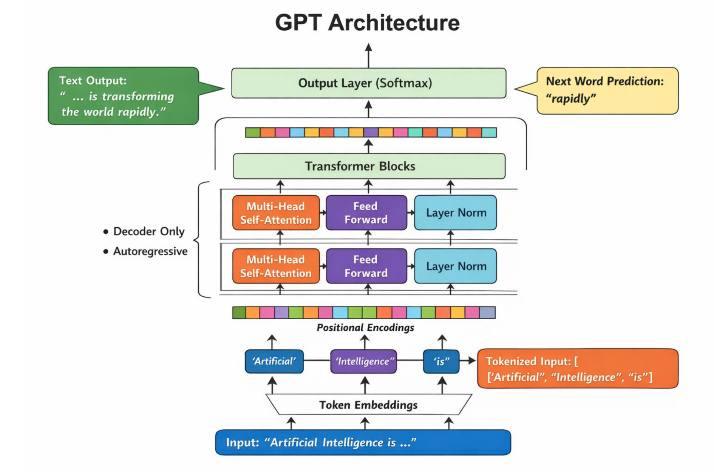

## Architecture of GPT
The architecture of GPT is based on the Transformer model, which consists of multiple layers of self-attention and feed-forward neural networks. The key components of the GPT architecture include:
1. **Input Embeddings**: The input text is converted into embeddings, which are dense vector representations of the words or tokens.
2. **Positional Encoding**: Since the Transformer architecture does not have a built-in notion of word order, positional encoding is added to the input embeddings to provide information about the position of each token in the sequence.
3. **Self-Attention Mechanism**: This allows the model to weigh the importance of different tokens in the input sequence when generating the output. It helps the model to capture long-range dependencies in the text.
4. **Feed-Forward Neural Networks**: After the self-attention mechanism, the output is passed through feed-forward neural networks to further process the information and generate the final output.

## Applications of GPT
GPT has a wide range of applications in natural language processing and artificial intelligence, including:
1. **Chatbots**: GPT can be used to create conversational agents that can interact with users in a natural and engaging manner.
2. **Content Creation**: GPT can generate articles, stories, and other forms of content based on a given prompt or topic.
3. **Language Translation: GPT can be fine-tuned to perform language translation tasks, allowing it to translate text from one language to another.
4. **Summarization**: GPT can be used to summarize long documents or articles, providing concise and relevant information.
5. **Question-Answering**: GPT can be fine-tuned to answer questions based on a given context, making it useful for applications like virtual assistants and information retrieval.

## How GPT Works
GPT works by taking a sequence of tokens as input and generating a sequence of tokens as output. The model is trained to predict the next token in the sequence based on the previous tokens, allowing it to generate coherent and contextually relevant text. During training, the model learns to capture the statistical properties of the language, enabling it to generate text that is grammatically correct and semantically meaningful.

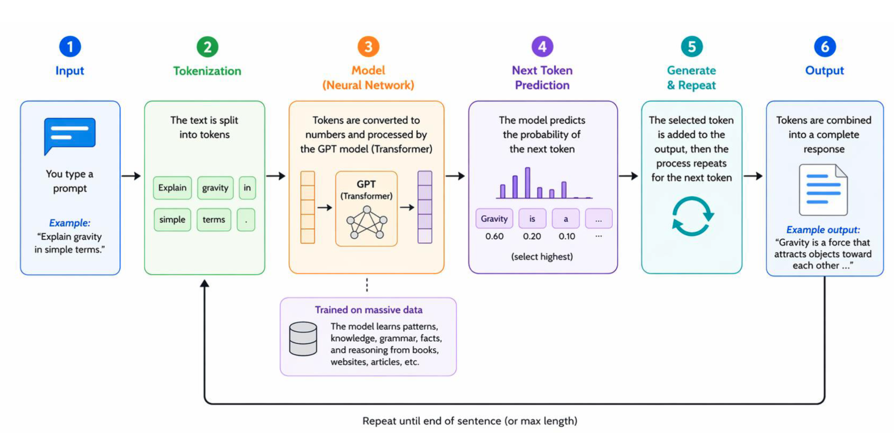

In summary, GPT is a powerful language model that has revolutionized the field of natural language processing. Its ability to generate human-like text has opened up new possibilities for applications in various domains, making it an essential tool for researchers and developers in the field of artificial intelligence.

## GPT Traaining Process
The training a GPT is a computationally intensive process that involves several steps:
1. **Data Collection**: A large corpus of text data is collected from various sources such as books, articles, and websites. This data is used to train the model.
2. **Data Preprocessing**: The collected data is cleaned and preprocessed to remove any noise or irrelevant information. This step ensures that the data is in a suitable format for training.
3. **Model Training**: The preprocessed data is used to train the GPT model. This involves optimizing the model's parameters to minimize the prediction error.
4. **Fine-Tuning**: After the initial training, the model can be fine-tuned on specific tasks or domains to improve its performance in those areas.
5. **Evaluation**: The trained model is evaluated on various benchmarks and tasks to assess its performance and identify areas for improvement.

## Advantages of GPT
1. **Human-like Text Generation**: GPT can generate text that is coherent, contextually relevant, and grammatically correct, making it suitable for a wide range of applications.
2. **Versatility**: GPT can be fine-tuned for various tasks, allowing it to perform well in different domains and applications.
3. **Large-Scale Training**: GPT can be trained on large datasets, enabling it to learn a wide range of language patterns and nuances.
4. **Transfer Learning**: GPT can leverage transfer learning, allowing it to apply knowledge learned from one task to another, which can improve performance and reduce training time.

# Auto Regressive Models
Auto-regressive models are a type of statistical model that predicts future values based on past values. In the context of language modeling, auto-regressive models generate text by predicting the next word in a sequence based on the previous words. These models are trained to maximize the likelihood of the observed data, which allows them to generate coherent and contextually relevant text.

Auto-regressive models are commonly used in natural language processing tasks such as language generation, machine translation, and text summarization. They can be implemented using various architectures, including recurrent neural networks (RNNs) and transformer models like GPT.

Applications of auto-regressive models include:
1. **Language Generation**: Auto-regressive models can generate human-like text for applications such as chatbots, content creation, and storytelling.
2. **Machine Translation**: These models can be used to translate text from one language to another by predicting the next word in the target language based on the source language input.
3. **Text Summarization**: Auto-regressive models can generate concise summaries of long documents by predicting the next word in the summary based on the previous words.

# How Auto Regressive Models Work
Auto-regressive models work by predicting the next value in a sequence based on the previous values. In the context of language modeling, the model takes a sequence of words as input and generates the next word in the sequence. The model is trained to maximize the likelihood of the observed data, which allows it to learn the statistical properties of the language and generate coherent text.

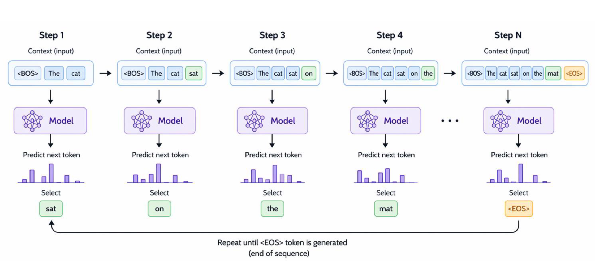

The training process involves feeding the model with sequences of words and adjusting the model's parameters to minimize the prediction error. During inference, the model generates text by repeatedly predicting the next word until a stopping criterion is met (e.g., a certain length or a special end token).

# Stable Diffusion Model
Stable Diffusion Models are a class of generative models that are designed to generate high-quality images by modeling the diffusion process. These models work by simulating the process of diffusion, where noise is added to an image over time, and then learning to reverse this process to generate new images.

The key idea behind Stable Diffusion Models is to model the distribution of images as a diffusion process, where noise is added to the image at each time step. The model learns to reverse this process by predicting the noise that was added at each time step, allowing it to generate new images from random noise.

What is a Diffusion Model?
A diffusion model is a type of generative model that simulates the process of diffusion to generate new data. In the context of image generation, a diffusion model adds noise to an image over time, and then learns to reverse this process to generate new images. The model is trained to predict the noise that was added at each time step, allowing it to generate new images from random noise.

A diffusion model consists of two main components: 

1. **The Forward Process**: The forward process simulates the diffusion by adding noise to the image at each time step.
2. **The Reverse Process**: The reverse process learns to predict the noise and generate new images.

So the Stable Diffusion Model is a specific type of diffusion model that focuses on generating high-quality images by modeling the diffusion process efficiently in latent space. It aims to produce images that are visually appealing, contextually relevant to the prompt, and consistent with the underlying data distribution.

## Core Architecture of Stable Diffusion Model
Stable Diffusion generates an image by starting from random noise and slowly converting that noise into a meaningful picture based on a text prompt. Its architecture is built around the following components:

1. **Text Prompt Input**: The process starts with a user prompt such as *"A mountain lake with trees and blue sky"*. This prompt tells the model what type of image should be generated.
2. **Text Encoder (CLIP)**: The prompt is passed to the CLIP text encoder, which converts the words into numerical vectors called **text embeddings**. These embeddings capture the meaning of the prompt and guide the image generation process.
3. **Random Noise in Latent Space**: Instead of generating the image directly in full pixel space, Stable Diffusion begins with random noise in a compressed space called **latent space**. For example, instead of working on a full $512 \times 512 \times 3$ image, it works on a smaller latent representation such as $64 \times 64 \times 4$, making the process faster and more memory-efficient.
4. **VAE Encoder and Decoder**: A **Variational Autoencoder (VAE)** is used to move between image space and latent space. The encoder compresses an image into latent form, and the decoder converts the final denoised latent back into a visible image.
5. **Denoising U-Net**: The central part of Stable Diffusion is the **U-Net**. At each step, it receives the noisy latent, the text embeddings, and the current timestep information. It predicts how much noise is present so that the model can remove it gradually.
6. **Timestep Embedding**: Diffusion happens over many steps, such as $T = 1000$ down to $0$. A timestep embedding tells the U-Net how noisy the current latent representation is at that stage of generation.
7. **Noise Scheduler and Iterative Denoising**: A scheduler controls how noise is removed step by step. In every iteration, the model takes the noisy latent, predicts the noise, removes part of it, and produces a cleaner latent. Repeating this process transforms random noise into a structured image.
8. **Final Image Decoding**: After the denoising steps are complete, the final clean latent representation is passed through the VAE decoder, which converts it into a high-quality image.

### Simple Flow of Stable Diffusion
Text Prompt -> CLIP Text Encoder -> Text Embeddings -> Noisy Latent -> U-Net + Timestep + Scheduler -> Clean Latent -> VAE Decoder -> Final Image

In short, Stable Diffusion combines language understanding and image denoising. The text encoder understands *what* to generate, the U-Net learns *how* to remove noise, and the VAE decoder converts the cleaned latent representation into the final image.

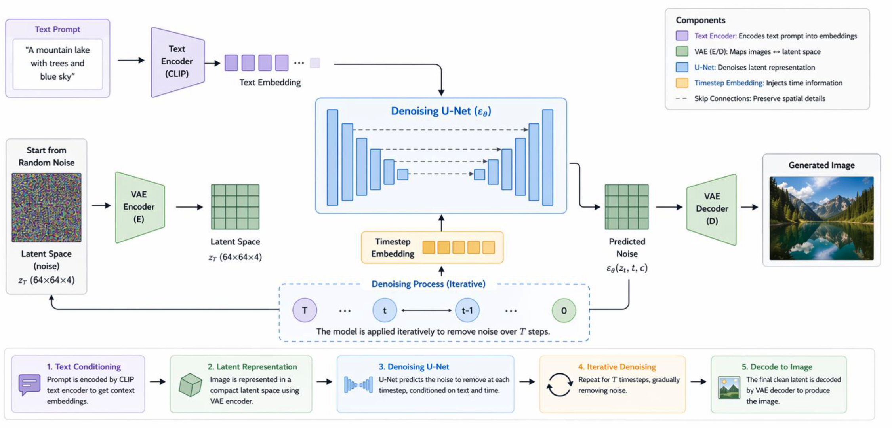

## How Stable Diffusion Works

The working of Stable Diffusion can be understood as a step-by-step process in which the model learns to convert noise into a meaningful image using guidance from a text prompt.

1. **Forward Process (Adding Noise)**: During training, noise is gradually added to a real image over many timesteps until the image becomes almost pure noise. This teaches the model how images are corrupted step by step.
2. **Reverse Process (Removing Noise)**: During generation, the model starts with random noise and then removes noise little by little. At each timestep, the U-Net predicts the noise present in the latent representation and subtracts it to make the image clearer.
3. **Text Prompt and Text Encoder**: The user gives a text prompt such as *"A mountain lake with trees and blue sky"*. This prompt is passed through a text encoder such as **CLIP**, which converts the sentence into text embeddings. These embeddings carry the meaning of the prompt.
4. **Conditioning with Text Embeddings**: At every denoising step, the U-Net does not work alone. It also receives the text embeddings, which guide the denoising process so that the generated image matches the given prompt. This guidance is usually applied through **cross-attention**.
5. **Timestep-Based Denoising**: The denoising process happens from $t = T$ down to $t = 0$. The timestep tells the model how much noise is still present. Large values of $t$ mean the image is very noisy, while smaller values mean the image is becoming clearer.
6. **Final Image Generation**: After repeated denoising, the final latent representation contains the required visual structure. This latent is then decoded by the VAE decoder to produce the final high-quality image.

### Key Idea
Stable Diffusion first learns how to add noise to images and then learns how to reverse that process. By combining denoising with text guidance, it can generate images that are both realistic and relevant to the user's prompt.

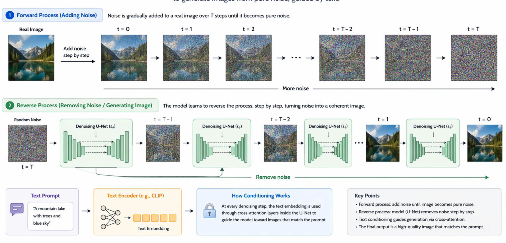

## Applications of Stable Diffusion
1. **Image Generation**: Stable Diffusion can create high-quality images from text prompts, making it useful for artists, designers, and content creators.
2. **Creative Design**: It can be used to generate unique and creative designs for various applications, such as advertising, gaming, and virtual reality.
3. **Data Augmentation**: Stable Diffusion can generate synthetic images to augment training datasets for machine learning models, improving their performance and generalization.
4. **Artistic Expression**: Artists can use Stable Diffusion to explore new styles and create artwork that may not be possible with traditional methods.
5. **Personalized Content Creation**: It can be used to generate personalized content based on user preferences, such as custom avatars, backgrounds, and illustrations.

# **Vision  and Language Models**

Vision and Language (V&L) combine visual and textual information to perform tasks that require understanding both modalities. These models are designed to process and generate content that involves both images and text, enabling applications such as image captioning, visual question answering, and multimodal content generation.

## Core Idea of Vision and Language Models

The core idea of Vision and Language models is that they learn the relationship between visual content and language so that they can understand, describe, search, summarize, or make decisions based on multiple types of input.

### Input can be:
1. **Image + Question**: The model sees an image and answers a question about it.
2. **Image + Text Prompt**: The model uses both the image and text instruction to generate or modify content.
3. **Video + Audio/Text**: The model processes video together with spoken or written language.
4. **Scene + Instruction**: The model observes a scene and follows a language-based instruction.

### Output can be:
1. **Caption**: A textual description of the image or video.
2. **Answer**: A response to a question based on visual input.
3. **Search Result**: Retrieval of relevant images, videos, or text based on a query.
4. **Summary**: A short explanation of the main content in the visual and textual input.
5. **Action Decision**: A decision or next step taken by the model based on the scene and instruction.

In simple words, Vision and Language models connect what the system sees with what it reads or hears, and then produce a useful output in the form of language, search, or action.

## Applications of Vision and Language Models

Vision and Language models are used in many real-world applications where both visual understanding and language understanding are required.

1. **Image Captioning**: The model looks at an image and generates a meaningful textual description of what is present in the image.
2. **Visual Question Answering (VQA)**: The model answers questions based on the content of an image. For example, if shown a street image, it can answer questions like *"How many cars are visible?"*
3. **Visual Dialog**: The model can take part in a conversation about an image by answering a sequence of related questions.
4. **Text-to-Image Generation**: The model generates images from textual descriptions. This is used in systems such as image generation tools where a user writes a prompt and receives a matching image.
5. **Image Search using Text**: A user can enter a text query, and the system finds images that best match that description.
6. **OCR + Language Understanding**: The model reads text from images or scanned documents using OCR and then understands the meaning of that text for tasks like document analysis or question answering.
7. **Medical Vision + Language**: These models help in healthcare by analyzing medical images and connecting them with reports, notes, or diagnostic language.
8. **Autonomous Vehicles**: Vision and Language models can help vehicles understand road scenes, signs, and instructions, improving decision-making in self-driving systems.
9. **Robotics**: Robots can use these models to understand what they see and follow spoken or written instructions such as *"Pick up the red box."*
10. **Video Understanding**: The model analyzes video content and can generate captions, summaries, or answers related to events happening in the video.
11. **E-Commerce Visual Shopping**: Users can search for products using images and text together, such as finding clothes or accessories similar to a reference image.
12. **AR/VR Assistants**: In augmented and virtual reality, these models help assistants understand the user's surroundings and provide context-aware guidance or responses.

In summary, Vision and Language models are important because they allow AI systems to connect visual information with human language, making them useful in communication, automation, healthcare, shopping, and intelligent assistants.

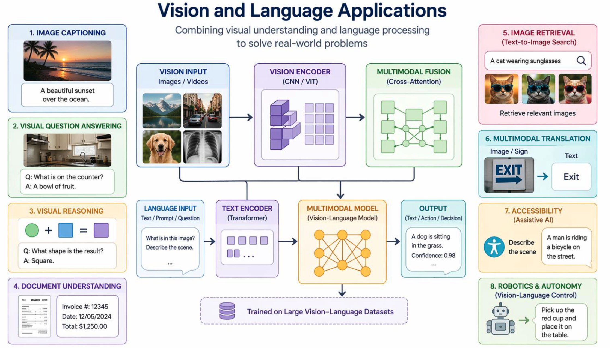

# Image Captioning
Image captioning is the task of generating a textual description for a given image. It involves understanding the content of the image and expressing it in natural language. Image captioning models typically use a combination of computer vision techniques to analyze the image and natural language processing techniques to generate the caption.

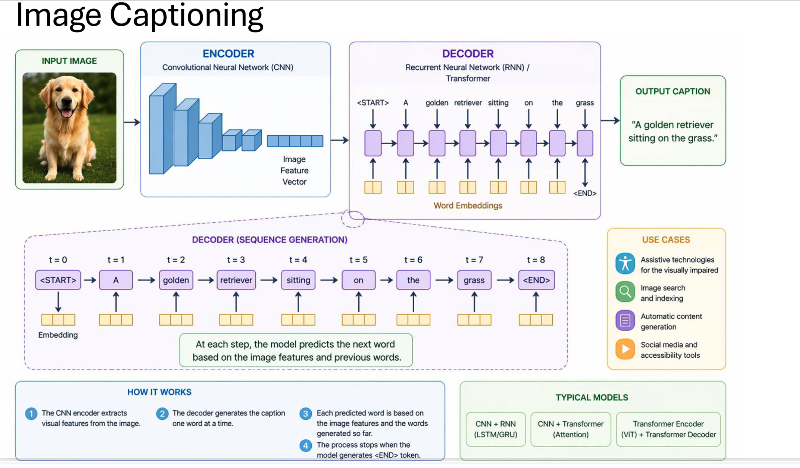

## Architecture of Image Captioning

The architecture of an image captioning system usually follows an **encoder-decoder** approach. The encoder understands the image, and the decoder generates the caption word by word.

1. **Input Image**: The system first takes an image as input.
2. **Encoder**: A **Convolutional Neural Network (CNN)** or a vision-based transformer is used to extract important visual features such as objects, background, and scene information from the image.
3. **Image Feature Vector**: The encoder converts the image into a compact numerical representation called a **feature vector**.
4. **Decoder**: A **Recurrent Neural Network (RNN)**, **LSTM**, **GRU**, or **Transformer** is used as the decoder to generate the caption.
5. **Word-by-Word Generation**: The decoder starts with a special **<START>** token and predicts one word at a time based on the image features and the previously generated words.
6. **End Token**: The process continues until the model predicts an **<END>** token, which marks the completion of the sentence.

## How Image Captioning Works

The working of image captioning can be understood in the following steps:

1. The input image is given to the encoder.
2. The encoder extracts visual features from the image.
3. These features are passed to the decoder.
4. The decoder begins generating the caption one word at a time.
5. At each step, the next word depends on both the image features and the previously generated words.
6. The caption generation stops when the model produces the **<END>** token.

For example, if the image contains a dog sitting on grass, the generated caption may be: *"A golden retriever sitting on the grass."*

### Simple Flow
Image -> Encoder -> Image Features -> Decoder -> Word-by-Word Caption -> Final Sentence

## Typical Models Used in Image Captioning

1. **CNN + RNN**: A CNN extracts image features, and an RNN generates the caption.
2. **CNN + LSTM/GRU**: A stronger sequence model such as LSTM or GRU is used to improve caption generation.
3. **CNN + Transformer**: The transformer decoder generates more context-aware captions.
4. **Vision Transformer (ViT) + Transformer Decoder**: A fully transformer-based approach is used for modern image captioning systems.

## Types of Image Captioning

Image captioning can be divided into different types depending on how detailed, expressive, or language-flexible the generated caption is.

1. **Basic Captioning**: The model generates a single sentence that describes the overall image. Example: *"A dog is sitting on the grass."*
2. **Dense Captioning**: The model describes multiple regions or objects in the same image instead of giving only one overall sentence. For example, it may generate captions such as *"Man sitting on bench"* and *"Dog near tree"* for different parts of the image.
3. **Stylized Captioning**: The model generates captions in a specific style, such as funny, emotional, creative, or formal language.
4. **Multilingual Captioning**: The model generates captions in multiple languages, making the system useful for users from different language backgrounds.

## Applications of Image Captioning

Image captioning has many practical applications in real-world systems where images need to be understood and described automatically.

1. **Accessibility**: Helps visually impaired users understand photos by converting visual content into text or speech.
2. **Social Media**: Automatically generates alt text or captions for uploaded images.
3. **Photo Search**: Makes it easier to find images using text-based search queries.
4. **Surveillance**: Describes events happening in CCTV footage for monitoring and security purposes.
5. **Healthcare**: Helps describe medical images and supports medical reporting.
6. **Robotics**: Allows robots to describe or narrate their surroundings.
7. **E-Commerce**: Automatically creates descriptions for product images shown on shopping platforms.

In summary, image captioning combines computer vision and natural language processing to convert visual information into meaningful text. The encoder understands the image, and the decoder transforms that understanding into a sentence.

# Visual Question Answering (VQA)

Visual Question Answering, also called **Visual QA** or **VQA**, is a task in artificial intelligence where a system looks at an image and answers a natural language question about that image. It combines image understanding with language understanding so that the model can produce the correct answer.

VQA combines three main areas:

1. **Computer Vision**: To understand the content of the image.
2. **Natural Language Processing (NLP)**: To understand the meaning of the question.
3. **Reasoning**: To connect the image and the question and generate the correct answer.

## Example of Visual QA

Suppose the image shows a kitchen with two chairs and a table.

1. **Question**: How many chairs are there?  
	**Answer**: 2
2. **Question**: What room is this?  
	**Answer**: Kitchen
3. **Question**: Is anyone present?  
	**Answer**: No

## Architecture of Visual QA

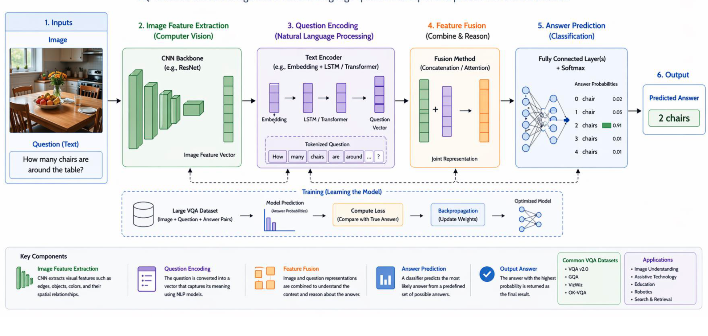

The architecture of a Visual QA system generally contains the following components:

1. **Image Input**: The system receives an image.
2. **Question Input**: The system also receives a text question related to the image.
3. **Image Feature Extraction**: A CNN such as **ResNet** or a vision model such as **Vision Transformer (ViT)** extracts important visual features like objects, colors, shapes, and scene details.
4. **Question Encoding**: The question is converted into embeddings using models such as **LSTM**, **GRU**, or **Transformer**.
5. **Feature Fusion**: The image features and question features are combined. Common methods include **concatenation**, **attention**, and **cross-attention**.
6. **Reasoning and Answer Prediction**: The fused representation is passed through a classifier or text generator to predict the final answer.

### Simple Flow of VQA
Image + Question -> Image Encoder + Question Encoder -> Feature Fusion -> Reasoning -> Answer Prediction

## How Visual QA Works

The working of Visual QA can be understood in the following steps:

1. **Step 1: Image Feature Extraction**: The image is processed using CNN or Vision Transformer to extract visual information.
2. **Step 2: Question Encoding**: The question text is converted into embeddings so that the model understands what is being asked.
3. **Step 3: Feature Fusion**: The visual features and question features are combined into a joint representation.
4. **Step 4: Reasoning**: The model learns relationships between the image and the question. For example, if the question asks *"How many?"*, the model focuses on counting objects.
5. **Step 5: Answer Prediction**: The output is generated either as a classification result from a fixed set of answers or as text generation.

## Types of Questions in VQA

Visual QA systems can answer different kinds of questions based on the image.

1. **Object Recognition**: Example: *"What animal is shown?"*
2. **Counting**: Example: *"How many people are there?"*
3. **Color Recognition**: Example: *"What color is the shirt?"*
4. **Scene Understanding**: Example: *"Where is this place?"*
5. **Action Recognition**: Example: *"What is the person doing?"*
6. **Reasoning Questions**: Example: *"Is the cup bigger than the plate?"*

## Applications of Visual QA

Visual QA is useful in many real-world applications where systems must answer questions about images.

1. **Accessibility**: Helps visually impaired users understand images by asking questions and receiving spoken or written answers.
2. **Education**: Students can ask questions about diagrams, charts, maps, or scientific images.
3. **Healthcare**: Doctors and medical systems can ask questions about X-rays, CT scans, or other medical images.
4. **Robotics**: Robots can answer questions about their surroundings and support human interaction.
5. **E-Commerce**: Users can ask product-related questions such as *"Does this bag have handles?"*
6. **Security**: Visual QA can help analyze CCTV footage by answering questions about suspicious activities or objects.

## Key Idea

The main idea of Visual QA is to combine image understanding and question understanding in a single model. The system does not just see the image or read the question separately; it connects both and then reasons to produce the correct answer.

In summary, Visual QA is an important multimodal AI task because it combines computer vision, language understanding, and reasoning. It allows machines to understand images more intelligently and answer human questions in a natural way.

# Visual Dialog (VisDial)

Visual Dialog, also called **VisDial**, is an AI task in which a system holds a **multi-turn conversation about an image**. Instead of answering only one isolated question like Visual Question Answering (VQA), Visual Dialog answers a sequence of related questions while remembering the previous conversation.

Visual Dialog combines the following main areas:

1. **Computer Vision**: To understand the objects, actions, and scene in the image.
2. **Natural Language Processing (NLP)**: To understand the questions and generate meaningful answers.
3. **Dialogue Modeling**: To remember earlier questions and answers so that the current response remains context-aware.

In simple words, Visual Dialog allows a machine to look at an image, remember the conversation so far, and continue answering new questions in a natural way.

## Example of Visual Dialog

Suppose the image shows a woman cooking in a kitchen.

1. **Q1**: What is she doing?  
	**A1**: She is cooking.
2. **Q2**: What is on the table?  
	**A2**: Vegetables.
3. **Q3**: Is anyone else there?  
	**A3**: Yes, a child is nearby.
4. **Q4**: What is she holding now?  
	**A4**: A bowl.

To answer Q4 correctly, the model must understand:

1. The image itself
2. Earlier questions
3. Previous answers
4. The meaning of the current question

## Why Visual Dialog Is Important

Visual Dialog is important because normal Visual QA usually answers only one question at a time, while real conversations often include follow-up questions.

It supports:

1. **Follow-up Questions**: Later questions depend on earlier questions and answers.
2. **Contextual Reasoning**: The model must connect image content with conversation history.
3. **Human-like Interaction**: The system responds more naturally, like a conversation partner.
4. **Interactive Assistants**: It is useful for assistants that discuss images, scenes, or charts with users.

## Core Components of Visual Dialog

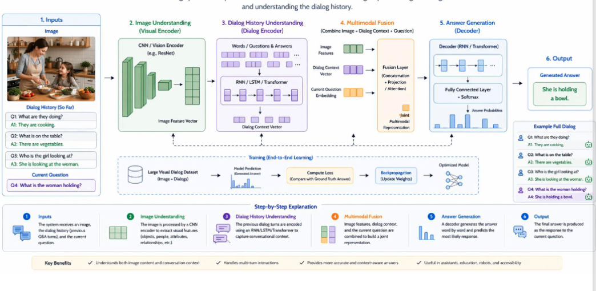

A Visual Dialog system usually contains the following components:

1. **Image Encoder**: Processes the image using CNN or Vision Transformer models such as **ResNet**, **ViT**, or **Faster R-CNN**. It extracts visual features representing objects, colors, positions, and actions.
2. **Question Encoder**: Converts the current question into embeddings using models such as **LSTM**, **GRU**, or **Transformer**.
3. **Dialog History Encoder**: Encodes previous question-answer pairs, such as [(Q1, A1), (Q2, A2), (Q3, A3)], so the model remembers the past conversation.
4. **Multimodal Fusion**: Combines image features, current question features, and dialog history features. Common fusion methods include **concatenation**, **attention**, **co-attention**, and **cross-attention**.
5. **Answer Decoder**: Generates the final answer either by selecting the best answer from candidates or by generating text word by word.

### Simple Flow of Visual Dialog
Image + Dialog History + Current Question -> Image Encoder + History Encoder + Question Encoder -> Multimodal Fusion -> Reasoning -> Answer Decoder -> Final Answer

## How Visual Dialog Works

The working of Visual Dialog can be explained in the following steps:

1. **Step 1: Receive Inputs**: The system receives an image, the previous conversation, and the new question.
2. **Step 2: Understand the Image**: The image encoder extracts scene, object, and action information.
3. **Step 3: Understand the Context**: The dialog history encoder remembers the earlier discussion.
4. **Step 4: Analyze the New Question**: The question encoder understands what the user is currently asking.
5. **Step 5: Reasoning**: The model relates the image, the conversation history, and the current question to form a context-aware understanding.
6. **Step 6: Generate the Answer**: The answer decoder returns the most suitable response.

## Applications of Visual Dialog

Visual Dialog is useful in many real-world systems where users need to ask multiple questions about the same image or scene.

1. **Smart Assistants**: Users can talk about uploaded images and ask multiple follow-up questions.
2. **E-Commerce**: Customers can ask detailed questions about product photos, such as *"Does this shirt have pockets?"*
3. **Healthcare**: Doctors or medical systems can discuss scans and images interactively.
4. **Education**: Students can ask multiple questions about diagrams, charts, maps, or scientific illustrations.
5. **Robotics**: Robots can discuss their surroundings and respond to repeated user questions.
6. **Accessibility**: Helps visually impaired users understand scenes through conversational interaction.

## Models Used in Visual Dialog

Some common models and model combinations used in Visual Dialog are:

1. **CNN + LSTM**
2. **CNN + Transformer**
3. **ViLBERT**
4. **LXMERT**
5. **BLIP**
6. **Flamingo**
7. **Multimodal GPT Systems**

## Popular Dataset for Visual Dialog

One of the most common datasets used for Visual Dialog is the **VisDial Dataset**.

Its main features are:

1. Large benchmark dataset for Visual Dialog research.
2. Contains images, captions, and multi-turn dialogs.
3. Usually includes around 10-turn conversations for each image.
4. Widely used to train and evaluate context-aware dialog models.

## Key Idea

The key idea of Visual Dialog is that the model must understand not only the image and the current question, but also the entire conversation history. Because of this, it can answer in a more intelligent, context-aware, and human-like manner.

In summary, Visual Dialog extends Visual QA by adding memory and conversation context. It is an important multimodal AI task for assistants, education, healthcare, robotics, and accessibility.

# PixelRNN

PixelRNN is a deep learning model used for **image generation**. It is one of the early successful **autoregressive image models**, where an image is generated **pixel by pixel** instead of generating the whole image at once.

The main idea of PixelRNN is that each pixel depends on the pixels generated before it. So, the model learns the probability of the next pixel based on previously generated pixels.

For example:

1. First, it predicts the first pixel.
2. Then, it predicts the second pixel based on the first one.
3. Next, it predicts the third pixel based on the first two.
4. This process continues until the entire image is completed.

Because of this sequential generation, PixelRNN can model complex dependencies between pixels and produce realistic images.

## How PixelRNN Works

The working of PixelRNN can be explained in the following steps:

1. **Input Training Images**: The model is trained on a dataset of images.
2. **Scan Pixels in Order**: Pixels are usually processed row by row, from left to right and top to bottom.
3. **Remember Previous Pixels**: Recurrent neural networks are used to store information about pixels that have already been seen.
4. **Predict Next Pixel Value**: The model predicts the RGB intensity value of the next pixel.
5. **Repeat the Process**: This continues until all pixels in the image are generated.

In simple words, PixelRNN treats an image like a sequence and generates it one pixel at a time.

## PixelRNN Architecture

The architecture of PixelRNN is designed to capture spatial dependencies among pixels. It takes an input image and predicts the probability distribution of each pixel conditioned on previously generated pixels.

The overall process is:

1. The training image is read in raster scan order.
2. A recurrent network processes the pixel sequence.
3. The hidden state stores information about previously seen pixels.
4. A softmax layer predicts the probability of the next pixel value.
5. During generation, the predicted pixel is fed back as input for the next prediction.

### Simple Flow of PixelRNN
Input Image -> Raster Scan Processing -> RNN Hidden State -> Predict Next Pixel -> Append Pixel -> Repeat Until Image Is Complete

## Architecture Variants of PixelRNN

PixelRNN mainly has two important architecture variants:

1. **Row LSTM**: This variant processes one row of the image at a time while remembering information from previous rows. It is simpler and effective for modeling local and row-wise dependencies.
2. **Diagonal BiLSTM**: This variant captures wider spatial dependencies by processing the image diagonally in both forward and backward directions. It gives broader context and usually produces better samples than Row LSTM.

## Generation Process in PixelRNN

The generation process in PixelRNN is autoregressive.

1. Start with an empty image or initial pixels.
2. Predict the next pixel using previously generated pixels.
3. Sample or choose the predicted pixel value.
4. Add that pixel to the image.
5. Use the generated pixel as input for the next prediction.
6. Repeat this until all pixels are generated.

This means the model builds the image step by step, and every new pixel depends on earlier pixels.

## Key Characteristics of PixelRNN

1. **Autoregressive Model**: Each pixel depends on previous pixels.
2. **Sequential Generation**: Images are generated one pixel at a time.
3. **Models Full Image Distribution**: PixelRNN learns the probability distribution of image pixels.
4. **Captures Spatial Context**: Especially with Diagonal BiLSTM, it captures broader spatial relationships.
5. **High Quality Samples**: It was one of the early models to generate realistic images.
6. **Slow Generation**: Since it generates pixels one by one, the image generation process is slow.

## Advantages of PixelRNN

1. It can model detailed dependencies between pixels.
2. It produces realistic image samples.
3. It introduced an important autoregressive approach for image generation.
4. It helped inspire later image generation models.

## Limitations of PixelRNN

1. It is computationally expensive.
2. Image generation is slow because pixels are generated sequentially.
3. It is less efficient than many modern generative models such as GANs and diffusion models.

## Key Idea

The key idea of PixelRNN is to treat image generation as a sequence modeling problem. Just as a language model predicts the next word based on previous words, PixelRNN predicts the next pixel based on previous pixels.

In summary, PixelRNN is an important early generative model that creates images pixel by pixel using recurrent neural networks. Although it is slow, it played a major role in showing that neural networks can generate realistic images autoregressively.

# CycleGAN

CycleGAN stands for **Cycle-Consistent Generative Adversarial Network**. It is a deep learning model used for **image-to-image translation without paired training data**.

In simple words, CycleGAN learns how to convert images from one type to another, even when we do not have exact matching image pairs.

Some common examples are:

1. **Horse -> Zebra**
2. **Summer -> Winter**
3. **Day -> Night**
4. **Monet Painting -> Real Photo**
5. **Old Photo -> Restored Photo**

## Why CycleGAN Is Important

Traditional image translation usually needs paired data.

For example, if we want to convert a horse image into a zebra image, we would normally need:

1. One horse image
2. Its exact matching zebra version

This kind of paired data is very difficult to collect.

CycleGAN solves this problem by learning from **two separate collections**:

1. A collection of horse images
2. A collection of zebra images

So, CycleGAN does **not** need one-to-one matching between the two sets.

## Simple Horse-Zebra Example

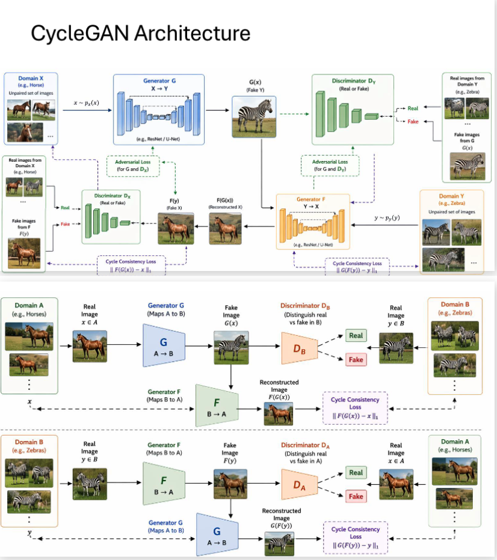

Suppose we have:

1. Many horse photos
2. Many zebra photos

But we do not have the same animal shown once as a horse and once as a zebra.

CycleGAN still learns two things:

1. How to change a horse image into a zebra-like image
2. How to change a zebra image back into a horse-like image

The model checks whether the translated image looks realistic and whether it can recover the original image again.

## Main Components of CycleGAN

CycleGAN uses four main networks and one important loss idea.

1. **Generator G (A -> B)**: Converts an image from domain A to domain B. Example: horse -> zebra.
2. **Generator F (B -> A)**: Converts an image from domain B to domain A. Example: zebra -> horse.
3. **Discriminator D_B**: Checks whether a zebra image is real or generated by G.
4. **Discriminator D_A**: Checks whether a horse image is real or generated by F.
5. **Cycle Consistency Loss**: Ensures that if an image is translated and then translated back, it should remain close to the original image.

## How CycleGAN Works

CycleGAN works using two translation directions.

### Forward Cycle

1. Take a real horse image $x$ from domain A.
2. Generator G converts it into a fake zebra image: $G(x)$.
3. Then generator F converts that fake zebra back into a horse image: $F(G(x))$.
4. The reconstructed horse should be close to the original horse image.

This means:

$$
F(G(x)) \approx x
$$

### Backward Cycle

1. Take a real zebra image $y$ from domain B.
2. Generator F converts it into a fake horse image: $F(y)$.
3. Then generator G converts that fake horse back into a zebra image: $G(F(y))$.
4. The reconstructed zebra should be close to the original zebra image.

This means:

$$
G(F(y)) \approx y
$$

## CycleGAN Architecture in Simple Form

The architecture can be understood as:

1. **Horse Image -> Generator G -> Fake Zebra**
2. **Fake Zebra -> Generator F -> Reconstructed Horse**
3. **Zebra Image -> Generator F -> Fake Horse**
4. **Fake Horse -> Generator G -> Reconstructed Zebra**
5. Discriminators check whether the generated horse and zebra images look real.

### Simple Flow of CycleGAN
Horse Image -> G -> Fake Zebra -> F -> Reconstructed Horse

Zebra Image -> F -> Fake Horse -> G -> Reconstructed Zebra

## Loss Functions in CycleGAN

CycleGAN mainly uses the following losses:

1. **Adversarial Loss**: The generators try to fool the discriminators, and the discriminators try to detect fake images. This helps generated images look realistic.
2. **Cycle Consistency Loss**: Makes sure that translating an image to another domain and back again preserves the original content.
3. **Identity Loss (Optional)**: Helps preserve colors, style, and unnecessary changes when the input image is already from the target domain.

The most important idea is the cycle consistency loss because it keeps the translated image related to the original image.

## Training Process of CycleGAN

The training process can be understood step by step:

1. Take a batch of horse images and zebra images.
2. Use generator G to create fake zebra images.
3. Use generator F to create fake horse images.
4. Train the discriminators to identify real and fake images.
5. Train the generators to fool the discriminators.
6. Apply cycle consistency loss so that reconstructed images remain close to the originals.
7. Repeat this process for many epochs.

## Applications of CycleGAN

CycleGAN has many useful applications in image translation.

1. **Image Style Transfer**: Photo <-> painting style
2. **Season Transfer**: Summer <-> winter
3. **Medical Imaging**: MRI <-> CT conversion
4. **Face Editing**: Young <-> old
5. **Satellite Images**: Map <-> real aerial image

## Advantages of CycleGAN

1. It does not require paired training data.
2. It can learn translation between two visual domains.
3. It is useful in many practical image transformation tasks.
4. It preserves important image structure through cycle consistency.

## Limitations of CycleGAN

1. The generated image may look realistic but may still contain incorrect details.
2. Training can be difficult and unstable, like other GAN models.
3. It may not work well when the two domains are extremely different.

## Key Idea

The easiest way to understand CycleGAN is this:

1. Convert a horse into a zebra.
2. Convert that zebra back into a horse.
3. If the final horse still looks like the original horse, the model is learning correctly.

So, CycleGAN learns translation by checking whether it can go from one domain to another and then come back again without losing the original content.

In summary, CycleGAN is a powerful model for unpaired image-to-image translation. Its main strength is that it learns from two separate sets of images and uses cycle consistency to keep the translation meaningful.

# Progressive GAN (ProGAN)

Progressive GAN, also called **ProGAN**, is a type of Generative Adversarial Network designed to generate **high-quality, high-resolution images**. Its main idea is very simple:

Instead of training a GAN directly on large images such as $1024 \times 1024$, ProGAN starts with **very small images** like $4 \times 4$ and then gradually increases the image size during training.

This makes training more stable and helps the model learn simple patterns first and fine details later.

## Simple Idea of Progressive GAN

The easiest way to understand ProGAN is this:

1. First learn to generate a very small blurry image.
2. Then slowly increase the resolution.
3. At each stage, add more layers to improve image details.
4. Continue until the model can generate large, realistic images.

So ProGAN learns in a **step-by-step** manner instead of trying to learn everything at once.

## Why Progressive GAN Is Important

Traditional GANs often suffer from the following problems:

1. **Unstable Training**
2. **Mode Collapse**
3. **Poor High-Resolution Generation**

ProGAN reduces these problems by learning simple image structures first and then learning fine details at higher resolutions.

## How Progressive GAN Works

ProGAN uses the normal GAN idea of:

1. **Generator**: Creates fake images from random noise.
2. **Discriminator**: Checks whether the image is real or fake.

The special part is **progressive growing**.

### Step-by-Step Working

1. **Start with Low Resolution**: Training begins at a very small resolution such as $4 \times 4$.
2. **Generator Creates Small Images**: The generator learns to create basic shapes and rough structure.
3. **Discriminator Judges Small Images**: The discriminator learns to separate real small images from fake small images.
4. **Add New Layers Gradually**: New layers are added to both generator and discriminator.
5. **Increase Resolution Step by Step**: The resolution grows like:

$$
4 \times 4 \rightarrow 8 \times 8 \rightarrow 16 \times 16 \rightarrow 32 \times 32 \rightarrow \dots \rightarrow 1024 \times 1024
$$

6. **Learn More Details at Each Stage**: As resolution increases, the model learns finer textures, edges, and details.
7. **Reach High-Resolution Output**: Finally, the generator can produce large and realistic images.

## Fade-In Technique

When new layers are added, ProGAN does not switch suddenly from the old network to the new network. Instead, it uses a **fade-in technique**.

This means:

1. Old layers and new layers are blended smoothly.
2. The influence of the new layers is increased gradually.
3. This prevents sudden instability during training.

So the fade-in technique helps the network move from one resolution level to the next in a smooth way.

## Progressive GAN Architecture

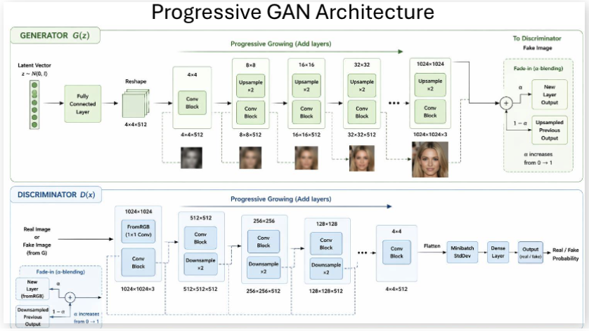

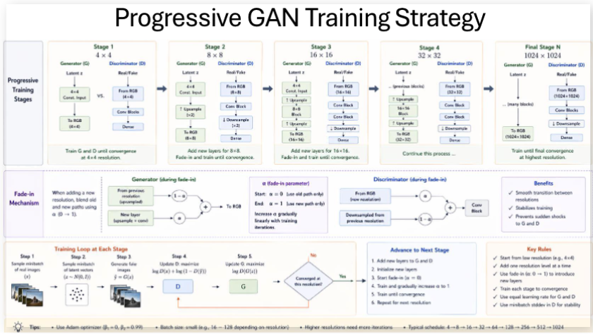

The architecture of ProGAN grows gradually.

### Generator Side

1. Input is a random noise vector.
2. A fully connected layer converts it into an initial small feature map.
3. Convolution blocks generate a $4 \times 4$ image.
4. New upsampling and convolution blocks are added step by step.
5. The image resolution keeps increasing until the target resolution is reached.

### Discriminator Side

1. The discriminator receives real or fake images.
2. It processes images from the current resolution.
3. Downsampling and convolution blocks reduce the image size gradually.
4. Finally, it decides whether the image is real or fake.

### Simple Flow of ProGAN
Noise Vector -> Generator -> Small Image -> Add Layers Gradually -> Higher Resolution Image -> Discriminator -> Real/Fake Decision

## Training Strategy of ProGAN

The training strategy of ProGAN is progressive.

1. Train generator and discriminator at $4 \times 4$ resolution.
2. Add new layers for $8 \times 8$ resolution.
3. Use fade-in to smoothly mix old and new layers.
4. Train until that stage becomes stable.
5. Add layers again for $16 \times 16$.
6. Repeat the same process for larger sizes.
7. Continue until the final high resolution is reached.

This gradual training is the main reason ProGAN works better than many early GANs for high-resolution image generation.

## Applications of Progressive GAN

ProGAN is useful in tasks where realistic high-resolution images are needed.

1. **Face Generation**
2. **Art Creation**
3. **Data Augmentation**
4. **Fashion Design**
5. **Medical Image Synthesis**
6. **Game Character Generation**

## Advantages of Progressive GAN

1. Produces realistic human faces and other high-quality images.
2. Training is more stable than many early GAN models.
3. Supports very high-resolution outputs.
4. Learns in a smooth step-by-step manner.
5. Generates better image quality than traditional early GANs.

## Limitations of Progressive GAN

1. Training is still computationally expensive.
2. The architecture is more complex than a basic GAN.
3. Later models such as StyleGAN improved this idea even further.

## Key Idea

The key idea of ProGAN is:

1. Start with small images.
2. Learn simple patterns first.
3. Gradually grow the network.
4. Add fine details later.

So, Progressive GAN generates high-resolution images successfully because it does **not** try to learn everything at once.

In summary, ProGAN is an important GAN model that improved image quality and training stability by growing the generator and discriminator gradually from low resolution to high resolution.

# StackGAN

StackGAN is a **multimodal Generative Adversarial Network** designed to generate **high-resolution images from text descriptions**.

The name **StackGAN** means that the model uses **stacked stages**. Instead of creating the final detailed image in one step, it divides the work into two simpler steps.

## Simple Idea of StackGAN

The easiest way to understand StackGAN is this:

1. Read the text description.
2. First create a small rough image.
3. Then improve that image and add more details.

So, StackGAN works like a rough sketch followed by final painting.

## Simple Example

Suppose the text description is:

**"A yellow bird with black wings."**

StackGAN works in two stages:

1. **Stage-I GAN**: Creates a small low-resolution image of a bird based on the text.
2. **Stage-II GAN**: Takes that low-resolution bird image and refines it to produce a clearer, more realistic, and high-resolution image.

This is why StackGAN is easier to understand than a single GAN doing everything at once.

## Why StackGAN Is Important

Generating detailed images directly from text is difficult because the model must understand both language and visual details.

StackGAN makes this easier by splitting the task into sub-problems:

1. First understand the text and create the basic shape.
2. Then improve the image quality and fine details.

This step-by-step method helps the model produce better and more realistic results.

## Architecture of StackGAN

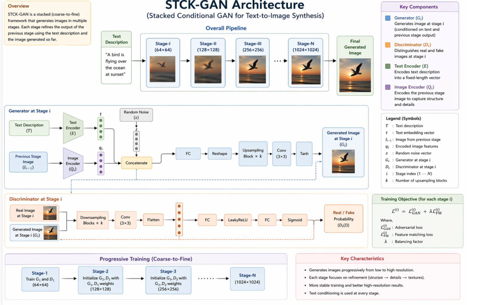

StackGAN usually contains the following parts:

1. **Text Embedding**: The input text is converted into a fixed-length vector representation.
2. **Conditioning Augmentation (CA)**: This technique creates slight variations of the text condition, which improves diversity and makes training more stable.
3. **Stage-I Generator**: Generates a low-resolution image, usually around $64 \times 64$.
4. **Stage-I Discriminator**: Checks whether the low-resolution image matches the text and looks realistic.
5. **Stage-II Generator**: Takes the Stage-I image and refines it into a high-resolution image, often around $256 \times 256$.
6. **Stage-II Discriminator**: Checks whether the refined high-resolution image is realistic and consistent with the text.
7. **Residual Blocks**: Used in Stage-II to improve details and refinement.

### Simple Flow of StackGAN
Text Description -> Text Embedding -> Stage-I GAN -> Low-Resolution Image -> Stage-II GAN -> High-Resolution Image

## How StackGAN Works

The working of StackGAN can be explained step by step:

1. **Input Text Description**: A sentence such as *"A yellow bird with black wings"* is given to the model.
2. **Convert Text into Embedding**: The sentence is converted into a numerical vector.
3. **Apply Conditioning Augmentation**: The text vector is slightly varied to increase diversity.
4. **Stage-I Generation**: The Stage-I generator uses the text embedding and random noise to generate a small rough image.
5. **Stage-I Discrimination**: The Stage-I discriminator checks whether the image looks real and matches the text.
6. **Stage-II Refinement**: The Stage-II generator takes the rough image and the text condition, then adds sharper details, colors, and textures.
7. **Stage-II Discrimination**: The Stage-II discriminator checks the refined image again.
8. **Final Output**: A more realistic and high-resolution image is produced.

## Two Stages of StackGAN

### Stage-I GAN

1. Focuses on basic shape and color.
2. Generates a low-resolution image.
3. Produces the rough visual idea of the object.

### Stage-II GAN

1. Focuses on refinement and detail.
2. Improves the Stage-I image.
3. Produces a sharper and more realistic high-resolution image.

## Role of Conditioning Augmentation

Conditioning Augmentation is an important idea in StackGAN.

It helps by:

1. Creating more variation from the same text description.
2. Reducing overfitting.
3. Making training smoother and more stable.
4. Improving diversity in generated images.

## Applications of StackGAN

StackGAN is useful in many text-to-image tasks.

1. **Text-to-Image Generation**: Generate images directly from text descriptions.
2. **E-Commerce Product Visualization**: Create product mockups from written descriptions.
3. **Fashion Design**: Generate clothing concepts from prompts.
4. **Game Asset Creation**: Create characters, objects, or environments from text.
5. **Story Illustration**: Convert written stories into scene images.
6. **Advertising and Marketing**: Generate promotional visuals from campaign text.
7. **Interior Design**: Generate room layouts or room concepts from descriptions.
8. **Architecture Visualization**: Create building concepts from text.
9. **Education**: Visualize concepts described in text.
10. **Medical Illustration**: Generate annotated visuals from medical descriptions.

## Advantages of StackGAN

1. Produces higher-quality images from text compared to basic text-to-image GANs.
2. Splits a difficult task into two easier stages.
3. Generates more detailed and realistic images.
4. Conditioning augmentation improves variety and stability.

## Limitations of StackGAN

1. Training is more complex because two GAN stages are involved.
2. The generated image may still miss some details from the text.
3. Like other GANs, training can still be unstable.

## Key Idea

The key idea of StackGAN is:

1. Use text to create a rough image first.
2. Then improve that rough image in a second stage.

So, StackGAN turns text into images in a **coarse-to-fine** manner.

In summary, StackGAN is an important text-to-image generation model that creates a low-resolution image first and then refines it into a high-resolution image. This two-stage design makes the generation process easier, clearer, and more effective.

# Pix2Pix

Pix2Pix is a **conditional Generative Adversarial Network (cGAN)** used for **paired image-to-image translation**. It learns to convert one type of image into another when matching input-output image pairs are available.

In simple words, Pix2Pix learns a mapping:

$$
x \rightarrow y
$$

where:

1. $x$ = input image
2. $y$ = target output image

## Simple Idea of Pix2Pix

The easiest way to understand Pix2Pix is this:

1. Give the model an input image.
2. Also give the correct output image for training.
3. The model learns how the input should be converted into the output.

So, Pix2Pix is useful when we already have **paired examples**.

## Simple Example

Suppose we have many training pairs like this:

1. **Input**: House sketch
2. **Output**: Realistic house photo

After learning from many such pairs, Pix2Pix can take a new house sketch and generate a realistic house image.

This means the model learns how sketches correspond to photos.

## Examples of Pix2Pix Applications

Pix2Pix can be used for many paired image translation tasks such as:

1. **Sketch -> Real photo**
2. **Edges -> Building image**
3. **Black and White -> Color image**
4. **Satellite map -> Street view**
5. **Label mask -> Scene image**

## Why Pix2Pix Is Important

Pix2Pix is important because many real-world tasks need one image representation to be converted into another.

For example:

1. A sketch can be turned into a photo.
2. A segmentation mask can be turned into a realistic scene.
3. A satellite image can be converted into a road map.

Pix2Pix makes this possible when paired training data is available.

## Architecture of Pix2Pix

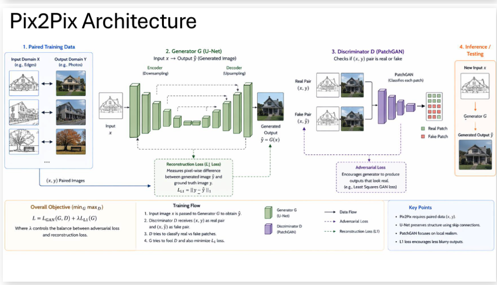

Pix2Pix contains two main networks:

1. **Generator (G)**: Converts the input image into the output image.
2. **Discriminator (D)**: Checks whether the input-output pair is real or fake.

### Generator

1. The generator transforms the input image into the target image.
2. It usually uses a **U-Net architecture**.
3. U-Net has **skip connections**, which help preserve important spatial details from the input image.

Example:

Sketch -> Generator -> Generated Photo

### Discriminator

1. The discriminator checks whether the pair is real or fake.
2. It receives:
	a. **Real pair**: (input image, true output image)
	b. **Fake pair**: (input image, generated output image)
3. It often uses **PatchGAN**, which checks local image patches instead of the whole image at once.

## How Pix2Pix Works

The working of Pix2Pix can be explained step by step:

1. **Step 1: Input Image**: Give the input image $x$. Example: edge map of a shoe.
2. **Step 2: Generator Creates Output**: The generator produces an output image:

$$
\hat{y} = G(x)
$$

3. **Step 3: Discriminator Checks the Pair**: The discriminator compares:
	a. $(x, y)$ as the real pair
	b. $(x, \hat{y})$ as the fake pair
4. **Step 4: Train Both Networks**:
	a. The generator tries to fool the discriminator.
	b. The discriminator tries to detect fake outputs.
5. **Step 5: Improve the Output**: Over training, the generated output becomes more realistic and closer to the target image.

## Loss Functions in Pix2Pix

Pix2Pix mainly uses two losses:

1. **Adversarial Loss**: Helps the generator produce outputs that look realistic.
2. **L1 Loss (Reconstruction Loss)**: Makes the generated output close to the real target image.

The combination of these two losses helps Pix2Pix create images that are both realistic and accurate.

## Role of U-Net and PatchGAN

Two important ideas in Pix2Pix are:

1. **U-Net Generator**: Preserves image structure using skip connections.
2. **PatchGAN Discriminator**: Focuses on local details and textures by checking small image patches.

This combination helps Pix2Pix generate sharp and well-structured results.

## Applications of Pix2Pix

Pix2Pix is useful in many real-world image translation tasks.

1. **Sketch to Photo**: Convert drawings into realistic faces or objects.
2. **Colorization**: Convert black-and-white images into color images.
3. **Map Generation**: Convert satellite images into maps or street views.
4. **Medical Imaging**: Convert masks into reconstructed scans or enhance medical images.
5. **Architecture Design**: Convert blueprints into building visualizations.

## Advantages of Pix2Pix

1. Works well for paired image-to-image translation tasks.
2. Produces realistic outputs with preserved structure.
3. U-Net helps keep important spatial information.
4. PatchGAN improves local texture quality.
5. Useful in many design, vision, and medical applications.

## Limitations of Pix2Pix

1. It requires paired training data.
2. Collecting matched input-output pairs can be difficult.
3. It may not work well if the training pairs are limited or low quality.

## Pix2Pix vs CycleGAN

This is the easiest difference to remember:

1. **Pix2Pix**: Needs paired data.
2. **CycleGAN**: Does not need paired data.

So:

1. If you have sketch-photo pairs, use **Pix2Pix**.
2. If you only have separate sets of horse and zebra images, use **CycleGAN**.

## Key Idea

The key idea of Pix2Pix is:

1. Learn from input-output image pairs.
2. Use a generator to create the target image.
3. Use a discriminator to check whether the generated result looks real.

So, Pix2Pix is a supervised image-to-image translation model.

In summary, Pix2Pix is a powerful cGAN model that converts one image into another when paired examples are available. Its main strength is learning a direct mapping from input image to output image using U-Net and PatchGAN.

