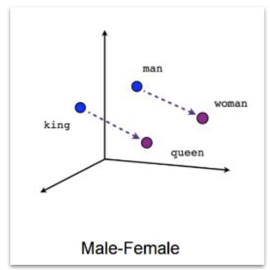
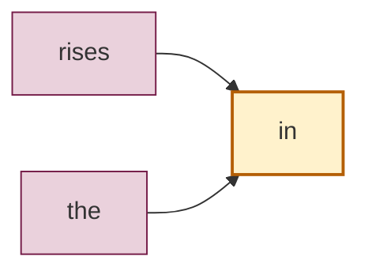
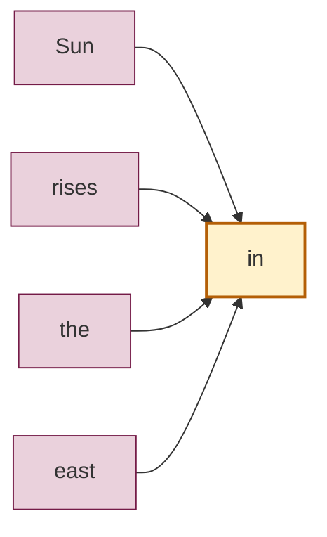
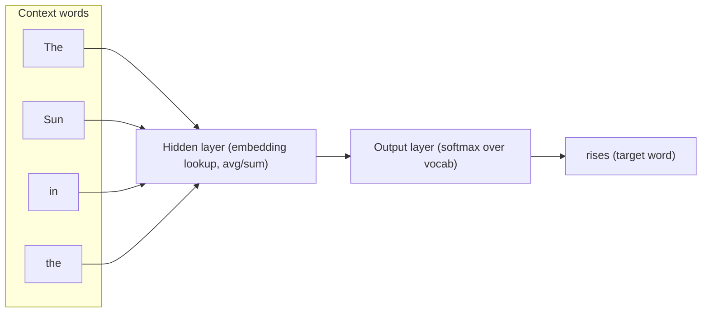
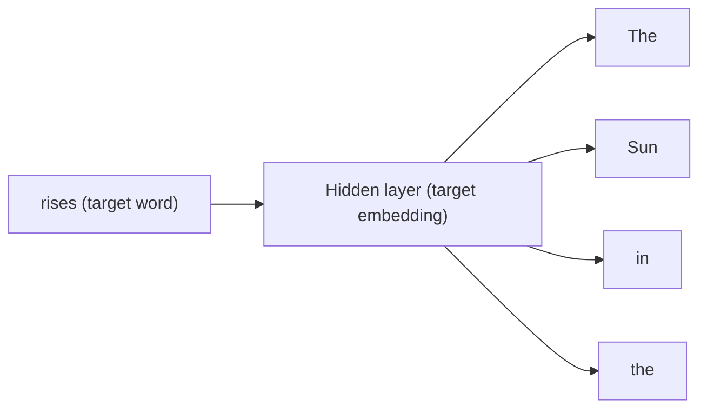

# NLP Techniques - Unit 2

## Code Reference

See [Unit 2.0.ipynb](Unit%202.0.ipynb) for implementation examples of:

- **POS (Part of Speech) Tagging** - Identifying grammatical roles of words
- **Named Entity Recognition (NER)** - Extracting named entities from text
- **Language Model Vectorization** - Converting language models to vector representations
- **Word Embedding** - Mapping words to dense vector spaces


## One Hot Encoding

One hot encoding is a technique used to convert categorical data into a binary format. Each category is represented as a binary vector where only one element is "hot" (1) and the rest are "cold" (0). This is commonly used in NLP for representing words or tokens in a way that can be processed by machine learning algorithms.

### Example

**Documents:**
- Document #1: "He is a good boy. She is also good."
- Document #2: "Radhika is a good person."

**Vocabulary:** a, also, boy, good, He, is, person, She, Radhika

**Word Index Mapping:**

| Word    | Index |
|---------|-------|
| a       | 0     |
| also    | 1     |
| boy     | 2     |
| good    | 3     |
| He      | 4     |
| is      | 5     |
| person  | 6     |
| She     | 7     |
| Radhika | 8     |

**One Hot Encoding Representation:**

Each word is represented as a vector where only the position corresponding to its index is 1, and all other positions are 0.

| Word    | One Hot Encoding                  |
|---------|-----------------------------------|
| a       | [1, 0, 0, 0, 0, 0, 0, 0, 0]     |
| also    | [0, 1, 0, 0, 0, 0, 0, 0, 0]     |
| boy     | [0, 0, 1, 0, 0, 0, 0, 0, 0]     |
| good    | [0, 0, 0, 1, 0, 0, 0, 0, 0]     |
| He      | [0, 0, 0, 0, 1, 0, 0, 0, 0]     |
| is      | [0, 0, 0, 0, 0, 1, 0, 0, 0]     |
| person  | [0, 0, 0, 0, 0, 0, 1, 0, 0]     |
| She     | [0, 0, 0, 0, 0, 0, 0, 1, 0]     |
| Radhika | [0, 0, 0, 0, 0, 0, 0, 0, 1]     |

### Document as Matrix

When we apply one-hot encoding to all words in a document, we create a matrix where each row represents a word's one-hot encoding. The words appear in the order they occur in the document.

**Document #1: "He is a good boy. She is also good."**

| Word | Index | 0 | 1 | 2 | 3 | 4 | 5 | 6 | 7 | 8 |
|------|-------|---|---|---|---|---|---|---|---|---|
| He | 4 | 0 | 0 | 0 | 0 | **1** | 0 | 0 | 0 | 0 |
| is | 5 | 0 | 0 | 0 | 0 | 0 | **1** | 0 | 0 | 0 |
| a | 0 | **1** | 0 | 0 | 0 | 0 | 0 | 0 | 0 | 0 |
| good | 3 | 0 | 0 | 0 | **1** | 0 | 0 | 0 | 0 | 0 |
| boy | 2 | 0 | 0 | **1** | 0 | 0 | 0 | 0 | 0 | 0 |
| She | 7 | 0 | 0 | 0 | 0 | 0 | 0 | 0 | **1** | 0 |
| is | 5 | 0 | 0 | 0 | 0 | 0 | **1** | 0 | 0 | 0 |
| also | 1 | 0 | **1** | 0 | 0 | 0 | 0 | 0 | 0 | 0 |
| good | 3 | 0 | 0 | 0 | **1** | 0 | 0 | 0 | 0 | 0 |

Document #1 → 9 × 9 matrix

**Document #2: "Radhika is a good person."**

| Word | Index | 0 | 1 | 2 | 3 | 4 | 5 | 6 | 7 | 8 |
|------|-------|---|---|---|---|---|---|---|---|---|
| Radhika | 8 | 0 | 0 | 0 | 0 | 0 | 0 | 0 | 0 | **1** |
| is | 5 | 0 | 0 | 0 | 0 | 0 | **1** | 0 | 0 | 0 |
| a | 0 | **1** | 0 | 0 | 0 | 0 | 0 | 0 | 0 | 0 |
| good | 3 | 0 | 0 | 0 | **1** | 0 | 0 | 0 | 0 | 0 |
| person | 6 | 0 | 0 | 0 | 0 | 0 | 0 | **1** | 0 | 0 |

Document #2 → 5 × 9 matrix

Each document becomes a 2D matrix where:
- **Rows** = number of words in the document
- **Columns** = size of the vocabulary
- Each row contains exactly one "1" (at the index corresponding to that word) and the rest are "0"s

### Issues with One Hot Encoding

1. **Curse of Dimensionality** - For large vocabulary sizes (common in NLP problems), the document matrix becomes huge and sparse, leading to increased computational and memory overhead.

2. **Loss of Semantic Information** - One hot encoding vectors do not provide any information about how words are related to each other. There is no semantic relationship captured between similar or related words.

## Word2Vec

Word2Vec is a popular word embedding technique that converts words into dense vector representations. It captures semantic relationships between words by learning an embedding space where meaningful relationships often appear as consistent **directions**.



Word2Vec uses two main architectures:
- **CBOW (Continuous Bag of Words)**: predicts the target word from surrounding context.
- **Skip-gram**: predicts surrounding context words from a target word.

### Context Window (Window Size)

Word2Vec learns embeddings from **neighbouring words**. A *window size* $w$ means we consider up to $w$ words to the **left** and $w$ words to the **right** of a target word as its context.

**Sentence:** “The Sun rises in the east”

**Diagram (target word = `in`)**


#### Window size = 1



Context, target pairs (like the slide notation): **(rises, in)**, **(the, in)**

For each target word, take 1 word to the left and 1 word to the right (when available):

| Target | Context words |
|--------|--------------|
| The    | Sun          |
| Sun    | The, rises    |
| rises  | Sun, in       |
| in     | rises, the    |
| the    | in, east      |
| east   | the          |

Example (Skip-gram style) **(target → context)** pairs:
- (Sun → The), (Sun → rises)
- (in → rises), (in → the)

#### Window size = 2



Context, target pairs: **(Sun, in)**, **(rises, in)**, **(the, in)**, **(east, in)**

For each target word, take up to 2 words on each side:

| Target | Context words |
|--------|--------------|
| The    | Sun, rises |
| Sun    | The, rises, in |
| rises  | The, Sun, in, the |
| in     | Sun, rises, the, east |
| the    | rises, in, east |
| east   | in, the |

This is how Word2Vec creates training examples in an **unsupervised** way: by predicting a word from its neighbours (CBOW) or predicting neighbours from a word (Skip-gram).

### Vector Relationships (Analogies)

In Word2Vec embeddings, some relationships can be expressed using vector arithmetic (analogy-style reasoning):

- **Male–Female**: king − man + woman ≈ queen
- **Verb tense**: walked − walking ≈ swam − swimming
- **Country–Capital**: Italy − Rome ≈ Germany − Berlin (and similarly for other country–capital pairs)

### CBOW (Continuous Bag of Words)

In **CBOW**, the model takes a set of **context words** (neighbours) as input and tries to predict the **target word** in the middle.

#### Neural-network view (Input → Hidden → Output)

- **Input layer**: the context words (often represented as one-hot vectors or word IDs).
- **Hidden layer**: the “Neural Network” box in the slide. In classic Word2Vec, this is effectively the **embedding lookup + averaging/summing** of the context word embeddings (a lightweight network, not a deep model).
- **Output (target) layer**: a probability distribution over the vocabulary (typically via softmax / negative sampling) to predict the **target word**.

**Example (window size = 2):**

Sentence: “The Sun rises in the east”

Context words: **The, Sun, in, the**  → Target word: **rises**



Key idea: CBOW learns word embeddings by repeatedly answering: **“Given neighbouring words, what is the most likely middle word?”**

### Skip-gram

In **Skip-gram**, the model does the opposite of CBOW: it takes a **target word** as input and tries to predict the **context words** around it.

#### Neural-network view (Input → Hidden → Output)

- **Input layer**: the target word (one-hot vector or word ID).
- **Hidden layer**: the “Neural Network” box (embedding lookup for the target word).
- **Output layer**: predicts one or more nearby context words (again via softmax / negative sampling).

**Example (window size = 2):**

Sentence: “The Sun rises in the east”

Target word: **rises**  → Context words: **The, Sun, in, the**



Key idea: Skip-gram learns embeddings by answering: **"Given this word, which words tend to appear near it?"**

---

## Word2Vec Neural Network Architecture

Word2Vec uses a **simple shallow neural network** — just three layers:

```
Input Layer  →  Hidden Layer  →  Output Layer
(one-hot)       (embeddings)      (softmax)
```

---

### Input Layer

Each word is fed into the network as a **one-hot vector**.

- **Size of the input vector = vocabulary size**
- If we have a vocabulary of **10,000 words**, the input vector has **10,000 dimensions**
- All values are `0` except one `1` at the index of the target word

**Example — the word "king" with a 10,000-word vocabulary:**

```
Index:   0    1    2    ...   [4500]   ...   9999
Vector: [0,   0,   0,   ...,    1,    ...,    0 ]
                                ↑
                          "king" = index 4500
```

| Property | Value |
|----------|-------|
| Vector type | One-hot |
| Vector length | Vocabulary size (e.g. 10,000) |
| Non-zero values | Exactly 1 |
| Captures semantics? | No — all words are equally distant |

---

### Hidden Layer

The hidden layer is the heart of Word2Vec — this is where the **embeddings live**.

- You choose the number of neurons (a hyperparameter)
- A common choice is **50** neurons (or 100, 200, 300 — your choice)
- The hidden layer has **no activation function** (linear projection)
- Each word's hidden layer output = its **word embedding vector**

```
Input layer        Hidden layer
(10,000 units)     (50 units)

  [ 0 ]               ( o )
  [ 0 ]          ╱    ( o )
  [ 0 ]    W1   ╱     ( o )
  [ 1 ] ────────  ──▶ ( o )    ← 50 numbers for "king"
  [ 0 ]         ╲    ( o )
  [ 0 ]          ╲   ( o )
  [ 0 ]
  ...
(10,000 dims)     (50 dims)
```

| Property | Value |
|----------|-------|
| Number of neurons | 50 (hyperparameter — choose freely) |
| Output per word | 50 numbers (the word embedding) |
| Activation | None (linear) |
| Weight matrix W₁ | Shape: 10,000 × 50 |

> The weight matrix **W₁** is what gets trained. After training, each **row** of W₁ is the embedding for one word.

---

### Output Layer

The output layer reconstructs the vocabulary distribution to make predictions.

- **Size = vocabulary size** (10,000)
- Uses **softmax** to output a probability over all words
- During training: predicts context words (Skip-gram) or target word (CBOW)

```
Hidden layer       Output layer
(50 units)         (10,000 units)

  ( o )                [ ]
  ( o )   W2    ╱      [ ]
  ( o ) ──────────▶    [ ]      10,000 predicted probabilities
  ( o )         ╲     [ ]
  ( o )                [ ]
                       ...
  (50 dims)        (10,000 dims)
```

| Property | Value |
|----------|-------|
| Number of outputs | Same as vocabulary size (10,000) |
| Activation | Softmax → probability distribution |
| Weight matrix W₂ | Shape: 50 × 10,000 |

> **Problem**: 10,000 softmax outputs is very expensive.
> **Solution**: Use **Negative Sampling** or **Hierarchical Softmax** to approximate it efficiently.

---

### Getting the Word Embeddings

After training is complete, **the output layer is discarded entirely** — it was only needed during training.

```
Input layer        Hidden layer        Output layer
(10,000)           (50)                (10,000)
                                           ✕  ← discarded after training
    [one-hot]  →  [embedding]  →  [softmax]
```

The **output of the hidden layer IS the word embedding**:

- For each of the 10,000 words in the vocabulary, the hidden layer produces **50 numbers**
- These 50 numbers are the word's **embedding vector** — a dense, meaningful representation
- **Embedding size = number of neurons in the hidden layer = 50**

---

### The "king" Embedding — End to End

Using our example (vocab = 10,000, hidden = 50):

**Step 1 — One-hot input**

```
"king"  →  [0, 0, 0, ..., 1, ..., 0]   (10,000-dim, 1 at index 4500)
```

**Step 2 — Multiply by W₁ (10,000 × 50)**

```
one-hot × W₁  =  row 4500 of W₁  =  king's embedding
```

Because it's a one-hot vector, this is just a **lookup** of row 4500 — no real multiplication needed.

**Step 3 — Hidden layer output (the embedding)**

```
king  →  [ 0.71,  -0.23,  0.88,  0.14,  -0.55,  0.32,  ...,  0.19 ]
                                                               (50 numbers)
```

**Step 4 — Discard output layer, keep the 50 numbers**

```
king_vector = [ 0.71, -0.23, 0.88, 0.14, -0.55, 0.32, ..., 0.19 ]
                └──────────────── 50 dimensions ────────────────┘
```

This dense 50-number vector is what gets stored and used for downstream NLP tasks.

---

### Summary: Full Architecture

| Layer | Size | Role |
|-------|------|------|
| **Input** | 10,000 (vocab size) | One-hot encoding of the word |
| **Hidden** | 50 (chosen) | Word embedding — the output we want |
| **Output** | 10,000 (vocab size) | Predicts context/target — discarded after training |

```
                     Training                    Inference
                     ───────                     ─────────
  "king"             one-hot       embedding     output
  (word)   ──────▶  [0..1..0]  →  [50 nums]  →  [10,000]
                                       ↑              ↑
                                  KEEP THIS      THROW AWAY
```

> **Key insight**: Word2Vec doesn't care about the prediction task — the prediction is just a training signal.
> What we actually want is the **hidden layer weights** (W₁), which encode the semantic meaning of every word in just 50 numbers.

---

## FastText (by Facebook Research)

FastText extends Word2Vec by operating at the **subword level** instead of only the word level.

### Key Ideas

1. Very similar to Word2Vec in looking at **neighbours of a word**
2. Word embedding not only at **word level** but at **subword level**
3. Subwords are created as **character n-grams**
4. Can handle **unseen or rare words**

### What is Subword Level?

Instead of treating "Facebook" as one atomic token, FastText breaks it into character n-grams:

```
"Facebook"  →  "Face book"  →  fa, ce, bo, ok   (subword level)
```

### Character N-gram Example

**Word: `awesome`** (with n-gram size 3)

```
awesome  →  awe, wes, eso, som, ome
```

Each subword gets its own embedding. The final word embedding = **sum of all its subword embeddings**.

| Subword | Embedding |
|---------|-----------|
| `awe`   | [0.2, -0.1, ...] |
| `wes`   | [0.5,  0.3, ...] |
| `eso`   | [-0.1, 0.4, ...] |
| `som`   | [0.3, -0.2, ...] |
| `ome`   | [0.1,  0.5, ...] |
| **awesome** | **sum of all above** |

### Why Subwords Help

| Scenario | Word2Vec | FastText |
|----------|----------|----------|
| Word in training vocab | ✓ Has embedding | ✓ Has embedding |
| Unseen word (OOV) | ✗ No embedding | ✓ Built from subwords |
| Rare word (few examples) | Poor embedding | Better — shares subwords with common words |
| Morphologically rich languages | Struggles | Handles well (prefixes, suffixes) |

> **Example**: FastText can embed `"Facebooking"` even if it never appeared in training, because it recognises `"face"`, `"book"`, `"ing"` as known subwords.

---

## Global Vectors — GloVe (Stanford NLP)

GloVe is a word embedding technique developed by **Stanford University (2014)**.

### Key Ideas

1. Similar to Word2Vec in looking at **neighbours of a word**
2. But also takes into account **how many times two words were neighbours** (global co-occurrence counts)
3. Approach provided by **Stanford University (2014)**
4. Lots of **pre-trained models** (with different embedding sizes) available

### How GloVe Differs from Word2Vec

Word2Vec learns from a **sliding window** (local context only).
GloVe builds a **global co-occurrence matrix** first — counting how often every word pair appears across the entire corpus — then factorises it into embeddings.

```
Word2Vec:  learn from local windows one sentence at a time
GloVe:     build global count matrix → factorise → embeddings
```

**Co-occurrence matrix example:**

|          | ice | steam | water | cold | hot |
|----------|-----|-------|-------|------|-----|
| **ice**  | —   | 0.8   | 1.5   | 3.2  | 0.1 |
| **steam**| 0.8 | —     | 1.2   | 0.1  | 3.1 |

The ratio `P(cold|ice) / P(cold|steam)` is much greater than 1 → GloVe captures that *cold is related to ice*.
This **ratio of co-occurrence probabilities** is what GloVe optimises — making it more stable than Word2Vec on large corpora.

### Pre-trained GloVe Models

| Model | Corpus | Vocab | Dims |
|-------|--------|-------|------|
| `glove.6B` | Wikipedia + Gigaword | 400K | 50 / 100 / 200 / 300 |
| `glove.42B` | Common Crawl | 1.9M | 300 |
| `glove.840B` | Common Crawl | 2.2M | 300 |
| `glove.twitter.27B` | Twitter | 1.2M | 25 / 50 / 100 / 200 |

---

## Word2Vec vs FastText vs GloVe — Comparison

| Feature | Word2Vec | FastText | GloVe |
|---------|----------|----------|-------|
| **Developer** | Google (2013) | Facebook Research (2017) | Stanford NLP (2014) |
| **Training approach** | Local sliding window (CBOW / Skip-gram) | Local sliding window + subword n-grams | Global co-occurrence matrix factorisation |
| **Unit of representation** | Whole word | Word + character n-grams | Whole word |
| **Handles OOV words?** | ✗ No | ✓ Yes — via subwords | ✗ No |
| **Handles rare words?** | Poor | Good — shares subword info | Moderate |
| **Uses global statistics?** | ✗ No | ✗ No | ✓ Yes |
| **Training speed** | Fast | Slightly slower (subwords) | Moderate (matrix build) |
| **Pre-trained models?** | ✓ Google News (3M words, 300d) | ✓ 157 languages | ✓ Multiple corpora & sizes |
| **Morphologically rich languages** | Poor | Best | Moderate |
| **Embedding type** | Dense static | Dense static | Dense static |
| **Context-aware?** | ✗ One vector per word | ✗ One vector per word | ✗ One vector per word |
| **Best for** | General NLP baseline | Low-resource / rare-word tasks | Large corpora, stable training |

### When to Use Which

| Scenario | Recommendation |
|----------|---------------|
| General English NLP task | **GloVe** (stable, good pre-trained models) |
| Many rare words or OOV expected | **FastText** |
| Non-English or morphologically rich language | **FastText** |
| Need interpretable, fast baseline | **Word2Vec** |
| State-of-the-art accuracy needed | **BERT / contextual embeddings** (all three above are static) |

> **All three are static embeddings** — `bank` gets the same vector whether it means a river bank or a financial bank.
> Contextual models (BERT, GPT) solve this by generating a different vector for each occurrence depending on context.

---

## Using a Pre-trained Word2Vec Model

Instead of training from scratch, we can reuse embeddings already trained on massive corpora.
Pre-trained models are available at: [github.com/RaRe-Technologies/gensim-data](https://github.com/RaRe-Technologies/gensim-data)

### Why Pre-trained?

| Train from scratch | Use pre-trained |
|--------------------|-----------------|
| Needs large corpus | Works immediately |
| Time and compute intensive | Load and use in seconds |
| Embeddings reflect your domain | Embeddings reflect general language |
| Best for very domain-specific text | Best for general NLP tasks |

---

## Document Vectorization — End to End Example

To feed text into an ML model, every document must become a **fixed-length numerical vector**.
Below is the complete pipeline using two example documents.

### Step 1 — The Documents

| | Content |
|--|---------|
| **Document #1** | "He is a good boy. She is also good." |
| **Document #2** | "Radhika is a good person." |

---

### Step 2 — Build Vocabulary & Assign Index

Collect all unique words across all documents, then assign each a numeric index.

**Vocabulary:**

| Word    | a | also | boy | good | He | is | person | She | Radhika |
|---------|---|------|-----|------|----|----|--------|-----|---------|
| **Index** | 1 | 2  | 3   | 4    | 5  | 6  | 7      | 8   | 9       |

> Each unique word gets exactly one index. Index `0` is reserved for **padding** (dummy words).

---

### Step 3 — Create Document Vector (Replace each word by its index)

Map every word in each document to its vocabulary index, in order:

**Document #1:** `"He is a good boy. She is also good."`

```
He  →  5
is  →  6
a   →  1
good→  4
boy →  3
She →  8
is  →  6
also→  2
good→  4

Document #1 vector: [5, 6, 1, 4, 3, 8, 6, 2, 4]   (length = 9)
```

**Document #2:** `"Radhika is a good person."`

```
Radhika →  9
is      →  6
a       →  1
good    →  4
person  →  7

Document #2 vector: [9, 6, 1, 4, 7]   (length = 5)
```

| Document | Vector | Length |
|----------|--------|--------|
| Doc #1 | `[5, 6, 1, 4, 3, 8, 6, 2, 4]` | 9 |
| Doc #2 | `[9, 6, 1, 4, 7]` | 5 |

---

### Step 4 — Make Document Vectors the Same Length

ML models require all input vectors to be **the same fixed length**.

**Rules:**
1. Decide on a **chosen sequence length** (e.g. **8 words**)
2. If a document has **more** words than the chosen size → **truncate** (drop extra words)
3. If a document has **fewer** words than the chosen size → **pad** with dummy word index `0`

#### Chosen length = 8

**Document #1 — Truncation** (length 9 → 8, drop the last word):

```
Before: [5, 6, 1, 4, 3, 8, 6, 2, 4]   ← length 9
After:  [5, 6, 1, 4, 3, 8, 6, 2]       ← length 8  (last element dropped)
```

**Document #2 — Padding** (length 5 → 8, add three `0`s):

```
Before: [9, 6, 1, 4, 7]                    ← length 5
After:  [9, 6, 1, 4, 7, 0, 0, 0]           ← length 8  (padded with 0s)
```

| Document | After Truncation / Padding | Action |
|----------|---------------------------|--------|
| Doc #1 | `[5, 6, 1, 4, 3, 8, 6, 2]` | Truncated (9 → 8) |
| Doc #2 | `[9, 6, 1, 4, 7, 0, 0, 0]` | Padded (5 → 8) |

Both documents are now **length 8** — ready for an ML model.

---

### Full Pipeline Summary

```
Raw text
   │
   ├─ 1. Tokenize each document
   ├─ 2. Build vocabulary → assign integer index to each word
   ├─ 3. Convert each document to index sequence
   ├─ 4. Decide fixed sequence length L
   │       ├─ len > L  →  truncate (keep first L tokens)
   │       └─ len < L  →  pad with 0s at the end
   └─ 5. Feed fixed-length integer sequences into the model
              (Embedding layer maps each index to its word vector)
```

> **In Keras / PyTorch**, this is handled by:
> - `Tokenizer` + `pad_sequences` (Keras)
> - `torchtext` vocabulary + `nn.utils.rnn.pad_sequence` (PyTorch)
> - The `Embedding` layer then looks up the pre-trained Word2Vec / GloVe vector for each index.

---

## Text Similarity

**Text Similarity** measures *how close two chunks of text are by meaning*.

> It is not just about matching exact words — two sentences can use completely different words yet express the same idea. True text similarity captures **semantic closeness**, not just surface overlap.

---

### Where Text Similarity is Useful

| Application | How Text Similarity Helps |
|-------------|--------------------------|
| **Web Search** | Compare a search query against document text to rank results by relevance |
| **Chatbots** | Match a user's question to a known FAQ answer |
| **Recommendation** | Find products, articles, or movies with similar descriptions |
| **Plagiarism Detection** | Identify documents with the same meaning even if reworded |
| **Duplicate Detection** | Merge records that refer to the same entity |
| **Machine Translation QA** | Check if a translated sentence preserves the original meaning |

---

### How to Check Text Similarity

The process has two stages:

```
Text #1 ──┐                         ┌──▶ Similarity Score
           ├──▶  Build Features ──▶  Compare Features
Text #2 ──┘                         └──▶ (0.0 = unrelated, 1.0 = identical)
```

#### Stage 1 — Build Features

Convert each text into a numerical representation using one of:

| Method | Type | Captures Meaning? |
|--------|------|------------------|
| **Count (BoW)** | Sparse vector | No — word frequency only |
| **TF-IDF** | Sparse vector | Partial — weights rare words |
| **Word2Vec** | Dense vector | Yes — semantic relationships |
| **GloVe** | Dense vector | Yes — global co-occurrence |
| **FastText** | Dense vector | Yes — subword aware |

#### Stage 2 — Compare Features

Once both texts are vectors, compute a similarity (or distance) score:

| Metric | Formula | Range | Meaning |
|--------|---------|-------|---------|
| **Cosine Similarity** | `cos(θ) = (A · B) / (‖A‖ ‖B‖)` | 0 → 1 | 1 = same direction = same meaning |
| **Euclidean Distance** | `d = √Σ(aᵢ − bᵢ)²` | 0 → ∞ | 0 = identical; larger = more different |
| **Jaccard Index** | `\|A ∩ B\| / \|A ∪ B\|` | 0 → 1 | 1 = same words; 0 = no overlap |
| **ML Model** | Learned function | 0 → 1 | Trained end-to-end (e.g. BERT + cosine) |

---

### Cosine Similarity — Deep Dive

Cosine similarity is the **most widely used** metric for text similarity because it is **angle-based**, not magnitude-based — a short document and a long document about the same topic will still score highly.

```
          B
         /
        /  θ (small angle = similar)
       /____
      A

cos(θ) close to 1  →  texts are similar
cos(θ) close to 0  →  texts are unrelated
```

**Formula:**

```
               A · B          Σ(aᵢ × bᵢ)
cos(θ)  =  ──────────  =  ─────────────────────
             ‖A‖ ‖B‖       √Σaᵢ² × √Σbᵢ²
```

**Example with TF-IDF vectors:**

| | "I love NLP" | "I enjoy NLP" | "The stock fell" |
|--|:---:|:---:|:---:|
| **"I love NLP"** | 1.00 | ~0.85 | ~0.05 |
| **"I enjoy NLP"** | ~0.85 | 1.00 | ~0.05 |
| **"The stock fell"** | ~0.05 | ~0.05 | 1.00 |

---

### Jaccard Index — Deep Dive

Jaccard measures **word-set overlap** — useful for short texts, keywords, or tag matching.

```
         |A ∩ B|         words in BOTH texts
J(A,B) = ───────  =  ──────────────────────────
         |A ∪ B|      words in EITHER text (union)
```

**Example:**

```
Text A: {"the", "cat", "sat", "on", "mat"}
Text B: {"the", "cat", "sat", "on", "log"}

Intersection: {"the", "cat", "sat", "on"}  → 4 words
Union:        {"the", "cat", "sat", "on", "mat", "log"}  → 6 words

J(A, B) = 4 / 6 = 0.67
```

> Jaccard ignores word frequency and order — it is best for **keyword matching and set-based comparisons**, not semantic meaning.

---

### Euclidean Distance — Deep Dive

Euclidean distance measures the **straight-line distance** between two vectors in embedding space.

```
d(A, B) = √[ (a₁−b₁)² + (a₂−b₂)² + ... + (aₙ−bₙ)² ]
```

- **d = 0** → identical vectors
- **d large** → vectors far apart = texts are different

> **Limitation**: Euclidean distance is sensitive to vector magnitude (length of document). A long document can appear distant from a short one even if they cover the same topic. This is why **cosine similarity is preferred** for text.

---

### Choosing the Right Approach

```
Build Features          Compare Features       Best For
──────────────          ────────────────       ────────
Count / TF-IDF    ──▶   Cosine Similarity  ──▶  Keyword-based search, document retrieval
Count / TF-IDF    ──▶   Jaccard Index      ──▶  Tag matching, short text, deduplication
Word2Vec / GloVe  ──▶   Cosine Similarity  ──▶  Semantic similarity, paraphrase detection
Word2Vec / GloVe  ──▶   Euclidean Distance ──▶  Clustering similar documents
Any embedding     ──▶   ML Model (BERT)    ──▶  High-accuracy QA, chatbots, NLI
```

| Scenario | Recommended Pipeline |
|----------|--------------------|
| Fast keyword search | TF-IDF + Cosine Similarity |
| Short texts / tags | BoW + Jaccard Index |
| Semantic meaning matters | Word2Vec / GloVe + Cosine Similarity |
| State-of-the-art accuracy | BERT embeddings + Cosine Similarity |
| Training data available | Any features + ML classifier |

---

### Summary

```
Text #1 ──┐
           ├──▶  Vectorize  ──────────────────────────────────────────────┐
Text #2 ──┘      (BoW / TF-IDF / Word2Vec / GloVe / FastText)             │
                                                                           ▼
                                                              Compare ──▶ Score (0–1)
                                                              • Cosine Similarity  (angle)
                                                              • Euclidean Distance (distance)
                                                              • Jaccard Index      (overlap)
                                                              • ML Model           (learned)
```

> **Key insight**: The quality of text similarity depends on how well you vectorize.
> TF-IDF captures keyword overlap; Word2Vec / GloVe capture meaning.
> For the best results on real-world tasks, use **dense embeddings + cosine similarity**.

---

## Topic Modeling

**Topic modeling** is one of the most common applications of NLP.

> We are given a large collection of documents and asked to **"make sense" out of it** — automatically discovering the hidden thematic structure without any labels.

Unlike classification (where you assign a pre-defined label), topic modeling is **unsupervised** — the model discovers topics on its own.

### Popular Topic Modeling Algorithms

1. **Latent Dirichlet Allocation (LDA)** — most widely used
2. Latent Semantic Analysis (LSA)
3. Probabilistic Latent Semantic Analysis (PLSA)

---

## Latent Dirichlet Allocation (LDA)

**LDA** is a probabilistic generative model that assumes:
- Each **document** is a mixture of topics
- Each **topic** is a mixture of words

> "Latent" = hidden (topics are not observed)
> "Dirichlet" = the probability distribution used to model mixtures
> "Allocation" = assigning words to topics

### Core Assumptions

```
Every document  →  is a blend of K topics  (e.g. 60% Topic A, 40% Topic B)
Every topic     →  is a distribution over words  (e.g. "broccoli" 30%, "banana" 15%)
```

LDA works **backwards**: given the documents, find the topics and topic-word distributions that most likely generated them.

---

### What Does LDA Do? — Example

#### Input: 5 Documents

| Doc | Text |
|-----|------|
| D1 | "I like to eat broccoli and bananas." |
| D2 | "I ate a banana and salad for breakfast." |
| D3 | "Puppies and kittens are cute." |
| D4 | "My sister adopted a kitten yesterday." |
| D5 | "Look at this cute hamster munching on a piece of broccoli." |

LDA is told: *find 2 topics (K = 2).*

---

#### Output: Topics + Document Mixtures

**Topic distributions (what words define each topic):**

| Topic | Top Words | Theme (human-assigned label) |
|-------|-----------|------------------------------|
| **Topic A** | broccoli 30%, bananas 15%, breakfast 10%, munching 10%, … | 🥦 Food |
| **Topic B** | puppies 20%, kittens 20%, cute 20%, hamster 15%, … | 🐾 Animals |

**Document-topic mixtures:**

| Document | Topic A (Food) | Topic B (Animals) | Dominant Topic |
|----------|:--------------:|:-----------------:|----------------|
| D1 — "broccoli and bananas" | **100%** | 0% | Food |
| D2 — "banana and salad" | **100%** | 0% | Food |
| D3 — "Puppies and kittens" | 0% | **100%** | Animals |
| D4 — "sister adopted a kitten" | 0% | **100%** | Animals |
| D5 — "cute hamster… broccoli" | **60%** | 40% | Mostly Food |

> LDA does **not** name the topics — it only outputs word probability distributions.
> Humans look at the top words and assign a label like "Food" or "Animals".

---

### How LDA Works (Intuition)

```
Start:  Randomly assign every word in every document to a topic

Repeat (many iterations):
  For each word w in document d:
    1. Pretend w has no topic assignment
    2. Ask: given the topic mix of d and how common w is in each topic,
            what topic should w belong to?
    3. Reassign w to the most likely topic

After convergence:
  → Topic–word distributions stabilise
  → Document–topic distributions stabilise
```

This iterative process is called **Collapsed Gibbs Sampling** — the standard way to train LDA.

---

### Key Hyperparameters

| Parameter | Meaning | Effect |
|-----------|---------|--------|
| **K** | Number of topics | Must be chosen before training (try 5–50 for typical corpora) |
| **α (alpha)** | Document-topic concentration | Low α → documents focus on few topics; High α → documents spread across many topics |
| **β (beta)** | Topic-word concentration | Low β → topics are narrow (specific words); High β → topics are broad |

---

### LDA vs Other Algorithms

| | LDA | LSA | PLSA |
|--|-----|-----|------|
| **Type** | Probabilistic (Bayesian) | Linear algebra (SVD) | Probabilistic (MLE) |
| **Handles new docs?** | ✓ Yes (inference) | ✗ Recompute | ✗ Recompute |
| **Interpretability** | High | Moderate | Moderate |
| **Overfitting risk** | Low (Dirichlet prior) | — | High (no prior) |
| **Speed** | Moderate | Fast | Moderate |
| **Most popular?** | ✓ Yes | Common | Rarely used now |

---

### Where LDA is Used

| Use Case | Example |
|----------|---------|
| **News organisation** | Automatically tag articles by topic (politics, sports, finance) |
| **Customer feedback** | Discover complaint themes from thousands of reviews |
| **Research** | Find research themes across thousands of academic papers |
| **Recommendation** | Suggest articles with overlapping topics |
| **Legal discovery** | Group contracts by subject matter |

---

### Summary

```
Input:   Collection of documents (no labels)
          │
          ▼
        LDA (K topics)
          │
          ├──▶  Topic–word distributions
          │     Topic A: {broccoli: 30%, banana: 15%, ...}  → "Food"
          │     Topic B: {puppy: 20%, kitten: 20%, ...}     → "Animals"
          │
          └──▶  Document–topic mixtures
                D1: 100% Topic A
                D3: 100% Topic B
                D5:  60% Topic A, 40% Topic B
```

> **Key insight**: LDA turns an unstructured pile of text into structured, interpretable themes —
> without any labelled training data. It is the go-to first step for **exploratory analysis** of large text corpora.