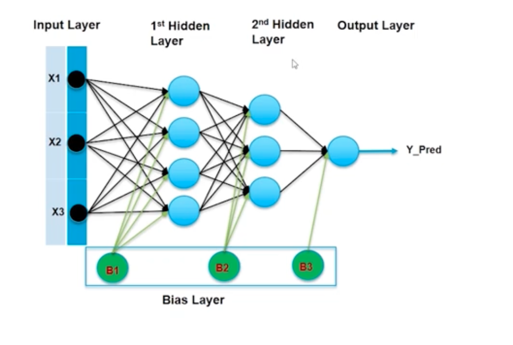
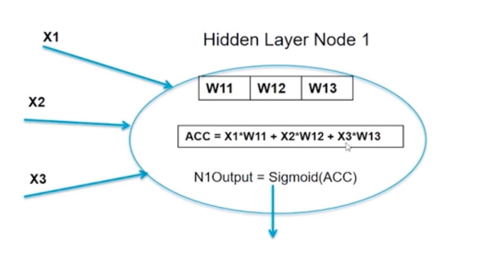
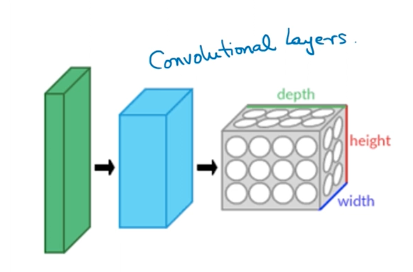
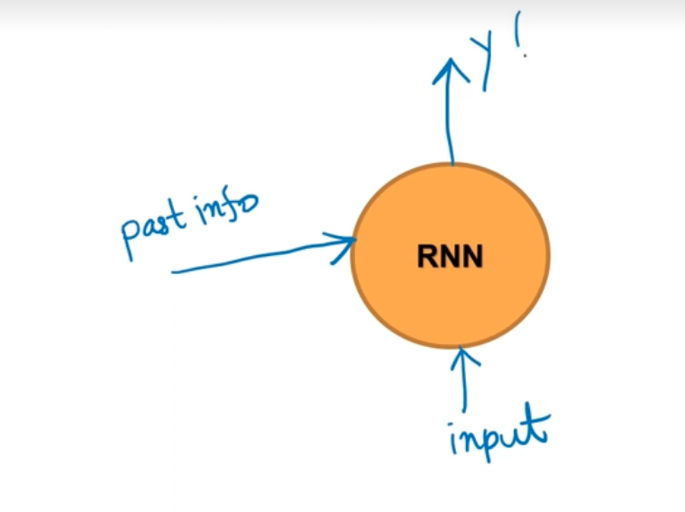

## Neural Networks - Deep Learning

A **Neural Network** is a machine learning model inspired by the structure and function of the human brain. It is built from layers of interconnected nodes called **neurons** that collectively learn to map input data to a desired output. Neural Networks excel at tasks involving complex, high-dimensional data — including image recognition, natural language processing, and speech recognition.

### Biological vs. Artificial Neuron

The design of an artificial neuron is a direct analogy to the biological neuron:

| Biological Neuron | Artificial Neuron |
|---|---|
| Dendrites receive signals | Inputs (X1, X2, … Xn) received |
| Cell body processes signals | Weighted sum computed |
| Axon transmits the result | Activation function applied → Output produced |

Just as a biological neuron "fires" only when the incoming signal is strong enough, an artificial neuron activates only when its weighted input crosses a threshold — controlled by the **activation function**.


---

## Artificial Neural Networks (ANNs)

An **Artificial Neural Network (ANN)** consists of an input layer, one or more hidden layers, and an output layer. Every neuron in one layer connects to every neuron in the next — this is a **fully connected** (or **dense**) architecture.

### Key Components

| Component | Role |
|---|---|
| **Input Layer** | Receives raw features (X1, X2, X3). One neuron per feature. |
| **Hidden Layers** | Extract and transform features progressively. Each additional layer learns more abstract representations. |
| **Output Layer** | Produces the final prediction (Y_Pred). Single neuron for regression/binary; multiple for multi-class. |
| **Weights (W)** | Learnable parameters on every connection. Adjusted during training via backpropagation. |
| **Bias (B)** | An extra parameter per layer (B1, B2, B3…) that shifts the activation function, allowing the model to fit data that doesn't pass through the origin. |
| **Activation Function** | Introduces non-linearity inside each neuron (e.g., Sigmoid, ReLU, Tanh). Without it, the network collapses to a simple linear model regardless of depth. |
| **Loss Function** | Quantifies the error between predicted and actual output (e.g., Cross-Entropy, MSE). The training goal is to minimise this. |
| **Optimizer** | Algorithm that updates weights to reduce the loss (e.g., SGD, Adam, RMSProp). |



> **Reading the diagram:** All three inputs (X1, X2, X3) fan out to **every** neuron in the 1st Hidden Layer. Those neurons then fan out to every neuron in the 2nd Hidden Layer, which finally connects to the single Output neuron (Y_Pred). The green **Bias neurons** (B1, B2, B3) inject a constant offset into each layer independently — they are not connected to the input.

---

## Inside a Neuron — Weighted Sum & Activation

Every neuron performs exactly **two operations**:

**Step 1 — Accumulate** (weighted sum of inputs + bias):

$$\text{ACC} = X_1 \cdot W_{11} + X_2 \cdot W_{12} + X_3 \cdot W_{13} + b$$

**Step 2 — Activate** (apply a non-linear function):

$$\text{Output} = \sigma(\text{ACC}) = \text{Sigmoid}(\text{ACC}) = \frac{1}{1 + e^{-\text{ACC}}}$$



This same two-step computation runs at **every neuron** across every layer. The weights $W_{ij}$ are what the network *learns* — backpropagation computes the gradient of the loss with respect to each weight, and the optimizer updates them to reduce the error.

### Common Activation Functions

| Function | Formula | When to use |
|---|---|---|
| **Sigmoid** | $\frac{1}{1+e^{-x}}$ | Binary classification output layer |
| **ReLU** | $\max(0, x)$ | Hidden layers (most common) |
| **Softmax** | $\frac{e^{x_i}}{\sum e^{x_j}}$ | Multi-class classification output layer |
| **Tanh** | $\frac{e^x - e^{-x}}{e^x + e^{-x}}$ | Hidden layers when output needs to be in [-1, 1] |

---

## Training a Neural Network

Training adjusts the weights and biases so the network's predictions get closer to the true labels. The process follows four steps every iteration:

1. **Forward Pass** — Input flows through the network layer by layer, producing a prediction.
2. **Loss Computation** — The loss function measures how wrong the prediction is.
3. **Backward Pass (Backpropagation)** — The gradient of the loss is computed with respect to every weight using the chain rule.
4. **Weight Update** — The optimizer nudges each weight in the direction that reduces the loss:
   $W \leftarrow W - \eta \cdot \nabla_W \mathcal{L}$  (where $\eta$ is the **learning rate**)

This loop repeats for many **epochs** until the loss converges.

---

## Deep Neural Networks (DNNs)

A Neural Network with **two or more hidden layers** is called a **Deep Neural Network (DNN)** — the foundation of modern **Deep Learning**.

The depth is what makes DNNs powerful: each layer builds on the previous one, learning increasingly abstract representations:

```
Raw pixels  →  Edges  →  Shapes  →  Parts  →  Objects
   (Input)    (Layer 1)  (Layer 2)  (Layer 3)  (Output)
```

This hierarchical feature learning makes DNNs especially effective for:
- **Image recognition** — detecting objects, faces, diseases in images
- **NLP** — understanding sentiment, translating languages, summarising text  
- **Speech** — transcribing audio, detecting speaker identity

> In Keras, a fully connected layer is implemented as `Dense(units, activation='relu')`. Stacking multiple `Dense` layers gives you a DNN.

---

## Mathematical Foundations *(reference only — no derivations needed)*

Two theorems form the theoretical backbone of why neural networks work. You don't need to prove them — just understand what they *guarantee*.

---

### a. Kolmogorov's Theorem

> *Any continuous function f defined on an n-dimensional cube is representable by sums and superpositions of continuous functions of only one variable.*

$$f(x_1, x_2, \ldots, x_n) = \sum_{q=1}^{2n+1} g\!\left(\sum_{p=1}^{n} \lambda_p \,\phi_q(x_p)\right)$$

**Simple way to think about it:**  
Imagine predicting house prices — the price depends on size, location, age, number of rooms — many variables at once. That's a complex, multi-variable function. Kolmogorov said: no matter how complicated that relationship is, you can always break it down into simpler single-variable functions stacked together.

A neural network does exactly that — each neuron handles a small, simple piece of the problem. Stack enough of them together and the network can model **any** relationship, no matter how complex.

> **The guarantee:** A neural network is powerful enough to learn *any* pattern in data. This is formalised as the **Universal Approximation Theorem**.

---

### b. Cover's Theorem

> *Given a set of training data that is not linearly separable, one can with high probability transform it into a training set that is linearly separable by projecting it into a higher-dimensional space via some non-linear transformation.*

```
X1 ──┐                          y = f(x)
     ├──► [ Model / Transform P ] ──► separable in higher-dim space
X2 ──┘
```

**Simple way to think about it:**  
Imagine red and blue dots scattered on a table — completely mixed up, no single straight line can separate them. Now imagine picking up all the blue dots and placing them on a raised platform (a new dimension). Suddenly, looking from the side, blue is *above* and red is *below* — a flat horizontal cut separates them perfectly.

That "raised platform" is what a hidden layer does. It transforms the data into a new space where the problem becomes simpler to solve. Each additional hidden layer adds another dimension to work with.

> **The guarantee:** No matter how tangled your data is, enough hidden layers can always untangle it into something separable.

**Together in one line:** Kolmogorov says a network *can* learn anything. Cover says *why* adding layers makes it *easier* to learn hard things.

## Types of Nueral Networks based on the achitecture

| Type | Description | Use Cases |
|---|---|---|
| ** **Feedforward Neural Network (FNN)** | Data flows in one direction from input to output. No cycles. | Basic classification/regression tasks |
| ** **Convolutional Neural Network (CNN)** | Uses convolutional layers to capture spatial hierarchies. | Image recognition, object detection |
| **Recurrent Neural Network (RNN)** | Has loops to maintain state across sequences. | Time series, language modeling |
| **Transformer** | Uses self-attention to capture long-range dependencies. | NLP, sequence modeling |
| **Generative Adversarial Network (GAN)** | | Two networks (generator and discriminator) compete to create realistic data. | Image generation, data augmentation | 


### Feedforward Neural Network (FNN)
- The simplest type of neural network.
- Data flows in one direction: from input layer → hidden layers → output layer.
- No cycles or loops.
- Used for basic classification and regression tasks.

It has a straightforward architecture, making it easy to understand and implement. However, it may struggle with complex data like images or sequences, which is why more specialized architectures (like CNNs and RNNs) were developed.

**Single-layer FNN (Perceptron)** — can only learn linear decision boundaries:

```
         i/p          μL (hidden)       o/p
          
          ○ ─────────── ○
         /               \
        ○                 ○ ──── ○
         \               /
          ○ ─────────── ○
```

Single layer FNNs are also known as **Perceptrons** — they can only learn linear decision boundaries. Adding hidden layers allows the network to learn non-linear relationships, making it much more powerful.

**Multi-layer FNN (MLP)** — fully connected across layers, can learn non-linear boundaries:

```
         i/p          μL (hidden)       o/p

          ○ ──────────── ○
          │ ╲          ╱ │
          │   ╲      ╱   │
          │     ╲  ╱     ├──── ○
          │     ╱  ╲     │
          │   ╱      ╲   │
          ○ ──────────── ○
```

> Every input node connects to **every** hidden node (hence the crossing lines), and every hidden node connects to the output — this is the **fully connected** property.

Muti-layer FNNs are the foundation of deep learning, but they are not the best choice for all tasks. For example, they don't capture spatial relationships in images (where CNNs excel) or temporal dependencies in sequences (where RNNs shine).

Radial Basis Networks (RBNs) are a type of FNN that uses radial basis functions as activation functions. They have a single hidden layer prototype vector and are often used for function approximation and classification tasks. However, they are less common than other architectures in modern deep learning applications.

### Convolutional Neural Network (CNN)
- Designed to process data with a grid-like topology (e.g., images).
- Uses convolutional layers to capture spatial hierarchies and local patterns.
- Commonly used for image recognition, object detection, and similar tasks.
- The convolution operation allows the network to learn filters that detect specific features (edges, textures, shapes) in the input data.



The convolutional layers recognise local patterns in the input data, pixel by pixel, and build up to more complex features as you go deeper into the network. This makes CNNs particularly effective for image-related tasks, where spatial relationships are crucial.

### Recurrent Neural Network (RNN)
- Designed to handle sequential data (e.g., time series, text).
- Has loops that allow information to persist across time steps.
- Commonly used for language modeling, machine translation, and time series prediction.
- The recurrent connections enable the network to maintain a "memory" of previous inputs, which is essential for understanding context in sequences.



**How it works — the loop:**

```
              ↑  Y (output)
              │
  past info ──►  [ RNN ]
              │    ▲
              │    │
              └────┘  ← feeds back its own output as "past info" next step
              │
             input
```

At every time step the RNN takes **two things**:
1. The **current input** (e.g., the next word in a sentence)
2. The **hidden state** from the previous step — this is its "memory" of what came before

It combines both, produces an output, and passes the new hidden state forward to the next step. This loop is what makes RNNs fundamentally different from FNNs.

**Real-world example — Google Autotyping:**

When you type *"Quick brown fox…"* into Google search, it suggests completions like *"jumps over the lazy dog"*. The model doesn't look at just the last word — it reads the whole sequence so far and predicts what comes next. That's an RNN at work.

```
  "Quick"  →  "brown"  →  "fox"  →  [ predicts: "jumps" ]
     ↓           ↓          ↓
  hidden₁ → hidden₂ → hidden₃   (memory flows left to right)
```


> **Key limitation:** Vanilla RNNs struggle to retain information over **long sequences** — the memory "fades" after many steps. This is the **vanishing gradient** problem. More advanced variants like **LSTM** (Long Short-Term Memory) and **GRU** (Gated Recurrent Unit) were designed specifically to solve this.


#### Variants of RNNs
- **LSTM (Long Short-Term Memory)**: Introduces gates to control the flow of information, allowing it to retain long-term dependencies.
- **GRU (Gated Recurrent Unit)**: A simpler alternative to LSTM with fewer parameters, also designed to handle long-term dependencies.

## Summary
- Neural Networks are powerful models inspired by the human brain, capable of learning complex patterns in data
- Any Nerual Network that has one hidden layer with enough neurons can approximate any function (Kolmogorov's Theorem) is called shallow neural network
- Adding more hidden layers (deep neural networks) allows the model to learn more complex representations and solve more difficult problems (Cover's Theorem)
- Different architectures (FNN, CNN, RNN, Transformers) are suited to different types of data and tasks.
