# Sequential Models in NLP

## Sequential Data

**Sequential data** is any data where the **order of elements matters**. Shuffle the elements and the meaning changes — or disappears entirely.

In NLP, text is inherently sequential. Words form meaning through their position relative to each other, not in isolation.

> **Example:**  
> *"The dog bit the man"* ≠ *"The man bit the dog"*  
> Same words, completely different meaning — because the order changed.

Sequential models are built specifically to capture these **order-dependent dependencies**, making them the backbone of tasks like language modeling, machine translation, sentiment analysis, and speech recognition.

What kind og Applications that we can build with Sequential Data?
- **Language Modeling**: Predicting the next word in a sentence (e.g., GPT). - Email autocomplete
- **Machine Translation**: Translating text from one language to another (e.g., Google Translate).
- **Sentiment Analysis**: Determining the sentiment of a piece of text (e.g., positive, negative, neutral). - Grammerly, Google reviews 
- **Speech Recognition**: Converting spoken language into text (e.g., Siri, Alexa).
- **Text Generation**: Creating new text based on a given prompt (e.g., story generation, code generation).
- Document Summarization: Condensing long documents into shorter summaries while retaining key information.
- **Named Entity Recognition (NER)**: Identifying and classifying entities in text (e.g., people, locations, organizations).
- Part-of-Speech Tagging: Assigning grammatical categories to words (e.g., noun, verb, adjective).
- Question Answering: Building systems that can answer questions based on a given context (e.g., chatbots, search engines).

---

How do we build models that can understand and generate sequential data? We need architectures that can **remember** previous inputs while processing new ones — and that can capture the complex dependencies between words across a sequence.

The simplest approach is a **Feedforward (Dense) network** — text goes in, gets tokenised and vectorised, and a prediction comes out:

```
Raw Text  →  Tokenize  →  Vectorize  →  Feed Forward NN  →  Output
"The rain     ['The',       [0.2, 0.8,     [Dense layers]     "Positive"
stopped"      'rain', ...]   0.1, ...]                        (prediction)
```

> The pipeline is: raw sentence → split into tokens (`'The', 'rain', 'stopped', ...`) → convert each token to a number vector → pass through a Dense network → predict the answer.

But before the network can process words, we need to convert them to numbers. The **vectorization** step can be done in several ways:

| Method | Description |
|---|---|
| **CountVectorizer** | Counts word frequency per document — simple but ignores order |
| **TF-IDF** | Weights words by how unique they are across documents |
| **One Hot Encoding** | Each word gets a binary vector (1 at its index, 0 elsewhere) |
| **Word2Vec / GloVe / FastText** | Dense embeddings that encode semantic meaning (similar words are close in vector space) |

---

## Building Blocks of Sequential Models

Before feeding text to any model, it goes through a standard **pre-processing pipeline**:

```
Raw Text  →  Text Cleaning  →  Tokenization  →  Vectorization  →  Model Input
              (lowercase,        (split into      (word index
               remove noise)      words, build     lookup)
                                  vocabulary)
```

1. **Text Cleaning** — remove punctuation, lowercase, strip noise
2. **Tokenization** — break sentences into words, build a vocabulary, assign an index to each unique word
3. **Vectorization** — replace each word with its vocabulary index

Once every word has an index, they are fed into an **Embedding Layer** — the first trainable block in the model:

```
Word Index  →  One-Hot Encoding  →  Dense (Weight Matrix)  →  Word Embedding
    42           [0,0,...,1,...,0]      × W (learned)           [0.2, -0.5, 0.8, ...]
                  (vocab_size,)                                  (embedding_size,)  e.g. 50
```

The Embedding Layer works in two steps internally:
1. **One Hot Encoding** — converts the word index into a sparse binary vector
2. **Dense Layer** — multiplies it by a learned weight matrix, producing a compact dense vector (e.g., 50 numbers per word)

> If we feed a sentence of 300 words with embedding size 50, the output shape is **(300 × 50)** — 300 words, each represented by 50 learned numbers.

These embeddings then flow into the model. For a **feedforward network with Word2Vec embeddings**, the full pipeline looks like this:

```
7 words  →  Embedding Layer  →  Flatten  →  Dense (Hidden)  →  Output
             (50 per word)       350 nums     layers              prediction
             7 × 50 = 350
```

- 7 words → Embedding layer (size 50 each) → **350 numbers** total → stacked Dense (Hidden) layers → Output layer → prediction

**But there's a problem.** How many output neurons does the network need if the task is to *predict the next word*?

```
Output Layer (Softmax)
┌─────────────────────────────┐
│  neuron_1  → P("the")       │
│  neuron_2  → P("rain")      │
│  ...                        │
│  neuron_10000 → P("zebra")  │  ← one per vocabulary word
└─────────────────────────────┘
```

> The output layer must have **as many neurons as the vocabulary size** — one probability per possible next word (via Softmax). For a 10,000-word vocabulary, that's 10,000 output neurons.

What if the sequence has more words? Or if the important information is far apart? A feedforward network treats all 350 inputs as a flat vector — it has no concept of *which word came first* or *how words relate in order*. We need models that can **maintain a memory** of previous inputs and **capture long-range dependencies** — which is exactly where RNNs, LSTMs, GRUs, and Transformers come in.

---

## Types of Sequential Models

### 1. Recurrent Neural Networks (RNN)

RNNs process sequences **one element at a time**, maintaining a **hidden state** that acts as memory — carrying forward information from previous steps.

```
  x₁ → [RNN] → h₁
               ↓
  x₂ → [RNN] → h₂
               ↓
  x₃ → [RNN] → h₃ → output
```

At each step, the hidden state $h_t$ is computed from both the current input $x_t$ and the previous state $h_{t-1}$:

$$s_t = \tanh(W \cdot S_{t-1} + b_w + U \cdot X_t + b_u)$$

- $W \cdot S_{t-1} + b_w$ — recurrent term: how much the **previous memory** contributes, scaled by weight matrix $W$ and its bias $b_w$
- $U \cdot X_t + b_u$ — input term: how much the **current word** contributes, scaled by weight matrix $U$ and its bias $b_u$
- $\tanh$ — squashes the combined result to $[-1, 1]$, keeping values stable across many steps

> **Limitation — Vanishing Gradient Problem:**  
> During backpropagation through many time steps, gradients get multiplied by small numbers repeatedly and shrink toward zero. The network effectively "forgets" what happened early in the sequence, making it hard to learn **long-range dependencies**.

---

### 2. Long Short-Term Memory (LSTM)

LSTMs are a specialised RNN designed to solve the vanishing gradient problem. They introduce a **cell state** — a separate memory lane that can carry information across many steps without decay — controlled by three **gates**:

| Gate | Role |
|---|---|
| **Forget gate** | Decides what to erase from cell state |
| **Input gate** | Decides what new information to write |
| **Output gate** | Decides what to read out as the hidden state |

This gating mechanism lets LSTMs selectively **remember or forget** information, making them effective for long sequences like paragraphs or documents.

---

### 3. Gated Recurrent Unit (GRU)

GRUs are a streamlined version of LSTMs — same core idea, fewer parameters, faster to train. They merge the cell state and hidden state into one, and use only two gates (reset + update) instead of three.

| | LSTM | GRU |
|---|---|---|
| Gates | 3 (forget, input, output) | 2 (reset, update) |
| Parameters | More | Fewer |
| Training speed | Slower | Faster |
| Performance | Slightly better on long sequences | Comparable on most tasks |

---

### 4. Transformers

Transformers abandon the sequential step-by-step approach entirely. Instead, they process the **whole sequence at once** using **self-attention** — letting every word directly attend to every other word, regardless of distance.

```
  "The  cat  sat  on  the  mat"
    ↕    ↕    ↕   ↕    ↕    ↕
   [  Self-Attention across all positions  ]
```

> **Self-attention** assigns a weight to every word in the sequence relative to the current word being processed — so when encoding "sat", the model can directly look at "cat" (subject) and "mat" (location) without having to pass through intermediate hidden states.

This eliminates the vanishing gradient problem entirely and enables **massive parallelism** during training, which is why Transformers (GPT, BERT, etc.) now dominate NLP.

---

### Comparison at a Glance

| Model | Handles long deps? | Parallel training? | Key idea |
|---|---|---|---|
| **RNN** | Poor | No | Hidden state loop |
| **LSTM** | Good | No | Gated cell memory |
| **GRU** | Good | No | Simplified gating |
| **Transformer** | Excellent | Yes | Self-attention |

---
> ---
>> ---


# RNN - Recurrent Neural Networks

RNN is a type of neural network designed to handle sequential data. It processes input sequences one element at a time, maintaining a hidden state that captures information about previous elements in the sequence. This allows RNNs to model dependencies across time steps, making them suitable for tasks like language modeling, machine translation, and speech recognition.

Input to an RNN is a word embedding ($X_t$) **plus** the previous hidden state ($S_{t-1}$) — its memory of everything seen so far. The output is an updated hidden state ($S_t$) that now encodes what was just read.

**Step t=0 — first word, no memory yet:**

At the very start, $S_{t-1}$ is empty — the model has no knowledge of the sequence. The first word (*"The"*) is fed in as $X_{t=0}$, and the RNN produces $S_t$ — a hidden state that now holds *knowledge of "The"*.

```
S_{t-1} = [0, 0, ..., 0]   ← empty memory
X_{t=0} = embedding("The") ← first word
         ↓
      [ RNN Cell ]
         ↓
  S_t = tanh(W·S_{t-1} + U·X_t)  ← updated memory: knows "The"
```

> $S_{t-1}$ (no prior knowledge) + $X_{t=0}$ (*"The"*) → RNN → $S_t$ (memory: *"The"*)

**Step t+1 — second word, memory carries forward:**

The hidden state $S_t$ from the previous step (carrying knowledge of *"The"*) is now fed back in alongside the next input $X_{t+1}$ (*"rain"*). The RNN merges both and produces an updated state $S_{t+1}$ — now aware of *"The, rain"* together.

```
S_t     = [memory of "The"]  ← looped back
X_{t+1} = embedding("rain")  ← new word
         ↓
      [ RNN Cell ]
         ↓
  S_{t+1} = tanh(W·S_t + U·X_{t+1})  ← memory: "The, rain"
```

> $S_t$ (knowledge of *"The"*) + $X_{t+1}$ (*"rain"*) → RNN → $S_{t+1}$ (memory: *"The, rain"*)

This continues for every word in the sentence. Each step the memory grows richer — accumulating context word by word.

**Final step — full sentence processed:**

After all seven words (*"The, rain, stopped, and, the, sky, is"*) have been processed, the final hidden state $S_{t+6}$ holds a compressed understanding of the **entire sentence**. This is the feature representation the model will use to make a prediction.

```
"The" → [RNN] → S_t
                  ↓
"rain" → [RNN] → S_{t+1}
                   ↓
"stopped" → [RNN] → S_{t+2}
                      ↓
"and" → [RNN] → S_{t+3}
                  ↓
"the" → [RNN] → S_{t+4}
                  ↓
"sky" → [RNN] → S_{t+5}
                  ↓
"is" → [RNN] → S_{t+6}  ← final state: knows the full sentence
```

> **Final memory (state) = feature output of the RNN for the given sequence.**  
> It's a single vector that summarises the whole sentence — like a sentence embedding produced step-by-step.

**Making a prediction — output layer:**

The final hidden state $S_{t+6}$ is passed through a **Dense output layer**, which maps it to the prediction (e.g., *"Clear?"* — whether the sky is clear). For next-word prediction, the output layer has vocabulary-size neurons with Softmax.

```
S_{t+6}  →  Dense (Output Layer)  →  Softmax  →  "Clear" / next word
(200 nums)   (vocab_size neurons)     (probs)
```

> **Full pipeline:**  
> Words → [RNN loop, step by step] → final hidden state → Output Layer (Dense) → prediction


**Putting it all together — RNN unrolled over time:**

Each step above was explained individually. Here is the full picture — the RNN "unrolled" across every time step in one diagram:

```
"The"  "rain"  "stopped"  "and"  "the"  "sky"  "is"
  ↓       ↓        ↓        ↓      ↓      ↓      ↓
[Emb]  [Emb]    [Emb]    [Emb]  [Emb]  [Emb]  [Emb]   ← shared Embedding layer
  ↓       ↓        ↓        ↓      ↓      ↓      ↓
[RNN]→[RNN] →  [RNN] → [RNN] →[RNN]→[RNN]→[RNN]       ← hidden state flows right
                                                  ↓
                                             S_{t+6}
                                                  ↓
                                          [Dense Output]
                                                  ↓
                                            "Clear?"
```

> Words flow through a shared **Embedding layer** first (converting each word to a vector), then enter the RNN chain one by one. At every step the hidden state carries forward everything the model has seen so far. By the end, $S_{t+6}$ encodes the full sentence, which is passed to the Dense output layer for the final prediction.  
> **"RNN will build knowledge of sequence over time."**

---

**DNN vs RNN — why the loop matters:**

A plain **Dense Neural Network (DNN)** treats the sentence as a flat block: Embedding → Hidden Layer → Output. It has no concept of word order or memory — all words go in at once and are processed identically.

An **RNN** replaces the single hidden layer with a chain of recurrent cells, one per word, each passing its hidden state to the next. The same prediction task (*"Clear?"*) now benefits from the model having read the sentence left-to-right, accumulating context at every step.

```
DNN:                                RNN:
All words → [Embedding]             Word_1 → [RNN] → S_1
            [Flatten: 350 nums]                        ↓
            [Dense Hidden]          Word_2 → [RNN] → S_2
            [Output: "Clear?"]                         ↓
                                    ...     → [RNN] → S_n
                                                       ↓
                                             [Dense Output: "Clear?"]
```

> **How many outputs do we get?**  
> For a **classification task** (e.g., is the sky clear? yes/no) — the output layer produces **1 or 2 values** (a single sigmoid or two softmax neurons).  
> For a **next-word prediction task** — the output layer must produce **one probability per word in the vocabulary** (e.g., 10,000 neurons for a 10,000-word vocab).  
> This is the same vocabulary-size constraint seen in the feedforward case — RNNs don't escape it, they just get to the output layer with far richer context.


However, RNNs suffer from the vanishing gradient problem, which makes it difficult for them to learn long-range dependencies in sequences. This led to the development of more advanced architectures like LSTMs and GRUs.

### How many output neurons does the output layer need for next-word prediction?
The output layer needs **as many neurons as the vocabulary size**. Each neuron corresponds to a possible next word, and the output is a probability distribution over the entire vocabulary (via Softmax). For example, if the vocabulary has 10,000 words, the output layer must have 10,000 neurons to predict the next word.

**How big is the RNN's hidden state (memory)?**

The hidden state size is a **hyperparameter you choose** — e.g., 200 neurons. This means every RNN cell outputs a vector of 200 numbers, and that same 200-number vector is passed as memory to the next time step.

```
Step 1:  S_1 = [0.3, -0.1, 0.7, ..., 0.2]   ← 200 numbers, after word 1
Step 2:  S_2 = [0.1,  0.4, 0.2, ..., 0.9]   ← 200 numbers, after word 2  (values changed)
Step 3:  S_3 = [0.8, -0.3, 0.5, ..., 0.1]   ← 200 numbers, after word 3  (values changed again)
                ↑___________________________↑
                size always = 200  (set once as hyperparameter, never changes)
```

> **Key insight from the diagram:**  
> The hidden state size stays **fixed at 200 throughout the entire sequence** — it doesn't grow as more words are read. What changes at every step are the *values* inside those 200 numbers, not the size. The RNN continuously rewrites its memory to encode the most relevant context seen so far.
>
> Compare with the DNN (top): the hidden layer also has 200 neurons, but it only sees the whole sequence once as a flat vector. The RNN processes the same sentence **word by word**, updating those 200 numbers at each step, so the final state $S_{t+6}$ carries a time-aware summary of the entire sentence.


## RNN - Cell Structure and Mathematics
The core of an RNN is the **recurrent cell** — a small neural network that takes the current input and the previous hidden state to produce a new hidden state:

$$s_t = \tanh(W \cdot S_{t-1} + b_w + U \cdot X_t + b_u)$$

```
         S_{t-1} (prev memory, 200 nums)
            ↓
        [Dense: W]  ← recurrent path
            ↓
  WS_{t-1} + b_w
            ↓
            (+) ←── UX_t + b_u  ←  [Dense: U]  ←  X_t (word embedding, 50 nums)
            ↓
          tanh
            ↓
           S_t (updated memory, 200 nums)  →  loops back as next S_{t-1}
```

**Variables:**

| Symbol | Size | Meaning |
|---|---|---|
| $X_t$ | `(embedding_size,)` | Current word embedding, e.g. 50 numbers |
| $S_{t-1}$ | `(hidden_size,)` | Previous hidden state, e.g. 200 numbers |
| $s_t$ | `(hidden_size,)` | New hidden state — same size as $S_{t-1}$ |
| $U$ | `(hidden_size × embedding_size)` | Maps input → hidden space |
| $W$ | `(hidden_size × hidden_size)` | Maps previous hidden → new hidden |
| $b_w,\ b_u$ | `(hidden_size,)` | Bias for the recurrent and input paths |

**Why the hidden size stays constant:**  
The output of $\tanh(\ldots)$ always has the same shape as $S_{t-1}$ — `(hidden_size,)`. This is what makes the loop possible: $s_t$ feeds back in as $S_{t-1}$ at the next step, and the dimensions must match. You pick `hidden_size` once (e.g. 200) and it stays fixed for every word in the sequence. Only the *values* change — the model overwrites its memory at each step.


## RNN Gradient of Loss with respect to Weights using the Chain Rule

**What is the Loss?**

After the RNN processes a full sequence and makes a prediction via the output layer, we measure how wrong the prediction was — this is the **Loss**. For next-word prediction (classification over vocabulary), the standard loss is **Cross-Entropy Loss**:

$$\text{Loss} = -\sum_{t} y_t \cdot \log(\hat{y}_t)$$

Where $y_t$ is the true label (one-hot) and $\hat{y}_t$ is the predicted probability from Softmax. Lower loss = better prediction.

---

**How do we update the weights?**

To improve, we need to know how much each weight $W$ contributed to the loss — that's the **gradient** $\frac{dLoss}{dW}$. In a standard DNN, this is just backpropagation. In an RNN, the same weight $W$ is used **at every time step**, so the gradient has to flow *back through time* — through every step the RNN took.

This is called **BackPropagation Through Time (BPTT)**.

---

**How BPTT works — the chain rule unrolled:**

Say the RNN ran for 4 steps ($t$, $t+1$, $t+2$, $t+3$) and produced an output $O_{t+3}$. The path from Loss back to $W$ runs:

$$\text{Loss} \rightarrow O_{t+3} \rightarrow S_{t+3} \rightarrow S_{t+2} \rightarrow S_{t+1} \rightarrow S_t \rightarrow W$$

Applying the **chain rule** across every link in that path gives:

$$\frac{dLoss}{dW} = \frac{dLoss}{dO_{t+3}} \cdot \frac{dO_{t+3}}{dS_{t+3}} \cdot \frac{dS_{t+3}}{dS_{t+2}} \cdot \frac{dS_{t+2}}{dS_{t+1}} \cdot \frac{dS_{t+1}}{dS_t} \cdot \frac{dS_t}{dW}$$

Each term $\frac{dS_{t+1}}{dS_t}$ involves the derivative of $\tanh$ multiplied by $W$ — a number typically less than 1. Multiply several of these together across many steps, and the gradient **shrinks exponentially** toward zero as it travels back through early time steps. This is the **Vanishing Gradient Problem** — the RNN stops learning anything about words seen far back in the sequence.

**Why each step simplifies to $W$:**

Since $S_{t+n} = \tanh(W S_{t+n-1} + U X_{t+n})$, differentiating with respect to the previous state gives:

$$\frac{dS_{t+n}}{dS_{t+n-1}} = W \quad \text{(multiplied by the tanh gradient)}$$

So the full chain collapses to repeated multiplications by $W$:

$$\frac{dLoss}{dW} = \frac{dLoss}{dO_{t+3}} \cdot \frac{dO_{t+3}}{dS_{t+3}} \cdot W \cdot W \cdot W \cdot \frac{dS_t}{dW}$$

```
Loss
  ↑
dLoss/dO_{t+3}        ← how wrong was the output?
  ↑
dO_{t+3}/dS_{t+3}     ← how did output depend on last hidden state?
  ↑
× W                   ← step back: S_{t+3} → S_{t+2}
  ↑
× W                   ← step back: S_{t+2} → S_{t+1}
  ↑
× W                   ← step back: S_{t+1} → S_t
  ↑
dS_t/dW               ← how did S_t depend on W directly?
```

> **Gradient calculation requires repeated multiplication by $W$.**  
> **Gradient always results in $W$ (multiplied by tanh gradient).**

---

> [!IMPORTANT]
> ### Why did RNN struggle to learn?
>
> Because training an RNN requires **BackPropagation Through Time (BPTT)** — the gradient of the loss must travel backwards through every time step, multiplying by $W$ (and the $\tanh$ gradient) at each step.
>
> - If $|W| < 1$ → gradients **vanish** to near-zero → early words contribute nothing to learning
> - If $|W| > 1$ → gradients **explode** to huge values → training becomes unstable
>
> In practice, $|W| < 1$ is far more common (due to $\tanh$ squashing), so RNNs **lose the signal from early words**. The model effectively develops short-term memory only — it can remember the last few words well but forgets the beginning of a long sentence.
>
> **This is the core motivation for LSTM and GRU:**  
> Both architectures replace the direct $W \cdot S_{t-1}$ recurrence with **gating mechanisms** that control how much the gradient is allowed to flow back — keeping it from vanishing across many steps.

# LSTM - Long Short-Term Memory

LSTM is a type of RNN designed to solve the vanishing gradient problem. It introduces a **cell state** — a separate memory lane that can carry information across many time steps without decay — controlled by three **gates**:
| Gate | Role |
|---|---|
| **Forget gate** | Decides what to erase from cell state |
| **Input gate** | Decides what new information to write |
| **Output gate** | Decides what to read out as the hidden state |

Both RNN and LSTM have the same input and output structure, but differ in how they build memory.

>>LSTM's internal architecture allows it to maintain long-range dependencies much better than a standard RNN. The gates in an LSTM control the flow of information, allowing it to selectively remember or forget parts of the sequence as needed.

In order to understand all these Three gates, we need to understand the concept of **cell state** — a separate memory lane that runs through the entire sequence, alongside the hidden state. The cell state can carry information across many time steps without being overwritten, while the hidden state is what gets passed to the output layer at each step.


Lets assume the size of the cell state is 5, we intialise both the cell state and hidden state to some random values at the start of the sequence:

```
Cell State   (C_t) = [3, 1, 0, 4, -2]       ← initial cell state   (long-term memory)
Hidden State (S_t) = [0.5, 2, 1, 0.1, -3]   ← initial hidden state (short-term / working memory)
```

## **Forget Gate** — decides what to erase from the cell state

The forget gate looks at the **current input** $X_t$ and the **previous hidden state** $h_{t-1}$, and decides how much of the existing cell state (long-term memory) to keep.

$$f_t = \sigma(U_f X_t + W_f h_{t-1})$$

- $U_f$ — weight matrix for the **input** path
- $W_f$ — weight matrix for the **hidden state** path
- $\sigma$ — sigmoid, squashes output to $[0, 1]$: 0 = forget completely, 1 = keep completely
- The LSTM forget gate uses **two separate Dense layers** — one for $X_t$ and one for $h_{t-1}$ — then adds and applies sigmoid

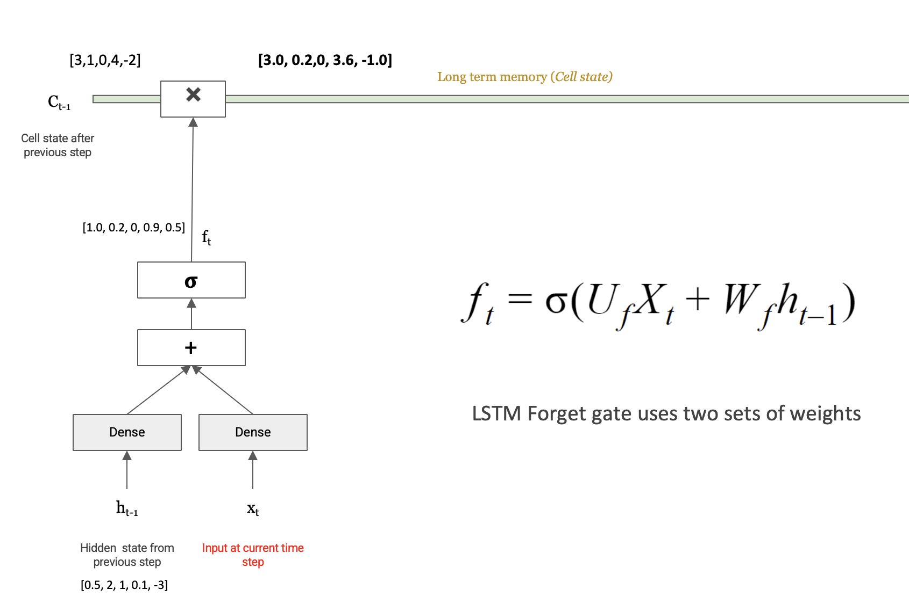

**Numerical example:**

$$f_t = \sigma(U_f X_t + W_f h_{t-1}) = [1.0,\ 0.2,\ 0,\ 0.9,\ 0.5]$$

The forget gate output $f_t$ is then multiplied element-wise with the previous cell state $C_{t-1}$:

$$C_{t-1} \odot f_t = [3,1,0,4,-2] \odot [1.0, 0.2, 0, 0.9, 0.5] = [3.0,\ 0.2,\ 0,\ 3.6,\ -1.0]$$

> The third element of $C_{t-1}$ was 0 — and $f_t[2] = 0$ — so that slot is **erased**. Elements with $f_t$ near 1 are **kept unchanged**. This is the forget operation.

---

## **Input Gate** — decides what new information to write to the cell state

The input gate is responsible for **adding new information** to long-term memory. It works in two parallel steps:

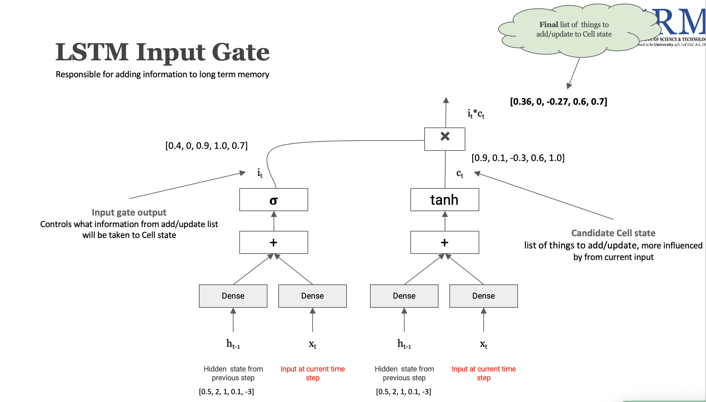

**Step 1 — How much to add** (Input gate output $i_t$):

$$i_t = \sigma(U_i X_t + W_i h_{t-1})$$

- Output is in $[0, 1]$: controls which positions in the cell state will be updated
- $i_t = [0.4,\ 0,\ 0.9,\ 1.0,\ 0.7]$ — position 2 is blocked (0), positions 3 & 4 are fully open

**Step 2 — What to add** (Candidate cell state $\hat{c}_t$):

$$\hat{c}_t = \tanh(U_c X_t + W_c h_{t-1})$$

- Output is in $[-1, 1]$: the actual new content proposed for the cell state
- $\hat{c}_t = [0.9,\ 0.1,\ -0.3,\ 0.6,\ 1.0]$ — the candidate values influenced by the current input

The actual addition to the cell state is the element-wise product $i_t \odot \hat{c}_t$:

$$i_t \odot \hat{c}_t = [0.4, 0, 0.9, 1.0, 0.7] \odot [0.9, 0.1, -0.3, 0.6, 1.0] = [0.36,\ 0,\ -0.27,\ 0.6,\ 0.7]$$

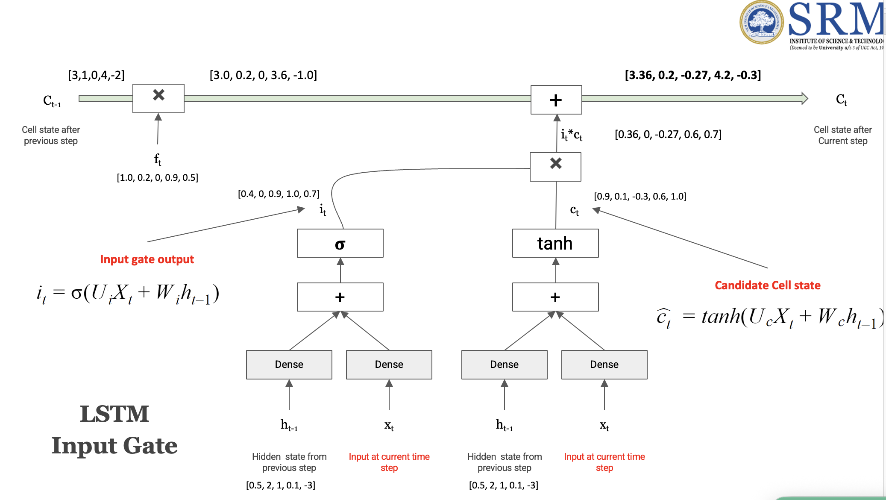

---

## **New Cell State** — combining forget + input

After applying both gates, the updated cell state $C_t$ is:

$$C_t = C_{t-1} \cdot f_t + i_t \cdot \hat{c}_t$$

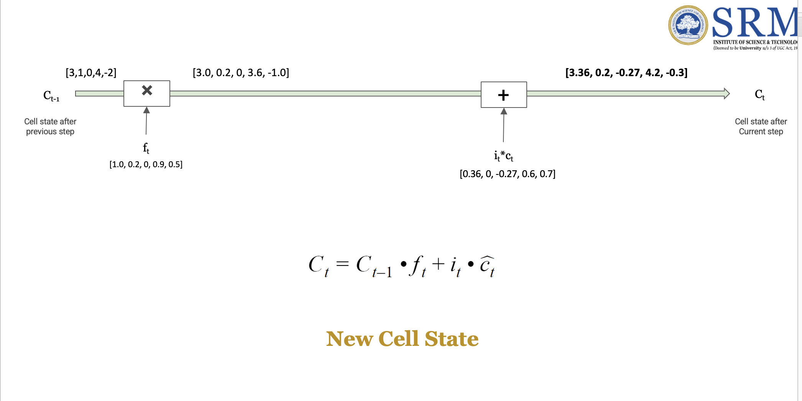

**Numerical example end-to-end:**

$$C_t = \underbrace{[3.0,\ 0.2,\ 0,\ 3.6,\ -1.0]}_{\text{kept from } C_{t-1}} + \underbrace{[0.36,\ 0,\ -0.27,\ 0.6,\ 0.7]}_{\text{new information}} = [3.36,\ 0.2,\ -0.27,\ 4.2,\ -0.3]$$

> This is $C_t$ — the updated long-term memory after processing the current word. It flows unchanged along the cell state highway to the next time step (unless the next forget gate erases something).


## **Output Gate** — decides what to read out as the hidden state

The output gate determines what information from the updated cell state $C_t$ should be exposed as the new hidden state $h_t$ — which is both **passed to the output layer** and **fed back** into the next time step.

$$o_t = \sigma(U_o X_t + W_o h_{t-1})$$

- $U_o$ — weight matrix for the **input** path
- $W_o$ — weight matrix for the **hidden state** path
- $\sigma$ — sigmoid, output in $[0, 1]$: controls which parts of the cell state to expose

The hidden state is then computed by squashing $C_t$ and gating it:

$$h_t = o_t \odot \text{tanh/ReLU}(C_t)$$

The cell state is first passed through an **activation function** (tanh squashes to $[-1,1]$, ReLU clips negatives to 0), then the output gate $o_t$ decides which values to let through.

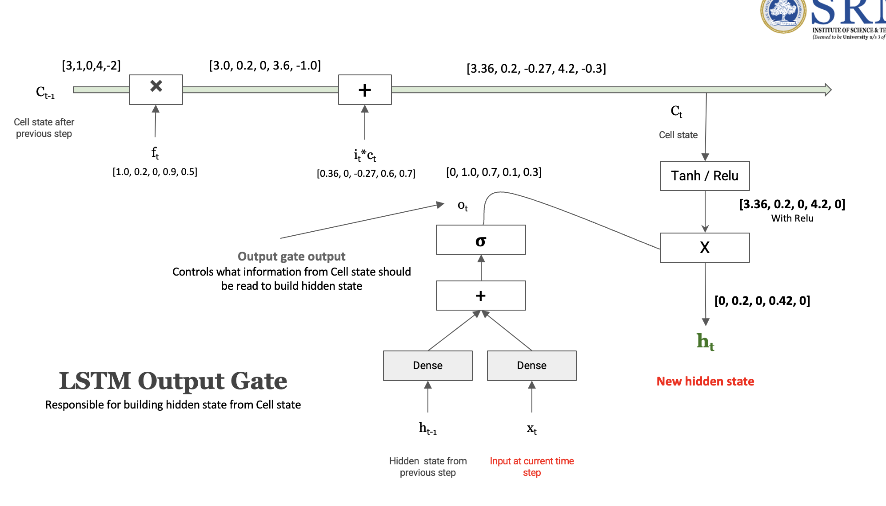

**Numerical example:**

$$o_t = [0,\ 1.0,\ 0.7,\ 0.1,\ 0.3]$$

Cell state from previous step: $C_t = [3.36,\ 0.2,\ -0.27,\ 4.2,\ -0.3]$

With **ReLU** (negatives → 0):

$$\text{ReLU}(C_t) = [3.36,\ 0.2,\ 0,\ 4.2,\ 0]$$

Final hidden state:

$$h_t = o_t \odot \text{ReLU}(C_t) = [0,\ 1.0,\ 0.7,\ 0.1,\ 0.3] \odot [3.36,\ 0.2,\ 0,\ 4.2,\ 0] = [0,\ 0.2,\ 0,\ 0.42,\ 0]$$

> $h_t = [0, 0.2, 0, 0.42, 0]$ — the new hidden state. Positions where $o_t = 0$ are fully blocked regardless of what's in $C_t$. This is what gets passed to the output layer **and** looped back as $h_{t-1}$ for the next word.


## LSTM Summary - Putting it all together LSTM Cell Structure

### 1. Two States (Memory)

| State | Role |
|---|---|
| **Cell State** $C_t$ | Long-term memory — carries information across many steps with minimal modification |
| **Hidden State** $h_t$ | Short-term / working memory — a filtered version of the cell state, used to build the final output |

> The key innovation of LSTM is keeping these two streams **separate**. The cell state acts as a highway — information can flow through many steps almost unchanged. The hidden state is a compressed, gated snapshot of that highway.

---

### 2. Three Gates

A **gate** controls the flow of information to/from the cell state. Each gate is a sigmoid-activated Dense layer — its output is in $[0, 1]$, acting as a soft switch:

| Gate | Controls | Formula |
|---|---|---|
| **Forget Gate** | What to erase from long-term memory (cell state) | $f_t = \sigma(U_f X_t + W_f h_{t-1})$ |
| **Input Gate** | What new information to write into long-term memory | $i_t = \sigma(U_i X_t + W_i h_{t-1})$ |
| **Output Gate** | What from the cell state should be exposed as the hidden state | $o_t = \sigma(U_o X_t + W_o h_{t-1})$ |

Each gate takes the same two inputs — the current word $X_t$ and the previous hidden state $h_{t-1}$ — and independently decides how much of its target to allow through.

---

### End-to-End Flow (one time step)

**Input:** $X_t$ (current word), $h_{t-1}$ (prev hidden), $C_{t-1}$ (prev cell state)

**1. Forget Gate** → $[0,1]$ — "what to erase"
$$f_t = \sigma(U_f \cdot X_t + W_f \cdot h_{t-1})$$

**2. Input Gate** → $[0,1]$ — "how much to write"
$$i_t = \sigma(U_i \cdot X_t + W_i \cdot h_{t-1})$$

**Candidate cell state** → $[-1,1]$ — "what to write"
$$\hat{c}_t = \tanh(U_c \cdot X_t + W_c \cdot h_{t-1})$$

**3. New Cell State** → updated long-term memory
$$C_t = C_{t-1} \odot f_t + i_t \odot \hat{c}_t$$

**4. Output Gate** → $[0,1]$ — "what to expose"
$$o_t = \sigma(U_o \cdot X_t + W_o \cdot h_{t-1})$$

**5. Hidden State** → new working memory / output
$$h_t = o_t \odot \tanh(C_t)$$

**Numerical recap with our example values:**

| Step | Operation | Result |
|---|---|---|
| Initial | $C_{t-1}, h_{t-1}$ | $[3,1,0,4,-2],\ [0.5,2,1,0.1,-3]$ |
| Forget | $C_{t-1} \odot f_t$ | $[3.0, 0.2, 0, 3.6, -1.0]$ |
| Input | $i_t \odot \hat{c}_t$ | $[0.36, 0, -0.27, 0.6, 0.7]$ |
| New Cell | $C_t$ | $[3.36, 0.2, -0.27, 4.2, -0.3]$ |
| Output | $h_t = o_t \odot \text{ReLU}(C_t)$ | $[0, 0.2, 0, 0.42, 0]$ |

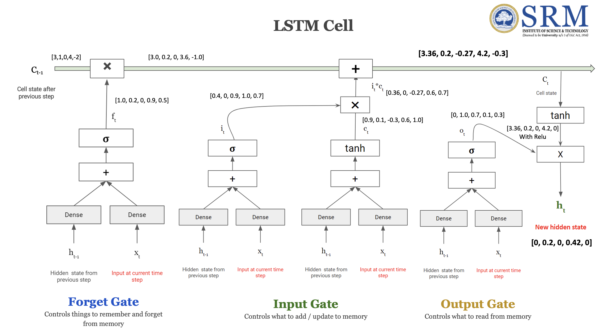
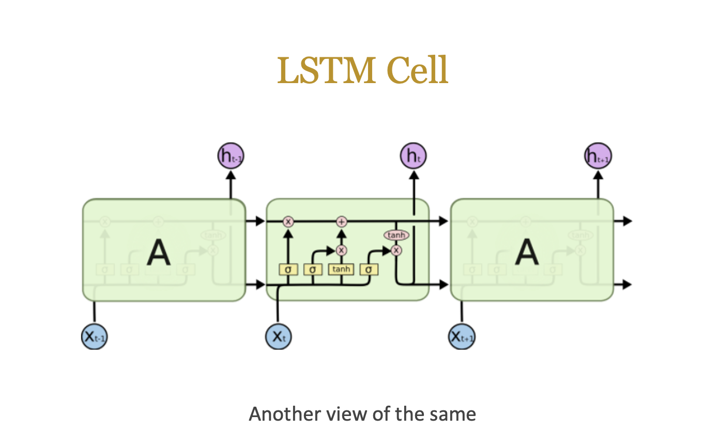

> **LSTM's ability to maintain long-term dependencies** comes from the cell state and gating mechanism. The cell state can carry information across many steps with minimal modification, while the gates allow the model to selectively remember or forget information as needed. This is why LSTMs are much better than standard RNNs at handling long sequences and complex patterns in data.

## Backpropagation Through Time (BPTT) in LSTM

### Why LSTM Gradient is Different from RNN

#### Simple RNN Gradient

In a **simple RNN**, the gradient of the loss flows back through the hidden states, and each step multiplies by the **same** weight matrix $W$:

$$\frac{dLoss}{dW} = \frac{dLoss}{dO_{t+3}} \cdot \frac{dO_{t+3}}{dS_{t+3}} \cdot \underbrace{W \cdot W \cdot W}_{\text{same } W \text{ repeated}} \cdot \frac{dS_t}{dW}$$

> Repeatedly multiplying by the same $W$ — if $|W| < 1$, gradients **vanish** to zero → early words contribute nothing. If $|W| > 1$, gradients **explode** → training diverges.

#### LSTM Gradient (cell state path)

In LSTM over 4 steps, the gradient chain through the cell state is:

$$\frac{dLoss}{dw} = \frac{dLoss}{dO} \cdot \frac{dO}{dh_4} \cdot \frac{dh_4}{dc_4} \cdot \underbrace{\frac{dc_4}{dc_3} \cdot \frac{dc_3}{dc_2} \cdot \frac{dc_2}{dc_1}}_{\text{each} = f_t + \frac{d(i_t \cdot \hat{c}_t)}{dc_{t-1}} \text{ — different at every step}} \cdot \frac{dc_1}{dw}$$

| | Simple RNN | LSTM |
|---|---|---|
| Gradient path | Through hidden state $S_t$ | Through **cell state** $C_t$ |
| Per-step multiplier | Same $W$ every step | $f_t + \text{input term}$ — **different each step** |
| Value range | Fixed — depends entirely on $\|W\|$ | Learned — can be $< 1$ or $> 1$, varies |
| Result | Vanish or explode | Controlled, stable gradient flow |

> The key insight: $\frac{dc_t}{dc_{t-1}} = f_t + \frac{d(i_t \cdot \hat{c}_t)}{dc_{t-1}}$ is never the same fixed number repeated. Each step is different, which breaks the geometric decay/growth pattern that causes vanishing/exploding gradients in RNNs.

---

### Gradient via the Cell State Highway

In LSTM, gradients travel back through the **cell state** $C_t$ instead of just the hidden state. Starting from $C_t = C_{t-1} \cdot f_t + i_t \cdot \hat{c}_t$, differentiating with respect to $C_{t-1}$:

$$\frac{dC_t}{dC_{t-1}} = f_t + \frac{d(i_t \cdot \hat{c}_t)}{dC_{t-1}}$$

| Term | What it is | Value range |
|---|---|---|
| $f_t$ | Forget gate output | $[0, 1]$ — **learned**, varies per step |
| $\frac{d(i_t \cdot \hat{c}_t)}{dC_{t-1}}$ | Additional gradient from input gate | Can be any value — **different at each time step** |

> Together, these two terms are never the same fixed number repeated across steps. This is exactly what prevents the repeated-$W$ collapse seen in simple RNNs.

---

### Full LSTM Gradient (4 steps, cell state path)

$$\frac{dLoss}{dw} = \frac{dLoss}{dO} \cdot \frac{dO}{dh_4} \cdot \frac{dh_4}{dc_4} \cdot \underbrace{\frac{dc_4}{dc_3} \cdot \frac{dc_3}{dc_2} \cdot \frac{dc_2}{dc_1}}_{\text{circled — each } = f_t + \text{input term}} \cdot \frac{dc_1}{dw}$$

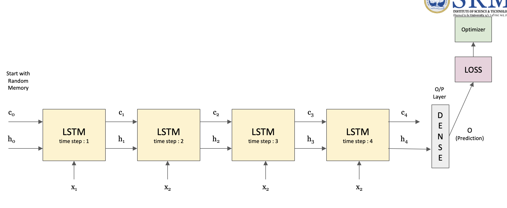

Breaking down each term in the chain:

| Term | Meaning |
|---|---|
| $\frac{dLoss}{dO}$ | How wrong was the output prediction? |
| $\frac{dO}{dh_4}$ | How did the output depend on the last hidden state? |
| $\frac{dh_4}{dc_4}$ | How did the hidden state depend on the cell state at step 4? |
| $\frac{dc_4}{dc_3},\ \frac{dc_3}{dc_2},\ \frac{dc_2}{dc_1}$ | **Cell state gradients** — each = $f_t + \frac{d(i_t \cdot \hat{c}_t)}{dc_{t-1}}$, different at each step |
| $\frac{dc_1}{dw}$ | How did the earliest cell state depend on $w$ directly? |

The circled terms ($\frac{dc_4}{dc_3} \cdot \frac{dc_3}{dc_2} \cdot \frac{dc_2}{dc_1}$) are the key difference — each one can be **less than 1 or greater than 1**, and each is a **different value** (not the same $W$ repeated). This diversity of values across steps is what reduces the chance of the gradient collapsing to zero.

> **Together, these gradient terms allow LSTM to reduce the vanishing gradient problem.** The forget gate $f_t$ provides a direct, learned scaling of the gradient at each step — the model can learn to keep $f_t$ close to 1 when it needs to preserve gradient flow over a long range.


### Application of LSTM: 
- Named Entity Recognition (NER)
- Machine Translation
- Part-of-Speech Tagging
- Question Answering systems 

---

## Stacked LSTM
To increase the model's capacity, we can stack multiple LSTM layers on top of each other. In a **stacked LSTM**, the hidden state output from one LSTM layer becomes the input to the next LSTM layer at the same time step.

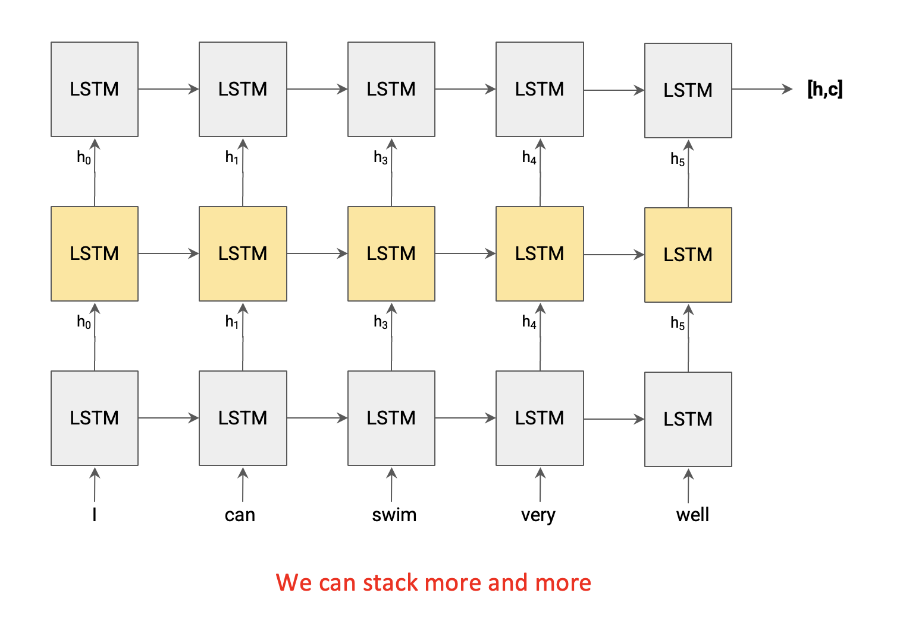

---

# Seq2Seq Model (Sequence-to-Sequence)

A **Seq2Seq model** is used for tasks where both the input and output are sequences of potentially different lengths — the classic example is **machine translation** (e.g., "It is a book." → "यह किताब है।").

It consists of two components:

| Component | Role |
|---|---|
| **Encoder** | Reads the source sequence word by word and compresses the entire sentence into a single fixed-size vector called the **Sentence Embedding** |
| **Decoder** | Takes the Sentence Embedding and generates the target sequence word by word |

The encoder and decoder are each typically an LSTM (or stacked LSTMs).

---

## Modified Seq2Seq — Teacher Forcing

In the basic model, the decoder only receives the sentence embedding from the encoder. This makes training slow and error-prone — if the decoder generates a wrong word, the error compounds through the rest of the sequence.

**The fix:** feed the **target language sequence** as a second input to the decoder during training. This technique is called **Teacher Forcing**.

- **Input #1** (Encoder): Source language sequence padded to `max sentence length of source language`  
  e.g., `"It is a book."` as numbers
- **Input #2** (Decoder): Target sequence prefixed with `<start>` token, padded to `max sentence length of target language`  
  e.g., `<start> यह किताब है। <end>` as numbers
- **Output** (Decoder): Target sequence **shifted by one time step** — each position predicts the next word  
  e.g., `यह किताब है। <end>`

> The decoder receives what the correct output should have been at each step (not its own previous prediction), which stabilises training significantly.

---

## Input and Output Sizes

| | What it is | Size |
|---|---|---|
| **Input #1** | Source language sequence | `max_source_len` numbers per example |
| **Input #2** | Target language sequence (`<start>` … `<end>`) | `max_target_len` numbers per example |
| **Output** | Target language words (shifted by 1 step) | `max_target_len × target_vocab_size` |

**Two key output questions:**
1. **How many words to predict?** — as many as `max_target_len` (one prediction per time step)
2. **How many numbers per word prediction?** — as many as `target_vocab_size` (Softmax over full vocabulary, same logic as any language model)

So the output is a **3D tensor**: `(batch_size, max_target_len, target_vocab_size)`.

---

## Training Flow
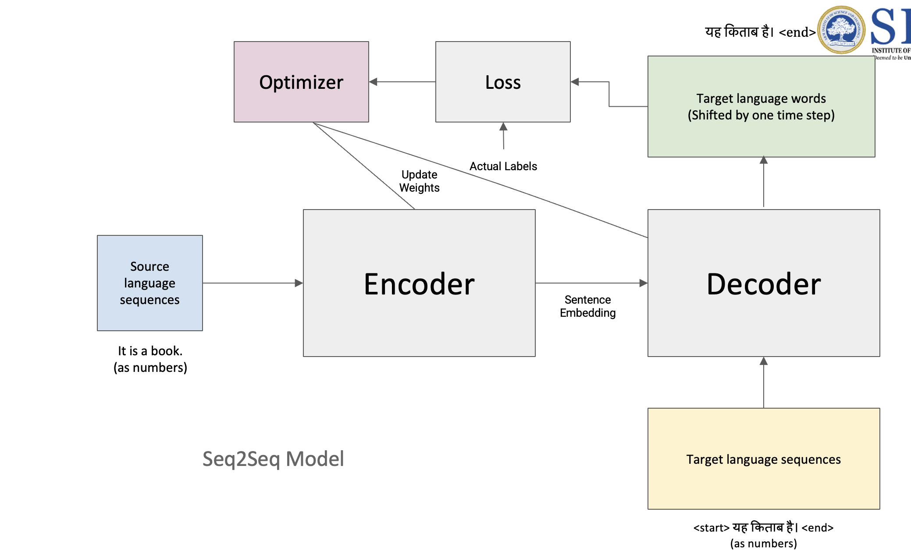
- **Actual labels** are the target sequence shifted by one step — same shape as the output (`max_target_len × target_vocab_size`), encoded as one-hot vectors
- The **Loss** (cross-entropy) compares the predicted probability distribution to the actual one-hot label at each time step
- The **Optimizer** uses the loss to update weights in both the encoder and decoder

### Building Encoder Model

The encoder is a chain of LSTM cells, one per time step of the source sequence. Here's how data flows through it:

1. **Padded Input Sequences** — the source sentence is padded to `max_source_len` (e.g. `[0, 0, …, 11, 5, 6, 70]` = 22 numbers for "It is a book.")
2. **Embedding Layer** — each integer token ID is looked up in an embedding matrix and converted to a dense vector (e.g. 128 floats per word). The embedding layer feeds every time step of the LSTM chain
3. **LSTM chain** — processes the embedded sequence step by step, passing both the **cell state** `c` and **hidden state** `h` forward at each step
4. **Sentence Embedding** — the output is the final `c` and `h` from the last LSTM cell. These two vectors together encode the entire source sentence and are passed to the decoder as its initial state

> **What is the Sentence Embedding?** It is the final cell state `C` and hidden state `h` produced by the encoder's last LSTM cell — a compressed representation of the entire source sentence.

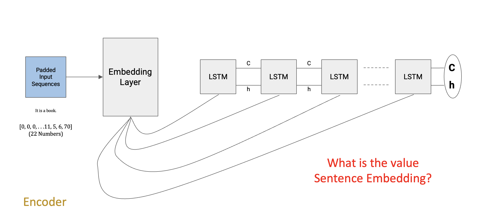

---

### Building Decoder Model

The decoder has the same structure as the encoder — an Embedding Layer followed by a chain of LSTM cells — but with two key differences:

1. **Input**: Padded target sequences (prefixed with `<start>`, e.g. `<start> यह किताब है। <end>` as numbers), fed through an Embedding Layer
2. **Initial State**: Instead of starting with zeros, the decoder's first LSTM cell is **initialised with the encoder's final `C` and `h`** (the Sentence Embedding). This is how the source language meaning is transferred to the decoder
3. **Output at each step**: Each LSTM cell's hidden state `h` is passed to a Dense + Softmax layer to predict the next target word (one probability distribution over the target vocabulary per time step)

```
Encoder final state ──→ C ─┐
                            ├──→ LSTM → LSTM → LSTM → ... → LSTM
Encoder final state ──→ h ─┘    ↑        ↑        ↑              ↑
                               emb[t=1] emb[t=2] emb[t=3]   emb[t=n]
                          (<start>)  (यह)     (किताब)   (है।)
```

> The decoder never sees the source sequence directly — it only receives the compressed meaning through the initial `C` and `h` states. At each step it predicts one word, guided by both the sentence embedding (via the carried state) and the previous correct target word (teacher forcing during training).

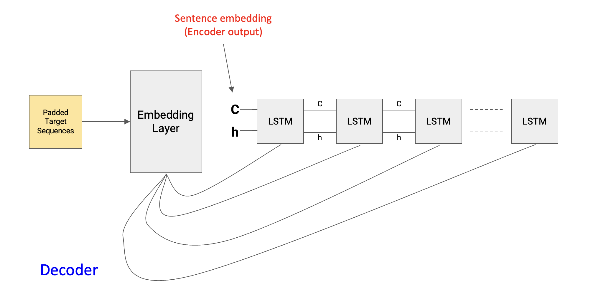

---

## Bidirectional LSTM (BiLSTM)

A standard LSTM only reads the sequence **left to right** — at any time step $t$, it only knows about words that came before it. But in many tasks (e.g. sentiment analysis, NER, translation encoding), the meaning of a word depends on **both past and future context**.

**Example:** In "I can swim very well" — understanding what "swim" means is helped by knowing "well" comes after it.

A **Bidirectional LSTM** solves this by running **two separate LSTM chains** over the same sequence simultaneously:

| Direction | Reads | Hidden state |
|---|---|---|
| **Forward LSTM** (→) | Left to right: I → can → swim → very → well | $\overrightarrow{h_t}$ |
| **Backward LSTM** (←) | Right to left: well → very → swim → can → I | $\overleftarrow{h_t}$ |

At each time step, the outputs of both LSTMs are **merged** (concatenated or summed) to produce a single representation that encodes context from both directions:

$$h_t = [\overrightarrow{h_t};\ \overleftarrow{h_t}]$$

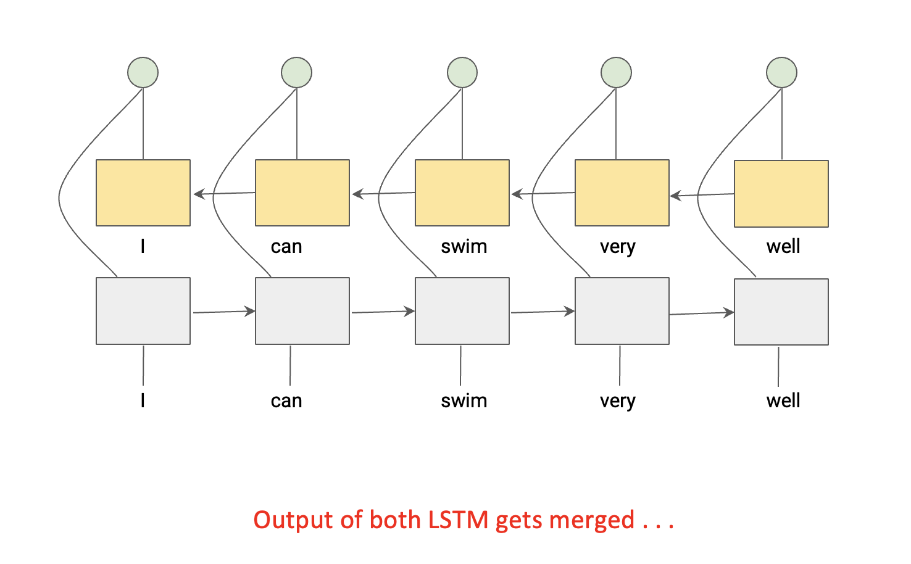

> Each word's representation now contains information about everything that came before **and** everything that comes after it. This is why BiLSTMs consistently outperform unidirectional LSTMs on tasks where full-sentence context matters.

**Note:** BiLSTMs can only be used where the full sequence is available at once (e.g. the encoder in a Seq2Seq model, or classification tasks). They **cannot** be used for generation/decoding, since future tokens are not yet known at inference time.

### N-Gram Language Models
An **N-gram language model** is a type of probabilistic model that predicts the next word in a sequence based on the previous N-1 words. The "N" in N-gram refers to the number of words considered in the context. For example, 
- Unigram (N=1): Predicts the next word based on no context (just the overall frequency of words). - "the" "rain" "stopped" "and" "the" "sky" "is"
- Bigram (N=2): Predicts the next word based on the previous word. - "the" → "rain", "rain" → "stopped", "stopped" → "and", etc.
- Trigram (N=3): Predicts the next word based on the previous two words. - "the rain" → "stopped", "rain stopped" → "and", etc.

N-gram models are simple and effective for many tasks, but they have limitations:
- They can only capture local context (up to N-1 words) and miss long-range dependencies.
- They require large amounts of data to estimate probabilities for rare N-grams, leading to sparsity issues.
- They do not generalize well to unseen N-grams, often assigning zero probability to sequences that were not in the training data.

#### How does the N-gram model work?
N-gram models work by counting the occurrences of N-grams in a large corpus of text and using these counts to estimate the probabilities of word sequences. The probability of a word given its context is calculated as:
$$P(w_n | w_{n-1}, w_{n-2}, ..., w_{n-N+1}) = \frac{C(w_{n-N+1}, ..., w_{n-1}, w_n)}{C(w_{n-N+1}, ..., w_{n-1})}$$
Where $C(w_{n-N+1}, ..., w_{n-1}, w_n)$ is the count of the N-gram in the training data, and $C(w_{n-N+1}, ..., w_{n-1})$ is the count of the (N-1)-gram context.

#### Potential issues with N-gram models:
- **Sparsity**: As N increases, the number of possible N-grams grows exponentially, leading to many N-grams having zero counts in the training data.
- **Lack of long-range context**: N-gram models cannot capture dependencies that span more than N-1 words, which can be crucial for understanding the meaning of a sentence.
- **Data inefficiency**: N-gram models require large amounts of data to accurately estimate probabilities, especially for higher-order N-grams.

# Sequence-to-Sequence (Seq2Seq) Models
A **Sequence-to-Sequence (Seq2Seq)** model is a type of neural network architecture designed to transform one sequence into another. It consists of two main components:
- **Encoder**: Processes the input sequence and encodes it into a fixed-length context vector (or a sequence of vectors).
- **Decoder**: Takes the context vector from the encoder and generates the output sequence, one token at a time.


## Bidirectional LSTM:
A **Bidirectional LSTM** is a type of recurrent neural network that processes the input sequence in both forward and backward directions. This allows the model to capture information from both past and future contexts, which can be particularly beneficial for tasks like language modeling, where understanding the full context of a sentence is crucial.

In a Bidirectional LSTM, there are two separate LSTM layers:
- **Forward LSTM**: Processes the sequence from the first token to the last token (left to right).
- **Backward LSTM**: Processes the sequence from the last token to the first token (right to left).

The outputs from both the forward and backward LSTMs are typically concatenated or combined in some way to create a richer representation of the input sequence. This allows the model to leverage information from both directions, improving its ability to understand the context and make predictions.

---

## Deep Bidirectional LSTM

We can go further by **stacking multiple BiLSTM layers** on top of each other. The first layer reads the raw word embeddings in both directions. The second layer then reads the *output of the first layer* — so instead of raw words, it sees richer features like phrase-level patterns. Each added layer lets the model pick up more abstract patterns.

**Example:** Translating "The agreement on the European Economic Area was signed in August."  
- Layer 1 BiLSTM: learns which words go together ("European Economic Area")  
- Layer 2 BiLSTM: learns the role of that phrase in the sentence structure ("subject of was signed")

> **Note:** Deep BiLSTM is only used in the **encoder** — the decoder still runs left-to-right since it generates words one at a time and can't see future tokens.

```
Input words:    "The"      "agreement"    "was"      "signed"
                  ↓             ↓            ↓            ↓
             [Embedding]  [Embedding]  [Embedding]  [Embedding]
                  ↓             ↓            ↓            ↓
Layer 1:  →[BiLSTM]→  →[BiLSTM]→  →[BiLSTM]→  →[BiLSTM]→   (forward →)
          ←[BiLSTM]←  ←[BiLSTM]←  ←[BiLSTM]←  ←[BiLSTM]←   (backward ←)
                  ↓             ↓            ↓            ↓
             [concat]     [concat]     [concat]     [concat]   ← richer features
                  ↓             ↓            ↓            ↓
Layer 2:  →[BiLSTM]→  →[BiLSTM]→  →[BiLSTM]→  →[BiLSTM]→   (forward →)
          ←[BiLSTM]←  ←[BiLSTM]←  ←[BiLSTM]←  ←[BiLSTM]←   (backward ←)
                  ↓             ↓            ↓            ↓
             [concat]     [concat]     [concat]     [concat]   ← even richer
                                                        ↓
                                              → to Decoder (C, h)
```

---

## The Bottleneck Problem

Even with a deep BiLSTM encoder, there's a fundamental issue: the entire source sentence is squeezed into a **single fixed-size vector** (the final `C` and `h`). The decoder then has to unpack a whole translation from just that one vector.

This works fine for short sentences — but for long or complex sentences, that one vector simply can't hold everything. Important details from early in the sentence get lost by the time the decoder produces the last few words.

> **Analogy:** Imagine summarising an entire novel into a single tweet, then asking someone to re-write the novel from just that tweet. The longer the novel, the worse the reconstruction.

This is the **bottleneck problem** — and it's the direct motivation for the **Attention Mechanism**.

```
Long source sentence:
"The agreement on the European Economic Area was signed in August."
   w1       w2      w3      w4        w5       w6   w7    w8    w9
    ↓        ↓       ↓       ↓         ↓        ↓    ↓     ↓     ↓
 [LSTM]→ [LSTM]→ [LSTM]→ [LSTM]→  [LSTM]→  [LSTM]→[LSTM]→[LSTM]→[LSTM]
                                                                    ↓
                                                          ┌─────────────────┐
                                                          │  single vector  │  ← all 9 words
                                                          │   C = [......] │     squeezed here
                                                          └────────┬────────┘
                                                                   ↓
                                                              [Decoder]
                                                           generates full
                                                           translation from
                                                           just this one vector

Early words (w1, w2, w3 ...) → easily forgotten by the time decoder reaches the last output words ❌
```

---

