# The Transformer
The Transformer is a powerful architecture for sequence-to-sequence tasks that **revolutionized NLP**. It was introduced in the paper "Attention Is All You Need" by Vaswani et al. in 2017. The key innovation of the Transformer is that it **relies entirely on attention mechanisms** to model relationships between words, without using any recurrent or convolutional layers. This allows it to process sequences in parallel, making it much faster to train and more effective at capturing long-range dependencies than previous models like RNNs and LSTMs.


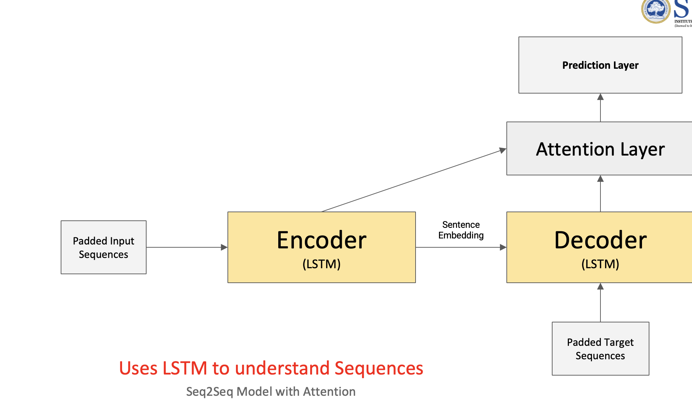

Key issues in working with the LSTM 
    - **Bottleneck**: The encoder compresses the entire source sentence into a single fixed-size vector (the final hidden state). This can lead to information loss, especially for long sentences, because the model has to squeeze all the relevant details into that one vector.
    - **Long-range dependencies**: The decoder relies heavily on the final encoder state, which may not capture all the necessary information from the source, especially for longer sentences. This can make it difficult for the model to generate accurate translations when the source sentence is long or complex.
    - **Sequential processing**: RNNs and LSTMs process sequences one step at a time, which can be slow and makes it harder to capture relationships between distant words in the source sentence.
    - It can not take advantage of parallel processing during training, which limits scalability and efficiency.

To overcome these issues, the Transformer uses an attention mechanism that allows the decoder to look back at all encoder hidden states at every step of decoding, rather than relying on a single summary vector. This enables the model to capture long-range dependencies more effectively and allows for much faster training by processing sequences in parallel.

In the given Image above the Encoder understand the sequence using self attention and the decoder uses the encoder output to generate the output sequence. The attention mechanism allows the model to focus on different parts of the input sequence when generating each word in the output, which helps to capture long-range dependencies and improves translation quality.

Lets consider an example "Siddharth played football and he scored a goal". The encoder will process this sentence and create hidden states for each word. When the decoder is generating the translation, it can look back at all the hidden states of the encoder to determine which words are most relevant for generating the next word in the output sequence. For instance, when generating the word "goal", the decoder might assign a high attention weight to the hidden state corresponding to "scored" and "football", as they are more relevant to the concept of scoring a goal. This allows the model to generate more accurate translations by effectively utilizing the information from the entire input sequence.

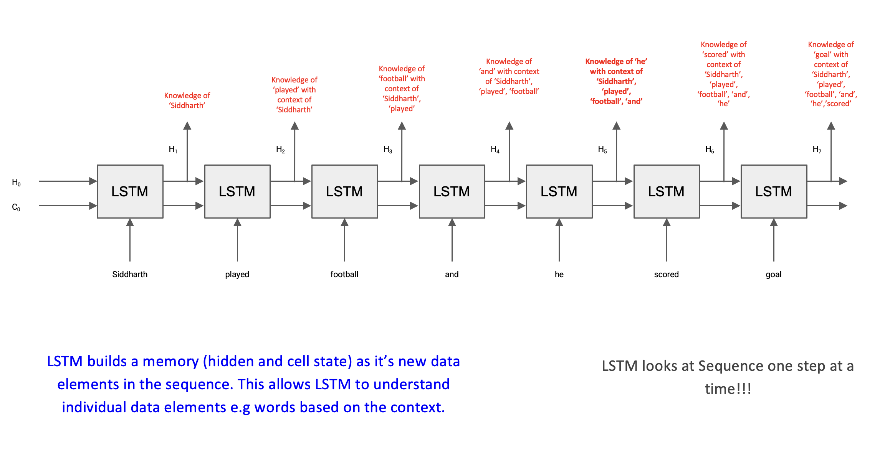
*The diagram shows how attention weights are distributed over encoder hidden states (one per source word) when the decoder generates each output word. Darker/higher weights indicate which source words the model is "focusing on" at that decode step — here, generating "goal" draws high attention to the states for "scored" and "football".*

# Attention Mechanism

The attention mechanism solves the bottleneck by letting the decoder **look back at every encoder step** when generating each output word — instead of relying on a single summary vector.

> **Analogy:** When translating a sentence, a human translator doesn't just glance at the source once and then write the whole translation from memory. They keep looking back at specific parts of the source as needed. Attention gives the model the same ability.

**Example:** Consider the sentence *"Siddharth played football and he scored a goal."*
- When the decoder generates the word **"goal"**, it doesn't rely on a single compressed summary. Instead, it looks back at all encoder hidden states and assigns high attention weights to the states for **"scored"** and **"football"** — the words most relevant to that output.
- When generating **"he"**, the model shifts focus toward **"Siddharth"** to resolve the pronoun reference.
- Each output word gets its own custom context, built fresh from whichever source words matter most at that step.

---

## How Attention Works

The encoder runs as normal and produces a **hidden state at every time step** (not just the final one). So for a 6-word sentence, the encoder outputs 6 hidden states — one per word.

When the decoder is about to generate word $i$, it **scores every encoder hidden state** — asking: *"how relevant is this source word to what I'm about to generate?"* Those scores are converted into weights that sum to 1, and the encoder states are mixed using those weights to produce a **dynamic context vector** — a custom summary focused on whatever the decoder needs right now.

```
Source:   "It   is   a    book"
Encoder:   h1   h2   h3   h4       ← one hidden state per word

Generating "किताब" (book):
  Score:   0.05  0.05  0.10  0.80   ← high score on h4 ("book")
  Weight:  0.05  0.05  0.10  0.80   ← normalised to sum to 1
  Context = 0.05×h1 + 0.05×h2 + 0.10×h3 + 0.80×h4  ← focused on "book"
```

> Each decoder step gets its own fresh context vector — the model dynamically shifts focus as it generates each word.

```
Source sentence:  "Siddharth  played   football   and    he   scored   a    goal"
                       ↓         ↓          ↓        ↓      ↓      ↓     ↓     ↓
Encoder hidden:       h1        h2         h3        h4     h5     h6    h7    h8

         ┌──────────────────────────────────────────────────────────────────────┐
         │           Attention Scoring  (decoder generating: "goal")            │
         └──────────────────────────────────────────────────────────────────────┘
                       ↓         ↓          ↓        ↓      ↓      ↓     ↓     ↓
  Raw scores:        0.05      0.05        0.30     0.05   0.05   0.35  0.05  0.10
  Softmax →          0.04      0.04        0.25     0.04   0.04   0.31  0.04  0.24  (sum=1)
                       └─────────┴──────────┴────────┴──────┴──────┴─────┴─────┘
                                                      ↓
                    Context = 0.04×h1 + ... + 0.25×h3 + 0.31×h6 + 0.24×h8
                                              ↑"football"  ↑"scored"  ↑"goal"
                                                      ↓
                                        [Decoder hidden state]
                                                      ↓
                                        Dense + Softmax → predicts "goal"
```

In the Transformer model the encoder has two types of layer 

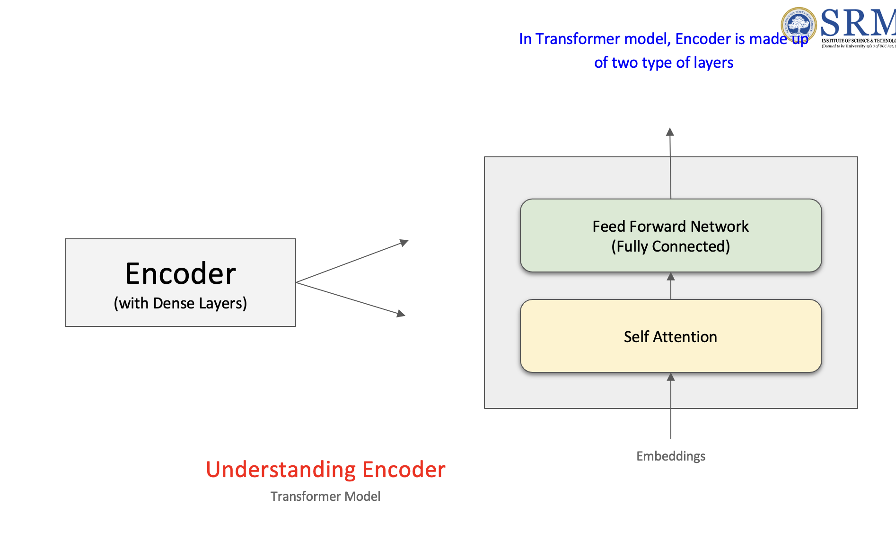


1) **Self-Attention**: Each word attends to all other words in the same sentence, allowing the model to capture relationships between words regardless of their position. This is done in parallel for all words, making it efficient.
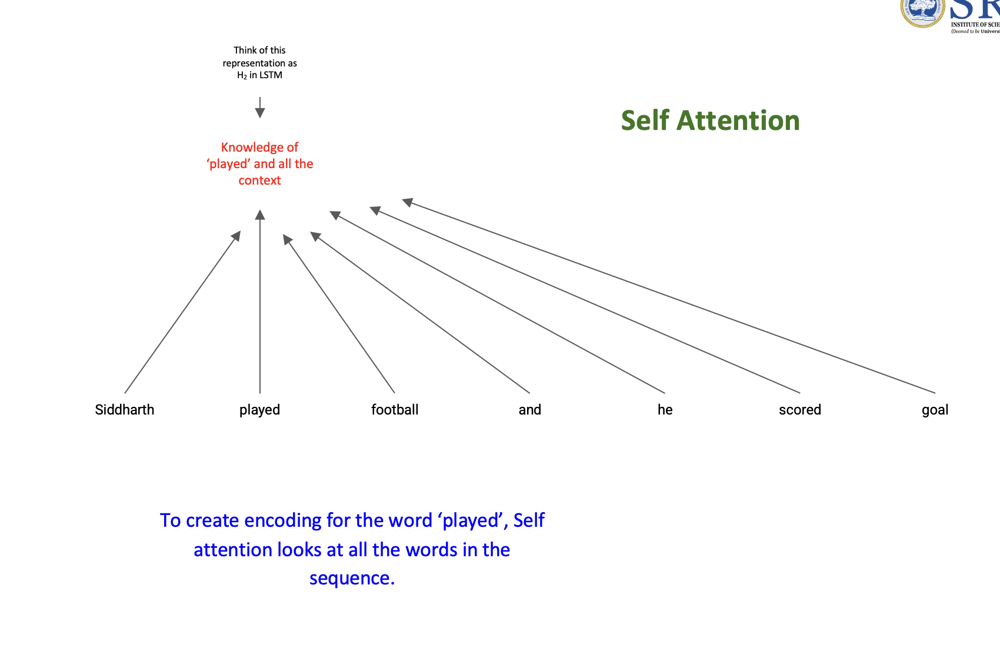
2) **Feed-Forward Networks**: After the self-attention layer, there is a fully connected feed-forward network that processes the output of the attention layer. This helps to further transform the representations before passing them to the next layer.

---

## Implementing Self Attention
The self-attention mechanism computes attention scores for each word in the input sentence with respect to every other word. This allows the model to capture dependencies between words regardless of their position in the sentence.

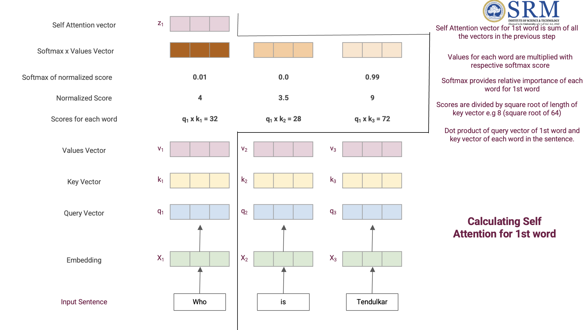

**Step-by-step: Self-Attention for the 1st word "Who"**

Use the sentence: *"Who is Tendulkar"*

Each word's embedding is projected into three vectors:
- **Q (Query)** — "what am I looking for?"
- **K (Key)** — "what do I offer to others?"
- **V (Value)** — "what information do I actually pass on?"

**Step 1 — Compute raw scores (dot product of q₁ with every Key)**
The query of the 1st word ("Who") is scored against the key of every word in the sentence:
```
q1 × k1  =  32    ("Who"      — how much does "Who" attend to itself?)
q1 × k2  =  28    ("is"       — how much does "Who" attend to "is"?)
q1 × k3  =  72    ("Tendulkar"— how much does "Who" attend to "Tendulkar"?)
```
"Tendulkar" scores highest — makes sense, "Who" is asking about a person and "Tendulkar" is the answer.

**Step 2 — Normalize the scores**
Divide each score by √(key vector dimension). Key dim = 64, so divide by 8:
```
32 / 8 = 4.0
28 / 8 = 3.5
72 / 8 = 9.0
```
*Scaling prevents very large dot products from pushing softmax into regions with tiny gradients.*

**Step 3 — Softmax → attention weights**
```
softmax([4.0, 3.5, 9.0])  →  [0.01,  0.0,  0.99]   (approx, sum = 1)
```
"Who" attends almost entirely to "Tendulkar" (0.99) — the model correctly identifies that "Tendulkar" is most relevant to the question word "Who".

**Step 4 — Multiply weights by Value vectors**
```
0.01 × v1   →  very small weighted vector  (from "Who")
0.00 × v2   →  ~zero contribution          (from "is")
0.99 × v3   →  dominant weighted vector    (from "Tendulkar")
```

**Step 5 — Sum the weighted Values → Self-Attention output z₁**
```
z1 = 0.01×v1 + 0.00×v2 + 0.99×v3
```
`z1` is the new enriched representation of "Who" — it now carries strong information about "Tendulkar", which is exactly the context needed to understand the question.

**Step 6 — Repeat for every word in parallel**
The same Q·K·V calculation runs simultaneously for "is" (q2) and "Tendulkar" (q3), each producing their own self-attention output vectors z2 and z3. All three run at the same time — this parallelism is why Transformers train much faster than LSTMs.

```
Input:   "Who"     "is"     "Tendulkar"
            ↓         ↓           ↓
          [x1]      [x2]        [x3]       ← Word Embeddings
            ↓         ↓           ↓
     ┌──────────────────────────────┐
     │       Self Attention Layer   │      ← Q·K·V computed for all words simultaneously
     └──────────────────────────────┘
            ↓         ↓           ↓
          [z1]      [z2]        [z3]       ← Self Attention vectors (context-aware)
```

---

### From Self-Attention Vectors to Encoder Embeddings

After the self-attention layer produces z1, z2, z3, these vectors are passed through a **Feed Forward Network (FFN)**. The FFN is the same network applied independently to each word's vector. It adds more transformation capacity — think of it as a refinement step after context has been gathered.

```
          [z1]      [z2]        [z3]       ← Self Attention vectors
            ↓         ↓           ↓
     ┌──────────────────────────────┐
     │     Feed Forward Network     │      ← Same FFN applied to each word independently
     └──────────────────────────────┘
            ↓         ↓           ↓
          [r1]      [r2]        [r3]       ← Encoder Embeddings (final encoder output per word)
```

> r1, r2, r3 are the **encoder embeddings** — the final rich representations of each word that capture both the word's meaning and its full sentence context. These are passed to the decoder.

---

### Multi-Head Self-Attention & Skip Connections

The encoder doesn't use just one self-attention layer — it uses **multiple self-attention layers stacked** (called **Multi-Head Attention**). Each head has its own independent Q, K, V weight matrices, so each head can learn to focus on different relationships simultaneously.

> **Example:** One head might learn that "Who" relates to "Tendulkar" (question-answer relation), while another head learns positional relationships like "is" connects "Who" and "Tendulkar" grammatically.

Both the Self-Attention layer and the Feed Forward Network use **skip connections (residual connections)** — the input is added back to the output before normalisation:

```
Output = LayerNorm( input + SubLayer(input) )
         ↑ "Add & Normalize" — stabilises training and helps gradients flow
```

This is why you see the "Add & Normalize" step in every encoder layer.

---

### The Full Transformer Model

Both the **Encoder** and **Decoder** contain Self-Attention and Feed Forward layers. The Decoder has one additional layer: **Encoder-Decoder Attention**, which allows it to look at the encoder's output while generating each word.

```
INPUT: "Who is Tendulkar"
         ↓
┌─────────────────────────┐
│        ENCODER          │
│  ┌───────────────────┐  │
│  │ Multi-Head        │  │
│  │ Self-Attention    │  │  ← each word attends to all other input words
│  └───────────────────┘  │
│  ┌───────────────────┐  │
│  │ Feed Forward Net  │  │  ← refines each word's representation
│  └───────────────────┘  │
│  (repeated × 6 layers)  │
└────────────┬────────────┘
             │  encoder embeddings r1, r2, r3
             ↓
┌─────────────────────────┐
│        DECODER          │
│  ┌───────────────────┐  │
│  │ Multi-Head        │  │
│  │ Self-Attention    │  │  ← decoder words attend to previous decoder outputs
│  └───────────────────┘  │
│  ┌───────────────────┐  │
│  │ Encoder-Decoder   │  │  ← decoder attends to encoder embeddings (cross-attention)
│  │ Attention         │  │
│  └───────────────────┘  │
│  ┌───────────────────┐  │
│  │ Feed Forward Net  │  │
│  └───────────────────┘  │
│  (repeated × 6 layers)  │
└────────────┬────────────┘
             ↓
      Prediction Layer
             ↓
    OUTPUT: "An Indian Cricketer"
```

> A standard Transformer (as in "Attention Is All You Need") has **6 encoder layers** and **6 decoder layers** stacked. The final encoder layer's output (r1, r2, r3) is fed into the Encoder-Decoder Attention of **every** decoder layer — so every decoder layer can directly consult the full source sentence context at every step.

---

## Attention Score & Weights

At each decode step, the model computes an **alignment score** between the current decoder state and each encoder hidden state. A higher score means *"this source word is more relevant right now."*

The scores are then passed through a softmax so they sum to 1 — these are the **attention weights**. The final context vector is a weighted sum of all encoder hidden states, with highly-relevant words contributing more.

> Think of the scores as a spotlight: at each step, the spotlight shines brighter on the source words that matter most for the current output word.

---

## Seq2Seq with Attention — Full Flow


**Encoding (same as before):**
1. Source sentence → Embedding → BiLSTM encoder → produces one hidden state per source word

**Decoding (with attention, different at each step):**
2. Decoder starts with encoder's final state as usual
3. At each decode step: compute attention scores against all encoder states → get attention weights → compute dynamic context vector
4. Context vector + decoder's current hidden state → Dense + Softmax → predict next word
5. Predicted word feeds into the next decode step

> The key difference from basic Seq2Seq: the decoder no longer relies on a single bottleneck vector. It gets a **fresh, focused context vector at every step**, computed by looking back at the entire source sentence through attention weights.

# BERT - Bidirectional Encoder Representations from Transformers
BERT is a pre-trained language model based on the Transformer architecture. It is designed to understand the context of words in a sentence by looking at both the left and right context (bidirectional). BERT is trained on a large corpus of text using two main tasks: Masked Language Modeling (MLM) and Next Sentence Prediction (NSP).

- **Masked Language Modeling (MLM)**: During training, some percentage of the input tokens are randomly masked, and the model is trained to predict the original token based on the context provided by the unmasked tokens. This allows BERT to learn deep bidirectional representations of language.
- **Next Sentence Prediction (NSP)**: During training, the model is given pairs of sentences and tasked with predicting whether the second sentence is the actual next sentence in the original text. This helps BERT understand the relationship between sentences, which is useful for tasks like question answering and natural language inference.

BERT has achieved state-of-the-art performance on a wide range of NLP tasks, including question answering, sentiment analysis, and named entity recognition. It has been widely adopted in the NLP community and has inspired many subsequent models based on the Transformer architecture.

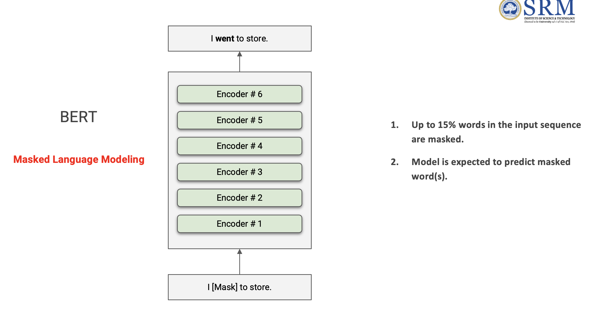
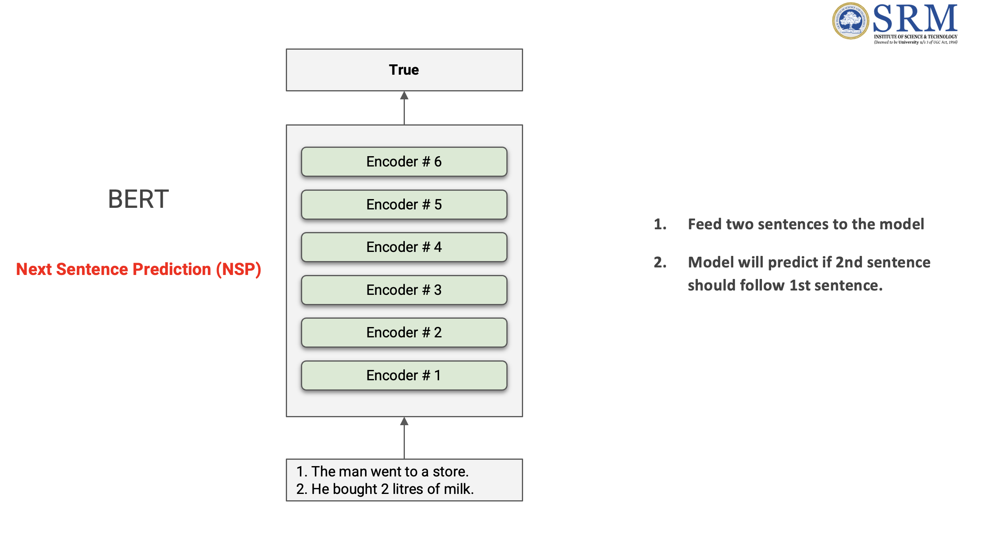

## BERT Architecture - Basic Flow

The BERT architecture uses a stack of Transformer encoder layers to process the input text. The input is tokenized and converted into embeddings, which are then passed through multiple layers of self-attention and feed-forward networks. The output from the final encoder layer can be used for various downstream tasks, such as classification or question answering.

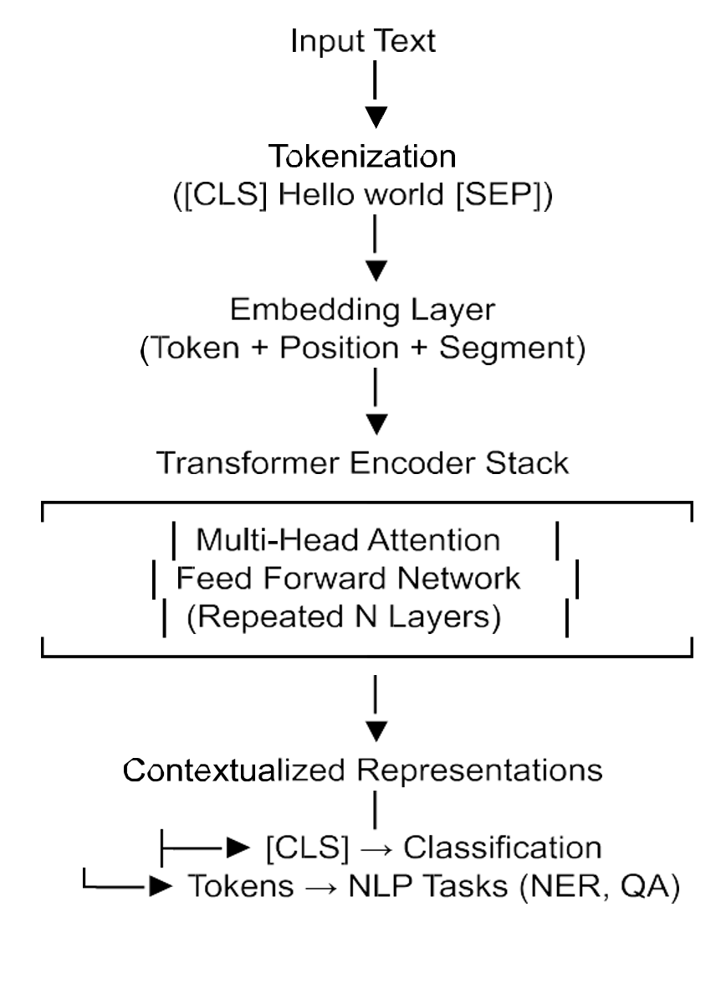

1) **Input and Tokenization**: The input text is tokenized and converted into embeddings. BERT uses a special tokenization method called WordPiece, which breaks words into subword units. Each token is represented as a combination of its token embedding, segment embedding (to distinguish between different sentences), and position embedding (to capture the order of tokens).
2) **Embedding Layers**: Embedding layers convert the input tokens into dense vectors that can be processed by the Transformer layers. The position embeddings allow the model to understand the order of words in the sentence, which is crucial for capturing meaning.
3) **Transformer Encoder Layers**: The input embeddings are passed through a stack of Transformer encoder layers. Each layer consists of a multi-head self-attention mechanism followed by a feed-forward neural network. The self-attention mechanism allows the model to capture relationships between all tokens in the input, while the feed-forward network helps to further process the information.
4) **Contextualized Representations**: After passing through the encoder layers, each token's representation is enriched with contextual information from the entire input sequence. This means that the representation of a word like "bank" will differ based on whether it appears in the context of a financial institution or a river.
5) **Output**: The output from the final encoder layer can be used for various downstream tasks. For example, for classification tasks, the output corresponding to the [CLS] token (a special token added at the beginning of the input) can be used as a representation of the entire input, which can then be fed into a classifier. For question answering tasks, the output can be used to predict the start and end positions of the answer span in the input text.

### Sentence classification with BERT

In sentence classification tasks, the output from the final encoder layer corresponding to the [CLS] token is used as a representation of the entire input sentence. This representation is then passed through a feed-forward neural network (often just a single linear layer) to produce a probability distribution over the possible classes.

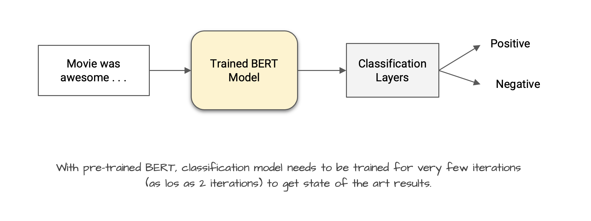

1) The input sentence is tokenized and converted into embeddings, which are then passed through the Transformer encoder layers.
2) The output corresponding to the [CLS] token is extracted from the final encoder layer.
3) This [CLS] token representation is fed into a feed-forward neural network, which produces a probability distribution over the classes.
4) The class with the highest probability is selected as the predicted label for the input sentence.

### XLNet - Generalized Autoregressive Pretraining for Language Understanding

**XLNet** improves on BERT by using **permutation-based training** and capturing bidirectional context **without masking**.

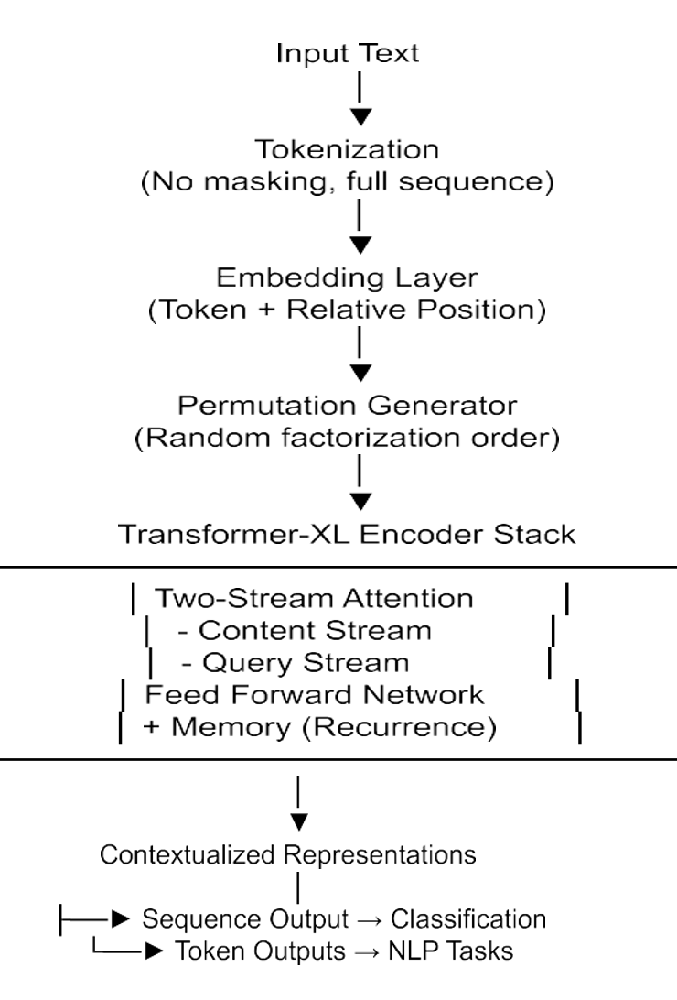

**Input Representation**
- Sentence is tokenized → words/subwords
- No `[MASK]` tokens used (unlike BERT)
- Uses **Token Embeddings** + **Position Embeddings** (relative positioning, not fixed)

**Core Architecture**
- Built on the **Transformer-XL** architecture
- Key components:
  - **Permutation Language Modeling** — instead of masking, the training order of tokens is randomly shuffled, so the model learns to predict each token from all possible contexts
  - **Two-Stream Self-Attention**:
    - *Content stream* — has access to the actual token at the current position
    - *Query stream* — can only see the position, not the token itself (used for prediction)
  - **Feed Forward Network** + **Memory/Recurrence** (carries context from previous segments, from Transformer-XL)

```
Input Text
    ↓
Tokenization
(No masking, full sequence)
    ↓
Embedding Layer
(Token + Relative Position)
    ↓
Permutation Generator
(Random factorization order)
    ↓
┌──────────────────────────────────┐
│   Transformer-XL Encoder Stack   │
│  ┌────────────────────────────┐  │
│  │ Two-Stream Attention       │  │
│  │  - Content Stream          │  │
│  │  - Query Stream            │  │
│  │ Feed Forward Network       │  │
│  │ + Memory (Recurrence)      │  │
│  └────────────────────────────┘  │
└──────────────────┬───────────────┘
                   ↓
    Contextualized Representations
                   ↓
    ├──► Sequence Output → Classification
    └──► Token Outputs   → NLP Tasks
```

**Context Understanding**
- Learns **bidirectional context via permutations** — sees both left and right context for every token without using `[MASK]`
- Avoids the masking limitations of BERT (BERT's `[MASK]` token never appears at inference time, causing a train/test mismatch)
- Captures **long-term dependencies** using Transformer-XL's recurrence memory

**Output**
- Produces **contextualized token representations** for every input token
- Used for:
  - Text classification (Sequence Output)
  - Question answering, NER, and other token-level NLP tasks (Token Outputs)


### BART Architecture - Bidirectional and Auto-Regressive Transformers for Sequence-to-Sequence Learning

**BART (Bidirectional and Auto-Regressive Transformers)** combines a **BERT-like encoder** and a **GPT-like decoder** for sequence-to-sequence tasks.

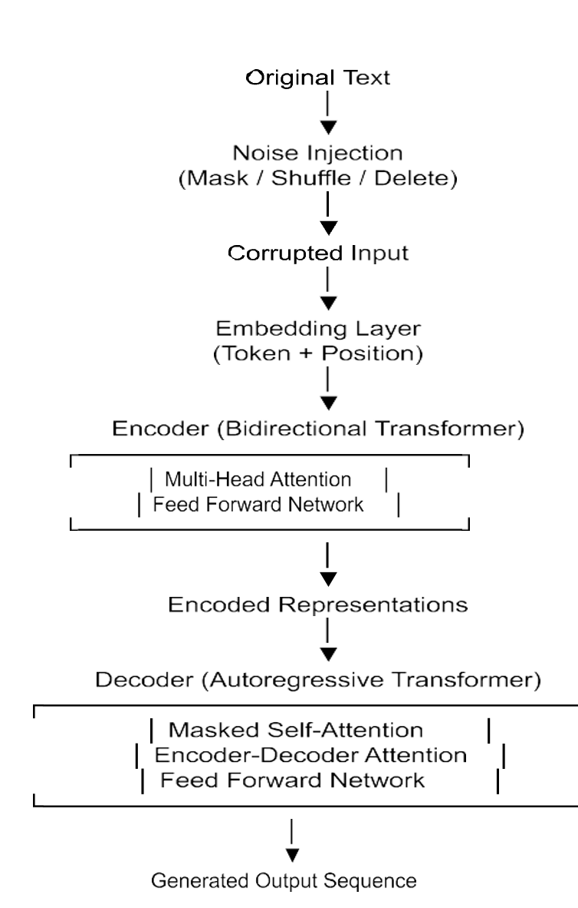

**Input Representation**
- Input text is **corrupted (noised)** before being fed to the encoder:
  - *Token masking* — some tokens are replaced with `[MASK]`
  - *Token deletion* — tokens are removed entirely
  - *Sentence shuffling* — the order of sentences is randomised
- Tokens are converted into **Token Embeddings** + **Position Embeddings**

**Core Architecture**
- **Encoder (Bidirectional Transformer)** — reads the entire (corrupted) input at once, like BERT
- **Decoder (Autoregressive Transformer)** — generates the output step-by-step, like GPT
- Each block includes:
  - Multi-Head Attention
  - Feed Forward Layers
  - Encoder–Decoder Attention (in the decoder only)

```
Original Text
    ↓
Noise Injection
(Mask / Shuffle / Delete)
    ↓
Corrupted Input
    ↓
Embedding Layer
(Token + Position)
    ↓
┌───────────────────────────────────┐
│  Encoder (Bidirectional Transformer) │
│  ┌─────────────────────────────┐  │
│  │ Multi-Head Attention        │  │  ← sees full corrupted input bidirectionally
│  │ Feed Forward Network        │  │
│  └─────────────────────────────┘  │
└──────────────────┬────────────────┘
                   ↓
        Encoded Representations
                   ↓
┌───────────────────────────────────┐
│  Decoder (Autoregressive Transformer) │
│  ┌─────────────────────────────┐  │
│  │ Masked Self-Attention       │  │  ← attends only to previous output tokens
│  │ Encoder-Decoder Attention   │  │  ← attends to encoder's representations
│  │ Feed Forward Network        │  │
│  └─────────────────────────────┘  │
└──────────────────┬────────────────┘
                   ↓
      Generated Output Sequence
```

**Context Understanding**
- Learns to **reconstruct the original text from corrupted input** — this is the denoising objective
- Captures both:
  - *Deep bidirectional context* (from the encoder)
  - *Sequential generation ability* (from the decoder)

**Output**
- Generates a **clean / reconstructed sequence**
- Used for:
  - Text summarization
  - Translation
  - Text generation


### Generative Pre-trained Transformer (GPT)

**GPT (Generative Pre-trained Transformer)** is a **unidirectional (autoregressive) Transformer decoder model** designed for text generation.

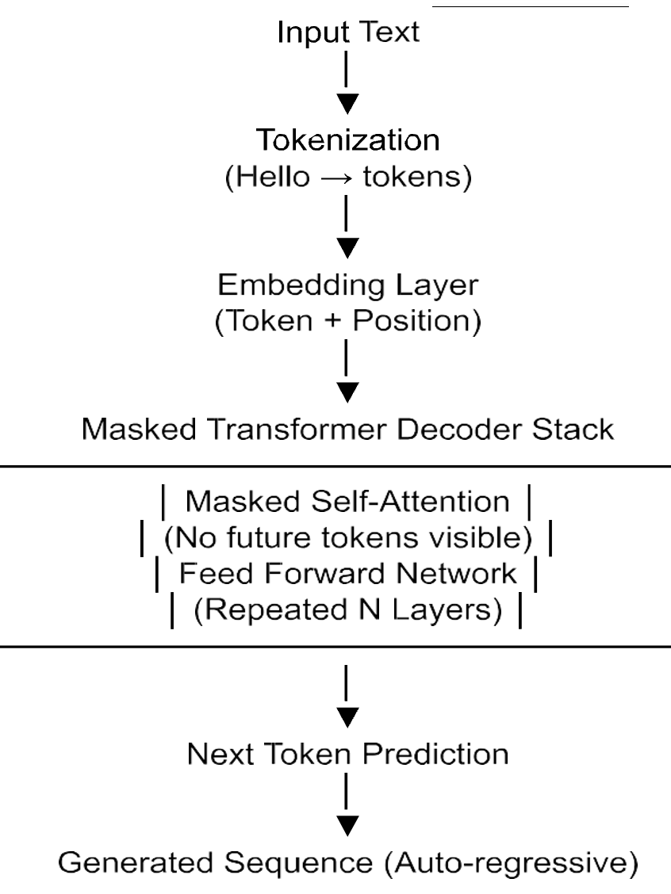

**Input Representation**
- Sentence is tokenized → sequence of tokens (e.g. "Hello" → tokens)
- Uses **Token Embeddings** + **Position Embeddings**
- Input is processed **left → right only** — no access to future tokens

**Core Architecture**
- Stack of **Transformer Decoder Layers**
- Each layer contains:
  - **Masked Multi-Head Self-Attention** — prevents the model from seeing future tokens (causal masking)
  - **Feed Forward Neural Network**
  - Residual connections + Layer Normalization

```
Input Text
    ↓
Tokenization
("Hello" → tokens)
    ↓
Embedding Layer
(Token + Position)
    ↓
┌──────────────────────────────────────┐
│   Masked Transformer Decoder Stack   │
│  ┌──────────────────────────────┐    │
│  │ Masked Self-Attention        │    │  ← no future tokens visible
│  │ (No future tokens visible)   │    │
│  │ Feed Forward Network         │    │
│  │ (Repeated N Layers)          │    │
│  └──────────────────────────────┘    │
└──────────────────┬───────────────────┘
                   ↓
        Next Token Prediction
                   ↓
    Generated Sequence (Auto-regressive)
```

**Context Understanding**
- Learns by predicting the **next token in the sequence**
- Captures context **sequentially (past → future)** only
- Strong at language generation tasks

**Output**
- Generates text **token-by-token** — each predicted token is fed back as input for the next step
- Used for:
  - Text generation
  - Chatbots
  - Code generation
  - Story writing

### Claude Architecture

**Claude (by Anthropic)** is a **decoder-only Transformer model** (similar to GPT) with a strong focus on **safety and alignment**.

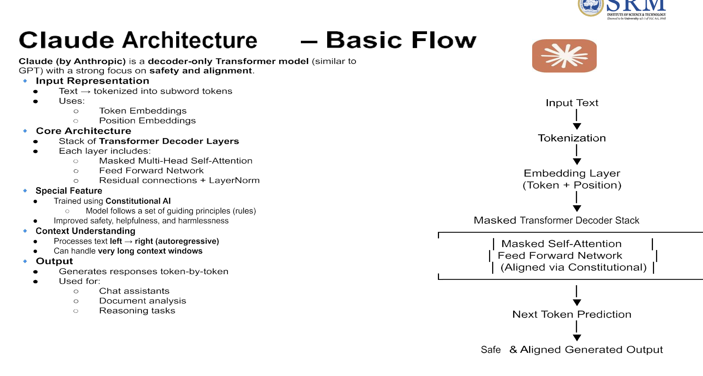

**Input Representation**
- Text → tokenized into subword tokens
- Uses **Token Embeddings** + **Position Embeddings**

**Core Architecture**
- Stack of **Transformer Decoder Layers**
- Each layer includes:
  - **Masked Multi-Head Self-Attention**
  - **Feed Forward Network**
  - Residual connections + LayerNorm

**Special Feature**
- Trained using **Constitutional AI** — the model follows a set of guiding principles (rules) to improve safety, helpfulness, and harmlessness
- This is what differentiates Claude from GPT despite having a similar architecture

**Context Understanding**
- Processes text **left → right (autoregressive)**
- Can handle **very long context windows**

```
Input Text
    ↓
Tokenization
    ↓
Embedding Layer
(Token + Position)
    ↓
┌──────────────────────────────────────┐
│   Masked Transformer Decoder Stack   │
│  ┌──────────────────────────────┐    │
│  │ Masked Self-Attention        │    │
│  │ Feed Forward Network         │    │
│  │ (Aligned via Constitutional) │    │
│  └──────────────────────────────┘    │
└──────────────────┬───────────────────┘
                   ↓
        Next Token Prediction
                   ↓
    Safe & Aligned Generated Output
```

**Output**
- Generates responses token-by-token
- Used for:
  - Chat assistants
  - Document analysis
  - Reasoning tasks

### Gemma Architecture

**Gemma (by Google)** is a family of **lightweight, efficient decoder-only Transformer models** designed for accessibility and performance.

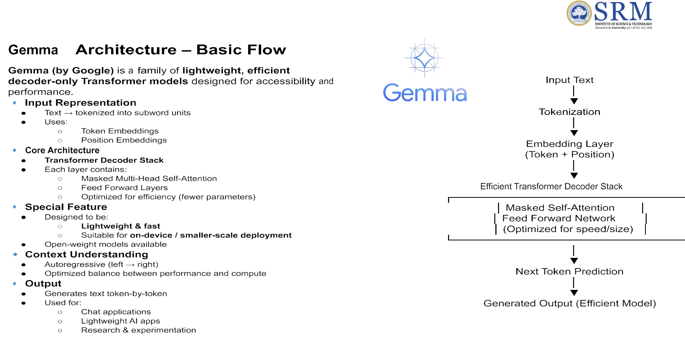

**Input Representation**
- Text → tokenized into subword units
- Uses **Token Embeddings** + **Position Embeddings**

**Core Architecture**
- **Transformer Decoder Stack**
- Each layer contains:
  - **Masked Multi-Head Self-Attention**
  - **Feed Forward Layers**
  - Optimized for efficiency (fewer parameters)

**Special Feature**
- Designed to be **lightweight & fast**
- Suitable for **on-device / smaller-scale deployment**
- Open-weight models available — can be run locally or fine-tuned freely

```
Input Text
    ↓
Tokenization
    ↓
Embedding Layer
(Token + Position)
    ↓
┌──────────────────────────────────────┐
│   Efficient Transformer Decoder Stack│
│  ┌──────────────────────────────┐    │
│  │ Masked Self-Attention        │    │
│  │ Feed Forward Network         │    │
│  │ (Optimized for speed/size)   │    │
│  └──────────────────────────────┘    │
└──────────────────┬───────────────────┘
                   ↓
        Next Token Prediction
                   ↓
    Generated Output (Efficient Model)
```

**Context Understanding**
- Autoregressive (left → right)
- Optimized balance between performance and compute

**Output**
- Generates text token-by-token
- Used for:
  - Chat applications
  - Lightweight AI apps
  - Research & experimentation


### Summary of Transformer Variants

| Model  | Architecture Type | Training Objective | Key Features | Use Cases |
|--------|------------------|--------------------|--------------|-----------|
| **BERT** | Encoder-only | Masked Language Modeling + Next Sentence Prediction | Bidirectional context; sees full sentence at once; uses `[MASK]` tokens | Classification, NER, Question Answering |
| **XLNet** | Encoder-only (Transformer-XL) | Permutation Language Modeling | Bidirectional context without masking; Two-Stream Attention (Content + Query); recurrence memory | Classification, QA, NER, Language Understanding |
| **BART** | Encoder-Decoder | Denoising Autoencoder (reconstruct corrupted input) | BERT-like encoder + GPT-like decoder; handles token masking, deletion, sentence shuffling | Summarization, Translation, Text Generation |
| **GPT** | Decoder-only | Autoregressive Language Modeling (next token prediction) | Unidirectional (left → right); Causal Masked Self-Attention; no encoder | Text Generation, Chatbots, Code Generation, Story Writing |
| **Claude** | Decoder-only | Autoregressive + Constitutional AI alignment | Same decoder structure as GPT; trained with guiding principles for safety & helpfulness; very long context window | Chat Assistants, Document Analysis, Reasoning Tasks |
| **Gemma** | Decoder-only (lightweight) | Autoregressive Language Modeling | Efficient, open-weight decoder; optimized for speed and smaller parameter count; suitable for on-device deployment | Chat Applications, Lightweight AI Apps, Research & Experimentation |


